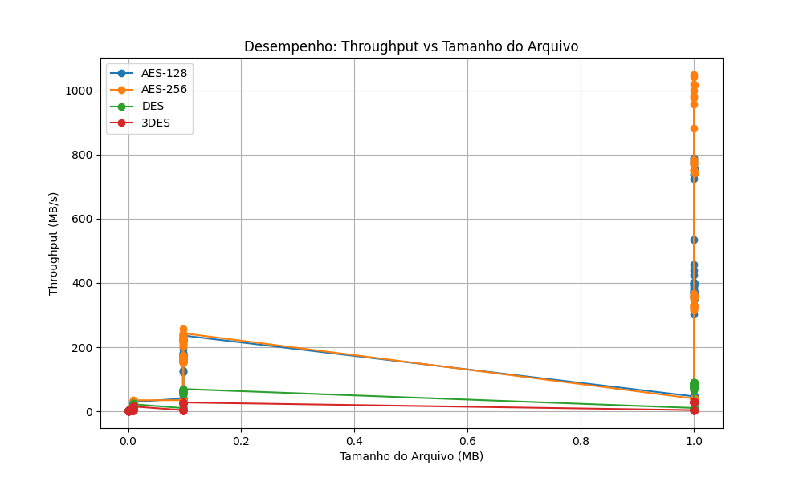

# Relatório de Testes de Criptografia

**Data da Execução:** 08/04/2026 16:15:29

## 1. Tabela de Desempenho

| Arquivo | Algoritmo | Modo | Tamanho (MB) | Tempo Médio (s) | Throughput (MB/s) | Entropia | Padrões Visíveis |
|---------|-----------|------|--------------|-----------------|-------------------|----------|------------------|
| csv_categorico_100KB.csv | AES-128 | ECB | 0.0977 | 0.0028 | 35.4497 | 7.9978 | ✅ Não |
| csv_categorico_100KB.csv | AES-128 | CBC | 0.0977 | 0.0008 | 128.5826 | 7.9982 | ✅ Não |
| csv_categorico_100KB.csv | AES-128 | CFB | 0.0977 | 0.0026 | 37.4759 | 7.9984 | ✅ Não |
| csv_categorico_100KB.csv | AES-128 | OFB | 0.0977 | 0.0008 | 125.5671 | 7.9982 | ✅ Não |
| csv_categorico_100KB.csv | AES-128 | CTR | 0.0977 | 0.0008 | 122.5283 | 7.9983 | ✅ Não |
| csv_categorico_100KB.csv | AES-256 | ECB | 0.0977 | 0.0005 | 203.9637 | 7.9976 | ✅ Não |
| csv_categorico_100KB.csv | AES-256 | CBC | 0.0977 | 0.0006 | 159.5264 | 7.9980 | ✅ Não |
| csv_categorico_100KB.csv | AES-256 | CFB | 0.0977 | 0.0028 | 35.4958 | 7.9982 | ✅ Não |
| csv_categorico_100KB.csv | AES-256 | OFB | 0.0977 | 0.0006 | 164.6964 | 7.9984 | ✅ Não |
| csv_categorico_100KB.csv | AES-256 | CTR | 0.0977 | 0.0006 | 162.9406 | 7.9978 | ✅ Não |
| csv_categorico_100KB.csv | DES | ECB | 0.0977 | 0.0016 | 60.9071 | 7.9390 | ✅ Não |
| csv_categorico_100KB.csv | DES | CBC | 0.0977 | 0.0018 | 53.7730 | 7.9982 | ✅ Não |
| csv_categorico_100KB.csv | DES | CFB | 0.0977 | 0.0103 | 9.4467 | 7.9983 | ✅ Não |
| csv_categorico_100KB.csv | DES | OFB | 0.0977 | 0.0016 | 59.4839 | 7.9983 | ✅ Não |
| csv_categorico_100KB.csv | DES | CTR | 0.0977 | 0.0016 | 59.6598 | 7.9980 | ✅ Não |
| csv_categorico_100KB.csv | 3DES | ECB | 0.0977 | 0.0039 | 24.9162 | 7.9490 | ✅ Não |
| csv_categorico_100KB.csv | 3DES | CBC | 0.0977 | 0.0045 | 21.6480 | 7.9983 | ✅ Não |
| csv_categorico_100KB.csv | 3DES | CFB | 0.0977 | 0.0271 | 3.6072 | 7.9982 | ✅ Não |
| csv_categorico_100KB.csv | 3DES | OFB | 0.0977 | 0.0041 | 23.6690 | 7.9982 | ✅ Não |
| csv_categorico_100KB.csv | 3DES | CTR | 0.0977 | 0.0037 | 26.3024 | 7.9980 | ✅ Não |
| csv_categorico_10KB.csv | AES-128 | ECB | 0.0098 | 0.0018 | 5.5125 | 7.9818 | ✅ Não |
| csv_categorico_10KB.csv | AES-128 | CBC | 0.0098 | 0.0004 | 27.8621 | 7.9834 | ✅ Não |
| csv_categorico_10KB.csv | AES-128 | CFB | 0.0098 | 0.0007 | 13.7482 | 7.9800 | ✅ Não |
| csv_categorico_10KB.csv | AES-128 | OFB | 0.0098 | 0.0004 | 27.5343 | 7.9816 | ✅ Não |
| csv_categorico_10KB.csv | AES-128 | CTR | 0.0098 | 0.0004 | 25.3764 | 7.9824 | ✅ Não |
| csv_categorico_10KB.csv | AES-256 | ECB | 0.0098 | 0.0003 | 31.7101 | 7.9783 | ✅ Não |
| csv_categorico_10KB.csv | AES-256 | CBC | 0.0098 | 0.0004 | 27.6439 | 7.9821 | ✅ Não |
| csv_categorico_10KB.csv | AES-256 | CFB | 0.0098 | 0.0007 | 13.6125 | 7.9823 | ✅ Não |
| csv_categorico_10KB.csv | AES-256 | OFB | 0.0098 | 0.0004 | 24.1026 | 7.9826 | ✅ Não |
| csv_categorico_10KB.csv | AES-256 | CTR | 0.0098 | 0.0004 | 26.0014 | 7.9829 | ✅ Não |
| csv_categorico_10KB.csv | DES | ECB | 0.0098 | 0.0004 | 23.4178 | 7.9328 | ✅ Não |
| csv_categorico_10KB.csv | DES | CBC | 0.0098 | 0.0009 | 10.3899 | 7.9810 | ✅ Não |
| csv_categorico_10KB.csv | DES | CFB | 0.0098 | 0.0023 | 4.1805 | 7.9792 | ✅ Não |
| csv_categorico_10KB.csv | DES | OFB | 0.0098 | 0.0007 | 13.8946 | 7.9807 | ✅ Não |
| csv_categorico_10KB.csv | DES | CTR | 0.0098 | 0.0005 | 18.4904 | 7.9806 | ✅ Não |
| csv_categorico_10KB.csv | 3DES | ECB | 0.0098 | 0.0007 | 13.7404 | 7.9286 | ✅ Não |
| csv_categorico_10KB.csv | 3DES | CBC | 0.0098 | 0.0008 | 12.8615 | 7.9806 | ✅ Não |
| csv_categorico_10KB.csv | 3DES | CFB | 0.0098 | 0.0032 | 3.0710 | 7.9828 | ✅ Não |
| csv_categorico_10KB.csv | 3DES | OFB | 0.0098 | 0.0011 | 8.7110 | 7.9814 | ✅ Não |
| csv_categorico_10KB.csv | 3DES | CTR | 0.0098 | 0.0008 | 12.4741 | 7.9805 | ✅ Não |
| csv_categorico_1KB.csv | AES-128 | ECB | 0.0010 | 0.0012 | 0.7916 | 7.8120 | ✅ Não |
| csv_categorico_1KB.csv | AES-128 | CBC | 0.0010 | 0.0003 | 3.2721 | 7.8221 | ✅ Não |
| csv_categorico_1KB.csv | AES-128 | CFB | 0.0010 | 0.0003 | 3.0354 | 7.8014 | ✅ Não |
| csv_categorico_1KB.csv | AES-128 | OFB | 0.0010 | 0.0003 | 2.8326 | 7.8230 | ✅ Não |
| csv_categorico_1KB.csv | AES-128 | CTR | 0.0010 | 0.0003 | 2.9570 | 7.8062 | ✅ Não |
| csv_categorico_1KB.csv | AES-256 | ECB | 0.0010 | 0.0003 | 3.2073 | 7.8105 | ✅ Não |
| csv_categorico_1KB.csv | AES-256 | CBC | 0.0010 | 0.0003 | 3.3241 | 7.8258 | ✅ Não |
| csv_categorico_1KB.csv | AES-256 | CFB | 0.0010 | 0.0004 | 2.7361 | 7.8045 | ✅ Não |
| csv_categorico_1KB.csv | AES-256 | OFB | 0.0010 | 0.0004 | 2.5558 | 7.8168 | ✅ Não |
| csv_categorico_1KB.csv | AES-256 | CTR | 0.0010 | 0.0003 | 3.3374 | 7.8052 | ✅ Não |
| csv_categorico_1KB.csv | DES | ECB | 0.0010 | 0.0003 | 3.0927 | 7.7601 | ✅ Não |
| csv_categorico_1KB.csv | DES | CBC | 0.0010 | 0.0003 | 2.8285 | 7.7834 | ✅ Não |
| csv_categorico_1KB.csv | DES | CFB | 0.0010 | 0.0004 | 2.4985 | 7.8174 | ✅ Não |
| csv_categorico_1KB.csv | DES | OFB | 0.0010 | 0.0003 | 3.0406 | 7.7975 | ✅ Não |
| csv_categorico_1KB.csv | DES | CTR | 0.0010 | 0.0003 | 2.9681 | 7.8102 | ✅ Não |
| csv_categorico_1KB.csv | 3DES | ECB | 0.0010 | 0.0004 | 2.4845 | 7.7547 | ✅ Não |
| csv_categorico_1KB.csv | 3DES | CBC | 0.0010 | 0.0004 | 2.5130 | 7.8498 | ✅ Não |
| csv_categorico_1KB.csv | 3DES | CFB | 0.0010 | 0.0006 | 1.5098 | 7.7798 | ✅ Não |
| csv_categorico_1KB.csv | 3DES | OFB | 0.0010 | 0.0004 | 2.4314 | 7.8099 | ✅ Não |
| csv_categorico_1KB.csv | 3DES | CTR | 0.0010 | 0.0005 | 1.8989 | 7.8034 | ✅ Não |
| csv_categorico_1MB.csv | AES-128 | ECB | 1.0000 | 0.0025 | 401.1308 | 7.9992 | ✅ Não |
| csv_categorico_1MB.csv | AES-128 | CBC | 1.0000 | 0.0025 | 395.9094 | 7.9998 | ✅ Não |
| csv_categorico_1MB.csv | AES-128 | CFB | 1.0000 | 0.0245 | 40.7399 | 7.9998 | ✅ Não |
| csv_categorico_1MB.csv | AES-128 | OFB | 1.0000 | 0.0027 | 369.0902 | 7.9998 | ✅ Não |
| csv_categorico_1MB.csv | AES-128 | CTR | 1.0000 | 0.0013 | 790.0365 | 7.9998 | ✅ Não |
| csv_categorico_1MB.csv | AES-256 | ECB | 1.0000 | 0.0010 | 956.6645 | 7.9992 | ✅ Não |
| csv_categorico_1MB.csv | AES-256 | CBC | 1.0000 | 0.0028 | 356.4766 | 7.9998 | ✅ Não |
| csv_categorico_1MB.csv | AES-256 | CFB | 1.0000 | 0.0248 | 40.3854 | 7.9998 | ✅ Não |
| csv_categorico_1MB.csv | AES-256 | OFB | 1.0000 | 0.0030 | 333.0610 | 7.9998 | ✅ Não |
| csv_categorico_1MB.csv | AES-256 | CTR | 1.0000 | 0.0013 | 779.5814 | 7.9998 | ✅ Não |
| csv_categorico_1MB.csv | DES | ECB | 1.0000 | 0.0113 | 88.4757 | 7.9528 | ✅ Não |
| csv_categorico_1MB.csv | DES | CBC | 1.0000 | 0.0136 | 73.3237 | 7.9998 | ✅ Não |
| csv_categorico_1MB.csv | DES | CFB | 1.0000 | 0.0938 | 10.6554 | 7.9998 | ✅ Não |
| csv_categorico_1MB.csv | DES | OFB | 1.0000 | 0.0133 | 75.3394 | 7.9998 | ✅ Não |
| csv_categorico_1MB.csv | DES | CTR | 1.0000 | 0.0118 | 84.6295 | 7.9998 | ✅ Não |
| csv_categorico_1MB.csv | 3DES | ECB | 1.0000 | 0.0325 | 30.7728 | 7.9449 | ✅ Não |
| csv_categorico_1MB.csv | 3DES | CBC | 1.0000 | 0.0343 | 29.1194 | 7.9998 | ✅ Não |
| csv_categorico_1MB.csv | 3DES | CFB | 1.0000 | 0.2601 | 3.8441 | 7.9998 | ✅ Não |
| csv_categorico_1MB.csv | 3DES | OFB | 1.0000 | 0.0342 | 29.2260 | 7.9998 | ✅ Não |
| csv_categorico_1MB.csv | 3DES | CTR | 1.0000 | 0.0330 | 30.3387 | 7.9999 | ✅ Não |
| csv_incremental_100KB.csv | AES-128 | ECB | 0.0977 | 0.0017 | 56.9063 | 7.9862 | ✅ Não |
| csv_incremental_100KB.csv | AES-128 | CBC | 0.0977 | 0.0006 | 175.8091 | 7.9979 | ✅ Não |
| csv_incremental_100KB.csv | AES-128 | CFB | 0.0977 | 0.0025 | 39.1056 | 7.9981 | ✅ Não |
| csv_incremental_100KB.csv | AES-128 | OFB | 0.0977 | 0.0006 | 151.6981 | 7.9984 | ✅ Não |
| csv_incremental_100KB.csv | AES-128 | CTR | 0.0977 | 0.0004 | 226.4234 | 7.9981 | ✅ Não |
| csv_incremental_100KB.csv | AES-256 | ECB | 0.0977 | 0.0004 | 232.0811 | 7.9863 | ✅ Não |
| csv_incremental_100KB.csv | AES-256 | CBC | 0.0977 | 0.0006 | 163.9580 | 7.9980 | ✅ Não |
| csv_incremental_100KB.csv | AES-256 | CFB | 0.0977 | 0.0028 | 34.3003 | 7.9981 | ✅ Não |
| csv_incremental_100KB.csv | AES-256 | OFB | 0.0977 | 0.0006 | 155.8718 | 7.9980 | ✅ Não |
| csv_incremental_100KB.csv | AES-256 | CTR | 0.0977 | 0.0005 | 206.3996 | 7.9982 | ✅ Não |
| csv_incremental_100KB.csv | DES | ECB | 0.0977 | 0.0015 | 66.6732 | 7.1980 | ✅ Não |
| csv_incremental_100KB.csv | DES | CBC | 0.0977 | 0.0017 | 56.9538 | 7.9980 | ✅ Não |
| csv_incremental_100KB.csv | DES | CFB | 0.0977 | 0.0107 | 9.0994 | 7.9983 | ✅ Não |
| csv_incremental_100KB.csv | DES | OFB | 0.0977 | 0.0017 | 58.5905 | 7.9984 | ✅ Não |
| csv_incremental_100KB.csv | DES | CTR | 0.0977 | 0.0018 | 54.6680 | 7.9983 | ✅ Não |
| csv_incremental_100KB.csv | 3DES | ECB | 0.0977 | 0.0036 | 27.0593 | 7.2702 | ✅ Não |
| csv_incremental_100KB.csv | 3DES | CBC | 0.0977 | 0.0041 | 23.9578 | 7.9982 | ✅ Não |
| csv_incremental_100KB.csv | 3DES | CFB | 0.0977 | 0.0264 | 3.7029 | 7.9981 | ✅ Não |
| csv_incremental_100KB.csv | 3DES | OFB | 0.0977 | 0.0037 | 26.6474 | 7.9982 | ✅ Não |
| csv_incremental_100KB.csv | 3DES | CTR | 0.0977 | 0.0036 | 27.4606 | 7.9981 | ✅ Não |
| csv_incremental_10KB.csv | AES-128 | ECB | 0.0098 | 0.0018 | 5.5457 | 7.8550 | ✅ Não |
| csv_incremental_10KB.csv | AES-128 | CBC | 0.0098 | 0.0003 | 28.4050 | 7.9784 | ✅ Não |
| csv_incremental_10KB.csv | AES-128 | CFB | 0.0098 | 0.0006 | 16.4083 | 7.9822 | ✅ Não |
| csv_incremental_10KB.csv | AES-128 | OFB | 0.0098 | 0.0003 | 28.5316 | 7.9802 | ✅ Não |
| csv_incremental_10KB.csv | AES-128 | CTR | 0.0098 | 0.0003 | 31.4956 | 7.9787 | ✅ Não |
| csv_incremental_10KB.csv | AES-256 | ECB | 0.0098 | 0.0003 | 32.9022 | 7.8755 | ✅ Não |
| csv_incremental_10KB.csv | AES-256 | CBC | 0.0098 | 0.0003 | 30.6495 | 7.9815 | ✅ Não |
| csv_incremental_10KB.csv | AES-256 | CFB | 0.0098 | 0.0006 | 16.5837 | 7.9806 | ✅ Não |
| csv_incremental_10KB.csv | AES-256 | OFB | 0.0098 | 0.0003 | 28.1068 | 7.9805 | ✅ Não |
| csv_incremental_10KB.csv | AES-256 | CTR | 0.0098 | 0.0003 | 31.3966 | 7.9843 | ✅ Não |
| csv_incremental_10KB.csv | DES | ECB | 0.0098 | 0.0004 | 24.6688 | 7.5115 | ✅ Não |
| csv_incremental_10KB.csv | DES | CBC | 0.0098 | 0.0005 | 18.4123 | 7.9815 | ✅ Não |
| csv_incremental_10KB.csv | DES | CFB | 0.0098 | 0.0013 | 7.4339 | 7.9809 | ✅ Não |
| csv_incremental_10KB.csv | DES | OFB | 0.0098 | 0.0005 | 20.8916 | 7.9808 | ✅ Não |
| csv_incremental_10KB.csv | DES | CTR | 0.0098 | 0.0005 | 20.5457 | 7.9822 | ✅ Não |
| csv_incremental_10KB.csv | 3DES | ECB | 0.0098 | 0.0007 | 14.4587 | 7.5398 | ✅ Não |
| csv_incremental_10KB.csv | 3DES | CBC | 0.0098 | 0.0007 | 13.2202 | 7.9831 | ✅ Não |
| csv_incremental_10KB.csv | 3DES | CFB | 0.0098 | 0.0030 | 3.2722 | 7.9827 | ✅ Não |
| csv_incremental_10KB.csv | 3DES | OFB | 0.0098 | 0.0007 | 13.7556 | 7.9800 | ✅ Não |
| csv_incremental_10KB.csv | 3DES | CTR | 0.0098 | 0.0007 | 13.2741 | 7.9801 | ✅ Não |
| csv_incremental_1KB.csv | AES-128 | ECB | 0.0010 | 0.0013 | 0.7677 | 7.6523 | ✅ Não |
| csv_incremental_1KB.csv | AES-128 | CBC | 0.0010 | 0.0003 | 2.9988 | 7.8175 | ✅ Não |
| csv_incremental_1KB.csv | AES-128 | CFB | 0.0010 | 0.0003 | 3.3676 | 7.8416 | ✅ Não |
| csv_incremental_1KB.csv | AES-128 | OFB | 0.0010 | 0.0003 | 3.1339 | 7.8072 | ✅ Não |
| csv_incremental_1KB.csv | AES-128 | CTR | 0.0010 | 0.0003 | 3.4290 | 7.8338 | ✅ Não |
| csv_incremental_1KB.csv | AES-256 | ECB | 0.0010 | 0.0003 | 3.2945 | 7.6246 | ✅ Não |
| csv_incremental_1KB.csv | AES-256 | CBC | 0.0010 | 0.0003 | 3.5265 | 7.8107 | ✅ Não |
| csv_incremental_1KB.csv | AES-256 | CFB | 0.0010 | 0.0003 | 3.1118 | 7.7981 | ✅ Não |
| csv_incremental_1KB.csv | AES-256 | OFB | 0.0010 | 0.0003 | 3.5636 | 7.8074 | ✅ Não |
| csv_incremental_1KB.csv | AES-256 | CTR | 0.0010 | 0.0003 | 3.4783 | 7.8221 | ✅ Não |
| csv_incremental_1KB.csv | DES | ECB | 0.0010 | 0.0003 | 3.2721 | 7.0669 | ✅ Não |
| csv_incremental_1KB.csv | DES | CBC | 0.0010 | 0.0003 | 2.8929 | 7.7819 | ✅ Não |
| csv_incremental_1KB.csv | DES | CFB | 0.0010 | 0.0004 | 2.5095 | 7.8192 | ✅ Não |
| csv_incremental_1KB.csv | DES | OFB | 0.0010 | 0.0003 | 3.0666 | 7.7919 | ✅ Não |
| csv_incremental_1KB.csv | DES | CTR | 0.0010 | 0.0003 | 2.8356 | 7.8329 | ✅ Não |
| csv_incremental_1KB.csv | 3DES | ECB | 0.0010 | 0.0004 | 2.5528 | 7.1052 | ✅ Não |
| csv_incremental_1KB.csv | 3DES | CBC | 0.0010 | 0.0004 | 2.5780 | 7.7975 | ✅ Não |
| csv_incremental_1KB.csv | 3DES | CFB | 0.0010 | 0.0006 | 1.6264 | 7.8073 | ✅ Não |
| csv_incremental_1KB.csv | 3DES | OFB | 0.0010 | 0.0004 | 2.6176 | 7.7805 | ✅ Não |
| csv_incremental_1KB.csv | 3DES | CTR | 0.0010 | 0.0004 | 2.1761 | 7.8257 | ✅ Não |
| csv_incremental_1MB.csv | AES-128 | ECB | 1.0000 | 0.0117 | 85.1492 | 7.9328 | ✅ Não |
| csv_incremental_1MB.csv | AES-128 | CBC | 1.0000 | 0.0026 | 384.1641 | 7.9998 | ✅ Não |
| csv_incremental_1MB.csv | AES-128 | CFB | 1.0000 | 0.0219 | 45.5681 | 7.9998 | ✅ Não |
| csv_incremental_1MB.csv | AES-128 | OFB | 1.0000 | 0.0027 | 368.7430 | 7.9998 | ✅ Não |
| csv_incremental_1MB.csv | AES-128 | CTR | 1.0000 | 0.0014 | 736.9547 | 7.9998 | ✅ Não |
| csv_incremental_1MB.csv | AES-256 | ECB | 1.0000 | 0.0010 | 1019.7428 | 7.9320 | ✅ Não |
| csv_incremental_1MB.csv | AES-256 | CBC | 1.0000 | 0.0028 | 352.4507 | 7.9998 | ✅ Não |
| csv_incremental_1MB.csv | AES-256 | CFB | 1.0000 | 0.0249 | 40.0941 | 7.9998 | ✅ Não |
| csv_incremental_1MB.csv | AES-256 | OFB | 1.0000 | 0.0032 | 316.5680 | 7.9998 | ✅ Não |
| csv_incremental_1MB.csv | AES-256 | CTR | 1.0000 | 0.0013 | 785.1708 | 7.9998 | ✅ Não |
| csv_incremental_1MB.csv | DES | ECB | 1.0000 | 0.0111 | 90.0697 | 7.5796 | ✅ Não |
| csv_incremental_1MB.csv | DES | CBC | 1.0000 | 0.0136 | 73.4422 | 7.9998 | ✅ Não |
| csv_incremental_1MB.csv | DES | CFB | 1.0000 | 0.0939 | 10.6551 | 7.9998 | ✅ Não |
| csv_incremental_1MB.csv | DES | OFB | 1.0000 | 0.0134 | 74.8896 | 7.9998 | ✅ Não |
| csv_incremental_1MB.csv | DES | CTR | 1.0000 | 0.0117 | 85.6792 | 7.9998 | ✅ Não |
| csv_incremental_1MB.csv | 3DES | ECB | 1.0000 | 0.0325 | 30.8071 | 7.5878 | ✅ Não |
| csv_incremental_1MB.csv | 3DES | CBC | 1.0000 | 0.0349 | 28.6442 | 7.9998 | ✅ Não |
| csv_incremental_1MB.csv | 3DES | CFB | 1.0000 | 0.2610 | 3.8321 | 7.9998 | ✅ Não |
| csv_incremental_1MB.csv | 3DES | OFB | 1.0000 | 0.0343 | 29.1831 | 7.9998 | ✅ Não |
| csv_incremental_1MB.csv | 3DES | CTR | 1.0000 | 0.0326 | 30.6317 | 7.9998 | ✅ Não |
| csv_realista_100KB.csv | AES-128 | ECB | 0.0977 | 0.0017 | 57.7406 | 7.9962 | ✅ Não |
| csv_realista_100KB.csv | AES-128 | CBC | 0.0977 | 0.0006 | 172.6958 | 7.9983 | ✅ Não |
| csv_realista_100KB.csv | AES-128 | CFB | 0.0977 | 0.0024 | 41.3403 | 7.9984 | ✅ Não |
| csv_realista_100KB.csv | AES-128 | OFB | 0.0977 | 0.0005 | 178.2963 | 7.9981 | ✅ Não |
| csv_realista_100KB.csv | AES-128 | CTR | 0.0977 | 0.0004 | 218.6166 | 7.9982 | ✅ Não |
| csv_realista_100KB.csv | AES-256 | ECB | 0.0977 | 0.0004 | 242.2379 | 7.9964 | ✅ Não |
| csv_realista_100KB.csv | AES-256 | CBC | 0.0977 | 0.0006 | 155.3869 | 7.9981 | ✅ Não |
| csv_realista_100KB.csv | AES-256 | CFB | 0.0977 | 0.0027 | 35.6155 | 7.9981 | ✅ Não |
| csv_realista_100KB.csv | AES-256 | OFB | 0.0977 | 0.0006 | 162.9471 | 7.9981 | ✅ Não |
| csv_realista_100KB.csv | AES-256 | CTR | 0.0977 | 0.0004 | 230.1770 | 7.9981 | ✅ Não |
| csv_realista_100KB.csv | DES | ECB | 0.0977 | 0.0014 | 68.5948 | 7.9491 | ✅ Não |
| csv_realista_100KB.csv | DES | CBC | 0.0977 | 0.0017 | 58.1216 | 7.9980 | ✅ Não |
| csv_realista_100KB.csv | DES | CFB | 0.0977 | 0.0095 | 10.3035 | 7.9983 | ✅ Não |
| csv_realista_100KB.csv | DES | OFB | 0.0977 | 0.0016 | 61.1042 | 7.9984 | ✅ Não |
| csv_realista_100KB.csv | DES | CTR | 0.0977 | 0.0015 | 65.3937 | 7.9980 | ✅ Não |
| csv_realista_100KB.csv | 3DES | ECB | 0.0977 | 0.0035 | 27.6216 | 7.9403 | ✅ Não |
| csv_realista_100KB.csv | 3DES | CBC | 0.0977 | 0.0038 | 25.8806 | 7.9983 | ✅ Não |
| csv_realista_100KB.csv | 3DES | CFB | 0.0977 | 0.0259 | 3.7685 | 7.9983 | ✅ Não |
| csv_realista_100KB.csv | 3DES | OFB | 0.0977 | 0.0037 | 26.6632 | 7.9983 | ✅ Não |
| csv_realista_100KB.csv | 3DES | CTR | 0.0977 | 0.0036 | 27.3304 | 7.9985 | ✅ Não |
| csv_realista_10KB.csv | AES-128 | ECB | 0.0098 | 0.0016 | 6.0425 | 7.9823 | ✅ Não |
| csv_realista_10KB.csv | AES-128 | CBC | 0.0098 | 0.0003 | 30.6220 | 7.9836 | ✅ Não |
| csv_realista_10KB.csv | AES-128 | CFB | 0.0098 | 0.0005 | 19.1018 | 7.9825 | ✅ Não |
| csv_realista_10KB.csv | AES-128 | OFB | 0.0098 | 0.0004 | 25.7740 | 7.9818 | ✅ Não |
| csv_realista_10KB.csv | AES-128 | CTR | 0.0098 | 0.0003 | 29.1987 | 7.9815 | ✅ Não |
| csv_realista_10KB.csv | AES-256 | ECB | 0.0098 | 0.0003 | 31.8260 | 7.9796 | ✅ Não |
| csv_realista_10KB.csv | AES-256 | CBC | 0.0098 | 0.0003 | 28.7318 | 7.9832 | ✅ Não |
| csv_realista_10KB.csv | AES-256 | CFB | 0.0098 | 0.0006 | 17.5508 | 7.9838 | ✅ Não |
| csv_realista_10KB.csv | AES-256 | OFB | 0.0098 | 0.0004 | 27.6458 | 7.9824 | ✅ Não |
| csv_realista_10KB.csv | AES-256 | CTR | 0.0098 | 0.0003 | 28.9450 | 7.9805 | ✅ Não |
| csv_realista_10KB.csv | DES | ECB | 0.0098 | 0.0004 | 23.7229 | 7.9359 | ✅ Não |
| csv_realista_10KB.csv | DES | CBC | 0.0098 | 0.0005 | 21.3489 | 7.9839 | ✅ Não |
| csv_realista_10KB.csv | DES | CFB | 0.0098 | 0.0013 | 7.4676 | 7.9846 | ✅ Não |
| csv_realista_10KB.csv | DES | OFB | 0.0098 | 0.0004 | 22.0511 | 7.9819 | ✅ Não |
| csv_realista_10KB.csv | DES | CTR | 0.0098 | 0.0005 | 21.0213 | 7.9804 | ✅ Não |
| csv_realista_10KB.csv | 3DES | ECB | 0.0098 | 0.0006 | 15.1317 | 7.9323 | ✅ Não |
| csv_realista_10KB.csv | 3DES | CBC | 0.0098 | 0.0007 | 13.3190 | 7.9818 | ✅ Não |
| csv_realista_10KB.csv | 3DES | CFB | 0.0098 | 0.0030 | 3.2918 | 7.9810 | ✅ Não |
| csv_realista_10KB.csv | 3DES | OFB | 0.0098 | 0.0007 | 13.5746 | 7.9844 | ✅ Não |
| csv_realista_10KB.csv | 3DES | CTR | 0.0098 | 0.0007 | 13.2664 | 7.9812 | ✅ Não |
| csv_realista_1KB.csv | AES-128 | ECB | 0.0010 | 0.0014 | 0.7195 | 7.8058 | ✅ Não |
| csv_realista_1KB.csv | AES-128 | CBC | 0.0010 | 0.0003 | 2.8047 | 7.8001 | ✅ Não |
| csv_realista_1KB.csv | AES-128 | CFB | 0.0010 | 0.0003 | 3.0096 | 7.8193 | ✅ Não |
| csv_realista_1KB.csv | AES-128 | OFB | 0.0010 | 0.0003 | 2.9709 | 7.8208 | ✅ Não |
| csv_realista_1KB.csv | AES-128 | CTR | 0.0010 | 0.0003 | 3.5494 | 7.8211 | ✅ Não |
| csv_realista_1KB.csv | AES-256 | ECB | 0.0010 | 0.0003 | 3.3745 | 7.8062 | ✅ Não |
| csv_realista_1KB.csv | AES-256 | CBC | 0.0010 | 0.0003 | 3.2103 | 7.8074 | ✅ Não |
| csv_realista_1KB.csv | AES-256 | CFB | 0.0010 | 0.0003 | 3.1617 | 7.7798 | ✅ Não |
| csv_realista_1KB.csv | AES-256 | OFB | 0.0010 | 0.0003 | 3.1165 | 7.8165 | ✅ Não |
| csv_realista_1KB.csv | AES-256 | CTR | 0.0010 | 0.0003 | 3.3131 | 7.8225 | ✅ Não |
| csv_realista_1KB.csv | DES | ECB | 0.0010 | 0.0003 | 3.1198 | 7.7819 | ✅ Não |
| csv_realista_1KB.csv | DES | CBC | 0.0010 | 0.0003 | 2.9008 | 7.7975 | ✅ Não |
| csv_realista_1KB.csv | DES | CFB | 0.0010 | 0.0004 | 2.5613 | 7.8126 | ✅ Não |
| csv_realista_1KB.csv | DES | OFB | 0.0010 | 0.0003 | 3.3698 | 7.7975 | ✅ Não |
| csv_realista_1KB.csv | DES | CTR | 0.0010 | 0.0003 | 3.1413 | 7.8166 | ✅ Não |
| csv_realista_1KB.csv | 3DES | ECB | 0.0010 | 0.0004 | 2.7834 | 7.7380 | ✅ Não |
| csv_realista_1KB.csv | 3DES | CBC | 0.0010 | 0.0004 | 2.4520 | 7.8121 | ✅ Não |
| csv_realista_1KB.csv | 3DES | CFB | 0.0010 | 0.0006 | 1.6027 | 7.8170 | ✅ Não |
| csv_realista_1KB.csv | 3DES | OFB | 0.0010 | 0.0004 | 2.5701 | 7.7916 | ✅ Não |
| csv_realista_1KB.csv | 3DES | CTR | 0.0010 | 0.0004 | 2.7702 | 7.8222 | ✅ Não |
| csv_realista_1MB.csv | AES-128 | ECB | 1.0000 | 0.0022 | 458.3989 | 7.9983 | ✅ Não |
| csv_realista_1MB.csv | AES-128 | CBC | 1.0000 | 0.0026 | 390.9934 | 7.9998 | ✅ Não |
| csv_realista_1MB.csv | AES-128 | CFB | 1.0000 | 0.0208 | 47.9973 | 7.9998 | ✅ Não |
| csv_realista_1MB.csv | AES-128 | OFB | 1.0000 | 0.0027 | 371.9113 | 7.9998 | ✅ Não |
| csv_realista_1MB.csv | AES-128 | CTR | 1.0000 | 0.0013 | 781.0767 | 7.9998 | ✅ Não |
| csv_realista_1MB.csv | AES-256 | ECB | 1.0000 | 0.0010 | 1042.3480 | 7.9984 | ✅ Não |
| csv_realista_1MB.csv | AES-256 | CBC | 1.0000 | 0.0028 | 360.0230 | 7.9998 | ✅ Não |
| csv_realista_1MB.csv | AES-256 | CFB | 1.0000 | 0.0248 | 40.3537 | 7.9998 | ✅ Não |
| csv_realista_1MB.csv | AES-256 | OFB | 1.0000 | 0.0030 | 329.1741 | 7.9998 | ✅ Não |
| csv_realista_1MB.csv | AES-256 | CTR | 1.0000 | 0.0013 | 777.1547 | 7.9998 | ✅ Não |
| csv_realista_1MB.csv | DES | ECB | 1.0000 | 0.0111 | 89.8652 | 7.9463 | ✅ Não |
| csv_realista_1MB.csv | DES | CBC | 1.0000 | 0.0135 | 74.0814 | 7.9998 | ✅ Não |
| csv_realista_1MB.csv | DES | CFB | 1.0000 | 0.0947 | 10.5630 | 7.9999 | ✅ Não |
| csv_realista_1MB.csv | DES | OFB | 1.0000 | 0.0131 | 76.4912 | 7.9998 | ✅ Não |
| csv_realista_1MB.csv | DES | CTR | 1.0000 | 0.0116 | 86.4429 | 7.9998 | ✅ Não |
| csv_realista_1MB.csv | 3DES | ECB | 1.0000 | 0.0321 | 31.1946 | 7.9518 | ✅ Não |
| csv_realista_1MB.csv | 3DES | CBC | 1.0000 | 0.0345 | 28.9797 | 7.9998 | ✅ Não |
| csv_realista_1MB.csv | 3DES | CFB | 1.0000 | 0.2594 | 3.8544 | 7.9998 | ✅ Não |
| csv_realista_1MB.csv | 3DES | OFB | 1.0000 | 0.0340 | 29.4189 | 7.9998 | ✅ Não |
| csv_realista_1MB.csv | 3DES | CTR | 1.0000 | 0.0328 | 30.4594 | 7.9998 | ✅ Não |
| csv_repetitivo_100KB.csv | AES-128 | ECB | 0.0977 | 0.0016 | 62.7413 | 6.8355 | ⚠️ Sim |
| csv_repetitivo_100KB.csv | AES-128 | CBC | 0.0977 | 0.0006 | 154.3273 | 7.9982 | ✅ Não |
| csv_repetitivo_100KB.csv | AES-128 | CFB | 0.0977 | 0.0025 | 38.7908 | 7.9983 | ✅ Não |
| csv_repetitivo_100KB.csv | AES-128 | OFB | 0.0977 | 0.0006 | 165.6221 | 7.9981 | ✅ Não |
| csv_repetitivo_100KB.csv | AES-128 | CTR | 0.0977 | 0.0005 | 195.0941 | 7.9984 | ✅ Não |
| csv_repetitivo_100KB.csv | AES-256 | ECB | 0.0977 | 0.0004 | 243.4039 | 6.7884 | ⚠️ Sim |
| csv_repetitivo_100KB.csv | AES-256 | CBC | 0.0977 | 0.0006 | 159.5823 | 7.9982 | ✅ Não |
| csv_repetitivo_100KB.csv | AES-256 | CFB | 0.0977 | 0.0029 | 34.1251 | 7.9980 | ✅ Não |
| csv_repetitivo_100KB.csv | AES-256 | OFB | 0.0977 | 0.0006 | 153.9965 | 7.9984 | ✅ Não |
| csv_repetitivo_100KB.csv | AES-256 | CTR | 0.0977 | 0.0005 | 203.6899 | 7.9981 | ✅ Não |
| csv_repetitivo_100KB.csv | DES | ECB | 0.0977 | 0.0014 | 69.7215 | 6.2042 | ⚠️ Sim |
| csv_repetitivo_100KB.csv | DES | CBC | 0.0977 | 0.0017 | 58.7097 | 7.9983 | ✅ Não |
| csv_repetitivo_100KB.csv | DES | CFB | 0.0977 | 0.0096 | 10.1597 | 7.9983 | ✅ Não |
| csv_repetitivo_100KB.csv | DES | OFB | 0.0977 | 0.0016 | 62.8356 | 7.9982 | ✅ Não |
| csv_repetitivo_100KB.csv | DES | CTR | 0.0977 | 0.0015 | 64.7978 | 7.9985 | ✅ Não |
| csv_repetitivo_100KB.csv | 3DES | ECB | 0.0977 | 0.0035 | 27.8694 | 6.2131 | ⚠️ Sim |
| csv_repetitivo_100KB.csv | 3DES | CBC | 0.0977 | 0.0038 | 26.0227 | 7.9981 | ✅ Não |
| csv_repetitivo_100KB.csv | 3DES | CFB | 0.0977 | 0.0259 | 3.7643 | 7.9982 | ✅ Não |
| csv_repetitivo_100KB.csv | 3DES | OFB | 0.0977 | 0.0037 | 26.5519 | 7.9982 | ✅ Não |
| csv_repetitivo_100KB.csv | 3DES | CTR | 0.0977 | 0.0036 | 27.3612 | 7.9982 | ✅ Não |
| csv_repetitivo_10KB.csv | AES-128 | ECB | 0.0098 | 0.0018 | 5.3988 | 6.7928 | ⚠️ Sim |
| csv_repetitivo_10KB.csv | AES-128 | CBC | 0.0098 | 0.0003 | 29.6855 | 7.9820 | ✅ Não |
| csv_repetitivo_10KB.csv | AES-128 | CFB | 0.0098 | 0.0005 | 18.4463 | 7.9840 | ✅ Não |
| csv_repetitivo_10KB.csv | AES-128 | OFB | 0.0098 | 0.0004 | 25.8831 | 7.9838 | ✅ Não |
| csv_repetitivo_10KB.csv | AES-128 | CTR | 0.0098 | 0.0003 | 30.5558 | 7.9825 | ✅ Não |
| csv_repetitivo_10KB.csv | AES-256 | ECB | 0.0098 | 0.0003 | 33.6981 | 6.8748 | ⚠️ Sim |
| csv_repetitivo_10KB.csv | AES-256 | CBC | 0.0098 | 0.0003 | 28.6093 | 7.9811 | ✅ Não |
| csv_repetitivo_10KB.csv | AES-256 | CFB | 0.0098 | 0.0006 | 16.9944 | 7.9816 | ✅ Não |
| csv_repetitivo_10KB.csv | AES-256 | OFB | 0.0098 | 0.0004 | 25.8766 | 7.9824 | ✅ Não |
| csv_repetitivo_10KB.csv | AES-256 | CTR | 0.0098 | 0.0003 | 29.8151 | 7.9813 | ✅ Não |
| csv_repetitivo_10KB.csv | DES | ECB | 0.0098 | 0.0004 | 23.9532 | 6.2620 | ⚠️ Sim |
| csv_repetitivo_10KB.csv | DES | CBC | 0.0098 | 0.0005 | 19.8941 | 7.9860 | ✅ Não |
| csv_repetitivo_10KB.csv | DES | CFB | 0.0098 | 0.0013 | 7.6181 | 7.9839 | ✅ Não |
| csv_repetitivo_10KB.csv | DES | OFB | 0.0098 | 0.0005 | 20.6140 | 7.9829 | ✅ Não |
| csv_repetitivo_10KB.csv | DES | CTR | 0.0098 | 0.0004 | 21.8453 | 7.9825 | ✅ Não |
| csv_repetitivo_10KB.csv | 3DES | ECB | 0.0098 | 0.0007 | 14.5589 | 6.0865 | ⚠️ Sim |
| csv_repetitivo_10KB.csv | 3DES | CBC | 0.0098 | 0.0007 | 13.3086 | 7.9822 | ✅ Não |
| csv_repetitivo_10KB.csv | 3DES | CFB | 0.0098 | 0.0030 | 3.3039 | 7.9842 | ✅ Não |
| csv_repetitivo_10KB.csv | 3DES | OFB | 0.0098 | 0.0007 | 13.4985 | 7.9838 | ✅ Não |
| csv_repetitivo_10KB.csv | 3DES | CTR | 0.0098 | 0.0007 | 14.0906 | 7.9829 | ✅ Não |
| csv_repetitivo_1KB.csv | AES-128 | ECB | 0.0010 | 0.0011 | 0.8683 | 6.9112 | ⚠️ Sim |
| csv_repetitivo_1KB.csv | AES-128 | CBC | 0.0010 | 0.0004 | 2.5174 | 7.8168 | ✅ Não |
| csv_repetitivo_1KB.csv | AES-128 | CFB | 0.0010 | 0.0004 | 2.3551 | 7.8066 | ✅ Não |
| csv_repetitivo_1KB.csv | AES-128 | OFB | 0.0010 | 0.0004 | 2.3828 | 7.8490 | ✅ Não |
| csv_repetitivo_1KB.csv | AES-128 | CTR | 0.0010 | 0.0003 | 3.1356 | 7.8176 | ✅ Não |
| csv_repetitivo_1KB.csv | AES-256 | ECB | 0.0010 | 0.0003 | 3.0381 | 6.9901 | ⚠️ Sim |
| csv_repetitivo_1KB.csv | AES-256 | CBC | 0.0010 | 0.0003 | 3.5150 | 7.7961 | ✅ Não |
| csv_repetitivo_1KB.csv | AES-256 | CFB | 0.0010 | 0.0003 | 3.2734 | 7.8063 | ✅ Não |
| csv_repetitivo_1KB.csv | AES-256 | OFB | 0.0010 | 0.0003 | 3.1833 | 7.8122 | ✅ Não |
| csv_repetitivo_1KB.csv | AES-256 | CTR | 0.0010 | 0.0003 | 3.1103 | 7.7962 | ✅ Não |
| csv_repetitivo_1KB.csv | DES | ECB | 0.0010 | 0.0003 | 3.1289 | 6.1763 | ⚠️ Sim |
| csv_repetitivo_1KB.csv | DES | CBC | 0.0010 | 0.0003 | 2.9385 | 7.8102 | ✅ Não |
| csv_repetitivo_1KB.csv | DES | CFB | 0.0010 | 0.0004 | 2.5621 | 7.8314 | ✅ Não |
| csv_repetitivo_1KB.csv | DES | OFB | 0.0010 | 0.0003 | 2.9442 | 7.8398 | ✅ Não |
| csv_repetitivo_1KB.csv | DES | CTR | 0.0010 | 0.0003 | 3.2123 | 7.8109 | ✅ Não |
| csv_repetitivo_1KB.csv | 3DES | ECB | 0.0010 | 0.0004 | 2.7329 | 6.3032 | ⚠️ Sim |
| csv_repetitivo_1KB.csv | 3DES | CBC | 0.0010 | 0.0005 | 2.1643 | 7.8148 | ✅ Não |
| csv_repetitivo_1KB.csv | 3DES | CFB | 0.0010 | 0.0006 | 1.5508 | 7.8349 | ✅ Não |
| csv_repetitivo_1KB.csv | 3DES | OFB | 0.0010 | 0.0004 | 2.5805 | 7.8095 | ✅ Não |
| csv_repetitivo_1KB.csv | 3DES | CTR | 0.0010 | 0.0004 | 2.6112 | 7.8145 | ✅ Não |
| csv_repetitivo_1MB.csv | AES-128 | ECB | 1.0000 | 0.0031 | 323.3028 | 6.8503 | ⚠️ Sim |
| csv_repetitivo_1MB.csv | AES-128 | CBC | 1.0000 | 0.0027 | 376.5625 | 7.9998 | ✅ Não |
| csv_repetitivo_1MB.csv | AES-128 | CFB | 1.0000 | 0.0216 | 46.2239 | 7.9998 | ✅ Não |
| csv_repetitivo_1MB.csv | AES-128 | OFB | 1.0000 | 0.0028 | 355.3742 | 7.9998 | ✅ Não |
| csv_repetitivo_1MB.csv | AES-128 | CTR | 1.0000 | 0.0014 | 738.9542 | 7.9998 | ✅ Não |
| csv_repetitivo_1MB.csv | AES-256 | ECB | 1.0000 | 0.0010 | 976.9417 | 6.8189 | ⚠️ Sim |
| csv_repetitivo_1MB.csv | AES-256 | CBC | 1.0000 | 0.0028 | 356.4706 | 7.9998 | ✅ Não |
| csv_repetitivo_1MB.csv | AES-256 | CFB | 1.0000 | 0.0249 | 40.0813 | 7.9998 | ✅ Não |
| csv_repetitivo_1MB.csv | AES-256 | OFB | 1.0000 | 0.0030 | 332.6964 | 7.9998 | ✅ Não |
| csv_repetitivo_1MB.csv | AES-256 | CTR | 1.0000 | 0.0013 | 752.5710 | 7.9998 | ✅ Não |
| csv_repetitivo_1MB.csv | DES | ECB | 1.0000 | 0.0111 | 90.0599 | 6.1331 | ⚠️ Sim |
| csv_repetitivo_1MB.csv | DES | CBC | 1.0000 | 0.0135 | 74.2122 | 7.9998 | ✅ Não |
| csv_repetitivo_1MB.csv | DES | CFB | 1.0000 | 0.0942 | 10.6187 | 7.9998 | ✅ Não |
| csv_repetitivo_1MB.csv | DES | OFB | 1.0000 | 0.0131 | 76.4009 | 7.9998 | ✅ Não |
| csv_repetitivo_1MB.csv | DES | CTR | 1.0000 | 0.0115 | 86.8683 | 7.9998 | ✅ Não |
| csv_repetitivo_1MB.csv | 3DES | ECB | 1.0000 | 0.0319 | 31.3275 | 6.1103 | ⚠️ Sim |
| csv_repetitivo_1MB.csv | 3DES | CBC | 1.0000 | 0.0344 | 29.0544 | 7.9998 | ✅ Não |
| csv_repetitivo_1MB.csv | 3DES | CFB | 1.0000 | 0.2592 | 3.8576 | 7.9998 | ✅ Não |
| csv_repetitivo_1MB.csv | 3DES | OFB | 1.0000 | 0.0341 | 29.3058 | 7.9998 | ✅ Não |
| csv_repetitivo_1MB.csv | 3DES | CTR | 1.0000 | 0.0327 | 30.5761 | 7.9998 | ✅ Não |
| dados_aninhados_100KB.json | AES-128 | ECB | 0.0977 | 0.0021 | 45.8761 | 7.9274 | ✅ Não |
| dados_aninhados_100KB.json | AES-128 | CBC | 0.0977 | 0.0006 | 173.8744 | 7.9982 | ✅ Não |
| dados_aninhados_100KB.json | AES-128 | CFB | 0.0977 | 0.0024 | 41.4504 | 7.9981 | ✅ Não |
| dados_aninhados_100KB.json | AES-128 | OFB | 0.0977 | 0.0005 | 180.6297 | 7.9985 | ✅ Não |
| dados_aninhados_100KB.json | AES-128 | CTR | 0.0977 | 0.0004 | 223.6274 | 7.9978 | ✅ Não |
| dados_aninhados_100KB.json | AES-256 | ECB | 0.0977 | 0.0005 | 214.8531 | 7.9049 | ✅ Não |
| dados_aninhados_100KB.json | AES-256 | CBC | 0.0977 | 0.0006 | 153.0628 | 7.9985 | ✅ Não |
| dados_aninhados_100KB.json | AES-256 | CFB | 0.0977 | 0.0028 | 34.7477 | 7.9984 | ✅ Não |
| dados_aninhados_100KB.json | AES-256 | OFB | 0.0977 | 0.0006 | 162.5962 | 7.9979 | ✅ Não |
| dados_aninhados_100KB.json | AES-256 | CTR | 0.0977 | 0.0004 | 222.1718 | 7.9978 | ✅ Não |
| dados_aninhados_100KB.json | DES | ECB | 0.0977 | 0.0015 | 66.6932 | 7.8355 | ✅ Não |
| dados_aninhados_100KB.json | DES | CBC | 0.0977 | 0.0017 | 57.9803 | 7.9982 | ✅ Não |
| dados_aninhados_100KB.json | DES | CFB | 0.0977 | 0.0095 | 10.2999 | 7.9982 | ✅ Não |
| dados_aninhados_100KB.json | DES | OFB | 0.0977 | 0.0016 | 62.5481 | 7.9980 | ✅ Não |
| dados_aninhados_100KB.json | DES | CTR | 0.0977 | 0.0015 | 66.9067 | 7.9982 | ✅ Não |
| dados_aninhados_100KB.json | 3DES | ECB | 0.0977 | 0.0035 | 27.6827 | 7.8209 | ✅ Não |
| dados_aninhados_100KB.json | 3DES | CBC | 0.0977 | 0.0038 | 25.8090 | 7.9980 | ✅ Não |
| dados_aninhados_100KB.json | 3DES | CFB | 0.0977 | 0.0259 | 3.7735 | 7.9982 | ✅ Não |
| dados_aninhados_100KB.json | 3DES | OFB | 0.0977 | 0.0036 | 26.7969 | 7.9982 | ✅ Não |
| dados_aninhados_100KB.json | 3DES | CTR | 0.0977 | 0.0036 | 27.0777 | 7.9982 | ✅ Não |
| dados_aninhados_10KB.json | AES-128 | ECB | 0.0098 | 0.0004 | 27.1898 | 7.9050 | ✅ Não |
| dados_aninhados_10KB.json | AES-128 | CBC | 0.0098 | 0.0003 | 28.9708 | 7.9828 | ✅ Não |
| dados_aninhados_10KB.json | AES-128 | CFB | 0.0098 | 0.0005 | 17.9113 | 7.9813 | ✅ Não |
| dados_aninhados_10KB.json | AES-128 | OFB | 0.0098 | 0.0004 | 26.5758 | 7.9810 | ✅ Não |
| dados_aninhados_10KB.json | AES-128 | CTR | 0.0098 | 0.0003 | 29.2668 | 7.9824 | ✅ Não |
| dados_aninhados_10KB.json | AES-256 | ECB | 0.0098 | 0.0004 | 26.3078 | 7.9157 | ✅ Não |
| dados_aninhados_10KB.json | AES-256 | CBC | 0.0098 | 0.0003 | 29.2710 | 7.9810 | ✅ Não |
| dados_aninhados_10KB.json | AES-256 | CFB | 0.0098 | 0.0005 | 17.8388 | 7.9818 | ✅ Não |
| dados_aninhados_10KB.json | AES-256 | OFB | 0.0098 | 0.0004 | 27.7085 | 7.9837 | ✅ Não |
| dados_aninhados_10KB.json | AES-256 | CTR | 0.0098 | 0.0003 | 29.5647 | 7.9798 | ✅ Não |
| dados_aninhados_10KB.json | DES | ECB | 0.0098 | 0.0004 | 22.6690 | 7.8225 | ✅ Não |
| dados_aninhados_10KB.json | DES | CBC | 0.0098 | 0.0005 | 21.3936 | 7.9805 | ✅ Não |
| dados_aninhados_10KB.json | DES | CFB | 0.0098 | 0.0013 | 7.5319 | 7.9813 | ✅ Não |
| dados_aninhados_10KB.json | DES | OFB | 0.0098 | 0.0005 | 20.8120 | 7.9810 | ✅ Não |
| dados_aninhados_10KB.json | DES | CTR | 0.0098 | 0.0005 | 21.1005 | 7.9836 | ✅ Não |
| dados_aninhados_10KB.json | 3DES | ECB | 0.0098 | 0.0007 | 14.4777 | 7.8095 | ✅ Não |
| dados_aninhados_10KB.json | 3DES | CBC | 0.0098 | 0.0007 | 13.3225 | 7.9808 | ✅ Não |
| dados_aninhados_10KB.json | 3DES | CFB | 0.0098 | 0.0030 | 3.2422 | 7.9822 | ✅ Não |
| dados_aninhados_10KB.json | 3DES | OFB | 0.0098 | 0.0007 | 13.9065 | 7.9795 | ✅ Não |
| dados_aninhados_10KB.json | 3DES | CTR | 0.0098 | 0.0007 | 13.5800 | 7.9801 | ✅ Não |
| dados_aninhados_1KB.json | AES-128 | ECB | 0.0010 | 0.0012 | 0.7943 | 7.8081 | ✅ Não |
| dados_aninhados_1KB.json | AES-128 | CBC | 0.0010 | 0.0003 | 3.3863 | 7.7845 | ✅ Não |
| dados_aninhados_1KB.json | AES-128 | CFB | 0.0010 | 0.0003 | 3.2671 | 7.7848 | ✅ Não |
| dados_aninhados_1KB.json | AES-128 | OFB | 0.0010 | 0.0003 | 3.5273 | 7.7972 | ✅ Não |
| dados_aninhados_1KB.json | AES-128 | CTR | 0.0010 | 0.0003 | 3.0951 | 7.8167 | ✅ Não |
| dados_aninhados_1KB.json | AES-256 | ECB | 0.0010 | 0.0003 | 3.3179 | 7.8203 | ✅ Não |
| dados_aninhados_1KB.json | AES-256 | CBC | 0.0010 | 0.0003 | 3.4083 | 7.7824 | ✅ Não |
| dados_aninhados_1KB.json | AES-256 | CFB | 0.0010 | 0.0003 | 3.1640 | 7.8195 | ✅ Não |
| dados_aninhados_1KB.json | AES-256 | OFB | 0.0010 | 0.0003 | 3.3665 | 7.7751 | ✅ Não |
| dados_aninhados_1KB.json | AES-256 | CTR | 0.0010 | 0.0003 | 3.1758 | 7.7885 | ✅ Não |
| dados_aninhados_1KB.json | DES | ECB | 0.0010 | 0.0003 | 3.1869 | 7.8120 | ✅ Não |
| dados_aninhados_1KB.json | DES | CBC | 0.0010 | 0.0003 | 3.3021 | 7.8355 | ✅ Não |
| dados_aninhados_1KB.json | DES | CFB | 0.0010 | 0.0004 | 2.4979 | 7.8088 | ✅ Não |
| dados_aninhados_1KB.json | DES | OFB | 0.0010 | 0.0004 | 2.6351 | 7.8363 | ✅ Não |
| dados_aninhados_1KB.json | DES | CTR | 0.0010 | 0.0003 | 3.1949 | 7.7845 | ✅ Não |
| dados_aninhados_1KB.json | 3DES | ECB | 0.0010 | 0.0004 | 2.7667 | 7.8087 | ✅ Não |
| dados_aninhados_1KB.json | 3DES | CBC | 0.0010 | 0.0004 | 2.5494 | 7.8244 | ✅ Não |
| dados_aninhados_1KB.json | 3DES | CFB | 0.0010 | 0.0007 | 1.4708 | 7.8181 | ✅ Não |
| dados_aninhados_1KB.json | 3DES | OFB | 0.0010 | 0.0004 | 2.7694 | 7.8011 | ✅ Não |
| dados_aninhados_1KB.json | 3DES | CTR | 0.0010 | 0.0004 | 2.5578 | 7.8092 | ✅ Não |
| dados_aninhados_1MB.json | AES-128 | ECB | 1.0000 | 0.0024 | 424.8382 | 7.9146 | ✅ Não |
| dados_aninhados_1MB.json | AES-128 | CBC | 1.0000 | 0.0025 | 399.0961 | 7.9998 | ✅ Não |
| dados_aninhados_1MB.json | AES-128 | CFB | 1.0000 | 0.0213 | 46.8530 | 7.9998 | ✅ Não |
| dados_aninhados_1MB.json | AES-128 | OFB | 1.0000 | 0.0033 | 303.3523 | 7.9998 | ✅ Não |
| dados_aninhados_1MB.json | AES-128 | CTR | 1.0000 | 0.0013 | 776.1760 | 7.9998 | ✅ Não |
| dados_aninhados_1MB.json | AES-256 | ECB | 1.0000 | 0.0010 | 998.0725 | 7.9197 | ✅ Não |
| dados_aninhados_1MB.json | AES-256 | CBC | 1.0000 | 0.0029 | 349.8486 | 7.9998 | ✅ Não |
| dados_aninhados_1MB.json | AES-256 | CFB | 1.0000 | 0.0250 | 39.9564 | 7.9998 | ✅ Não |
| dados_aninhados_1MB.json | AES-256 | OFB | 1.0000 | 0.0030 | 329.1687 | 7.9998 | ✅ Não |
| dados_aninhados_1MB.json | AES-256 | CTR | 1.0000 | 0.0013 | 748.7147 | 7.9998 | ✅ Não |
| dados_aninhados_1MB.json | DES | ECB | 1.0000 | 0.0111 | 89.7436 | 7.8365 | ✅ Não |
| dados_aninhados_1MB.json | DES | CBC | 1.0000 | 0.0135 | 73.9632 | 7.9998 | ✅ Não |
| dados_aninhados_1MB.json | DES | CFB | 1.0000 | 0.0938 | 10.6622 | 7.9998 | ✅ Não |
| dados_aninhados_1MB.json | DES | OFB | 1.0000 | 0.0132 | 75.8741 | 7.9998 | ✅ Não |
| dados_aninhados_1MB.json | DES | CTR | 1.0000 | 0.0117 | 85.7257 | 7.9998 | ✅ Não |
| dados_aninhados_1MB.json | 3DES | ECB | 1.0000 | 0.0322 | 31.0149 | 7.8410 | ✅ Não |
| dados_aninhados_1MB.json | 3DES | CBC | 1.0000 | 0.0345 | 29.0050 | 7.9998 | ✅ Não |
| dados_aninhados_1MB.json | 3DES | CFB | 1.0000 | 0.2611 | 3.8296 | 7.9998 | ✅ Não |
| dados_aninhados_1MB.json | 3DES | OFB | 1.0000 | 0.0340 | 29.3992 | 7.9998 | ✅ Não |
| dados_aninhados_1MB.json | 3DES | CTR | 1.0000 | 0.0327 | 30.5962 | 7.9998 | ✅ Não |
| imagem_padrao_100KB.bmp | AES-128 | ECB | 0.0969 | 0.0018 | 53.0061 | 5.4048 | ⚠️ Sim |
| imagem_padrao_100KB.bmp | AES-128 | CBC | 0.0969 | 0.0005 | 179.9097 | 7.9982 | ✅ Não |
| imagem_padrao_100KB.bmp | AES-128 | CFB | 0.0969 | 0.0024 | 40.0181 | 7.9982 | ✅ Não |
| imagem_padrao_100KB.bmp | AES-128 | OFB | 0.0969 | 0.0006 | 166.7164 | 7.9981 | ✅ Não |
| imagem_padrao_100KB.bmp | AES-128 | CTR | 0.0969 | 0.0004 | 219.9491 | 7.9982 | ✅ Não |
| imagem_padrao_100KB.bmp | AES-256 | ECB | 0.0969 | 0.0004 | 256.7833 | 5.4912 | ⚠️ Sim |
| imagem_padrao_100KB.bmp | AES-256 | CBC | 0.0969 | 0.0006 | 167.1552 | 7.9981 | ✅ Não |
| imagem_padrao_100KB.bmp | AES-256 | CFB | 0.0969 | 0.0028 | 34.8644 | 7.9982 | ✅ Não |
| imagem_padrao_100KB.bmp | AES-256 | OFB | 0.0969 | 0.0006 | 171.6298 | 7.9983 | ✅ Não |
| imagem_padrao_100KB.bmp | AES-256 | CTR | 0.0969 | 0.0004 | 219.4860 | 7.9983 | ✅ Não |
| imagem_padrao_100KB.bmp | DES | ECB | 0.0969 | 0.0015 | 66.0870 | 4.6064 | ⚠️ Sim |
| imagem_padrao_100KB.bmp | DES | CBC | 0.0969 | 0.0016 | 59.3673 | 7.9981 | ✅ Não |
| imagem_padrao_100KB.bmp | DES | CFB | 0.0969 | 0.0094 | 10.2858 | 7.9981 | ✅ Não |
| imagem_padrao_100KB.bmp | DES | OFB | 0.0969 | 0.0016 | 59.9619 | 7.9982 | ✅ Não |
| imagem_padrao_100KB.bmp | DES | CTR | 0.0969 | 0.0015 | 66.0591 | 7.9984 | ✅ Não |
| imagem_padrao_100KB.bmp | 3DES | ECB | 0.0969 | 0.0036 | 27.2379 | 4.6043 | ⚠️ Sim |
| imagem_padrao_100KB.bmp | 3DES | CBC | 0.0969 | 0.0038 | 25.8421 | 7.9981 | ✅ Não |
| imagem_padrao_100KB.bmp | 3DES | CFB | 0.0969 | 0.0257 | 3.7755 | 7.9981 | ✅ Não |
| imagem_padrao_100KB.bmp | 3DES | OFB | 0.0969 | 0.0036 | 26.9267 | 7.9982 | ✅ Não |
| imagem_padrao_100KB.bmp | 3DES | CTR | 0.0969 | 0.0035 | 27.4955 | 7.9982 | ✅ Não |
| imagem_padrao_10KB.bmp | AES-128 | ECB | 0.0098 | 0.0013 | 7.2689 | 5.7108 | ⚠️ Sim |
| imagem_padrao_10KB.bmp | AES-128 | CBC | 0.0098 | 0.0003 | 29.0605 | 7.9810 | ✅ Não |
| imagem_padrao_10KB.bmp | AES-128 | CFB | 0.0098 | 0.0005 | 18.2144 | 7.9838 | ✅ Não |
| imagem_padrao_10KB.bmp | AES-128 | OFB | 0.0098 | 0.0003 | 29.5820 | 7.9819 | ✅ Não |
| imagem_padrao_10KB.bmp | AES-128 | CTR | 0.0098 | 0.0004 | 27.4275 | 7.9795 | ✅ Não |
| imagem_padrao_10KB.bmp | AES-256 | ECB | 0.0098 | 0.0003 | 34.8130 | 5.7225 | ⚠️ Sim |
| imagem_padrao_10KB.bmp | AES-256 | CBC | 0.0098 | 0.0003 | 29.0112 | 7.9821 | ✅ Não |
| imagem_padrao_10KB.bmp | AES-256 | CFB | 0.0098 | 0.0006 | 16.0739 | 7.9841 | ✅ Não |
| imagem_padrao_10KB.bmp | AES-256 | OFB | 0.0098 | 0.0003 | 30.2513 | 7.9834 | ✅ Não |
| imagem_padrao_10KB.bmp | AES-256 | CTR | 0.0098 | 0.0004 | 26.7745 | 7.9817 | ✅ Não |
| imagem_padrao_10KB.bmp | DES | ECB | 0.0098 | 0.0005 | 20.2756 | 4.8782 | ⚠️ Sim |
| imagem_padrao_10KB.bmp | DES | CBC | 0.0098 | 0.0005 | 21.1664 | 7.9826 | ✅ Não |
| imagem_padrao_10KB.bmp | DES | CFB | 0.0098 | 0.0014 | 7.1870 | 7.9815 | ✅ Não |
| imagem_padrao_10KB.bmp | DES | OFB | 0.0098 | 0.0005 | 21.3603 | 7.9817 | ✅ Não |
| imagem_padrao_10KB.bmp | DES | CTR | 0.0098 | 0.0004 | 22.2181 | 7.9825 | ✅ Não |
| imagem_padrao_10KB.bmp | 3DES | ECB | 0.0098 | 0.0006 | 15.2097 | 4.7791 | ⚠️ Sim |
| imagem_padrao_10KB.bmp | 3DES | CBC | 0.0098 | 0.0008 | 12.8055 | 7.9802 | ✅ Não |
| imagem_padrao_10KB.bmp | 3DES | CFB | 0.0098 | 0.0030 | 3.2521 | 7.9822 | ✅ Não |
| imagem_padrao_10KB.bmp | 3DES | OFB | 0.0098 | 0.0007 | 13.2751 | 7.9821 | ✅ Não |
| imagem_padrao_10KB.bmp | 3DES | CTR | 0.0098 | 0.0007 | 13.3433 | 7.9842 | ✅ Não |
| imagem_padrao_1KB.bmp | AES-128 | ECB | 0.0010 | 0.0013 | 0.7894 | 6.3956 | ⚠️ Sim |
| imagem_padrao_1KB.bmp | AES-128 | CBC | 0.0010 | 0.0003 | 3.4655 | 7.8519 | ✅ Não |
| imagem_padrao_1KB.bmp | AES-128 | CFB | 0.0010 | 0.0003 | 3.0703 | 7.8320 | ✅ Não |
| imagem_padrao_1KB.bmp | AES-128 | OFB | 0.0010 | 0.0003 | 3.7062 | 7.8097 | ✅ Não |
| imagem_padrao_1KB.bmp | AES-128 | CTR | 0.0010 | 0.0003 | 3.1286 | 7.8135 | ✅ Não |
| imagem_padrao_1KB.bmp | AES-256 | ECB | 0.0010 | 0.0003 | 3.2024 | 6.5443 | ⚠️ Sim |
| imagem_padrao_1KB.bmp | AES-256 | CBC | 0.0010 | 0.0003 | 3.4914 | 7.8198 | ✅ Não |
| imagem_padrao_1KB.bmp | AES-256 | CFB | 0.0010 | 0.0003 | 3.0594 | 7.8127 | ✅ Não |
| imagem_padrao_1KB.bmp | AES-256 | OFB | 0.0010 | 0.0003 | 3.3318 | 7.8087 | ✅ Não |
| imagem_padrao_1KB.bmp | AES-256 | CTR | 0.0010 | 0.0003 | 3.1418 | 7.8219 | ✅ Não |
| imagem_padrao_1KB.bmp | DES | ECB | 0.0010 | 0.0003 | 3.4837 | 5.2769 | ⚠️ Sim |
| imagem_padrao_1KB.bmp | DES | CBC | 0.0010 | 0.0003 | 2.9848 | 7.8048 | ✅ Não |
| imagem_padrao_1KB.bmp | DES | CFB | 0.0010 | 0.0004 | 2.5227 | 7.8096 | ✅ Não |
| imagem_padrao_1KB.bmp | DES | OFB | 0.0010 | 0.0021 | 0.4940 | 7.7987 | ✅ Não |
| imagem_padrao_1KB.bmp | DES | CTR | 0.0010 | 0.0003 | 2.9648 | 7.8320 | ✅ Não |
| imagem_padrao_1KB.bmp | 3DES | ECB | 0.0010 | 0.0004 | 2.7038 | 5.4040 | ⚠️ Sim |
| imagem_padrao_1KB.bmp | 3DES | CBC | 0.0010 | 0.0004 | 2.7947 | 7.7868 | ✅ Não |
| imagem_padrao_1KB.bmp | 3DES | CFB | 0.0010 | 0.0007 | 1.4950 | 7.8246 | ✅ Não |
| imagem_padrao_1KB.bmp | 3DES | OFB | 0.0010 | 0.0004 | 2.6471 | 7.7970 | ✅ Não |
| imagem_padrao_1KB.bmp | 3DES | CTR | 0.0010 | 0.0004 | 2.7488 | 7.8079 | ✅ Não |
| imagem_padrao_1MB.bmp | AES-128 | ECB | 1.0010 | 0.0029 | 349.2962 | 5.4816 | ⚠️ Sim |
| imagem_padrao_1MB.bmp | AES-128 | CBC | 1.0010 | 0.0025 | 396.5096 | 7.9998 | ✅ Não |
| imagem_padrao_1MB.bmp | AES-128 | CFB | 1.0010 | 0.0209 | 47.8263 | 7.9998 | ✅ Não |
| imagem_padrao_1MB.bmp | AES-128 | OFB | 1.0010 | 0.0027 | 370.5546 | 7.9998 | ✅ Não |
| imagem_padrao_1MB.bmp | AES-128 | CTR | 1.0010 | 0.0013 | 756.3690 | 7.9998 | ✅ Não |
| imagem_padrao_1MB.bmp | AES-256 | ECB | 1.0010 | 0.0010 | 1016.6049 | 5.3997 | ⚠️ Sim |
| imagem_padrao_1MB.bmp | AES-256 | CBC | 1.0010 | 0.0028 | 358.0109 | 7.9998 | ✅ Não |
| imagem_padrao_1MB.bmp | AES-256 | CFB | 1.0010 | 0.0246 | 40.6373 | 7.9998 | ✅ Não |
| imagem_padrao_1MB.bmp | AES-256 | OFB | 1.0010 | 0.0030 | 328.2860 | 7.9998 | ✅ Não |
| imagem_padrao_1MB.bmp | AES-256 | CTR | 1.0010 | 0.0013 | 741.5542 | 7.9998 | ✅ Não |
| imagem_padrao_1MB.bmp | DES | ECB | 1.0010 | 0.0111 | 89.7839 | 4.5408 | ⚠️ Sim |
| imagem_padrao_1MB.bmp | DES | CBC | 1.0010 | 0.0135 | 74.0654 | 7.9998 | ✅ Não |
| imagem_padrao_1MB.bmp | DES | CFB | 1.0010 | 0.0941 | 10.6337 | 7.9998 | ✅ Não |
| imagem_padrao_1MB.bmp | DES | OFB | 1.0010 | 0.0133 | 75.1415 | 7.9998 | ✅ Não |
| imagem_padrao_1MB.bmp | DES | CTR | 1.0010 | 0.0122 | 82.3745 | 7.9998 | ✅ Não |
| imagem_padrao_1MB.bmp | 3DES | ECB | 1.0010 | 0.0319 | 31.3456 | 4.5433 | ⚠️ Sim |
| imagem_padrao_1MB.bmp | 3DES | CBC | 1.0010 | 0.0344 | 29.0794 | 7.9998 | ✅ Não |
| imagem_padrao_1MB.bmp | 3DES | CFB | 1.0010 | 0.2602 | 3.8473 | 7.9998 | ✅ Não |
| imagem_padrao_1MB.bmp | 3DES | OFB | 1.0010 | 0.0345 | 29.0494 | 7.9998 | ✅ Não |
| imagem_padrao_1MB.bmp | 3DES | CTR | 1.0010 | 0.0333 | 30.0582 | 7.9998 | ✅ Não |
| texto_aleatorio_100KB.txt | AES-128 | ECB | 0.0977 | 0.0014 | 68.5236 | 7.9984 | ✅ Não |
| texto_aleatorio_100KB.txt | AES-128 | CBC | 0.0977 | 0.0005 | 177.7161 | 7.9980 | ✅ Não |
| texto_aleatorio_100KB.txt | AES-128 | CFB | 0.0977 | 0.0024 | 40.4695 | 7.9981 | ✅ Não |
| texto_aleatorio_100KB.txt | AES-128 | OFB | 0.0977 | 0.0006 | 162.0958 | 7.9982 | ✅ Não |
| texto_aleatorio_100KB.txt | AES-128 | CTR | 0.0977 | 0.0004 | 218.9555 | 7.9982 | ✅ Não |
| texto_aleatorio_100KB.txt | AES-256 | ECB | 0.0977 | 0.0005 | 212.7903 | 7.9983 | ✅ Não |
| texto_aleatorio_100KB.txt | AES-256 | CBC | 0.0977 | 0.0006 | 151.4905 | 7.9983 | ✅ Não |
| texto_aleatorio_100KB.txt | AES-256 | CFB | 0.0977 | 0.0028 | 34.9306 | 7.9984 | ✅ Não |
| texto_aleatorio_100KB.txt | AES-256 | OFB | 0.0977 | 0.0006 | 159.2907 | 7.9981 | ✅ Não |
| texto_aleatorio_100KB.txt | AES-256 | CTR | 0.0977 | 0.0004 | 238.3335 | 7.9979 | ✅ Não |
| texto_aleatorio_100KB.txt | DES | ECB | 0.0977 | 0.0015 | 67.2214 | 7.9981 | ✅ Não |
| texto_aleatorio_100KB.txt | DES | CBC | 0.0977 | 0.0017 | 56.0397 | 7.9978 | ✅ Não |
| texto_aleatorio_100KB.txt | DES | CFB | 0.0977 | 0.0096 | 10.1971 | 7.9980 | ✅ Não |
| texto_aleatorio_100KB.txt | DES | OFB | 0.0977 | 0.0016 | 59.6137 | 7.9983 | ✅ Não |
| texto_aleatorio_100KB.txt | DES | CTR | 0.0977 | 0.0015 | 65.3415 | 7.9982 | ✅ Não |
| texto_aleatorio_100KB.txt | 3DES | ECB | 0.0977 | 0.0035 | 27.7573 | 7.9983 | ✅ Não |
| texto_aleatorio_100KB.txt | 3DES | CBC | 0.0977 | 0.0038 | 25.9630 | 7.9983 | ✅ Não |
| texto_aleatorio_100KB.txt | 3DES | CFB | 0.0977 | 0.0259 | 3.7733 | 7.9984 | ✅ Não |
| texto_aleatorio_100KB.txt | 3DES | OFB | 0.0977 | 0.0036 | 26.7649 | 7.9979 | ✅ Não |
| texto_aleatorio_100KB.txt | 3DES | CTR | 0.0977 | 0.0037 | 26.7342 | 7.9983 | ✅ Não |
| texto_aleatorio_10KB.txt | AES-128 | ECB | 0.0098 | 0.0016 | 6.0525 | 7.9791 | ✅ Não |
| texto_aleatorio_10KB.txt | AES-128 | CBC | 0.0098 | 0.0003 | 29.5591 | 7.9796 | ✅ Não |
| texto_aleatorio_10KB.txt | AES-128 | CFB | 0.0098 | 0.0005 | 18.0616 | 7.9822 | ✅ Não |
| texto_aleatorio_10KB.txt | AES-128 | OFB | 0.0098 | 0.0004 | 27.1852 | 7.9829 | ✅ Não |
| texto_aleatorio_10KB.txt | AES-128 | CTR | 0.0098 | 0.0003 | 30.1887 | 7.9807 | ✅ Não |
| texto_aleatorio_10KB.txt | AES-256 | ECB | 0.0098 | 0.0003 | 32.8258 | 7.9838 | ✅ Não |
| texto_aleatorio_10KB.txt | AES-256 | CBC | 0.0098 | 0.0003 | 29.7113 | 7.9812 | ✅ Não |
| texto_aleatorio_10KB.txt | AES-256 | CFB | 0.0098 | 0.0006 | 16.9326 | 7.9846 | ✅ Não |
| texto_aleatorio_10KB.txt | AES-256 | OFB | 0.0098 | 0.0003 | 28.7721 | 7.9845 | ✅ Não |
| texto_aleatorio_10KB.txt | AES-256 | CTR | 0.0098 | 0.0004 | 26.5251 | 7.9813 | ✅ Não |
| texto_aleatorio_10KB.txt | DES | ECB | 0.0098 | 0.0004 | 22.1705 | 7.9839 | ✅ Não |
| texto_aleatorio_10KB.txt | DES | CBC | 0.0098 | 0.0005 | 20.2302 | 7.9834 | ✅ Não |
| texto_aleatorio_10KB.txt | DES | CFB | 0.0098 | 0.0013 | 7.4238 | 7.9789 | ✅ Não |
| texto_aleatorio_10KB.txt | DES | OFB | 0.0098 | 0.0004 | 22.1393 | 7.9827 | ✅ Não |
| texto_aleatorio_10KB.txt | DES | CTR | 0.0098 | 0.0004 | 21.9860 | 7.9826 | ✅ Não |
| texto_aleatorio_10KB.txt | 3DES | ECB | 0.0098 | 0.0006 | 15.0594 | 7.9805 | ✅ Não |
| texto_aleatorio_10KB.txt | 3DES | CBC | 0.0098 | 0.0008 | 12.6678 | 7.9852 | ✅ Não |
| texto_aleatorio_10KB.txt | 3DES | CFB | 0.0098 | 0.0030 | 3.2418 | 7.9821 | ✅ Não |
| texto_aleatorio_10KB.txt | 3DES | OFB | 0.0098 | 0.0008 | 12.4461 | 7.9806 | ✅ Não |
| texto_aleatorio_10KB.txt | 3DES | CTR | 0.0098 | 0.0007 | 13.8024 | 7.9795 | ✅ Não |
| texto_aleatorio_1KB.txt | AES-128 | ECB | 0.0010 | 0.0010 | 0.9314 | 7.8379 | ✅ Não |
| texto_aleatorio_1KB.txt | AES-128 | CBC | 0.0010 | 0.0003 | 3.4712 | 7.8041 | ✅ Não |
| texto_aleatorio_1KB.txt | AES-128 | CFB | 0.0010 | 0.0003 | 2.8130 | 7.8040 | ✅ Não |
| texto_aleatorio_1KB.txt | AES-128 | OFB | 0.0010 | 0.0003 | 3.3306 | 7.8264 | ✅ Não |
| texto_aleatorio_1KB.txt | AES-128 | CTR | 0.0010 | 0.0003 | 3.0983 | 7.8439 | ✅ Não |
| texto_aleatorio_1KB.txt | AES-256 | ECB | 0.0010 | 0.0003 | 3.4417 | 7.8096 | ✅ Não |
| texto_aleatorio_1KB.txt | AES-256 | CBC | 0.0010 | 0.0003 | 3.4133 | 7.8005 | ✅ Não |
| texto_aleatorio_1KB.txt | AES-256 | CFB | 0.0010 | 0.0003 | 3.1177 | 7.8412 | ✅ Não |
| texto_aleatorio_1KB.txt | AES-256 | OFB | 0.0010 | 0.0003 | 3.5000 | 7.8340 | ✅ Não |
| texto_aleatorio_1KB.txt | AES-256 | CTR | 0.0010 | 0.0003 | 3.1629 | 7.8049 | ✅ Não |
| texto_aleatorio_1KB.txt | DES | ECB | 0.0010 | 0.0003 | 3.0370 | 7.8276 | ✅ Não |
| texto_aleatorio_1KB.txt | DES | CBC | 0.0010 | 0.0004 | 2.7594 | 7.8173 | ✅ Não |
| texto_aleatorio_1KB.txt | DES | CFB | 0.0010 | 0.0004 | 2.5383 | 7.8344 | ✅ Não |
| texto_aleatorio_1KB.txt | DES | OFB | 0.0010 | 0.0003 | 3.2249 | 7.8207 | ✅ Não |
| texto_aleatorio_1KB.txt | DES | CTR | 0.0010 | 0.0004 | 2.7858 | 7.8059 | ✅ Não |
| texto_aleatorio_1KB.txt | 3DES | ECB | 0.0010 | 0.0004 | 2.7666 | 7.8136 | ✅ Não |
| texto_aleatorio_1KB.txt | 3DES | CBC | 0.0010 | 0.0004 | 2.6735 | 7.8215 | ✅ Não |
| texto_aleatorio_1KB.txt | 3DES | CFB | 0.0010 | 0.0006 | 1.5303 | 7.8133 | ✅ Não |
| texto_aleatorio_1KB.txt | 3DES | OFB | 0.0010 | 0.0004 | 2.7655 | 7.8073 | ✅ Não |
| texto_aleatorio_1KB.txt | 3DES | CTR | 0.0010 | 0.0004 | 2.6348 | 7.8076 | ✅ Não |
| texto_aleatorio_1MB.txt | AES-128 | ECB | 1.0000 | 0.0019 | 534.9332 | 7.9998 | ✅ Não |
| texto_aleatorio_1MB.txt | AES-128 | CBC | 1.0000 | 0.0026 | 379.4411 | 7.9998 | ✅ Não |
| texto_aleatorio_1MB.txt | AES-128 | CFB | 1.0000 | 0.0235 | 42.6305 | 7.9998 | ✅ Não |
| texto_aleatorio_1MB.txt | AES-128 | OFB | 1.0000 | 0.0028 | 354.2726 | 7.9998 | ✅ Não |
| texto_aleatorio_1MB.txt | AES-128 | CTR | 1.0000 | 0.0013 | 770.3038 | 7.9998 | ✅ Não |
| texto_aleatorio_1MB.txt | AES-256 | ECB | 1.0000 | 0.0011 | 880.5089 | 7.9998 | ✅ Não |
| texto_aleatorio_1MB.txt | AES-256 | CBC | 1.0000 | 0.0032 | 315.5130 | 7.9998 | ✅ Não |
| texto_aleatorio_1MB.txt | AES-256 | CFB | 1.0000 | 0.0252 | 39.6636 | 7.9998 | ✅ Não |
| texto_aleatorio_1MB.txt | AES-256 | OFB | 1.0000 | 0.0031 | 322.0566 | 7.9998 | ✅ Não |
| texto_aleatorio_1MB.txt | AES-256 | CTR | 1.0000 | 0.0013 | 751.8695 | 7.9998 | ✅ Não |
| texto_aleatorio_1MB.txt | DES | ECB | 1.0000 | 0.0117 | 85.1131 | 7.9998 | ✅ Não |
| texto_aleatorio_1MB.txt | DES | CBC | 1.0000 | 0.0136 | 73.6141 | 7.9998 | ✅ Não |
| texto_aleatorio_1MB.txt | DES | CFB | 1.0000 | 0.0937 | 10.6695 | 7.9998 | ✅ Não |
| texto_aleatorio_1MB.txt | DES | OFB | 1.0000 | 0.0132 | 75.8094 | 7.9998 | ✅ Não |
| texto_aleatorio_1MB.txt | DES | CTR | 1.0000 | 0.0116 | 86.1084 | 7.9998 | ✅ Não |
| texto_aleatorio_1MB.txt | 3DES | ECB | 1.0000 | 0.0323 | 31.0067 | 7.9998 | ✅ Não |
| texto_aleatorio_1MB.txt | 3DES | CBC | 1.0000 | 0.0346 | 28.9149 | 7.9998 | ✅ Não |
| texto_aleatorio_1MB.txt | 3DES | CFB | 1.0000 | 0.2608 | 3.8342 | 7.9998 | ✅ Não |
| texto_aleatorio_1MB.txt | 3DES | OFB | 1.0000 | 0.0341 | 29.3072 | 7.9998 | ✅ Não |
| texto_aleatorio_1MB.txt | 3DES | CTR | 1.0000 | 0.0327 | 30.5587 | 7.9998 | ✅ Não |
| texto_natural_100KB.txt | AES-128 | ECB | 0.0977 | 0.0017 | 57.1564 | 7.8855 | ✅ Não |
| texto_natural_100KB.txt | AES-128 | CBC | 0.0977 | 0.0006 | 166.3620 | 7.9980 | ✅ Não |
| texto_natural_100KB.txt | AES-128 | CFB | 0.0977 | 0.0024 | 41.2350 | 7.9981 | ✅ Não |
| texto_natural_100KB.txt | AES-128 | OFB | 0.0977 | 0.0006 | 167.1564 | 7.9981 | ✅ Não |
| texto_natural_100KB.txt | AES-128 | CTR | 0.0977 | 0.0004 | 227.2273 | 7.9983 | ✅ Não |
| texto_natural_100KB.txt | AES-256 | ECB | 0.0977 | 0.0004 | 235.3076 | 7.8995 | ✅ Não |
| texto_natural_100KB.txt | AES-256 | CBC | 0.0977 | 0.0006 | 166.2135 | 7.9979 | ✅ Não |
| texto_natural_100KB.txt | AES-256 | CFB | 0.0977 | 0.0028 | 35.3110 | 7.9982 | ✅ Não |
| texto_natural_100KB.txt | AES-256 | OFB | 0.0977 | 0.0006 | 158.9137 | 7.9982 | ✅ Não |
| texto_natural_100KB.txt | AES-256 | CTR | 0.0977 | 0.0004 | 220.2269 | 7.9984 | ✅ Não |
| texto_natural_100KB.txt | DES | ECB | 0.0977 | 0.0015 | 66.8015 | 7.8270 | ✅ Não |
| texto_natural_100KB.txt | DES | CBC | 0.0977 | 0.0017 | 58.5662 | 7.9981 | ✅ Não |
| texto_natural_100KB.txt | DES | CFB | 0.0977 | 0.0095 | 10.2518 | 7.9982 | ✅ Não |
| texto_natural_100KB.txt | DES | OFB | 0.0977 | 0.0016 | 59.7450 | 7.9983 | ✅ Não |
| texto_natural_100KB.txt | DES | CTR | 0.0977 | 0.0015 | 65.4909 | 7.9983 | ✅ Não |
| texto_natural_100KB.txt | 3DES | ECB | 0.0977 | 0.0036 | 27.4204 | 7.7768 | ✅ Não |
| texto_natural_100KB.txt | 3DES | CBC | 0.0977 | 0.0037 | 26.0633 | 7.9982 | ✅ Não |
| texto_natural_100KB.txt | 3DES | CFB | 0.0977 | 0.0259 | 3.7656 | 7.9982 | ✅ Não |
| texto_natural_100KB.txt | 3DES | OFB | 0.0977 | 0.0036 | 26.8196 | 7.9983 | ✅ Não |
| texto_natural_100KB.txt | 3DES | CTR | 0.0977 | 0.0035 | 27.8110 | 7.9983 | ✅ Não |
| texto_natural_10KB.txt | AES-128 | ECB | 0.0098 | 0.0015 | 6.4564 | 7.9081 | ✅ Não |
| texto_natural_10KB.txt | AES-128 | CBC | 0.0098 | 0.0004 | 26.5543 | 7.9823 | ✅ Não |
| texto_natural_10KB.txt | AES-128 | CFB | 0.0098 | 0.0005 | 19.0751 | 7.9844 | ✅ Não |
| texto_natural_10KB.txt | AES-128 | OFB | 0.0098 | 0.0004 | 25.4252 | 7.9823 | ✅ Não |
| texto_natural_10KB.txt | AES-128 | CTR | 0.0098 | 0.0004 | 26.8590 | 7.9817 | ✅ Não |
| texto_natural_10KB.txt | AES-256 | ECB | 0.0098 | 0.0003 | 31.8334 | 7.8915 | ✅ Não |
| texto_natural_10KB.txt | AES-256 | CBC | 0.0098 | 0.0004 | 25.8178 | 7.9825 | ✅ Não |
| texto_natural_10KB.txt | AES-256 | CFB | 0.0098 | 0.0005 | 17.7963 | 7.9820 | ✅ Não |
| texto_natural_10KB.txt | AES-256 | OFB | 0.0098 | 0.0003 | 28.5934 | 7.9797 | ✅ Não |
| texto_natural_10KB.txt | AES-256 | CTR | 0.0098 | 0.0003 | 29.0414 | 7.9798 | ✅ Não |
| texto_natural_10KB.txt | DES | ECB | 0.0098 | 0.0004 | 24.8952 | 7.7631 | ✅ Não |
| texto_natural_10KB.txt | DES | CBC | 0.0098 | 0.0005 | 20.3893 | 7.9824 | ✅ Não |
| texto_natural_10KB.txt | DES | CFB | 0.0098 | 0.0013 | 7.6152 | 7.9781 | ✅ Não |
| texto_natural_10KB.txt | DES | OFB | 0.0098 | 0.0005 | 20.7026 | 7.9813 | ✅ Não |
| texto_natural_10KB.txt | DES | CTR | 0.0098 | 0.0004 | 22.3997 | 7.9812 | ✅ Não |
| texto_natural_10KB.txt | 3DES | ECB | 0.0098 | 0.0007 | 14.2055 | 7.7886 | ✅ Não |
| texto_natural_10KB.txt | 3DES | CBC | 0.0098 | 0.0007 | 13.2010 | 7.9800 | ✅ Não |
| texto_natural_10KB.txt | 3DES | CFB | 0.0098 | 0.0030 | 3.3038 | 7.9842 | ✅ Não |
| texto_natural_10KB.txt | 3DES | OFB | 0.0098 | 0.0007 | 13.1916 | 7.9806 | ✅ Não |
| texto_natural_10KB.txt | 3DES | CTR | 0.0098 | 0.0007 | 13.6184 | 7.9811 | ✅ Não |
| texto_natural_1KB.txt | AES-128 | ECB | 0.0010 | 0.0015 | 0.6346 | 7.7649 | ✅ Não |
| texto_natural_1KB.txt | AES-128 | CBC | 0.0010 | 0.0003 | 3.4777 | 7.7996 | ✅ Não |
| texto_natural_1KB.txt | AES-128 | CFB | 0.0010 | 0.0003 | 3.3645 | 7.7781 | ✅ Não |
| texto_natural_1KB.txt | AES-128 | OFB | 0.0010 | 0.0003 | 3.5044 | 7.8206 | ✅ Não |
| texto_natural_1KB.txt | AES-128 | CTR | 0.0010 | 0.0003 | 3.3279 | 7.8078 | ✅ Não |
| texto_natural_1KB.txt | AES-256 | ECB | 0.0010 | 0.0003 | 3.5658 | 7.7985 | ✅ Não |
| texto_natural_1KB.txt | AES-256 | CBC | 0.0010 | 0.0016 | 0.6011 | 7.8354 | ✅ Não |
| texto_natural_1KB.txt | AES-256 | CFB | 0.0010 | 0.0003 | 3.2583 | 7.7967 | ✅ Não |
| texto_natural_1KB.txt | AES-256 | OFB | 0.0010 | 0.0003 | 3.2397 | 7.7886 | ✅ Não |
| texto_natural_1KB.txt | AES-256 | CTR | 0.0010 | 0.0003 | 3.4898 | 7.8003 | ✅ Não |
| texto_natural_1KB.txt | DES | ECB | 0.0010 | 0.0003 | 3.1282 | 7.7375 | ✅ Não |
| texto_natural_1KB.txt | DES | CBC | 0.0010 | 0.0003 | 3.3516 | 7.7911 | ✅ Não |
| texto_natural_1KB.txt | DES | CFB | 0.0010 | 0.0004 | 2.4817 | 7.8276 | ✅ Não |
| texto_natural_1KB.txt | DES | OFB | 0.0010 | 0.0003 | 3.0321 | 7.7973 | ✅ Não |
| texto_natural_1KB.txt | DES | CTR | 0.0010 | 0.0003 | 3.2826 | 7.8205 | ✅ Não |
| texto_natural_1KB.txt | 3DES | ECB | 0.0010 | 0.0004 | 2.7002 | 7.7860 | ✅ Não |
| texto_natural_1KB.txt | 3DES | CBC | 0.0010 | 0.0004 | 2.3403 | 7.8291 | ✅ Não |
| texto_natural_1KB.txt | 3DES | CFB | 0.0010 | 0.0006 | 1.6361 | 7.8158 | ✅ Não |
| texto_natural_1KB.txt | 3DES | OFB | 0.0010 | 0.0004 | 2.7144 | 7.7936 | ✅ Não |
| texto_natural_1KB.txt | 3DES | CTR | 0.0010 | 0.0004 | 2.6974 | 7.8139 | ✅ Não |
| texto_natural_1MB.txt | AES-128 | ECB | 1.0000 | 0.0023 | 439.3506 | 7.8824 | ✅ Não |
| texto_natural_1MB.txt | AES-128 | CBC | 1.0000 | 0.0025 | 398.2627 | 7.9998 | ✅ Não |
| texto_natural_1MB.txt | AES-128 | CFB | 1.0000 | 0.0208 | 48.0304 | 7.9998 | ✅ Não |
| texto_natural_1MB.txt | AES-128 | OFB | 1.0000 | 0.0027 | 371.6575 | 7.9998 | ✅ Não |
| texto_natural_1MB.txt | AES-128 | CTR | 1.0000 | 0.0014 | 724.6551 | 7.9998 | ✅ Não |
| texto_natural_1MB.txt | AES-256 | ECB | 1.0000 | 0.0010 | 1048.7071 | 7.8830 | ✅ Não |
| texto_natural_1MB.txt | AES-256 | CBC | 1.0000 | 0.0027 | 365.7717 | 7.9998 | ✅ Não |
| texto_natural_1MB.txt | AES-256 | CFB | 1.0000 | 0.0254 | 39.4134 | 7.9998 | ✅ Não |
| texto_natural_1MB.txt | AES-256 | OFB | 1.0000 | 0.0031 | 324.7572 | 7.9998 | ✅ Não |
| texto_natural_1MB.txt | AES-256 | CTR | 1.0000 | 0.0013 | 769.3147 | 7.9998 | ✅ Não |
| texto_natural_1MB.txt | DES | ECB | 1.0000 | 0.0115 | 86.9507 | 7.7605 | ✅ Não |
| texto_natural_1MB.txt | DES | CBC | 1.0000 | 0.0151 | 66.0830 | 7.9998 | ✅ Não |
| texto_natural_1MB.txt | DES | CFB | 1.0000 | 0.0951 | 10.5204 | 7.9998 | ✅ Não |
| texto_natural_1MB.txt | DES | OFB | 1.0000 | 0.0134 | 74.8077 | 7.9998 | ✅ Não |
| texto_natural_1MB.txt | DES | CTR | 1.0000 | 0.0117 | 85.4482 | 7.9998 | ✅ Não |
| texto_natural_1MB.txt | 3DES | ECB | 1.0000 | 0.0323 | 31.0077 | 7.7521 | ✅ Não |
| texto_natural_1MB.txt | 3DES | CBC | 1.0000 | 0.0347 | 28.8439 | 7.9998 | ✅ Não |
| texto_natural_1MB.txt | 3DES | CFB | 1.0000 | 0.2610 | 3.8308 | 7.9998 | ✅ Não |
| texto_natural_1MB.txt | 3DES | OFB | 1.0000 | 0.0341 | 29.3244 | 7.9998 | ✅ Não |
| texto_natural_1MB.txt | 3DES | CTR | 1.0000 | 0.0328 | 30.5190 | 7.9998 | ✅ Não |
| texto_repetitivo_100KB.txt | AES-128 | ECB | 0.0977 | 0.0016 | 61.2156 | 6.0986 | ⚠️ Sim |
| texto_repetitivo_100KB.txt | AES-128 | CBC | 0.0977 | 0.0005 | 183.3811 | 7.9983 | ✅ Não |
| texto_repetitivo_100KB.txt | AES-128 | CFB | 0.0977 | 0.0025 | 39.8091 | 7.9983 | ✅ Não |
| texto_repetitivo_100KB.txt | AES-128 | OFB | 0.0977 | 0.0006 | 152.6820 | 7.9981 | ✅ Não |
| texto_repetitivo_100KB.txt | AES-128 | CTR | 0.0977 | 0.0004 | 236.3531 | 7.9982 | ✅ Não |
| texto_repetitivo_100KB.txt | AES-256 | ECB | 0.0977 | 0.0004 | 230.5917 | 5.9797 | ⚠️ Sim |
| texto_repetitivo_100KB.txt | AES-256 | CBC | 0.0977 | 0.0006 | 174.2386 | 7.9983 | ✅ Não |
| texto_repetitivo_100KB.txt | AES-256 | CFB | 0.0977 | 0.0028 | 35.2717 | 7.9978 | ✅ Não |
| texto_repetitivo_100KB.txt | AES-256 | OFB | 0.0977 | 0.0006 | 154.6886 | 7.9982 | ✅ Não |
| texto_repetitivo_100KB.txt | AES-256 | CTR | 0.0977 | 0.0004 | 237.3392 | 7.9981 | ✅ Não |
| texto_repetitivo_100KB.txt | DES | ECB | 0.0977 | 0.0014 | 67.5016 | 5.1227 | ⚠️ Sim |
| texto_repetitivo_100KB.txt | DES | CBC | 0.0977 | 0.0017 | 58.6576 | 7.9984 | ✅ Não |
| texto_repetitivo_100KB.txt | DES | CFB | 0.0977 | 0.0095 | 10.2920 | 7.9982 | ✅ Não |
| texto_repetitivo_100KB.txt | DES | OFB | 0.0977 | 0.0015 | 63.0872 | 7.9982 | ✅ Não |
| texto_repetitivo_100KB.txt | DES | CTR | 0.0977 | 0.0015 | 64.8265 | 7.9981 | ✅ Não |
| texto_repetitivo_100KB.txt | 3DES | ECB | 0.0977 | 0.0035 | 27.6970 | 5.2728 | ⚠️ Sim |
| texto_repetitivo_100KB.txt | 3DES | CBC | 0.0977 | 0.0037 | 26.0542 | 7.9984 | ✅ Não |
| texto_repetitivo_100KB.txt | 3DES | CFB | 0.0977 | 0.0258 | 3.7787 | 7.9984 | ✅ Não |
| texto_repetitivo_100KB.txt | 3DES | OFB | 0.0977 | 0.0036 | 26.8911 | 7.9980 | ✅ Não |
| texto_repetitivo_100KB.txt | 3DES | CTR | 0.0977 | 0.0036 | 27.4310 | 7.9984 | ✅ Não |
| texto_repetitivo_10KB.txt | AES-128 | ECB | 0.0098 | 0.0017 | 5.7851 | 5.9488 | ⚠️ Sim |
| texto_repetitivo_10KB.txt | AES-128 | CBC | 0.0098 | 0.0004 | 26.5354 | 7.9812 | ✅ Não |
| texto_repetitivo_10KB.txt | AES-128 | CFB | 0.0098 | 0.0005 | 18.0616 | 7.9813 | ✅ Não |
| texto_repetitivo_10KB.txt | AES-128 | OFB | 0.0098 | 0.0003 | 29.5122 | 7.9835 | ✅ Não |
| texto_repetitivo_10KB.txt | AES-128 | CTR | 0.0098 | 0.0004 | 27.4992 | 7.9789 | ✅ Não |
| texto_repetitivo_10KB.txt | AES-256 | ECB | 0.0098 | 0.0003 | 33.8289 | 5.9876 | ⚠️ Sim |
| texto_repetitivo_10KB.txt | AES-256 | CBC | 0.0098 | 0.0003 | 28.9839 | 7.9825 | ✅ Não |
| texto_repetitivo_10KB.txt | AES-256 | CFB | 0.0098 | 0.0006 | 16.0119 | 7.9817 | ✅ Não |
| texto_repetitivo_10KB.txt | AES-256 | OFB | 0.0098 | 0.0004 | 27.5899 | 7.9826 | ✅ Não |
| texto_repetitivo_10KB.txt | AES-256 | CTR | 0.0098 | 0.0003 | 30.3093 | 7.9833 | ✅ Não |
| texto_repetitivo_10KB.txt | DES | ECB | 0.0098 | 0.0004 | 25.5680 | 5.2793 | ⚠️ Sim |
| texto_repetitivo_10KB.txt | DES | CBC | 0.0098 | 0.0005 | 21.2658 | 7.9781 | ✅ Não |
| texto_repetitivo_10KB.txt | DES | CFB | 0.0098 | 0.0013 | 7.6168 | 7.9823 | ✅ Não |
| texto_repetitivo_10KB.txt | DES | OFB | 0.0098 | 0.0005 | 21.5840 | 7.9792 | ✅ Não |
| texto_repetitivo_10KB.txt | DES | CTR | 0.0098 | 0.0004 | 22.6423 | 7.9827 | ✅ Não |
| texto_repetitivo_10KB.txt | 3DES | ECB | 0.0098 | 0.0007 | 15.0092 | 5.1767 | ⚠️ Sim |
| texto_repetitivo_10KB.txt | 3DES | CBC | 0.0098 | 0.0007 | 13.9910 | 7.9815 | ✅ Não |
| texto_repetitivo_10KB.txt | 3DES | CFB | 0.0098 | 0.0030 | 3.2464 | 7.9838 | ✅ Não |
| texto_repetitivo_10KB.txt | 3DES | OFB | 0.0098 | 0.0007 | 13.5146 | 7.9805 | ✅ Não |
| texto_repetitivo_10KB.txt | 3DES | CTR | 0.0098 | 0.0007 | 13.4657 | 7.9793 | ✅ Não |
| texto_repetitivo_1KB.txt | AES-128 | ECB | 0.0010 | 0.0010 | 0.9511 | 6.1312 | ⚠️ Sim |
| texto_repetitivo_1KB.txt | AES-128 | CBC | 0.0010 | 0.0003 | 3.5171 | 7.8009 | ✅ Não |
| texto_repetitivo_1KB.txt | AES-128 | CFB | 0.0010 | 0.0003 | 3.3453 | 7.7928 | ✅ Não |
| texto_repetitivo_1KB.txt | AES-128 | OFB | 0.0010 | 0.0003 | 3.3279 | 7.7949 | ✅ Não |
| texto_repetitivo_1KB.txt | AES-128 | CTR | 0.0010 | 0.0003 | 2.9917 | 7.7879 | ✅ Não |
| texto_repetitivo_1KB.txt | AES-256 | ECB | 0.0010 | 0.0003 | 3.5062 | 6.0500 | ⚠️ Sim |
| texto_repetitivo_1KB.txt | AES-256 | CBC | 0.0010 | 0.0003 | 2.8460 | 7.7772 | ✅ Não |
| texto_repetitivo_1KB.txt | AES-256 | CFB | 0.0010 | 0.0003 | 3.1856 | 7.7964 | ✅ Não |
| texto_repetitivo_1KB.txt | AES-256 | OFB | 0.0010 | 0.0003 | 3.4176 | 7.8033 | ✅ Não |
| texto_repetitivo_1KB.txt | AES-256 | CTR | 0.0010 | 0.0003 | 3.3742 | 7.8074 | ✅ Não |
| texto_repetitivo_1KB.txt | DES | ECB | 0.0010 | 0.0003 | 3.1262 | 5.1596 | ⚠️ Sim |
| texto_repetitivo_1KB.txt | DES | CBC | 0.0010 | 0.0003 | 3.2310 | 7.8161 | ✅ Não |
| texto_repetitivo_1KB.txt | DES | CFB | 0.0010 | 0.0004 | 2.5317 | 7.8115 | ✅ Não |
| texto_repetitivo_1KB.txt | DES | OFB | 0.0010 | 0.0003 | 3.2362 | 7.8294 | ✅ Não |
| texto_repetitivo_1KB.txt | DES | CTR | 0.0010 | 0.0003 | 3.3247 | 7.8030 | ✅ Não |
| texto_repetitivo_1KB.txt | 3DES | ECB | 0.0010 | 0.0004 | 2.4191 | 5.2584 | ⚠️ Sim |
| texto_repetitivo_1KB.txt | 3DES | CBC | 0.0010 | 0.0004 | 2.7092 | 7.8286 | ✅ Não |
| texto_repetitivo_1KB.txt | 3DES | CFB | 0.0010 | 0.0006 | 1.6308 | 7.8403 | ✅ Não |
| texto_repetitivo_1KB.txt | 3DES | OFB | 0.0010 | 0.0004 | 2.2936 | 7.8217 | ✅ Não |
| texto_repetitivo_1KB.txt | 3DES | CTR | 0.0010 | 0.0004 | 2.7605 | 7.8091 | ✅ Não |
| texto_repetitivo_1MB.txt | AES-128 | ECB | 1.0000 | 0.0027 | 368.7430 | 5.8377 | ⚠️ Sim |
| texto_repetitivo_1MB.txt | AES-128 | CBC | 1.0000 | 0.0025 | 397.4438 | 7.9998 | ✅ Não |
| texto_repetitivo_1MB.txt | AES-128 | CFB | 1.0000 | 0.0209 | 47.8583 | 7.9998 | ✅ Não |
| texto_repetitivo_1MB.txt | AES-128 | OFB | 1.0000 | 0.0028 | 360.6607 | 7.9998 | ✅ Não |
| texto_repetitivo_1MB.txt | AES-128 | CTR | 1.0000 | 0.0013 | 789.1447 | 7.9998 | ✅ Não |
| texto_repetitivo_1MB.txt | AES-256 | ECB | 1.0000 | 0.0010 | 982.3646 | 5.9377 | ⚠️ Sim |
| texto_repetitivo_1MB.txt | AES-256 | CBC | 1.0000 | 0.0027 | 368.2735 | 7.9998 | ✅ Não |
| texto_repetitivo_1MB.txt | AES-256 | CFB | 1.0000 | 0.0249 | 40.1295 | 7.9998 | ✅ Não |
| texto_repetitivo_1MB.txt | AES-256 | OFB | 1.0000 | 0.0030 | 331.3665 | 7.9998 | ✅ Não |
| texto_repetitivo_1MB.txt | AES-256 | CTR | 1.0000 | 0.0013 | 771.0968 | 7.9999 | ✅ Não |
| texto_repetitivo_1MB.txt | DES | ECB | 1.0000 | 0.0110 | 90.5502 | 5.3220 | ⚠️ Sim |
| texto_repetitivo_1MB.txt | DES | CBC | 1.0000 | 0.0137 | 72.8218 | 7.9998 | ✅ Não |
| texto_repetitivo_1MB.txt | DES | CFB | 1.0000 | 0.0937 | 10.6710 | 7.9998 | ✅ Não |
| texto_repetitivo_1MB.txt | DES | OFB | 1.0000 | 0.0131 | 76.0538 | 7.9998 | ✅ Não |
| texto_repetitivo_1MB.txt | DES | CTR | 1.0000 | 0.0115 | 86.5814 | 7.9998 | ✅ Não |
| texto_repetitivo_1MB.txt | 3DES | ECB | 1.0000 | 0.0321 | 31.1612 | 5.1720 | ⚠️ Sim |
| texto_repetitivo_1MB.txt | 3DES | CBC | 1.0000 | 0.0349 | 28.6775 | 7.9998 | ✅ Não |
| texto_repetitivo_1MB.txt | 3DES | CFB | 1.0000 | 0.2628 | 3.8046 | 7.9998 | ✅ Não |
| texto_repetitivo_1MB.txt | 3DES | OFB | 1.0000 | 0.0346 | 28.8657 | 7.9998 | ✅ Não |
| texto_repetitivo_1MB.txt | 3DES | CTR | 1.0000 | 0.0331 | 30.2351 | 7.9998 | ✅ Não |

## 2. Gráficos de Análise

