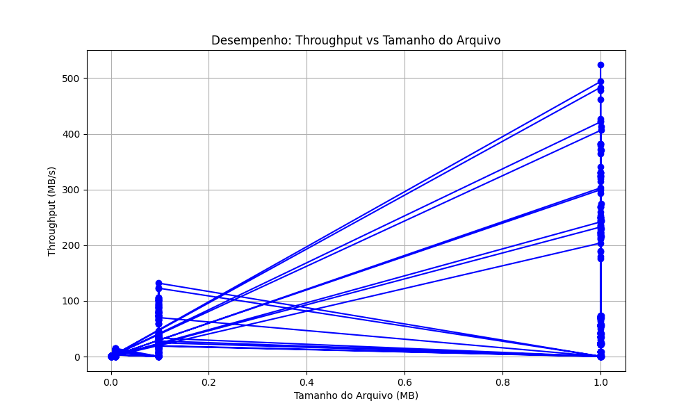

# Relatório de Testes de Criptografia

**Data da Execução:** 08/04/2026 16:38:27

## 1. Tabela de Desempenho

| Arquivo | Algoritmo | Modo | Tamanho (MB) | Tempo Médio (s) | Throughput (MB/s) | Entropia | Padrões Visíveis |
|---------|-----------|------|--------------|-----------------|-------------------|----------|------------------|
| csv_categorico_100KB.csv | AES-128 | ECB | 0.0977 | 0.0065 | 15.0158 | 7.9975 | ✅ Não |
| csv_categorico_100KB.csv | AES-128 | CBC | 0.0977 | 0.0046 | 21.1754 | 7.9982 | ✅ Não |
| csv_categorico_100KB.csv | AES-128 | CFB | 0.0977 | 0.0066 | 14.8280 | 7.9979 | ✅ Não |
| csv_categorico_100KB.csv | AES-128 | OFB | 0.0977 | 0.0045 | 21.7700 | 7.9983 | ✅ Não |
| csv_categorico_100KB.csv | AES-128 | CTR | 0.0977 | 0.0047 | 20.6876 | 7.9982 | ✅ Não |
| csv_categorico_100KB.csv | AES-256 | ECB | 0.0977 | 0.0012 | 79.8192 | 7.9977 | ✅ Não |
| csv_categorico_100KB.csv | AES-256 | CBC | 0.0977 | 0.0014 | 71.3440 | 7.9981 | ✅ Não |
| csv_categorico_100KB.csv | AES-256 | CFB | 0.0977 | 0.0036 | 26.7817 | 7.9981 | ✅ Não |
| csv_categorico_100KB.csv | AES-256 | OFB | 0.0977 | 0.0010 | 97.2483 | 7.9982 | ✅ Não |
| csv_categorico_100KB.csv | AES-256 | CTR | 0.0977 | 0.0038 | 25.7186 | 7.9982 | ✅ Não |
| csv_categorico_100KB.csv | DES | ECB | 0.0977 | 0.0034 | 29.0538 | 7.9391 | ✅ Não |
| csv_categorico_100KB.csv | DES | CBC | 0.0977 | 0.0029 | 33.8241 | 7.9982 | ✅ Não |
| csv_categorico_100KB.csv | DES | CFB | 0.0977 | 0.0127 | 7.6714 | 7.9980 | ✅ Não |
| csv_categorico_100KB.csv | DES | OFB | 0.0977 | 0.0026 | 37.8551 | 7.9981 | ✅ Não |
| csv_categorico_100KB.csv | DES | CTR | 0.0977 | 0.0030 | 32.8376 | 7.9978 | ✅ Não |
| csv_categorico_100KB.csv | 3DES | ECB | 0.0977 | 0.0056 | 17.5234 | 7.9491 | ✅ Não |
| csv_categorico_100KB.csv | 3DES | CBC | 0.0977 | 0.0055 | 17.6777 | 7.9980 | ✅ Não |
| csv_categorico_100KB.csv | 3DES | CFB | 0.0977 | 0.0343 | 2.8467 | 7.9981 | ✅ Não |
| csv_categorico_100KB.csv | 3DES | OFB | 0.0977 | 0.0056 | 17.5518 | 7.9982 | ✅ Não |
| csv_categorico_100KB.csv | 3DES | CTR | 0.0977 | 0.0061 | 16.1193 | 7.9983 | ✅ Não |
| csv_categorico_100KB.csv | RSA-2048 | ECB | 0.0977 | 0.2632 | 0.3711 | 7.9986 | ✅ Não |
| csv_categorico_100KB.csv | RSA-2048 | CBC | 0.0977 | 0.2672 | 0.3655 | 7.9983 | ✅ Não |
| csv_categorico_100KB.csv | RSA-2048 | CTR | 0.0977 | 0.2706 | 0.3609 | 7.9982 | ✅ Não |
| csv_categorico_10KB.csv | AES-128 | ECB | 0.0098 | 0.0027 | 3.5511 | 7.9837 | ✅ Não |
| csv_categorico_10KB.csv | AES-128 | CBC | 0.0098 | 0.0010 | 9.5194 | 7.9818 | ✅ Não |
| csv_categorico_10KB.csv | AES-128 | CFB | 0.0098 | 0.0012 | 7.9696 | 7.9842 | ✅ Não |
| csv_categorico_10KB.csv | AES-128 | OFB | 0.0098 | 0.0008 | 11.7505 | 7.9808 | ✅ Não |
| csv_categorico_10KB.csv | AES-128 | CTR | 0.0098 | 0.0017 | 5.6704 | 7.9814 | ✅ Não |
| csv_categorico_10KB.csv | AES-256 | ECB | 0.0098 | 0.0010 | 9.9208 | 7.9810 | ✅ Não |
| csv_categorico_10KB.csv | AES-256 | CBC | 0.0098 | 0.0020 | 4.9015 | 7.9823 | ✅ Não |
| csv_categorico_10KB.csv | AES-256 | CFB | 0.0098 | 0.0012 | 8.4242 | 7.9816 | ✅ Não |
| csv_categorico_10KB.csv | AES-256 | OFB | 0.0098 | 0.0008 | 11.9354 | 7.9817 | ✅ Não |
| csv_categorico_10KB.csv | AES-256 | CTR | 0.0098 | 0.0012 | 8.0759 | 7.9833 | ✅ Não |
| csv_categorico_10KB.csv | DES | ECB | 0.0098 | 0.0011 | 9.0081 | 7.9252 | ✅ Não |
| csv_categorico_10KB.csv | DES | CBC | 0.0098 | 0.0009 | 10.8748 | 7.9815 | ✅ Não |
| csv_categorico_10KB.csv | DES | CFB | 0.0098 | 0.0023 | 4.2028 | 7.9823 | ✅ Não |
| csv_categorico_10KB.csv | DES | OFB | 0.0098 | 0.0012 | 8.4562 | 7.9850 | ✅ Não |
| csv_categorico_10KB.csv | DES | CTR | 0.0098 | 0.0008 | 11.6975 | 7.9847 | ✅ Não |
| csv_categorico_10KB.csv | 3DES | ECB | 0.0098 | 0.0014 | 6.9520 | 7.9250 | ✅ Não |
| csv_categorico_10KB.csv | 3DES | CBC | 0.0098 | 0.0014 | 6.8645 | 7.9821 | ✅ Não |
| csv_categorico_10KB.csv | 3DES | CFB | 0.0098 | 0.0042 | 2.3154 | 7.9818 | ✅ Não |
| csv_categorico_10KB.csv | 3DES | OFB | 0.0098 | 0.0012 | 8.3653 | 7.9824 | ✅ Não |
| csv_categorico_10KB.csv | 3DES | CTR | 0.0098 | 0.0012 | 8.2292 | 7.9832 | ✅ Não |
| csv_categorico_10KB.csv | RSA-2048 | ECB | 0.0098 | 0.0271 | 0.3609 | 7.9833 | ✅ Não |
| csv_categorico_10KB.csv | RSA-2048 | CBC | 0.0098 | 0.0285 | 0.3429 | 7.9872 | ✅ Não |
| csv_categorico_10KB.csv | RSA-2048 | CTR | 0.0098 | 0.0299 | 0.3270 | 7.9794 | ✅ Não |
| csv_categorico_1KB.csv | AES-128 | ECB | 0.0010 | 0.0033 | 0.2932 | 7.8190 | ✅ Não |
| csv_categorico_1KB.csv | AES-128 | CBC | 0.0010 | 0.0009 | 1.1109 | 7.8195 | ✅ Não |
| csv_categorico_1KB.csv | AES-128 | CFB | 0.0010 | 0.0016 | 0.5939 | 7.8172 | ✅ Não |
| csv_categorico_1KB.csv | AES-128 | OFB | 0.0010 | 0.0008 | 1.1657 | 7.8066 | ✅ Não |
| csv_categorico_1KB.csv | AES-128 | CTR | 0.0010 | 0.0006 | 1.7186 | 7.8068 | ✅ Não |
| csv_categorico_1KB.csv | AES-256 | ECB | 0.0010 | 0.0008 | 1.1914 | 7.8385 | ✅ Não |
| csv_categorico_1KB.csv | AES-256 | CBC | 0.0010 | 0.0011 | 0.9190 | 7.8084 | ✅ Não |
| csv_categorico_1KB.csv | AES-256 | CFB | 0.0010 | 0.0006 | 1.5867 | 7.8229 | ✅ Não |
| csv_categorico_1KB.csv | AES-256 | OFB | 0.0010 | 0.0007 | 1.3592 | 7.8465 | ✅ Não |
| csv_categorico_1KB.csv | AES-256 | CTR | 0.0010 | 0.0006 | 1.5100 | 7.7604 | ✅ Não |
| csv_categorico_1KB.csv | DES | ECB | 0.0010 | 0.0007 | 1.4987 | 7.7444 | ✅ Não |
| csv_categorico_1KB.csv | DES | CBC | 0.0010 | 0.0007 | 1.3743 | 7.8018 | ✅ Não |
| csv_categorico_1KB.csv | DES | CFB | 0.0010 | 0.0007 | 1.3938 | 7.8440 | ✅ Não |
| csv_categorico_1KB.csv | DES | OFB | 0.0010 | 0.0007 | 1.3235 | 7.8050 | ✅ Não |
| csv_categorico_1KB.csv | DES | CTR | 0.0010 | 0.0007 | 1.3511 | 7.7849 | ✅ Não |
| csv_categorico_1KB.csv | 3DES | ECB | 0.0010 | 0.0010 | 0.9457 | 7.7655 | ✅ Não |
| csv_categorico_1KB.csv | 3DES | CBC | 0.0010 | 0.0009 | 1.0811 | 7.8141 | ✅ Não |
| csv_categorico_1KB.csv | 3DES | CFB | 0.0010 | 0.0011 | 0.9220 | 7.8217 | ✅ Não |
| csv_categorico_1KB.csv | 3DES | OFB | 0.0010 | 0.0010 | 1.0022 | 7.7946 | ✅ Não |
| csv_categorico_1KB.csv | 3DES | CTR | 0.0010 | 0.0009 | 1.0702 | 7.8037 | ✅ Não |
| csv_categorico_1KB.csv | RSA-2048 | ECB | 0.0010 | 0.0040 | 0.2467 | 7.8558 | ✅ Não |
| csv_categorico_1KB.csv | RSA-2048 | CBC | 0.0010 | 0.0036 | 0.2694 | 7.8744 | ✅ Não |
| csv_categorico_1KB.csv | RSA-2048 | CTR | 0.0010 | 0.0066 | 0.1490 | 7.7807 | ✅ Não |
| csv_categorico_1MB.csv | AES-128 | ECB | 1.0000 | 0.0033 | 302.9538 | 7.9992 | ✅ Não |
| csv_categorico_1MB.csv | AES-128 | CBC | 1.0000 | 0.0040 | 249.7561 | 7.9998 | ✅ Não |
| csv_categorico_1MB.csv | AES-128 | CFB | 1.0000 | 0.0238 | 42.0807 | 7.9998 | ✅ Não |
| csv_categorico_1MB.csv | AES-128 | OFB | 1.0000 | 0.0047 | 212.8926 | 7.9998 | ✅ Não |
| csv_categorico_1MB.csv | AES-128 | CTR | 1.0000 | 0.0026 | 381.9184 | 7.9998 | ✅ Não |
| csv_categorico_1MB.csv | AES-256 | ECB | 1.0000 | 0.0022 | 461.4399 | 7.9993 | ✅ Não |
| csv_categorico_1MB.csv | AES-256 | CBC | 1.0000 | 0.0056 | 179.9721 | 7.9998 | ✅ Não |
| csv_categorico_1MB.csv | AES-256 | CFB | 1.0000 | 0.0279 | 35.8277 | 7.9998 | ✅ Não |
| csv_categorico_1MB.csv | AES-256 | OFB | 1.0000 | 0.0043 | 231.8089 | 7.9998 | ✅ Não |
| csv_categorico_1MB.csv | AES-256 | CTR | 1.0000 | 0.0031 | 319.9756 | 7.9998 | ✅ Não |
| csv_categorico_1MB.csv | DES | ECB | 1.0000 | 0.0136 | 73.5669 | 7.9419 | ✅ Não |
| csv_categorico_1MB.csv | DES | CBC | 1.0000 | 0.0183 | 54.7801 | 7.9998 | ✅ Não |
| csv_categorico_1MB.csv | DES | CFB | 1.0000 | 0.1122 | 8.9102 | 7.9998 | ✅ Não |
| csv_categorico_1MB.csv | DES | OFB | 1.0000 | 0.0175 | 57.2140 | 7.9998 | ✅ Não |
| csv_categorico_1MB.csv | DES | CTR | 1.0000 | 0.0148 | 67.3722 | 7.9998 | ✅ Não |
| csv_categorico_1MB.csv | 3DES | ECB | 1.0000 | 0.0402 | 24.8976 | 7.9423 | ✅ Não |
| csv_categorico_1MB.csv | 3DES | CBC | 1.0000 | 0.0450 | 22.2243 | 7.9998 | ✅ Não |
| csv_categorico_1MB.csv | 3DES | CFB | 1.0000 | 0.3270 | 3.0585 | 7.9998 | ✅ Não |
| csv_categorico_1MB.csv | 3DES | OFB | 1.0000 | 0.0442 | 22.6458 | 7.9998 | ✅ Não |
| csv_categorico_1MB.csv | 3DES | CTR | 1.0000 | 0.0416 | 24.0213 | 7.9998 | ✅ Não |
| csv_categorico_1MB.csv | RSA-2048 | ECB | 1.0000 | 2.7761 | 0.3602 | 7.9999 | ✅ Não |
| csv_categorico_1MB.csv | RSA-2048 | CBC | 1.0000 | 2.9071 | 0.3440 | 7.9998 | ✅ Não |
| csv_categorico_1MB.csv | RSA-2048 | CTR | 1.0000 | 5.7881 | 0.1728 | 7.9998 | ✅ Não |
| csv_incremental_100KB.csv | AES-128 | ECB | 0.0977 | 0.0052 | 18.9069 | 7.9871 | ✅ Não |
| csv_incremental_100KB.csv | AES-128 | CBC | 0.0977 | 0.0026 | 37.2971 | 7.9982 | ✅ Não |
| csv_incremental_100KB.csv | AES-128 | CFB | 0.0977 | 0.0069 | 14.2010 | 7.9982 | ✅ Não |
| csv_incremental_100KB.csv | AES-128 | OFB | 0.0977 | 0.0027 | 36.5118 | 7.9984 | ✅ Não |
| csv_incremental_100KB.csv | AES-128 | CTR | 0.0977 | 0.0028 | 35.1295 | 7.9980 | ✅ Não |
| csv_incremental_100KB.csv | AES-256 | ECB | 0.0977 | 0.0030 | 32.8713 | 7.9880 | ✅ Não |
| csv_incremental_100KB.csv | AES-256 | CBC | 0.0977 | 0.0035 | 27.8930 | 7.9983 | ✅ Não |
| csv_incremental_100KB.csv | AES-256 | CFB | 0.0977 | 0.0081 | 12.0242 | 7.9983 | ✅ Não |
| csv_incremental_100KB.csv | AES-256 | OFB | 0.0977 | 0.0047 | 20.8110 | 7.9984 | ✅ Não |
| csv_incremental_100KB.csv | AES-256 | CTR | 0.0977 | 0.0042 | 23.4753 | 7.9983 | ✅ Não |
| csv_incremental_100KB.csv | DES | ECB | 0.0977 | 0.0044 | 22.1523 | 7.2652 | ✅ Não |
| csv_incremental_100KB.csv | DES | CBC | 0.0977 | 0.0058 | 16.7840 | 7.9979 | ✅ Não |
| csv_incremental_100KB.csv | DES | CFB | 0.0977 | 0.0206 | 4.7403 | 7.9982 | ✅ Não |
| csv_incremental_100KB.csv | DES | OFB | 0.0977 | 0.0052 | 18.7292 | 7.9981 | ✅ Não |
| csv_incremental_100KB.csv | DES | CTR | 0.0977 | 0.0052 | 18.8045 | 7.9984 | ✅ Não |
| csv_incremental_100KB.csv | 3DES | ECB | 0.0977 | 0.0109 | 8.9828 | 7.2258 | ✅ Não |
| csv_incremental_100KB.csv | 3DES | CBC | 0.0977 | 0.0123 | 7.9378 | 7.9981 | ✅ Não |
| csv_incremental_100KB.csv | 3DES | CFB | 0.0977 | 0.0559 | 1.7467 | 7.9983 | ✅ Não |
| csv_incremental_100KB.csv | 3DES | OFB | 0.0977 | 0.0087 | 11.1775 | 7.9980 | ✅ Não |
| csv_incremental_100KB.csv | 3DES | CTR | 0.0977 | 0.0082 | 11.8690 | 7.9983 | ✅ Não |
| csv_incremental_100KB.csv | RSA-2048 | ECB | 0.0977 | 0.5877 | 0.1662 | 7.9986 | ✅ Não |
| csv_incremental_100KB.csv | RSA-2048 | CBC | 0.0977 | 0.5881 | 0.1661 | 7.9986 | ✅ Não |
| csv_incremental_100KB.csv | RSA-2048 | CTR | 0.0977 | 0.4536 | 0.2153 | 7.9980 | ✅ Não |
| csv_incremental_10KB.csv | AES-128 | ECB | 0.0098 | 0.0031 | 3.1483 | 7.8835 | ✅ Não |
| csv_incremental_10KB.csv | AES-128 | CBC | 0.0098 | 0.0007 | 13.5039 | 7.9808 | ✅ Não |
| csv_incremental_10KB.csv | AES-128 | CFB | 0.0098 | 0.0014 | 7.0078 | 7.9829 | ✅ Não |
| csv_incremental_10KB.csv | AES-128 | OFB | 0.0098 | 0.0020 | 4.9946 | 7.9825 | ✅ Não |
| csv_incremental_10KB.csv | AES-128 | CTR | 0.0098 | 0.0011 | 9.0857 | 7.9796 | ✅ Não |
| csv_incremental_10KB.csv | AES-256 | ECB | 0.0098 | 0.0008 | 11.6556 | 7.8885 | ✅ Não |
| csv_incremental_10KB.csv | AES-256 | CBC | 0.0098 | 0.0023 | 4.2163 | 7.9846 | ✅ Não |
| csv_incremental_10KB.csv | AES-256 | CFB | 0.0098 | 0.0013 | 7.8082 | 7.9819 | ✅ Não |
| csv_incremental_10KB.csv | AES-256 | OFB | 0.0098 | 0.0013 | 7.4558 | 7.9825 | ✅ Não |
| csv_incremental_10KB.csv | AES-256 | CTR | 0.0098 | 0.0013 | 7.3967 | 7.9809 | ✅ Não |
| csv_incremental_10KB.csv | DES | ECB | 0.0098 | 0.0011 | 8.8150 | 7.4772 | ✅ Não |
| csv_incremental_10KB.csv | DES | CBC | 0.0098 | 0.0017 | 5.7923 | 7.9818 | ✅ Não |
| csv_incremental_10KB.csv | DES | CFB | 0.0098 | 0.0025 | 3.9468 | 7.9817 | ✅ Não |
| csv_incremental_10KB.csv | DES | OFB | 0.0098 | 0.0020 | 4.8291 | 7.9817 | ✅ Não |
| csv_incremental_10KB.csv | DES | CTR | 0.0098 | 0.0018 | 5.4386 | 7.9828 | ✅ Não |
| csv_incremental_10KB.csv | 3DES | ECB | 0.0098 | 0.0021 | 4.5512 | 7.5181 | ✅ Não |
| csv_incremental_10KB.csv | 3DES | CBC | 0.0098 | 0.0014 | 7.0499 | 7.9834 | ✅ Não |
| csv_incremental_10KB.csv | 3DES | CFB | 0.0098 | 0.0051 | 1.9082 | 7.9828 | ✅ Não |
| csv_incremental_10KB.csv | 3DES | OFB | 0.0098 | 0.0013 | 7.2379 | 7.9812 | ✅ Não |
| csv_incremental_10KB.csv | 3DES | CTR | 0.0098 | 0.0014 | 7.0998 | 7.9854 | ✅ Não |
| csv_incremental_10KB.csv | RSA-2048 | ECB | 0.0098 | 0.0299 | 0.3271 | 7.9855 | ✅ Não |
| csv_incremental_10KB.csv | RSA-2048 | CBC | 0.0098 | 0.0362 | 0.2700 | 7.9861 | ✅ Não |
| csv_incremental_10KB.csv | RSA-2048 | CTR | 0.0098 | 0.0313 | 0.3117 | 7.9843 | ✅ Não |
| csv_incremental_1KB.csv | AES-128 | ECB | 0.0010 | 0.0034 | 0.2901 | 7.6270 | ✅ Não |
| csv_incremental_1KB.csv | AES-128 | CBC | 0.0010 | 0.0011 | 0.9157 | 7.8181 | ✅ Não |
| csv_incremental_1KB.csv | AES-128 | CFB | 0.0010 | 0.0013 | 0.7687 | 7.8063 | ✅ Não |
| csv_incremental_1KB.csv | AES-128 | OFB | 0.0010 | 0.0008 | 1.1997 | 7.8196 | ✅ Não |
| csv_incremental_1KB.csv | AES-128 | CTR | 0.0010 | 0.0007 | 1.4181 | 7.8339 | ✅ Não |
| csv_incremental_1KB.csv | AES-256 | ECB | 0.0010 | 0.0013 | 0.7470 | 7.6223 | ✅ Não |
| csv_incremental_1KB.csv | AES-256 | CBC | 0.0010 | 0.0007 | 1.4481 | 7.8337 | ✅ Não |
| csv_incremental_1KB.csv | AES-256 | CFB | 0.0010 | 0.0007 | 1.3339 | 7.8193 | ✅ Não |
| csv_incremental_1KB.csv | AES-256 | OFB | 0.0010 | 0.0010 | 1.0267 | 7.8087 | ✅ Não |
| csv_incremental_1KB.csv | AES-256 | CTR | 0.0010 | 0.0009 | 1.0496 | 7.8079 | ✅ Não |
| csv_incremental_1KB.csv | DES | ECB | 0.0010 | 0.0007 | 1.4841 | 7.1486 | ✅ Não |
| csv_incremental_1KB.csv | DES | CBC | 0.0010 | 0.0014 | 0.6788 | 7.7744 | ✅ Não |
| csv_incremental_1KB.csv | DES | CFB | 0.0010 | 0.0017 | 0.5596 | 7.7873 | ✅ Não |
| csv_incremental_1KB.csv | DES | OFB | 0.0010 | 0.0010 | 0.9601 | 7.7964 | ✅ Não |
| csv_incremental_1KB.csv | DES | CTR | 0.0010 | 0.0019 | 0.5184 | 7.8213 | ✅ Não |
| csv_incremental_1KB.csv | 3DES | ECB | 0.0010 | 0.0017 | 0.5692 | 7.0944 | ✅ Não |
| csv_incremental_1KB.csv | 3DES | CBC | 0.0010 | 0.0012 | 0.7943 | 7.8044 | ✅ Não |
| csv_incremental_1KB.csv | 3DES | CFB | 0.0010 | 0.0019 | 0.5256 | 7.8180 | ✅ Não |
| csv_incremental_1KB.csv | 3DES | OFB | 0.0010 | 0.0008 | 1.2280 | 7.7948 | ✅ Não |
| csv_incremental_1KB.csv | 3DES | CTR | 0.0010 | 0.0016 | 0.6153 | 7.8065 | ✅ Não |
| csv_incremental_1KB.csv | RSA-2048 | ECB | 0.0010 | 0.0043 | 0.2248 | 7.8535 | ✅ Não |
| csv_incremental_1KB.csv | RSA-2048 | CBC | 0.0010 | 0.0036 | 0.2686 | 7.8648 | ✅ Não |
| csv_incremental_1KB.csv | RSA-2048 | CTR | 0.0010 | 0.0038 | 0.2596 | 7.8247 | ✅ Não |
| csv_incremental_1MB.csv | AES-128 | ECB | 1.0000 | 0.0041 | 241.8902 | 7.9410 | ✅ Não |
| csv_incremental_1MB.csv | AES-128 | CBC | 1.0000 | 0.0041 | 244.4874 | 7.9998 | ✅ Não |
| csv_incremental_1MB.csv | AES-128 | CFB | 1.0000 | 0.0237 | 42.2444 | 7.9998 | ✅ Não |
| csv_incremental_1MB.csv | AES-128 | OFB | 1.0000 | 0.0042 | 237.8074 | 7.9998 | ✅ Não |
| csv_incremental_1MB.csv | AES-128 | CTR | 1.0000 | 0.0031 | 323.3352 | 7.9998 | ✅ Não |
| csv_incremental_1MB.csv | AES-256 | ECB | 1.0000 | 0.0024 | 423.4276 | 7.9314 | ✅ Não |
| csv_incremental_1MB.csv | AES-256 | CBC | 1.0000 | 0.0041 | 246.2501 | 7.9999 | ✅ Não |
| csv_incremental_1MB.csv | AES-256 | CFB | 1.0000 | 0.0288 | 34.7447 | 7.9998 | ✅ Não |
| csv_incremental_1MB.csv | AES-256 | OFB | 1.0000 | 0.0053 | 190.3845 | 7.9998 | ✅ Não |
| csv_incremental_1MB.csv | AES-256 | CTR | 1.0000 | 0.0031 | 326.4888 | 7.9998 | ✅ Não |
| csv_incremental_1MB.csv | DES | ECB | 1.0000 | 0.0139 | 71.9695 | 7.6072 | ✅ Não |
| csv_incremental_1MB.csv | DES | CBC | 1.0000 | 0.0184 | 54.2989 | 7.9998 | ✅ Não |
| csv_incremental_1MB.csv | DES | CFB | 1.0000 | 0.1122 | 8.9149 | 7.9998 | ✅ Não |
| csv_incremental_1MB.csv | DES | OFB | 1.0000 | 0.0177 | 56.4215 | 7.9998 | ✅ Não |
| csv_incremental_1MB.csv | DES | CTR | 1.0000 | 0.0142 | 70.3839 | 7.9998 | ✅ Não |
| csv_incremental_1MB.csv | 3DES | ECB | 1.0000 | 0.0407 | 24.5838 | 7.5840 | ✅ Não |
| csv_incremental_1MB.csv | 3DES | CBC | 1.0000 | 0.0467 | 21.4308 | 7.9998 | ✅ Não |
| csv_incremental_1MB.csv | 3DES | CFB | 1.0000 | 0.3270 | 3.0581 | 7.9998 | ✅ Não |
| csv_incremental_1MB.csv | 3DES | OFB | 1.0000 | 0.0444 | 22.5476 | 7.9998 | ✅ Não |
| csv_incremental_1MB.csv | 3DES | CTR | 1.0000 | 0.0431 | 23.1949 | 7.9998 | ✅ Não |
| csv_incremental_1MB.csv | RSA-2048 | ECB | 1.0000 | 2.6453 | 0.3780 | 7.9998 | ✅ Não |
| csv_incremental_1MB.csv | RSA-2048 | CBC | 1.0000 | 2.6733 | 0.3741 | 7.9999 | ✅ Não |
| csv_incremental_1MB.csv | RSA-2048 | CTR | 1.0000 | 2.6882 | 0.3720 | 7.9998 | ✅ Não |
| csv_realista_100KB.csv | AES-128 | ECB | 0.0977 | 0.0035 | 28.1442 | 7.9966 | ✅ Não |
| csv_realista_100KB.csv | AES-128 | CBC | 0.0977 | 0.0013 | 75.7270 | 7.9983 | ✅ Não |
| csv_realista_100KB.csv | AES-128 | CFB | 0.0977 | 0.0030 | 32.1944 | 7.9981 | ✅ Não |
| csv_realista_100KB.csv | AES-128 | OFB | 0.0977 | 0.0010 | 101.2408 | 7.9983 | ✅ Não |
| csv_realista_100KB.csv | AES-128 | CTR | 0.0977 | 0.0011 | 90.3416 | 7.9982 | ✅ Não |
| csv_realista_100KB.csv | AES-256 | ECB | 0.0977 | 0.0017 | 58.2199 | 7.9967 | ✅ Não |
| csv_realista_100KB.csv | AES-256 | CBC | 0.0977 | 0.0012 | 79.9079 | 7.9982 | ✅ Não |
| csv_realista_100KB.csv | AES-256 | CFB | 0.0977 | 0.0039 | 25.0615 | 7.9982 | ✅ Não |
| csv_realista_100KB.csv | AES-256 | OFB | 0.0977 | 0.0015 | 65.8976 | 7.9981 | ✅ Não |
| csv_realista_100KB.csv | AES-256 | CTR | 0.0977 | 0.0009 | 105.9466 | 7.9984 | ✅ Não |
| csv_realista_100KB.csv | DES | ECB | 0.0977 | 0.0024 | 40.2848 | 7.9422 | ✅ Não |
| csv_realista_100KB.csv | DES | CBC | 0.0977 | 0.0027 | 35.6171 | 7.9983 | ✅ Não |
| csv_realista_100KB.csv | DES | CFB | 0.0977 | 0.0119 | 8.2147 | 7.9982 | ✅ Não |
| csv_realista_100KB.csv | DES | OFB | 0.0977 | 0.0029 | 34.0723 | 7.9981 | ✅ Não |
| csv_realista_100KB.csv | DES | CTR | 0.0977 | 0.0023 | 43.4027 | 7.9984 | ✅ Não |
| csv_realista_100KB.csv | 3DES | ECB | 0.0977 | 0.0049 | 19.8858 | 7.9494 | ✅ Não |
| csv_realista_100KB.csv | 3DES | CBC | 0.0977 | 0.0054 | 17.9736 | 7.9982 | ✅ Não |
| csv_realista_100KB.csv | 3DES | CFB | 0.0977 | 0.0332 | 2.9390 | 7.9984 | ✅ Não |
| csv_realista_100KB.csv | 3DES | OFB | 0.0977 | 0.0055 | 17.7138 | 7.9984 | ✅ Não |
| csv_realista_100KB.csv | 3DES | CTR | 0.0977 | 0.0056 | 17.5882 | 7.9979 | ✅ Não |
| csv_realista_100KB.csv | RSA-2048 | ECB | 0.0977 | 0.2576 | 0.3792 | 7.9987 | ✅ Não |
| csv_realista_100KB.csv | RSA-2048 | CBC | 0.0977 | 0.2633 | 0.3709 | 7.9985 | ✅ Não |
| csv_realista_100KB.csv | RSA-2048 | CTR | 0.0977 | 0.2618 | 0.3730 | 7.9982 | ✅ Não |
| csv_realista_10KB.csv | AES-128 | ECB | 0.0098 | 0.0028 | 3.5428 | 7.9834 | ✅ Não |
| csv_realista_10KB.csv | AES-128 | CBC | 0.0098 | 0.0008 | 12.8562 | 7.9821 | ✅ Não |
| csv_realista_10KB.csv | AES-128 | CFB | 0.0098 | 0.0012 | 8.4682 | 7.9826 | ✅ Não |
| csv_realista_10KB.csv | AES-128 | OFB | 0.0098 | 0.0010 | 9.3610 | 7.9811 | ✅ Não |
| csv_realista_10KB.csv | AES-128 | CTR | 0.0098 | 0.0011 | 8.7275 | 7.9827 | ✅ Não |
| csv_realista_10KB.csv | AES-256 | ECB | 0.0098 | 0.0008 | 11.7106 | 7.9817 | ✅ Não |
| csv_realista_10KB.csv | AES-256 | CBC | 0.0098 | 0.0014 | 7.1543 | 7.9798 | ✅ Não |
| csv_realista_10KB.csv | AES-256 | CFB | 0.0098 | 0.0011 | 9.0627 | 7.9824 | ✅ Não |
| csv_realista_10KB.csv | AES-256 | OFB | 0.0098 | 0.0008 | 12.2269 | 7.9799 | ✅ Não |
| csv_realista_10KB.csv | AES-256 | CTR | 0.0098 | 0.0007 | 13.4839 | 7.9841 | ✅ Não |
| csv_realista_10KB.csv | DES | ECB | 0.0098 | 0.0012 | 8.4131 | 7.9256 | ✅ Não |
| csv_realista_10KB.csv | DES | CBC | 0.0098 | 0.0008 | 11.7455 | 7.9808 | ✅ Não |
| csv_realista_10KB.csv | DES | CFB | 0.0098 | 0.0019 | 5.0144 | 7.9816 | ✅ Não |
| csv_realista_10KB.csv | DES | OFB | 0.0098 | 0.0008 | 12.5287 | 7.9820 | ✅ Não |
| csv_realista_10KB.csv | DES | CTR | 0.0098 | 0.0010 | 9.9246 | 7.9833 | ✅ Não |
| csv_realista_10KB.csv | 3DES | ECB | 0.0098 | 0.0015 | 6.4370 | 7.9273 | ✅ Não |
| csv_realista_10KB.csv | 3DES | CBC | 0.0098 | 0.0017 | 5.7444 | 7.9847 | ✅ Não |
| csv_realista_10KB.csv | 3DES | CFB | 0.0098 | 0.0045 | 2.1637 | 7.9816 | ✅ Não |
| csv_realista_10KB.csv | 3DES | OFB | 0.0098 | 0.0017 | 5.8441 | 7.9814 | ✅ Não |
| csv_realista_10KB.csv | 3DES | CTR | 0.0098 | 0.0015 | 6.6197 | 7.9819 | ✅ Não |
| csv_realista_10KB.csv | RSA-2048 | ECB | 0.0098 | 0.0278 | 0.3516 | 7.9841 | ✅ Não |
| csv_realista_10KB.csv | RSA-2048 | CBC | 0.0098 | 0.0279 | 0.3505 | 7.9862 | ✅ Não |
| csv_realista_10KB.csv | RSA-2048 | CTR | 0.0098 | 0.0272 | 0.3591 | 7.9835 | ✅ Não |
| csv_realista_1KB.csv | AES-128 | ECB | 0.0010 | 0.0009 | 1.0993 | 7.8176 | ✅ Não |
| csv_realista_1KB.csv | AES-128 | CBC | 0.0010 | 0.0007 | 1.4074 | 7.7982 | ✅ Não |
| csv_realista_1KB.csv | AES-128 | CFB | 0.0010 | 0.0010 | 0.9618 | 7.7903 | ✅ Não |
| csv_realista_1KB.csv | AES-128 | OFB | 0.0010 | 0.0011 | 0.9198 | 7.8137 | ✅ Não |
| csv_realista_1KB.csv | AES-128 | CTR | 0.0010 | 0.0006 | 1.7066 | 7.8236 | ✅ Não |
| csv_realista_1KB.csv | AES-256 | ECB | 0.0010 | 0.0007 | 1.4069 | 7.8065 | ✅ Não |
| csv_realista_1KB.csv | AES-256 | CBC | 0.0010 | 0.0007 | 1.5005 | 7.8083 | ✅ Não |
| csv_realista_1KB.csv | AES-256 | CFB | 0.0010 | 0.0010 | 0.9652 | 7.8057 | ✅ Não |
| csv_realista_1KB.csv | AES-256 | OFB | 0.0010 | 0.0020 | 0.4852 | 7.8134 | ✅ Não |
| csv_realista_1KB.csv | AES-256 | CTR | 0.0010 | 0.0013 | 0.7426 | 7.7977 | ✅ Não |
| csv_realista_1KB.csv | DES | ECB | 0.0010 | 0.0013 | 0.7454 | 7.7752 | ✅ Não |
| csv_realista_1KB.csv | DES | CBC | 0.0010 | 0.0007 | 1.3731 | 7.8246 | ✅ Não |
| csv_realista_1KB.csv | DES | CFB | 0.0010 | 0.0011 | 0.8644 | 7.8181 | ✅ Não |
| csv_realista_1KB.csv | DES | OFB | 0.0010 | 0.0006 | 1.6108 | 7.8011 | ✅ Não |
| csv_realista_1KB.csv | DES | CTR | 0.0010 | 0.0009 | 1.0284 | 7.7947 | ✅ Não |
| csv_realista_1KB.csv | 3DES | ECB | 0.0010 | 0.0008 | 1.1891 | 7.7528 | ✅ Não |
| csv_realista_1KB.csv | 3DES | CBC | 0.0010 | 0.0008 | 1.1685 | 7.8179 | ✅ Não |
| csv_realista_1KB.csv | 3DES | CFB | 0.0010 | 0.0011 | 0.8744 | 7.8151 | ✅ Não |
| csv_realista_1KB.csv | 3DES | OFB | 0.0010 | 0.0012 | 0.8392 | 7.7968 | ✅ Não |
| csv_realista_1KB.csv | 3DES | CTR | 0.0010 | 0.0012 | 0.8254 | 7.8085 | ✅ Não |
| csv_realista_1KB.csv | RSA-2048 | ECB | 0.0010 | 0.0039 | 0.2502 | 7.8286 | ✅ Não |
| csv_realista_1KB.csv | RSA-2048 | CBC | 0.0010 | 0.0040 | 0.2443 | 7.8761 | ✅ Não |
| csv_realista_1KB.csv | RSA-2048 | CTR | 0.0010 | 0.0041 | 0.2386 | 7.8271 | ✅ Não |
| csv_realista_1MB.csv | AES-128 | ECB | 1.0000 | 0.0049 | 203.9515 | 7.9983 | ✅ Não |
| csv_realista_1MB.csv | AES-128 | CBC | 1.0000 | 0.0037 | 268.4990 | 7.9998 | ✅ Não |
| csv_realista_1MB.csv | AES-128 | CFB | 1.0000 | 0.0230 | 43.4067 | 7.9998 | ✅ Não |
| csv_realista_1MB.csv | AES-128 | OFB | 1.0000 | 0.0040 | 249.3374 | 7.9998 | ✅ Não |
| csv_realista_1MB.csv | AES-128 | CTR | 1.0000 | 0.0030 | 330.5699 | 7.9998 | ✅ Não |
| csv_realista_1MB.csv | AES-256 | ECB | 1.0000 | 0.0030 | 329.4146 | 7.9983 | ✅ Não |
| csv_realista_1MB.csv | AES-256 | CBC | 1.0000 | 0.0044 | 228.2428 | 7.9998 | ✅ Não |
| csv_realista_1MB.csv | AES-256 | CFB | 1.0000 | 0.0281 | 35.5988 | 7.9998 | ✅ Não |
| csv_realista_1MB.csv | AES-256 | OFB | 1.0000 | 0.0047 | 214.8732 | 7.9998 | ✅ Não |
| csv_realista_1MB.csv | AES-256 | CTR | 1.0000 | 0.0031 | 322.9692 | 7.9998 | ✅ Não |
| csv_realista_1MB.csv | DES | ECB | 1.0000 | 0.0140 | 71.6548 | 7.9495 | ✅ Não |
| csv_realista_1MB.csv | DES | CBC | 1.0000 | 0.0179 | 55.7481 | 7.9998 | ✅ Não |
| csv_realista_1MB.csv | DES | CFB | 1.0000 | 0.1140 | 8.7711 | 7.9998 | ✅ Não |
| csv_realista_1MB.csv | DES | OFB | 1.0000 | 0.0176 | 56.9007 | 7.9998 | ✅ Não |
| csv_realista_1MB.csv | DES | CTR | 1.0000 | 0.0145 | 68.8838 | 7.9998 | ✅ Não |
| csv_realista_1MB.csv | 3DES | ECB | 1.0000 | 0.0403 | 24.8410 | 7.9491 | ✅ Não |
| csv_realista_1MB.csv | 3DES | CBC | 1.0000 | 0.0446 | 22.4401 | 7.9998 | ✅ Não |
| csv_realista_1MB.csv | 3DES | CFB | 1.0000 | 0.3225 | 3.1005 | 7.9998 | ✅ Não |
| csv_realista_1MB.csv | 3DES | OFB | 1.0000 | 0.0450 | 22.1992 | 7.9998 | ✅ Não |
| csv_realista_1MB.csv | 3DES | CTR | 1.0000 | 0.0421 | 23.7516 | 7.9998 | ✅ Não |
| csv_realista_1MB.csv | RSA-2048 | ECB | 1.0000 | 2.6112 | 0.3830 | 7.9998 | ✅ Não |
| csv_realista_1MB.csv | RSA-2048 | CBC | 1.0000 | 2.6982 | 0.3706 | 7.9998 | ✅ Não |
| csv_realista_1MB.csv | RSA-2048 | CTR | 1.0000 | 2.6785 | 0.3733 | 7.9998 | ✅ Não |
| csv_repetitivo_100KB.csv | AES-128 | ECB | 0.0977 | 0.0050 | 19.4751 | 6.8648 | ⚠️ Sim |
| csv_repetitivo_100KB.csv | AES-128 | CBC | 0.0977 | 0.0011 | 87.5008 | 7.9981 | ✅ Não |
| csv_repetitivo_100KB.csv | AES-128 | CFB | 0.0977 | 0.0034 | 28.6022 | 7.9982 | ✅ Não |
| csv_repetitivo_100KB.csv | AES-128 | OFB | 0.0977 | 0.0010 | 98.6489 | 7.9980 | ✅ Não |
| csv_repetitivo_100KB.csv | AES-128 | CTR | 0.0977 | 0.0012 | 78.1948 | 7.9983 | ✅ Não |
| csv_repetitivo_100KB.csv | AES-256 | ECB | 0.0977 | 0.0010 | 101.5269 | 6.8519 | ⚠️ Sim |
| csv_repetitivo_100KB.csv | AES-256 | CBC | 0.0977 | 0.0013 | 74.1398 | 7.9982 | ✅ Não |
| csv_repetitivo_100KB.csv | AES-256 | CFB | 0.0977 | 0.0037 | 26.1622 | 7.9981 | ✅ Não |
| csv_repetitivo_100KB.csv | AES-256 | OFB | 0.0977 | 0.0011 | 88.3539 | 7.9984 | ✅ Não |
| csv_repetitivo_100KB.csv | AES-256 | CTR | 0.0977 | 0.0012 | 80.7937 | 7.9984 | ✅ Não |
| csv_repetitivo_100KB.csv | DES | ECB | 0.0977 | 0.0025 | 38.3869 | 6.1048 | ⚠️ Sim |
| csv_repetitivo_100KB.csv | DES | CBC | 0.0977 | 0.0028 | 35.5001 | 7.9982 | ✅ Não |
| csv_repetitivo_100KB.csv | DES | CFB | 0.0977 | 0.0123 | 7.9551 | 7.9979 | ✅ Não |
| csv_repetitivo_100KB.csv | DES | OFB | 0.0977 | 0.0029 | 33.8370 | 7.9981 | ✅ Não |
| csv_repetitivo_100KB.csv | DES | CTR | 0.0977 | 0.0021 | 45.5076 | 7.9983 | ✅ Não |
| csv_repetitivo_100KB.csv | 3DES | ECB | 0.0977 | 0.0051 | 19.1017 | 6.0192 | ⚠️ Sim |
| csv_repetitivo_100KB.csv | 3DES | CBC | 0.0977 | 0.0056 | 17.4576 | 7.9982 | ✅ Não |
| csv_repetitivo_100KB.csv | 3DES | CFB | 0.0977 | 0.0351 | 2.7791 | 7.9983 | ✅ Não |
| csv_repetitivo_100KB.csv | 3DES | OFB | 0.0977 | 0.0053 | 18.2901 | 7.9981 | ✅ Não |
| csv_repetitivo_100KB.csv | 3DES | CTR | 0.0977 | 0.0052 | 18.7806 | 7.9983 | ✅ Não |
| csv_repetitivo_100KB.csv | RSA-2048 | ECB | 0.0977 | 0.2607 | 0.3745 | 7.9985 | ✅ Não |
| csv_repetitivo_100KB.csv | RSA-2048 | CBC | 0.0977 | 0.2678 | 0.3647 | 7.9984 | ✅ Não |
| csv_repetitivo_100KB.csv | RSA-2048 | CTR | 0.0977 | 0.2699 | 0.3619 | 7.9983 | ✅ Não |
| csv_repetitivo_10KB.csv | AES-128 | ECB | 0.0098 | 0.0032 | 3.0424 | 6.9006 | ⚠️ Sim |
| csv_repetitivo_10KB.csv | AES-128 | CBC | 0.0098 | 0.0013 | 7.3998 | 7.9831 | ✅ Não |
| csv_repetitivo_10KB.csv | AES-128 | CFB | 0.0098 | 0.0024 | 4.0918 | 7.9794 | ✅ Não |
| csv_repetitivo_10KB.csv | AES-128 | OFB | 0.0098 | 0.0023 | 4.3280 | 7.9841 | ✅ Não |
| csv_repetitivo_10KB.csv | AES-128 | CTR | 0.0098 | 0.0020 | 4.8568 | 7.9817 | ✅ Não |
| csv_repetitivo_10KB.csv | AES-256 | ECB | 0.0098 | 0.0021 | 4.5510 | 6.9110 | ⚠️ Sim |
| csv_repetitivo_10KB.csv | AES-256 | CBC | 0.0098 | 0.0025 | 3.8465 | 7.9802 | ✅ Não |
| csv_repetitivo_10KB.csv | AES-256 | CFB | 0.0098 | 0.0017 | 5.8022 | 7.9804 | ✅ Não |
| csv_repetitivo_10KB.csv | AES-256 | OFB | 0.0098 | 0.0017 | 5.7188 | 7.9814 | ✅ Não |
| csv_repetitivo_10KB.csv | AES-256 | CTR | 0.0098 | 0.0021 | 4.5895 | 7.9819 | ✅ Não |
| csv_repetitivo_10KB.csv | DES | ECB | 0.0098 | 0.0028 | 3.4328 | 6.1181 | ⚠️ Sim |
| csv_repetitivo_10KB.csv | DES | CBC | 0.0098 | 0.0020 | 4.9899 | 7.9814 | ✅ Não |
| csv_repetitivo_10KB.csv | DES | CFB | 0.0098 | 0.0026 | 3.7903 | 7.9830 | ✅ Não |
| csv_repetitivo_10KB.csv | DES | OFB | 0.0098 | 0.0021 | 4.6780 | 7.9805 | ✅ Não |
| csv_repetitivo_10KB.csv | DES | CTR | 0.0098 | 0.0019 | 5.0635 | 7.9794 | ✅ Não |
| csv_repetitivo_10KB.csv | 3DES | ECB | 0.0098 | 0.0017 | 5.7874 | 6.0213 | ⚠️ Sim |
| csv_repetitivo_10KB.csv | 3DES | CBC | 0.0098 | 0.0022 | 4.4312 | 7.9830 | ✅ Não |
| csv_repetitivo_10KB.csv | 3DES | CFB | 0.0098 | 0.0047 | 2.0603 | 7.9848 | ✅ Não |
| csv_repetitivo_10KB.csv | 3DES | OFB | 0.0098 | 0.0025 | 3.8706 | 7.9827 | ✅ Não |
| csv_repetitivo_10KB.csv | 3DES | CTR | 0.0098 | 0.0026 | 3.7967 | 7.9826 | ✅ Não |
| csv_repetitivo_10KB.csv | RSA-2048 | ECB | 0.0098 | 0.0284 | 0.3438 | 7.9843 | ✅ Não |
| csv_repetitivo_10KB.csv | RSA-2048 | CBC | 0.0098 | 0.0285 | 0.3425 | 7.9861 | ✅ Não |
| csv_repetitivo_10KB.csv | RSA-2048 | CTR | 0.0098 | 0.0306 | 0.3192 | 7.9839 | ✅ Não |
| csv_repetitivo_1KB.csv | AES-128 | ECB | 0.0010 | 0.0029 | 0.3403 | 7.0043 | ✅ Não |
| csv_repetitivo_1KB.csv | AES-128 | CBC | 0.0010 | 0.0010 | 0.9412 | 7.8095 | ✅ Não |
| csv_repetitivo_1KB.csv | AES-128 | CFB | 0.0010 | 0.0012 | 0.8265 | 7.7885 | ✅ Não |
| csv_repetitivo_1KB.csv | AES-128 | OFB | 0.0010 | 0.0012 | 0.8037 | 7.8264 | ✅ Não |
| csv_repetitivo_1KB.csv | AES-128 | CTR | 0.0010 | 0.0008 | 1.1694 | 7.7860 | ✅ Não |
| csv_repetitivo_1KB.csv | AES-256 | ECB | 0.0010 | 0.0006 | 1.5687 | 7.0415 | ✅ Não |
| csv_repetitivo_1KB.csv | AES-256 | CBC | 0.0010 | 0.0007 | 1.4418 | 7.8033 | ✅ Não |
| csv_repetitivo_1KB.csv | AES-256 | CFB | 0.0010 | 0.0023 | 0.4200 | 7.8082 | ✅ Não |
| csv_repetitivo_1KB.csv | AES-256 | OFB | 0.0010 | 0.0011 | 0.8714 | 7.8319 | ✅ Não |
| csv_repetitivo_1KB.csv | AES-256 | CTR | 0.0010 | 0.0007 | 1.3994 | 7.7978 | ✅ Não |
| csv_repetitivo_1KB.csv | DES | ECB | 0.0010 | 0.0008 | 1.1691 | 6.2737 | ⚠️ Sim |
| csv_repetitivo_1KB.csv | DES | CBC | 0.0010 | 0.0007 | 1.4893 | 7.8267 | ✅ Não |
| csv_repetitivo_1KB.csv | DES | CFB | 0.0010 | 0.0007 | 1.4815 | 7.8423 | ✅ Não |
| csv_repetitivo_1KB.csv | DES | OFB | 0.0010 | 0.0006 | 1.7376 | 7.8028 | ✅ Não |
| csv_repetitivo_1KB.csv | DES | CTR | 0.0010 | 0.0008 | 1.2422 | 7.7768 | ✅ Não |
| csv_repetitivo_1KB.csv | 3DES | ECB | 0.0010 | 0.0010 | 1.0105 | 6.1342 | ⚠️ Sim |
| csv_repetitivo_1KB.csv | 3DES | CBC | 0.0010 | 0.0017 | 0.5666 | 7.8149 | ✅ Não |
| csv_repetitivo_1KB.csv | 3DES | CFB | 0.0010 | 0.0013 | 0.7502 | 7.8110 | ✅ Não |
| csv_repetitivo_1KB.csv | 3DES | OFB | 0.0010 | 0.0010 | 1.0267 | 7.7973 | ✅ Não |
| csv_repetitivo_1KB.csv | 3DES | CTR | 0.0010 | 0.0012 | 0.8343 | 7.8019 | ✅ Não |
| csv_repetitivo_1KB.csv | RSA-2048 | ECB | 0.0010 | 0.0033 | 0.2963 | 7.8741 | ✅ Não |
| csv_repetitivo_1KB.csv | RSA-2048 | CBC | 0.0010 | 0.0028 | 0.3512 | 7.8667 | ✅ Não |
| csv_repetitivo_1KB.csv | RSA-2048 | CTR | 0.0010 | 0.0029 | 0.3355 | 7.8280 | ✅ Não |
| csv_repetitivo_1MB.csv | AES-128 | ECB | 1.0000 | 0.0033 | 299.6338 | 6.8047 | ⚠️ Sim |
| csv_repetitivo_1MB.csv | AES-128 | CBC | 1.0000 | 0.0037 | 268.2500 | 7.9998 | ✅ Não |
| csv_repetitivo_1MB.csv | AES-128 | CFB | 1.0000 | 0.0239 | 41.9103 | 7.9998 | ✅ Não |
| csv_repetitivo_1MB.csv | AES-128 | OFB | 1.0000 | 0.0040 | 251.2838 | 7.9998 | ✅ Não |
| csv_repetitivo_1MB.csv | AES-128 | CTR | 1.0000 | 0.0034 | 293.6632 | 7.9998 | ✅ Não |
| csv_repetitivo_1MB.csv | AES-256 | ECB | 1.0000 | 0.0030 | 330.7654 | 6.8729 | ⚠️ Sim |
| csv_repetitivo_1MB.csv | AES-256 | CBC | 1.0000 | 0.0040 | 249.2115 | 7.9998 | ✅ Não |
| csv_repetitivo_1MB.csv | AES-256 | CFB | 1.0000 | 0.0278 | 36.0325 | 7.9998 | ✅ Não |
| csv_repetitivo_1MB.csv | AES-256 | OFB | 1.0000 | 0.0053 | 189.1652 | 7.9998 | ✅ Não |
| csv_repetitivo_1MB.csv | AES-256 | CTR | 1.0000 | 0.0032 | 314.3072 | 7.9998 | ✅ Não |
| csv_repetitivo_1MB.csv | DES | ECB | 1.0000 | 0.0139 | 71.9892 | 6.1558 | ⚠️ Sim |
| csv_repetitivo_1MB.csv | DES | CBC | 1.0000 | 0.0200 | 49.9622 | 7.9998 | ✅ Não |
| csv_repetitivo_1MB.csv | DES | CFB | 1.0000 | 0.1143 | 8.7519 | 7.9998 | ✅ Não |
| csv_repetitivo_1MB.csv | DES | OFB | 1.0000 | 0.0172 | 58.0929 | 7.9998 | ✅ Não |
| csv_repetitivo_1MB.csv | DES | CTR | 1.0000 | 0.0147 | 68.1855 | 7.9998 | ✅ Não |
| csv_repetitivo_1MB.csv | 3DES | ECB | 1.0000 | 0.0402 | 24.8781 | 6.1104 | ⚠️ Sim |
| csv_repetitivo_1MB.csv | 3DES | CBC | 1.0000 | 0.0463 | 21.6192 | 7.9998 | ✅ Não |
| csv_repetitivo_1MB.csv | 3DES | CFB | 1.0000 | 0.3293 | 3.0364 | 7.9998 | ✅ Não |
| csv_repetitivo_1MB.csv | 3DES | OFB | 1.0000 | 0.0444 | 22.5470 | 7.9998 | ✅ Não |
| csv_repetitivo_1MB.csv | 3DES | CTR | 1.0000 | 0.0426 | 23.4592 | 7.9998 | ✅ Não |
| csv_repetitivo_1MB.csv | RSA-2048 | ECB | 1.0000 | 2.6479 | 0.3777 | 7.9998 | ✅ Não |
| csv_repetitivo_1MB.csv | RSA-2048 | CBC | 1.0000 | 3.0631 | 0.3265 | 7.9998 | ✅ Não |
| csv_repetitivo_1MB.csv | RSA-2048 | CTR | 1.0000 | 3.3287 | 0.3004 | 7.9998 | ✅ Não |
| dados_aninhados_100KB.json | AES-128 | ECB | 0.0977 | 0.0039 | 24.9576 | 7.9133 | ✅ Não |
| dados_aninhados_100KB.json | AES-128 | CBC | 0.0977 | 0.0013 | 74.0961 | 7.9980 | ✅ Não |
| dados_aninhados_100KB.json | AES-128 | CFB | 0.0977 | 0.0041 | 23.6869 | 7.9984 | ✅ Não |
| dados_aninhados_100KB.json | AES-128 | OFB | 0.0977 | 0.0010 | 94.4031 | 7.9979 | ✅ Não |
| dados_aninhados_100KB.json | AES-128 | CTR | 0.0977 | 0.0011 | 91.9717 | 7.9984 | ✅ Não |
| dados_aninhados_100KB.json | AES-256 | ECB | 0.0977 | 0.0008 | 123.3649 | 7.9188 | ✅ Não |
| dados_aninhados_100KB.json | AES-256 | CBC | 0.0977 | 0.0012 | 78.9294 | 7.9983 | ✅ Não |
| dados_aninhados_100KB.json | AES-256 | CFB | 0.0977 | 0.0043 | 22.7465 | 7.9982 | ✅ Não |
| dados_aninhados_100KB.json | AES-256 | OFB | 0.0977 | 0.0011 | 92.8747 | 7.9980 | ✅ Não |
| dados_aninhados_100KB.json | AES-256 | CTR | 0.0977 | 0.0017 | 58.4061 | 7.9981 | ✅ Não |
| dados_aninhados_100KB.json | DES | ECB | 0.0977 | 0.0025 | 39.8014 | 7.8147 | ✅ Não |
| dados_aninhados_100KB.json | DES | CBC | 0.0977 | 0.0025 | 38.3941 | 7.9983 | ✅ Não |
| dados_aninhados_100KB.json | DES | CFB | 0.0977 | 0.0118 | 8.3035 | 7.9985 | ✅ Não |
| dados_aninhados_100KB.json | DES | OFB | 0.0977 | 0.0026 | 38.0150 | 7.9984 | ✅ Não |
| dados_aninhados_100KB.json | DES | CTR | 0.0977 | 0.0035 | 27.6075 | 7.9983 | ✅ Não |
| dados_aninhados_100KB.json | 3DES | ECB | 0.0977 | 0.0052 | 18.6040 | 7.8167 | ✅ Não |
| dados_aninhados_100KB.json | 3DES | CBC | 0.0977 | 0.0064 | 15.2371 | 7.9982 | ✅ Não |
| dados_aninhados_100KB.json | 3DES | CFB | 0.0977 | 0.0339 | 2.8837 | 7.9980 | ✅ Não |
| dados_aninhados_100KB.json | 3DES | OFB | 0.0977 | 0.0055 | 17.7035 | 7.9978 | ✅ Não |
| dados_aninhados_100KB.json | 3DES | CTR | 0.0977 | 0.0057 | 17.2081 | 7.9981 | ✅ Não |
| dados_aninhados_100KB.json | RSA-2048 | ECB | 0.0977 | 0.2652 | 0.3683 | 7.9982 | ✅ Não |
| dados_aninhados_100KB.json | RSA-2048 | CBC | 0.0977 | 0.2740 | 0.3564 | 7.9985 | ✅ Não |
| dados_aninhados_100KB.json | RSA-2048 | CTR | 0.0977 | 0.2692 | 0.3628 | 7.9979 | ✅ Não |
| dados_aninhados_10KB.json | AES-128 | ECB | 0.0098 | 0.0027 | 3.5628 | 7.9170 | ✅ Não |
| dados_aninhados_10KB.json | AES-128 | CBC | 0.0098 | 0.0008 | 12.2155 | 7.9824 | ✅ Não |
| dados_aninhados_10KB.json | AES-128 | CFB | 0.0098 | 0.0018 | 5.2899 | 7.9813 | ✅ Não |
| dados_aninhados_10KB.json | AES-128 | OFB | 0.0098 | 0.0007 | 14.4333 | 7.9801 | ✅ Não |
| dados_aninhados_10KB.json | AES-128 | CTR | 0.0098 | 0.0006 | 15.4086 | 7.9786 | ✅ Não |
| dados_aninhados_10KB.json | AES-256 | ECB | 0.0098 | 0.0013 | 7.2660 | 7.9190 | ✅ Não |
| dados_aninhados_10KB.json | AES-256 | CBC | 0.0098 | 0.0014 | 7.0496 | 7.9827 | ✅ Não |
| dados_aninhados_10KB.json | AES-256 | CFB | 0.0098 | 0.0015 | 6.6947 | 7.9834 | ✅ Não |
| dados_aninhados_10KB.json | AES-256 | OFB | 0.0098 | 0.0012 | 8.0546 | 7.9776 | ✅ Não |
| dados_aninhados_10KB.json | AES-256 | CTR | 0.0098 | 0.0013 | 7.4706 | 7.9834 | ✅ Não |
| dados_aninhados_10KB.json | DES | ECB | 0.0098 | 0.0010 | 10.0370 | 7.8321 | ✅ Não |
| dados_aninhados_10KB.json | DES | CBC | 0.0098 | 0.0018 | 5.4246 | 7.9813 | ✅ Não |
| dados_aninhados_10KB.json | DES | CFB | 0.0098 | 0.0019 | 5.0479 | 7.9831 | ✅ Não |
| dados_aninhados_10KB.json | DES | OFB | 0.0098 | 0.0008 | 12.3536 | 7.9822 | ✅ Não |
| dados_aninhados_10KB.json | DES | CTR | 0.0098 | 0.0016 | 6.1820 | 7.9833 | ✅ Não |
| dados_aninhados_10KB.json | 3DES | ECB | 0.0098 | 0.0014 | 6.9903 | 7.8076 | ✅ Não |
| dados_aninhados_10KB.json | 3DES | CBC | 0.0098 | 0.0011 | 8.7114 | 7.9779 | ✅ Não |
| dados_aninhados_10KB.json | 3DES | CFB | 0.0098 | 0.0045 | 2.1702 | 7.9821 | ✅ Não |
| dados_aninhados_10KB.json | 3DES | OFB | 0.0098 | 0.0020 | 4.9929 | 7.9825 | ✅ Não |
| dados_aninhados_10KB.json | 3DES | CTR | 0.0098 | 0.0014 | 7.0382 | 7.9808 | ✅ Não |
| dados_aninhados_10KB.json | RSA-2048 | ECB | 0.0098 | 0.0276 | 0.3540 | 7.9830 | ✅ Não |
| dados_aninhados_10KB.json | RSA-2048 | CBC | 0.0098 | 0.0336 | 0.2909 | 7.9852 | ✅ Não |
| dados_aninhados_10KB.json | RSA-2048 | CTR | 0.0098 | 0.0284 | 0.3436 | 7.9817 | ✅ Não |
| dados_aninhados_1KB.json | AES-128 | ECB | 0.0010 | 0.0022 | 0.4496 | 7.7999 | ✅ Não |
| dados_aninhados_1KB.json | AES-128 | CBC | 0.0010 | 0.0009 | 1.1015 | 7.8120 | ✅ Não |
| dados_aninhados_1KB.json | AES-128 | CFB | 0.0010 | 0.0006 | 1.7336 | 7.7959 | ✅ Não |
| dados_aninhados_1KB.json | AES-128 | OFB | 0.0010 | 0.0006 | 1.5113 | 7.8221 | ✅ Não |
| dados_aninhados_1KB.json | AES-128 | CTR | 0.0010 | 0.0013 | 0.7340 | 7.8044 | ✅ Não |
| dados_aninhados_1KB.json | AES-256 | ECB | 0.0010 | 0.0007 | 1.4360 | 7.8089 | ✅ Não |
| dados_aninhados_1KB.json | AES-256 | CBC | 0.0010 | 0.0014 | 0.7180 | 7.8113 | ✅ Não |
| dados_aninhados_1KB.json | AES-256 | CFB | 0.0010 | 0.0012 | 0.7857 | 7.7918 | ✅ Não |
| dados_aninhados_1KB.json | AES-256 | OFB | 0.0010 | 0.0005 | 1.8923 | 7.8116 | ✅ Não |
| dados_aninhados_1KB.json | AES-256 | CTR | 0.0010 | 0.0012 | 0.8371 | 7.8156 | ✅ Não |
| dados_aninhados_1KB.json | DES | ECB | 0.0010 | 0.0010 | 0.9815 | 7.8165 | ✅ Não |
| dados_aninhados_1KB.json | DES | CBC | 0.0010 | 0.0006 | 1.6432 | 7.8105 | ✅ Não |
| dados_aninhados_1KB.json | DES | CFB | 0.0010 | 0.0006 | 1.6343 | 7.8079 | ✅ Não |
| dados_aninhados_1KB.json | DES | OFB | 0.0010 | 0.0009 | 1.1235 | 7.8306 | ✅ Não |
| dados_aninhados_1KB.json | DES | CTR | 0.0010 | 0.0006 | 1.6395 | 7.8093 | ✅ Não |
| dados_aninhados_1KB.json | 3DES | ECB | 0.0010 | 0.0016 | 0.6221 | 7.7884 | ✅ Não |
| dados_aninhados_1KB.json | 3DES | CBC | 0.0010 | 0.0007 | 1.3233 | 7.7999 | ✅ Não |
| dados_aninhados_1KB.json | 3DES | CFB | 0.0010 | 0.0014 | 0.6954 | 7.8566 | ✅ Não |
| dados_aninhados_1KB.json | 3DES | OFB | 0.0010 | 0.0012 | 0.7822 | 7.8004 | ✅ Não |
| dados_aninhados_1KB.json | 3DES | CTR | 0.0010 | 0.0015 | 0.6411 | 7.8047 | ✅ Não |
| dados_aninhados_1KB.json | RSA-2048 | ECB | 0.0010 | 0.0060 | 0.1628 | 7.8255 | ✅ Não |
| dados_aninhados_1KB.json | RSA-2048 | CBC | 0.0010 | 0.0035 | 0.2806 | 7.8736 | ✅ Não |
| dados_aninhados_1KB.json | RSA-2048 | CTR | 0.0010 | 0.0041 | 0.2406 | 7.8278 | ✅ Não |
| dados_aninhados_1MB.json | AES-128 | ECB | 1.0000 | 0.0043 | 232.7271 | 7.9119 | ✅ Não |
| dados_aninhados_1MB.json | AES-128 | CBC | 1.0000 | 0.0045 | 223.5911 | 7.9998 | ✅ Não |
| dados_aninhados_1MB.json | AES-128 | CFB | 1.0000 | 0.0240 | 41.7406 | 7.9998 | ✅ Não |
| dados_aninhados_1MB.json | AES-128 | OFB | 1.0000 | 0.0043 | 234.2321 | 7.9998 | ✅ Não |
| dados_aninhados_1MB.json | AES-128 | CTR | 1.0000 | 0.0027 | 364.7757 | 7.9998 | ✅ Não |
| dados_aninhados_1MB.json | AES-256 | ECB | 1.0000 | 0.0021 | 478.2772 | 7.9248 | ✅ Não |
| dados_aninhados_1MB.json | AES-256 | CBC | 1.0000 | 0.0044 | 225.3026 | 7.9998 | ✅ Não |
| dados_aninhados_1MB.json | AES-256 | CFB | 1.0000 | 0.0278 | 35.9302 | 7.9998 | ✅ Não |
| dados_aninhados_1MB.json | AES-256 | OFB | 1.0000 | 0.0043 | 234.1745 | 7.9998 | ✅ Não |
| dados_aninhados_1MB.json | AES-256 | CTR | 1.0000 | 0.0026 | 378.9676 | 7.9998 | ✅ Não |
| dados_aninhados_1MB.json | DES | ECB | 1.0000 | 0.0145 | 69.1976 | 7.8465 | ✅ Não |
| dados_aninhados_1MB.json | DES | CBC | 1.0000 | 0.0177 | 56.4119 | 7.9999 | ✅ Não |
| dados_aninhados_1MB.json | DES | CFB | 1.0000 | 0.1122 | 8.9111 | 7.9998 | ✅ Não |
| dados_aninhados_1MB.json | DES | OFB | 1.0000 | 0.0178 | 56.3040 | 7.9998 | ✅ Não |
| dados_aninhados_1MB.json | DES | CTR | 1.0000 | 0.0142 | 70.4579 | 7.9998 | ✅ Não |
| dados_aninhados_1MB.json | 3DES | ECB | 1.0000 | 0.0400 | 25.0038 | 7.8321 | ✅ Não |
| dados_aninhados_1MB.json | 3DES | CBC | 1.0000 | 0.0455 | 21.9842 | 7.9998 | ✅ Não |
| dados_aninhados_1MB.json | 3DES | CFB | 1.0000 | 0.3245 | 3.0819 | 7.9998 | ✅ Não |
| dados_aninhados_1MB.json | 3DES | OFB | 1.0000 | 0.0441 | 22.6678 | 7.9998 | ✅ Não |
| dados_aninhados_1MB.json | 3DES | CTR | 1.0000 | 0.0408 | 24.4900 | 7.9998 | ✅ Não |
| dados_aninhados_1MB.json | RSA-2048 | ECB | 1.0000 | 2.6201 | 0.3817 | 7.9999 | ✅ Não |
| dados_aninhados_1MB.json | RSA-2048 | CBC | 1.0000 | 2.6938 | 0.3712 | 7.9998 | ✅ Não |
| dados_aninhados_1MB.json | RSA-2048 | CTR | 1.0000 | 2.6935 | 0.3713 | 7.9998 | ✅ Não |
| imagem_padrao_100KB.bmp | AES-128 | ECB | 0.0969 | 0.0007 | 131.9938 | 5.3657 | ⚠️ Sim |
| imagem_padrao_100KB.bmp | AES-128 | CBC | 0.0969 | 0.0011 | 87.8646 | 7.9982 | ✅ Não |
| imagem_padrao_100KB.bmp | AES-128 | CFB | 0.0969 | 0.0031 | 30.9300 | 7.9981 | ✅ Não |
| imagem_padrao_100KB.bmp | AES-128 | OFB | 0.0969 | 0.0012 | 79.4636 | 7.9983 | ✅ Não |
| imagem_padrao_100KB.bmp | AES-128 | CTR | 0.0969 | 0.0013 | 73.1949 | 7.9981 | ✅ Não |
| imagem_padrao_100KB.bmp | AES-256 | ECB | 0.0969 | 0.0009 | 106.1604 | 5.4885 | ⚠️ Sim |
| imagem_padrao_100KB.bmp | AES-256 | CBC | 0.0969 | 0.0015 | 65.8493 | 7.9981 | ✅ Não |
| imagem_padrao_100KB.bmp | AES-256 | CFB | 0.0969 | 0.0040 | 24.2478 | 7.9982 | ✅ Não |
| imagem_padrao_100KB.bmp | AES-256 | OFB | 0.0969 | 0.0014 | 68.3909 | 7.9982 | ✅ Não |
| imagem_padrao_100KB.bmp | AES-256 | CTR | 0.0969 | 0.0012 | 84.1259 | 7.9982 | ✅ Não |
| imagem_padrao_100KB.bmp | DES | ECB | 0.0969 | 0.0022 | 43.7291 | 4.5239 | ⚠️ Sim |
| imagem_padrao_100KB.bmp | DES | CBC | 0.0969 | 0.0029 | 33.6424 | 7.9982 | ✅ Não |
| imagem_padrao_100KB.bmp | DES | CFB | 0.0969 | 0.0118 | 8.2340 | 7.9981 | ✅ Não |
| imagem_padrao_100KB.bmp | DES | OFB | 0.0969 | 0.0033 | 29.6715 | 7.9981 | ✅ Não |
| imagem_padrao_100KB.bmp | DES | CTR | 0.0969 | 0.0021 | 46.5606 | 7.9982 | ✅ Não |
| imagem_padrao_100KB.bmp | 3DES | ECB | 0.0969 | 0.0050 | 19.5513 | 4.5240 | ⚠️ Sim |
| imagem_padrao_100KB.bmp | 3DES | CBC | 0.0969 | 0.0057 | 17.0943 | 7.9982 | ✅ Não |
| imagem_padrao_100KB.bmp | 3DES | CFB | 0.0969 | 0.0359 | 2.7010 | 7.9984 | ✅ Não |
| imagem_padrao_100KB.bmp | 3DES | OFB | 0.0969 | 0.0054 | 17.8062 | 7.9983 | ✅ Não |
| imagem_padrao_100KB.bmp | 3DES | CTR | 0.0969 | 0.0057 | 17.0724 | 7.9979 | ✅ Não |
| imagem_padrao_100KB.bmp | RSA-2048 | ECB | 0.0969 | 0.2549 | 0.3802 | 7.9983 | ✅ Não |
| imagem_padrao_100KB.bmp | RSA-2048 | CBC | 0.0969 | 0.2625 | 0.3693 | 7.9987 | ✅ Não |
| imagem_padrao_100KB.bmp | RSA-2048 | CTR | 0.0969 | 0.2624 | 0.3693 | 7.9982 | ✅ Não |
| imagem_padrao_10KB.bmp | AES-128 | ECB | 0.0098 | 0.0008 | 11.8550 | 5.8665 | ⚠️ Sim |
| imagem_padrao_10KB.bmp | AES-128 | CBC | 0.0098 | 0.0014 | 7.1153 | 7.9823 | ✅ Não |
| imagem_padrao_10KB.bmp | AES-128 | CFB | 0.0098 | 0.0009 | 10.4680 | 7.9828 | ✅ Não |
| imagem_padrao_10KB.bmp | AES-128 | OFB | 0.0098 | 0.0011 | 8.8829 | 7.9821 | ✅ Não |
| imagem_padrao_10KB.bmp | AES-128 | CTR | 0.0098 | 0.0011 | 8.6479 | 7.9816 | ✅ Não |
| imagem_padrao_10KB.bmp | AES-256 | ECB | 0.0098 | 0.0007 | 14.7316 | 5.7234 | ⚠️ Sim |
| imagem_padrao_10KB.bmp | AES-256 | CBC | 0.0098 | 0.0015 | 6.4625 | 7.9833 | ✅ Não |
| imagem_padrao_10KB.bmp | AES-256 | CFB | 0.0098 | 0.0014 | 7.1901 | 7.9811 | ✅ Não |
| imagem_padrao_10KB.bmp | AES-256 | OFB | 0.0098 | 0.0013 | 7.2898 | 7.9827 | ✅ Não |
| imagem_padrao_10KB.bmp | AES-256 | CTR | 0.0098 | 0.0008 | 12.7068 | 7.9828 | ✅ Não |
| imagem_padrao_10KB.bmp | DES | ECB | 0.0098 | 0.0010 | 9.9354 | 4.7954 | ⚠️ Sim |
| imagem_padrao_10KB.bmp | DES | CBC | 0.0098 | 0.0013 | 7.6266 | 7.9801 | ✅ Não |
| imagem_padrao_10KB.bmp | DES | CFB | 0.0098 | 0.0021 | 4.6964 | 7.9812 | ✅ Não |
| imagem_padrao_10KB.bmp | DES | OFB | 0.0098 | 0.0011 | 9.1859 | 7.9827 | ✅ Não |
| imagem_padrao_10KB.bmp | DES | CTR | 0.0098 | 0.0013 | 7.5120 | 7.9807 | ✅ Não |
| imagem_padrao_10KB.bmp | 3DES | ECB | 0.0098 | 0.0010 | 9.5206 | 4.7709 | ⚠️ Sim |
| imagem_padrao_10KB.bmp | 3DES | CBC | 0.0098 | 0.0016 | 6.1815 | 7.9813 | ✅ Não |
| imagem_padrao_10KB.bmp | 3DES | CFB | 0.0098 | 0.0047 | 2.0905 | 7.9832 | ✅ Não |
| imagem_padrao_10KB.bmp | 3DES | OFB | 0.0098 | 0.0018 | 5.4352 | 7.9808 | ✅ Não |
| imagem_padrao_10KB.bmp | 3DES | CTR | 0.0098 | 0.0014 | 6.9058 | 7.9826 | ✅ Não |
| imagem_padrao_10KB.bmp | RSA-2048 | ECB | 0.0098 | 0.0282 | 0.3471 | 7.9840 | ✅ Não |
| imagem_padrao_10KB.bmp | RSA-2048 | CBC | 0.0098 | 0.0289 | 0.3390 | 7.9863 | ✅ Não |
| imagem_padrao_10KB.bmp | RSA-2048 | CTR | 0.0098 | 0.0290 | 0.3369 | 7.9826 | ✅ Não |
| imagem_padrao_1KB.bmp | AES-128 | ECB | 0.0010 | 0.0012 | 0.8641 | 6.3606 | ⚠️ Sim |
| imagem_padrao_1KB.bmp | AES-128 | CBC | 0.0010 | 0.0006 | 1.6680 | 7.8149 | ✅ Não |
| imagem_padrao_1KB.bmp | AES-128 | CFB | 0.0010 | 0.0007 | 1.4882 | 7.8501 | ✅ Não |
| imagem_padrao_1KB.bmp | AES-128 | OFB | 0.0010 | 0.0009 | 1.1612 | 7.8215 | ✅ Não |
| imagem_padrao_1KB.bmp | AES-128 | CTR | 0.0010 | 0.0013 | 0.7676 | 7.8198 | ✅ Não |
| imagem_padrao_1KB.bmp | AES-256 | ECB | 0.0010 | 0.0009 | 1.1254 | 6.4951 | ⚠️ Sim |
| imagem_padrao_1KB.bmp | AES-256 | CBC | 0.0010 | 0.0007 | 1.4593 | 7.8269 | ✅ Não |
| imagem_padrao_1KB.bmp | AES-256 | CFB | 0.0010 | 0.0014 | 0.6993 | 7.8094 | ✅ Não |
| imagem_padrao_1KB.bmp | AES-256 | OFB | 0.0010 | 0.0006 | 1.6280 | 7.8364 | ✅ Não |
| imagem_padrao_1KB.bmp | AES-256 | CTR | 0.0010 | 0.0008 | 1.2741 | 7.8141 | ✅ Não |
| imagem_padrao_1KB.bmp | DES | ECB | 0.0010 | 0.0009 | 1.1859 | 5.2568 | ⚠️ Sim |
| imagem_padrao_1KB.bmp | DES | CBC | 0.0010 | 0.0008 | 1.2743 | 7.8244 | ✅ Não |
| imagem_padrao_1KB.bmp | DES | CFB | 0.0010 | 0.0007 | 1.3674 | 7.7990 | ✅ Não |
| imagem_padrao_1KB.bmp | DES | OFB | 0.0010 | 0.0008 | 1.3366 | 7.7868 | ✅ Não |
| imagem_padrao_1KB.bmp | DES | CTR | 0.0010 | 0.0010 | 0.9830 | 7.8074 | ✅ Não |
| imagem_padrao_1KB.bmp | 3DES | ECB | 0.0010 | 0.0011 | 0.9635 | 5.2851 | ⚠️ Sim |
| imagem_padrao_1KB.bmp | 3DES | CBC | 0.0010 | 0.0012 | 0.8767 | 7.8140 | ✅ Não |
| imagem_padrao_1KB.bmp | 3DES | CFB | 0.0010 | 0.0010 | 1.0405 | 7.7949 | ✅ Não |
| imagem_padrao_1KB.bmp | 3DES | OFB | 0.0010 | 0.0010 | 1.0169 | 7.8414 | ✅ Não |
| imagem_padrao_1KB.bmp | 3DES | CTR | 0.0010 | 0.0013 | 0.8018 | 7.8205 | ✅ Não |
| imagem_padrao_1KB.bmp | RSA-2048 | ECB | 0.0010 | 0.0037 | 0.2731 | 7.8178 | ✅ Não |
| imagem_padrao_1KB.bmp | RSA-2048 | CBC | 0.0010 | 0.0039 | 0.2591 | 7.8455 | ✅ Não |
| imagem_padrao_1KB.bmp | RSA-2048 | CTR | 0.0010 | 0.0038 | 0.2697 | 7.7798 | ✅ Não |
| imagem_padrao_1MB.bmp | AES-128 | ECB | 1.0010 | 0.0025 | 406.6046 | 5.4367 | ⚠️ Sim |
| imagem_padrao_1MB.bmp | AES-128 | CBC | 1.0010 | 0.0041 | 243.3679 | 7.9998 | ✅ Não |
| imagem_padrao_1MB.bmp | AES-128 | CFB | 1.0010 | 0.0239 | 41.9568 | 7.9998 | ✅ Não |
| imagem_padrao_1MB.bmp | AES-128 | OFB | 1.0010 | 0.0046 | 216.0248 | 7.9998 | ✅ Não |
| imagem_padrao_1MB.bmp | AES-128 | CTR | 1.0010 | 0.0027 | 370.8393 | 7.9998 | ✅ Não |
| imagem_padrao_1MB.bmp | AES-256 | ECB | 1.0010 | 0.0024 | 413.6590 | 5.5226 | ⚠️ Sim |
| imagem_padrao_1MB.bmp | AES-256 | CBC | 1.0010 | 0.0041 | 245.1813 | 7.9998 | ✅ Não |
| imagem_padrao_1MB.bmp | AES-256 | CFB | 1.0010 | 0.0283 | 35.3437 | 7.9998 | ✅ Não |
| imagem_padrao_1MB.bmp | AES-256 | OFB | 1.0010 | 0.0043 | 230.2678 | 7.9999 | ✅ Não |
| imagem_padrao_1MB.bmp | AES-256 | CTR | 1.0010 | 0.0036 | 275.2800 | 7.9998 | ✅ Não |
| imagem_padrao_1MB.bmp | DES | ECB | 1.0010 | 0.0135 | 74.2237 | 4.4540 | ⚠️ Sim |
| imagem_padrao_1MB.bmp | DES | CBC | 1.0010 | 0.0182 | 55.0363 | 7.9998 | ✅ Não |
| imagem_padrao_1MB.bmp | DES | CFB | 1.0010 | 0.1139 | 8.7901 | 7.9998 | ✅ Não |
| imagem_padrao_1MB.bmp | DES | OFB | 1.0010 | 0.0172 | 58.0378 | 7.9998 | ✅ Não |
| imagem_padrao_1MB.bmp | DES | CTR | 1.0010 | 0.0143 | 69.8862 | 7.9998 | ✅ Não |
| imagem_padrao_1MB.bmp | 3DES | ECB | 1.0010 | 0.0403 | 24.8306 | 4.6232 | ⚠️ Sim |
| imagem_padrao_1MB.bmp | 3DES | CBC | 1.0010 | 0.0444 | 22.5571 | 7.9998 | ✅ Não |
| imagem_padrao_1MB.bmp | 3DES | CFB | 1.0010 | 0.3245 | 3.0851 | 7.9998 | ✅ Não |
| imagem_padrao_1MB.bmp | 3DES | OFB | 1.0010 | 0.0451 | 22.2023 | 7.9998 | ✅ Não |
| imagem_padrao_1MB.bmp | 3DES | CTR | 1.0010 | 0.0409 | 24.4552 | 7.9998 | ✅ Não |
| imagem_padrao_1MB.bmp | RSA-2048 | ECB | 1.0010 | 2.5953 | 0.3857 | 7.9999 | ✅ Não |
| imagem_padrao_1MB.bmp | RSA-2048 | CBC | 1.0010 | 2.6925 | 0.3718 | 7.9998 | ✅ Não |
| imagem_padrao_1MB.bmp | RSA-2048 | CTR | 1.0010 | 2.6803 | 0.3735 | 7.9998 | ✅ Não |
| texto_aleatorio_100KB.txt | AES-128 | ECB | 0.0977 | 0.0008 | 122.8407 | 7.9982 | ✅ Não |
| texto_aleatorio_100KB.txt | AES-128 | CBC | 0.0977 | 0.0010 | 100.9588 | 7.9982 | ✅ Não |
| texto_aleatorio_100KB.txt | AES-128 | CFB | 0.0977 | 0.0032 | 30.7475 | 7.9985 | ✅ Não |
| texto_aleatorio_100KB.txt | AES-128 | OFB | 0.0977 | 0.0012 | 80.6283 | 7.9982 | ✅ Não |
| texto_aleatorio_100KB.txt | AES-128 | CTR | 0.0977 | 0.0009 | 104.8804 | 7.9982 | ✅ Não |
| texto_aleatorio_100KB.txt | AES-256 | ECB | 0.0977 | 0.0010 | 101.4690 | 7.9981 | ✅ Não |
| texto_aleatorio_100KB.txt | AES-256 | CBC | 0.0977 | 0.0012 | 78.7087 | 7.9982 | ✅ Não |
| texto_aleatorio_100KB.txt | AES-256 | CFB | 0.0977 | 0.0040 | 24.4701 | 7.9984 | ✅ Não |
| texto_aleatorio_100KB.txt | AES-256 | OFB | 0.0977 | 0.0011 | 92.7662 | 7.9982 | ✅ Não |
| texto_aleatorio_100KB.txt | AES-256 | CTR | 0.0977 | 0.0016 | 60.0763 | 7.9981 | ✅ Não |
| texto_aleatorio_100KB.txt | DES | ECB | 0.0977 | 0.0021 | 45.5470 | 7.9980 | ✅ Não |
| texto_aleatorio_100KB.txt | DES | CBC | 0.0977 | 0.0027 | 36.8054 | 7.9982 | ✅ Não |
| texto_aleatorio_100KB.txt | DES | CFB | 0.0977 | 0.0122 | 8.0256 | 7.9985 | ✅ Não |
| texto_aleatorio_100KB.txt | DES | OFB | 0.0977 | 0.0027 | 36.6802 | 7.9984 | ✅ Não |
| texto_aleatorio_100KB.txt | DES | CTR | 0.0977 | 0.0024 | 41.1911 | 7.9983 | ✅ Não |
| texto_aleatorio_100KB.txt | 3DES | ECB | 0.0977 | 0.0049 | 19.9637 | 7.9982 | ✅ Não |
| texto_aleatorio_100KB.txt | 3DES | CBC | 0.0977 | 0.0057 | 17.0924 | 7.9980 | ✅ Não |
| texto_aleatorio_100KB.txt | 3DES | CFB | 0.0977 | 0.0332 | 2.9413 | 7.9982 | ✅ Não |
| texto_aleatorio_100KB.txt | 3DES | OFB | 0.0977 | 0.0058 | 16.9285 | 7.9980 | ✅ Não |
| texto_aleatorio_100KB.txt | 3DES | CTR | 0.0977 | 0.0049 | 19.9262 | 7.9983 | ✅ Não |
| texto_aleatorio_100KB.txt | RSA-2048 | ECB | 0.0977 | 0.2556 | 0.3820 | 7.9986 | ✅ Não |
| texto_aleatorio_100KB.txt | RSA-2048 | CBC | 0.0977 | 0.2613 | 0.3737 | 7.9984 | ✅ Não |
| texto_aleatorio_100KB.txt | RSA-2048 | CTR | 0.0977 | 0.2620 | 0.3727 | 7.9978 | ✅ Não |
| texto_aleatorio_10KB.txt | AES-128 | ECB | 0.0098 | 0.0012 | 7.8630 | 7.9806 | ✅ Não |
| texto_aleatorio_10KB.txt | AES-128 | CBC | 0.0098 | 0.0008 | 12.9191 | 7.9801 | ✅ Não |
| texto_aleatorio_10KB.txt | AES-128 | CFB | 0.0098 | 0.0013 | 7.7663 | 7.9816 | ✅ Não |
| texto_aleatorio_10KB.txt | AES-128 | OFB | 0.0098 | 0.0010 | 10.2726 | 7.9821 | ✅ Não |
| texto_aleatorio_10KB.txt | AES-128 | CTR | 0.0098 | 0.0009 | 11.4442 | 7.9848 | ✅ Não |
| texto_aleatorio_10KB.txt | AES-256 | ECB | 0.0098 | 0.0010 | 9.3982 | 7.9830 | ✅ Não |
| texto_aleatorio_10KB.txt | AES-256 | CBC | 0.0098 | 0.0008 | 12.4230 | 7.9789 | ✅ Não |
| texto_aleatorio_10KB.txt | AES-256 | CFB | 0.0098 | 0.0014 | 6.9590 | 7.9821 | ✅ Não |
| texto_aleatorio_10KB.txt | AES-256 | OFB | 0.0098 | 0.0007 | 13.6120 | 7.9834 | ✅ Não |
| texto_aleatorio_10KB.txt | AES-256 | CTR | 0.0098 | 0.0007 | 13.0255 | 7.9813 | ✅ Não |
| texto_aleatorio_10KB.txt | DES | ECB | 0.0098 | 0.0037 | 2.6472 | 7.9793 | ✅ Não |
| texto_aleatorio_10KB.txt | DES | CBC | 0.0098 | 0.0025 | 3.9037 | 7.9793 | ✅ Não |
| texto_aleatorio_10KB.txt | DES | CFB | 0.0098 | 0.0020 | 4.8604 | 7.9831 | ✅ Não |
| texto_aleatorio_10KB.txt | DES | OFB | 0.0098 | 0.0012 | 8.0913 | 7.9822 | ✅ Não |
| texto_aleatorio_10KB.txt | DES | CTR | 0.0098 | 0.0012 | 7.9505 | 7.9806 | ✅ Não |
| texto_aleatorio_10KB.txt | 3DES | ECB | 0.0098 | 0.0011 | 8.6804 | 7.9814 | ✅ Não |
| texto_aleatorio_10KB.txt | 3DES | CBC | 0.0098 | 0.0014 | 6.8768 | 7.9804 | ✅ Não |
| texto_aleatorio_10KB.txt | 3DES | CFB | 0.0098 | 0.0044 | 2.2426 | 7.9822 | ✅ Não |
| texto_aleatorio_10KB.txt | 3DES | OFB | 0.0098 | 0.0019 | 5.2615 | 7.9824 | ✅ Não |
| texto_aleatorio_10KB.txt | 3DES | CTR | 0.0098 | 0.0017 | 5.6872 | 7.9829 | ✅ Não |
| texto_aleatorio_10KB.txt | RSA-2048 | ECB | 0.0098 | 0.0273 | 0.3573 | 7.9828 | ✅ Não |
| texto_aleatorio_10KB.txt | RSA-2048 | CBC | 0.0098 | 0.0274 | 0.3558 | 7.9846 | ✅ Não |
| texto_aleatorio_10KB.txt | RSA-2048 | CTR | 0.0098 | 0.0280 | 0.3490 | 7.9808 | ✅ Não |
| texto_aleatorio_1KB.txt | AES-128 | ECB | 0.0010 | 0.0008 | 1.2429 | 7.8021 | ✅ Não |
| texto_aleatorio_1KB.txt | AES-128 | CBC | 0.0010 | 0.0006 | 1.5337 | 7.8330 | ✅ Não |
| texto_aleatorio_1KB.txt | AES-128 | CFB | 0.0010 | 0.0006 | 1.5981 | 7.8174 | ✅ Não |
| texto_aleatorio_1KB.txt | AES-128 | OFB | 0.0010 | 0.0007 | 1.3767 | 7.8333 | ✅ Não |
| texto_aleatorio_1KB.txt | AES-128 | CTR | 0.0010 | 0.0006 | 1.5882 | 7.7966 | ✅ Não |
| texto_aleatorio_1KB.txt | AES-256 | ECB | 0.0010 | 0.0011 | 0.8654 | 7.8285 | ✅ Não |
| texto_aleatorio_1KB.txt | AES-256 | CBC | 0.0010 | 0.0006 | 1.5167 | 7.8328 | ✅ Não |
| texto_aleatorio_1KB.txt | AES-256 | CFB | 0.0010 | 0.0007 | 1.4936 | 7.8053 | ✅ Não |
| texto_aleatorio_1KB.txt | AES-256 | OFB | 0.0010 | 0.0017 | 0.5588 | 7.8293 | ✅ Não |
| texto_aleatorio_1KB.txt | AES-256 | CTR | 0.0010 | 0.0006 | 1.7492 | 7.8369 | ✅ Não |
| texto_aleatorio_1KB.txt | DES | ECB | 0.0010 | 0.0008 | 1.2854 | 7.8192 | ✅ Não |
| texto_aleatorio_1KB.txt | DES | CBC | 0.0010 | 0.0007 | 1.3957 | 7.8013 | ✅ Não |
| texto_aleatorio_1KB.txt | DES | CFB | 0.0010 | 0.0010 | 0.9744 | 7.8201 | ✅ Não |
| texto_aleatorio_1KB.txt | DES | OFB | 0.0010 | 0.0008 | 1.2821 | 7.8315 | ✅ Não |
| texto_aleatorio_1KB.txt | DES | CTR | 0.0010 | 0.0011 | 0.8619 | 7.8149 | ✅ Não |
| texto_aleatorio_1KB.txt | 3DES | ECB | 0.0010 | 0.0009 | 1.0289 | 7.8537 | ✅ Não |
| texto_aleatorio_1KB.txt | 3DES | CBC | 0.0010 | 0.0007 | 1.4438 | 7.8345 | ✅ Não |
| texto_aleatorio_1KB.txt | 3DES | CFB | 0.0010 | 0.0013 | 0.7674 | 7.8102 | ✅ Não |
| texto_aleatorio_1KB.txt | 3DES | OFB | 0.0010 | 0.0007 | 1.4324 | 7.8069 | ✅ Não |
| texto_aleatorio_1KB.txt | 3DES | CTR | 0.0010 | 0.0008 | 1.2814 | 7.8512 | ✅ Não |
| texto_aleatorio_1KB.txt | RSA-2048 | ECB | 0.0010 | 0.0037 | 0.2633 | 7.8555 | ✅ Não |
| texto_aleatorio_1KB.txt | RSA-2048 | CBC | 0.0010 | 0.0039 | 0.2536 | 7.8706 | ✅ Não |
| texto_aleatorio_1KB.txt | RSA-2048 | CTR | 0.0010 | 0.0036 | 0.2743 | 7.8302 | ✅ Não |
| texto_aleatorio_1MB.txt | AES-128 | ECB | 1.0000 | 0.0024 | 421.5169 | 7.9998 | ✅ Não |
| texto_aleatorio_1MB.txt | AES-128 | CBC | 1.0000 | 0.0037 | 269.9055 | 7.9998 | ✅ Não |
| texto_aleatorio_1MB.txt | AES-128 | CFB | 1.0000 | 0.0233 | 42.9529 | 7.9998 | ✅ Não |
| texto_aleatorio_1MB.txt | AES-128 | OFB | 1.0000 | 0.0046 | 218.2306 | 7.9998 | ✅ Não |
| texto_aleatorio_1MB.txt | AES-128 | CTR | 1.0000 | 0.0031 | 324.6114 | 7.9998 | ✅ Não |
| texto_aleatorio_1MB.txt | AES-256 | ECB | 1.0000 | 0.0026 | 381.9010 | 7.9998 | ✅ Não |
| texto_aleatorio_1MB.txt | AES-256 | CBC | 1.0000 | 0.0039 | 253.4997 | 7.9998 | ✅ Não |
| texto_aleatorio_1MB.txt | AES-256 | CFB | 1.0000 | 0.0290 | 34.4626 | 7.9998 | ✅ Não |
| texto_aleatorio_1MB.txt | AES-256 | OFB | 1.0000 | 0.0045 | 222.7435 | 7.9998 | ✅ Não |
| texto_aleatorio_1MB.txt | AES-256 | CTR | 1.0000 | 0.0030 | 330.5178 | 7.9998 | ✅ Não |
| texto_aleatorio_1MB.txt | DES | ECB | 1.0000 | 0.0138 | 72.3046 | 7.9998 | ✅ Não |
| texto_aleatorio_1MB.txt | DES | CBC | 1.0000 | 0.0175 | 57.0781 | 7.9998 | ✅ Não |
| texto_aleatorio_1MB.txt | DES | CFB | 1.0000 | 0.1104 | 9.0548 | 7.9998 | ✅ Não |
| texto_aleatorio_1MB.txt | DES | OFB | 1.0000 | 0.0180 | 55.4625 | 7.9998 | ✅ Não |
| texto_aleatorio_1MB.txt | DES | CTR | 1.0000 | 0.0151 | 66.1863 | 7.9998 | ✅ Não |
| texto_aleatorio_1MB.txt | 3DES | ECB | 1.0000 | 0.0408 | 24.5078 | 7.9998 | ✅ Não |
| texto_aleatorio_1MB.txt | 3DES | CBC | 1.0000 | 0.0449 | 22.2955 | 7.9999 | ✅ Não |
| texto_aleatorio_1MB.txt | 3DES | CFB | 1.0000 | 0.3297 | 3.0328 | 7.9998 | ✅ Não |
| texto_aleatorio_1MB.txt | 3DES | OFB | 1.0000 | 0.0448 | 22.3446 | 7.9998 | ✅ Não |
| texto_aleatorio_1MB.txt | 3DES | CTR | 1.0000 | 0.0423 | 23.6303 | 7.9998 | ✅ Não |
| texto_aleatorio_1MB.txt | RSA-2048 | ECB | 1.0000 | 2.6638 | 0.3754 | 7.9998 | ✅ Não |
| texto_aleatorio_1MB.txt | RSA-2048 | CBC | 1.0000 | 2.7349 | 0.3657 | 7.9999 | ✅ Não |
| texto_aleatorio_1MB.txt | RSA-2048 | CTR | 1.0000 | 2.8561 | 0.3501 | 7.9998 | ✅ Não |
| texto_natural_100KB.txt | AES-128 | ECB | 0.0977 | 0.0029 | 33.2090 | 7.8939 | ✅ Não |
| texto_natural_100KB.txt | AES-128 | CBC | 0.0977 | 0.0009 | 104.4898 | 7.9982 | ✅ Não |
| texto_natural_100KB.txt | AES-128 | CFB | 0.0977 | 0.0033 | 29.4236 | 7.9983 | ✅ Não |
| texto_natural_100KB.txt | AES-128 | OFB | 0.0977 | 0.0013 | 74.3281 | 7.9984 | ✅ Não |
| texto_natural_100KB.txt | AES-128 | CTR | 0.0977 | 0.0009 | 102.9223 | 7.9985 | ✅ Não |
| texto_natural_100KB.txt | AES-256 | ECB | 0.0977 | 0.0012 | 79.6020 | 7.8842 | ✅ Não |
| texto_natural_100KB.txt | AES-256 | CBC | 0.0977 | 0.0015 | 66.0965 | 7.9980 | ✅ Não |
| texto_natural_100KB.txt | AES-256 | CFB | 0.0977 | 0.0040 | 24.3766 | 7.9982 | ✅ Não |
| texto_natural_100KB.txt | AES-256 | OFB | 0.0977 | 0.0010 | 95.5447 | 7.9982 | ✅ Não |
| texto_natural_100KB.txt | AES-256 | CTR | 0.0977 | 0.0014 | 72.0252 | 7.9981 | ✅ Não |
| texto_natural_100KB.txt | DES | ECB | 0.0977 | 0.0023 | 42.2769 | 7.7453 | ✅ Não |
| texto_natural_100KB.txt | DES | CBC | 0.0977 | 0.0028 | 34.4842 | 7.9982 | ✅ Não |
| texto_natural_100KB.txt | DES | CFB | 0.0977 | 0.0123 | 7.9473 | 7.9980 | ✅ Não |
| texto_natural_100KB.txt | DES | OFB | 0.0977 | 0.0029 | 34.1823 | 7.9979 | ✅ Não |
| texto_natural_100KB.txt | DES | CTR | 0.0977 | 0.0025 | 39.4157 | 7.9984 | ✅ Não |
| texto_natural_100KB.txt | 3DES | ECB | 0.0977 | 0.0049 | 20.1042 | 7.7529 | ✅ Não |
| texto_natural_100KB.txt | 3DES | CBC | 0.0977 | 0.0056 | 17.3423 | 7.9982 | ✅ Não |
| texto_natural_100KB.txt | 3DES | CFB | 0.0977 | 0.0339 | 2.8791 | 7.9984 | ✅ Não |
| texto_natural_100KB.txt | 3DES | OFB | 0.0977 | 0.0060 | 16.3657 | 7.9982 | ✅ Não |
| texto_natural_100KB.txt | 3DES | CTR | 0.0977 | 0.0070 | 13.8943 | 7.9982 | ✅ Não |
| texto_natural_100KB.txt | RSA-2048 | ECB | 0.0977 | 0.2672 | 0.3655 | 7.9984 | ✅ Não |
| texto_natural_100KB.txt | RSA-2048 | CBC | 0.0977 | 0.2778 | 0.3515 | 7.9986 | ✅ Não |
| texto_natural_100KB.txt | RSA-2048 | CTR | 0.0977 | 0.2724 | 0.3585 | 7.9985 | ✅ Não |
| texto_natural_10KB.txt | AES-128 | ECB | 0.0098 | 0.0007 | 14.7074 | 7.9031 | ✅ Não |
| texto_natural_10KB.txt | AES-128 | CBC | 0.0098 | 0.0012 | 7.8543 | 7.9819 | ✅ Não |
| texto_natural_10KB.txt | AES-128 | CFB | 0.0098 | 0.0015 | 6.5563 | 7.9799 | ✅ Não |
| texto_natural_10KB.txt | AES-128 | OFB | 0.0098 | 0.0008 | 11.8783 | 7.9836 | ✅ Não |
| texto_natural_10KB.txt | AES-128 | CTR | 0.0098 | 0.0029 | 3.3448 | 7.9806 | ✅ Não |
| texto_natural_10KB.txt | AES-256 | ECB | 0.0098 | 0.0019 | 5.2401 | 7.8961 | ✅ Não |
| texto_natural_10KB.txt | AES-256 | CBC | 0.0098 | 0.0018 | 5.3919 | 7.9829 | ✅ Não |
| texto_natural_10KB.txt | AES-256 | CFB | 0.0098 | 0.0013 | 7.3496 | 7.9806 | ✅ Não |
| texto_natural_10KB.txt | AES-256 | OFB | 0.0098 | 0.0011 | 9.0024 | 7.9810 | ✅ Não |
| texto_natural_10KB.txt | AES-256 | CTR | 0.0098 | 0.0008 | 11.5958 | 7.9838 | ✅ Não |
| texto_natural_10KB.txt | DES | ECB | 0.0098 | 0.0007 | 13.4458 | 7.7630 | ✅ Não |
| texto_natural_10KB.txt | DES | CBC | 0.0098 | 0.0013 | 7.6148 | 7.9839 | ✅ Não |
| texto_natural_10KB.txt | DES | CFB | 0.0098 | 0.0018 | 5.3007 | 7.9811 | ✅ Não |
| texto_natural_10KB.txt | DES | OFB | 0.0098 | 0.0009 | 10.8956 | 7.9831 | ✅ Não |
| texto_natural_10KB.txt | DES | CTR | 0.0098 | 0.0013 | 7.6223 | 7.9801 | ✅ Não |
| texto_natural_10KB.txt | 3DES | ECB | 0.0098 | 0.0013 | 7.3048 | 7.7455 | ✅ Não |
| texto_natural_10KB.txt | 3DES | CBC | 0.0098 | 0.0015 | 6.6864 | 7.9834 | ✅ Não |
| texto_natural_10KB.txt | 3DES | CFB | 0.0098 | 0.0043 | 2.2865 | 7.9830 | ✅ Não |
| texto_natural_10KB.txt | 3DES | OFB | 0.0098 | 0.0012 | 8.1933 | 7.9819 | ✅ Não |
| texto_natural_10KB.txt | 3DES | CTR | 0.0098 | 0.0014 | 6.7963 | 7.9812 | ✅ Não |
| texto_natural_10KB.txt | RSA-2048 | ECB | 0.0098 | 0.0279 | 0.3495 | 7.9860 | ✅ Não |
| texto_natural_10KB.txt | RSA-2048 | CBC | 0.0098 | 0.0298 | 0.3280 | 7.9860 | ✅ Não |
| texto_natural_10KB.txt | RSA-2048 | CTR | 0.0098 | 0.0278 | 0.3507 | 7.9807 | ✅ Não |
| texto_natural_1KB.txt | AES-128 | ECB | 0.0010 | 0.0007 | 1.3259 | 7.8190 | ✅ Não |
| texto_natural_1KB.txt | AES-128 | CBC | 0.0010 | 0.0006 | 1.6922 | 7.7965 | ✅ Não |
| texto_natural_1KB.txt | AES-128 | CFB | 0.0010 | 0.0008 | 1.1655 | 7.8004 | ✅ Não |
| texto_natural_1KB.txt | AES-128 | OFB | 0.0010 | 0.0012 | 0.8113 | 7.8269 | ✅ Não |
| texto_natural_1KB.txt | AES-128 | CTR | 0.0010 | 0.0011 | 0.8591 | 7.8278 | ✅ Não |
| texto_natural_1KB.txt | AES-256 | ECB | 0.0010 | 0.0010 | 0.9541 | 7.7937 | ✅ Não |
| texto_natural_1KB.txt | AES-256 | CBC | 0.0010 | 0.0009 | 1.0855 | 7.8175 | ✅ Não |
| texto_natural_1KB.txt | AES-256 | CFB | 0.0010 | 0.0013 | 0.7294 | 7.7950 | ✅ Não |
| texto_natural_1KB.txt | AES-256 | OFB | 0.0010 | 0.0011 | 0.8641 | 7.8225 | ✅ Não |
| texto_natural_1KB.txt | AES-256 | CTR | 0.0010 | 0.0007 | 1.4976 | 7.8003 | ✅ Não |
| texto_natural_1KB.txt | DES | ECB | 0.0010 | 0.0013 | 0.7420 | 7.7803 | ✅ Não |
| texto_natural_1KB.txt | DES | CBC | 0.0010 | 0.0008 | 1.2281 | 7.8122 | ✅ Não |
| texto_natural_1KB.txt | DES | CFB | 0.0010 | 0.0008 | 1.2654 | 7.7905 | ✅ Não |
| texto_natural_1KB.txt | DES | OFB | 0.0010 | 0.0011 | 0.8538 | 7.8055 | ✅ Não |
| texto_natural_1KB.txt | DES | CTR | 0.0010 | 0.0009 | 1.1423 | 7.8148 | ✅ Não |
| texto_natural_1KB.txt | 3DES | ECB | 0.0010 | 0.0013 | 0.7608 | 7.7342 | ✅ Não |
| texto_natural_1KB.txt | 3DES | CBC | 0.0010 | 0.0008 | 1.2586 | 7.8204 | ✅ Não |
| texto_natural_1KB.txt | 3DES | CFB | 0.0010 | 0.0014 | 0.6989 | 7.8110 | ✅ Não |
| texto_natural_1KB.txt | 3DES | OFB | 0.0010 | 0.0007 | 1.3276 | 7.8184 | ✅ Não |
| texto_natural_1KB.txt | 3DES | CTR | 0.0010 | 0.0011 | 0.9151 | 7.8255 | ✅ Não |
| texto_natural_1KB.txt | RSA-2048 | ECB | 0.0010 | 0.0038 | 0.2573 | 7.8676 | ✅ Não |
| texto_natural_1KB.txt | RSA-2048 | CBC | 0.0010 | 0.0041 | 0.2370 | 7.8596 | ✅ Não |
| texto_natural_1KB.txt | RSA-2048 | CTR | 0.0010 | 0.0036 | 0.2710 | 7.8109 | ✅ Não |
| texto_natural_1MB.txt | AES-128 | ECB | 1.0000 | 0.0020 | 493.8135 | 7.9051 | ✅ Não |
| texto_natural_1MB.txt | AES-128 | CBC | 1.0000 | 0.0045 | 222.4057 | 7.9998 | ✅ Não |
| texto_natural_1MB.txt | AES-128 | CFB | 1.0000 | 0.0241 | 41.4712 | 7.9999 | ✅ Não |
| texto_natural_1MB.txt | AES-128 | OFB | 1.0000 | 0.0040 | 249.6951 | 7.9998 | ✅ Não |
| texto_natural_1MB.txt | AES-128 | CTR | 1.0000 | 0.0027 | 372.2348 | 7.9998 | ✅ Não |
| texto_natural_1MB.txt | AES-256 | ECB | 1.0000 | 0.0023 | 427.0229 | 7.8910 | ✅ Não |
| texto_natural_1MB.txt | AES-256 | CBC | 1.0000 | 0.0046 | 217.9890 | 7.9998 | ✅ Não |
| texto_natural_1MB.txt | AES-256 | CFB | 1.0000 | 0.0283 | 35.3582 | 7.9998 | ✅ Não |
| texto_natural_1MB.txt | AES-256 | OFB | 1.0000 | 0.0045 | 219.7812 | 7.9998 | ✅ Não |
| texto_natural_1MB.txt | AES-256 | CTR | 1.0000 | 0.0029 | 341.2972 | 7.9998 | ✅ Não |
| texto_natural_1MB.txt | DES | ECB | 1.0000 | 0.0137 | 72.8686 | 7.8060 | ✅ Não |
| texto_natural_1MB.txt | DES | CBC | 1.0000 | 0.0178 | 56.0470 | 7.9998 | ✅ Não |
| texto_natural_1MB.txt | DES | CFB | 1.0000 | 0.1137 | 8.7956 | 7.9998 | ✅ Não |
| texto_natural_1MB.txt | DES | OFB | 1.0000 | 0.0176 | 56.7361 | 7.9998 | ✅ Não |
| texto_natural_1MB.txt | DES | CTR | 1.0000 | 0.0144 | 69.5568 | 7.9998 | ✅ Não |
| texto_natural_1MB.txt | 3DES | ECB | 1.0000 | 0.0401 | 24.9651 | 7.7737 | ✅ Não |
| texto_natural_1MB.txt | 3DES | CBC | 1.0000 | 0.0449 | 22.2626 | 7.9998 | ✅ Não |
| texto_natural_1MB.txt | 3DES | CFB | 1.0000 | 0.3274 | 3.0539 | 7.9998 | ✅ Não |
| texto_natural_1MB.txt | 3DES | OFB | 1.0000 | 0.0440 | 22.7192 | 7.9998 | ✅ Não |
| texto_natural_1MB.txt | 3DES | CTR | 1.0000 | 0.0414 | 24.1822 | 7.9998 | ✅ Não |
| texto_natural_1MB.txt | RSA-2048 | ECB | 1.0000 | 2.6639 | 0.3754 | 7.9999 | ✅ Não |
| texto_natural_1MB.txt | RSA-2048 | CBC | 1.0000 | 2.7174 | 0.3680 | 7.9998 | ✅ Não |
| texto_natural_1MB.txt | RSA-2048 | CTR | 1.0000 | 2.6990 | 0.3705 | 7.9998 | ✅ Não |
| texto_repetitivo_100KB.txt | AES-128 | ECB | 0.0977 | 0.0014 | 70.1094 | 5.9389 | ⚠️ Sim |
| texto_repetitivo_100KB.txt | AES-128 | CBC | 0.0977 | 0.0015 | 65.4250 | 7.9980 | ✅ Não |
| texto_repetitivo_100KB.txt | AES-128 | CFB | 0.0977 | 0.0034 | 28.7283 | 7.9982 | ✅ Não |
| texto_repetitivo_100KB.txt | AES-128 | OFB | 0.0977 | 0.0011 | 90.2123 | 7.9982 | ✅ Não |
| texto_repetitivo_100KB.txt | AES-128 | CTR | 0.0977 | 0.0012 | 84.3475 | 7.9983 | ✅ Não |
| texto_repetitivo_100KB.txt | AES-256 | ECB | 0.0977 | 0.0010 | 101.8880 | 6.0044 | ⚠️ Sim |
| texto_repetitivo_100KB.txt | AES-256 | CBC | 0.0977 | 0.0013 | 75.1656 | 7.9982 | ✅ Não |
| texto_repetitivo_100KB.txt | AES-256 | CFB | 0.0977 | 0.0041 | 23.6896 | 7.9981 | ✅ Não |
| texto_repetitivo_100KB.txt | AES-256 | OFB | 0.0977 | 0.0011 | 87.4840 | 7.9983 | ✅ Não |
| texto_repetitivo_100KB.txt | AES-256 | CTR | 0.0977 | 0.0013 | 74.0848 | 7.9983 | ✅ Não |
| texto_repetitivo_100KB.txt | DES | ECB | 0.0977 | 0.0022 | 45.1609 | 5.2229 | ⚠️ Sim |
| texto_repetitivo_100KB.txt | DES | CBC | 0.0977 | 0.0025 | 39.1306 | 7.9983 | ✅ Não |
| texto_repetitivo_100KB.txt | DES | CFB | 0.0977 | 0.0152 | 6.4217 | 7.9979 | ✅ Não |
| texto_repetitivo_100KB.txt | DES | OFB | 0.0977 | 0.0027 | 36.5829 | 7.9980 | ✅ Não |
| texto_repetitivo_100KB.txt | DES | CTR | 0.0977 | 0.0024 | 39.9205 | 7.9983 | ✅ Não |
| texto_repetitivo_100KB.txt | 3DES | ECB | 0.0977 | 0.0050 | 19.3569 | 5.0729 | ⚠️ Sim |
| texto_repetitivo_100KB.txt | 3DES | CBC | 0.0977 | 0.0063 | 15.4745 | 7.9986 | ✅ Não |
| texto_repetitivo_100KB.txt | 3DES | CFB | 0.0977 | 0.0349 | 2.7983 | 7.9984 | ✅ Não |
| texto_repetitivo_100KB.txt | 3DES | OFB | 0.0977 | 0.0057 | 16.9859 | 7.9981 | ✅ Não |
| texto_repetitivo_100KB.txt | 3DES | CTR | 0.0977 | 0.0058 | 16.7737 | 7.9980 | ✅ Não |
| texto_repetitivo_100KB.txt | RSA-2048 | ECB | 0.0977 | 0.2618 | 0.3730 | 7.9986 | ✅ Não |
| texto_repetitivo_100KB.txt | RSA-2048 | CBC | 0.0977 | 0.2682 | 0.3641 | 7.9985 | ✅ Não |
| texto_repetitivo_100KB.txt | RSA-2048 | CTR | 0.0977 | 0.2703 | 0.3613 | 7.9982 | ✅ Não |
| texto_repetitivo_10KB.txt | AES-128 | ECB | 0.0098 | 0.0010 | 9.8715 | 5.8247 | ⚠️ Sim |
| texto_repetitivo_10KB.txt | AES-128 | CBC | 0.0098 | 0.0010 | 9.6627 | 7.9805 | ✅ Não |
| texto_repetitivo_10KB.txt | AES-128 | CFB | 0.0098 | 0.0012 | 8.4429 | 7.9827 | ✅ Não |
| texto_repetitivo_10KB.txt | AES-128 | OFB | 0.0098 | 0.0011 | 8.5919 | 7.9844 | ✅ Não |
| texto_repetitivo_10KB.txt | AES-128 | CTR | 0.0098 | 0.0007 | 13.1408 | 7.9842 | ✅ Não |
| texto_repetitivo_10KB.txt | AES-256 | ECB | 0.0098 | 0.0008 | 12.1673 | 6.1077 | ⚠️ Sim |
| texto_repetitivo_10KB.txt | AES-256 | CBC | 0.0098 | 0.0013 | 7.5156 | 7.9821 | ✅ Não |
| texto_repetitivo_10KB.txt | AES-256 | CFB | 0.0098 | 0.0014 | 7.0301 | 7.9841 | ✅ Não |
| texto_repetitivo_10KB.txt | AES-256 | OFB | 0.0098 | 0.0011 | 8.5339 | 7.9835 | ✅ Não |
| texto_repetitivo_10KB.txt | AES-256 | CTR | 0.0098 | 0.0010 | 10.2639 | 7.9823 | ✅ Não |
| texto_repetitivo_10KB.txt | DES | ECB | 0.0098 | 0.0011 | 9.1286 | 5.1785 | ⚠️ Sim |
| texto_repetitivo_10KB.txt | DES | CBC | 0.0098 | 0.0008 | 11.6390 | 7.9806 | ✅ Não |
| texto_repetitivo_10KB.txt | DES | CFB | 0.0098 | 0.0028 | 3.4326 | 7.9822 | ✅ Não |
| texto_repetitivo_10KB.txt | DES | OFB | 0.0098 | 0.0011 | 9.1227 | 7.9813 | ✅ Não |
| texto_repetitivo_10KB.txt | DES | CTR | 0.0098 | 0.0011 | 8.5660 | 7.9834 | ✅ Não |
| texto_repetitivo_10KB.txt | 3DES | ECB | 0.0098 | 0.0015 | 6.4937 | 5.1276 | ⚠️ Sim |
| texto_repetitivo_10KB.txt | 3DES | CBC | 0.0098 | 0.0014 | 6.7447 | 7.9810 | ✅ Não |
| texto_repetitivo_10KB.txt | 3DES | CFB | 0.0098 | 0.0044 | 2.2315 | 7.9825 | ✅ Não |
| texto_repetitivo_10KB.txt | 3DES | OFB | 0.0098 | 0.0014 | 7.1231 | 7.9844 | ✅ Não |
| texto_repetitivo_10KB.txt | 3DES | CTR | 0.0098 | 0.0012 | 8.4511 | 7.9809 | ✅ Não |
| texto_repetitivo_10KB.txt | RSA-2048 | ECB | 0.0098 | 0.0281 | 0.3481 | 7.9816 | ✅ Não |
| texto_repetitivo_10KB.txt | RSA-2048 | CBC | 0.0098 | 0.0285 | 0.3432 | 7.9844 | ✅ Não |
| texto_repetitivo_10KB.txt | RSA-2048 | CTR | 0.0098 | 0.0283 | 0.3451 | 7.9835 | ✅ Não |
| texto_repetitivo_1KB.txt | AES-128 | ECB | 0.0010 | 0.0034 | 0.2869 | 6.0993 | ⚠️ Sim |
| texto_repetitivo_1KB.txt | AES-128 | CBC | 0.0010 | 0.0012 | 0.7891 | 7.8076 | ✅ Não |
| texto_repetitivo_1KB.txt | AES-128 | CFB | 0.0010 | 0.0008 | 1.1802 | 7.8031 | ✅ Não |
| texto_repetitivo_1KB.txt | AES-128 | OFB | 0.0010 | 0.0010 | 1.0181 | 7.8214 | ✅ Não |
| texto_repetitivo_1KB.txt | AES-128 | CTR | 0.0010 | 0.0014 | 0.6770 | 7.8044 | ✅ Não |
| texto_repetitivo_1KB.txt | AES-256 | ECB | 0.0010 | 0.0006 | 1.6698 | 6.0632 | ⚠️ Sim |
| texto_repetitivo_1KB.txt | AES-256 | CBC | 0.0010 | 0.0008 | 1.2963 | 7.8196 | ✅ Não |
| texto_repetitivo_1KB.txt | AES-256 | CFB | 0.0010 | 0.0011 | 0.8811 | 7.8218 | ✅ Não |
| texto_repetitivo_1KB.txt | AES-256 | OFB | 0.0010 | 0.0008 | 1.2363 | 7.8468 | ✅ Não |
| texto_repetitivo_1KB.txt | AES-256 | CTR | 0.0010 | 0.0006 | 1.5318 | 7.8047 | ✅ Não |
| texto_repetitivo_1KB.txt | DES | ECB | 0.0010 | 0.0011 | 0.8495 | 5.2030 | ⚠️ Sim |
| texto_repetitivo_1KB.txt | DES | CBC | 0.0010 | 0.0009 | 1.1284 | 7.8088 | ✅ Não |
| texto_repetitivo_1KB.txt | DES | CFB | 0.0010 | 0.0006 | 1.5067 | 7.8080 | ✅ Não |
| texto_repetitivo_1KB.txt | DES | OFB | 0.0010 | 0.0007 | 1.4890 | 7.8118 | ✅ Não |
| texto_repetitivo_1KB.txt | DES | CTR | 0.0010 | 0.0010 | 1.0080 | 7.8535 | ✅ Não |
| texto_repetitivo_1KB.txt | 3DES | ECB | 0.0010 | 0.0009 | 1.1048 | 5.3198 | ⚠️ Sim |
| texto_repetitivo_1KB.txt | 3DES | CBC | 0.0010 | 0.0013 | 0.7772 | 7.8065 | ✅ Não |
| texto_repetitivo_1KB.txt | 3DES | CFB | 0.0010 | 0.0013 | 0.7250 | 7.8118 | ✅ Não |
| texto_repetitivo_1KB.txt | 3DES | OFB | 0.0010 | 0.0010 | 0.9384 | 7.7872 | ✅ Não |
| texto_repetitivo_1KB.txt | 3DES | CTR | 0.0010 | 0.0014 | 0.7120 | 7.8082 | ✅ Não |
| texto_repetitivo_1KB.txt | RSA-2048 | ECB | 0.0010 | 0.0061 | 0.1588 | 7.8518 | ✅ Não |
| texto_repetitivo_1KB.txt | RSA-2048 | CBC | 0.0010 | 0.0039 | 0.2498 | 7.8659 | ✅ Não |
| texto_repetitivo_1KB.txt | RSA-2048 | CTR | 0.0010 | 0.0037 | 0.2629 | 7.7950 | ✅ Não |
| texto_repetitivo_1MB.txt | AES-128 | ECB | 1.0000 | 0.0021 | 483.4320 | 5.9877 | ⚠️ Sim |
| texto_repetitivo_1MB.txt | AES-128 | CBC | 1.0000 | 0.0039 | 259.3351 | 7.9998 | ✅ Não |
| texto_repetitivo_1MB.txt | AES-128 | CFB | 1.0000 | 0.0233 | 42.8274 | 7.9998 | ✅ Não |
| texto_repetitivo_1MB.txt | AES-128 | OFB | 1.0000 | 0.0047 | 211.2106 | 7.9998 | ✅ Não |
| texto_repetitivo_1MB.txt | AES-128 | CTR | 1.0000 | 0.0026 | 382.5244 | 7.9998 | ✅ Não |
| texto_repetitivo_1MB.txt | AES-256 | ECB | 1.0000 | 0.0019 | 524.3273 | 5.9876 | ⚠️ Sim |
| texto_repetitivo_1MB.txt | AES-256 | CBC | 1.0000 | 0.0041 | 242.1122 | 7.9998 | ✅ Não |
| texto_repetitivo_1MB.txt | AES-256 | CFB | 1.0000 | 0.0275 | 36.4276 | 7.9998 | ✅ Não |
| texto_repetitivo_1MB.txt | AES-256 | OFB | 1.0000 | 0.0045 | 222.0701 | 7.9999 | ✅ Não |
| texto_repetitivo_1MB.txt | AES-256 | CTR | 1.0000 | 0.0057 | 176.4878 | 7.9998 | ✅ Não |
| texto_repetitivo_1MB.txt | DES | ECB | 1.0000 | 0.0158 | 63.2570 | 5.0032 | ⚠️ Sim |
| texto_repetitivo_1MB.txt | DES | CBC | 1.0000 | 0.0178 | 56.2272 | 7.9998 | ✅ Não |
| texto_repetitivo_1MB.txt | DES | CFB | 1.0000 | 0.1132 | 8.8312 | 7.9998 | ✅ Não |
| texto_repetitivo_1MB.txt | DES | OFB | 1.0000 | 0.0176 | 56.8860 | 7.9998 | ✅ Não |
| texto_repetitivo_1MB.txt | DES | CTR | 1.0000 | 0.0142 | 70.5964 | 7.9998 | ✅ Não |
| texto_repetitivo_1MB.txt | 3DES | ECB | 1.0000 | 0.0398 | 25.1125 | 5.2221 | ⚠️ Sim |
| texto_repetitivo_1MB.txt | 3DES | CBC | 1.0000 | 0.0451 | 22.1972 | 7.9998 | ✅ Não |
| texto_repetitivo_1MB.txt | 3DES | CFB | 1.0000 | 0.3309 | 3.0224 | 7.9998 | ✅ Não |
| texto_repetitivo_1MB.txt | 3DES | OFB | 1.0000 | 0.0459 | 21.7684 | 7.9998 | ✅ Não |
| texto_repetitivo_1MB.txt | 3DES | CTR | 1.0000 | 0.0338 | 29.6147 | 7.9998 | ✅ Não |
| texto_repetitivo_1MB.txt | RSA-2048 | ECB | 1.0000 | 2.6127 | 0.3827 | 7.9998 | ✅ Não |
| texto_repetitivo_1MB.txt | RSA-2048 | CBC | 1.0000 | 2.7064 | 0.3695 | 7.9998 | ✅ Não |
| texto_repetitivo_1MB.txt | RSA-2048 | CTR | 1.0000 | 2.6670 | 0.3749 | 7.9998 | ✅ Não |

## 2. Gráficos de Análise

