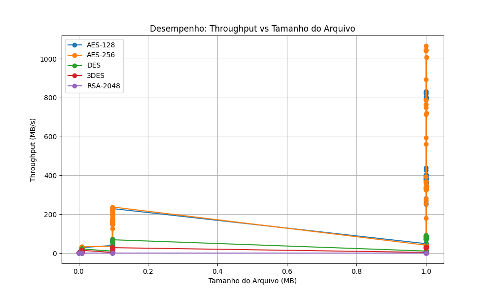

# Relatório de Testes de Criptografia

**Data da Execução:** 12/04/2026 10:29:49

## 1. Tabela de Desempenho

| Arquivo | Algoritmo | Modo | Tamanho (MB) | Tempo Médio (s) | Throughput (MB/s) | Entropia | Padrões Visíveis |
|---------|-----------|------|--------------|-----------------|-------------------|----------|------------------|
| csv_categorico_100KB.csv | AES-128 | ECB | 0.0977 | 0.0058 | 16.8703 | 7.9977 | ✅ Não |
| csv_categorico_100KB.csv | AES-128 | CBC | 0.0977 | 0.0025 | 39.3370 | 7.9979 | ✅ Não |
| csv_categorico_100KB.csv | AES-128 | CFB | 0.0977 | 0.0044 | 22.1886 | 7.9983 | ✅ Não |
| csv_categorico_100KB.csv | AES-128 | OFB | 0.0977 | 0.0031 | 31.0477 | 7.9981 | ✅ Não |
| csv_categorico_100KB.csv | AES-128 | CTR | 0.0977 | 0.0023 | 42.3723 | 7.9983 | ✅ Não |
| csv_categorico_100KB.csv | AES-256 | ECB | 0.0977 | 0.0005 | 205.1077 | 7.9974 | ✅ Não |
| csv_categorico_100KB.csv | AES-256 | CBC | 0.0977 | 0.0006 | 152.5285 | 7.9981 | ✅ Não |
| csv_categorico_100KB.csv | AES-256 | CFB | 0.0977 | 0.0028 | 34.7735 | 7.9980 | ✅ Não |
| csv_categorico_100KB.csv | AES-256 | OFB | 0.0977 | 0.0006 | 158.0674 | 7.9981 | ✅ Não |
| csv_categorico_100KB.csv | AES-256 | CTR | 0.0977 | 0.0004 | 228.1132 | 7.9983 | ✅ Não |
| csv_categorico_100KB.csv | DES | ECB | 0.0977 | 0.0015 | 66.6884 | 7.9456 | ✅ Não |
| csv_categorico_100KB.csv | DES | CBC | 0.0977 | 0.0017 | 58.4350 | 7.9981 | ✅ Não |
| csv_categorico_100KB.csv | DES | CFB | 0.0977 | 0.0094 | 10.3749 | 7.9981 | ✅ Não |
| csv_categorico_100KB.csv | DES | OFB | 0.0977 | 0.0016 | 60.1062 | 7.9982 | ✅ Não |
| csv_categorico_100KB.csv | DES | CTR | 0.0977 | 0.0016 | 61.4461 | 7.9983 | ✅ Não |
| csv_categorico_100KB.csv | 3DES | ECB | 0.0977 | 0.0042 | 23.4705 | 7.9468 | ✅ Não |
| csv_categorico_100KB.csv | 3DES | CBC | 0.0977 | 0.0055 | 17.7590 | 7.9983 | ✅ Não |
| csv_categorico_100KB.csv | 3DES | CFB | 0.0977 | 0.0258 | 3.7910 | 7.9980 | ✅ Não |
| csv_categorico_100KB.csv | 3DES | OFB | 0.0977 | 0.0036 | 26.8354 | 7.9980 | ✅ Não |
| csv_categorico_100KB.csv | 3DES | CTR | 0.0977 | 0.0035 | 27.7281 | 7.9983 | ✅ Não |
| csv_categorico_100KB.csv | RSA-2048 | ECB | 0.0977 | 0.2650 | 0.3686 | 7.9985 | ✅ Não |
| csv_categorico_100KB.csv | RSA-2048 | CBC | 0.0977 | 0.2724 | 0.3585 | 7.9984 | ✅ Não |
| csv_categorico_100KB.csv | RSA-2048 | CTR | 0.0977 | 0.2725 | 0.3584 | 7.9977 | ✅ Não |
| csv_categorico_10KB.csv | AES-128 | ECB | 0.0098 | 0.0016 | 6.0009 | 7.9835 | ✅ Não |
| csv_categorico_10KB.csv | AES-128 | CBC | 0.0098 | 0.0003 | 27.9095 | 7.9817 | ✅ Não |
| csv_categorico_10KB.csv | AES-128 | CFB | 0.0098 | 0.0005 | 17.9429 | 7.9815 | ✅ Não |
| csv_categorico_10KB.csv | AES-128 | OFB | 0.0098 | 0.0004 | 27.1943 | 7.9810 | ✅ Não |
| csv_categorico_10KB.csv | AES-128 | CTR | 0.0098 | 0.0004 | 27.5176 | 7.9845 | ✅ Não |
| csv_categorico_10KB.csv | AES-256 | ECB | 0.0098 | 0.0003 | 31.3870 | 7.9832 | ✅ Não |
| csv_categorico_10KB.csv | AES-256 | CBC | 0.0098 | 0.0004 | 27.4568 | 7.9846 | ✅ Não |
| csv_categorico_10KB.csv | AES-256 | CFB | 0.0098 | 0.0006 | 16.4168 | 7.9816 | ✅ Não |
| csv_categorico_10KB.csv | AES-256 | OFB | 0.0098 | 0.0004 | 26.4480 | 7.9824 | ✅ Não |
| csv_categorico_10KB.csv | AES-256 | CTR | 0.0098 | 0.0003 | 28.1396 | 7.9830 | ✅ Não |
| csv_categorico_10KB.csv | DES | ECB | 0.0098 | 0.0004 | 23.5741 | 7.9386 | ✅ Não |
| csv_categorico_10KB.csv | DES | CBC | 0.0098 | 0.0005 | 19.1429 | 7.9815 | ✅ Não |
| csv_categorico_10KB.csv | DES | CFB | 0.0098 | 0.0013 | 7.5058 | 7.9805 | ✅ Não |
| csv_categorico_10KB.csv | DES | OFB | 0.0098 | 0.0005 | 20.4422 | 7.9819 | ✅ Não |
| csv_categorico_10KB.csv | DES | CTR | 0.0098 | 0.0005 | 19.4557 | 7.9809 | ✅ Não |
| csv_categorico_10KB.csv | 3DES | ECB | 0.0098 | 0.0007 | 13.8378 | 7.9270 | ✅ Não |
| csv_categorico_10KB.csv | 3DES | CBC | 0.0098 | 0.0007 | 13.3983 | 7.9813 | ✅ Não |
| csv_categorico_10KB.csv | 3DES | CFB | 0.0098 | 0.0030 | 3.3048 | 7.9809 | ✅ Não |
| csv_categorico_10KB.csv | 3DES | OFB | 0.0098 | 0.0007 | 13.7105 | 7.9838 | ✅ Não |
| csv_categorico_10KB.csv | 3DES | CTR | 0.0098 | 0.0007 | 13.5329 | 7.9804 | ✅ Não |
| csv_categorico_10KB.csv | RSA-2048 | ECB | 0.0098 | 0.0267 | 0.3659 | 7.9862 | ✅ Não |
| csv_categorico_10KB.csv | RSA-2048 | CBC | 0.0098 | 0.0278 | 0.3514 | 7.9860 | ✅ Não |
| csv_categorico_10KB.csv | RSA-2048 | CTR | 0.0098 | 0.0299 | 0.3264 | 7.9823 | ✅ Não |
| csv_categorico_1KB.csv | AES-128 | ECB | 0.0010 | 0.0019 | 0.5204 | 7.8168 | ✅ Não |
| csv_categorico_1KB.csv | AES-128 | CBC | 0.0010 | 0.0003 | 3.1158 | 7.8338 | ✅ Não |
| csv_categorico_1KB.csv | AES-128 | CFB | 0.0010 | 0.0003 | 3.1520 | 7.8148 | ✅ Não |
| csv_categorico_1KB.csv | AES-128 | OFB | 0.0010 | 0.0003 | 3.4388 | 7.8054 | ✅ Não |
| csv_categorico_1KB.csv | AES-128 | CTR | 0.0010 | 0.0003 | 3.1270 | 7.8214 | ✅ Não |
| csv_categorico_1KB.csv | AES-256 | ECB | 0.0010 | 0.0003 | 3.2485 | 7.8169 | ✅ Não |
| csv_categorico_1KB.csv | AES-256 | CBC | 0.0010 | 0.0003 | 3.2990 | 7.7823 | ✅ Não |
| csv_categorico_1KB.csv | AES-256 | CFB | 0.0010 | 0.0003 | 2.8976 | 7.8377 | ✅ Não |
| csv_categorico_1KB.csv | AES-256 | OFB | 0.0010 | 0.0003 | 2.8202 | 7.8182 | ✅ Não |
| csv_categorico_1KB.csv | AES-256 | CTR | 0.0010 | 0.0003 | 3.3022 | 7.8158 | ✅ Não |
| csv_categorico_1KB.csv | DES | ECB | 0.0010 | 0.0004 | 2.4387 | 7.7755 | ✅ Não |
| csv_categorico_1KB.csv | DES | CBC | 0.0010 | 0.0003 | 2.8389 | 7.7934 | ✅ Não |
| csv_categorico_1KB.csv | DES | CFB | 0.0010 | 0.0004 | 2.2690 | 7.8396 | ✅ Não |
| csv_categorico_1KB.csv | DES | OFB | 0.0010 | 0.0003 | 3.0941 | 7.8191 | ✅ Não |
| csv_categorico_1KB.csv | DES | CTR | 0.0010 | 0.0003 | 2.9234 | 7.7897 | ✅ Não |
| csv_categorico_1KB.csv | 3DES | ECB | 0.0010 | 0.0004 | 2.4079 | 7.7990 | ✅ Não |
| csv_categorico_1KB.csv | 3DES | CBC | 0.0010 | 0.0004 | 2.3750 | 7.7970 | ✅ Não |
| csv_categorico_1KB.csv | 3DES | CFB | 0.0010 | 0.0006 | 1.5364 | 7.8203 | ✅ Não |
| csv_categorico_1KB.csv | 3DES | OFB | 0.0010 | 0.0004 | 2.5619 | 7.7789 | ✅ Não |
| csv_categorico_1KB.csv | 3DES | CTR | 0.0010 | 0.0004 | 2.4349 | 7.8004 | ✅ Não |
| csv_categorico_1KB.csv | RSA-2048 | ECB | 0.0010 | 0.0031 | 0.3123 | 7.8404 | ✅ Não |
| csv_categorico_1KB.csv | RSA-2048 | CBC | 0.0010 | 0.0032 | 0.3061 | 7.8676 | ✅ Não |
| csv_categorico_1KB.csv | RSA-2048 | CTR | 0.0010 | 0.0032 | 0.3060 | 7.8327 | ✅ Não |
| csv_categorico_1MB.csv | AES-128 | ECB | 1.0000 | 0.0036 | 281.5385 | 7.9993 | ✅ Não |
| csv_categorico_1MB.csv | AES-128 | CBC | 1.0000 | 0.0027 | 375.5073 | 7.9998 | ✅ Não |
| csv_categorico_1MB.csv | AES-128 | CFB | 1.0000 | 0.0249 | 40.1634 | 7.9998 | ✅ Não |
| csv_categorico_1MB.csv | AES-128 | OFB | 1.0000 | 0.0026 | 377.7733 | 7.9998 | ✅ Não |
| csv_categorico_1MB.csv | AES-128 | CTR | 1.0000 | 0.0013 | 794.3005 | 7.9998 | ✅ Não |
| csv_categorico_1MB.csv | AES-256 | ECB | 1.0000 | 0.0011 | 892.5380 | 7.9993 | ✅ Não |
| csv_categorico_1MB.csv | AES-256 | CBC | 1.0000 | 0.0028 | 358.7113 | 7.9998 | ✅ Não |
| csv_categorico_1MB.csv | AES-256 | CFB | 1.0000 | 0.0244 | 40.9658 | 7.9998 | ✅ Não |
| csv_categorico_1MB.csv | AES-256 | OFB | 1.0000 | 0.0030 | 330.7654 | 7.9998 | ✅ Não |
| csv_categorico_1MB.csv | AES-256 | CTR | 1.0000 | 0.0013 | 786.2747 | 7.9998 | ✅ Não |
| csv_categorico_1MB.csv | DES | ECB | 1.0000 | 0.0110 | 90.5090 | 7.9434 | ✅ Não |
| csv_categorico_1MB.csv | DES | CBC | 1.0000 | 0.0134 | 74.8933 | 7.9998 | ✅ Não |
| csv_categorico_1MB.csv | DES | CFB | 1.0000 | 0.0930 | 10.7544 | 7.9998 | ✅ Não |
| csv_categorico_1MB.csv | DES | OFB | 1.0000 | 0.0129 | 77.5667 | 7.9998 | ✅ Não |
| csv_categorico_1MB.csv | DES | CTR | 1.0000 | 0.0114 | 87.8223 | 7.9998 | ✅ Não |
| csv_categorico_1MB.csv | 3DES | ECB | 1.0000 | 0.0317 | 31.5099 | 7.9492 | ✅ Não |
| csv_categorico_1MB.csv | 3DES | CBC | 1.0000 | 0.0339 | 29.4577 | 7.9998 | ✅ Não |
| csv_categorico_1MB.csv | 3DES | CFB | 1.0000 | 0.2596 | 3.8518 | 7.9998 | ✅ Não |
| csv_categorico_1MB.csv | 3DES | OFB | 1.0000 | 0.0339 | 29.4773 | 7.9998 | ✅ Não |
| csv_categorico_1MB.csv | 3DES | CTR | 1.0000 | 0.0323 | 30.9484 | 7.9998 | ✅ Não |
| csv_categorico_1MB.csv | RSA-2048 | ECB | 1.0000 | 2.7004 | 0.3703 | 7.9998 | ✅ Não |
| csv_categorico_1MB.csv | RSA-2048 | CBC | 1.0000 | 2.7856 | 0.3590 | 7.9999 | ✅ Não |
| csv_categorico_1MB.csv | RSA-2048 | CTR | 1.0000 | 2.7875 | 0.3587 | 7.9998 | ✅ Não |
| csv_incremental_100KB.csv | AES-128 | ECB | 0.0977 | 0.0022 | 43.6734 | 7.9875 | ✅ Não |
| csv_incremental_100KB.csv | AES-128 | CBC | 0.0977 | 0.0006 | 173.3463 | 7.9982 | ✅ Não |
| csv_incremental_100KB.csv | AES-128 | CFB | 0.0977 | 0.0024 | 41.2209 | 7.9981 | ✅ Não |
| csv_incremental_100KB.csv | AES-128 | OFB | 0.0977 | 0.0006 | 169.4452 | 7.9980 | ✅ Não |
| csv_incremental_100KB.csv | AES-128 | CTR | 0.0977 | 0.0005 | 197.2455 | 7.9980 | ✅ Não |
| csv_incremental_100KB.csv | AES-256 | ECB | 0.0977 | 0.0005 | 194.9455 | 7.9873 | ✅ Não |
| csv_incremental_100KB.csv | AES-256 | CBC | 0.0977 | 0.0006 | 159.8314 | 7.9979 | ✅ Não |
| csv_incremental_100KB.csv | AES-256 | CFB | 0.0977 | 0.0028 | 34.9682 | 7.9985 | ✅ Não |
| csv_incremental_100KB.csv | AES-256 | OFB | 0.0977 | 0.0006 | 160.7914 | 7.9982 | ✅ Não |
| csv_incremental_100KB.csv | AES-256 | CTR | 0.0977 | 0.0004 | 222.5966 | 7.9980 | ✅ Não |
| csv_incremental_100KB.csv | DES | ECB | 0.0977 | 0.0014 | 68.4492 | 7.1756 | ✅ Não |
| csv_incremental_100KB.csv | DES | CBC | 0.0977 | 0.0017 | 58.2720 | 7.9980 | ✅ Não |
| csv_incremental_100KB.csv | DES | CFB | 0.0977 | 0.0095 | 10.3334 | 7.9982 | ✅ Não |
| csv_incremental_100KB.csv | DES | OFB | 0.0977 | 0.0016 | 62.8819 | 7.9983 | ✅ Não |
| csv_incremental_100KB.csv | DES | CTR | 0.0977 | 0.0015 | 66.8767 | 7.9981 | ✅ Não |
| csv_incremental_100KB.csv | 3DES | ECB | 0.0977 | 0.0035 | 27.8533 | 7.2456 | ✅ Não |
| csv_incremental_100KB.csv | 3DES | CBC | 0.0977 | 0.0037 | 26.2733 | 7.9981 | ✅ Não |
| csv_incremental_100KB.csv | 3DES | CFB | 0.0977 | 0.0256 | 3.8128 | 7.9981 | ✅ Não |
| csv_incremental_100KB.csv | 3DES | OFB | 0.0977 | 0.0036 | 27.0203 | 7.9983 | ✅ Não |
| csv_incremental_100KB.csv | 3DES | CTR | 0.0977 | 0.0035 | 28.0521 | 7.9981 | ✅ Não |
| csv_incremental_100KB.csv | RSA-2048 | ECB | 0.0977 | 0.2660 | 0.3672 | 7.9984 | ✅ Não |
| csv_incremental_100KB.csv | RSA-2048 | CBC | 0.0977 | 0.2740 | 0.3565 | 7.9983 | ✅ Não |
| csv_incremental_100KB.csv | RSA-2048 | CTR | 0.0977 | 0.2729 | 0.3578 | 7.9983 | ✅ Não |
| csv_incremental_10KB.csv | AES-128 | ECB | 0.0098 | 0.0019 | 5.0094 | 7.8653 | ✅ Não |
| csv_incremental_10KB.csv | AES-128 | CBC | 0.0098 | 0.0004 | 26.3324 | 7.9841 | ✅ Não |
| csv_incremental_10KB.csv | AES-128 | CFB | 0.0098 | 0.0006 | 17.6271 | 7.9823 | ✅ Não |
| csv_incremental_10KB.csv | AES-128 | OFB | 0.0098 | 0.0004 | 27.2739 | 7.9844 | ✅ Não |
| csv_incremental_10KB.csv | AES-128 | CTR | 0.0098 | 0.0004 | 26.8238 | 7.9815 | ✅ Não |
| csv_incremental_10KB.csv | AES-256 | ECB | 0.0098 | 0.0003 | 32.0150 | 7.8859 | ✅ Não |
| csv_incremental_10KB.csv | AES-256 | CBC | 0.0098 | 0.0004 | 27.0131 | 7.9806 | ✅ Não |
| csv_incremental_10KB.csv | AES-256 | CFB | 0.0098 | 0.0006 | 16.5890 | 7.9804 | ✅ Não |
| csv_incremental_10KB.csv | AES-256 | OFB | 0.0098 | 0.0004 | 27.8072 | 7.9820 | ✅ Não |
| csv_incremental_10KB.csv | AES-256 | CTR | 0.0098 | 0.0003 | 28.1357 | 7.9825 | ✅ Não |
| csv_incremental_10KB.csv | DES | ECB | 0.0098 | 0.0004 | 22.5290 | 7.5656 | ✅ Não |
| csv_incremental_10KB.csv | DES | CBC | 0.0098 | 0.0005 | 21.5036 | 7.9793 | ✅ Não |
| csv_incremental_10KB.csv | DES | CFB | 0.0098 | 0.0013 | 7.6767 | 7.9830 | ✅ Não |
| csv_incremental_10KB.csv | DES | OFB | 0.0098 | 0.0005 | 21.2879 | 7.9834 | ✅ Não |
| csv_incremental_10KB.csv | DES | CTR | 0.0098 | 0.0004 | 21.8267 | 7.9852 | ✅ Não |
| csv_incremental_10KB.csv | 3DES | ECB | 0.0098 | 0.0007 | 14.8891 | 7.5458 | ✅ Não |
| csv_incremental_10KB.csv | 3DES | CBC | 0.0098 | 0.0007 | 13.4626 | 7.9820 | ✅ Não |
| csv_incremental_10KB.csv | 3DES | CFB | 0.0098 | 0.0030 | 3.3101 | 7.9837 | ✅ Não |
| csv_incremental_10KB.csv | 3DES | OFB | 0.0098 | 0.0007 | 13.5976 | 7.9814 | ✅ Não |
| csv_incremental_10KB.csv | 3DES | CTR | 0.0098 | 0.0007 | 13.3677 | 7.9820 | ✅ Não |
| csv_incremental_10KB.csv | RSA-2048 | ECB | 0.0098 | 0.0268 | 0.3649 | 7.9832 | ✅ Não |
| csv_incremental_10KB.csv | RSA-2048 | CBC | 0.0098 | 0.0276 | 0.3532 | 7.9848 | ✅ Não |
| csv_incremental_10KB.csv | RSA-2048 | CTR | 0.0098 | 0.0276 | 0.3538 | 7.9824 | ✅ Não |
| csv_incremental_1KB.csv | AES-128 | ECB | 0.0010 | 0.0016 | 0.5934 | 7.6144 | ✅ Não |
| csv_incremental_1KB.csv | AES-128 | CBC | 0.0010 | 0.0003 | 2.9640 | 7.7818 | ✅ Não |
| csv_incremental_1KB.csv | AES-128 | CFB | 0.0010 | 0.0003 | 3.0363 | 7.8138 | ✅ Não |
| csv_incremental_1KB.csv | AES-128 | OFB | 0.0010 | 0.0003 | 3.2023 | 7.8341 | ✅ Não |
| csv_incremental_1KB.csv | AES-128 | CTR | 0.0010 | 0.0003 | 3.4516 | 7.8157 | ✅ Não |
| csv_incremental_1KB.csv | AES-256 | ECB | 0.0010 | 0.0003 | 2.8894 | 7.5742 | ✅ Não |
| csv_incremental_1KB.csv | AES-256 | CBC | 0.0010 | 0.0003 | 2.9718 | 7.8215 | ✅ Não |
| csv_incremental_1KB.csv | AES-256 | CFB | 0.0010 | 0.0003 | 2.8655 | 7.8009 | ✅ Não |
| csv_incremental_1KB.csv | AES-256 | OFB | 0.0010 | 0.0003 | 3.0723 | 7.8068 | ✅ Não |
| csv_incremental_1KB.csv | AES-256 | CTR | 0.0010 | 0.0003 | 3.0025 | 7.7907 | ✅ Não |
| csv_incremental_1KB.csv | DES | ECB | 0.0010 | 0.0003 | 3.1193 | 7.1371 | ✅ Não |
| csv_incremental_1KB.csv | DES | CBC | 0.0010 | 0.0003 | 2.9580 | 7.8367 | ✅ Não |
| csv_incremental_1KB.csv | DES | CFB | 0.0010 | 0.0004 | 2.4283 | 7.7979 | ✅ Não |
| csv_incremental_1KB.csv | DES | OFB | 0.0010 | 0.0004 | 2.5863 | 7.7696 | ✅ Não |
| csv_incremental_1KB.csv | DES | CTR | 0.0010 | 0.0003 | 3.0012 | 7.7983 | ✅ Não |
| csv_incremental_1KB.csv | 3DES | ECB | 0.0010 | 0.0004 | 2.5006 | 7.1911 | ✅ Não |
| csv_incremental_1KB.csv | 3DES | CBC | 0.0010 | 0.0004 | 2.6152 | 7.7932 | ✅ Não |
| csv_incremental_1KB.csv | 3DES | CFB | 0.0010 | 0.0006 | 1.5502 | 7.8251 | ✅ Não |
| csv_incremental_1KB.csv | 3DES | OFB | 0.0010 | 0.0004 | 2.5503 | 7.8298 | ✅ Não |
| csv_incremental_1KB.csv | 3DES | CTR | 0.0010 | 0.0004 | 2.3964 | 7.8217 | ✅ Não |
| csv_incremental_1KB.csv | RSA-2048 | ECB | 0.0010 | 0.0031 | 0.3177 | 7.8419 | ✅ Não |
| csv_incremental_1KB.csv | RSA-2048 | CBC | 0.0010 | 0.0032 | 0.3067 | 7.8821 | ✅ Não |
| csv_incremental_1KB.csv | RSA-2048 | CTR | 0.0010 | 0.0032 | 0.3055 | 7.7997 | ✅ Não |
| csv_incremental_1MB.csv | AES-128 | ECB | 1.0000 | 0.0030 | 329.5207 | 7.9436 | ✅ Não |
| csv_incremental_1MB.csv | AES-128 | CBC | 1.0000 | 0.0025 | 396.6057 | 7.9998 | ✅ Não |
| csv_incremental_1MB.csv | AES-128 | CFB | 1.0000 | 0.0206 | 48.6588 | 7.9998 | ✅ Não |
| csv_incremental_1MB.csv | AES-128 | OFB | 1.0000 | 0.0026 | 377.6883 | 7.9998 | ✅ Não |
| csv_incremental_1MB.csv | AES-128 | CTR | 1.0000 | 0.0012 | 825.0819 | 7.9998 | ✅ Não |
| csv_incremental_1MB.csv | AES-256 | ECB | 1.0000 | 0.0009 | 1066.2491 | 7.9380 | ✅ Não |
| csv_incremental_1MB.csv | AES-256 | CBC | 1.0000 | 0.0039 | 254.9651 | 7.9998 | ✅ Não |
| csv_incremental_1MB.csv | AES-256 | CFB | 1.0000 | 0.0246 | 40.6652 | 7.9998 | ✅ Não |
| csv_incremental_1MB.csv | AES-256 | OFB | 1.0000 | 0.0037 | 272.8624 | 7.9998 | ✅ Não |
| csv_incremental_1MB.csv | AES-256 | CTR | 1.0000 | 0.0013 | 789.2635 | 7.9998 | ✅ Não |
| csv_incremental_1MB.csv | DES | ECB | 1.0000 | 0.0109 | 91.4635 | 7.5938 | ✅ Não |
| csv_incremental_1MB.csv | DES | CBC | 1.0000 | 0.0148 | 67.5662 | 7.9998 | ✅ Não |
| csv_incremental_1MB.csv | DES | CFB | 1.0000 | 0.0935 | 10.6940 | 7.9998 | ✅ Não |
| csv_incremental_1MB.csv | DES | OFB | 1.0000 | 0.0140 | 71.5191 | 7.9998 | ✅ Não |
| csv_incremental_1MB.csv | DES | CTR | 1.0000 | 0.0115 | 87.3311 | 7.9998 | ✅ Não |
| csv_incremental_1MB.csv | 3DES | ECB | 1.0000 | 0.0318 | 31.4956 | 7.5874 | ✅ Não |
| csv_incremental_1MB.csv | 3DES | CBC | 1.0000 | 0.0345 | 28.9957 | 7.9998 | ✅ Não |
| csv_incremental_1MB.csv | 3DES | CFB | 1.0000 | 0.2590 | 3.8616 | 7.9998 | ✅ Não |
| csv_incremental_1MB.csv | 3DES | OFB | 1.0000 | 0.0337 | 29.6824 | 7.9998 | ✅ Não |
| csv_incremental_1MB.csv | 3DES | CTR | 1.0000 | 0.0323 | 30.9445 | 7.9998 | ✅ Não |
| csv_incremental_1MB.csv | RSA-2048 | ECB | 1.0000 | 2.6998 | 0.3704 | 7.9999 | ✅ Não |
| csv_incremental_1MB.csv | RSA-2048 | CBC | 1.0000 | 2.7886 | 0.3586 | 7.9998 | ✅ Não |
| csv_incremental_1MB.csv | RSA-2048 | CTR | 1.0000 | 2.7898 | 0.3585 | 7.9998 | ✅ Não |
| csv_realista_100KB.csv | AES-128 | ECB | 0.0977 | 0.0026 | 37.3419 | 7.9972 | ✅ Não |
| csv_realista_100KB.csv | AES-128 | CBC | 0.0977 | 0.0006 | 170.4536 | 7.9983 | ✅ Não |
| csv_realista_100KB.csv | AES-128 | CFB | 0.0977 | 0.0024 | 40.7283 | 7.9983 | ✅ Não |
| csv_realista_100KB.csv | AES-128 | OFB | 0.0977 | 0.0006 | 168.7541 | 7.9981 | ✅ Não |
| csv_realista_100KB.csv | AES-128 | CTR | 0.0977 | 0.0004 | 229.1981 | 7.9981 | ✅ Não |
| csv_realista_100KB.csv | AES-256 | ECB | 0.0977 | 0.0004 | 219.0843 | 7.9967 | ✅ Não |
| csv_realista_100KB.csv | AES-256 | CBC | 0.0977 | 0.0007 | 148.4488 | 7.9983 | ✅ Não |
| csv_realista_100KB.csv | AES-256 | CFB | 0.0977 | 0.0028 | 34.9727 | 7.9984 | ✅ Não |
| csv_realista_100KB.csv | AES-256 | OFB | 0.0977 | 0.0006 | 173.0314 | 7.9984 | ✅ Não |
| csv_realista_100KB.csv | AES-256 | CTR | 0.0977 | 0.0005 | 183.3318 | 7.9981 | ✅ Não |
| csv_realista_100KB.csv | DES | ECB | 0.0977 | 0.0015 | 65.6484 | 7.9503 | ✅ Não |
| csv_realista_100KB.csv | DES | CBC | 0.0977 | 0.0016 | 59.5003 | 7.9983 | ✅ Não |
| csv_realista_100KB.csv | DES | CFB | 0.0977 | 0.0095 | 10.2772 | 7.9983 | ✅ Não |
| csv_realista_100KB.csv | DES | OFB | 0.0977 | 0.0015 | 63.0484 | 7.9984 | ✅ Não |
| csv_realista_100KB.csv | DES | CTR | 0.0977 | 0.0015 | 64.9643 | 7.9984 | ✅ Não |
| csv_realista_100KB.csv | 3DES | ECB | 0.0977 | 0.0035 | 27.9285 | 7.9507 | ✅ Não |
| csv_realista_100KB.csv | 3DES | CBC | 0.0977 | 0.0038 | 25.4597 | 7.9981 | ✅ Não |
| csv_realista_100KB.csv | 3DES | CFB | 0.0977 | 0.0257 | 3.8045 | 7.9983 | ✅ Não |
| csv_realista_100KB.csv | 3DES | OFB | 0.0977 | 0.0036 | 26.9955 | 7.9981 | ✅ Não |
| csv_realista_100KB.csv | 3DES | CTR | 0.0977 | 0.0036 | 27.2868 | 7.9981 | ✅ Não |
| csv_realista_100KB.csv | RSA-2048 | ECB | 0.0977 | 0.2648 | 0.3688 | 7.9985 | ✅ Não |
| csv_realista_100KB.csv | RSA-2048 | CBC | 0.0977 | 0.2723 | 0.3586 | 7.9984 | ✅ Não |
| csv_realista_100KB.csv | RSA-2048 | CTR | 0.0977 | 0.2739 | 0.3566 | 7.9982 | ✅ Não |
| csv_realista_10KB.csv | AES-128 | ECB | 0.0098 | 0.0013 | 7.4066 | 7.9813 | ✅ Não |
| csv_realista_10KB.csv | AES-128 | CBC | 0.0098 | 0.0004 | 27.6141 | 7.9801 | ✅ Não |
| csv_realista_10KB.csv | AES-128 | CFB | 0.0098 | 0.0006 | 16.7437 | 7.9815 | ✅ Não |
| csv_realista_10KB.csv | AES-128 | OFB | 0.0098 | 0.0004 | 26.5062 | 7.9825 | ✅ Não |
| csv_realista_10KB.csv | AES-128 | CTR | 0.0098 | 0.0004 | 26.9014 | 7.9816 | ✅ Não |
| csv_realista_10KB.csv | AES-256 | ECB | 0.0098 | 0.0003 | 30.7600 | 7.9806 | ✅ Não |
| csv_realista_10KB.csv | AES-256 | CBC | 0.0098 | 0.0004 | 26.5767 | 7.9852 | ✅ Não |
| csv_realista_10KB.csv | AES-256 | CFB | 0.0098 | 0.0006 | 16.4228 | 7.9813 | ✅ Não |
| csv_realista_10KB.csv | AES-256 | OFB | 0.0098 | 0.0004 | 27.4457 | 7.9838 | ✅ Não |
| csv_realista_10KB.csv | AES-256 | CTR | 0.0098 | 0.0003 | 29.3305 | 7.9813 | ✅ Não |
| csv_realista_10KB.csv | DES | ECB | 0.0098 | 0.0004 | 22.3094 | 7.9382 | ✅ Não |
| csv_realista_10KB.csv | DES | CBC | 0.0098 | 0.0005 | 20.6327 | 7.9820 | ✅ Não |
| csv_realista_10KB.csv | DES | CFB | 0.0098 | 0.0013 | 7.6048 | 7.9812 | ✅ Não |
| csv_realista_10KB.csv | DES | OFB | 0.0098 | 0.0005 | 21.0202 | 7.9788 | ✅ Não |
| csv_realista_10KB.csv | DES | CTR | 0.0098 | 0.0005 | 21.2768 | 7.9824 | ✅ Não |
| csv_realista_10KB.csv | 3DES | ECB | 0.0098 | 0.0007 | 13.1853 | 7.9383 | ✅ Não |
| csv_realista_10KB.csv | 3DES | CBC | 0.0098 | 0.0008 | 12.9694 | 7.9826 | ✅ Não |
| csv_realista_10KB.csv | 3DES | CFB | 0.0098 | 0.0029 | 3.3258 | 7.9811 | ✅ Não |
| csv_realista_10KB.csv | 3DES | OFB | 0.0098 | 0.0007 | 13.2351 | 7.9819 | ✅ Não |
| csv_realista_10KB.csv | 3DES | CTR | 0.0098 | 0.0007 | 13.7302 | 7.9858 | ✅ Não |
| csv_realista_10KB.csv | RSA-2048 | ECB | 0.0098 | 0.0268 | 0.3639 | 7.9857 | ✅ Não |
| csv_realista_10KB.csv | RSA-2048 | CBC | 0.0098 | 0.0277 | 0.3531 | 7.9860 | ✅ Não |
| csv_realista_10KB.csv | RSA-2048 | CTR | 0.0098 | 0.0285 | 0.3430 | 7.9844 | ✅ Não |
| csv_realista_1KB.csv | AES-128 | ECB | 0.0010 | 0.0015 | 0.6542 | 7.7919 | ✅ Não |
| csv_realista_1KB.csv | AES-128 | CBC | 0.0010 | 0.0004 | 2.6776 | 7.8245 | ✅ Não |
| csv_realista_1KB.csv | AES-128 | CFB | 0.0010 | 0.0004 | 2.7301 | 7.7728 | ✅ Não |
| csv_realista_1KB.csv | AES-128 | OFB | 0.0010 | 0.0003 | 3.0155 | 7.8055 | ✅ Não |
| csv_realista_1KB.csv | AES-128 | CTR | 0.0010 | 0.0003 | 3.0036 | 7.8245 | ✅ Não |
| csv_realista_1KB.csv | AES-256 | ECB | 0.0010 | 0.0003 | 3.1983 | 7.8223 | ✅ Não |
| csv_realista_1KB.csv | AES-256 | CBC | 0.0010 | 0.0003 | 2.8496 | 7.8161 | ✅ Não |
| csv_realista_1KB.csv | AES-256 | CFB | 0.0010 | 0.0004 | 2.6152 | 7.7719 | ✅ Não |
| csv_realista_1KB.csv | AES-256 | OFB | 0.0010 | 0.0003 | 2.9284 | 7.8118 | ✅ Não |
| csv_realista_1KB.csv | AES-256 | CTR | 0.0010 | 0.0003 | 2.8575 | 7.8278 | ✅ Não |
| csv_realista_1KB.csv | DES | ECB | 0.0010 | 0.0004 | 2.6496 | 7.7421 | ✅ Não |
| csv_realista_1KB.csv | DES | CBC | 0.0010 | 0.0004 | 2.3163 | 7.7808 | ✅ Não |
| csv_realista_1KB.csv | DES | CFB | 0.0010 | 0.0005 | 2.0192 | 7.8165 | ✅ Não |
| csv_realista_1KB.csv | DES | OFB | 0.0010 | 0.0003 | 3.0820 | 7.8207 | ✅ Não |
| csv_realista_1KB.csv | DES | CTR | 0.0010 | 0.0004 | 2.7786 | 7.8163 | ✅ Não |
| csv_realista_1KB.csv | 3DES | ECB | 0.0010 | 0.0004 | 2.5573 | 7.7887 | ✅ Não |
| csv_realista_1KB.csv | 3DES | CBC | 0.0010 | 0.0004 | 2.2976 | 7.8208 | ✅ Não |
| csv_realista_1KB.csv | 3DES | CFB | 0.0010 | 0.0006 | 1.5214 | 7.8379 | ✅ Não |
| csv_realista_1KB.csv | 3DES | OFB | 0.0010 | 0.0004 | 2.4002 | 7.7798 | ✅ Não |
| csv_realista_1KB.csv | 3DES | CTR | 0.0010 | 0.0004 | 2.5653 | 7.8150 | ✅ Não |
| csv_realista_1KB.csv | RSA-2048 | ECB | 0.0010 | 0.0031 | 0.3154 | 7.8518 | ✅ Não |
| csv_realista_1KB.csv | RSA-2048 | CBC | 0.0010 | 0.0032 | 0.3054 | 7.8883 | ✅ Não |
| csv_realista_1KB.csv | RSA-2048 | CTR | 0.0010 | 0.0032 | 0.3036 | 7.8065 | ✅ Não |
| csv_realista_1MB.csv | AES-128 | ECB | 1.0000 | 0.0023 | 427.4276 | 7.9981 | ✅ Não |
| csv_realista_1MB.csv | AES-128 | CBC | 1.0000 | 0.0025 | 400.5447 | 7.9998 | ✅ Não |
| csv_realista_1MB.csv | AES-128 | CFB | 1.0000 | 0.0206 | 48.5761 | 7.9998 | ✅ Não |
| csv_realista_1MB.csv | AES-128 | OFB | 1.0000 | 0.0026 | 387.5433 | 7.9999 | ✅ Não |
| csv_realista_1MB.csv | AES-128 | CTR | 1.0000 | 0.0012 | 831.2136 | 7.9998 | ✅ Não |
| csv_realista_1MB.csv | AES-256 | ECB | 1.0000 | 0.0010 | 1039.8413 | 7.9982 | ✅ Não |
| csv_realista_1MB.csv | AES-256 | CBC | 1.0000 | 0.0027 | 366.4140 | 7.9998 | ✅ Não |
| csv_realista_1MB.csv | AES-256 | CFB | 1.0000 | 0.0252 | 39.6898 | 7.9998 | ✅ Não |
| csv_realista_1MB.csv | AES-256 | OFB | 1.0000 | 0.0055 | 180.6729 | 7.9998 | ✅ Não |
| csv_realista_1MB.csv | AES-256 | CTR | 1.0000 | 0.0013 | 749.4379 | 7.9998 | ✅ Não |
| csv_realista_1MB.csv | DES | ECB | 1.0000 | 0.0118 | 85.0534 | 7.9557 | ✅ Não |
| csv_realista_1MB.csv | DES | CBC | 1.0000 | 0.0133 | 75.0112 | 7.9998 | ✅ Não |
| csv_realista_1MB.csv | DES | CFB | 1.0000 | 0.0955 | 10.4755 | 7.9999 | ✅ Não |
| csv_realista_1MB.csv | DES | OFB | 1.0000 | 0.0133 | 74.9305 | 7.9998 | ✅ Não |
| csv_realista_1MB.csv | DES | CTR | 1.0000 | 0.0114 | 87.5142 | 7.9998 | ✅ Não |
| csv_realista_1MB.csv | 3DES | ECB | 1.0000 | 0.0318 | 31.4184 | 7.9444 | ✅ Não |
| csv_realista_1MB.csv | 3DES | CBC | 1.0000 | 0.0341 | 29.2988 | 7.9998 | ✅ Não |
| csv_realista_1MB.csv | 3DES | CFB | 1.0000 | 0.2598 | 3.8491 | 7.9998 | ✅ Não |
| csv_realista_1MB.csv | 3DES | OFB | 1.0000 | 0.0351 | 28.4860 | 7.9998 | ✅ Não |
| csv_realista_1MB.csv | 3DES | CTR | 1.0000 | 0.0342 | 29.2751 | 7.9998 | ✅ Não |
| csv_realista_1MB.csv | RSA-2048 | ECB | 1.0000 | 2.7045 | 0.3698 | 7.9999 | ✅ Não |
| csv_realista_1MB.csv | RSA-2048 | CBC | 1.0000 | 2.7904 | 0.3584 | 7.9998 | ✅ Não |
| csv_realista_1MB.csv | RSA-2048 | CTR | 1.0000 | 2.7905 | 0.3584 | 7.9998 | ✅ Não |
| csv_repetitivo_100KB.csv | AES-128 | ECB | 0.0977 | 0.0013 | 73.1703 | 6.8229 | ⚠️ Sim |
| csv_repetitivo_100KB.csv | AES-128 | CBC | 0.0977 | 0.0006 | 161.4442 | 7.9983 | ✅ Não |
| csv_repetitivo_100KB.csv | AES-128 | CFB | 0.0977 | 0.0024 | 40.8864 | 7.9984 | ✅ Não |
| csv_repetitivo_100KB.csv | AES-128 | OFB | 0.0977 | 0.0006 | 165.3146 | 7.9983 | ✅ Não |
| csv_repetitivo_100KB.csv | AES-128 | CTR | 0.0977 | 0.0005 | 198.5458 | 7.9983 | ✅ Não |
| csv_repetitivo_100KB.csv | AES-256 | ECB | 0.0977 | 0.0004 | 234.9432 | 7.0016 | ✅ Não |
| csv_repetitivo_100KB.csv | AES-256 | CBC | 0.0977 | 0.0006 | 167.7176 | 7.9982 | ✅ Não |
| csv_repetitivo_100KB.csv | AES-256 | CFB | 0.0977 | 0.0028 | 35.2226 | 7.9982 | ✅ Não |
| csv_repetitivo_100KB.csv | AES-256 | OFB | 0.0977 | 0.0006 | 155.0693 | 7.9983 | ✅ Não |
| csv_repetitivo_100KB.csv | AES-256 | CTR | 0.0977 | 0.0005 | 212.0412 | 7.9983 | ✅ Não |
| csv_repetitivo_100KB.csv | DES | ECB | 0.0977 | 0.0014 | 68.8380 | 6.2129 | ⚠️ Sim |
| csv_repetitivo_100KB.csv | DES | CBC | 0.0977 | 0.0017 | 59.0857 | 7.9981 | ✅ Não |
| csv_repetitivo_100KB.csv | DES | CFB | 0.0977 | 0.0095 | 10.3330 | 7.9982 | ✅ Não |
| csv_repetitivo_100KB.csv | DES | OFB | 0.0977 | 0.0016 | 62.6443 | 7.9979 | ✅ Não |
| csv_repetitivo_100KB.csv | DES | CTR | 0.0977 | 0.0015 | 66.6797 | 7.9979 | ✅ Não |
| csv_repetitivo_100KB.csv | 3DES | ECB | 0.0977 | 0.0035 | 28.0201 | 6.1049 | ⚠️ Sim |
| csv_repetitivo_100KB.csv | 3DES | CBC | 0.0977 | 0.0037 | 26.2749 | 7.9982 | ✅ Não |
| csv_repetitivo_100KB.csv | 3DES | CFB | 0.0977 | 0.0256 | 3.8113 | 7.9982 | ✅ Não |
| csv_repetitivo_100KB.csv | 3DES | OFB | 0.0977 | 0.0036 | 27.0204 | 7.9982 | ✅ Não |
| csv_repetitivo_100KB.csv | 3DES | CTR | 0.0977 | 0.0035 | 28.0208 | 7.9984 | ✅ Não |
| csv_repetitivo_100KB.csv | RSA-2048 | ECB | 0.0977 | 0.2656 | 0.3677 | 7.9984 | ✅ Não |
| csv_repetitivo_100KB.csv | RSA-2048 | CBC | 0.0977 | 0.2728 | 0.3579 | 7.9985 | ✅ Não |
| csv_repetitivo_100KB.csv | RSA-2048 | CTR | 0.0977 | 0.2723 | 0.3587 | 7.9979 | ✅ Não |
| csv_repetitivo_10KB.csv | AES-128 | ECB | 0.0098 | 0.0016 | 6.1591 | 6.9311 | ⚠️ Sim |
| csv_repetitivo_10KB.csv | AES-128 | CBC | 0.0098 | 0.0003 | 28.3421 | 7.9823 | ✅ Não |
| csv_repetitivo_10KB.csv | AES-128 | CFB | 0.0098 | 0.0006 | 17.6187 | 7.9814 | ✅ Não |
| csv_repetitivo_10KB.csv | AES-128 | OFB | 0.0098 | 0.0004 | 25.3324 | 7.9823 | ✅ Não |
| csv_repetitivo_10KB.csv | AES-128 | CTR | 0.0098 | 0.0003 | 29.5527 | 7.9833 | ✅ Não |
| csv_repetitivo_10KB.csv | AES-256 | ECB | 0.0098 | 0.0003 | 34.2618 | 6.8763 | ⚠️ Sim |
| csv_repetitivo_10KB.csv | AES-256 | CBC | 0.0098 | 0.0004 | 26.7730 | 7.9832 | ✅ Não |
| csv_repetitivo_10KB.csv | AES-256 | CFB | 0.0098 | 0.0006 | 17.0326 | 7.9831 | ✅ Não |
| csv_repetitivo_10KB.csv | AES-256 | OFB | 0.0098 | 0.0003 | 28.6454 | 7.9816 | ✅ Não |
| csv_repetitivo_10KB.csv | AES-256 | CTR | 0.0098 | 0.0004 | 27.5528 | 7.9813 | ✅ Não |
| csv_repetitivo_10KB.csv | DES | ECB | 0.0098 | 0.0005 | 21.3779 | 6.0276 | ⚠️ Sim |
| csv_repetitivo_10KB.csv | DES | CBC | 0.0098 | 0.0005 | 19.0938 | 7.9840 | ✅ Não |
| csv_repetitivo_10KB.csv | DES | CFB | 0.0098 | 0.0013 | 7.6372 | 7.9798 | ✅ Não |
| csv_repetitivo_10KB.csv | DES | OFB | 0.0098 | 0.0005 | 20.9793 | 7.9837 | ✅ Não |
| csv_repetitivo_10KB.csv | DES | CTR | 0.0098 | 0.0005 | 21.0267 | 7.9789 | ✅ Não |
| csv_repetitivo_10KB.csv | 3DES | ECB | 0.0098 | 0.0007 | 14.1917 | 6.1569 | ⚠️ Sim |
| csv_repetitivo_10KB.csv | 3DES | CBC | 0.0098 | 0.0011 | 9.1613 | 7.9785 | ✅ Não |
| csv_repetitivo_10KB.csv | 3DES | CFB | 0.0098 | 0.0030 | 3.2750 | 7.9808 | ✅ Não |
| csv_repetitivo_10KB.csv | 3DES | OFB | 0.0098 | 0.0008 | 12.7221 | 7.9826 | ✅ Não |
| csv_repetitivo_10KB.csv | 3DES | CTR | 0.0098 | 0.0008 | 12.8829 | 7.9828 | ✅ Não |
| csv_repetitivo_10KB.csv | RSA-2048 | ECB | 0.0098 | 0.0269 | 0.3636 | 7.9844 | ✅ Não |
| csv_repetitivo_10KB.csv | RSA-2048 | CBC | 0.0098 | 0.0277 | 0.3525 | 7.9859 | ✅ Não |
| csv_repetitivo_10KB.csv | RSA-2048 | CTR | 0.0098 | 0.0276 | 0.3534 | 7.9815 | ✅ Não |
| csv_repetitivo_1KB.csv | AES-128 | ECB | 0.0010 | 0.0023 | 0.4159 | 6.9621 | ⚠️ Sim |
| csv_repetitivo_1KB.csv | AES-128 | CBC | 0.0010 | 0.0003 | 3.1413 | 7.8193 | ✅ Não |
| csv_repetitivo_1KB.csv | AES-128 | CFB | 0.0010 | 0.0003 | 2.9920 | 7.8124 | ✅ Não |
| csv_repetitivo_1KB.csv | AES-128 | OFB | 0.0010 | 0.0003 | 3.3393 | 7.8043 | ✅ Não |
| csv_repetitivo_1KB.csv | AES-128 | CTR | 0.0010 | 0.0003 | 3.3522 | 7.7848 | ✅ Não |
| csv_repetitivo_1KB.csv | AES-256 | ECB | 0.0010 | 0.0003 | 3.1303 | 6.9922 | ⚠️ Sim |
| csv_repetitivo_1KB.csv | AES-256 | CBC | 0.0010 | 0.0003 | 3.0864 | 7.8154 | ✅ Não |
| csv_repetitivo_1KB.csv | AES-256 | CFB | 0.0010 | 0.0003 | 2.8633 | 7.8384 | ✅ Não |
| csv_repetitivo_1KB.csv | AES-256 | OFB | 0.0010 | 0.0003 | 3.0816 | 7.7797 | ✅ Não |
| csv_repetitivo_1KB.csv | AES-256 | CTR | 0.0010 | 0.0003 | 3.3456 | 7.8133 | ✅ Não |
| csv_repetitivo_1KB.csv | DES | ECB | 0.0010 | 0.0003 | 3.0885 | 6.1295 | ⚠️ Sim |
| csv_repetitivo_1KB.csv | DES | CBC | 0.0010 | 0.0003 | 2.8831 | 7.7816 | ✅ Não |
| csv_repetitivo_1KB.csv | DES | CFB | 0.0010 | 0.0004 | 2.2637 | 7.8233 | ✅ Não |
| csv_repetitivo_1KB.csv | DES | OFB | 0.0010 | 0.0003 | 2.9711 | 7.8139 | ✅ Não |
| csv_repetitivo_1KB.csv | DES | CTR | 0.0010 | 0.0003 | 2.8961 | 7.8250 | ✅ Não |
| csv_repetitivo_1KB.csv | 3DES | ECB | 0.0010 | 0.0004 | 2.6539 | 6.3188 | ⚠️ Sim |
| csv_repetitivo_1KB.csv | 3DES | CBC | 0.0010 | 0.0004 | 2.4351 | 7.8204 | ✅ Não |
| csv_repetitivo_1KB.csv | 3DES | CFB | 0.0010 | 0.0006 | 1.5607 | 7.8206 | ✅ Não |
| csv_repetitivo_1KB.csv | 3DES | OFB | 0.0010 | 0.0004 | 2.4998 | 7.8143 | ✅ Não |
| csv_repetitivo_1KB.csv | 3DES | CTR | 0.0010 | 0.0004 | 2.4332 | 7.7943 | ✅ Não |
| csv_repetitivo_1KB.csv | RSA-2048 | ECB | 0.0010 | 0.0031 | 0.3162 | 7.8427 | ✅ Não |
| csv_repetitivo_1KB.csv | RSA-2048 | CBC | 0.0010 | 0.0032 | 0.3054 | 7.8498 | ✅ Não |
| csv_repetitivo_1KB.csv | RSA-2048 | CTR | 0.0010 | 0.0032 | 0.3033 | 7.7728 | ✅ Não |
| csv_repetitivo_1MB.csv | AES-128 | ECB | 1.0000 | 0.0023 | 439.2401 | 6.8033 | ⚠️ Sim |
| csv_repetitivo_1MB.csv | AES-128 | CBC | 1.0000 | 0.0025 | 399.9451 | 7.9998 | ✅ Não |
| csv_repetitivo_1MB.csv | AES-128 | CFB | 1.0000 | 0.0207 | 48.2538 | 7.9998 | ✅ Não |
| csv_repetitivo_1MB.csv | AES-128 | OFB | 1.0000 | 0.0026 | 387.2642 | 7.9998 | ✅ Não |
| csv_repetitivo_1MB.csv | AES-128 | CTR | 1.0000 | 0.0012 | 833.0130 | 7.9998 | ✅ Não |
| csv_repetitivo_1MB.csv | AES-256 | ECB | 1.0000 | 0.0010 | 1044.8407 | 6.8772 | ⚠️ Sim |
| csv_repetitivo_1MB.csv | AES-256 | CBC | 1.0000 | 0.0027 | 368.8014 | 7.9998 | ✅ Não |
| csv_repetitivo_1MB.csv | AES-256 | CFB | 1.0000 | 0.0245 | 40.7716 | 7.9999 | ✅ Não |
| csv_repetitivo_1MB.csv | AES-256 | OFB | 1.0000 | 0.0029 | 340.9948 | 7.9998 | ✅ Não |
| csv_repetitivo_1MB.csv | AES-256 | CTR | 1.0000 | 0.0018 | 561.8626 | 7.9998 | ✅ Não |
| csv_repetitivo_1MB.csv | DES | ECB | 1.0000 | 0.0113 | 88.3448 | 6.0791 | ⚠️ Sim |
| csv_repetitivo_1MB.csv | DES | CBC | 1.0000 | 0.0136 | 73.5780 | 7.9999 | ✅ Não |
| csv_repetitivo_1MB.csv | DES | CFB | 1.0000 | 0.0952 | 10.5049 | 7.9998 | ✅ Não |
| csv_repetitivo_1MB.csv | DES | OFB | 1.0000 | 0.0130 | 77.1627 | 7.9998 | ✅ Não |
| csv_repetitivo_1MB.csv | DES | CTR | 1.0000 | 0.0114 | 87.5373 | 7.9998 | ✅ Não |
| csv_repetitivo_1MB.csv | 3DES | ECB | 1.0000 | 0.0316 | 31.6124 | 6.1699 | ⚠️ Sim |
| csv_repetitivo_1MB.csv | 3DES | CBC | 1.0000 | 0.0340 | 29.3889 | 7.9998 | ✅ Não |
| csv_repetitivo_1MB.csv | 3DES | CFB | 1.0000 | 0.2592 | 3.8576 | 7.9998 | ✅ Não |
| csv_repetitivo_1MB.csv | 3DES | OFB | 1.0000 | 0.0338 | 29.6158 | 7.9998 | ✅ Não |
| csv_repetitivo_1MB.csv | 3DES | CTR | 1.0000 | 0.0323 | 30.9632 | 7.9998 | ✅ Não |
| csv_repetitivo_1MB.csv | RSA-2048 | ECB | 1.0000 | 2.7010 | 0.3702 | 7.9999 | ✅ Não |
| csv_repetitivo_1MB.csv | RSA-2048 | CBC | 1.0000 | 2.7994 | 0.3572 | 7.9998 | ✅ Não |
| csv_repetitivo_1MB.csv | RSA-2048 | CTR | 1.0000 | 2.7898 | 0.3584 | 7.9998 | ✅ Não |
| dados_aninhados_100KB.json | AES-128 | ECB | 0.0977 | 0.0016 | 59.5611 | 7.9095 | ✅ Não |
| dados_aninhados_100KB.json | AES-128 | CBC | 0.0977 | 0.0006 | 162.7124 | 7.9982 | ✅ Não |
| dados_aninhados_100KB.json | AES-128 | CFB | 0.0977 | 0.0024 | 41.1340 | 7.9982 | ✅ Não |
| dados_aninhados_100KB.json | AES-128 | OFB | 0.0977 | 0.0006 | 162.4994 | 7.9980 | ✅ Não |
| dados_aninhados_100KB.json | AES-128 | CTR | 0.0977 | 0.0005 | 215.8950 | 7.9983 | ✅ Não |
| dados_aninhados_100KB.json | AES-256 | ECB | 0.0977 | 0.0004 | 236.0240 | 7.9165 | ✅ Não |
| dados_aninhados_100KB.json | AES-256 | CBC | 0.0977 | 0.0006 | 168.3363 | 7.9983 | ✅ Não |
| dados_aninhados_100KB.json | AES-256 | CFB | 0.0977 | 0.0028 | 35.1754 | 7.9985 | ✅ Não |
| dados_aninhados_100KB.json | AES-256 | OFB | 0.0977 | 0.0006 | 151.7584 | 7.9982 | ✅ Não |
| dados_aninhados_100KB.json | AES-256 | CTR | 0.0977 | 0.0004 | 220.5449 | 7.9980 | ✅ Não |
| dados_aninhados_100KB.json | DES | ECB | 0.0977 | 0.0014 | 68.1388 | 7.8378 | ✅ Não |
| dados_aninhados_100KB.json | DES | CBC | 0.0977 | 0.0016 | 59.5300 | 7.9983 | ✅ Não |
| dados_aninhados_100KB.json | DES | CFB | 0.0977 | 0.0094 | 10.3425 | 7.9983 | ✅ Não |
| dados_aninhados_100KB.json | DES | OFB | 0.0977 | 0.0015 | 63.2542 | 7.9984 | ✅ Não |
| dados_aninhados_100KB.json | DES | CTR | 0.0977 | 0.0015 | 67.0875 | 7.9979 | ✅ Não |
| dados_aninhados_100KB.json | 3DES | ECB | 0.0977 | 0.0035 | 27.8965 | 7.8192 | ✅ Não |
| dados_aninhados_100KB.json | 3DES | CBC | 0.0977 | 0.0037 | 26.2335 | 7.9980 | ✅ Não |
| dados_aninhados_100KB.json | 3DES | CFB | 0.0977 | 0.0258 | 3.7830 | 7.9983 | ✅ Não |
| dados_aninhados_100KB.json | 3DES | OFB | 0.0977 | 0.0038 | 25.4303 | 7.9982 | ✅ Não |
| dados_aninhados_100KB.json | 3DES | CTR | 0.0977 | 0.0036 | 27.4109 | 7.9982 | ✅ Não |
| dados_aninhados_100KB.json | RSA-2048 | ECB | 0.0977 | 0.2652 | 0.3682 | 7.9985 | ✅ Não |
| dados_aninhados_100KB.json | RSA-2048 | CBC | 0.0977 | 0.2725 | 0.3584 | 7.9985 | ✅ Não |
| dados_aninhados_100KB.json | RSA-2048 | CTR | 0.0977 | 0.2742 | 0.3562 | 7.9980 | ✅ Não |
| dados_aninhados_10KB.json | AES-128 | ECB | 0.0098 | 0.0016 | 6.0251 | 7.9247 | ✅ Não |
| dados_aninhados_10KB.json | AES-128 | CBC | 0.0098 | 0.0004 | 25.4133 | 7.9823 | ✅ Não |
| dados_aninhados_10KB.json | AES-128 | CFB | 0.0098 | 0.0006 | 17.0992 | 7.9823 | ✅ Não |
| dados_aninhados_10KB.json | AES-128 | OFB | 0.0098 | 0.0004 | 26.6225 | 7.9794 | ✅ Não |
| dados_aninhados_10KB.json | AES-128 | CTR | 0.0098 | 0.0004 | 27.3386 | 7.9832 | ✅ Não |
| dados_aninhados_10KB.json | AES-256 | ECB | 0.0098 | 0.0003 | 29.7537 | 7.9115 | ✅ Não |
| dados_aninhados_10KB.json | AES-256 | CBC | 0.0098 | 0.0004 | 26.3807 | 7.9813 | ✅ Não |
| dados_aninhados_10KB.json | AES-256 | CFB | 0.0098 | 0.0006 | 16.5820 | 7.9823 | ✅ Não |
| dados_aninhados_10KB.json | AES-256 | OFB | 0.0098 | 0.0004 | 27.2061 | 7.9819 | ✅ Não |
| dados_aninhados_10KB.json | AES-256 | CTR | 0.0098 | 0.0004 | 26.0518 | 7.9829 | ✅ Não |
| dados_aninhados_10KB.json | DES | ECB | 0.0098 | 0.0004 | 23.7096 | 7.8022 | ✅ Não |
| dados_aninhados_10KB.json | DES | CBC | 0.0098 | 0.0005 | 20.8587 | 7.9847 | ✅ Não |
| dados_aninhados_10KB.json | DES | CFB | 0.0098 | 0.0013 | 7.5794 | 7.9828 | ✅ Não |
| dados_aninhados_10KB.json | DES | OFB | 0.0098 | 0.0005 | 20.7372 | 7.9839 | ✅ Não |
| dados_aninhados_10KB.json | DES | CTR | 0.0098 | 0.0005 | 20.6068 | 7.9800 | ✅ Não |
| dados_aninhados_10KB.json | 3DES | ECB | 0.0098 | 0.0007 | 14.2913 | 7.8269 | ✅ Não |
| dados_aninhados_10KB.json | 3DES | CBC | 0.0098 | 0.0007 | 13.3542 | 7.9828 | ✅ Não |
| dados_aninhados_10KB.json | 3DES | CFB | 0.0098 | 0.0029 | 3.3202 | 7.9825 | ✅ Não |
| dados_aninhados_10KB.json | 3DES | OFB | 0.0098 | 0.0007 | 13.5021 | 7.9814 | ✅ Não |
| dados_aninhados_10KB.json | 3DES | CTR | 0.0098 | 0.0007 | 13.3022 | 7.9832 | ✅ Não |
| dados_aninhados_10KB.json | RSA-2048 | ECB | 0.0098 | 0.0269 | 0.3628 | 7.9864 | ✅ Não |
| dados_aninhados_10KB.json | RSA-2048 | CBC | 0.0098 | 0.0278 | 0.3516 | 7.9862 | ✅ Não |
| dados_aninhados_10KB.json | RSA-2048 | CTR | 0.0098 | 0.0277 | 0.3523 | 7.9797 | ✅ Não |
| dados_aninhados_1KB.json | AES-128 | ECB | 0.0010 | 0.0019 | 0.5057 | 7.8134 | ✅ Não |
| dados_aninhados_1KB.json | AES-128 | CBC | 0.0010 | 0.0003 | 3.3142 | 7.8191 | ✅ Não |
| dados_aninhados_1KB.json | AES-128 | CFB | 0.0010 | 0.0003 | 3.0011 | 7.7996 | ✅ Não |
| dados_aninhados_1KB.json | AES-128 | OFB | 0.0010 | 0.0003 | 2.9445 | 7.7976 | ✅ Não |
| dados_aninhados_1KB.json | AES-128 | CTR | 0.0010 | 0.0003 | 2.9418 | 7.7699 | ✅ Não |
| dados_aninhados_1KB.json | AES-256 | ECB | 0.0010 | 0.0003 | 3.3649 | 7.8079 | ✅ Não |
| dados_aninhados_1KB.json | AES-256 | CBC | 0.0010 | 0.0003 | 3.1325 | 7.7947 | ✅ Não |
| dados_aninhados_1KB.json | AES-256 | CFB | 0.0010 | 0.0003 | 3.0988 | 7.8205 | ✅ Não |
| dados_aninhados_1KB.json | AES-256 | OFB | 0.0010 | 0.0003 | 2.9700 | 7.8394 | ✅ Não |
| dados_aninhados_1KB.json | AES-256 | CTR | 0.0010 | 0.0003 | 3.2846 | 7.8110 | ✅ Não |
| dados_aninhados_1KB.json | DES | ECB | 0.0010 | 0.0003 | 3.1359 | 7.7895 | ✅ Não |
| dados_aninhados_1KB.json | DES | CBC | 0.0010 | 0.0003 | 2.9895 | 7.8027 | ✅ Não |
| dados_aninhados_1KB.json | DES | CFB | 0.0010 | 0.0004 | 2.3384 | 7.8153 | ✅ Não |
| dados_aninhados_1KB.json | DES | OFB | 0.0010 | 0.0003 | 2.9825 | 7.8086 | ✅ Não |
| dados_aninhados_1KB.json | DES | CTR | 0.0010 | 0.0003 | 2.9447 | 7.8093 | ✅ Não |
| dados_aninhados_1KB.json | 3DES | ECB | 0.0010 | 0.0004 | 2.4333 | 7.7877 | ✅ Não |
| dados_aninhados_1KB.json | 3DES | CBC | 0.0010 | 0.0004 | 2.4811 | 7.7616 | ✅ Não |
| dados_aninhados_1KB.json | 3DES | CFB | 0.0010 | 0.0006 | 1.5752 | 7.8127 | ✅ Não |
| dados_aninhados_1KB.json | 3DES | OFB | 0.0010 | 0.0004 | 2.5095 | 7.8524 | ✅ Não |
| dados_aninhados_1KB.json | 3DES | CTR | 0.0010 | 0.0004 | 2.4375 | 7.8102 | ✅ Não |
| dados_aninhados_1KB.json | RSA-2048 | ECB | 0.0010 | 0.0031 | 0.3164 | 7.8479 | ✅ Não |
| dados_aninhados_1KB.json | RSA-2048 | CBC | 0.0010 | 0.0032 | 0.3063 | 7.8795 | ✅ Não |
| dados_aninhados_1KB.json | RSA-2048 | CTR | 0.0010 | 0.0043 | 0.2275 | 7.7825 | ✅ Não |
| dados_aninhados_1MB.json | AES-128 | ECB | 1.0000 | 0.0039 | 257.7000 | 7.9157 | ✅ Não |
| dados_aninhados_1MB.json | AES-128 | CBC | 1.0000 | 0.0025 | 394.2567 | 7.9998 | ✅ Não |
| dados_aninhados_1MB.json | AES-128 | CFB | 1.0000 | 0.0206 | 48.6494 | 7.9998 | ✅ Não |
| dados_aninhados_1MB.json | AES-128 | OFB | 1.0000 | 0.0026 | 384.6958 | 7.9998 | ✅ Não |
| dados_aninhados_1MB.json | AES-128 | CTR | 1.0000 | 0.0012 | 822.7183 | 7.9998 | ✅ Não |
| dados_aninhados_1MB.json | AES-256 | ECB | 1.0000 | 0.0017 | 593.7571 | 7.9106 | ✅ Não |
| dados_aninhados_1MB.json | AES-256 | CBC | 1.0000 | 0.0027 | 369.4084 | 7.9998 | ✅ Não |
| dados_aninhados_1MB.json | AES-256 | CFB | 1.0000 | 0.0244 | 40.9320 | 7.9998 | ✅ Não |
| dados_aninhados_1MB.json | AES-256 | OFB | 1.0000 | 0.0030 | 338.1246 | 7.9998 | ✅ Não |
| dados_aninhados_1MB.json | AES-256 | CTR | 1.0000 | 0.0013 | 767.8915 | 7.9999 | ✅ Não |
| dados_aninhados_1MB.json | DES | ECB | 1.0000 | 0.0110 | 90.8579 | 7.8124 | ✅ Não |
| dados_aninhados_1MB.json | DES | CBC | 1.0000 | 0.0148 | 67.7257 | 7.9998 | ✅ Não |
| dados_aninhados_1MB.json | DES | CFB | 1.0000 | 0.0931 | 10.7442 | 7.9998 | ✅ Não |
| dados_aninhados_1MB.json | DES | OFB | 1.0000 | 0.0130 | 77.0152 | 7.9998 | ✅ Não |
| dados_aninhados_1MB.json | DES | CTR | 1.0000 | 0.0114 | 87.8310 | 7.9998 | ✅ Não |
| dados_aninhados_1MB.json | 3DES | ECB | 1.0000 | 0.0325 | 30.7539 | 7.8263 | ✅ Não |
| dados_aninhados_1MB.json | 3DES | CBC | 1.0000 | 0.0340 | 29.3719 | 7.9998 | ✅ Não |
| dados_aninhados_1MB.json | 3DES | CFB | 1.0000 | 0.2589 | 3.8619 | 7.9998 | ✅ Não |
| dados_aninhados_1MB.json | 3DES | OFB | 1.0000 | 0.0342 | 29.2119 | 7.9998 | ✅ Não |
| dados_aninhados_1MB.json | 3DES | CTR | 1.0000 | 0.0324 | 30.8601 | 7.9998 | ✅ Não |
| dados_aninhados_1MB.json | RSA-2048 | ECB | 1.0000 | 2.7010 | 0.3702 | 7.9999 | ✅ Não |
| dados_aninhados_1MB.json | RSA-2048 | CBC | 1.0000 | 2.7879 | 0.3587 | 7.9998 | ✅ Não |
| dados_aninhados_1MB.json | RSA-2048 | CTR | 1.0000 | 2.7890 | 0.3586 | 7.9998 | ✅ Não |
| imagem_padrao_100KB.bmp | AES-128 | ECB | 0.0969 | 0.0015 | 66.1289 | 5.4893 | ⚠️ Sim |
| imagem_padrao_100KB.bmp | AES-128 | CBC | 0.0969 | 0.0006 | 171.8184 | 7.9980 | ✅ Não |
| imagem_padrao_100KB.bmp | AES-128 | CFB | 0.0969 | 0.0025 | 39.3777 | 7.9982 | ✅ Não |
| imagem_padrao_100KB.bmp | AES-128 | OFB | 0.0969 | 0.0006 | 167.8523 | 7.9981 | ✅ Não |
| imagem_padrao_100KB.bmp | AES-128 | CTR | 0.0969 | 0.0005 | 213.4243 | 7.9983 | ✅ Não |
| imagem_padrao_100KB.bmp | AES-256 | ECB | 0.0969 | 0.0004 | 230.4354 | 5.3922 | ⚠️ Sim |
| imagem_padrao_100KB.bmp | AES-256 | CBC | 0.0969 | 0.0006 | 164.3505 | 7.9983 | ✅ Não |
| imagem_padrao_100KB.bmp | AES-256 | CFB | 0.0969 | 0.0028 | 35.2246 | 7.9981 | ✅ Não |
| imagem_padrao_100KB.bmp | AES-256 | OFB | 0.0969 | 0.0006 | 155.8739 | 7.9982 | ✅ Não |
| imagem_padrao_100KB.bmp | AES-256 | CTR | 0.0969 | 0.0004 | 215.8152 | 7.9982 | ✅ Não |
| imagem_padrao_100KB.bmp | DES | ECB | 0.0969 | 0.0014 | 68.7657 | 4.6060 | ⚠️ Sim |
| imagem_padrao_100KB.bmp | DES | CBC | 0.0969 | 0.0017 | 58.0274 | 7.9982 | ✅ Não |
| imagem_padrao_100KB.bmp | DES | CFB | 0.0969 | 0.0094 | 10.3299 | 7.9979 | ✅ Não |
| imagem_padrao_100KB.bmp | DES | OFB | 0.0969 | 0.0015 | 63.2696 | 7.9984 | ✅ Não |
| imagem_padrao_100KB.bmp | DES | CTR | 0.0969 | 0.0015 | 66.0441 | 7.9982 | ✅ Não |
| imagem_padrao_100KB.bmp | 3DES | ECB | 0.0969 | 0.0034 | 28.1215 | 4.5233 | ⚠️ Sim |
| imagem_padrao_100KB.bmp | 3DES | CBC | 0.0969 | 0.0036 | 26.6153 | 7.9981 | ✅ Não |
| imagem_padrao_100KB.bmp | 3DES | CFB | 0.0969 | 0.0255 | 3.8060 | 7.9982 | ✅ Não |
| imagem_padrao_100KB.bmp | 3DES | OFB | 0.0969 | 0.0036 | 27.0187 | 7.9983 | ✅ Não |
| imagem_padrao_100KB.bmp | 3DES | CTR | 0.0969 | 0.0035 | 27.9683 | 7.9981 | ✅ Não |
| imagem_padrao_100KB.bmp | RSA-2048 | ECB | 0.0969 | 0.2625 | 0.3692 | 7.9987 | ✅ Não |
| imagem_padrao_100KB.bmp | RSA-2048 | CBC | 0.0969 | 0.2713 | 0.3572 | 7.9983 | ✅ Não |
| imagem_padrao_100KB.bmp | RSA-2048 | CTR | 0.0969 | 0.2721 | 0.3561 | 7.9983 | ✅ Não |
| imagem_padrao_10KB.bmp | AES-128 | ECB | 0.0098 | 0.0018 | 5.3296 | 5.8554 | ⚠️ Sim |
| imagem_padrao_10KB.bmp | AES-128 | CBC | 0.0098 | 0.0004 | 27.2871 | 7.9828 | ✅ Não |
| imagem_padrao_10KB.bmp | AES-128 | CFB | 0.0098 | 0.0006 | 17.7359 | 7.9790 | ✅ Não |
| imagem_padrao_10KB.bmp | AES-128 | OFB | 0.0098 | 0.0003 | 28.4345 | 7.9817 | ✅ Não |
| imagem_padrao_10KB.bmp | AES-128 | CTR | 0.0098 | 0.0004 | 27.4752 | 7.9819 | ✅ Não |
| imagem_padrao_10KB.bmp | AES-256 | ECB | 0.0098 | 0.0003 | 32.5571 | 5.9045 | ⚠️ Sim |
| imagem_padrao_10KB.bmp | AES-256 | CBC | 0.0098 | 0.0003 | 29.7708 | 7.9847 | ✅ Não |
| imagem_padrao_10KB.bmp | AES-256 | CFB | 0.0098 | 0.0006 | 17.0600 | 7.9844 | ✅ Não |
| imagem_padrao_10KB.bmp | AES-256 | OFB | 0.0098 | 0.0004 | 27.7314 | 7.9817 | ✅ Não |
| imagem_padrao_10KB.bmp | AES-256 | CTR | 0.0098 | 0.0004 | 27.6772 | 7.9816 | ✅ Não |
| imagem_padrao_10KB.bmp | DES | ECB | 0.0098 | 0.0005 | 20.6365 | 4.7476 | ⚠️ Sim |
| imagem_padrao_10KB.bmp | DES | CBC | 0.0098 | 0.0005 | 20.3672 | 7.9823 | ✅ Não |
| imagem_padrao_10KB.bmp | DES | CFB | 0.0098 | 0.0013 | 7.6911 | 7.9828 | ✅ Não |
| imagem_padrao_10KB.bmp | DES | OFB | 0.0098 | 0.0005 | 21.4149 | 7.9809 | ✅ Não |
| imagem_padrao_10KB.bmp | DES | CTR | 0.0098 | 0.0005 | 19.0974 | 7.9812 | ✅ Não |
| imagem_padrao_10KB.bmp | 3DES | ECB | 0.0098 | 0.0007 | 14.2652 | 4.7023 | ⚠️ Sim |
| imagem_padrao_10KB.bmp | 3DES | CBC | 0.0098 | 0.0007 | 13.3733 | 7.9814 | ✅ Não |
| imagem_padrao_10KB.bmp | 3DES | CFB | 0.0098 | 0.0030 | 3.2966 | 7.9820 | ✅ Não |
| imagem_padrao_10KB.bmp | 3DES | OFB | 0.0098 | 0.0007 | 13.6399 | 7.9827 | ✅ Não |
| imagem_padrao_10KB.bmp | 3DES | CTR | 0.0098 | 0.0007 | 13.7293 | 7.9832 | ✅ Não |
| imagem_padrao_10KB.bmp | RSA-2048 | ECB | 0.0098 | 0.0268 | 0.3651 | 7.9867 | ✅ Não |
| imagem_padrao_10KB.bmp | RSA-2048 | CBC | 0.0098 | 0.0277 | 0.3537 | 7.9856 | ✅ Não |
| imagem_padrao_10KB.bmp | RSA-2048 | CTR | 0.0098 | 0.0277 | 0.3538 | 7.9810 | ✅ Não |
| imagem_padrao_1KB.bmp | AES-128 | ECB | 0.0010 | 0.0016 | 0.6435 | 6.5151 | ⚠️ Sim |
| imagem_padrao_1KB.bmp | AES-128 | CBC | 0.0010 | 0.0003 | 3.3084 | 7.8158 | ✅ Não |
| imagem_padrao_1KB.bmp | AES-128 | CFB | 0.0010 | 0.0004 | 2.8335 | 7.7986 | ✅ Não |
| imagem_padrao_1KB.bmp | AES-128 | OFB | 0.0010 | 0.0003 | 3.1837 | 7.8486 | ✅ Não |
| imagem_padrao_1KB.bmp | AES-128 | CTR | 0.0010 | 0.0003 | 3.1897 | 7.8176 | ✅ Não |
| imagem_padrao_1KB.bmp | AES-256 | ECB | 0.0010 | 0.0003 | 3.3312 | 6.4969 | ⚠️ Sim |
| imagem_padrao_1KB.bmp | AES-256 | CBC | 0.0010 | 0.0003 | 3.2201 | 7.7866 | ✅ Não |
| imagem_padrao_1KB.bmp | AES-256 | CFB | 0.0010 | 0.0004 | 2.8662 | 7.8152 | ✅ Não |
| imagem_padrao_1KB.bmp | AES-256 | OFB | 0.0010 | 0.0003 | 3.3757 | 7.8138 | ✅ Não |
| imagem_padrao_1KB.bmp | AES-256 | CTR | 0.0010 | 0.0003 | 3.1673 | 7.8324 | ✅ Não |
| imagem_padrao_1KB.bmp | DES | ECB | 0.0010 | 0.0003 | 3.3881 | 5.4238 | ⚠️ Sim |
| imagem_padrao_1KB.bmp | DES | CBC | 0.0010 | 0.0003 | 3.1775 | 7.8091 | ✅ Não |
| imagem_padrao_1KB.bmp | DES | CFB | 0.0010 | 0.0004 | 2.4097 | 7.8339 | ✅ Não |
| imagem_padrao_1KB.bmp | DES | OFB | 0.0010 | 0.0003 | 3.3499 | 7.8186 | ✅ Não |
| imagem_padrao_1KB.bmp | DES | CTR | 0.0010 | 0.0003 | 3.1443 | 7.8022 | ✅ Não |
| imagem_padrao_1KB.bmp | 3DES | ECB | 0.0010 | 0.0004 | 2.8485 | 5.3157 | ⚠️ Sim |
| imagem_padrao_1KB.bmp | 3DES | CBC | 0.0010 | 0.0004 | 2.4618 | 7.8331 | ✅ Não |
| imagem_padrao_1KB.bmp | 3DES | CFB | 0.0010 | 0.0006 | 1.5784 | 7.8176 | ✅ Não |
| imagem_padrao_1KB.bmp | 3DES | OFB | 0.0010 | 0.0004 | 2.4238 | 7.8324 | ✅ Não |
| imagem_padrao_1KB.bmp | 3DES | CTR | 0.0010 | 0.0004 | 2.6735 | 7.8077 | ✅ Não |
| imagem_padrao_1KB.bmp | RSA-2048 | ECB | 0.0010 | 0.0031 | 0.3294 | 7.8775 | ✅ Não |
| imagem_padrao_1KB.bmp | RSA-2048 | CBC | 0.0010 | 0.0032 | 0.3187 | 7.8700 | ✅ Não |
| imagem_padrao_1KB.bmp | RSA-2048 | CTR | 0.0010 | 0.0037 | 0.2746 | 7.8426 | ✅ Não |
| imagem_padrao_1MB.bmp | AES-128 | ECB | 1.0010 | 0.0028 | 360.8632 | 5.4751 | ⚠️ Sim |
| imagem_padrao_1MB.bmp | AES-128 | CBC | 1.0010 | 0.0025 | 402.1994 | 7.9998 | ✅ Não |
| imagem_padrao_1MB.bmp | AES-128 | CFB | 1.0010 | 0.0206 | 48.5784 | 7.9998 | ✅ Não |
| imagem_padrao_1MB.bmp | AES-128 | OFB | 1.0010 | 0.0026 | 382.6618 | 7.9998 | ✅ Não |
| imagem_padrao_1MB.bmp | AES-128 | CTR | 1.0010 | 0.0013 | 798.8356 | 7.9998 | ✅ Não |
| imagem_padrao_1MB.bmp | AES-256 | ECB | 1.0010 | 0.0010 | 1009.1040 | 5.4803 | ⚠️ Sim |
| imagem_padrao_1MB.bmp | AES-256 | CBC | 1.0010 | 0.0029 | 345.8237 | 7.9999 | ✅ Não |
| imagem_padrao_1MB.bmp | AES-256 | CFB | 1.0010 | 0.0245 | 40.8167 | 7.9998 | ✅ Não |
| imagem_padrao_1MB.bmp | AES-256 | OFB | 1.0010 | 0.0031 | 326.3925 | 7.9998 | ✅ Não |
| imagem_padrao_1MB.bmp | AES-256 | CTR | 1.0010 | 0.0014 | 720.6179 | 7.9999 | ✅ Não |
| imagem_padrao_1MB.bmp | DES | ECB | 1.0010 | 0.0115 | 87.3259 | 4.6219 | ⚠️ Sim |
| imagem_padrao_1MB.bmp | DES | CBC | 1.0010 | 0.0135 | 74.0236 | 7.9998 | ✅ Não |
| imagem_padrao_1MB.bmp | DES | CFB | 1.0010 | 0.0933 | 10.7242 | 7.9998 | ✅ Não |
| imagem_padrao_1MB.bmp | DES | OFB | 1.0010 | 0.0130 | 77.0991 | 7.9998 | ✅ Não |
| imagem_padrao_1MB.bmp | DES | CTR | 1.0010 | 0.0114 | 87.5035 | 7.9998 | ✅ Não |
| imagem_padrao_1MB.bmp | 3DES | ECB | 1.0010 | 0.0313 | 31.9606 | 4.6241 | ⚠️ Sim |
| imagem_padrao_1MB.bmp | 3DES | CBC | 1.0010 | 0.0341 | 29.3539 | 7.9998 | ✅ Não |
| imagem_padrao_1MB.bmp | 3DES | CFB | 1.0010 | 0.2591 | 3.8643 | 7.9998 | ✅ Não |
| imagem_padrao_1MB.bmp | 3DES | OFB | 1.0010 | 0.0338 | 29.6379 | 7.9998 | ✅ Não |
| imagem_padrao_1MB.bmp | 3DES | CTR | 1.0010 | 0.0323 | 30.9592 | 7.9998 | ✅ Não |
| imagem_padrao_1MB.bmp | RSA-2048 | ECB | 1.0010 | 2.7046 | 0.3701 | 7.9998 | ✅ Não |
| imagem_padrao_1MB.bmp | RSA-2048 | CBC | 1.0010 | 2.7930 | 0.3584 | 7.9998 | ✅ Não |
| imagem_padrao_1MB.bmp | RSA-2048 | CTR | 1.0010 | 2.7932 | 0.3584 | 7.9998 | ✅ Não |
| texto_aleatorio_100KB.txt | AES-128 | ECB | 0.0977 | 0.0017 | 57.9727 | 7.9983 | ✅ Não |
| texto_aleatorio_100KB.txt | AES-128 | CBC | 0.0977 | 0.0006 | 164.6898 | 7.9980 | ✅ Não |
| texto_aleatorio_100KB.txt | AES-128 | CFB | 0.0977 | 0.0024 | 40.7477 | 7.9984 | ✅ Não |
| texto_aleatorio_100KB.txt | AES-128 | OFB | 0.0977 | 0.0006 | 158.9445 | 7.9981 | ✅ Não |
| texto_aleatorio_100KB.txt | AES-128 | CTR | 0.0977 | 0.0005 | 214.3941 | 7.9979 | ✅ Não |
| texto_aleatorio_100KB.txt | AES-256 | ECB | 0.0977 | 0.0004 | 237.5043 | 7.9986 | ✅ Não |
| texto_aleatorio_100KB.txt | AES-256 | CBC | 0.0977 | 0.0006 | 161.9228 | 7.9981 | ✅ Não |
| texto_aleatorio_100KB.txt | AES-256 | CFB | 0.0977 | 0.0035 | 27.8080 | 7.9980 | ✅ Não |
| texto_aleatorio_100KB.txt | AES-256 | OFB | 0.0977 | 0.0007 | 149.7678 | 7.9981 | ✅ Não |
| texto_aleatorio_100KB.txt | AES-256 | CTR | 0.0977 | 0.0004 | 219.2250 | 7.9983 | ✅ Não |
| texto_aleatorio_100KB.txt | DES | ECB | 0.0977 | 0.0014 | 67.7977 | 7.9980 | ✅ Não |
| texto_aleatorio_100KB.txt | DES | CBC | 0.0977 | 0.0017 | 58.7712 | 7.9981 | ✅ Não |
| texto_aleatorio_100KB.txt | DES | CFB | 0.0977 | 0.0094 | 10.3491 | 7.9982 | ✅ Não |
| texto_aleatorio_100KB.txt | DES | OFB | 0.0977 | 0.0015 | 63.2274 | 7.9983 | ✅ Não |
| texto_aleatorio_100KB.txt | DES | CTR | 0.0977 | 0.0015 | 66.6179 | 7.9981 | ✅ Não |
| texto_aleatorio_100KB.txt | 3DES | ECB | 0.0977 | 0.0036 | 27.4689 | 7.9983 | ✅ Não |
| texto_aleatorio_100KB.txt | 3DES | CBC | 0.0977 | 0.0038 | 25.8847 | 7.9981 | ✅ Não |
| texto_aleatorio_100KB.txt | 3DES | CFB | 0.0977 | 0.0257 | 3.8005 | 7.9983 | ✅ Não |
| texto_aleatorio_100KB.txt | 3DES | OFB | 0.0977 | 0.0036 | 26.9575 | 7.9983 | ✅ Não |
| texto_aleatorio_100KB.txt | 3DES | CTR | 0.0977 | 0.0035 | 27.6536 | 7.9983 | ✅ Não |
| texto_aleatorio_100KB.txt | RSA-2048 | ECB | 0.0977 | 0.2649 | 0.3687 | 7.9984 | ✅ Não |
| texto_aleatorio_100KB.txt | RSA-2048 | CBC | 0.0977 | 0.2730 | 0.3577 | 7.9984 | ✅ Não |
| texto_aleatorio_100KB.txt | RSA-2048 | CTR | 0.0977 | 0.2728 | 0.3580 | 7.9981 | ✅ Não |
| texto_aleatorio_10KB.txt | AES-128 | ECB | 0.0098 | 0.0014 | 6.9015 | 7.9818 | ✅ Não |
| texto_aleatorio_10KB.txt | AES-128 | CBC | 0.0098 | 0.0004 | 26.1541 | 7.9811 | ✅ Não |
| texto_aleatorio_10KB.txt | AES-128 | CFB | 0.0098 | 0.0006 | 17.7547 | 7.9792 | ✅ Não |
| texto_aleatorio_10KB.txt | AES-128 | OFB | 0.0098 | 0.0004 | 26.4497 | 7.9844 | ✅ Não |
| texto_aleatorio_10KB.txt | AES-128 | CTR | 0.0098 | 0.0003 | 28.6674 | 7.9838 | ✅ Não |
| texto_aleatorio_10KB.txt | AES-256 | ECB | 0.0098 | 0.0003 | 29.4105 | 7.9774 | ✅ Não |
| texto_aleatorio_10KB.txt | AES-256 | CBC | 0.0098 | 0.0003 | 27.9724 | 7.9828 | ✅ Não |
| texto_aleatorio_10KB.txt | AES-256 | CFB | 0.0098 | 0.0006 | 16.7972 | 7.9830 | ✅ Não |
| texto_aleatorio_10KB.txt | AES-256 | OFB | 0.0098 | 0.0004 | 26.1008 | 7.9831 | ✅ Não |
| texto_aleatorio_10KB.txt | AES-256 | CTR | 0.0098 | 0.0004 | 27.3815 | 7.9822 | ✅ Não |
| texto_aleatorio_10KB.txt | DES | ECB | 0.0098 | 0.0004 | 22.4894 | 7.9836 | ✅ Não |
| texto_aleatorio_10KB.txt | DES | CBC | 0.0098 | 0.0005 | 20.8820 | 7.9843 | ✅ Não |
| texto_aleatorio_10KB.txt | DES | CFB | 0.0098 | 0.0013 | 7.7146 | 7.9828 | ✅ Não |
| texto_aleatorio_10KB.txt | DES | OFB | 0.0098 | 0.0005 | 21.1581 | 7.9825 | ✅ Não |
| texto_aleatorio_10KB.txt | DES | CTR | 0.0098 | 0.0005 | 20.7476 | 7.9833 | ✅ Não |
| texto_aleatorio_10KB.txt | 3DES | ECB | 0.0098 | 0.0007 | 13.9600 | 7.9822 | ✅ Não |
| texto_aleatorio_10KB.txt | 3DES | CBC | 0.0098 | 0.0007 | 13.3290 | 7.9818 | ✅ Não |
| texto_aleatorio_10KB.txt | 3DES | CFB | 0.0098 | 0.0029 | 3.3129 | 7.9835 | ✅ Não |
| texto_aleatorio_10KB.txt | 3DES | OFB | 0.0098 | 0.0007 | 13.5814 | 7.9830 | ✅ Não |
| texto_aleatorio_10KB.txt | 3DES | CTR | 0.0098 | 0.0007 | 13.6406 | 7.9826 | ✅ Não |
| texto_aleatorio_10KB.txt | RSA-2048 | ECB | 0.0098 | 0.0271 | 0.3606 | 7.9848 | ✅ Não |
| texto_aleatorio_10KB.txt | RSA-2048 | CBC | 0.0098 | 0.0285 | 0.3431 | 7.9846 | ✅ Não |
| texto_aleatorio_10KB.txt | RSA-2048 | CTR | 0.0098 | 0.0278 | 0.3516 | 7.9834 | ✅ Não |
| texto_aleatorio_1KB.txt | AES-128 | ECB | 0.0010 | 0.0011 | 0.8832 | 7.8242 | ✅ Não |
| texto_aleatorio_1KB.txt | AES-128 | CBC | 0.0010 | 0.0003 | 3.1559 | 7.8177 | ✅ Não |
| texto_aleatorio_1KB.txt | AES-128 | CFB | 0.0010 | 0.0003 | 2.8047 | 7.8090 | ✅ Não |
| texto_aleatorio_1KB.txt | AES-128 | OFB | 0.0010 | 0.0003 | 3.2630 | 7.8211 | ✅ Não |
| texto_aleatorio_1KB.txt | AES-128 | CTR | 0.0010 | 0.0003 | 3.0760 | 7.8261 | ✅ Não |
| texto_aleatorio_1KB.txt | AES-256 | ECB | 0.0010 | 0.0003 | 3.2842 | 7.8054 | ✅ Não |
| texto_aleatorio_1KB.txt | AES-256 | CBC | 0.0010 | 0.0003 | 3.1002 | 7.8229 | ✅ Não |
| texto_aleatorio_1KB.txt | AES-256 | CFB | 0.0010 | 0.0003 | 3.1838 | 7.8063 | ✅ Não |
| texto_aleatorio_1KB.txt | AES-256 | OFB | 0.0010 | 0.0003 | 3.1375 | 7.8324 | ✅ Não |
| texto_aleatorio_1KB.txt | AES-256 | CTR | 0.0010 | 0.0003 | 3.0113 | 7.8191 | ✅ Não |
| texto_aleatorio_1KB.txt | DES | ECB | 0.0010 | 0.0003 | 2.9268 | 7.8102 | ✅ Não |
| texto_aleatorio_1KB.txt | DES | CBC | 0.0010 | 0.0003 | 3.1042 | 7.8054 | ✅ Não |
| texto_aleatorio_1KB.txt | DES | CFB | 0.0010 | 0.0004 | 2.2730 | 7.7947 | ✅ Não |
| texto_aleatorio_1KB.txt | DES | OFB | 0.0010 | 0.0003 | 3.2573 | 7.7997 | ✅ Não |
| texto_aleatorio_1KB.txt | DES | CTR | 0.0010 | 0.0003 | 2.9470 | 7.8026 | ✅ Não |
| texto_aleatorio_1KB.txt | 3DES | ECB | 0.0010 | 0.0004 | 2.6496 | 7.7975 | ✅ Não |
| texto_aleatorio_1KB.txt | 3DES | CBC | 0.0010 | 0.0004 | 2.4069 | 7.8267 | ✅ Não |
| texto_aleatorio_1KB.txt | 3DES | CFB | 0.0010 | 0.0006 | 1.5521 | 7.8240 | ✅ Não |
| texto_aleatorio_1KB.txt | 3DES | OFB | 0.0010 | 0.0004 | 2.5921 | 7.8157 | ✅ Não |
| texto_aleatorio_1KB.txt | 3DES | CTR | 0.0010 | 0.0004 | 2.4796 | 7.8074 | ✅ Não |
| texto_aleatorio_1KB.txt | RSA-2048 | ECB | 0.0010 | 0.0031 | 0.3179 | 7.8565 | ✅ Não |
| texto_aleatorio_1KB.txt | RSA-2048 | CBC | 0.0010 | 0.0032 | 0.3053 | 7.8762 | ✅ Não |
| texto_aleatorio_1KB.txt | RSA-2048 | CTR | 0.0010 | 0.0032 | 0.3076 | 7.7909 | ✅ Não |
| texto_aleatorio_1MB.txt | AES-128 | ECB | 1.0000 | 0.0029 | 339.7738 | 7.9998 | ✅ Não |
| texto_aleatorio_1MB.txt | AES-128 | CBC | 1.0000 | 0.0025 | 402.5746 | 7.9998 | ✅ Não |
| texto_aleatorio_1MB.txt | AES-128 | CFB | 1.0000 | 0.0208 | 48.1733 | 7.9998 | ✅ Não |
| texto_aleatorio_1MB.txt | AES-128 | OFB | 1.0000 | 0.0026 | 383.1254 | 7.9998 | ✅ Não |
| texto_aleatorio_1MB.txt | AES-128 | CTR | 1.0000 | 0.0012 | 819.1840 | 7.9998 | ✅ Não |
| texto_aleatorio_1MB.txt | AES-256 | ECB | 1.0000 | 0.0010 | 1044.6325 | 7.9998 | ✅ Não |
| texto_aleatorio_1MB.txt | AES-256 | CBC | 1.0000 | 0.0036 | 280.3286 | 7.9998 | ✅ Não |
| texto_aleatorio_1MB.txt | AES-256 | CFB | 1.0000 | 0.0247 | 40.4478 | 7.9998 | ✅ Não |
| texto_aleatorio_1MB.txt | AES-256 | OFB | 1.0000 | 0.0029 | 341.1002 | 7.9998 | ✅ Não |
| texto_aleatorio_1MB.txt | AES-256 | CTR | 1.0000 | 0.0025 | 392.7729 | 7.9998 | ✅ Não |
| texto_aleatorio_1MB.txt | DES | ECB | 1.0000 | 0.0126 | 79.1474 | 7.9998 | ✅ Não |
| texto_aleatorio_1MB.txt | DES | CBC | 1.0000 | 0.0135 | 73.9091 | 7.9998 | ✅ Não |
| texto_aleatorio_1MB.txt | DES | CFB | 1.0000 | 0.0936 | 10.6878 | 7.9998 | ✅ Não |
| texto_aleatorio_1MB.txt | DES | OFB | 1.0000 | 0.0135 | 73.8193 | 7.9998 | ✅ Não |
| texto_aleatorio_1MB.txt | DES | CTR | 1.0000 | 0.0115 | 87.1866 | 7.9998 | ✅ Não |
| texto_aleatorio_1MB.txt | 3DES | ECB | 1.0000 | 0.0319 | 31.3445 | 7.9998 | ✅ Não |
| texto_aleatorio_1MB.txt | 3DES | CBC | 1.0000 | 0.0341 | 29.3293 | 7.9998 | ✅ Não |
| texto_aleatorio_1MB.txt | 3DES | CFB | 1.0000 | 0.2628 | 3.8057 | 7.9998 | ✅ Não |
| texto_aleatorio_1MB.txt | 3DES | OFB | 1.0000 | 0.0338 | 29.5741 | 7.9998 | ✅ Não |
| texto_aleatorio_1MB.txt | 3DES | CTR | 1.0000 | 0.0323 | 30.9511 | 7.9998 | ✅ Não |
| texto_aleatorio_1MB.txt | RSA-2048 | ECB | 1.0000 | 2.7021 | 0.3701 | 7.9998 | ✅ Não |
| texto_aleatorio_1MB.txt | RSA-2048 | CBC | 1.0000 | 2.7918 | 0.3582 | 7.9999 | ✅ Não |
| texto_aleatorio_1MB.txt | RSA-2048 | CTR | 1.0000 | 2.8051 | 0.3565 | 7.9998 | ✅ Não |
| texto_natural_100KB.txt | AES-128 | ECB | 0.0977 | 0.0052 | 18.6204 | 7.8932 | ✅ Não |
| texto_natural_100KB.txt | AES-128 | CBC | 0.0977 | 0.0005 | 181.3192 | 7.9986 | ✅ Não |
| texto_natural_100KB.txt | AES-128 | CFB | 0.0977 | 0.0024 | 40.6341 | 7.9980 | ✅ Não |
| texto_natural_100KB.txt | AES-128 | OFB | 0.0977 | 0.0026 | 37.3368 | 7.9985 | ✅ Não |
| texto_natural_100KB.txt | AES-128 | CTR | 0.0977 | 0.0004 | 229.1981 | 7.9981 | ✅ Não |
| texto_natural_100KB.txt | AES-256 | ECB | 0.0977 | 0.0004 | 232.6480 | 7.8775 | ✅ Não |
| texto_natural_100KB.txt | AES-256 | CBC | 0.0977 | 0.0006 | 167.8413 | 7.9979 | ✅ Não |
| texto_natural_100KB.txt | AES-256 | CFB | 0.0977 | 0.0029 | 34.0751 | 7.9982 | ✅ Não |
| texto_natural_100KB.txt | AES-256 | OFB | 0.0977 | 0.0008 | 126.2755 | 7.9984 | ✅ Não |
| texto_natural_100KB.txt | AES-256 | CTR | 0.0977 | 0.0006 | 158.8890 | 7.9982 | ✅ Não |
| texto_natural_100KB.txt | DES | ECB | 0.0977 | 0.0016 | 59.7093 | 7.7853 | ✅ Não |
| texto_natural_100KB.txt | DES | CBC | 0.0977 | 0.0044 | 22.1027 | 7.9985 | ✅ Não |
| texto_natural_100KB.txt | DES | CFB | 0.0977 | 0.0096 | 10.1706 | 7.9983 | ✅ Não |
| texto_natural_100KB.txt | DES | OFB | 0.0977 | 0.0016 | 61.1846 | 7.9984 | ✅ Não |
| texto_natural_100KB.txt | DES | CTR | 0.0977 | 0.0015 | 66.3943 | 7.9982 | ✅ Não |
| texto_natural_100KB.txt | 3DES | ECB | 0.0977 | 0.0278 | 3.5126 | 7.7661 | ✅ Não |
| texto_natural_100KB.txt | 3DES | CBC | 0.0977 | 0.0037 | 26.1219 | 7.9981 | ✅ Não |
| texto_natural_100KB.txt | 3DES | CFB | 0.0977 | 0.0262 | 3.7334 | 7.9983 | ✅ Não |
| texto_natural_100KB.txt | 3DES | OFB | 0.0977 | 0.0037 | 26.5655 | 7.9979 | ✅ Não |
| texto_natural_100KB.txt | 3DES | CTR | 0.0977 | 0.0036 | 27.2427 | 7.9981 | ✅ Não |
| texto_natural_100KB.txt | RSA-2048 | ECB | 0.0977 | 0.2710 | 0.3603 | 7.9984 | ✅ Não |
| texto_natural_100KB.txt | RSA-2048 | CBC | 0.0977 | 0.2742 | 0.3562 | 7.9984 | ✅ Não |
| texto_natural_100KB.txt | RSA-2048 | CTR | 0.0977 | 0.2757 | 0.3542 | 7.9980 | ✅ Não |
| texto_natural_10KB.txt | AES-128 | ECB | 0.0098 | 0.0015 | 6.6986 | 7.8854 | ✅ Não |
| texto_natural_10KB.txt | AES-128 | CBC | 0.0098 | 0.0004 | 27.1115 | 7.9802 | ✅ Não |
| texto_natural_10KB.txt | AES-128 | CFB | 0.0098 | 0.0006 | 16.7122 | 7.9818 | ✅ Não |
| texto_natural_10KB.txt | AES-128 | OFB | 0.0098 | 0.0012 | 8.3200 | 7.9810 | ✅ Não |
| texto_natural_10KB.txt | AES-128 | CTR | 0.0098 | 0.0003 | 28.0875 | 7.9833 | ✅ Não |
| texto_natural_10KB.txt | AES-256 | ECB | 0.0098 | 0.0003 | 31.6001 | 7.9081 | ✅ Não |
| texto_natural_10KB.txt | AES-256 | CBC | 0.0098 | 0.0004 | 27.0131 | 7.9827 | ✅ Não |
| texto_natural_10KB.txt | AES-256 | CFB | 0.0098 | 0.0006 | 16.5609 | 7.9846 | ✅ Não |
| texto_natural_10KB.txt | AES-256 | OFB | 0.0098 | 0.0004 | 26.5337 | 7.9802 | ✅ Não |
| texto_natural_10KB.txt | AES-256 | CTR | 0.0098 | 0.0004 | 24.2985 | 7.9800 | ✅ Não |
| texto_natural_10KB.txt | DES | ECB | 0.0098 | 0.0004 | 24.1895 | 7.7858 | ✅ Não |
| texto_natural_10KB.txt | DES | CBC | 0.0098 | 0.0015 | 6.6463 | 7.9815 | ✅ Não |
| texto_natural_10KB.txt | DES | CFB | 0.0098 | 0.0013 | 7.7239 | 7.9847 | ✅ Não |
| texto_natural_10KB.txt | DES | OFB | 0.0098 | 0.0005 | 19.5392 | 7.9819 | ✅ Não |
| texto_natural_10KB.txt | DES | CTR | 0.0098 | 0.0005 | 20.9643 | 7.9813 | ✅ Não |
| texto_natural_10KB.txt | 3DES | ECB | 0.0098 | 0.0007 | 13.4194 | 7.7772 | ✅ Não |
| texto_natural_10KB.txt | 3DES | CBC | 0.0098 | 0.0008 | 12.4514 | 7.9833 | ✅ Não |
| texto_natural_10KB.txt | 3DES | CFB | 0.0098 | 0.0030 | 3.2895 | 7.9806 | ✅ Não |
| texto_natural_10KB.txt | 3DES | OFB | 0.0098 | 0.0007 | 13.0408 | 7.9824 | ✅ Não |
| texto_natural_10KB.txt | 3DES | CTR | 0.0098 | 0.0008 | 12.1119 | 7.9848 | ✅ Não |
| texto_natural_10KB.txt | RSA-2048 | ECB | 0.0098 | 0.0269 | 0.3635 | 7.9847 | ✅ Não |
| texto_natural_10KB.txt | RSA-2048 | CBC | 0.0098 | 0.0277 | 0.3531 | 7.9839 | ✅ Não |
| texto_natural_10KB.txt | RSA-2048 | CTR | 0.0098 | 0.0278 | 0.3511 | 7.9827 | ✅ Não |
| texto_natural_1KB.txt | AES-128 | ECB | 0.0010 | 0.0024 | 0.4112 | 7.8267 | ✅ Não |
| texto_natural_1KB.txt | AES-128 | CBC | 0.0010 | 0.0003 | 3.0792 | 7.8023 | ✅ Não |
| texto_natural_1KB.txt | AES-128 | CFB | 0.0010 | 0.0003 | 3.1821 | 7.8440 | ✅ Não |
| texto_natural_1KB.txt | AES-128 | OFB | 0.0010 | 0.0003 | 2.9132 | 7.7903 | ✅ Não |
| texto_natural_1KB.txt | AES-128 | CTR | 0.0010 | 0.0003 | 2.9011 | 7.7841 | ✅ Não |
| texto_natural_1KB.txt | AES-256 | ECB | 0.0010 | 0.0003 | 3.5210 | 7.8013 | ✅ Não |
| texto_natural_1KB.txt | AES-256 | CBC | 0.0010 | 0.0003 | 2.8655 | 7.8000 | ✅ Não |
| texto_natural_1KB.txt | AES-256 | CFB | 0.0010 | 0.0003 | 2.9499 | 7.7973 | ✅ Não |
| texto_natural_1KB.txt | AES-256 | OFB | 0.0010 | 0.0003 | 2.9705 | 7.7965 | ✅ Não |
| texto_natural_1KB.txt | AES-256 | CTR | 0.0010 | 0.0003 | 2.9178 | 7.8042 | ✅ Não |
| texto_natural_1KB.txt | DES | ECB | 0.0010 | 0.0003 | 3.2773 | 7.7488 | ✅ Não |
| texto_natural_1KB.txt | DES | CBC | 0.0010 | 0.0003 | 2.8354 | 7.8234 | ✅ Não |
| texto_natural_1KB.txt | DES | CFB | 0.0010 | 0.0004 | 2.3858 | 7.7988 | ✅ Não |
| texto_natural_1KB.txt | DES | OFB | 0.0010 | 0.0003 | 2.9589 | 7.7708 | ✅ Não |
| texto_natural_1KB.txt | DES | CTR | 0.0010 | 0.0003 | 3.2035 | 7.8327 | ✅ Não |
| texto_natural_1KB.txt | 3DES | ECB | 0.0010 | 0.0004 | 2.4142 | 7.7422 | ✅ Não |
| texto_natural_1KB.txt | 3DES | CBC | 0.0010 | 0.0004 | 2.4011 | 7.8486 | ✅ Não |
| texto_natural_1KB.txt | 3DES | CFB | 0.0010 | 0.0006 | 1.6073 | 7.8041 | ✅ Não |
| texto_natural_1KB.txt | 3DES | OFB | 0.0010 | 0.0004 | 2.5522 | 7.8134 | ✅ Não |
| texto_natural_1KB.txt | 3DES | CTR | 0.0010 | 0.0004 | 2.4323 | 7.8131 | ✅ Não |
| texto_natural_1KB.txt | RSA-2048 | ECB | 0.0010 | 0.0031 | 0.3154 | 7.8730 | ✅ Não |
| texto_natural_1KB.txt | RSA-2048 | CBC | 0.0010 | 0.0032 | 0.3066 | 7.8720 | ✅ Não |
| texto_natural_1KB.txt | RSA-2048 | CTR | 0.0010 | 0.0032 | 0.3024 | 7.7989 | ✅ Não |
| texto_natural_1MB.txt | AES-128 | ECB | 1.0000 | 0.0030 | 330.8098 | 7.8959 | ✅ Não |
| texto_natural_1MB.txt | AES-128 | CBC | 1.0000 | 0.0025 | 394.3720 | 7.9998 | ✅ Não |
| texto_natural_1MB.txt | AES-128 | CFB | 1.0000 | 0.0207 | 48.4223 | 7.9998 | ✅ Não |
| texto_natural_1MB.txt | AES-128 | OFB | 1.0000 | 0.0026 | 380.3322 | 7.9998 | ✅ Não |
| texto_natural_1MB.txt | AES-128 | CTR | 1.0000 | 0.0012 | 803.9994 | 7.9998 | ✅ Não |
| texto_natural_1MB.txt | AES-256 | ECB | 1.0000 | 0.0031 | 325.3668 | 7.9126 | ✅ Não |
| texto_natural_1MB.txt | AES-256 | CBC | 1.0000 | 0.0027 | 368.6782 | 7.9998 | ✅ Não |
| texto_natural_1MB.txt | AES-256 | CFB | 1.0000 | 0.0245 | 40.7871 | 7.9998 | ✅ Não |
| texto_natural_1MB.txt | AES-256 | OFB | 1.0000 | 0.0030 | 337.8172 | 7.9998 | ✅ Não |
| texto_natural_1MB.txt | AES-256 | CTR | 1.0000 | 0.0014 | 713.0381 | 7.9999 | ✅ Não |
| texto_natural_1MB.txt | DES | ECB | 1.0000 | 0.0123 | 81.2020 | 7.7850 | ✅ Não |
| texto_natural_1MB.txt | DES | CBC | 1.0000 | 0.0134 | 74.7545 | 7.9998 | ✅ Não |
| texto_natural_1MB.txt | DES | CFB | 1.0000 | 0.0932 | 10.7321 | 7.9998 | ✅ Não |
| texto_natural_1MB.txt | DES | OFB | 1.0000 | 0.0135 | 74.2881 | 7.9998 | ✅ Não |
| texto_natural_1MB.txt | DES | CTR | 1.0000 | 0.0122 | 81.8863 | 7.9998 | ✅ Não |
| texto_natural_1MB.txt | 3DES | ECB | 1.0000 | 0.0329 | 30.3576 | 7.7566 | ✅ Não |
| texto_natural_1MB.txt | 3DES | CBC | 1.0000 | 0.0341 | 29.3586 | 7.9998 | ✅ Não |
| texto_natural_1MB.txt | 3DES | CFB | 1.0000 | 0.2591 | 3.8600 | 7.9998 | ✅ Não |
| texto_natural_1MB.txt | 3DES | OFB | 1.0000 | 0.0337 | 29.6686 | 7.9998 | ✅ Não |
| texto_natural_1MB.txt | 3DES | CTR | 1.0000 | 0.0323 | 30.9500 | 7.9998 | ✅ Não |
| texto_natural_1MB.txt | RSA-2048 | ECB | 1.0000 | 2.7050 | 0.3697 | 7.9998 | ✅ Não |
| texto_natural_1MB.txt | RSA-2048 | CBC | 1.0000 | 2.7907 | 0.3583 | 7.9998 | ✅ Não |
| texto_natural_1MB.txt | RSA-2048 | CTR | 1.0000 | 2.7985 | 0.3573 | 7.9998 | ✅ Não |
| texto_repetitivo_100KB.txt | AES-128 | ECB | 0.0977 | 0.0027 | 36.0237 | 5.9889 | ⚠️ Sim |
| texto_repetitivo_100KB.txt | AES-128 | CBC | 0.0977 | 0.0007 | 147.8433 | 7.9984 | ✅ Não |
| texto_repetitivo_100KB.txt | AES-128 | CFB | 0.0977 | 0.0024 | 41.4881 | 7.9983 | ✅ Não |
| texto_repetitivo_100KB.txt | AES-128 | OFB | 0.0977 | 0.0027 | 36.7315 | 7.9982 | ✅ Não |
| texto_repetitivo_100KB.txt | AES-128 | CTR | 0.0977 | 0.0004 | 218.1044 | 7.9983 | ✅ Não |
| texto_repetitivo_100KB.txt | AES-256 | ECB | 0.0977 | 0.0004 | 224.9067 | 6.0141 | ⚠️ Sim |
| texto_repetitivo_100KB.txt | AES-256 | CBC | 0.0977 | 0.0006 | 162.4430 | 7.9983 | ✅ Não |
| texto_repetitivo_100KB.txt | AES-256 | CFB | 0.0977 | 0.0027 | 35.9207 | 7.9982 | ✅ Não |
| texto_repetitivo_100KB.txt | AES-256 | OFB | 0.0977 | 0.0007 | 149.0810 | 7.9983 | ✅ Não |
| texto_repetitivo_100KB.txt | AES-256 | CTR | 0.0977 | 0.0005 | 199.9902 | 7.9977 | ✅ Não |
| texto_repetitivo_100KB.txt | DES | ECB | 0.0977 | 0.0015 | 67.3363 | 5.1728 | ⚠️ Sim |
| texto_repetitivo_100KB.txt | DES | CBC | 0.0977 | 0.0025 | 39.4331 | 7.9980 | ✅ Não |
| texto_repetitivo_100KB.txt | DES | CFB | 0.0977 | 0.0094 | 10.3549 | 7.9982 | ✅ Não |
| texto_repetitivo_100KB.txt | DES | OFB | 0.0977 | 0.0015 | 63.2401 | 7.9983 | ✅ Não |
| texto_repetitivo_100KB.txt | DES | CTR | 0.0977 | 0.0015 | 66.6634 | 7.9984 | ✅ Não |
| texto_repetitivo_100KB.txt | 3DES | ECB | 0.0977 | 0.0035 | 27.9101 | 5.2727 | ⚠️ Sim |
| texto_repetitivo_100KB.txt | 3DES | CBC | 0.0977 | 0.0037 | 26.1430 | 7.9982 | ✅ Não |
| texto_repetitivo_100KB.txt | 3DES | CFB | 0.0977 | 0.0257 | 3.8054 | 7.9981 | ✅ Não |
| texto_repetitivo_100KB.txt | 3DES | OFB | 0.0977 | 0.0036 | 26.7772 | 7.9983 | ✅ Não |
| texto_repetitivo_100KB.txt | 3DES | CTR | 0.0977 | 0.0036 | 27.4535 | 7.9983 | ✅ Não |
| texto_repetitivo_100KB.txt | RSA-2048 | ECB | 0.0977 | 0.2644 | 0.3694 | 7.9982 | ✅ Não |
| texto_repetitivo_100KB.txt | RSA-2048 | CBC | 0.0977 | 0.2727 | 0.3580 | 7.9986 | ✅ Não |
| texto_repetitivo_100KB.txt | RSA-2048 | CTR | 0.0977 | 0.2737 | 0.3568 | 7.9982 | ✅ Não |
| texto_repetitivo_10KB.txt | AES-128 | ECB | 0.0098 | 0.0016 | 6.0620 | 6.0986 | ⚠️ Sim |
| texto_repetitivo_10KB.txt | AES-128 | CBC | 0.0098 | 0.0004 | 25.3450 | 7.9827 | ✅ Não |
| texto_repetitivo_10KB.txt | AES-128 | CFB | 0.0098 | 0.0005 | 18.1416 | 7.9810 | ✅ Não |
| texto_repetitivo_10KB.txt | AES-128 | OFB | 0.0098 | 0.0004 | 25.5760 | 7.9799 | ✅ Não |
| texto_repetitivo_10KB.txt | AES-128 | CTR | 0.0098 | 0.0003 | 28.6034 | 7.9841 | ✅ Não |
| texto_repetitivo_10KB.txt | AES-256 | ECB | 0.0098 | 0.0003 | 31.1365 | 6.1227 | ⚠️ Sim |
| texto_repetitivo_10KB.txt | AES-256 | CBC | 0.0098 | 0.0003 | 28.5475 | 7.9823 | ✅ Não |
| texto_repetitivo_10KB.txt | AES-256 | CFB | 0.0098 | 0.0006 | 17.0987 | 7.9786 | ✅ Não |
| texto_repetitivo_10KB.txt | AES-256 | OFB | 0.0098 | 0.0004 | 26.6649 | 7.9810 | ✅ Não |
| texto_repetitivo_10KB.txt | AES-256 | CTR | 0.0098 | 0.0004 | 25.9701 | 7.9822 | ✅ Não |
| texto_repetitivo_10KB.txt | DES | ECB | 0.0098 | 0.0004 | 24.1837 | 5.0786 | ⚠️ Sim |
| texto_repetitivo_10KB.txt | DES | CBC | 0.0098 | 0.0005 | 19.9057 | 7.9835 | ✅ Não |
| texto_repetitivo_10KB.txt | DES | CFB | 0.0098 | 0.0013 | 7.6528 | 7.9813 | ✅ Não |
| texto_repetitivo_10KB.txt | DES | OFB | 0.0098 | 0.0005 | 20.4147 | 7.9795 | ✅ Não |
| texto_repetitivo_10KB.txt | DES | CTR | 0.0098 | 0.0005 | 21.6834 | 7.9822 | ✅ Não |
| texto_repetitivo_10KB.txt | 3DES | ECB | 0.0098 | 0.0007 | 14.3896 | 5.1785 | ⚠️ Sim |
| texto_repetitivo_10KB.txt | 3DES | CBC | 0.0098 | 0.0007 | 13.0946 | 7.9818 | ✅ Não |
| texto_repetitivo_10KB.txt | 3DES | CFB | 0.0098 | 0.0029 | 3.3299 | 7.9838 | ✅ Não |
| texto_repetitivo_10KB.txt | 3DES | OFB | 0.0098 | 0.0007 | 13.3385 | 7.9809 | ✅ Não |
| texto_repetitivo_10KB.txt | 3DES | CTR | 0.0098 | 0.0008 | 13.0139 | 7.9841 | ✅ Não |
| texto_repetitivo_10KB.txt | RSA-2048 | ECB | 0.0098 | 0.0269 | 0.3636 | 7.9835 | ✅ Não |
| texto_repetitivo_10KB.txt | RSA-2048 | CBC | 0.0098 | 0.0277 | 0.3529 | 7.9871 | ✅ Não |
| texto_repetitivo_10KB.txt | RSA-2048 | CTR | 0.0098 | 0.0277 | 0.3522 | 7.9834 | ✅ Não |
| texto_repetitivo_1KB.txt | AES-128 | ECB | 0.0010 | 0.0025 | 0.3974 | 6.0688 | ⚠️ Sim |
| texto_repetitivo_1KB.txt | AES-128 | CBC | 0.0010 | 0.0003 | 3.0303 | 7.7929 | ✅ Não |
| texto_repetitivo_1KB.txt | AES-128 | CFB | 0.0010 | 0.0003 | 3.1583 | 7.8053 | ✅ Não |
| texto_repetitivo_1KB.txt | AES-128 | OFB | 0.0010 | 0.0003 | 2.8933 | 7.8115 | ✅ Não |
| texto_repetitivo_1KB.txt | AES-128 | CTR | 0.0010 | 0.0003 | 3.2088 | 7.7937 | ✅ Não |
| texto_repetitivo_1KB.txt | AES-256 | ECB | 0.0010 | 0.0003 | 3.3003 | 6.2122 | ⚠️ Sim |
| texto_repetitivo_1KB.txt | AES-256 | CBC | 0.0010 | 0.0003 | 3.1051 | 7.7897 | ✅ Não |
| texto_repetitivo_1KB.txt | AES-256 | CFB | 0.0010 | 0.0003 | 2.9289 | 7.7878 | ✅ Não |
| texto_repetitivo_1KB.txt | AES-256 | OFB | 0.0010 | 0.0003 | 3.0944 | 7.7987 | ✅ Não |
| texto_repetitivo_1KB.txt | AES-256 | CTR | 0.0010 | 0.0003 | 2.9324 | 7.8136 | ✅ Não |
| texto_repetitivo_1KB.txt | DES | ECB | 0.0010 | 0.0003 | 2.9551 | 5.2703 | ⚠️ Sim |
| texto_repetitivo_1KB.txt | DES | CBC | 0.0010 | 0.0003 | 2.9172 | 7.8025 | ✅ Não |
| texto_repetitivo_1KB.txt | DES | CFB | 0.0010 | 0.0004 | 2.3077 | 7.8075 | ✅ Não |
| texto_repetitivo_1KB.txt | DES | OFB | 0.0010 | 0.0003 | 3.0742 | 7.8270 | ✅ Não |
| texto_repetitivo_1KB.txt | DES | CTR | 0.0010 | 0.0003 | 2.8637 | 7.7944 | ✅ Não |
| texto_repetitivo_1KB.txt | 3DES | ECB | 0.0010 | 0.0004 | 2.3661 | 5.0104 | ⚠️ Sim |
| texto_repetitivo_1KB.txt | 3DES | CBC | 0.0010 | 0.0004 | 2.5054 | 7.8109 | ✅ Não |
| texto_repetitivo_1KB.txt | 3DES | CFB | 0.0010 | 0.0006 | 1.5474 | 7.7939 | ✅ Não |
| texto_repetitivo_1KB.txt | 3DES | OFB | 0.0010 | 0.0004 | 2.4706 | 7.7781 | ✅ Não |
| texto_repetitivo_1KB.txt | 3DES | CTR | 0.0010 | 0.0004 | 2.5284 | 7.8075 | ✅ Não |
| texto_repetitivo_1KB.txt | RSA-2048 | ECB | 0.0010 | 0.0031 | 0.3171 | 7.8448 | ✅ Não |
| texto_repetitivo_1KB.txt | RSA-2048 | CBC | 0.0010 | 0.0032 | 0.3074 | 7.8857 | ✅ Não |
| texto_repetitivo_1KB.txt | RSA-2048 | CTR | 0.0010 | 0.0032 | 0.3050 | 7.8118 | ✅ Não |
| texto_repetitivo_1MB.txt | AES-128 | ECB | 1.0000 | 0.0038 | 266.5369 | 6.0126 | ⚠️ Sim |
| texto_repetitivo_1MB.txt | AES-128 | CBC | 1.0000 | 0.0025 | 400.0023 | 7.9998 | ✅ Não |
| texto_repetitivo_1MB.txt | AES-128 | CFB | 1.0000 | 0.0273 | 36.5969 | 7.9998 | ✅ Não |
| texto_repetitivo_1MB.txt | AES-128 | OFB | 1.0000 | 0.0040 | 250.6531 | 7.9998 | ✅ Não |
| texto_repetitivo_1MB.txt | AES-128 | CTR | 1.0000 | 0.0013 | 791.1094 | 7.9998 | ✅ Não |
| texto_repetitivo_1MB.txt | AES-256 | ECB | 1.0000 | 0.0010 | 1043.0997 | 5.9377 | ⚠️ Sim |
| texto_repetitivo_1MB.txt | AES-256 | CBC | 1.0000 | 0.0027 | 368.1959 | 7.9999 | ✅ Não |
| texto_repetitivo_1MB.txt | AES-256 | CFB | 1.0000 | 0.0245 | 40.7346 | 7.9998 | ✅ Não |
| texto_repetitivo_1MB.txt | AES-256 | OFB | 1.0000 | 0.0030 | 337.2901 | 7.9998 | ✅ Não |
| texto_repetitivo_1MB.txt | AES-256 | CTR | 1.0000 | 0.0013 | 763.7394 | 7.9998 | ✅ Não |
| texto_repetitivo_1MB.txt | DES | ECB | 1.0000 | 0.0109 | 91.4076 | 5.1220 | ⚠️ Sim |
| texto_repetitivo_1MB.txt | DES | CBC | 1.0000 | 0.0134 | 74.8990 | 7.9998 | ✅ Não |
| texto_repetitivo_1MB.txt | DES | CFB | 1.0000 | 0.0937 | 10.6760 | 7.9998 | ✅ Não |
| texto_repetitivo_1MB.txt | DES | OFB | 1.0000 | 0.0130 | 77.1158 | 7.9998 | ✅ Não |
| texto_repetitivo_1MB.txt | DES | CTR | 1.0000 | 0.0114 | 87.5051 | 7.9998 | ✅ Não |
| texto_repetitivo_1MB.txt | 3DES | ECB | 1.0000 | 0.0315 | 31.7110 | 5.1720 | ⚠️ Sim |
| texto_repetitivo_1MB.txt | 3DES | CBC | 1.0000 | 0.0341 | 29.3104 | 7.9998 | ✅ Não |
| texto_repetitivo_1MB.txt | 3DES | CFB | 1.0000 | 0.2589 | 3.8627 | 7.9998 | ✅ Não |
| texto_repetitivo_1MB.txt | 3DES | OFB | 1.0000 | 0.0340 | 29.3887 | 7.9998 | ✅ Não |
| texto_repetitivo_1MB.txt | 3DES | CTR | 1.0000 | 0.0329 | 30.4295 | 7.9998 | ✅ Não |
| texto_repetitivo_1MB.txt | RSA-2048 | ECB | 1.0000 | 2.7008 | 0.3703 | 7.9999 | ✅ Não |
| texto_repetitivo_1MB.txt | RSA-2048 | CBC | 1.0000 | 2.7907 | 0.3583 | 7.9999 | ✅ Não |
| texto_repetitivo_1MB.txt | RSA-2048 | CTR | 1.0000 | 2.7885 | 0.3586 | 7.9998 | ✅ Não |

## 2. Gráficos de Análise

