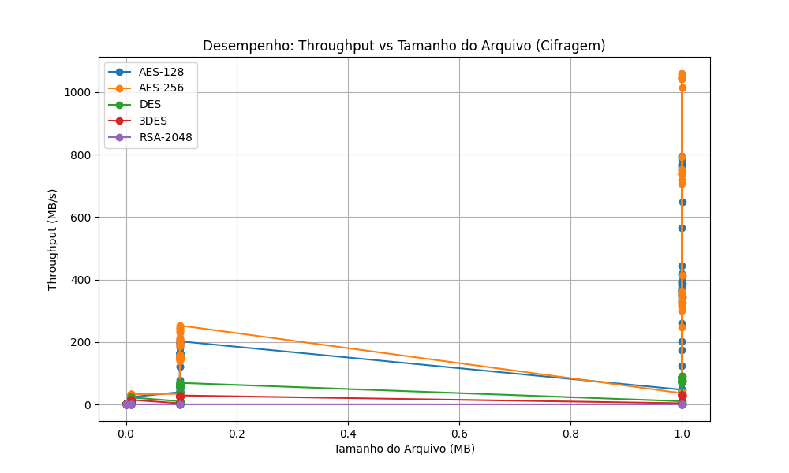

# Relatório de Testes de Criptografia

**Data da Execução:** 12/04/2026 12:08:41

## 1. Tabela de Desempenho

| Arquivo | Alg | Modo | Tam (MB) | T. Cifrar (s) | T. Decifrar (s) | Throughput Cif. (MB/s) | Throughput Dec. (MB/s) | Entropia | Padrões |
|---------|-----|------|----------|---------------|-----------------|------------------------|------------------------|----------|---------|
| csv_categorico_100KB.csv | AES-128 | ECB | 0.0977 | 0.0019 | 0.0050 | 50.6116 | 19.4809 | 7.9974 | ✅ Não |
| csv_categorico_100KB.csv | AES-128 | CBC | 0.0977 | 0.0008 | 0.0025 | 121.0187 | 39.8145 | 7.9981 | ✅ Não |
| csv_categorico_100KB.csv | AES-128 | CFB | 0.0977 | 0.0027 | 0.0038 | 36.8236 | 25.3849 | 7.9984 | ✅ Não |
| csv_categorico_100KB.csv | AES-128 | OFB | 0.0977 | 0.0008 | 0.0027 | 121.8540 | 36.3562 | 7.9983 | ✅ Não |
| csv_categorico_100KB.csv | AES-128 | CTR | 0.0977 | 0.0024 | 0.0012 | 41.3641 | 79.3168 | 7.9984 | ✅ Não |
| csv_categorico_100KB.csv | AES-256 | ECB | 0.0977 | 0.0004 | 0.0010 | 228.9291 | 101.0410 | 7.9978 | ✅ Não |
| csv_categorico_100KB.csv | AES-256 | CBC | 0.0977 | 0.0007 | 0.0012 | 149.0593 | 83.9361 | 7.9979 | ✅ Não |
| csv_categorico_100KB.csv | AES-256 | CFB | 0.0977 | 0.0028 | 0.0061 | 34.2882 | 16.1073 | 7.9983 | ✅ Não |
| csv_categorico_100KB.csv | AES-256 | OFB | 0.0977 | 0.0006 | 0.0012 | 150.4886 | 78.1575 | 7.9982 | ✅ Não |
| csv_categorico_100KB.csv | AES-256 | CTR | 0.0977 | 0.0005 | 0.0011 | 189.8230 | 88.3768 | 7.9980 | ✅ Não |
| csv_categorico_100KB.csv | DES | ECB | 0.0977 | 0.0020 | 0.0022 | 48.4195 | 45.1131 | 7.9450 | ✅ Não |
| csv_categorico_100KB.csv | DES | CBC | 0.0977 | 0.0017 | 0.0022 | 57.3919 | 43.6604 | 7.9985 | ✅ Não |
| csv_categorico_100KB.csv | DES | CFB | 0.0977 | 0.0100 | 0.0100 | 9.8003 | 9.7197 | 7.9981 | ✅ Não |
| csv_categorico_100KB.csv | DES | OFB | 0.0977 | 0.0017 | 0.0033 | 58.8819 | 29.1590 | 7.9983 | ✅ Não |
| csv_categorico_100KB.csv | DES | CTR | 0.0977 | 0.0015 | 0.0022 | 66.9500 | 43.8925 | 7.9981 | ✅ Não |
| csv_categorico_100KB.csv | 3DES | ECB | 0.0977 | 0.0035 | 0.0042 | 27.5951 | 23.2186 | 7.9459 | ✅ Não |
| csv_categorico_100KB.csv | 3DES | CBC | 0.0977 | 0.0037 | 0.0042 | 26.3249 | 23.2871 | 7.9980 | ✅ Não |
| csv_categorico_100KB.csv | 3DES | CFB | 0.0977 | 0.0264 | 0.0262 | 3.6970 | 3.7243 | 7.9980 | ✅ Não |
| csv_categorico_100KB.csv | 3DES | OFB | 0.0977 | 0.0037 | 0.0044 | 26.3889 | 22.0653 | 7.9982 | ✅ Não |
| csv_categorico_100KB.csv | 3DES | CTR | 0.0977 | 0.0036 | 0.0053 | 27.4968 | 18.5471 | 7.9982 | ✅ Não |
| csv_categorico_100KB.csv | RSA-2048 | ECB | 0.0977 | 0.2670 | 1.5494 | 0.3657 | 0.0630 | 7.9985 | ✅ Não |
| csv_categorico_100KB.csv | RSA-2048 | CBC | 0.0977 | 0.2732 | 1.5614 | 0.3574 | 0.0625 | 7.9984 | ✅ Não |
| csv_categorico_100KB.csv | RSA-2048 | CTR | 0.0977 | 0.2743 | 0.2782 | 0.3560 | 0.3510 | 7.9980 | ✅ Não |
| csv_categorico_10KB.csv | AES-128 | ECB | 0.0098 | 0.0022 | 0.0009 | 4.4880 | 11.2308 | 7.9825 | ✅ Não |
| csv_categorico_10KB.csv | AES-128 | CBC | 0.0098 | 0.0004 | 0.0038 | 21.7745 | 2.5561 | 7.9818 | ✅ Não |
| csv_categorico_10KB.csv | AES-128 | CFB | 0.0098 | 0.0006 | 0.0011 | 16.2540 | 8.6201 | 7.9826 | ✅ Não |
| csv_categorico_10KB.csv | AES-128 | OFB | 0.0098 | 0.0004 | 0.0010 | 24.5093 | 9.5110 | 7.9799 | ✅ Não |
| csv_categorico_10KB.csv | AES-128 | CTR | 0.0098 | 0.0004 | 0.0010 | 23.2371 | 9.3265 | 7.9836 | ✅ Não |
| csv_categorico_10KB.csv | AES-256 | ECB | 0.0098 | 0.0003 | 0.0009 | 30.2332 | 10.3200 | 7.9810 | ✅ Não |
| csv_categorico_10KB.csv | AES-256 | CBC | 0.0098 | 0.0005 | 0.0010 | 19.8066 | 9.9705 | 7.9816 | ✅ Não |
| csv_categorico_10KB.csv | AES-256 | CFB | 0.0098 | 0.0006 | 0.0011 | 15.2353 | 8.7318 | 7.9810 | ✅ Não |
| csv_categorico_10KB.csv | AES-256 | OFB | 0.0098 | 0.0004 | 0.0009 | 24.5814 | 10.4993 | 7.9792 | ✅ Não |
| csv_categorico_10KB.csv | AES-256 | CTR | 0.0098 | 0.0004 | 0.0009 | 22.4574 | 11.2275 | 7.9801 | ✅ Não |
| csv_categorico_10KB.csv | DES | ECB | 0.0098 | 0.0004 | 0.0013 | 24.0094 | 7.5963 | 7.9282 | ✅ Não |
| csv_categorico_10KB.csv | DES | CBC | 0.0098 | 0.0006 | 0.0011 | 17.0866 | 8.7716 | 7.9816 | ✅ Não |
| csv_categorico_10KB.csv | DES | CFB | 0.0098 | 0.0014 | 0.0019 | 7.1856 | 5.1998 | 7.9803 | ✅ Não |
| csv_categorico_10KB.csv | DES | OFB | 0.0098 | 0.0005 | 0.0012 | 18.8738 | 7.8219 | 7.9820 | ✅ Não |
| csv_categorico_10KB.csv | DES | CTR | 0.0098 | 0.0005 | 0.0020 | 20.2202 | 4.9614 | 7.9799 | ✅ Não |
| csv_categorico_10KB.csv | 3DES | ECB | 0.0098 | 0.0007 | 0.0013 | 14.1485 | 7.6111 | 7.9354 | ✅ Não |
| csv_categorico_10KB.csv | 3DES | CBC | 0.0098 | 0.0008 | 0.0013 | 12.0524 | 7.7209 | 7.9820 | ✅ Não |
| csv_categorico_10KB.csv | 3DES | CFB | 0.0098 | 0.0031 | 0.0036 | 3.1837 | 2.7138 | 7.9821 | ✅ Não |
| csv_categorico_10KB.csv | 3DES | OFB | 0.0098 | 0.0008 | 0.0014 | 12.4715 | 7.1030 | 7.9831 | ✅ Não |
| csv_categorico_10KB.csv | 3DES | CTR | 0.0098 | 0.0008 | 0.0013 | 12.7589 | 7.6607 | 7.9817 | ✅ Não |
| csv_categorico_10KB.csv | RSA-2048 | ECB | 0.0098 | 0.0280 | 0.1570 | 0.3491 | 0.0622 | 7.9835 | ✅ Não |
| csv_categorico_10KB.csv | RSA-2048 | CBC | 0.0098 | 0.0278 | 0.1576 | 0.3515 | 0.0620 | 7.9845 | ✅ Não |
| csv_categorico_10KB.csv | RSA-2048 | CTR | 0.0098 | 0.0278 | 0.0284 | 0.3516 | 0.3437 | 7.9819 | ✅ Não |
| csv_categorico_1KB.csv | AES-128 | ECB | 0.0010 | 0.0009 | 0.0008 | 1.0431 | 1.1596 | 7.8077 | ✅ Não |
| csv_categorico_1KB.csv | AES-128 | CBC | 0.0010 | 0.0003 | 0.0017 | 3.2908 | 0.5788 | 7.7946 | ✅ Não |
| csv_categorico_1KB.csv | AES-128 | CFB | 0.0010 | 0.0003 | 0.0009 | 2.8458 | 1.1298 | 7.8309 | ✅ Não |
| csv_categorico_1KB.csv | AES-128 | OFB | 0.0010 | 0.0003 | 0.0010 | 3.2818 | 0.9853 | 7.7828 | ✅ Não |
| csv_categorico_1KB.csv | AES-128 | CTR | 0.0010 | 0.0003 | 0.0009 | 3.1747 | 1.0527 | 7.8126 | ✅ Não |
| csv_categorico_1KB.csv | AES-256 | ECB | 0.0010 | 0.0003 | 0.0010 | 3.3431 | 0.9609 | 7.8086 | ✅ Não |
| csv_categorico_1KB.csv | AES-256 | CBC | 0.0010 | 0.0003 | 0.0008 | 3.2900 | 1.2279 | 7.8077 | ✅ Não |
| csv_categorico_1KB.csv | AES-256 | CFB | 0.0010 | 0.0003 | 0.0009 | 3.0560 | 1.1367 | 7.8018 | ✅ Não |
| csv_categorico_1KB.csv | AES-256 | OFB | 0.0010 | 0.0003 | 0.0014 | 3.3541 | 0.6891 | 7.8182 | ✅ Não |
| csv_categorico_1KB.csv | AES-256 | CTR | 0.0010 | 0.0003 | 0.0010 | 3.2529 | 0.9851 | 7.8053 | ✅ Não |
| csv_categorico_1KB.csv | DES | ECB | 0.0010 | 0.0003 | 0.0011 | 3.1745 | 0.9288 | 7.7772 | ✅ Não |
| csv_categorico_1KB.csv | DES | CBC | 0.0010 | 0.0003 | 0.0009 | 3.1253 | 1.0304 | 7.7983 | ✅ Não |
| csv_categorico_1KB.csv | DES | CFB | 0.0010 | 0.0004 | 0.0009 | 2.4706 | 1.0578 | 7.8287 | ✅ Não |
| csv_categorico_1KB.csv | DES | OFB | 0.0010 | 0.0003 | 0.0022 | 3.0795 | 0.4360 | 7.7783 | ✅ Não |
| csv_categorico_1KB.csv | DES | CTR | 0.0010 | 0.0003 | 0.0010 | 3.1205 | 0.9853 | 7.8271 | ✅ Não |
| csv_categorico_1KB.csv | 3DES | ECB | 0.0010 | 0.0004 | 0.0009 | 2.7088 | 1.0531 | 7.7807 | ✅ Não |
| csv_categorico_1KB.csv | 3DES | CBC | 0.0010 | 0.0004 | 0.0017 | 2.5259 | 0.5642 | 7.8185 | ✅ Não |
| csv_categorico_1KB.csv | 3DES | CFB | 0.0010 | 0.0007 | 0.0013 | 1.3583 | 0.7583 | 7.7944 | ✅ Não |
| csv_categorico_1KB.csv | 3DES | OFB | 0.0010 | 0.0004 | 0.0011 | 2.7664 | 0.9022 | 7.7916 | ✅ Não |
| csv_categorico_1KB.csv | 3DES | CTR | 0.0010 | 0.0004 | 0.0010 | 2.7648 | 1.0273 | 7.8261 | ✅ Não |
| csv_categorico_1KB.csv | RSA-2048 | ECB | 0.0010 | 0.0033 | 0.0193 | 0.2994 | 0.0505 | 7.8437 | ✅ Não |
| csv_categorico_1KB.csv | RSA-2048 | CBC | 0.0010 | 0.0031 | 0.0172 | 0.3113 | 0.0568 | 7.8734 | ✅ Não |
| csv_categorico_1KB.csv | RSA-2048 | CTR | 0.0010 | 0.0031 | 0.0068 | 0.3128 | 0.1427 | 7.8483 | ✅ Não |
| csv_categorico_1MB.csv | AES-128 | ECB | 1.0000 | 0.0027 | 0.0071 | 364.8268 | 141.1653 | 7.9992 | ✅ Não |
| csv_categorico_1MB.csv | AES-128 | CBC | 1.0000 | 0.0028 | 0.0035 | 362.8197 | 288.5996 | 7.9998 | ✅ Não |
| csv_categorico_1MB.csv | AES-128 | CFB | 1.0000 | 0.0208 | 0.0219 | 48.1136 | 45.7079 | 7.9998 | ✅ Não |
| csv_categorico_1MB.csv | AES-128 | OFB | 1.0000 | 0.0027 | 0.0030 | 374.0306 | 328.8851 | 7.9998 | ✅ Não |
| csv_categorico_1MB.csv | AES-128 | CTR | 1.0000 | 0.0013 | 0.0018 | 794.3908 | 552.0128 | 7.9998 | ✅ Não |
| csv_categorico_1MB.csv | AES-256 | ECB | 1.0000 | 0.0013 | 0.0016 | 791.9908 | 616.0213 | 7.9992 | ✅ Não |
| csv_categorico_1MB.csv | AES-256 | CBC | 1.0000 | 0.0040 | 0.0045 | 247.9181 | 223.0348 | 7.9998 | ✅ Não |
| csv_categorico_1MB.csv | AES-256 | CFB | 1.0000 | 0.0248 | 0.0268 | 40.3258 | 37.2892 | 7.9998 | ✅ Não |
| csv_categorico_1MB.csv | AES-256 | OFB | 1.0000 | 0.0031 | 0.0052 | 327.5623 | 192.5547 | 7.9998 | ✅ Não |
| csv_categorico_1MB.csv | AES-256 | CTR | 1.0000 | 0.0014 | 0.0018 | 739.7231 | 559.6211 | 7.9998 | ✅ Não |
| csv_categorico_1MB.csv | DES | ECB | 1.0000 | 0.0128 | 0.0115 | 78.0384 | 86.6050 | 7.9531 | ✅ Não |
| csv_categorico_1MB.csv | DES | CBC | 1.0000 | 0.0136 | 0.0130 | 73.4983 | 76.9088 | 7.9998 | ✅ Não |
| csv_categorico_1MB.csv | DES | CFB | 1.0000 | 0.0936 | 0.0924 | 10.6831 | 10.8175 | 7.9998 | ✅ Não |
| csv_categorico_1MB.csv | DES | OFB | 1.0000 | 0.0134 | 0.0135 | 74.6655 | 74.1647 | 7.9998 | ✅ Não |
| csv_categorico_1MB.csv | DES | CTR | 1.0000 | 0.0117 | 0.0121 | 85.4650 | 82.5288 | 7.9998 | ✅ Não |
| csv_categorico_1MB.csv | 3DES | ECB | 1.0000 | 0.0334 | 0.0326 | 29.9766 | 30.6707 | 7.9431 | ✅ Não |
| csv_categorico_1MB.csv | 3DES | CBC | 1.0000 | 0.0345 | 0.0341 | 28.9917 | 29.3624 | 7.9998 | ✅ Não |
| csv_categorico_1MB.csv | 3DES | CFB | 1.0000 | 0.2609 | 0.2584 | 3.8323 | 3.8704 | 7.9998 | ✅ Não |
| csv_categorico_1MB.csv | 3DES | OFB | 1.0000 | 0.0339 | 0.0343 | 29.4943 | 29.1592 | 7.9998 | ✅ Não |
| csv_categorico_1MB.csv | 3DES | CTR | 1.0000 | 0.0326 | 0.0331 | 30.7087 | 30.1721 | 7.9998 | ✅ Não |
| csv_categorico_1MB.csv | RSA-2048 | ECB | 1.0000 | 2.7101 | 15.8828 | 0.3690 | 0.0630 | 7.9999 | ✅ Não |
| csv_categorico_1MB.csv | RSA-2048 | CBC | 1.0000 | 2.7984 | 16.0229 | 0.3574 | 0.0624 | 7.9998 | ✅ Não |
| csv_categorico_1MB.csv | RSA-2048 | CTR | 1.0000 | 2.8052 | 2.8035 | 0.3565 | 0.3567 | 7.9998 | ✅ Não |
| csv_incremental_100KB.csv | AES-128 | ECB | 0.0977 | 0.0013 | 0.0010 | 73.5025 | 101.1483 | 7.9885 | ✅ Não |
| csv_incremental_100KB.csv | AES-128 | CBC | 0.0977 | 0.0006 | 0.0022 | 162.0189 | 44.7157 | 7.9982 | ✅ Não |
| csv_incremental_100KB.csv | AES-128 | CFB | 0.0977 | 0.0024 | 0.0042 | 40.9036 | 23.3041 | 7.9980 | ✅ Não |
| csv_incremental_100KB.csv | AES-128 | OFB | 0.0977 | 0.0006 | 0.0012 | 165.6556 | 78.1277 | 7.9983 | ✅ Não |
| csv_incremental_100KB.csv | AES-128 | CTR | 0.0977 | 0.0005 | 0.0020 | 190.1402 | 48.5838 | 7.9981 | ✅ Não |
| csv_incremental_100KB.csv | AES-256 | ECB | 0.0977 | 0.0004 | 0.0011 | 244.2457 | 89.5947 | 7.9875 | ✅ Não |
| csv_incremental_100KB.csv | AES-256 | CBC | 0.0977 | 0.0007 | 0.0013 | 149.8226 | 76.6611 | 7.9980 | ✅ Não |
| csv_incremental_100KB.csv | AES-256 | CFB | 0.0977 | 0.0028 | 0.0035 | 34.8625 | 28.2022 | 7.9981 | ✅ Não |
| csv_incremental_100KB.csv | AES-256 | OFB | 0.0977 | 0.0006 | 0.0012 | 151.4345 | 81.2167 | 7.9980 | ✅ Não |
| csv_incremental_100KB.csv | AES-256 | CTR | 0.0977 | 0.0005 | 0.0010 | 190.1137 | 95.5870 | 7.9984 | ✅ Não |
| csv_incremental_100KB.csv | DES | ECB | 0.0977 | 0.0016 | 0.0020 | 61.4784 | 48.2660 | 7.2711 | ✅ Não |
| csv_incremental_100KB.csv | DES | CBC | 0.0977 | 0.0027 | 0.0022 | 36.4461 | 43.6599 | 7.9983 | ✅ Não |
| csv_incremental_100KB.csv | DES | CFB | 0.0977 | 0.0095 | 0.0103 | 10.3082 | 9.5054 | 7.9980 | ✅ Não |
| csv_incremental_100KB.csv | DES | OFB | 0.0977 | 0.0016 | 0.0029 | 59.5548 | 33.7606 | 7.9983 | ✅ Não |
| csv_incremental_100KB.csv | DES | CTR | 0.0977 | 0.0019 | 0.0026 | 52.1896 | 38.1059 | 7.9981 | ✅ Não |
| csv_incremental_100KB.csv | 3DES | ECB | 0.0977 | 0.0035 | 0.0042 | 27.8549 | 23.4772 | 7.2640 | ✅ Não |
| csv_incremental_100KB.csv | 3DES | CBC | 0.0977 | 0.0037 | 0.0042 | 26.3107 | 23.0960 | 7.9983 | ✅ Não |
| csv_incremental_100KB.csv | 3DES | CFB | 0.0977 | 0.0262 | 0.0261 | 3.7327 | 3.7431 | 7.9978 | ✅ Não |
| csv_incremental_100KB.csv | 3DES | OFB | 0.0977 | 0.0037 | 0.0042 | 26.3112 | 23.0424 | 7.9983 | ✅ Não |
| csv_incremental_100KB.csv | 3DES | CTR | 0.0977 | 0.0036 | 0.0043 | 27.3508 | 22.8048 | 7.9981 | ✅ Não |
| csv_incremental_100KB.csv | RSA-2048 | ECB | 0.0977 | 0.2651 | 1.5529 | 0.3684 | 0.0629 | 7.9983 | ✅ Não |
| csv_incremental_100KB.csv | RSA-2048 | CBC | 0.0977 | 0.2748 | 1.5789 | 0.3553 | 0.0619 | 7.9986 | ✅ Não |
| csv_incremental_100KB.csv | RSA-2048 | CTR | 0.0977 | 0.2754 | 0.2764 | 0.3546 | 0.3533 | 7.9985 | ✅ Não |
| csv_incremental_10KB.csv | AES-128 | ECB | 0.0098 | 0.0017 | 0.0008 | 5.8966 | 11.6752 | 7.8696 | ✅ Não |
| csv_incremental_10KB.csv | AES-128 | CBC | 0.0098 | 0.0004 | 0.0010 | 22.7581 | 9.5424 | 7.9809 | ✅ Não |
| csv_incremental_10KB.csv | AES-128 | CFB | 0.0098 | 0.0006 | 0.0012 | 17.4409 | 8.4454 | 7.9812 | ✅ Não |
| csv_incremental_10KB.csv | AES-128 | OFB | 0.0098 | 0.0004 | 0.0010 | 23.4957 | 9.8820 | 7.9830 | ✅ Não |
| csv_incremental_10KB.csv | AES-128 | CTR | 0.0098 | 0.0004 | 0.0009 | 23.0891 | 10.8211 | 7.9829 | ✅ Não |
| csv_incremental_10KB.csv | AES-256 | ECB | 0.0098 | 0.0003 | 0.0009 | 32.3028 | 11.1253 | 7.8849 | ✅ Não |
| csv_incremental_10KB.csv | AES-256 | CBC | 0.0098 | 0.0004 | 0.0010 | 24.8273 | 10.1176 | 7.9811 | ✅ Não |
| csv_incremental_10KB.csv | AES-256 | CFB | 0.0098 | 0.0006 | 0.0013 | 16.2109 | 7.7688 | 7.9832 | ✅ Não |
| csv_incremental_10KB.csv | AES-256 | OFB | 0.0098 | 0.0004 | 0.0010 | 24.8891 | 9.7069 | 7.9826 | ✅ Não |
| csv_incremental_10KB.csv | AES-256 | CTR | 0.0098 | 0.0005 | 0.0009 | 18.8305 | 11.3149 | 7.9825 | ✅ Não |
| csv_incremental_10KB.csv | DES | ECB | 0.0098 | 0.0004 | 0.0012 | 24.3650 | 7.8607 | 7.5477 | ✅ Não |
| csv_incremental_10KB.csv | DES | CBC | 0.0098 | 0.0005 | 0.0010 | 19.5681 | 9.5114 | 7.9817 | ✅ Não |
| csv_incremental_10KB.csv | DES | CFB | 0.0098 | 0.0014 | 0.0018 | 7.1049 | 5.4488 | 7.9821 | ✅ Não |
| csv_incremental_10KB.csv | DES | OFB | 0.0098 | 0.0005 | 0.0010 | 18.2409 | 9.8930 | 7.9824 | ✅ Não |
| csv_incremental_10KB.csv | DES | CTR | 0.0098 | 0.0006 | 0.0011 | 17.7025 | 9.2651 | 7.9829 | ✅ Não |
| csv_incremental_10KB.csv | 3DES | ECB | 0.0098 | 0.0007 | 0.0013 | 14.3352 | 7.6661 | 7.5103 | ✅ Não |
| csv_incremental_10KB.csv | 3DES | CBC | 0.0098 | 0.0008 | 0.0014 | 12.9698 | 7.0995 | 7.9817 | ✅ Não |
| csv_incremental_10KB.csv | 3DES | CFB | 0.0098 | 0.0030 | 0.0036 | 3.2088 | 2.7382 | 7.9824 | ✅ Não |
| csv_incremental_10KB.csv | 3DES | OFB | 0.0098 | 0.0007 | 0.0027 | 13.6853 | 3.5636 | 7.9833 | ✅ Não |
| csv_incremental_10KB.csv | 3DES | CTR | 0.0098 | 0.0008 | 0.0012 | 12.2730 | 7.8798 | 7.9791 | ✅ Não |
| csv_incremental_10KB.csv | RSA-2048 | ECB | 0.0098 | 0.0274 | 0.1566 | 0.3558 | 0.0624 | 7.9867 | ✅ Não |
| csv_incremental_10KB.csv | RSA-2048 | CBC | 0.0098 | 0.0277 | 0.1593 | 0.3530 | 0.0613 | 7.9832 | ✅ Não |
| csv_incremental_10KB.csv | RSA-2048 | CTR | 0.0098 | 0.0277 | 0.0284 | 0.3521 | 0.3440 | 7.9821 | ✅ Não |
| csv_incremental_1KB.csv | AES-128 | ECB | 0.0010 | 0.0011 | 0.0009 | 0.8709 | 1.0928 | 7.6166 | ✅ Não |
| csv_incremental_1KB.csv | AES-128 | CBC | 0.0010 | 0.0003 | 0.0009 | 3.1968 | 1.0380 | 7.7978 | ✅ Não |
| csv_incremental_1KB.csv | AES-128 | CFB | 0.0010 | 0.0003 | 0.0010 | 3.0372 | 1.0270 | 7.8245 | ✅ Não |
| csv_incremental_1KB.csv | AES-128 | OFB | 0.0010 | 0.0003 | 0.0008 | 3.2614 | 1.1656 | 7.8207 | ✅ Não |
| csv_incremental_1KB.csv | AES-128 | CTR | 0.0010 | 0.0004 | 0.0009 | 2.7786 | 1.0486 | 7.7968 | ✅ Não |
| csv_incremental_1KB.csv | AES-256 | ECB | 0.0010 | 0.0003 | 0.0010 | 3.2902 | 1.0213 | 7.6785 | ✅ Não |
| csv_incremental_1KB.csv | AES-256 | CBC | 0.0010 | 0.0003 | 0.0009 | 3.2495 | 1.1379 | 7.8375 | ✅ Não |
| csv_incremental_1KB.csv | AES-256 | CFB | 0.0010 | 0.0003 | 0.0009 | 3.1467 | 1.1136 | 7.8066 | ✅ Não |
| csv_incremental_1KB.csv | AES-256 | OFB | 0.0010 | 0.0003 | 0.0021 | 3.2339 | 0.4620 | 7.8005 | ✅ Não |
| csv_incremental_1KB.csv | AES-256 | CTR | 0.0010 | 0.0003 | 0.0008 | 3.2194 | 1.1504 | 7.7715 | ✅ Não |
| csv_incremental_1KB.csv | DES | ECB | 0.0010 | 0.0003 | 0.0008 | 2.9589 | 1.1664 | 7.0881 | ✅ Não |
| csv_incremental_1KB.csv | DES | CBC | 0.0010 | 0.0003 | 0.0020 | 3.1491 | 0.5001 | 7.8184 | ✅ Não |
| csv_incremental_1KB.csv | DES | CFB | 0.0010 | 0.0004 | 0.0010 | 2.5278 | 1.0005 | 7.7956 | ✅ Não |
| csv_incremental_1KB.csv | DES | OFB | 0.0010 | 0.0003 | 0.0018 | 3.0744 | 0.5410 | 7.8204 | ✅ Não |
| csv_incremental_1KB.csv | DES | CTR | 0.0010 | 0.0003 | 0.0008 | 3.1968 | 1.1919 | 7.7762 | ✅ Não |
| csv_incremental_1KB.csv | 3DES | ECB | 0.0010 | 0.0003 | 0.0009 | 2.7940 | 1.0738 | 7.1751 | ✅ Não |
| csv_incremental_1KB.csv | 3DES | CBC | 0.0010 | 0.0004 | 0.0009 | 2.4971 | 1.0690 | 7.8315 | ✅ Não |
| csv_incremental_1KB.csv | 3DES | CFB | 0.0010 | 0.0006 | 0.0012 | 1.5741 | 0.8299 | 7.8069 | ✅ Não |
| csv_incremental_1KB.csv | 3DES | OFB | 0.0010 | 0.0004 | 0.0010 | 2.6277 | 0.9565 | 7.7888 | ✅ Não |
| csv_incremental_1KB.csv | 3DES | CTR | 0.0010 | 0.0004 | 0.0011 | 2.6310 | 0.9105 | 7.8087 | ✅ Não |
| csv_incremental_1KB.csv | RSA-2048 | ECB | 0.0010 | 0.0032 | 0.0180 | 0.3100 | 0.0544 | 7.8373 | ✅ Não |
| csv_incremental_1KB.csv | RSA-2048 | CBC | 0.0010 | 0.0032 | 0.0174 | 0.3086 | 0.0561 | 7.8632 | ✅ Não |
| csv_incremental_1KB.csv | RSA-2048 | CTR | 0.0010 | 0.0032 | 0.0041 | 0.3052 | 0.2399 | 7.8182 | ✅ Não |
| csv_incremental_1MB.csv | AES-128 | ECB | 1.0000 | 0.0030 | 0.0021 | 332.5434 | 477.3415 | 7.9398 | ✅ Não |
| csv_incremental_1MB.csv | AES-128 | CBC | 1.0000 | 0.0057 | 0.0032 | 175.2036 | 313.8791 | 7.9998 | ✅ Não |
| csv_incremental_1MB.csv | AES-128 | CFB | 1.0000 | 0.0209 | 0.0214 | 47.8557 | 46.7744 | 7.9998 | ✅ Não |
| csv_incremental_1MB.csv | AES-128 | OFB | 1.0000 | 0.0028 | 0.0032 | 361.9586 | 315.0438 | 7.9999 | ✅ Não |
| csv_incremental_1MB.csv | AES-128 | CTR | 1.0000 | 0.0013 | 0.0018 | 784.2313 | 571.1432 | 7.9998 | ✅ Não |
| csv_incremental_1MB.csv | AES-256 | ECB | 1.0000 | 0.0009 | 0.0015 | 1057.3254 | 658.0023 | 7.9416 | ✅ Não |
| csv_incremental_1MB.csv | AES-256 | CBC | 1.0000 | 0.0027 | 0.0032 | 363.8962 | 315.4086 | 7.9998 | ✅ Não |
| csv_incremental_1MB.csv | AES-256 | CFB | 1.0000 | 0.0247 | 0.0267 | 40.4741 | 37.4345 | 7.9998 | ✅ Não |
| csv_incremental_1MB.csv | AES-256 | OFB | 1.0000 | 0.0031 | 0.0036 | 324.9383 | 281.2289 | 7.9998 | ✅ Não |
| csv_incremental_1MB.csv | AES-256 | CTR | 1.0000 | 0.0014 | 0.0018 | 737.2656 | 544.4532 | 7.9998 | ✅ Não |
| csv_incremental_1MB.csv | DES | ECB | 1.0000 | 0.0110 | 0.0116 | 90.8033 | 86.5437 | 7.5696 | ✅ Não |
| csv_incremental_1MB.csv | DES | CBC | 1.0000 | 0.0134 | 0.0130 | 74.5380 | 77.2099 | 7.9998 | ✅ Não |
| csv_incremental_1MB.csv | DES | CFB | 1.0000 | 0.0935 | 0.0919 | 10.6924 | 10.8835 | 7.9998 | ✅ Não |
| csv_incremental_1MB.csv | DES | OFB | 1.0000 | 0.0131 | 0.0135 | 76.4789 | 74.0120 | 7.9998 | ✅ Não |
| csv_incremental_1MB.csv | DES | CTR | 1.0000 | 0.0116 | 0.0119 | 86.4689 | 84.0886 | 7.9998 | ✅ Não |
| csv_incremental_1MB.csv | 3DES | ECB | 1.0000 | 0.0320 | 0.0329 | 31.2466 | 30.3974 | 7.5466 | ✅ Não |
| csv_incremental_1MB.csv | 3DES | CBC | 1.0000 | 0.0344 | 0.0364 | 29.0917 | 27.5090 | 7.9998 | ✅ Não |
| csv_incremental_1MB.csv | 3DES | CFB | 1.0000 | 0.2606 | 0.2580 | 3.8375 | 3.8755 | 7.9998 | ✅ Não |
| csv_incremental_1MB.csv | 3DES | OFB | 1.0000 | 0.0340 | 0.0343 | 29.4469 | 29.1268 | 7.9998 | ✅ Não |
| csv_incremental_1MB.csv | 3DES | CTR | 1.0000 | 0.0329 | 0.0329 | 30.4167 | 30.3896 | 7.9998 | ✅ Não |
| csv_incremental_1MB.csv | RSA-2048 | ECB | 1.0000 | 2.7063 | 15.8713 | 0.3695 | 0.0630 | 7.9998 | ✅ Não |
| csv_incremental_1MB.csv | RSA-2048 | CBC | 1.0000 | 2.8385 | 16.0453 | 0.3523 | 0.0623 | 7.9998 | ✅ Não |
| csv_incremental_1MB.csv | RSA-2048 | CTR | 1.0000 | 2.8053 | 2.8127 | 0.3565 | 0.3555 | 7.9998 | ✅ Não |
| csv_realista_100KB.csv | AES-128 | ECB | 0.0977 | 0.0013 | 0.0011 | 77.9018 | 89.5790 | 7.9967 | ✅ Não |
| csv_realista_100KB.csv | AES-128 | CBC | 0.0977 | 0.0006 | 0.0012 | 167.3271 | 78.6060 | 7.9982 | ✅ Não |
| csv_realista_100KB.csv | AES-128 | CFB | 0.0977 | 0.0025 | 0.0029 | 39.7323 | 33.1921 | 7.9984 | ✅ Não |
| csv_realista_100KB.csv | AES-128 | OFB | 0.0977 | 0.0006 | 0.0013 | 156.8988 | 74.6478 | 7.9980 | ✅ Não |
| csv_realista_100KB.csv | AES-128 | CTR | 0.0977 | 0.0005 | 0.0020 | 197.1790 | 48.3338 | 7.9981 | ✅ Não |
| csv_realista_100KB.csv | AES-256 | ECB | 0.0977 | 0.0005 | 0.0011 | 214.4503 | 91.2453 | 7.9963 | ✅ Não |
| csv_realista_100KB.csv | AES-256 | CBC | 0.0977 | 0.0007 | 0.0013 | 146.4479 | 75.4189 | 7.9981 | ✅ Não |
| csv_realista_100KB.csv | AES-256 | CFB | 0.0977 | 0.0030 | 0.0034 | 32.9979 | 28.6496 | 7.9982 | ✅ Não |
| csv_realista_100KB.csv | AES-256 | OFB | 0.0977 | 0.0007 | 0.0012 | 142.3161 | 82.5573 | 7.9983 | ✅ Não |
| csv_realista_100KB.csv | AES-256 | CTR | 0.0977 | 0.0005 | 0.0010 | 199.8731 | 95.8846 | 7.9979 | ✅ Não |
| csv_realista_100KB.csv | DES | ECB | 0.0977 | 0.0014 | 0.0021 | 68.3031 | 47.1162 | 7.9444 | ✅ Não |
| csv_realista_100KB.csv | DES | CBC | 0.0977 | 0.0017 | 0.0021 | 58.5703 | 46.0924 | 7.9983 | ✅ Não |
| csv_realista_100KB.csv | DES | CFB | 0.0977 | 0.0095 | 0.0098 | 10.3108 | 9.9904 | 7.9982 | ✅ Não |
| csv_realista_100KB.csv | DES | OFB | 0.0977 | 0.0016 | 0.0023 | 60.0094 | 42.2495 | 7.9983 | ✅ Não |
| csv_realista_100KB.csv | DES | CTR | 0.0977 | 0.0015 | 0.0024 | 63.7222 | 41.1059 | 7.9980 | ✅ Não |
| csv_realista_100KB.csv | 3DES | ECB | 0.0977 | 0.0035 | 0.0040 | 27.9720 | 24.5497 | 7.9499 | ✅ Não |
| csv_realista_100KB.csv | 3DES | CBC | 0.0977 | 0.0037 | 0.0041 | 26.0649 | 23.5657 | 7.9984 | ✅ Não |
| csv_realista_100KB.csv | 3DES | CFB | 0.0977 | 0.0262 | 0.0263 | 3.7265 | 3.7075 | 7.9981 | ✅ Não |
| csv_realista_100KB.csv | 3DES | OFB | 0.0977 | 0.0037 | 0.0042 | 26.1086 | 23.4694 | 7.9983 | ✅ Não |
| csv_realista_100KB.csv | 3DES | CTR | 0.0977 | 0.0036 | 0.0041 | 26.9008 | 23.5466 | 7.9984 | ✅ Não |
| csv_realista_100KB.csv | RSA-2048 | ECB | 0.0977 | 0.2673 | 1.5702 | 0.3653 | 0.0622 | 7.9986 | ✅ Não |
| csv_realista_100KB.csv | RSA-2048 | CBC | 0.0977 | 0.2762 | 1.5702 | 0.3536 | 0.0622 | 7.9986 | ✅ Não |
| csv_realista_100KB.csv | RSA-2048 | CTR | 0.0977 | 0.2750 | 0.2752 | 0.3551 | 0.3548 | 7.9981 | ✅ Não |
| csv_realista_10KB.csv | AES-128 | ECB | 0.0098 | 0.0007 | 0.0011 | 14.4745 | 8.8933 | 7.9812 | ✅ Não |
| csv_realista_10KB.csv | AES-128 | CBC | 0.0098 | 0.0004 | 0.0010 | 26.0146 | 9.5258 | 7.9819 | ✅ Não |
| csv_realista_10KB.csv | AES-128 | CFB | 0.0098 | 0.0015 | 0.0012 | 6.3990 | 8.4335 | 7.9822 | ✅ Não |
| csv_realista_10KB.csv | AES-128 | OFB | 0.0098 | 0.0004 | 0.0009 | 23.4647 | 10.9099 | 7.9824 | ✅ Não |
| csv_realista_10KB.csv | AES-128 | CTR | 0.0098 | 0.0004 | 0.0010 | 25.5298 | 9.3036 | 7.9820 | ✅ Não |
| csv_realista_10KB.csv | AES-256 | ECB | 0.0098 | 0.0003 | 0.0010 | 32.2621 | 10.1009 | 7.9829 | ✅ Não |
| csv_realista_10KB.csv | AES-256 | CBC | 0.0098 | 0.0014 | 0.0010 | 7.1344 | 9.4894 | 7.9817 | ✅ Não |
| csv_realista_10KB.csv | AES-256 | CFB | 0.0098 | 0.0041 | 0.0011 | 2.4091 | 8.7677 | 7.9800 | ✅ Não |
| csv_realista_10KB.csv | AES-256 | OFB | 0.0098 | 0.0004 | 0.0008 | 24.5991 | 11.6895 | 7.9837 | ✅ Não |
| csv_realista_10KB.csv | AES-256 | CTR | 0.0098 | 0.0004 | 0.0010 | 24.9969 | 9.5072 | 7.9802 | ✅ Não |
| csv_realista_10KB.csv | DES | ECB | 0.0098 | 0.0004 | 0.0010 | 23.4701 | 9.6880 | 7.9397 | ✅ Não |
| csv_realista_10KB.csv | DES | CBC | 0.0098 | 0.0005 | 0.0010 | 19.7626 | 9.3539 | 7.9830 | ✅ Não |
| csv_realista_10KB.csv | DES | CFB | 0.0098 | 0.0013 | 0.0018 | 7.3594 | 5.5012 | 7.9809 | ✅ Não |
| csv_realista_10KB.csv | DES | OFB | 0.0098 | 0.0005 | 0.0011 | 20.1129 | 8.9107 | 7.9807 | ✅ Não |
| csv_realista_10KB.csv | DES | CTR | 0.0098 | 0.0005 | 0.0019 | 20.7382 | 5.2460 | 7.9842 | ✅ Não |
| csv_realista_10KB.csv | 3DES | ECB | 0.0098 | 0.0007 | 0.0012 | 14.3624 | 7.9014 | 7.9354 | ✅ Não |
| csv_realista_10KB.csv | 3DES | CBC | 0.0098 | 0.0008 | 0.0043 | 12.8554 | 2.2741 | 7.9813 | ✅ Não |
| csv_realista_10KB.csv | 3DES | CFB | 0.0098 | 0.0034 | 0.0035 | 2.9014 | 2.8057 | 7.9814 | ✅ Não |
| csv_realista_10KB.csv | 3DES | OFB | 0.0098 | 0.0008 | 0.0013 | 12.6521 | 7.4683 | 7.9809 | ✅ Não |
| csv_realista_10KB.csv | 3DES | CTR | 0.0098 | 0.0007 | 0.0013 | 13.1387 | 7.5122 | 7.9829 | ✅ Não |
| csv_realista_10KB.csv | RSA-2048 | ECB | 0.0098 | 0.0275 | 0.1576 | 0.3557 | 0.0620 | 7.9860 | ✅ Não |
| csv_realista_10KB.csv | RSA-2048 | CBC | 0.0098 | 0.0279 | 0.1582 | 0.3500 | 0.0617 | 7.9849 | ✅ Não |
| csv_realista_10KB.csv | RSA-2048 | CTR | 0.0098 | 0.0279 | 0.0295 | 0.3506 | 0.3309 | 7.9774 | ✅ Não |
| csv_realista_1KB.csv | AES-128 | ECB | 0.0010 | 0.0012 | 0.0011 | 0.7920 | 0.9114 | 7.7876 | ✅ Não |
| csv_realista_1KB.csv | AES-128 | CBC | 0.0010 | 0.0003 | 0.0009 | 3.3544 | 1.0841 | 7.7915 | ✅ Não |
| csv_realista_1KB.csv | AES-128 | CFB | 0.0010 | 0.0004 | 0.0011 | 2.6314 | 0.9219 | 7.8314 | ✅ Não |
| csv_realista_1KB.csv | AES-128 | OFB | 0.0010 | 0.0003 | 0.0009 | 3.2005 | 1.0907 | 7.8342 | ✅ Não |
| csv_realista_1KB.csv | AES-128 | CTR | 0.0010 | 0.0004 | 0.0012 | 2.5476 | 0.8241 | 7.8111 | ✅ Não |
| csv_realista_1KB.csv | AES-256 | ECB | 0.0010 | 0.0003 | 0.0010 | 3.0885 | 0.9791 | 7.8127 | ✅ Não |
| csv_realista_1KB.csv | AES-256 | CBC | 0.0010 | 0.0003 | 0.0009 | 2.9610 | 1.0301 | 7.8082 | ✅ Não |
| csv_realista_1KB.csv | AES-256 | CFB | 0.0010 | 0.0003 | 0.0009 | 3.1087 | 1.0447 | 7.7605 | ✅ Não |
| csv_realista_1KB.csv | AES-256 | OFB | 0.0010 | 0.0003 | 0.0009 | 3.0345 | 1.0813 | 7.8209 | ✅ Não |
| csv_realista_1KB.csv | AES-256 | CTR | 0.0010 | 0.0003 | 0.0009 | 3.0449 | 1.1409 | 7.8196 | ✅ Não |
| csv_realista_1KB.csv | DES | ECB | 0.0010 | 0.0003 | 0.0009 | 3.2045 | 1.0577 | 7.7569 | ✅ Não |
| csv_realista_1KB.csv | DES | CBC | 0.0010 | 0.0003 | 0.0010 | 3.1668 | 0.9894 | 7.8164 | ✅ Não |
| csv_realista_1KB.csv | DES | CFB | 0.0010 | 0.0004 | 0.0011 | 2.4394 | 0.9089 | 7.8056 | ✅ Não |
| csv_realista_1KB.csv | DES | OFB | 0.0010 | 0.0003 | 0.0011 | 3.0433 | 0.9116 | 7.8133 | ✅ Não |
| csv_realista_1KB.csv | DES | CTR | 0.0010 | 0.0003 | 0.0009 | 3.1450 | 1.0461 | 7.8084 | ✅ Não |
| csv_realista_1KB.csv | 3DES | ECB | 0.0010 | 0.0004 | 0.0010 | 2.5613 | 0.9761 | 7.7539 | ✅ Não |
| csv_realista_1KB.csv | 3DES | CBC | 0.0010 | 0.0004 | 0.0011 | 2.7341 | 0.8936 | 7.8230 | ✅ Não |
| csv_realista_1KB.csv | 3DES | CFB | 0.0010 | 0.0006 | 0.0013 | 1.6625 | 0.7359 | 7.8140 | ✅ Não |
| csv_realista_1KB.csv | 3DES | OFB | 0.0010 | 0.0004 | 0.0014 | 2.6436 | 0.7230 | 7.8186 | ✅ Não |
| csv_realista_1KB.csv | 3DES | CTR | 0.0010 | 0.0004 | 0.0012 | 2.2752 | 0.7814 | 7.8074 | ✅ Não |
| csv_realista_1KB.csv | RSA-2048 | ECB | 0.0010 | 0.0032 | 0.0174 | 0.3013 | 0.0560 | 7.8637 | ✅ Não |
| csv_realista_1KB.csv | RSA-2048 | CBC | 0.0010 | 0.0031 | 0.0172 | 0.3118 | 0.0568 | 7.8752 | ✅ Não |
| csv_realista_1KB.csv | RSA-2048 | CTR | 0.0010 | 0.0031 | 0.0109 | 0.3119 | 0.0894 | 7.8097 | ✅ Não |
| csv_realista_1MB.csv | AES-128 | ECB | 1.0000 | 0.0023 | 0.0015 | 443.4194 | 647.8890 | 7.9985 | ✅ Não |
| csv_realista_1MB.csv | AES-128 | CBC | 1.0000 | 0.0049 | 0.0068 | 203.2922 | 146.9453 | 7.9999 | ✅ Não |
| csv_realista_1MB.csv | AES-128 | CFB | 1.0000 | 0.0210 | 0.0214 | 47.6138 | 46.7810 | 7.9998 | ✅ Não |
| csv_realista_1MB.csv | AES-128 | OFB | 1.0000 | 0.0027 | 0.0030 | 369.8811 | 329.5077 | 7.9998 | ✅ Não |
| csv_realista_1MB.csv | AES-128 | CTR | 1.0000 | 0.0013 | 0.0019 | 761.3272 | 535.8216 | 7.9998 | ✅ Não |
| csv_realista_1MB.csv | AES-256 | ECB | 1.0000 | 0.0010 | 0.0017 | 1043.1516 | 575.8638 | 7.9983 | ✅ Não |
| csv_realista_1MB.csv | AES-256 | CBC | 1.0000 | 0.0028 | 0.0034 | 356.0258 | 295.3673 | 7.9998 | ✅ Não |
| csv_realista_1MB.csv | AES-256 | CFB | 1.0000 | 0.0247 | 0.0275 | 40.5168 | 36.3222 | 7.9998 | ✅ Não |
| csv_realista_1MB.csv | AES-256 | OFB | 1.0000 | 0.0031 | 0.0035 | 322.2471 | 289.3641 | 7.9998 | ✅ Não |
| csv_realista_1MB.csv | AES-256 | CTR | 1.0000 | 0.0013 | 0.0019 | 747.2748 | 533.4297 | 7.9998 | ✅ Não |
| csv_realista_1MB.csv | DES | ECB | 1.0000 | 0.0111 | 0.0117 | 89.7152 | 85.4946 | 7.9483 | ✅ Não |
| csv_realista_1MB.csv | DES | CBC | 1.0000 | 0.0136 | 0.0132 | 73.6508 | 75.9239 | 7.9998 | ✅ Não |
| csv_realista_1MB.csv | DES | CFB | 1.0000 | 0.0941 | 0.0922 | 10.6323 | 10.8483 | 7.9998 | ✅ Não |
| csv_realista_1MB.csv | DES | OFB | 1.0000 | 0.0133 | 0.0151 | 74.9999 | 66.2585 | 7.9998 | ✅ Não |
| csv_realista_1MB.csv | DES | CTR | 1.0000 | 0.0116 | 0.0120 | 86.4998 | 83.3435 | 7.9998 | ✅ Não |
| csv_realista_1MB.csv | 3DES | ECB | 1.0000 | 0.0323 | 0.0343 | 31.0041 | 29.1634 | 7.9445 | ✅ Não |
| csv_realista_1MB.csv | 3DES | CBC | 1.0000 | 0.0344 | 0.0344 | 29.0651 | 29.0710 | 7.9998 | ✅ Não |
| csv_realista_1MB.csv | 3DES | CFB | 1.0000 | 0.2605 | 0.2587 | 3.8381 | 3.8659 | 7.9998 | ✅ Não |
| csv_realista_1MB.csv | 3DES | OFB | 1.0000 | 0.0340 | 0.0345 | 29.3713 | 29.0090 | 7.9999 | ✅ Não |
| csv_realista_1MB.csv | 3DES | CTR | 1.0000 | 0.0330 | 0.0332 | 30.2722 | 30.1180 | 7.9998 | ✅ Não |
| csv_realista_1MB.csv | RSA-2048 | ECB | 1.0000 | 2.7236 | 15.9141 | 0.3672 | 0.0628 | 7.9998 | ✅ Não |
| csv_realista_1MB.csv | RSA-2048 | CBC | 1.0000 | 2.8194 | 16.0721 | 0.3547 | 0.0622 | 7.9999 | ✅ Não |
| csv_realista_1MB.csv | RSA-2048 | CTR | 1.0000 | 2.8174 | 2.8142 | 0.3549 | 0.3553 | 7.9998 | ✅ Não |
| csv_repetitivo_100KB.csv | AES-128 | ECB | 0.0977 | 0.0020 | 0.0010 | 49.0621 | 94.7819 | 6.7958 | ⚠️ Sim |
| csv_repetitivo_100KB.csv | AES-128 | CBC | 0.0977 | 0.0006 | 0.0011 | 154.6069 | 88.8619 | 7.9980 | ✅ Não |
| csv_repetitivo_100KB.csv | AES-128 | CFB | 0.0977 | 0.0025 | 0.0030 | 38.8545 | 32.9626 | 7.9980 | ✅ Não |
| csv_repetitivo_100KB.csv | AES-128 | OFB | 0.0977 | 0.0006 | 0.0011 | 152.4831 | 86.5559 | 7.9986 | ✅ Não |
| csv_repetitivo_100KB.csv | AES-128 | CTR | 0.0977 | 0.0005 | 0.0011 | 196.9420 | 92.7957 | 7.9983 | ✅ Não |
| csv_repetitivo_100KB.csv | AES-256 | ECB | 0.0977 | 0.0004 | 0.0010 | 247.8069 | 101.1758 | 6.8107 | ⚠️ Sim |
| csv_repetitivo_100KB.csv | AES-256 | CBC | 0.0977 | 0.0006 | 0.0013 | 158.8890 | 73.6770 | 7.9981 | ✅ Não |
| csv_repetitivo_100KB.csv | AES-256 | CFB | 0.0977 | 0.0028 | 0.0035 | 34.4398 | 27.6630 | 7.9981 | ✅ Não |
| csv_repetitivo_100KB.csv | AES-256 | OFB | 0.0977 | 0.0006 | 0.0012 | 150.9879 | 83.3656 | 7.9982 | ✅ Não |
| csv_repetitivo_100KB.csv | AES-256 | CTR | 0.0977 | 0.0005 | 0.0012 | 203.8825 | 78.7723 | 7.9984 | ✅ Não |
| csv_repetitivo_100KB.csv | DES | ECB | 0.0977 | 0.0014 | 0.0031 | 69.1098 | 31.7296 | 6.1730 | ⚠️ Sim |
| csv_repetitivo_100KB.csv | DES | CBC | 0.0977 | 0.0017 | 0.0021 | 58.7982 | 45.6740 | 7.9984 | ✅ Não |
| csv_repetitivo_100KB.csv | DES | CFB | 0.0977 | 0.0094 | 0.0097 | 10.3386 | 10.0334 | 7.9982 | ✅ Não |
| csv_repetitivo_100KB.csv | DES | OFB | 0.0977 | 0.0016 | 0.0027 | 60.6635 | 36.8372 | 7.9983 | ✅ Não |
| csv_repetitivo_100KB.csv | DES | CTR | 0.0977 | 0.0015 | 0.0027 | 65.1555 | 36.6664 | 7.9984 | ✅ Não |
| csv_repetitivo_100KB.csv | 3DES | ECB | 0.0977 | 0.0035 | 0.0043 | 28.2288 | 22.9278 | 6.1271 | ⚠️ Sim |
| csv_repetitivo_100KB.csv | 3DES | CBC | 0.0977 | 0.0039 | 0.0043 | 25.3108 | 22.5813 | 7.9983 | ✅ Não |
| csv_repetitivo_100KB.csv | 3DES | CFB | 0.0977 | 0.0257 | 0.0263 | 3.7931 | 3.7109 | 7.9984 | ✅ Não |
| csv_repetitivo_100KB.csv | 3DES | OFB | 0.0977 | 0.0037 | 0.0043 | 26.4454 | 22.7143 | 7.9982 | ✅ Não |
| csv_repetitivo_100KB.csv | 3DES | CTR | 0.0977 | 0.0036 | 0.0041 | 27.4590 | 24.0580 | 7.9983 | ✅ Não |
| csv_repetitivo_100KB.csv | RSA-2048 | ECB | 0.0977 | 0.2678 | 1.5578 | 0.3647 | 0.0627 | 7.9985 | ✅ Não |
| csv_repetitivo_100KB.csv | RSA-2048 | CBC | 0.0977 | 0.2745 | 1.5695 | 0.3558 | 0.0622 | 7.9983 | ✅ Não |
| csv_repetitivo_100KB.csv | RSA-2048 | CTR | 0.0977 | 0.2750 | 0.2763 | 0.3551 | 0.3535 | 7.9984 | ✅ Não |
| csv_repetitivo_10KB.csv | AES-128 | ECB | 0.0098 | 0.0010 | 0.0009 | 9.6674 | 10.3343 | 6.8569 | ⚠️ Sim |
| csv_repetitivo_10KB.csv | AES-128 | CBC | 0.0098 | 0.0004 | 0.0009 | 22.6136 | 10.9706 | 7.9830 | ✅ Não |
| csv_repetitivo_10KB.csv | AES-128 | CFB | 0.0098 | 0.0007 | 0.0012 | 14.7827 | 8.3080 | 7.9809 | ✅ Não |
| csv_repetitivo_10KB.csv | AES-128 | OFB | 0.0098 | 0.0004 | 0.0009 | 23.8639 | 11.3437 | 7.9800 | ✅ Não |
| csv_repetitivo_10KB.csv | AES-128 | CTR | 0.0098 | 0.0004 | 0.0011 | 22.4574 | 9.0684 | 7.9821 | ✅ Não |
| csv_repetitivo_10KB.csv | AES-256 | ECB | 0.0098 | 0.0003 | 0.0009 | 32.1760 | 11.0706 | 6.9317 | ⚠️ Sim |
| csv_repetitivo_10KB.csv | AES-256 | CBC | 0.0098 | 0.0004 | 0.0011 | 25.2015 | 8.7058 | 7.9812 | ✅ Não |
| csv_repetitivo_10KB.csv | AES-256 | CFB | 0.0098 | 0.0006 | 0.0013 | 16.3807 | 7.3443 | 7.9823 | ✅ Não |
| csv_repetitivo_10KB.csv | AES-256 | OFB | 0.0098 | 0.0004 | 0.0023 | 24.4874 | 4.2199 | 7.9785 | ✅ Não |
| csv_repetitivo_10KB.csv | AES-256 | CTR | 0.0098 | 0.0004 | 0.0008 | 26.3884 | 11.5069 | 7.9794 | ✅ Não |
| csv_repetitivo_10KB.csv | DES | ECB | 0.0098 | 0.0004 | 0.0010 | 24.0122 | 10.2464 | 5.9839 | ⚠️ Sim |
| csv_repetitivo_10KB.csv | DES | CBC | 0.0098 | 0.0005 | 0.0010 | 18.5256 | 9.4861 | 7.9809 | ✅ Não |
| csv_repetitivo_10KB.csv | DES | CFB | 0.0098 | 0.0014 | 0.0019 | 7.1538 | 5.1885 | 7.9822 | ✅ Não |
| csv_repetitivo_10KB.csv | DES | OFB | 0.0098 | 0.0005 | 0.0010 | 19.1393 | 9.8846 | 7.9805 | ✅ Não |
| csv_repetitivo_10KB.csv | DES | CTR | 0.0098 | 0.0005 | 0.0010 | 19.4668 | 9.3324 | 7.9805 | ✅ Não |
| csv_repetitivo_10KB.csv | 3DES | ECB | 0.0098 | 0.0007 | 0.0013 | 13.2625 | 7.5276 | 6.1455 | ⚠️ Sim |
| csv_repetitivo_10KB.csv | 3DES | CBC | 0.0098 | 0.0008 | 0.0013 | 12.9727 | 7.4160 | 7.9803 | ✅ Não |
| csv_repetitivo_10KB.csv | 3DES | CFB | 0.0098 | 0.0030 | 0.0035 | 3.2339 | 2.7734 | 7.9799 | ✅ Não |
| csv_repetitivo_10KB.csv | 3DES | OFB | 0.0098 | 0.0007 | 0.0013 | 13.1581 | 7.6375 | 7.9810 | ✅ Não |
| csv_repetitivo_10KB.csv | 3DES | CTR | 0.0098 | 0.0008 | 0.0013 | 12.5410 | 7.6899 | 7.9813 | ✅ Não |
| csv_repetitivo_10KB.csv | RSA-2048 | ECB | 0.0098 | 0.0276 | 0.1589 | 0.3539 | 0.0615 | 7.9870 | ✅ Não |
| csv_repetitivo_10KB.csv | RSA-2048 | CBC | 0.0098 | 0.0279 | 0.1587 | 0.3504 | 0.0615 | 7.9853 | ✅ Não |
| csv_repetitivo_10KB.csv | RSA-2048 | CTR | 0.0098 | 0.0279 | 0.0286 | 0.3500 | 0.3420 | 7.9799 | ✅ Não |
| csv_repetitivo_1KB.csv | AES-128 | ECB | 0.0010 | 0.0006 | 0.0009 | 1.7170 | 1.0373 | 6.9323 | ⚠️ Sim |
| csv_repetitivo_1KB.csv | AES-128 | CBC | 0.0010 | 0.0003 | 0.0010 | 2.9362 | 0.9541 | 7.8380 | ✅ Não |
| csv_repetitivo_1KB.csv | AES-128 | CFB | 0.0010 | 0.0003 | 0.0009 | 3.0551 | 1.0801 | 7.8287 | ✅ Não |
| csv_repetitivo_1KB.csv | AES-128 | OFB | 0.0010 | 0.0003 | 0.0009 | 3.2402 | 1.1327 | 7.8338 | ✅ Não |
| csv_repetitivo_1KB.csv | AES-128 | CTR | 0.0010 | 0.0003 | 0.0009 | 2.8982 | 1.1245 | 7.8010 | ✅ Não |
| csv_repetitivo_1KB.csv | AES-256 | ECB | 0.0010 | 0.0003 | 0.0009 | 3.2934 | 1.1048 | 6.9368 | ⚠️ Sim |
| csv_repetitivo_1KB.csv | AES-256 | CBC | 0.0010 | 0.0003 | 0.0009 | 3.2513 | 1.1416 | 7.8101 | ✅ Não |
| csv_repetitivo_1KB.csv | AES-256 | CFB | 0.0010 | 0.0003 | 0.0009 | 3.0955 | 1.0880 | 7.7969 | ✅ Não |
| csv_repetitivo_1KB.csv | AES-256 | OFB | 0.0010 | 0.0003 | 0.0008 | 3.2578 | 1.1721 | 7.8076 | ✅ Não |
| csv_repetitivo_1KB.csv | AES-256 | CTR | 0.0010 | 0.0003 | 0.0009 | 3.2852 | 1.0805 | 7.7791 | ✅ Não |
| csv_repetitivo_1KB.csv | DES | ECB | 0.0010 | 0.0003 | 0.0009 | 2.9172 | 1.0763 | 6.2353 | ⚠️ Sim |
| csv_repetitivo_1KB.csv | DES | CBC | 0.0010 | 0.0003 | 0.0010 | 3.0661 | 0.9992 | 7.8359 | ✅ Não |
| csv_repetitivo_1KB.csv | DES | CFB | 0.0010 | 0.0019 | 0.0010 | 0.5275 | 0.9409 | 7.7777 | ✅ Não |
| csv_repetitivo_1KB.csv | DES | OFB | 0.0010 | 0.0003 | 0.0026 | 3.1421 | 0.3797 | 7.7869 | ✅ Não |
| csv_repetitivo_1KB.csv | DES | CTR | 0.0010 | 0.0003 | 0.0015 | 3.1973 | 0.6529 | 7.7702 | ✅ Não |
| csv_repetitivo_1KB.csv | 3DES | ECB | 0.0010 | 0.0023 | 0.0010 | 0.4159 | 0.9990 | 6.3099 | ⚠️ Sim |
| csv_repetitivo_1KB.csv | 3DES | CBC | 0.0010 | 0.0011 | 0.0009 | 0.9160 | 1.0791 | 7.8324 | ✅ Não |
| csv_repetitivo_1KB.csv | 3DES | CFB | 0.0010 | 0.0007 | 0.0012 | 1.4844 | 0.7861 | 7.8073 | ✅ Não |
| csv_repetitivo_1KB.csv | 3DES | OFB | 0.0010 | 0.0004 | 0.0011 | 2.6559 | 0.9002 | 7.7859 | ✅ Não |
| csv_repetitivo_1KB.csv | 3DES | CTR | 0.0010 | 0.0005 | 0.0012 | 2.1550 | 0.8301 | 7.8134 | ✅ Não |
| csv_repetitivo_1KB.csv | RSA-2048 | ECB | 0.0010 | 0.0033 | 0.0174 | 0.2926 | 0.0562 | 7.8478 | ✅ Não |
| csv_repetitivo_1KB.csv | RSA-2048 | CBC | 0.0010 | 0.0031 | 0.0173 | 0.3107 | 0.0566 | 7.8881 | ✅ Não |
| csv_repetitivo_1KB.csv | RSA-2048 | CTR | 0.0010 | 0.0031 | 0.0038 | 0.3131 | 0.2540 | 7.7923 | ✅ Não |
| csv_repetitivo_1MB.csv | AES-128 | ECB | 1.0000 | 0.0024 | 0.0016 | 415.4504 | 625.0080 | 6.8900 | ⚠️ Sim |
| csv_repetitivo_1MB.csv | AES-128 | CBC | 1.0000 | 0.0026 | 0.0033 | 386.6716 | 307.5116 | 7.9998 | ✅ Não |
| csv_repetitivo_1MB.csv | AES-128 | CFB | 1.0000 | 0.0210 | 0.0215 | 47.7316 | 46.4494 | 7.9998 | ✅ Não |
| csv_repetitivo_1MB.csv | AES-128 | OFB | 1.0000 | 0.0027 | 0.0032 | 365.8451 | 309.4742 | 7.9998 | ✅ Não |
| csv_repetitivo_1MB.csv | AES-128 | CTR | 1.0000 | 0.0114 | 0.0018 | 87.9034 | 569.7234 | 7.9998 | ✅ Não |
| csv_repetitivo_1MB.csv | AES-256 | ECB | 1.0000 | 0.0010 | 0.0016 | 1048.2353 | 640.0000 | 6.8972 | ⚠️ Sim |
| csv_repetitivo_1MB.csv | AES-256 | CBC | 1.0000 | 0.0028 | 0.0033 | 351.9922 | 304.9361 | 7.9999 | ✅ Não |
| csv_repetitivo_1MB.csv | AES-256 | CFB | 1.0000 | 0.0248 | 0.0273 | 40.3471 | 36.6797 | 7.9998 | ✅ Não |
| csv_repetitivo_1MB.csv | AES-256 | OFB | 1.0000 | 0.0031 | 0.0034 | 318.8057 | 293.8114 | 7.9998 | ✅ Não |
| csv_repetitivo_1MB.csv | AES-256 | CTR | 1.0000 | 0.0013 | 0.0019 | 751.9369 | 538.3179 | 7.9998 | ✅ Não |
| csv_repetitivo_1MB.csv | DES | ECB | 1.0000 | 0.0116 | 0.0117 | 86.3551 | 85.5794 | 6.0392 | ⚠️ Sim |
| csv_repetitivo_1MB.csv | DES | CBC | 1.0000 | 0.0135 | 0.0132 | 73.9745 | 75.6432 | 7.9998 | ✅ Não |
| csv_repetitivo_1MB.csv | DES | CFB | 1.0000 | 0.0959 | 0.0925 | 10.4283 | 10.8069 | 7.9998 | ✅ Não |
| csv_repetitivo_1MB.csv | DES | OFB | 1.0000 | 0.0131 | 0.0136 | 76.1388 | 73.7908 | 7.9998 | ✅ Não |
| csv_repetitivo_1MB.csv | DES | CTR | 1.0000 | 0.0116 | 0.0120 | 86.2479 | 83.4155 | 7.9998 | ✅ Não |
| csv_repetitivo_1MB.csv | 3DES | ECB | 1.0000 | 0.0319 | 0.0328 | 31.3224 | 30.4720 | 6.1017 | ⚠️ Sim |
| csv_repetitivo_1MB.csv | 3DES | CBC | 1.0000 | 0.0345 | 0.0340 | 28.9678 | 29.4174 | 7.9998 | ✅ Não |
| csv_repetitivo_1MB.csv | 3DES | CFB | 1.0000 | 0.2597 | 0.2594 | 3.8510 | 3.8550 | 7.9998 | ✅ Não |
| csv_repetitivo_1MB.csv | 3DES | OFB | 1.0000 | 0.0350 | 0.0344 | 28.5316 | 29.0660 | 7.9998 | ✅ Não |
| csv_repetitivo_1MB.csv | 3DES | CTR | 1.0000 | 0.0329 | 0.0330 | 30.3520 | 30.2749 | 7.9998 | ✅ Não |
| csv_repetitivo_1MB.csv | RSA-2048 | ECB | 1.0000 | 2.7402 | 16.2087 | 0.3649 | 0.0617 | 7.9999 | ✅ Não |
| csv_repetitivo_1MB.csv | RSA-2048 | CBC | 1.0000 | 2.9893 | 16.7833 | 0.3345 | 0.0596 | 7.9998 | ✅ Não |
| csv_repetitivo_1MB.csv | RSA-2048 | CTR | 1.0000 | 2.8155 | 2.8121 | 0.3552 | 0.3556 | 7.9998 | ✅ Não |
| dados_aninhados_100KB.json | AES-128 | ECB | 0.0977 | 0.0016 | 0.0030 | 61.2544 | 32.7308 | 7.9125 | ✅ Não |
| dados_aninhados_100KB.json | AES-128 | CBC | 0.0977 | 0.0007 | 0.0012 | 144.0211 | 81.5035 | 7.9983 | ✅ Não |
| dados_aninhados_100KB.json | AES-128 | CFB | 0.0977 | 0.0025 | 0.0030 | 38.5749 | 32.6509 | 7.9978 | ✅ Não |
| dados_aninhados_100KB.json | AES-128 | OFB | 0.0977 | 0.0006 | 0.0029 | 165.6875 | 33.8977 | 7.9980 | ✅ Não |
| dados_aninhados_100KB.json | AES-128 | CTR | 0.0977 | 0.0005 | 0.0019 | 197.5385 | 52.4793 | 7.9982 | ✅ Não |
| dados_aninhados_100KB.json | AES-256 | ECB | 0.0977 | 0.0004 | 0.0010 | 235.0353 | 96.8999 | 7.8977 | ✅ Não |
| dados_aninhados_100KB.json | AES-256 | CBC | 0.0977 | 0.0007 | 0.0041 | 146.2895 | 23.8306 | 7.9984 | ✅ Não |
| dados_aninhados_100KB.json | AES-256 | CFB | 0.0977 | 0.0036 | 0.0046 | 27.1785 | 21.3643 | 7.9984 | ✅ Não |
| dados_aninhados_100KB.json | AES-256 | OFB | 0.0977 | 0.0007 | 0.0014 | 148.3721 | 67.9421 | 7.9981 | ✅ Não |
| dados_aninhados_100KB.json | AES-256 | CTR | 0.0977 | 0.0005 | 0.0022 | 192.0191 | 44.1780 | 7.9981 | ✅ Não |
| dados_aninhados_100KB.json | DES | ECB | 0.0977 | 0.0014 | 0.0021 | 68.1433 | 47.1678 | 7.8073 | ✅ Não |
| dados_aninhados_100KB.json | DES | CBC | 0.0977 | 0.0016 | 0.0055 | 59.2818 | 17.8551 | 7.9981 | ✅ Não |
| dados_aninhados_100KB.json | DES | CFB | 0.0977 | 0.0097 | 0.0108 | 10.0721 | 9.0255 | 7.9985 | ✅ Não |
| dados_aninhados_100KB.json | DES | OFB | 0.0977 | 0.0016 | 0.0022 | 60.2897 | 44.5450 | 7.9981 | ✅ Não |
| dados_aninhados_100KB.json | DES | CTR | 0.0977 | 0.0016 | 0.0029 | 62.6802 | 33.6739 | 7.9980 | ✅ Não |
| dados_aninhados_100KB.json | 3DES | ECB | 0.0977 | 0.0034 | 0.0041 | 28.3628 | 23.6324 | 7.8375 | ✅ Não |
| dados_aninhados_100KB.json | 3DES | CBC | 0.0977 | 0.0038 | 0.0048 | 25.9171 | 20.1848 | 7.9982 | ✅ Não |
| dados_aninhados_100KB.json | 3DES | CFB | 0.0977 | 0.0261 | 0.0261 | 3.7361 | 3.7416 | 7.9984 | ✅ Não |
| dados_aninhados_100KB.json | 3DES | OFB | 0.0977 | 0.0037 | 0.0043 | 26.3340 | 22.8648 | 7.9983 | ✅ Não |
| dados_aninhados_100KB.json | 3DES | CTR | 0.0977 | 0.0036 | 0.0044 | 27.4385 | 22.3313 | 7.9981 | ✅ Não |
| dados_aninhados_100KB.json | RSA-2048 | ECB | 0.0977 | 0.2655 | 1.5571 | 0.3678 | 0.0627 | 7.9986 | ✅ Não |
| dados_aninhados_100KB.json | RSA-2048 | CBC | 0.0977 | 0.2750 | 1.5599 | 0.3551 | 0.0626 | 7.9987 | ✅ Não |
| dados_aninhados_100KB.json | RSA-2048 | CTR | 0.0977 | 0.2732 | 0.2776 | 0.3575 | 0.3518 | 7.9982 | ✅ Não |
| dados_aninhados_10KB.json | AES-128 | ECB | 0.0098 | 0.0015 | 0.0022 | 6.5145 | 4.3974 | 7.9111 | ✅ Não |
| dados_aninhados_10KB.json | AES-128 | CBC | 0.0098 | 0.0004 | 0.0009 | 24.7708 | 10.7094 | 7.9821 | ✅ Não |
| dados_aninhados_10KB.json | AES-128 | CFB | 0.0098 | 0.0006 | 0.0021 | 15.7263 | 4.5606 | 7.9792 | ✅ Não |
| dados_aninhados_10KB.json | AES-128 | OFB | 0.0098 | 0.0004 | 0.0009 | 24.9838 | 10.3333 | 7.9813 | ✅ Não |
| dados_aninhados_10KB.json | AES-128 | CTR | 0.0098 | 0.0004 | 0.0010 | 26.3637 | 9.9413 | 7.9822 | ✅ Não |
| dados_aninhados_10KB.json | AES-256 | ECB | 0.0098 | 0.0003 | 0.0009 | 30.5391 | 11.3458 | 7.9174 | ✅ Não |
| dados_aninhados_10KB.json | AES-256 | CBC | 0.0098 | 0.0004 | 0.0009 | 23.8588 | 10.7288 | 7.9812 | ✅ Não |
| dados_aninhados_10KB.json | AES-256 | CFB | 0.0098 | 0.0006 | 0.0012 | 16.1747 | 8.2126 | 7.9800 | ✅ Não |
| dados_aninhados_10KB.json | AES-256 | OFB | 0.0098 | 0.0004 | 0.0026 | 24.4222 | 3.8101 | 7.9824 | ✅ Não |
| dados_aninhados_10KB.json | AES-256 | CTR | 0.0098 | 0.0004 | 0.0009 | 25.8283 | 10.8969 | 7.9820 | ✅ Não |
| dados_aninhados_10KB.json | DES | ECB | 0.0098 | 0.0004 | 0.0010 | 24.3496 | 10.2436 | 7.8143 | ✅ Não |
| dados_aninhados_10KB.json | DES | CBC | 0.0098 | 0.0005 | 0.0010 | 18.4395 | 9.6127 | 7.9808 | ✅ Não |
| dados_aninhados_10KB.json | DES | CFB | 0.0098 | 0.0013 | 0.0021 | 7.3486 | 4.7551 | 7.9834 | ✅ Não |
| dados_aninhados_10KB.json | DES | OFB | 0.0098 | 0.0005 | 0.0010 | 19.2435 | 9.5743 | 7.9809 | ✅ Não |
| dados_aninhados_10KB.json | DES | CTR | 0.0098 | 0.0005 | 0.0010 | 20.0470 | 9.7728 | 7.9809 | ✅ Não |
| dados_aninhados_10KB.json | 3DES | ECB | 0.0098 | 0.0007 | 0.0012 | 14.7600 | 7.8473 | 7.8329 | ✅ Não |
| dados_aninhados_10KB.json | 3DES | CBC | 0.0098 | 0.0007 | 0.0013 | 13.0633 | 7.3861 | 7.9809 | ✅ Não |
| dados_aninhados_10KB.json | 3DES | CFB | 0.0098 | 0.0030 | 0.0035 | 3.2442 | 2.8199 | 7.9816 | ✅ Não |
| dados_aninhados_10KB.json | 3DES | OFB | 0.0098 | 0.0007 | 0.0012 | 13.5562 | 7.8415 | 7.9827 | ✅ Não |
| dados_aninhados_10KB.json | 3DES | CTR | 0.0098 | 0.0008 | 0.0013 | 12.8032 | 7.6344 | 7.9832 | ✅ Não |
| dados_aninhados_10KB.json | RSA-2048 | ECB | 0.0098 | 0.0274 | 0.1578 | 0.3563 | 0.0619 | 7.9842 | ✅ Não |
| dados_aninhados_10KB.json | RSA-2048 | CBC | 0.0098 | 0.0278 | 0.1591 | 0.3519 | 0.0614 | 7.9849 | ✅ Não |
| dados_aninhados_10KB.json | RSA-2048 | CTR | 0.0098 | 0.0285 | 0.0285 | 0.3422 | 0.3429 | 7.9836 | ✅ Não |
| dados_aninhados_1KB.json | AES-128 | ECB | 0.0010 | 0.0017 | 0.0009 | 0.5872 | 1.0988 | 7.8295 | ✅ Não |
| dados_aninhados_1KB.json | AES-128 | CBC | 0.0010 | 0.0003 | 0.0009 | 3.2963 | 1.0953 | 7.7928 | ✅ Não |
| dados_aninhados_1KB.json | AES-128 | CFB | 0.0010 | 0.0003 | 0.0008 | 3.0918 | 1.1703 | 7.8220 | ✅ Não |
| dados_aninhados_1KB.json | AES-128 | OFB | 0.0010 | 0.0003 | 0.0008 | 3.2358 | 1.2004 | 7.8139 | ✅ Não |
| dados_aninhados_1KB.json | AES-128 | CTR | 0.0010 | 0.0003 | 0.0010 | 2.7884 | 1.0130 | 7.8069 | ✅ Não |
| dados_aninhados_1KB.json | AES-256 | ECB | 0.0010 | 0.0003 | 0.0009 | 3.3857 | 1.1062 | 7.7972 | ✅ Não |
| dados_aninhados_1KB.json | AES-256 | CBC | 0.0010 | 0.0003 | 0.0009 | 3.3236 | 1.1277 | 7.8111 | ✅ Não |
| dados_aninhados_1KB.json | AES-256 | CFB | 0.0010 | 0.0020 | 0.0009 | 0.4896 | 1.1326 | 7.7960 | ✅ Não |
| dados_aninhados_1KB.json | AES-256 | OFB | 0.0010 | 0.0003 | 0.0009 | 3.3685 | 1.1364 | 7.7750 | ✅ Não |
| dados_aninhados_1KB.json | AES-256 | CTR | 0.0010 | 0.0003 | 0.0009 | 3.3591 | 1.1279 | 7.7897 | ✅ Não |
| dados_aninhados_1KB.json | DES | ECB | 0.0010 | 0.0003 | 0.0010 | 3.2107 | 0.9576 | 7.8163 | ✅ Não |
| dados_aninhados_1KB.json | DES | CBC | 0.0010 | 0.0003 | 0.0009 | 2.8659 | 1.0831 | 7.7885 | ✅ Não |
| dados_aninhados_1KB.json | DES | CFB | 0.0010 | 0.0005 | 0.0011 | 2.0723 | 0.8732 | 7.8344 | ✅ Não |
| dados_aninhados_1KB.json | DES | OFB | 0.0010 | 0.0004 | 0.0017 | 2.6726 | 0.5899 | 7.8176 | ✅ Não |
| dados_aninhados_1KB.json | DES | CTR | 0.0010 | 0.0003 | 0.0016 | 2.8020 | 0.6236 | 7.8073 | ✅ Não |
| dados_aninhados_1KB.json | 3DES | ECB | 0.0010 | 0.0004 | 0.0017 | 2.7056 | 0.5730 | 7.8404 | ✅ Não |
| dados_aninhados_1KB.json | 3DES | CBC | 0.0010 | 0.0004 | 0.0025 | 2.6887 | 0.3902 | 7.8172 | ✅ Não |
| dados_aninhados_1KB.json | 3DES | CFB | 0.0010 | 0.0006 | 0.0014 | 1.6178 | 0.7102 | 7.8145 | ✅ Não |
| dados_aninhados_1KB.json | 3DES | OFB | 0.0010 | 0.0004 | 0.0011 | 2.4865 | 0.8654 | 7.8031 | ✅ Não |
| dados_aninhados_1KB.json | 3DES | CTR | 0.0010 | 0.0004 | 0.0012 | 2.3727 | 0.8217 | 7.7932 | ✅ Não |
| dados_aninhados_1KB.json | RSA-2048 | ECB | 0.0010 | 0.0032 | 0.0189 | 0.3092 | 0.0516 | 7.8365 | ✅ Não |
| dados_aninhados_1KB.json | RSA-2048 | CBC | 0.0010 | 0.0031 | 0.0173 | 0.3108 | 0.0564 | 7.8970 | ✅ Não |
| dados_aninhados_1KB.json | RSA-2048 | CTR | 0.0010 | 0.0031 | 0.0053 | 0.3104 | 0.1845 | 7.8134 | ✅ Não |
| dados_aninhados_1MB.json | AES-128 | ECB | 1.0000 | 0.0038 | 0.0016 | 260.0874 | 622.4105 | 7.9287 | ✅ Não |
| dados_aninhados_1MB.json | AES-128 | CBC | 1.0000 | 0.0026 | 0.0033 | 388.9878 | 305.2442 | 7.9998 | ✅ Não |
| dados_aninhados_1MB.json | AES-128 | CFB | 1.0000 | 0.0211 | 0.0212 | 47.3860 | 47.2634 | 7.9998 | ✅ Não |
| dados_aninhados_1MB.json | AES-128 | OFB | 1.0000 | 0.0029 | 0.0033 | 349.7203 | 303.6905 | 7.9998 | ✅ Não |
| dados_aninhados_1MB.json | AES-128 | CTR | 1.0000 | 0.0013 | 0.0018 | 769.7234 | 550.9898 | 7.9998 | ✅ Não |
| dados_aninhados_1MB.json | AES-256 | ECB | 1.0000 | 0.0010 | 0.0017 | 1050.3869 | 605.7188 | 7.9211 | ✅ Não |
| dados_aninhados_1MB.json | AES-256 | CBC | 1.0000 | 0.0029 | 0.0035 | 347.8322 | 287.4364 | 7.9998 | ✅ Não |
| dados_aninhados_1MB.json | AES-256 | CFB | 1.0000 | 0.0277 | 0.0274 | 36.0950 | 36.4622 | 7.9998 | ✅ Não |
| dados_aninhados_1MB.json | AES-256 | OFB | 1.0000 | 0.0033 | 0.0036 | 301.3341 | 275.8936 | 7.9998 | ✅ Não |
| dados_aninhados_1MB.json | AES-256 | CTR | 1.0000 | 0.0014 | 0.0019 | 705.6597 | 537.3794 | 7.9998 | ✅ Não |
| dados_aninhados_1MB.json | DES | ECB | 1.0000 | 0.0114 | 0.0118 | 87.8901 | 84.4906 | 7.7938 | ✅ Não |
| dados_aninhados_1MB.json | DES | CBC | 1.0000 | 0.0137 | 0.0133 | 73.0853 | 75.4600 | 7.9998 | ✅ Não |
| dados_aninhados_1MB.json | DES | CFB | 1.0000 | 0.0974 | 0.0917 | 10.2668 | 10.9092 | 7.9998 | ✅ Não |
| dados_aninhados_1MB.json | DES | OFB | 1.0000 | 0.0132 | 0.0137 | 75.8318 | 73.2296 | 7.9998 | ✅ Não |
| dados_aninhados_1MB.json | DES | CTR | 1.0000 | 0.0116 | 0.0121 | 86.1205 | 82.8782 | 7.9998 | ✅ Não |
| dados_aninhados_1MB.json | 3DES | ECB | 1.0000 | 0.0321 | 0.0328 | 31.1342 | 30.5144 | 7.8502 | ✅ Não |
| dados_aninhados_1MB.json | 3DES | CBC | 1.0000 | 0.0344 | 0.0342 | 29.0632 | 29.2612 | 7.9998 | ✅ Não |
| dados_aninhados_1MB.json | 3DES | CFB | 1.0000 | 0.2596 | 0.2593 | 3.8517 | 3.8564 | 7.9999 | ✅ Não |
| dados_aninhados_1MB.json | 3DES | OFB | 1.0000 | 0.0342 | 0.0345 | 29.2298 | 28.9723 | 7.9998 | ✅ Não |
| dados_aninhados_1MB.json | 3DES | CTR | 1.0000 | 0.0327 | 0.0332 | 30.5762 | 30.1533 | 7.9998 | ✅ Não |
| dados_aninhados_1MB.json | RSA-2048 | ECB | 1.0000 | 2.7173 | 15.9144 | 0.3680 | 0.0628 | 7.9999 | ✅ Não |
| dados_aninhados_1MB.json | RSA-2048 | CBC | 1.0000 | 2.8071 | 16.0247 | 0.3562 | 0.0624 | 7.9999 | ✅ Não |
| dados_aninhados_1MB.json | RSA-2048 | CTR | 1.0000 | 2.8184 | 2.8068 | 0.3548 | 0.3563 | 7.9998 | ✅ Não |
| imagem_padrao_100KB.bmp | AES-128 | ECB | 0.0969 | 0.0016 | 0.0011 | 61.6648 | 88.1103 | 5.3485 | ⚠️ Sim |
| imagem_padrao_100KB.bmp | AES-128 | CBC | 0.0969 | 0.0006 | 0.0014 | 149.7966 | 69.9695 | 7.9980 | ✅ Não |
| imagem_padrao_100KB.bmp | AES-128 | CFB | 0.0969 | 0.0025 | 0.0030 | 39.4185 | 32.7085 | 7.9980 | ✅ Não |
| imagem_padrao_100KB.bmp | AES-128 | OFB | 0.0969 | 0.0006 | 0.0012 | 157.2913 | 79.4325 | 7.9980 | ✅ Não |
| imagem_padrao_100KB.bmp | AES-128 | CTR | 0.0969 | 0.0005 | 0.0010 | 209.6704 | 92.3920 | 7.9983 | ✅ Não |
| imagem_padrao_100KB.bmp | AES-256 | ECB | 0.0969 | 0.0004 | 0.0025 | 243.6248 | 38.1933 | 5.4887 | ⚠️ Sim |
| imagem_padrao_100KB.bmp | AES-256 | CBC | 0.0969 | 0.0006 | 0.0021 | 151.0715 | 45.1779 | 7.9983 | ✅ Não |
| imagem_padrao_100KB.bmp | AES-256 | CFB | 0.0969 | 0.0029 | 0.0036 | 33.8675 | 27.1909 | 7.9980 | ✅ Não |
| imagem_padrao_100KB.bmp | AES-256 | OFB | 0.0969 | 0.0007 | 0.0016 | 147.7279 | 60.3994 | 7.9980 | ✅ Não |
| imagem_padrao_100KB.bmp | AES-256 | CTR | 0.0969 | 0.0006 | 0.0016 | 151.5050 | 62.4722 | 7.9982 | ✅ Não |
| imagem_padrao_100KB.bmp | DES | ECB | 0.0969 | 0.0016 | 0.0028 | 59.2142 | 34.8674 | 4.5223 | ⚠️ Sim |
| imagem_padrao_100KB.bmp | DES | CBC | 0.0969 | 0.0017 | 0.0022 | 57.0758 | 44.2229 | 7.9984 | ✅ Não |
| imagem_padrao_100KB.bmp | DES | CFB | 0.0969 | 0.0094 | 0.0099 | 10.3067 | 9.7566 | 7.9983 | ✅ Não |
| imagem_padrao_100KB.bmp | DES | OFB | 0.0969 | 0.0016 | 0.0022 | 60.4812 | 43.8338 | 7.9982 | ✅ Não |
| imagem_padrao_100KB.bmp | DES | CTR | 0.0969 | 0.0015 | 0.0032 | 62.6958 | 30.6580 | 7.9985 | ✅ Não |
| imagem_padrao_100KB.bmp | 3DES | ECB | 0.0969 | 0.0035 | 0.0040 | 27.7895 | 24.1392 | 4.3244 | ⚠️ Sim |
| imagem_padrao_100KB.bmp | 3DES | CBC | 0.0969 | 0.0037 | 0.0042 | 26.3131 | 23.1778 | 7.9981 | ✅ Não |
| imagem_padrao_100KB.bmp | 3DES | CFB | 0.0969 | 0.0260 | 0.0258 | 3.7261 | 3.7631 | 7.9981 | ✅ Não |
| imagem_padrao_100KB.bmp | 3DES | OFB | 0.0969 | 0.0037 | 0.0047 | 26.5368 | 20.7368 | 7.9978 | ✅ Não |
| imagem_padrao_100KB.bmp | 3DES | CTR | 0.0969 | 0.0036 | 0.0042 | 27.1537 | 23.1646 | 7.9981 | ✅ Não |
| imagem_padrao_100KB.bmp | RSA-2048 | ECB | 0.0969 | 0.2683 | 1.5458 | 0.3612 | 0.0627 | 7.9982 | ✅ Não |
| imagem_padrao_100KB.bmp | RSA-2048 | CBC | 0.0969 | 0.2715 | 1.5616 | 0.3570 | 0.0621 | 7.9986 | ✅ Não |
| imagem_padrao_100KB.bmp | RSA-2048 | CTR | 0.0969 | 0.2739 | 0.2748 | 0.3539 | 0.3526 | 7.9982 | ✅ Não |
| imagem_padrao_10KB.bmp | AES-128 | ECB | 0.0098 | 0.0017 | 0.0009 | 5.7866 | 11.2692 | 5.8723 | ⚠️ Sim |
| imagem_padrao_10KB.bmp | AES-128 | CBC | 0.0098 | 0.0004 | 0.0010 | 23.4896 | 9.6827 | 7.9821 | ✅ Não |
| imagem_padrao_10KB.bmp | AES-128 | CFB | 0.0098 | 0.0006 | 0.0034 | 16.7147 | 2.8718 | 7.9809 | ✅ Não |
| imagem_padrao_10KB.bmp | AES-128 | OFB | 0.0098 | 0.0004 | 0.0010 | 23.6642 | 10.1934 | 7.9853 | ✅ Não |
| imagem_padrao_10KB.bmp | AES-128 | CTR | 0.0098 | 0.0004 | 0.0010 | 22.9421 | 9.9397 | 7.9828 | ✅ Não |
| imagem_padrao_10KB.bmp | AES-256 | ECB | 0.0098 | 0.0003 | 0.0022 | 33.0207 | 4.4044 | 5.8566 | ⚠️ Sim |
| imagem_padrao_10KB.bmp | AES-256 | CBC | 0.0098 | 0.0004 | 0.0009 | 25.2308 | 10.7803 | 7.9844 | ✅ Não |
| imagem_padrao_10KB.bmp | AES-256 | CFB | 0.0098 | 0.0006 | 0.0012 | 15.2959 | 8.4300 | 7.9822 | ✅ Não |
| imagem_padrao_10KB.bmp | AES-256 | OFB | 0.0098 | 0.0004 | 0.0009 | 25.0064 | 10.3940 | 7.9852 | ✅ Não |
| imagem_padrao_10KB.bmp | AES-256 | CTR | 0.0098 | 0.0004 | 0.0009 | 23.4426 | 11.3659 | 7.9824 | ✅ Não |
| imagem_padrao_10KB.bmp | DES | ECB | 0.0098 | 0.0004 | 0.0011 | 22.3695 | 8.9051 | 4.6878 | ⚠️ Sim |
| imagem_padrao_10KB.bmp | DES | CBC | 0.0098 | 0.0005 | 0.0010 | 18.5444 | 10.1871 | 7.9807 | ✅ Não |
| imagem_padrao_10KB.bmp | DES | CFB | 0.0098 | 0.0014 | 0.0026 | 7.2462 | 3.7664 | 7.9829 | ✅ Não |
| imagem_padrao_10KB.bmp | DES | OFB | 0.0098 | 0.0005 | 0.0012 | 18.8181 | 8.2713 | 7.9844 | ✅ Não |
| imagem_padrao_10KB.bmp | DES | CTR | 0.0098 | 0.0005 | 0.0010 | 18.9275 | 9.3229 | 7.9810 | ✅ Não |
| imagem_padrao_10KB.bmp | 3DES | ECB | 0.0098 | 0.0007 | 0.0013 | 14.7242 | 7.5272 | 4.7825 | ⚠️ Sim |
| imagem_padrao_10KB.bmp | 3DES | CBC | 0.0098 | 0.0007 | 0.0013 | 13.2259 | 7.7443 | 7.9808 | ✅ Não |
| imagem_padrao_10KB.bmp | 3DES | CFB | 0.0098 | 0.0030 | 0.0041 | 3.2468 | 2.4135 | 7.9829 | ✅ Não |
| imagem_padrao_10KB.bmp | 3DES | OFB | 0.0098 | 0.0008 | 0.0013 | 12.8035 | 7.7726 | 7.9819 | ✅ Não |
| imagem_padrao_10KB.bmp | 3DES | CTR | 0.0098 | 0.0007 | 0.0013 | 13.4522 | 7.6026 | 7.9828 | ✅ Não |
| imagem_padrao_10KB.bmp | RSA-2048 | ECB | 0.0098 | 0.0274 | 0.1569 | 0.3566 | 0.0624 | 7.9877 | ✅ Não |
| imagem_padrao_10KB.bmp | RSA-2048 | CBC | 0.0098 | 0.0278 | 0.1654 | 0.3525 | 0.0592 | 7.9857 | ✅ Não |
| imagem_padrao_10KB.bmp | RSA-2048 | CTR | 0.0098 | 0.0277 | 0.0284 | 0.3535 | 0.3449 | 7.9813 | ✅ Não |
| imagem_padrao_1KB.bmp | AES-128 | ECB | 0.0010 | 0.0015 | 0.0010 | 0.6615 | 1.0270 | 6.4578 | ⚠️ Sim |
| imagem_padrao_1KB.bmp | AES-128 | CBC | 0.0010 | 0.0003 | 0.0009 | 3.4883 | 1.1902 | 7.8363 | ✅ Não |
| imagem_padrao_1KB.bmp | AES-128 | CFB | 0.0010 | 0.0003 | 0.0010 | 3.1548 | 1.0432 | 7.8290 | ✅ Não |
| imagem_padrao_1KB.bmp | AES-128 | OFB | 0.0010 | 0.0003 | 0.0009 | 3.3943 | 1.1121 | 7.8005 | ✅ Não |
| imagem_padrao_1KB.bmp | AES-128 | CTR | 0.0010 | 0.0003 | 0.0008 | 3.3908 | 1.1993 | 7.7958 | ✅ Não |
| imagem_padrao_1KB.bmp | AES-256 | ECB | 0.0010 | 0.0003 | 0.0008 | 3.4675 | 1.2443 | 6.3727 | ⚠️ Sim |
| imagem_padrao_1KB.bmp | AES-256 | CBC | 0.0010 | 0.0004 | 0.0008 | 2.7613 | 1.2273 | 7.8237 | ✅ Não |
| imagem_padrao_1KB.bmp | AES-256 | CFB | 0.0010 | 0.0003 | 0.0009 | 3.1692 | 1.1390 | 7.8324 | ✅ Não |
| imagem_padrao_1KB.bmp | AES-256 | OFB | 0.0010 | 0.0003 | 0.0010 | 3.3946 | 1.0065 | 7.7956 | ✅ Não |
| imagem_padrao_1KB.bmp | AES-256 | CTR | 0.0010 | 0.0003 | 0.0008 | 3.3331 | 1.1939 | 7.7944 | ✅ Não |
| imagem_padrao_1KB.bmp | DES | ECB | 0.0010 | 0.0003 | 0.0009 | 2.9232 | 1.1392 | 5.2768 | ⚠️ Sim |
| imagem_padrao_1KB.bmp | DES | CBC | 0.0010 | 0.0003 | 0.0009 | 3.2702 | 1.1627 | 7.8297 | ✅ Não |
| imagem_padrao_1KB.bmp | DES | CFB | 0.0010 | 0.0004 | 0.0010 | 2.6036 | 1.0179 | 7.8064 | ✅ Não |
| imagem_padrao_1KB.bmp | DES | OFB | 0.0010 | 0.0003 | 0.0009 | 3.2768 | 1.1131 | 7.8263 | ✅ Não |
| imagem_padrao_1KB.bmp | DES | CTR | 0.0010 | 0.0003 | 0.0009 | 3.2000 | 1.1132 | 7.8240 | ✅ Não |
| imagem_padrao_1KB.bmp | 3DES | ECB | 0.0010 | 0.0004 | 0.0010 | 2.5373 | 1.0577 | 5.1841 | ⚠️ Sim |
| imagem_padrao_1KB.bmp | 3DES | CBC | 0.0010 | 0.0004 | 0.0011 | 2.7808 | 0.9575 | 7.8245 | ✅ Não |
| imagem_padrao_1KB.bmp | 3DES | CFB | 0.0010 | 0.0006 | 0.0012 | 1.6552 | 0.8446 | 7.8068 | ✅ Não |
| imagem_padrao_1KB.bmp | 3DES | OFB | 0.0010 | 0.0005 | 0.0010 | 2.1491 | 1.0573 | 7.8319 | ✅ Não |
| imagem_padrao_1KB.bmp | 3DES | CTR | 0.0010 | 0.0004 | 0.0010 | 2.6097 | 1.0193 | 7.8058 | ✅ Não |
| imagem_padrao_1KB.bmp | RSA-2048 | ECB | 0.0010 | 0.0043 | 0.0186 | 0.2346 | 0.0544 | 7.8478 | ✅ Não |
| imagem_padrao_1KB.bmp | RSA-2048 | CBC | 0.0010 | 0.0032 | 0.0194 | 0.3188 | 0.0521 | 7.8640 | ✅ Não |
| imagem_padrao_1KB.bmp | RSA-2048 | CTR | 0.0010 | 0.0031 | 0.0039 | 0.3230 | 0.2568 | 7.7981 | ✅ Não |
| imagem_padrao_1MB.bmp | AES-128 | ECB | 1.0010 | 0.0024 | 0.0017 | 411.8857 | 589.9177 | 5.4371 | ⚠️ Sim |
| imagem_padrao_1MB.bmp | AES-128 | CBC | 1.0010 | 0.0026 | 0.0046 | 386.9395 | 216.2028 | 7.9998 | ✅ Não |
| imagem_padrao_1MB.bmp | AES-128 | CFB | 1.0010 | 0.0215 | 0.0217 | 46.6484 | 46.1738 | 7.9998 | ✅ Não |
| imagem_padrao_1MB.bmp | AES-128 | OFB | 1.0010 | 0.0029 | 0.0034 | 344.4929 | 290.8439 | 7.9998 | ✅ Não |
| imagem_padrao_1MB.bmp | AES-128 | CTR | 1.0010 | 0.0015 | 0.0021 | 649.8700 | 478.8149 | 7.9998 | ✅ Não |
| imagem_padrao_1MB.bmp | AES-256 | ECB | 1.0010 | 0.0010 | 0.0017 | 1015.9899 | 587.5896 | 5.5164 | ⚠️ Sim |
| imagem_padrao_1MB.bmp | AES-256 | CBC | 1.0010 | 0.0029 | 0.0036 | 343.6499 | 280.7674 | 7.9998 | ✅ Não |
| imagem_padrao_1MB.bmp | AES-256 | CFB | 1.0010 | 0.0255 | 0.0269 | 39.2369 | 37.2440 | 7.9998 | ✅ Não |
| imagem_padrao_1MB.bmp | AES-256 | OFB | 1.0010 | 0.0031 | 0.0036 | 325.6179 | 280.0296 | 7.9998 | ✅ Não |
| imagem_padrao_1MB.bmp | AES-256 | CTR | 1.0010 | 0.0024 | 0.0023 | 414.8074 | 441.3299 | 7.9998 | ✅ Não |
| imagem_padrao_1MB.bmp | DES | ECB | 1.0010 | 0.0111 | 0.0118 | 90.2110 | 84.9229 | 4.4549 | ⚠️ Sim |
| imagem_padrao_1MB.bmp | DES | CBC | 1.0010 | 0.0136 | 0.0130 | 73.6093 | 77.1340 | 7.9998 | ✅ Não |
| imagem_padrao_1MB.bmp | DES | CFB | 1.0010 | 0.0943 | 0.0922 | 10.6144 | 10.8629 | 7.9998 | ✅ Não |
| imagem_padrao_1MB.bmp | DES | OFB | 1.0010 | 0.0132 | 0.0137 | 75.9629 | 73.0461 | 7.9998 | ✅ Não |
| imagem_padrao_1MB.bmp | DES | CTR | 1.0010 | 0.0128 | 0.0121 | 78.2211 | 83.0631 | 7.9998 | ✅ Não |
| imagem_padrao_1MB.bmp | 3DES | ECB | 1.0010 | 0.0318 | 0.0325 | 31.4478 | 30.7663 | 4.6214 | ⚠️ Sim |
| imagem_padrao_1MB.bmp | 3DES | CBC | 1.0010 | 0.0344 | 0.0358 | 29.0730 | 27.9271 | 7.9998 | ✅ Não |
| imagem_padrao_1MB.bmp | 3DES | CFB | 1.0010 | 0.2625 | 0.2583 | 3.8135 | 3.8756 | 7.9998 | ✅ Não |
| imagem_padrao_1MB.bmp | 3DES | OFB | 1.0010 | 0.0341 | 0.0344 | 29.3464 | 29.0821 | 7.9998 | ✅ Não |
| imagem_padrao_1MB.bmp | 3DES | CTR | 1.0010 | 0.0349 | 0.0331 | 28.6478 | 30.2806 | 7.9998 | ✅ Não |
| imagem_padrao_1MB.bmp | RSA-2048 | ECB | 1.0010 | 2.7285 | 15.8801 | 0.3669 | 0.0630 | 7.9999 | ✅ Não |
| imagem_padrao_1MB.bmp | RSA-2048 | CBC | 1.0010 | 2.8126 | 16.0233 | 0.3559 | 0.0625 | 7.9998 | ✅ Não |
| imagem_padrao_1MB.bmp | RSA-2048 | CTR | 1.0010 | 2.8066 | 2.8261 | 0.3567 | 0.3542 | 7.9998 | ✅ Não |
| texto_aleatorio_100KB.txt | AES-128 | ECB | 0.0977 | 0.0015 | 0.0020 | 64.7650 | 49.3845 | 7.9981 | ✅ Não |
| texto_aleatorio_100KB.txt | AES-128 | CBC | 0.0977 | 0.0006 | 0.0012 | 158.9877 | 82.7943 | 7.9984 | ✅ Não |
| texto_aleatorio_100KB.txt | AES-128 | CFB | 0.0977 | 0.0024 | 0.0030 | 40.7048 | 32.4953 | 7.9985 | ✅ Não |
| texto_aleatorio_100KB.txt | AES-128 | OFB | 0.0977 | 0.0006 | 0.0012 | 159.5637 | 84.0205 | 7.9984 | ✅ Não |
| texto_aleatorio_100KB.txt | AES-128 | CTR | 0.0977 | 0.0005 | 0.0012 | 199.4352 | 78.4825 | 7.9984 | ✅ Não |
| texto_aleatorio_100KB.txt | AES-256 | ECB | 0.0977 | 0.0004 | 0.0011 | 233.6433 | 91.1701 | 7.9979 | ✅ Não |
| texto_aleatorio_100KB.txt | AES-256 | CBC | 0.0977 | 0.0007 | 0.0011 | 138.4626 | 85.0922 | 7.9982 | ✅ Não |
| texto_aleatorio_100KB.txt | AES-256 | CFB | 0.0977 | 0.0028 | 0.0035 | 34.6367 | 27.6747 | 7.9982 | ✅ Não |
| texto_aleatorio_100KB.txt | AES-256 | OFB | 0.0977 | 0.0006 | 0.0013 | 157.3025 | 76.8062 | 7.9981 | ✅ Não |
| texto_aleatorio_100KB.txt | AES-256 | CTR | 0.0977 | 0.0005 | 0.0011 | 196.6867 | 86.6787 | 7.9984 | ✅ Não |
| texto_aleatorio_100KB.txt | DES | ECB | 0.0977 | 0.0015 | 0.0022 | 66.3750 | 44.9655 | 7.9981 | ✅ Não |
| texto_aleatorio_100KB.txt | DES | CBC | 0.0977 | 0.0017 | 0.0022 | 58.7400 | 44.4715 | 7.9982 | ✅ Não |
| texto_aleatorio_100KB.txt | DES | CFB | 0.0977 | 0.0095 | 0.0098 | 10.2309 | 9.9995 | 7.9981 | ✅ Não |
| texto_aleatorio_100KB.txt | DES | OFB | 0.0977 | 0.0016 | 0.0023 | 60.5559 | 42.8488 | 7.9982 | ✅ Não |
| texto_aleatorio_100KB.txt | DES | CTR | 0.0977 | 0.0015 | 0.0024 | 66.4363 | 40.9158 | 7.9982 | ✅ Não |
| texto_aleatorio_100KB.txt | 3DES | ECB | 0.0977 | 0.0035 | 0.0041 | 27.8420 | 23.8199 | 7.9981 | ✅ Não |
| texto_aleatorio_100KB.txt | 3DES | CBC | 0.0977 | 0.0038 | 0.0054 | 25.8601 | 18.1822 | 7.9983 | ✅ Não |
| texto_aleatorio_100KB.txt | 3DES | CFB | 0.0977 | 0.0265 | 0.0261 | 3.6809 | 3.7407 | 7.9983 | ✅ Não |
| texto_aleatorio_100KB.txt | 3DES | OFB | 0.0977 | 0.0037 | 0.0043 | 26.4106 | 22.6974 | 7.9980 | ✅ Não |
| texto_aleatorio_100KB.txt | 3DES | CTR | 0.0977 | 0.0041 | 0.0052 | 23.9408 | 18.9372 | 7.9982 | ✅ Não |
| texto_aleatorio_100KB.txt | RSA-2048 | ECB | 0.0977 | 0.2673 | 1.5575 | 0.3654 | 0.0627 | 7.9984 | ✅ Não |
| texto_aleatorio_100KB.txt | RSA-2048 | CBC | 0.0977 | 0.2760 | 1.5623 | 0.3539 | 0.0625 | 7.9986 | ✅ Não |
| texto_aleatorio_100KB.txt | RSA-2048 | CTR | 0.0977 | 0.2753 | 0.2746 | 0.3548 | 0.3556 | 7.9982 | ✅ Não |
| texto_aleatorio_10KB.txt | AES-128 | ECB | 0.0098 | 0.0010 | 0.0009 | 10.0874 | 11.4798 | 7.9798 | ✅ Não |
| texto_aleatorio_10KB.txt | AES-128 | CBC | 0.0098 | 0.0004 | 0.0011 | 23.6831 | 9.1059 | 7.9826 | ✅ Não |
| texto_aleatorio_10KB.txt | AES-128 | CFB | 0.0098 | 0.0006 | 0.0013 | 16.8858 | 7.6276 | 7.9812 | ✅ Não |
| texto_aleatorio_10KB.txt | AES-128 | OFB | 0.0098 | 0.0004 | 0.0010 | 25.5617 | 10.0066 | 7.9825 | ✅ Não |
| texto_aleatorio_10KB.txt | AES-128 | CTR | 0.0098 | 0.0004 | 0.0010 | 25.8472 | 9.6674 | 7.9834 | ✅ Não |
| texto_aleatorio_10KB.txt | AES-256 | ECB | 0.0098 | 0.0003 | 0.0022 | 31.7569 | 4.5158 | 7.9808 | ✅ Não |
| texto_aleatorio_10KB.txt | AES-256 | CBC | 0.0098 | 0.0004 | 0.0018 | 25.6497 | 5.5217 | 7.9842 | ✅ Não |
| texto_aleatorio_10KB.txt | AES-256 | CFB | 0.0098 | 0.0006 | 0.0011 | 15.8019 | 8.5333 | 7.9832 | ✅ Não |
| texto_aleatorio_10KB.txt | AES-256 | OFB | 0.0098 | 0.0004 | 0.0014 | 24.7209 | 6.8579 | 7.9812 | ✅ Não |
| texto_aleatorio_10KB.txt | AES-256 | CTR | 0.0098 | 0.0004 | 0.0009 | 26.1208 | 11.0125 | 7.9841 | ✅ Não |
| texto_aleatorio_10KB.txt | DES | ECB | 0.0098 | 0.0005 | 0.0010 | 21.2547 | 10.1734 | 7.9814 | ✅ Não |
| texto_aleatorio_10KB.txt | DES | CBC | 0.0098 | 0.0005 | 0.0010 | 18.7649 | 9.6288 | 7.9837 | ✅ Não |
| texto_aleatorio_10KB.txt | DES | CFB | 0.0098 | 0.0014 | 0.0020 | 6.9448 | 4.8835 | 7.9820 | ✅ Não |
| texto_aleatorio_10KB.txt | DES | OFB | 0.0098 | 0.0006 | 0.0010 | 16.7204 | 9.8131 | 7.9812 | ✅ Não |
| texto_aleatorio_10KB.txt | DES | CTR | 0.0098 | 0.0005 | 0.0028 | 19.0211 | 3.4409 | 7.9830 | ✅ Não |
| texto_aleatorio_10KB.txt | 3DES | ECB | 0.0098 | 0.0007 | 0.0013 | 13.7201 | 7.6039 | 7.9813 | ✅ Não |
| texto_aleatorio_10KB.txt | 3DES | CBC | 0.0098 | 0.0008 | 0.0015 | 12.1547 | 6.5743 | 7.9829 | ✅ Não |
| texto_aleatorio_10KB.txt | 3DES | CFB | 0.0098 | 0.0032 | 0.0036 | 3.0455 | 2.7373 | 7.9806 | ✅ Não |
| texto_aleatorio_10KB.txt | 3DES | OFB | 0.0098 | 0.0007 | 0.0027 | 13.1780 | 3.6699 | 7.9794 | ✅ Não |
| texto_aleatorio_10KB.txt | 3DES | CTR | 0.0098 | 0.0008 | 0.0016 | 12.6459 | 6.0658 | 7.9822 | ✅ Não |
| texto_aleatorio_10KB.txt | RSA-2048 | ECB | 0.0098 | 0.0294 | 0.1602 | 0.3320 | 0.0610 | 7.9855 | ✅ Não |
| texto_aleatorio_10KB.txt | RSA-2048 | CBC | 0.0098 | 0.0277 | 0.1577 | 0.3526 | 0.0619 | 7.9839 | ✅ Não |
| texto_aleatorio_10KB.txt | RSA-2048 | CTR | 0.0098 | 0.0277 | 0.0283 | 0.3527 | 0.3447 | 7.9810 | ✅ Não |
| texto_aleatorio_1KB.txt | AES-128 | ECB | 0.0010 | 0.0013 | 0.0023 | 0.7487 | 0.4238 | 7.8137 | ✅ Não |
| texto_aleatorio_1KB.txt | AES-128 | CBC | 0.0010 | 0.0003 | 0.0008 | 3.2947 | 1.1639 | 7.8438 | ✅ Não |
| texto_aleatorio_1KB.txt | AES-128 | CFB | 0.0010 | 0.0003 | 0.0009 | 2.9398 | 1.1480 | 7.8024 | ✅ Não |
| texto_aleatorio_1KB.txt | AES-128 | OFB | 0.0010 | 0.0003 | 0.0009 | 3.1051 | 1.0680 | 7.8079 | ✅ Não |
| texto_aleatorio_1KB.txt | AES-128 | CTR | 0.0010 | 0.0003 | 0.0010 | 3.2454 | 0.9816 | 7.8110 | ✅ Não |
| texto_aleatorio_1KB.txt | AES-256 | ECB | 0.0010 | 0.0003 | 0.0008 | 3.3546 | 1.1710 | 7.8121 | ✅ Não |
| texto_aleatorio_1KB.txt | AES-256 | CBC | 0.0010 | 0.0003 | 0.0010 | 2.8949 | 1.0069 | 7.8040 | ✅ Não |
| texto_aleatorio_1KB.txt | AES-256 | CFB | 0.0010 | 0.0003 | 0.0017 | 2.8619 | 0.5912 | 7.8163 | ✅ Não |
| texto_aleatorio_1KB.txt | AES-256 | OFB | 0.0010 | 0.0003 | 0.0009 | 2.9134 | 1.1072 | 7.7988 | ✅ Não |
| texto_aleatorio_1KB.txt | AES-256 | CTR | 0.0010 | 0.0003 | 0.0009 | 3.1363 | 1.0579 | 7.8028 | ✅ Não |
| texto_aleatorio_1KB.txt | DES | ECB | 0.0010 | 0.0003 | 0.0009 | 3.2477 | 1.0636 | 7.8199 | ✅ Não |
| texto_aleatorio_1KB.txt | DES | CBC | 0.0010 | 0.0003 | 0.0009 | 3.0251 | 1.0928 | 7.8171 | ✅ Não |
| texto_aleatorio_1KB.txt | DES | CFB | 0.0010 | 0.0004 | 0.0011 | 2.2586 | 0.8952 | 7.7878 | ✅ Não |
| texto_aleatorio_1KB.txt | DES | OFB | 0.0010 | 0.0003 | 0.0008 | 2.8295 | 1.1592 | 7.8188 | ✅ Não |
| texto_aleatorio_1KB.txt | DES | CTR | 0.0010 | 0.0003 | 0.0009 | 3.1568 | 1.1028 | 7.8097 | ✅ Não |
| texto_aleatorio_1KB.txt | 3DES | ECB | 0.0010 | 0.0004 | 0.0011 | 2.4779 | 0.8959 | 7.7891 | ✅ Não |
| texto_aleatorio_1KB.txt | 3DES | CBC | 0.0010 | 0.0004 | 0.0011 | 2.7162 | 0.9158 | 7.8254 | ✅ Não |
| texto_aleatorio_1KB.txt | 3DES | CFB | 0.0010 | 0.0006 | 0.0012 | 1.5780 | 0.8024 | 7.8226 | ✅ Não |
| texto_aleatorio_1KB.txt | 3DES | OFB | 0.0010 | 0.0003 | 0.0010 | 2.7957 | 1.0147 | 7.7827 | ✅ Não |
| texto_aleatorio_1KB.txt | 3DES | CTR | 0.0010 | 0.0004 | 0.0010 | 2.5009 | 1.0229 | 7.8149 | ✅ Não |
| texto_aleatorio_1KB.txt | RSA-2048 | ECB | 0.0010 | 0.0036 | 0.0174 | 0.2710 | 0.0562 | 7.8348 | ✅ Não |
| texto_aleatorio_1KB.txt | RSA-2048 | CBC | 0.0010 | 0.0032 | 0.0173 | 0.3082 | 0.0565 | 7.8644 | ✅ Não |
| texto_aleatorio_1KB.txt | RSA-2048 | CTR | 0.0010 | 0.0034 | 0.0038 | 0.2869 | 0.2547 | 7.8122 | ✅ Não |
| texto_aleatorio_1MB.txt | AES-128 | ECB | 1.0000 | 0.0024 | 0.0016 | 420.1236 | 618.2459 | 7.9998 | ✅ Não |
| texto_aleatorio_1MB.txt | AES-128 | CBC | 1.0000 | 0.0025 | 0.0031 | 392.9201 | 317.8370 | 7.9998 | ✅ Não |
| texto_aleatorio_1MB.txt | AES-128 | CFB | 1.0000 | 0.0210 | 0.0249 | 47.6695 | 40.1423 | 7.9998 | ✅ Não |
| texto_aleatorio_1MB.txt | AES-128 | OFB | 1.0000 | 0.0029 | 0.0033 | 343.9110 | 303.8514 | 7.9998 | ✅ Não |
| texto_aleatorio_1MB.txt | AES-128 | CTR | 1.0000 | 0.0013 | 0.0018 | 765.6494 | 553.3602 | 7.9998 | ✅ Não |
| texto_aleatorio_1MB.txt | AES-256 | ECB | 1.0000 | 0.0010 | 0.0015 | 1044.3464 | 649.6552 | 7.9998 | ✅ Não |
| texto_aleatorio_1MB.txt | AES-256 | CBC | 1.0000 | 0.0029 | 0.0034 | 350.5302 | 298.3019 | 7.9998 | ✅ Não |
| texto_aleatorio_1MB.txt | AES-256 | CFB | 1.0000 | 0.0248 | 0.0269 | 40.3863 | 37.2012 | 7.9999 | ✅ Não |
| texto_aleatorio_1MB.txt | AES-256 | OFB | 1.0000 | 0.0031 | 0.0035 | 326.8348 | 287.3323 | 7.9998 | ✅ Não |
| texto_aleatorio_1MB.txt | AES-256 | CTR | 1.0000 | 0.0014 | 0.0020 | 738.6159 | 502.4743 | 7.9998 | ✅ Não |
| texto_aleatorio_1MB.txt | DES | ECB | 1.0000 | 0.0113 | 0.0118 | 88.6798 | 84.6184 | 7.9998 | ✅ Não |
| texto_aleatorio_1MB.txt | DES | CBC | 1.0000 | 0.0134 | 0.0131 | 74.3874 | 76.4341 | 7.9998 | ✅ Não |
| texto_aleatorio_1MB.txt | DES | CFB | 1.0000 | 0.0960 | 0.0923 | 10.4123 | 10.8316 | 7.9998 | ✅ Não |
| texto_aleatorio_1MB.txt | DES | OFB | 1.0000 | 0.0131 | 0.0137 | 76.4199 | 73.0837 | 7.9998 | ✅ Não |
| texto_aleatorio_1MB.txt | DES | CTR | 1.0000 | 0.0118 | 0.0121 | 85.0872 | 82.6163 | 7.9998 | ✅ Não |
| texto_aleatorio_1MB.txt | 3DES | ECB | 1.0000 | 0.0323 | 0.0332 | 30.9384 | 30.0853 | 7.9998 | ✅ Não |
| texto_aleatorio_1MB.txt | 3DES | CBC | 1.0000 | 0.0352 | 0.0342 | 28.4361 | 29.2490 | 7.9998 | ✅ Não |
| texto_aleatorio_1MB.txt | 3DES | CFB | 1.0000 | 0.2619 | 0.2587 | 3.8179 | 3.8651 | 7.9998 | ✅ Não |
| texto_aleatorio_1MB.txt | 3DES | OFB | 1.0000 | 0.0340 | 0.0352 | 29.4109 | 28.3948 | 7.9998 | ✅ Não |
| texto_aleatorio_1MB.txt | 3DES | CTR | 1.0000 | 0.0330 | 0.0334 | 30.2832 | 29.9075 | 7.9998 | ✅ Não |
| texto_aleatorio_1MB.txt | RSA-2048 | ECB | 1.0000 | 2.7171 | 15.9202 | 0.3680 | 0.0628 | 7.9999 | ✅ Não |
| texto_aleatorio_1MB.txt | RSA-2048 | CBC | 1.0000 | 2.8107 | 15.9810 | 0.3558 | 0.0626 | 7.9999 | ✅ Não |
| texto_aleatorio_1MB.txt | RSA-2048 | CTR | 1.0000 | 2.8051 | 2.8092 | 0.3565 | 0.3560 | 7.9998 | ✅ Não |
| texto_natural_100KB.txt | AES-128 | ECB | 0.0977 | 0.0018 | 0.0011 | 55.5948 | 92.5357 | 7.8984 | ✅ Não |
| texto_natural_100KB.txt | AES-128 | CBC | 0.0977 | 0.0006 | 0.0012 | 164.0171 | 80.7619 | 7.9981 | ✅ Não |
| texto_natural_100KB.txt | AES-128 | CFB | 0.0977 | 0.0025 | 0.0030 | 39.0940 | 32.5180 | 7.9983 | ✅ Não |
| texto_natural_100KB.txt | AES-128 | OFB | 0.0977 | 0.0006 | 0.0013 | 166.4094 | 76.0928 | 7.9982 | ✅ Não |
| texto_natural_100KB.txt | AES-128 | CTR | 0.0977 | 0.0005 | 0.0010 | 182.1821 | 100.9165 | 7.9983 | ✅ Não |
| texto_natural_100KB.txt | AES-256 | ECB | 0.0977 | 0.0005 | 0.0011 | 206.0155 | 87.5232 | 7.8969 | ✅ Não |
| texto_natural_100KB.txt | AES-256 | CBC | 0.0977 | 0.0006 | 0.0012 | 157.2059 | 79.3599 | 7.9982 | ✅ Não |
| texto_natural_100KB.txt | AES-256 | CFB | 0.0977 | 0.0029 | 0.0047 | 33.2335 | 20.6432 | 7.9981 | ✅ Não |
| texto_natural_100KB.txt | AES-256 | OFB | 0.0977 | 0.0006 | 0.0013 | 151.7543 | 77.5846 | 7.9981 | ✅ Não |
| texto_natural_100KB.txt | AES-256 | CTR | 0.0977 | 0.0005 | 0.0009 | 187.2457 | 102.9197 | 7.9984 | ✅ Não |
| texto_natural_100KB.txt | DES | ECB | 0.0977 | 0.0014 | 0.0022 | 67.5584 | 45.2162 | 7.7803 | ✅ Não |
| texto_natural_100KB.txt | DES | CBC | 0.0977 | 0.0017 | 0.0023 | 56.4001 | 42.3565 | 7.9982 | ✅ Não |
| texto_natural_100KB.txt | DES | CFB | 0.0977 | 0.0103 | 0.0110 | 9.5157 | 8.9138 | 7.9982 | ✅ Não |
| texto_natural_100KB.txt | DES | OFB | 0.0977 | 0.0016 | 0.0023 | 59.6441 | 42.6338 | 7.9982 | ✅ Não |
| texto_natural_100KB.txt | DES | CTR | 0.0977 | 0.0015 | 0.0024 | 64.4451 | 40.6741 | 7.9984 | ✅ Não |
| texto_natural_100KB.txt | 3DES | ECB | 0.0977 | 0.0036 | 0.0043 | 27.2943 | 22.8503 | 7.7753 | ✅ Não |
| texto_natural_100KB.txt | 3DES | CBC | 0.0977 | 0.0043 | 0.0046 | 22.7103 | 21.2087 | 7.9978 | ✅ Não |
| texto_natural_100KB.txt | 3DES | CFB | 0.0977 | 0.0262 | 0.0283 | 3.7240 | 3.4451 | 7.9981 | ✅ Não |
| texto_natural_100KB.txt | 3DES | OFB | 0.0977 | 0.0037 | 0.0042 | 26.1665 | 23.2783 | 7.9981 | ✅ Não |
| texto_natural_100KB.txt | 3DES | CTR | 0.0977 | 0.0037 | 0.0042 | 26.5211 | 23.1356 | 7.9982 | ✅ Não |
| texto_natural_100KB.txt | RSA-2048 | ECB | 0.0977 | 0.2719 | 1.5557 | 0.3592 | 0.0628 | 7.9984 | ✅ Não |
| texto_natural_100KB.txt | RSA-2048 | CBC | 0.0977 | 0.2746 | 1.5640 | 0.3557 | 0.0624 | 7.9984 | ✅ Não |
| texto_natural_100KB.txt | RSA-2048 | CTR | 0.0977 | 0.2763 | 0.2758 | 0.3534 | 0.3541 | 7.9983 | ✅ Não |
| texto_natural_10KB.txt | AES-128 | ECB | 0.0098 | 0.0014 | 0.0011 | 7.1506 | 8.8681 | 7.8776 | ✅ Não |
| texto_natural_10KB.txt | AES-128 | CBC | 0.0098 | 0.0006 | 0.0013 | 15.9564 | 7.4577 | 7.9793 | ✅ Não |
| texto_natural_10KB.txt | AES-128 | CFB | 0.0098 | 0.0008 | 0.0016 | 12.3574 | 6.1716 | 7.9824 | ✅ Não |
| texto_natural_10KB.txt | AES-128 | OFB | 0.0098 | 0.0005 | 0.0012 | 19.7198 | 8.4581 | 7.9798 | ✅ Não |
| texto_natural_10KB.txt | AES-128 | CTR | 0.0098 | 0.0007 | 0.0012 | 13.9752 | 8.2025 | 7.9828 | ✅ Não |
| texto_natural_10KB.txt | AES-256 | ECB | 0.0098 | 0.0003 | 0.0009 | 29.2760 | 10.3231 | 7.8955 | ✅ Não |
| texto_natural_10KB.txt | AES-256 | CBC | 0.0098 | 0.0004 | 0.0009 | 25.0244 | 10.9145 | 7.9812 | ✅ Não |
| texto_natural_10KB.txt | AES-256 | CFB | 0.0098 | 0.0006 | 0.0011 | 15.4397 | 8.5646 | 7.9816 | ✅ Não |
| texto_natural_10KB.txt | AES-256 | OFB | 0.0098 | 0.0004 | 0.0009 | 24.9406 | 10.4682 | 7.9823 | ✅ Não |
| texto_natural_10KB.txt | AES-256 | CTR | 0.0098 | 0.0004 | 0.0015 | 24.6717 | 6.3592 | 7.9837 | ✅ Não |
| texto_natural_10KB.txt | DES | ECB | 0.0098 | 0.0004 | 0.0010 | 24.0305 | 10.2562 | 7.7696 | ✅ Não |
| texto_natural_10KB.txt | DES | CBC | 0.0098 | 0.0005 | 0.0010 | 19.8642 | 9.8561 | 7.9819 | ✅ Não |
| texto_natural_10KB.txt | DES | CFB | 0.0098 | 0.0013 | 0.0019 | 7.3362 | 5.1196 | 7.9826 | ✅ Não |
| texto_natural_10KB.txt | DES | OFB | 0.0098 | 0.0005 | 0.0010 | 19.3007 | 9.9788 | 7.9791 | ✅ Não |
| texto_natural_10KB.txt | DES | CTR | 0.0098 | 0.0005 | 0.0023 | 19.5010 | 4.3298 | 7.9829 | ✅ Não |
| texto_natural_10KB.txt | 3DES | ECB | 0.0098 | 0.0007 | 0.0015 | 14.3714 | 6.3421 | 7.7894 | ✅ Não |
| texto_natural_10KB.txt | 3DES | CBC | 0.0098 | 0.0007 | 0.0012 | 13.0267 | 7.8793 | 7.9818 | ✅ Não |
| texto_natural_10KB.txt | 3DES | CFB | 0.0098 | 0.0030 | 0.0036 | 3.2745 | 2.7043 | 7.9800 | ✅ Não |
| texto_natural_10KB.txt | 3DES | OFB | 0.0098 | 0.0007 | 0.0014 | 13.7077 | 7.1329 | 7.9821 | ✅ Não |
| texto_natural_10KB.txt | 3DES | CTR | 0.0098 | 0.0008 | 0.0012 | 12.8228 | 7.9348 | 7.9825 | ✅ Não |
| texto_natural_10KB.txt | RSA-2048 | ECB | 0.0098 | 0.0274 | 0.1572 | 0.3569 | 0.0621 | 7.9868 | ✅ Não |
| texto_natural_10KB.txt | RSA-2048 | CBC | 0.0098 | 0.0278 | 0.1579 | 0.3518 | 0.0618 | 7.9848 | ✅ Não |
| texto_natural_10KB.txt | RSA-2048 | CTR | 0.0098 | 0.0278 | 0.0284 | 0.3516 | 0.3438 | 7.9802 | ✅ Não |
| texto_natural_1KB.txt | AES-128 | ECB | 0.0010 | 0.0013 | 0.0009 | 0.7628 | 1.0695 | 7.8087 | ✅ Não |
| texto_natural_1KB.txt | AES-128 | CBC | 0.0010 | 0.0003 | 0.0009 | 3.0679 | 1.1071 | 7.7941 | ✅ Não |
| texto_natural_1KB.txt | AES-128 | CFB | 0.0010 | 0.0003 | 0.0011 | 3.0287 | 0.8910 | 7.8282 | ✅ Não |
| texto_natural_1KB.txt | AES-128 | OFB | 0.0010 | 0.0003 | 0.0009 | 3.2408 | 1.0890 | 7.8082 | ✅ Não |
| texto_natural_1KB.txt | AES-128 | CTR | 0.0010 | 0.0003 | 0.0010 | 3.2539 | 0.9993 | 7.7725 | ✅ Não |
| texto_natural_1KB.txt | AES-256 | ECB | 0.0010 | 0.0003 | 0.0009 | 3.3715 | 1.1408 | 7.8137 | ✅ Não |
| texto_natural_1KB.txt | AES-256 | CBC | 0.0010 | 0.0003 | 0.0009 | 3.0038 | 1.1401 | 7.8118 | ✅ Não |
| texto_natural_1KB.txt | AES-256 | CFB | 0.0010 | 0.0003 | 0.0011 | 2.8221 | 0.8994 | 7.8191 | ✅ Não |
| texto_natural_1KB.txt | AES-256 | OFB | 0.0010 | 0.0003 | 0.0010 | 3.0758 | 1.0060 | 7.7878 | ✅ Não |
| texto_natural_1KB.txt | AES-256 | CTR | 0.0010 | 0.0003 | 0.0009 | 3.2272 | 1.1290 | 7.8208 | ✅ Não |
| texto_natural_1KB.txt | DES | ECB | 0.0010 | 0.0003 | 0.0008 | 3.2073 | 1.1856 | 7.7463 | ✅ Não |
| texto_natural_1KB.txt | DES | CBC | 0.0010 | 0.0003 | 0.0009 | 2.8571 | 1.1019 | 7.7964 | ✅ Não |
| texto_natural_1KB.txt | DES | CFB | 0.0010 | 0.0004 | 0.0012 | 2.3819 | 0.7979 | 7.8009 | ✅ Não |
| texto_natural_1KB.txt | DES | OFB | 0.0010 | 0.0003 | 0.0009 | 3.2050 | 1.0809 | 7.8161 | ✅ Não |
| texto_natural_1KB.txt | DES | CTR | 0.0010 | 0.0003 | 0.0018 | 3.1688 | 0.5449 | 7.8372 | ✅ Não |
| texto_natural_1KB.txt | 3DES | ECB | 0.0010 | 0.0004 | 0.0011 | 2.7292 | 0.9156 | 7.7256 | ✅ Não |
| texto_natural_1KB.txt | 3DES | CBC | 0.0010 | 0.0004 | 0.0009 | 2.6885 | 1.0612 | 7.7839 | ✅ Não |
| texto_natural_1KB.txt | 3DES | CFB | 0.0010 | 0.0006 | 0.0014 | 1.5895 | 0.7055 | 7.7967 | ✅ Não |
| texto_natural_1KB.txt | 3DES | OFB | 0.0010 | 0.0004 | 0.0010 | 2.6556 | 1.0260 | 7.8350 | ✅ Não |
| texto_natural_1KB.txt | 3DES | CTR | 0.0010 | 0.0004 | 0.0009 | 2.7278 | 1.0820 | 7.8443 | ✅ Não |
| texto_natural_1KB.txt | RSA-2048 | ECB | 0.0010 | 0.0068 | 0.0174 | 0.1429 | 0.0560 | 7.8480 | ✅ Não |
| texto_natural_1KB.txt | RSA-2048 | CBC | 0.0010 | 0.0032 | 0.0172 | 0.3025 | 0.0568 | 7.8918 | ✅ Não |
| texto_natural_1KB.txt | RSA-2048 | CTR | 0.0010 | 0.0032 | 0.0039 | 0.3063 | 0.2502 | 7.8055 | ✅ Não |
| texto_natural_1MB.txt | AES-128 | ECB | 1.0000 | 0.0026 | 0.0016 | 381.3177 | 614.8924 | 7.8888 | ✅ Não |
| texto_natural_1MB.txt | AES-128 | CBC | 1.0000 | 0.0025 | 0.0032 | 393.1005 | 312.4831 | 7.9998 | ✅ Não |
| texto_natural_1MB.txt | AES-128 | CFB | 1.0000 | 0.0214 | 0.0230 | 46.7865 | 43.4453 | 7.9998 | ✅ Não |
| texto_natural_1MB.txt | AES-128 | OFB | 1.0000 | 0.0028 | 0.0035 | 351.6764 | 289.4200 | 7.9998 | ✅ Não |
| texto_natural_1MB.txt | AES-128 | CTR | 1.0000 | 0.0018 | 0.0022 | 566.1628 | 461.0949 | 7.9998 | ✅ Não |
| texto_natural_1MB.txt | AES-256 | ECB | 1.0000 | 0.0009 | 0.0015 | 1060.2654 | 673.3511 | 7.9012 | ✅ Não |
| texto_natural_1MB.txt | AES-256 | CBC | 1.0000 | 0.0028 | 0.0032 | 359.7698 | 308.4750 | 7.9998 | ✅ Não |
| texto_natural_1MB.txt | AES-256 | CFB | 1.0000 | 0.0256 | 0.0267 | 39.1252 | 37.4995 | 7.9998 | ✅ Não |
| texto_natural_1MB.txt | AES-256 | OFB | 1.0000 | 0.0032 | 0.0035 | 316.6540 | 289.0909 | 7.9998 | ✅ Não |
| texto_natural_1MB.txt | AES-256 | CTR | 1.0000 | 0.0014 | 0.0019 | 719.2496 | 525.4901 | 7.9998 | ✅ Não |
| texto_natural_1MB.txt | DES | ECB | 1.0000 | 0.0113 | 0.0120 | 88.7387 | 82.9993 | 7.7763 | ✅ Não |
| texto_natural_1MB.txt | DES | CBC | 1.0000 | 0.0139 | 0.0131 | 71.7866 | 76.4316 | 7.9998 | ✅ Não |
| texto_natural_1MB.txt | DES | CFB | 1.0000 | 0.0939 | 0.0937 | 10.6540 | 10.6702 | 7.9998 | ✅ Não |
| texto_natural_1MB.txt | DES | OFB | 1.0000 | 0.0131 | 0.0136 | 76.0613 | 73.4384 | 7.9998 | ✅ Não |
| texto_natural_1MB.txt | DES | CTR | 1.0000 | 0.0119 | 0.0120 | 83.8254 | 83.0279 | 7.9998 | ✅ Não |
| texto_natural_1MB.txt | 3DES | ECB | 1.0000 | 0.0324 | 0.0331 | 30.9051 | 30.1946 | 7.7673 | ✅ Não |
| texto_natural_1MB.txt | 3DES | CBC | 1.0000 | 0.0348 | 0.0342 | 28.7607 | 29.2455 | 7.9998 | ✅ Não |
| texto_natural_1MB.txt | 3DES | CFB | 1.0000 | 0.2609 | 0.2592 | 3.8333 | 3.8575 | 7.9998 | ✅ Não |
| texto_natural_1MB.txt | 3DES | OFB | 1.0000 | 0.0341 | 0.0345 | 29.3575 | 28.9571 | 7.9998 | ✅ Não |
| texto_natural_1MB.txt | 3DES | CTR | 1.0000 | 0.0331 | 0.0343 | 30.2509 | 29.1895 | 7.9999 | ✅ Não |
| texto_natural_1MB.txt | RSA-2048 | ECB | 1.0000 | 2.7188 | 15.8694 | 0.3678 | 0.0630 | 7.9999 | ✅ Não |
| texto_natural_1MB.txt | RSA-2048 | CBC | 1.0000 | 2.7999 | 16.0308 | 0.3572 | 0.0624 | 7.9998 | ✅ Não |
| texto_natural_1MB.txt | RSA-2048 | CTR | 1.0000 | 2.8019 | 2.8012 | 0.3569 | 0.3570 | 7.9998 | ✅ Não |
| texto_repetitivo_100KB.txt | AES-128 | ECB | 0.0977 | 0.0018 | 0.0010 | 55.0367 | 94.2302 | 6.0637 | ⚠️ Sim |
| texto_repetitivo_100KB.txt | AES-128 | CBC | 0.0977 | 0.0006 | 0.0011 | 164.6964 | 86.7245 | 7.9980 | ✅ Não |
| texto_repetitivo_100KB.txt | AES-128 | CFB | 0.0977 | 0.0024 | 0.0030 | 40.6995 | 32.5720 | 7.9982 | ✅ Não |
| texto_repetitivo_100KB.txt | AES-128 | OFB | 0.0977 | 0.0006 | 0.0012 | 165.9374 | 81.4719 | 7.9981 | ✅ Não |
| texto_repetitivo_100KB.txt | AES-128 | CTR | 0.0977 | 0.0005 | 0.0010 | 202.1618 | 98.4426 | 7.9981 | ✅ Não |
| texto_repetitivo_100KB.txt | AES-256 | ECB | 0.0977 | 0.0004 | 0.0010 | 252.8707 | 95.2137 | 5.9886 | ⚠️ Sim |
| texto_repetitivo_100KB.txt | AES-256 | CBC | 0.0977 | 0.0007 | 0.0013 | 143.8404 | 72.6203 | 7.9982 | ✅ Não |
| texto_repetitivo_100KB.txt | AES-256 | CFB | 0.0977 | 0.0028 | 0.0036 | 34.3875 | 27.4169 | 7.9982 | ✅ Não |
| texto_repetitivo_100KB.txt | AES-256 | OFB | 0.0977 | 0.0006 | 0.0012 | 157.8420 | 82.9670 | 7.9984 | ✅ Não |
| texto_repetitivo_100KB.txt | AES-256 | CTR | 0.0977 | 0.0005 | 0.0011 | 209.7823 | 88.4799 | 7.9981 | ✅ Não |
| texto_repetitivo_100KB.txt | DES | ECB | 0.0977 | 0.0014 | 0.0020 | 67.5395 | 48.2717 | 5.2728 | ⚠️ Sim |
| texto_repetitivo_100KB.txt | DES | CBC | 0.0977 | 0.0016 | 0.0023 | 59.2216 | 42.4192 | 7.9981 | ✅ Não |
| texto_repetitivo_100KB.txt | DES | CFB | 0.0977 | 0.0095 | 0.0097 | 10.2646 | 10.0510 | 7.9982 | ✅ Não |
| texto_repetitivo_100KB.txt | DES | OFB | 0.0977 | 0.0016 | 0.0021 | 60.1380 | 45.9641 | 7.9985 | ✅ Não |
| texto_repetitivo_100KB.txt | DES | CTR | 0.0977 | 0.0015 | 0.0020 | 64.1624 | 48.2030 | 7.9984 | ✅ Não |
| texto_repetitivo_100KB.txt | 3DES | ECB | 0.0977 | 0.0034 | 0.0064 | 28.7566 | 15.2775 | 5.2728 | ⚠️ Sim |
| texto_repetitivo_100KB.txt | 3DES | CBC | 0.0977 | 0.0038 | 0.0053 | 25.4351 | 18.4511 | 7.9984 | ✅ Não |
| texto_repetitivo_100KB.txt | 3DES | CFB | 0.0977 | 0.0263 | 0.0260 | 3.7201 | 3.7531 | 7.9980 | ✅ Não |
| texto_repetitivo_100KB.txt | 3DES | OFB | 0.0977 | 0.0037 | 0.0042 | 26.5144 | 22.9842 | 7.9982 | ✅ Não |
| texto_repetitivo_100KB.txt | 3DES | CTR | 0.0977 | 0.0036 | 0.0042 | 27.1312 | 23.2186 | 7.9980 | ✅ Não |
| texto_repetitivo_100KB.txt | RSA-2048 | ECB | 0.0977 | 0.2658 | 1.5614 | 0.3674 | 0.0625 | 7.9984 | ✅ Não |
| texto_repetitivo_100KB.txt | RSA-2048 | CBC | 0.0977 | 0.2773 | 1.5652 | 0.3522 | 0.0624 | 7.9984 | ✅ Não |
| texto_repetitivo_100KB.txt | RSA-2048 | CTR | 0.0977 | 0.2750 | 0.2763 | 0.3551 | 0.3535 | 7.9978 | ✅ Não |
| texto_repetitivo_10KB.txt | AES-128 | ECB | 0.0098 | 0.0012 | 0.0018 | 8.0541 | 5.3162 | 6.0237 | ⚠️ Sim |
| texto_repetitivo_10KB.txt | AES-128 | CBC | 0.0098 | 0.0004 | 0.0009 | 24.1709 | 10.9026 | 7.9806 | ✅ Não |
| texto_repetitivo_10KB.txt | AES-128 | CFB | 0.0098 | 0.0006 | 0.0012 | 17.0284 | 8.3835 | 7.9821 | ✅ Não |
| texto_repetitivo_10KB.txt | AES-128 | OFB | 0.0098 | 0.0007 | 0.0009 | 13.4529 | 11.1962 | 7.9827 | ✅ Não |
| texto_repetitivo_10KB.txt | AES-128 | CTR | 0.0098 | 0.0004 | 0.0009 | 24.8288 | 10.6462 | 7.9805 | ✅ Não |
| texto_repetitivo_10KB.txt | AES-256 | ECB | 0.0098 | 0.0003 | 0.0010 | 32.0727 | 10.1931 | 5.9727 | ⚠️ Sim |
| texto_repetitivo_10KB.txt | AES-256 | CBC | 0.0098 | 0.0004 | 0.0009 | 25.2046 | 10.8311 | 7.9823 | ✅ Não |
| texto_repetitivo_10KB.txt | AES-256 | CFB | 0.0098 | 0.0006 | 0.0012 | 16.0489 | 8.1188 | 7.9838 | ✅ Não |
| texto_repetitivo_10KB.txt | AES-256 | OFB | 0.0098 | 0.0004 | 0.0008 | 24.2439 | 11.5677 | 7.9837 | ✅ Não |
| texto_repetitivo_10KB.txt | AES-256 | CTR | 0.0098 | 0.0009 | 0.0009 | 11.4879 | 11.1922 | 7.9844 | ✅ Não |
| texto_repetitivo_10KB.txt | DES | ECB | 0.0098 | 0.0004 | 0.0010 | 21.7364 | 10.2328 | 5.2294 | ⚠️ Sim |
| texto_repetitivo_10KB.txt | DES | CBC | 0.0098 | 0.0005 | 0.0010 | 17.9973 | 9.8117 | 7.9830 | ✅ Não |
| texto_repetitivo_10KB.txt | DES | CFB | 0.0098 | 0.0014 | 0.0019 | 7.0101 | 5.1951 | 7.9801 | ✅ Não |
| texto_repetitivo_10KB.txt | DES | OFB | 0.0098 | 0.0005 | 0.0010 | 19.1644 | 9.8066 | 7.9817 | ✅ Não |
| texto_repetitivo_10KB.txt | DES | CTR | 0.0098 | 0.0005 | 0.0010 | 19.7941 | 10.0414 | 7.9815 | ✅ Não |
| texto_repetitivo_10KB.txt | 3DES | ECB | 0.0098 | 0.0008 | 0.0012 | 12.5556 | 7.9604 | 5.0295 | ⚠️ Sim |
| texto_repetitivo_10KB.txt | 3DES | CBC | 0.0098 | 0.0008 | 0.0013 | 12.9633 | 7.4721 | 7.9813 | ✅ Não |
| texto_repetitivo_10KB.txt | 3DES | CFB | 0.0098 | 0.0030 | 0.0034 | 3.2782 | 2.8467 | 7.9815 | ✅ Não |
| texto_repetitivo_10KB.txt | 3DES | OFB | 0.0098 | 0.0007 | 0.0013 | 13.3464 | 7.5374 | 7.9819 | ✅ Não |
| texto_repetitivo_10KB.txt | 3DES | CTR | 0.0098 | 0.0008 | 0.0013 | 13.0028 | 7.6832 | 7.9818 | ✅ Não |
| texto_repetitivo_10KB.txt | RSA-2048 | ECB | 0.0098 | 0.0274 | 0.1574 | 0.3563 | 0.0620 | 7.9848 | ✅ Não |
| texto_repetitivo_10KB.txt | RSA-2048 | CBC | 0.0098 | 0.0277 | 0.1600 | 0.3521 | 0.0610 | 7.9851 | ✅ Não |
| texto_repetitivo_10KB.txt | RSA-2048 | CTR | 0.0098 | 0.0279 | 0.0319 | 0.3494 | 0.3061 | 7.9824 | ✅ Não |
| texto_repetitivo_1KB.txt | AES-128 | ECB | 0.0010 | 0.0015 | 0.0010 | 0.6619 | 0.9660 | 5.9590 | ⚠️ Sim |
| texto_repetitivo_1KB.txt | AES-128 | CBC | 0.0010 | 0.0004 | 0.0009 | 2.7052 | 1.0454 | 7.8218 | ✅ Não |
| texto_repetitivo_1KB.txt | AES-128 | CFB | 0.0010 | 0.0003 | 0.0010 | 3.0501 | 0.9475 | 7.8051 | ✅ Não |
| texto_repetitivo_1KB.txt | AES-128 | OFB | 0.0010 | 0.0003 | 0.0010 | 3.3450 | 1.0054 | 7.8247 | ✅ Não |
| texto_repetitivo_1KB.txt | AES-128 | CTR | 0.0010 | 0.0003 | 0.0009 | 3.1615 | 1.1282 | 7.8322 | ✅ Não |
| texto_repetitivo_1KB.txt | AES-256 | ECB | 0.0010 | 0.0003 | 0.0009 | 2.9222 | 1.1410 | 6.2023 | ⚠️ Sim |
| texto_repetitivo_1KB.txt | AES-256 | CBC | 0.0010 | 0.0003 | 0.0010 | 3.0809 | 1.0168 | 7.8148 | ✅ Não |
| texto_repetitivo_1KB.txt | AES-256 | CFB | 0.0010 | 0.0003 | 0.0010 | 2.9514 | 0.9912 | 7.8346 | ✅ Não |
| texto_repetitivo_1KB.txt | AES-256 | OFB | 0.0010 | 0.0003 | 0.0009 | 3.1454 | 1.1196 | 7.8040 | ✅ Não |
| texto_repetitivo_1KB.txt | AES-256 | CTR | 0.0010 | 0.0003 | 0.0009 | 3.2321 | 1.0938 | 7.8336 | ✅ Não |
| texto_repetitivo_1KB.txt | DES | ECB | 0.0010 | 0.0004 | 0.0011 | 2.7403 | 0.9058 | 5.2190 | ⚠️ Sim |
| texto_repetitivo_1KB.txt | DES | CBC | 0.0010 | 0.0003 | 0.0024 | 3.1272 | 0.4048 | 7.8248 | ✅ Não |
| texto_repetitivo_1KB.txt | DES | CFB | 0.0010 | 0.0004 | 0.0011 | 2.5020 | 0.8685 | 7.8009 | ✅ Não |
| texto_repetitivo_1KB.txt | DES | OFB | 0.0010 | 0.0003 | 0.0009 | 3.0993 | 1.1222 | 7.7896 | ✅ Não |
| texto_repetitivo_1KB.txt | DES | CTR | 0.0010 | 0.0004 | 0.0009 | 2.7426 | 1.0547 | 7.8128 | ✅ Não |
| texto_repetitivo_1KB.txt | 3DES | ECB | 0.0010 | 0.0004 | 0.0011 | 2.5763 | 0.9181 | 5.2516 | ⚠️ Sim |
| texto_repetitivo_1KB.txt | 3DES | CBC | 0.0010 | 0.0004 | 0.0011 | 2.4664 | 0.8830 | 7.8099 | ✅ Não |
| texto_repetitivo_1KB.txt | 3DES | CFB | 0.0010 | 0.0007 | 0.0014 | 1.4697 | 0.7218 | 7.8037 | ✅ Não |
| texto_repetitivo_1KB.txt | 3DES | OFB | 0.0010 | 0.0004 | 0.0010 | 2.3494 | 0.9459 | 7.8402 | ✅ Não |
| texto_repetitivo_1KB.txt | 3DES | CTR | 0.0010 | 0.0004 | 0.0012 | 2.2003 | 0.8041 | 7.8015 | ✅ Não |
| texto_repetitivo_1KB.txt | RSA-2048 | ECB | 0.0010 | 0.0040 | 0.0191 | 0.2453 | 0.0512 | 7.8530 | ✅ Não |
| texto_repetitivo_1KB.txt | RSA-2048 | CBC | 0.0010 | 0.0031 | 0.0173 | 0.3127 | 0.0565 | 7.8762 | ✅ Não |
| texto_repetitivo_1KB.txt | RSA-2048 | CTR | 0.0010 | 0.0032 | 0.0039 | 0.3096 | 0.2512 | 7.8052 | ✅ Não |
| texto_repetitivo_1MB.txt | AES-128 | ECB | 1.0000 | 0.0028 | 0.0017 | 357.9307 | 582.0976 | 6.0971 | ⚠️ Sim |
| texto_repetitivo_1MB.txt | AES-128 | CBC | 1.0000 | 0.0081 | 0.0033 | 124.1774 | 305.0669 | 7.9998 | ✅ Não |
| texto_repetitivo_1MB.txt | AES-128 | CFB | 1.0000 | 0.0208 | 0.0214 | 47.9768 | 46.7283 | 7.9998 | ✅ Não |
| texto_repetitivo_1MB.txt | AES-128 | OFB | 1.0000 | 0.0027 | 0.0032 | 366.4876 | 316.7521 | 7.9998 | ✅ Não |
| texto_repetitivo_1MB.txt | AES-128 | CTR | 1.0000 | 0.0013 | 0.0019 | 753.3685 | 534.1838 | 7.9998 | ✅ Não |
| texto_repetitivo_1MB.txt | AES-256 | ECB | 1.0000 | 0.0010 | 0.0017 | 1041.7266 | 583.5066 | 5.8844 | ⚠️ Sim |
| texto_repetitivo_1MB.txt | AES-256 | CBC | 1.0000 | 0.0030 | 0.0035 | 336.2329 | 283.1751 | 7.9998 | ✅ Não |
| texto_repetitivo_1MB.txt | AES-256 | CFB | 1.0000 | 0.0252 | 0.0268 | 39.7539 | 37.3615 | 7.9998 | ✅ Não |
| texto_repetitivo_1MB.txt | AES-256 | OFB | 1.0000 | 0.0032 | 0.0034 | 312.1923 | 293.2895 | 7.9998 | ✅ Não |
| texto_repetitivo_1MB.txt | AES-256 | CTR | 1.0000 | 0.0014 | 0.0019 | 737.6416 | 524.0980 | 7.9998 | ✅ Não |
| texto_repetitivo_1MB.txt | DES | ECB | 1.0000 | 0.0112 | 0.0117 | 89.4062 | 85.6895 | 5.1220 | ⚠️ Sim |
| texto_repetitivo_1MB.txt | DES | CBC | 1.0000 | 0.0144 | 0.0145 | 69.5176 | 68.8534 | 7.9998 | ✅ Não |
| texto_repetitivo_1MB.txt | DES | CFB | 1.0000 | 0.0942 | 0.0919 | 10.6179 | 10.8823 | 7.9998 | ✅ Não |
| texto_repetitivo_1MB.txt | DES | OFB | 1.0000 | 0.0132 | 0.0136 | 75.8432 | 73.6693 | 7.9998 | ✅ Não |
| texto_repetitivo_1MB.txt | DES | CTR | 1.0000 | 0.0118 | 0.0122 | 84.4740 | 82.1297 | 7.9998 | ✅ Não |
| texto_repetitivo_1MB.txt | 3DES | ECB | 1.0000 | 0.0318 | 0.0324 | 31.4363 | 30.8931 | 5.0220 | ⚠️ Sim |
| texto_repetitivo_1MB.txt | 3DES | CBC | 1.0000 | 0.0347 | 0.0357 | 28.8330 | 28.0140 | 7.9998 | ✅ Não |
| texto_repetitivo_1MB.txt | 3DES | CFB | 1.0000 | 0.2608 | 0.2585 | 3.8348 | 3.8686 | 7.9998 | ✅ Não |
| texto_repetitivo_1MB.txt | 3DES | OFB | 1.0000 | 0.0339 | 0.0344 | 29.5299 | 29.0435 | 7.9998 | ✅ Não |
| texto_repetitivo_1MB.txt | 3DES | CTR | 1.0000 | 0.0331 | 0.0332 | 30.1979 | 30.1070 | 7.9998 | ✅ Não |
| texto_repetitivo_1MB.txt | RSA-2048 | ECB | 1.0000 | 2.7158 | 15.8685 | 0.3682 | 0.0630 | 7.9998 | ✅ Não |
| texto_repetitivo_1MB.txt | RSA-2048 | CBC | 1.0000 | 2.8106 | 15.9729 | 0.3558 | 0.0626 | 7.9998 | ✅ Não |
| texto_repetitivo_1MB.txt | RSA-2048 | CTR | 1.0000 | 2.8003 | 2.8014 | 0.3571 | 0.3570 | 7.9998 | ✅ Não |

## 2. Gráficos de Análise

