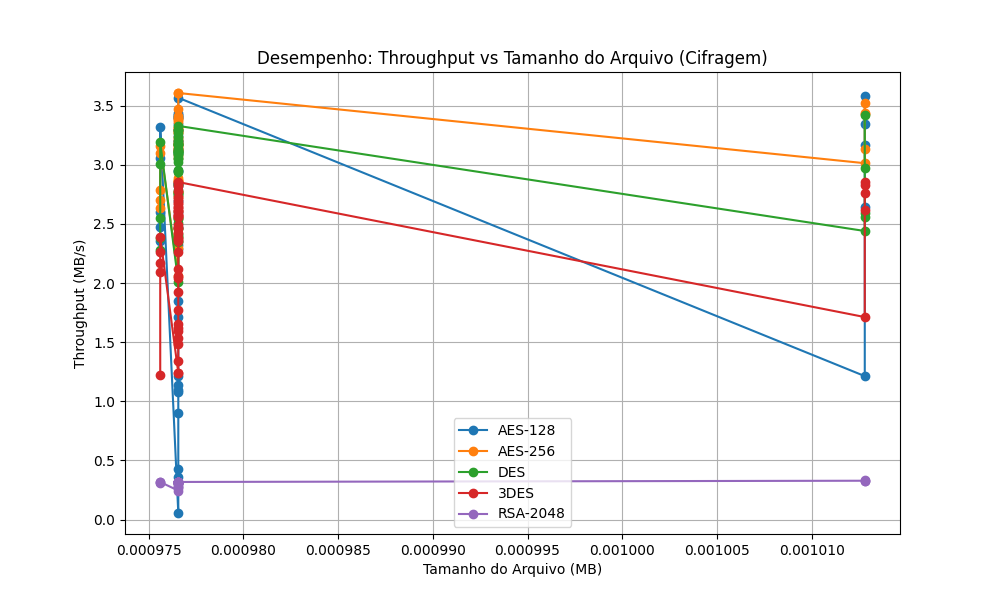

# Relatório de Testes de Criptografia

**Data da Execução:** 12/04/2026 12:18:24

## 1. Tabela de Desempenho

| Arquivo | Alg | Modo | Tam (MB) | T. Cifrar (s) | T. Decifrar (s) | Throughput Cif. (MB/s) | Throughput Dec. (MB/s) | Entropia | Padrões |
|---------|-----|------|----------|---------------|-----------------|------------------------|------------------------|----------|---------|
| csv_categorico_1KB.csv | AES-128 | ECB | 0.0010 | 0.0027 | 0.0008 | 0.3615 | 1.1632 | 7.8192 | ✅ Não |
| csv_categorico_1KB.csv | AES-128 | CBC | 0.0010 | 0.0006 | 0.0009 | 1.7150 | 1.1183 | 7.8215 | ✅ Não |
| csv_categorico_1KB.csv | AES-128 | CFB | 0.0010 | 0.0011 | 0.0009 | 0.9052 | 1.0539 | 7.7807 | ✅ Não |
| csv_categorico_1KB.csv | AES-128 | OFB | 0.0010 | 0.0005 | 0.0010 | 1.8520 | 0.9614 | 7.7978 | ✅ Não |
| csv_categorico_1KB.csv | AES-128 | CTR | 0.0010 | 0.0023 | 0.0010 | 0.4302 | 0.9596 | 7.8134 | ✅ Não |
| csv_categorico_1KB.csv | AES-256 | ECB | 0.0010 | 0.0003 | 0.0008 | 3.0804 | 1.1570 | 7.8312 | ✅ Não |
| csv_categorico_1KB.csv | AES-256 | CBC | 0.0010 | 0.0003 | 0.0009 | 3.1265 | 1.0628 | 7.8160 | ✅ Não |
| csv_categorico_1KB.csv | AES-256 | CFB | 0.0010 | 0.0004 | 0.0129 | 2.7287 | 0.0758 | 7.8012 | ✅ Não |
| csv_categorico_1KB.csv | AES-256 | OFB | 0.0010 | 0.0003 | 0.0009 | 3.1769 | 1.0823 | 7.8398 | ✅ Não |
| csv_categorico_1KB.csv | AES-256 | CTR | 0.0010 | 0.0004 | 0.0011 | 2.7666 | 0.8728 | 7.8118 | ✅ Não |
| csv_categorico_1KB.csv | DES | ECB | 0.0010 | 0.0003 | 0.0008 | 3.1158 | 1.1844 | 7.8039 | ✅ Não |
| csv_categorico_1KB.csv | DES | CBC | 0.0010 | 0.0003 | 0.0009 | 3.0551 | 1.0599 | 7.8046 | ✅ Não |
| csv_categorico_1KB.csv | DES | CFB | 0.0010 | 0.0004 | 0.0010 | 2.4546 | 1.0141 | 7.7888 | ✅ Não |
| csv_categorico_1KB.csv | DES | OFB | 0.0010 | 0.0003 | 0.0024 | 3.1681 | 0.4155 | 7.8216 | ✅ Não |
| csv_categorico_1KB.csv | DES | CTR | 0.0010 | 0.0003 | 0.0009 | 2.8354 | 1.0455 | 7.8151 | ✅ Não |
| csv_categorico_1KB.csv | 3DES | ECB | 0.0010 | 0.0004 | 0.0009 | 2.3767 | 1.0884 | 7.7961 | ✅ Não |
| csv_categorico_1KB.csv | 3DES | CBC | 0.0010 | 0.0004 | 0.0010 | 2.6066 | 0.9396 | 7.7947 | ✅ Não |
| csv_categorico_1KB.csv | 3DES | CFB | 0.0010 | 0.0007 | 0.0012 | 1.3389 | 0.7940 | 7.8159 | ✅ Não |
| csv_categorico_1KB.csv | 3DES | OFB | 0.0010 | 0.0004 | 0.0010 | 2.2590 | 1.0183 | 7.8072 | ✅ Não |
| csv_categorico_1KB.csv | 3DES | CTR | 0.0010 | 0.0004 | 0.0013 | 2.4687 | 0.7442 | 7.7924 | ✅ Não |
| csv_categorico_1KB.csv | RSA-2048 | ECB | 0.0010 | 0.0037 | 0.0172 | 0.2657 | 0.0567 | 7.8356 | ✅ Não |
| csv_categorico_1KB.csv | RSA-2048 | CBC | 0.0010 | 0.0031 | 0.0171 | 0.3147 | 0.0573 | 7.8717 | ✅ Não |
| csv_categorico_1KB.csv | RSA-2048 | CTR | 0.0010 | 0.0032 | 0.0039 | 0.3067 | 0.2493 | 7.7747 | ✅ Não |
| csv_incremental_1KB.csv | AES-128 | ECB | 0.0010 | 0.0004 | 0.0009 | 2.3199 | 1.0809 | 7.6325 | ✅ Não |
| csv_incremental_1KB.csv | AES-128 | CBC | 0.0010 | 0.0004 | 0.0012 | 2.2866 | 0.8011 | 7.7939 | ✅ Não |
| csv_incremental_1KB.csv | AES-128 | CFB | 0.0010 | 0.0004 | 0.0011 | 2.6021 | 0.9110 | 7.7711 | ✅ Não |
| csv_incremental_1KB.csv | AES-128 | OFB | 0.0010 | 0.0003 | 0.0010 | 2.8332 | 0.9750 | 7.7908 | ✅ Não |
| csv_incremental_1KB.csv | AES-128 | CTR | 0.0010 | 0.0003 | 0.0009 | 2.8532 | 1.0746 | 7.8009 | ✅ Não |
| csv_incremental_1KB.csv | AES-256 | ECB | 0.0010 | 0.0003 | 0.0008 | 3.1144 | 1.1527 | 7.6238 | ✅ Não |
| csv_incremental_1KB.csv | AES-256 | CBC | 0.0010 | 0.0003 | 0.0008 | 3.1620 | 1.1637 | 7.8001 | ✅ Não |
| csv_incremental_1KB.csv | AES-256 | CFB | 0.0010 | 0.0003 | 0.0009 | 3.1875 | 1.0320 | 7.7790 | ✅ Não |
| csv_incremental_1KB.csv | AES-256 | OFB | 0.0010 | 0.0004 | 0.0010 | 2.7696 | 1.0109 | 7.8118 | ✅ Não |
| csv_incremental_1KB.csv | AES-256 | CTR | 0.0010 | 0.0003 | 0.0009 | 2.8647 | 1.0398 | 7.8086 | ✅ Não |
| csv_incremental_1KB.csv | DES | ECB | 0.0010 | 0.0003 | 0.0009 | 3.0267 | 1.0900 | 7.1467 | ✅ Não |
| csv_incremental_1KB.csv | DES | CBC | 0.0010 | 0.0004 | 0.0010 | 2.7651 | 0.9915 | 7.8120 | ✅ Não |
| csv_incremental_1KB.csv | DES | CFB | 0.0010 | 0.0004 | 0.0011 | 2.5124 | 0.8996 | 7.8334 | ✅ Não |
| csv_incremental_1KB.csv | DES | OFB | 0.0010 | 0.0003 | 0.0009 | 3.2700 | 1.0582 | 7.8136 | ✅ Não |
| csv_incremental_1KB.csv | DES | CTR | 0.0010 | 0.0003 | 0.0009 | 3.1370 | 1.1365 | 7.7916 | ✅ Não |
| csv_incremental_1KB.csv | 3DES | ECB | 0.0010 | 0.0004 | 0.0009 | 2.4906 | 1.0329 | 7.1316 | ✅ Não |
| csv_incremental_1KB.csv | 3DES | CBC | 0.0010 | 0.0004 | 0.0010 | 2.6677 | 0.9757 | 7.7992 | ✅ Não |
| csv_incremental_1KB.csv | 3DES | CFB | 0.0010 | 0.0007 | 0.0013 | 1.4815 | 0.7408 | 7.8148 | ✅ Não |
| csv_incremental_1KB.csv | 3DES | OFB | 0.0010 | 0.0005 | 0.0010 | 2.0391 | 0.9615 | 7.7988 | ✅ Não |
| csv_incremental_1KB.csv | 3DES | CTR | 0.0010 | 0.0004 | 0.0010 | 2.3850 | 1.0229 | 7.8215 | ✅ Não |
| csv_incremental_1KB.csv | RSA-2048 | ECB | 0.0010 | 0.0031 | 0.0171 | 0.3110 | 0.0572 | 7.8369 | ✅ Não |
| csv_incremental_1KB.csv | RSA-2048 | CBC | 0.0010 | 0.0031 | 0.0170 | 0.3158 | 0.0574 | 7.8618 | ✅ Não |
| csv_incremental_1KB.csv | RSA-2048 | CTR | 0.0010 | 0.0031 | 0.0039 | 0.3169 | 0.2519 | 7.8140 | ✅ Não |
| csv_realista_1KB.csv | AES-128 | ECB | 0.0010 | 0.0009 | 0.0009 | 1.0942 | 1.0899 | 7.8195 | ✅ Não |
| csv_realista_1KB.csv | AES-128 | CBC | 0.0010 | 0.0003 | 0.0008 | 2.9453 | 1.1783 | 7.8156 | ✅ Não |
| csv_realista_1KB.csv | AES-128 | CFB | 0.0010 | 0.0003 | 0.0009 | 2.8413 | 1.0417 | 7.8222 | ✅ Não |
| csv_realista_1KB.csv | AES-128 | OFB | 0.0010 | 0.0003 | 0.0010 | 3.4400 | 1.0084 | 7.8229 | ✅ Não |
| csv_realista_1KB.csv | AES-128 | CTR | 0.0010 | 0.0003 | 0.0009 | 3.4210 | 1.0488 | 7.7999 | ✅ Não |
| csv_realista_1KB.csv | AES-256 | ECB | 0.0010 | 0.0003 | 0.0008 | 3.4727 | 1.1908 | 7.7803 | ✅ Não |
| csv_realista_1KB.csv | AES-256 | CBC | 0.0010 | 0.0003 | 0.0009 | 3.3868 | 1.0724 | 7.8144 | ✅ Não |
| csv_realista_1KB.csv | AES-256 | CFB | 0.0010 | 0.0003 | 0.0010 | 3.2768 | 1.0184 | 7.7999 | ✅ Não |
| csv_realista_1KB.csv | AES-256 | OFB | 0.0010 | 0.0005 | 0.0014 | 2.0573 | 0.6865 | 7.7939 | ✅ Não |
| csv_realista_1KB.csv | AES-256 | CTR | 0.0010 | 0.0004 | 0.0012 | 2.5536 | 0.7984 | 7.8099 | ✅ Não |
| csv_realista_1KB.csv | DES | ECB | 0.0010 | 0.0004 | 0.0012 | 2.5533 | 0.8034 | 7.7721 | ✅ Não |
| csv_realista_1KB.csv | DES | CBC | 0.0010 | 0.0003 | 0.0015 | 3.1033 | 0.6413 | 7.8096 | ✅ Não |
| csv_realista_1KB.csv | DES | CFB | 0.0010 | 0.0004 | 0.0012 | 2.3457 | 0.8433 | 7.7694 | ✅ Não |
| csv_realista_1KB.csv | DES | OFB | 0.0010 | 0.0003 | 0.0009 | 3.3298 | 1.0414 | 7.7996 | ✅ Não |
| csv_realista_1KB.csv | DES | CTR | 0.0010 | 0.0003 | 0.0009 | 3.2005 | 1.1040 | 7.7917 | ✅ Não |
| csv_realista_1KB.csv | 3DES | ECB | 0.0010 | 0.0004 | 0.0009 | 2.6126 | 1.0903 | 7.8048 | ✅ Não |
| csv_realista_1KB.csv | 3DES | CBC | 0.0010 | 0.0004 | 0.0009 | 2.5751 | 1.0726 | 7.8218 | ✅ Não |
| csv_realista_1KB.csv | 3DES | CFB | 0.0010 | 0.0008 | 0.0012 | 1.2412 | 0.7991 | 7.7996 | ✅ Não |
| csv_realista_1KB.csv | 3DES | OFB | 0.0010 | 0.0004 | 0.0009 | 2.4641 | 1.0853 | 7.8298 | ✅ Não |
| csv_realista_1KB.csv | 3DES | CTR | 0.0010 | 0.0004 | 0.0011 | 2.5818 | 0.8558 | 7.8037 | ✅ Não |
| csv_realista_1KB.csv | RSA-2048 | ECB | 0.0010 | 0.0031 | 0.0170 | 0.3147 | 0.0574 | 7.8286 | ✅ Não |
| csv_realista_1KB.csv | RSA-2048 | CBC | 0.0010 | 0.0031 | 0.0172 | 0.3153 | 0.0568 | 7.8785 | ✅ Não |
| csv_realista_1KB.csv | RSA-2048 | CTR | 0.0010 | 0.0031 | 0.0040 | 0.3164 | 0.2462 | 7.8206 | ✅ Não |
| csv_repetitivo_1KB.csv | AES-128 | ECB | 0.0010 | 0.0009 | 0.0009 | 1.0773 | 1.0487 | 6.8740 | ⚠️ Sim |
| csv_repetitivo_1KB.csv | AES-128 | CBC | 0.0010 | 0.0003 | 0.0010 | 2.8417 | 0.9932 | 7.8049 | ✅ Não |
| csv_repetitivo_1KB.csv | AES-128 | CFB | 0.0010 | 0.0004 | 0.0009 | 2.6915 | 1.1210 | 7.8120 | ✅ Não |
| csv_repetitivo_1KB.csv | AES-128 | OFB | 0.0010 | 0.0003 | 0.0009 | 2.8248 | 1.0888 | 7.7984 | ✅ Não |
| csv_repetitivo_1KB.csv | AES-128 | CTR | 0.0010 | 0.0003 | 0.0009 | 3.2963 | 1.0448 | 7.8246 | ✅ Não |
| csv_repetitivo_1KB.csv | AES-256 | ECB | 0.0010 | 0.0004 | 0.0009 | 2.2930 | 1.1141 | 6.9994 | ⚠️ Sim |
| csv_repetitivo_1KB.csv | AES-256 | CBC | 0.0010 | 0.0003 | 0.0009 | 3.1469 | 1.0946 | 7.8131 | ✅ Não |
| csv_repetitivo_1KB.csv | AES-256 | CFB | 0.0010 | 0.0004 | 0.0009 | 2.6088 | 1.1385 | 7.8230 | ✅ Não |
| csv_repetitivo_1KB.csv | AES-256 | OFB | 0.0010 | 0.0003 | 0.0009 | 2.8338 | 1.0907 | 7.8002 | ✅ Não |
| csv_repetitivo_1KB.csv | AES-256 | CTR | 0.0010 | 0.0003 | 0.0009 | 3.1791 | 1.0512 | 7.8058 | ✅ Não |
| csv_repetitivo_1KB.csv | DES | ECB | 0.0010 | 0.0003 | 0.0010 | 3.1804 | 1.0226 | 6.2693 | ⚠️ Sim |
| csv_repetitivo_1KB.csv | DES | CBC | 0.0010 | 0.0004 | 0.0009 | 2.7418 | 1.1473 | 7.8136 | ✅ Não |
| csv_repetitivo_1KB.csv | DES | CFB | 0.0010 | 0.0005 | 0.0010 | 2.0087 | 0.9574 | 7.7955 | ✅ Não |
| csv_repetitivo_1KB.csv | DES | OFB | 0.0010 | 0.0004 | 0.0009 | 2.7553 | 1.0752 | 7.8103 | ✅ Não |
| csv_repetitivo_1KB.csv | DES | CTR | 0.0010 | 0.0003 | 0.0010 | 3.0501 | 1.0103 | 7.8332 | ✅ Não |
| csv_repetitivo_1KB.csv | 3DES | ECB | 0.0010 | 0.0004 | 0.0009 | 2.6915 | 1.0313 | 6.2385 | ⚠️ Sim |
| csv_repetitivo_1KB.csv | 3DES | CBC | 0.0010 | 0.0004 | 0.0012 | 2.3558 | 0.8227 | 7.7669 | ✅ Não |
| csv_repetitivo_1KB.csv | 3DES | CFB | 0.0010 | 0.0006 | 0.0012 | 1.5318 | 0.7925 | 7.8294 | ✅ Não |
| csv_repetitivo_1KB.csv | 3DES | OFB | 0.0010 | 0.0004 | 0.0010 | 2.6475 | 1.0119 | 7.8307 | ✅ Não |
| csv_repetitivo_1KB.csv | 3DES | CTR | 0.0010 | 0.0005 | 0.0009 | 2.0583 | 1.0481 | 7.8101 | ✅ Não |
| csv_repetitivo_1KB.csv | RSA-2048 | ECB | 0.0010 | 0.0031 | 0.0169 | 0.3173 | 0.0577 | 7.8495 | ✅ Não |
| csv_repetitivo_1KB.csv | RSA-2048 | CBC | 0.0010 | 0.0035 | 0.0172 | 0.2803 | 0.0569 | 7.8664 | ✅ Não |
| csv_repetitivo_1KB.csv | RSA-2048 | CTR | 0.0010 | 0.0031 | 0.0043 | 0.3136 | 0.2255 | 7.8218 | ✅ Não |
| dados_aninhados_1KB.json | AES-128 | ECB | 0.0010 | 0.0004 | 0.0009 | 2.4709 | 1.1246 | 7.7934 | ✅ Não |
| dados_aninhados_1KB.json | AES-128 | CBC | 0.0010 | 0.0003 | 0.0009 | 3.3201 | 1.0975 | 7.8252 | ✅ Não |
| dados_aninhados_1KB.json | AES-128 | CFB | 0.0010 | 0.0003 | 0.0018 | 3.0553 | 0.5348 | 7.7748 | ✅ Não |
| dados_aninhados_1KB.json | AES-128 | OFB | 0.0010 | 0.0004 | 0.0013 | 2.5994 | 0.7694 | 7.8055 | ✅ Não |
| dados_aninhados_1KB.json | AES-128 | CTR | 0.0010 | 0.0004 | 0.0011 | 2.3535 | 0.8769 | 7.8204 | ✅ Não |
| dados_aninhados_1KB.json | AES-256 | ECB | 0.0010 | 0.0004 | 0.0009 | 2.6380 | 1.0386 | 7.8026 | ✅ Não |
| dados_aninhados_1KB.json | AES-256 | CBC | 0.0010 | 0.0003 | 0.0011 | 3.1616 | 0.9209 | 7.8301 | ✅ Não |
| dados_aninhados_1KB.json | AES-256 | CFB | 0.0010 | 0.0003 | 0.0009 | 3.1014 | 1.0991 | 7.7759 | ✅ Não |
| dados_aninhados_1KB.json | AES-256 | OFB | 0.0010 | 0.0004 | 0.0010 | 2.7856 | 1.0179 | 7.7725 | ✅ Não |
| dados_aninhados_1KB.json | AES-256 | CTR | 0.0010 | 0.0004 | 0.0009 | 2.7047 | 1.1191 | 7.7864 | ✅ Não |
| dados_aninhados_1KB.json | DES | ECB | 0.0010 | 0.0003 | 0.0010 | 3.1931 | 0.9720 | 7.8398 | ✅ Não |
| dados_aninhados_1KB.json | DES | CBC | 0.0010 | 0.0003 | 0.0010 | 3.0055 | 0.9719 | 7.8316 | ✅ Não |
| dados_aninhados_1KB.json | DES | CFB | 0.0010 | 0.0004 | 0.0011 | 2.3788 | 0.8724 | 7.8337 | ✅ Não |
| dados_aninhados_1KB.json | DES | OFB | 0.0010 | 0.0004 | 0.0012 | 2.2834 | 0.8364 | 7.8051 | ✅ Não |
| dados_aninhados_1KB.json | DES | CTR | 0.0010 | 0.0004 | 0.0011 | 2.5514 | 0.9140 | 7.8268 | ✅ Não |
| dados_aninhados_1KB.json | 3DES | ECB | 0.0010 | 0.0004 | 0.0017 | 2.2659 | 0.5823 | 7.8103 | ✅ Não |
| dados_aninhados_1KB.json | 3DES | CBC | 0.0010 | 0.0005 | 0.0015 | 2.0901 | 0.6637 | 7.8278 | ✅ Não |
| dados_aninhados_1KB.json | 3DES | CFB | 0.0010 | 0.0008 | 0.0015 | 1.2246 | 0.6412 | 7.8076 | ✅ Não |
| dados_aninhados_1KB.json | 3DES | OFB | 0.0010 | 0.0005 | 0.0011 | 2.1660 | 0.8741 | 7.8131 | ✅ Não |
| dados_aninhados_1KB.json | 3DES | CTR | 0.0010 | 0.0004 | 0.0009 | 2.3906 | 1.0604 | 7.8056 | ✅ Não |
| dados_aninhados_1KB.json | RSA-2048 | ECB | 0.0010 | 0.0032 | 0.0178 | 0.3076 | 0.0548 | 7.8567 | ✅ Não |
| dados_aninhados_1KB.json | RSA-2048 | CBC | 0.0010 | 0.0031 | 0.0170 | 0.3168 | 0.0575 | 7.8778 | ✅ Não |
| dados_aninhados_1KB.json | RSA-2048 | CTR | 0.0010 | 0.0031 | 0.0054 | 0.3172 | 0.1820 | 7.8107 | ✅ Não |
| dados_aninhados_1KB.xml | AES-128 | ECB | 0.0010 | 0.0178 | 0.0009 | 0.0550 | 1.1038 | 7.8029 | ✅ Não |
| dados_aninhados_1KB.xml | AES-128 | CBC | 0.0010 | 0.0003 | 0.0008 | 3.1203 | 1.1950 | 7.8229 | ✅ Não |
| dados_aninhados_1KB.xml | AES-128 | CFB | 0.0010 | 0.0003 | 0.0011 | 3.2418 | 0.9008 | 7.7952 | ✅ Não |
| dados_aninhados_1KB.xml | AES-128 | OFB | 0.0010 | 0.0003 | 0.0009 | 3.2939 | 1.0353 | 7.7989 | ✅ Não |
| dados_aninhados_1KB.xml | AES-128 | CTR | 0.0010 | 0.0003 | 0.0011 | 3.4222 | 0.8653 | 7.8054 | ✅ Não |
| dados_aninhados_1KB.xml | AES-256 | ECB | 0.0010 | 0.0003 | 0.0018 | 2.8714 | 0.5456 | 7.8300 | ✅ Não |
| dados_aninhados_1KB.xml | AES-256 | CBC | 0.0010 | 0.0003 | 0.0009 | 3.2025 | 1.0935 | 7.8057 | ✅ Não |
| dados_aninhados_1KB.xml | AES-256 | CFB | 0.0010 | 0.0003 | 0.0010 | 3.0572 | 1.0086 | 7.8375 | ✅ Não |
| dados_aninhados_1KB.xml | AES-256 | OFB | 0.0010 | 0.0003 | 0.0009 | 3.6082 | 1.1074 | 7.8013 | ✅ Não |
| dados_aninhados_1KB.xml | AES-256 | CTR | 0.0010 | 0.0003 | 0.0023 | 3.4094 | 0.4167 | 7.8136 | ✅ Não |
| dados_aninhados_1KB.xml | DES | ECB | 0.0010 | 0.0003 | 0.0009 | 3.2953 | 1.1108 | 7.7548 | ✅ Não |
| dados_aninhados_1KB.xml | DES | CBC | 0.0010 | 0.0003 | 0.0009 | 2.9574 | 1.0931 | 7.7942 | ✅ Não |
| dados_aninhados_1KB.xml | DES | CFB | 0.0010 | 0.0004 | 0.0012 | 2.5420 | 0.8411 | 7.7974 | ✅ Não |
| dados_aninhados_1KB.xml | DES | OFB | 0.0010 | 0.0004 | 0.0013 | 2.4673 | 0.7300 | 7.8119 | ✅ Não |
| dados_aninhados_1KB.xml | DES | CTR | 0.0010 | 0.0004 | 0.0011 | 2.4026 | 0.8979 | 7.8098 | ✅ Não |
| dados_aninhados_1KB.xml | 3DES | ECB | 0.0010 | 0.0004 | 0.0014 | 2.4219 | 0.6820 | 7.7500 | ✅ Não |
| dados_aninhados_1KB.xml | 3DES | CBC | 0.0010 | 0.0006 | 0.0015 | 1.7702 | 0.6443 | 7.8160 | ✅ Não |
| dados_aninhados_1KB.xml | 3DES | CFB | 0.0010 | 0.0008 | 0.0016 | 1.2420 | 0.6032 | 7.8042 | ✅ Não |
| dados_aninhados_1KB.xml | 3DES | OFB | 0.0010 | 0.0005 | 0.0011 | 2.1199 | 0.9159 | 7.8244 | ✅ Não |
| dados_aninhados_1KB.xml | 3DES | CTR | 0.0010 | 0.0004 | 0.0184 | 2.5627 | 0.0531 | 7.8279 | ✅ Não |
| dados_aninhados_1KB.xml | RSA-2048 | ECB | 0.0010 | 0.0032 | 0.0169 | 0.3015 | 0.0576 | 7.8459 | ✅ Não |
| dados_aninhados_1KB.xml | RSA-2048 | CBC | 0.0010 | 0.0031 | 0.0171 | 0.3160 | 0.0570 | 7.8954 | ✅ Não |
| dados_aninhados_1KB.xml | RSA-2048 | CTR | 0.0010 | 0.0031 | 0.0055 | 0.3176 | 0.1761 | 7.8178 | ✅ Não |
| imagem_padrao_1KB.bmp | AES-128 | ECB | 0.0010 | 0.0008 | 0.0009 | 1.2131 | 1.1694 | 6.5565 | ⚠️ Sim |
| imagem_padrao_1KB.bmp | AES-128 | CBC | 0.0010 | 0.0003 | 0.0008 | 3.3423 | 1.2209 | 7.8297 | ✅ Não |
| imagem_padrao_1KB.bmp | AES-128 | CFB | 0.0010 | 0.0003 | 0.0010 | 3.1668 | 1.0259 | 7.8117 | ✅ Não |
| imagem_padrao_1KB.bmp | AES-128 | OFB | 0.0010 | 0.0003 | 0.0134 | 3.5815 | 0.0753 | 7.8201 | ✅ Não |
| imagem_padrao_1KB.bmp | AES-128 | CTR | 0.0010 | 0.0004 | 0.0008 | 2.6403 | 1.2528 | 7.8133 | ✅ Não |
| imagem_padrao_1KB.bmp | AES-256 | ECB | 0.0010 | 0.0003 | 0.0009 | 3.5230 | 1.1441 | 6.5273 | ⚠️ Sim |
| imagem_padrao_1KB.bmp | AES-256 | CBC | 0.0010 | 0.0003 | 0.0008 | 3.4400 | 1.3023 | 7.8167 | ✅ Não |
| imagem_padrao_1KB.bmp | AES-256 | CFB | 0.0010 | 0.0003 | 0.0009 | 3.1330 | 1.1447 | 7.8436 | ✅ Não |
| imagem_padrao_1KB.bmp | AES-256 | OFB | 0.0010 | 0.0003 | 0.0009 | 3.0143 | 1.1405 | 7.8134 | ✅ Não |
| imagem_padrao_1KB.bmp | AES-256 | CTR | 0.0010 | 0.0003 | 0.0008 | 3.4291 | 1.1946 | 7.8121 | ✅ Não |
| imagem_padrao_1KB.bmp | DES | ECB | 0.0010 | 0.0003 | 0.0009 | 3.4261 | 1.1639 | 5.2736 | ⚠️ Sim |
| imagem_padrao_1KB.bmp | DES | CBC | 0.0010 | 0.0004 | 0.0023 | 2.5614 | 0.4345 | 7.8117 | ✅ Não |
| imagem_padrao_1KB.bmp | DES | CFB | 0.0010 | 0.0004 | 0.0013 | 2.4407 | 0.7749 | 7.7830 | ✅ Não |
| imagem_padrao_1KB.bmp | DES | OFB | 0.0010 | 0.0004 | 0.0009 | 2.5907 | 1.0912 | 7.8193 | ✅ Não |
| imagem_padrao_1KB.bmp | DES | CTR | 0.0010 | 0.0003 | 0.0010 | 2.9748 | 1.0499 | 7.8209 | ✅ Não |
| imagem_padrao_1KB.bmp | 3DES | ECB | 0.0010 | 0.0004 | 0.0009 | 2.7611 | 1.1613 | 5.2723 | ⚠️ Sim |
| imagem_padrao_1KB.bmp | 3DES | CBC | 0.0010 | 0.0004 | 0.0034 | 2.6221 | 0.2985 | 7.8204 | ✅ Não |
| imagem_padrao_1KB.bmp | 3DES | CFB | 0.0010 | 0.0006 | 0.0011 | 1.7126 | 0.8807 | 7.8286 | ✅ Não |
| imagem_padrao_1KB.bmp | 3DES | OFB | 0.0010 | 0.0004 | 0.0009 | 2.8529 | 1.1605 | 7.8453 | ✅ Não |
| imagem_padrao_1KB.bmp | 3DES | CTR | 0.0010 | 0.0004 | 0.0027 | 2.8337 | 0.3732 | 7.7899 | ✅ Não |
| imagem_padrao_1KB.bmp | RSA-2048 | ECB | 0.0010 | 0.0031 | 0.0171 | 0.3310 | 0.0592 | 7.8340 | ✅ Não |
| imagem_padrao_1KB.bmp | RSA-2048 | CBC | 0.0010 | 0.0031 | 0.0170 | 0.3290 | 0.0596 | 7.8872 | ✅ Não |
| imagem_padrao_1KB.bmp | RSA-2048 | CTR | 0.0010 | 0.0031 | 0.0039 | 0.3280 | 0.2583 | 7.8318 | ✅ Não |
| texto_aleatorio_1KB.txt | AES-128 | ECB | 0.0010 | 0.0008 | 0.0009 | 1.2126 | 1.0339 | 7.8161 | ✅ Não |
| texto_aleatorio_1KB.txt | AES-128 | CBC | 0.0010 | 0.0003 | 0.0010 | 3.4003 | 1.0231 | 7.8122 | ✅ Não |
| texto_aleatorio_1KB.txt | AES-128 | CFB | 0.0010 | 0.0003 | 0.0011 | 3.1905 | 0.8531 | 7.8193 | ✅ Não |
| texto_aleatorio_1KB.txt | AES-128 | OFB | 0.0010 | 0.0003 | 0.0009 | 3.4014 | 1.1315 | 7.7786 | ✅ Não |
| texto_aleatorio_1KB.txt | AES-128 | CTR | 0.0010 | 0.0003 | 0.0010 | 3.3448 | 0.9962 | 7.7863 | ✅ Não |
| texto_aleatorio_1KB.txt | AES-256 | ECB | 0.0010 | 0.0003 | 0.0012 | 3.3032 | 0.7976 | 7.8048 | ✅ Não |
| texto_aleatorio_1KB.txt | AES-256 | CBC | 0.0010 | 0.0003 | 0.0009 | 3.3759 | 1.0522 | 7.8178 | ✅ Não |
| texto_aleatorio_1KB.txt | AES-256 | CFB | 0.0010 | 0.0003 | 0.0010 | 3.1668 | 0.9443 | 7.8153 | ✅ Não |
| texto_aleatorio_1KB.txt | AES-256 | OFB | 0.0010 | 0.0003 | 0.0008 | 3.4003 | 1.1925 | 7.7966 | ✅ Não |
| texto_aleatorio_1KB.txt | AES-256 | CTR | 0.0010 | 0.0003 | 0.0009 | 3.2178 | 1.1019 | 7.8264 | ✅ Não |
| texto_aleatorio_1KB.txt | DES | ECB | 0.0010 | 0.0003 | 0.0009 | 3.1749 | 1.0308 | 7.8180 | ✅ Não |
| texto_aleatorio_1KB.txt | DES | CBC | 0.0010 | 0.0003 | 0.0008 | 3.0862 | 1.1589 | 7.7918 | ✅ Não |
| texto_aleatorio_1KB.txt | DES | CFB | 0.0010 | 0.0004 | 0.0010 | 2.3867 | 0.9370 | 7.8185 | ✅ Não |
| texto_aleatorio_1KB.txt | DES | OFB | 0.0010 | 0.0004 | 0.0009 | 2.7726 | 1.1080 | 7.7845 | ✅ Não |
| texto_aleatorio_1KB.txt | DES | CTR | 0.0010 | 0.0003 | 0.0009 | 3.2987 | 1.1382 | 7.7921 | ✅ Não |
| texto_aleatorio_1KB.txt | 3DES | ECB | 0.0010 | 0.0003 | 0.0010 | 2.8548 | 0.9685 | 7.8106 | ✅ Não |
| texto_aleatorio_1KB.txt | 3DES | CBC | 0.0010 | 0.0004 | 0.0009 | 2.7832 | 1.0911 | 7.8056 | ✅ Não |
| texto_aleatorio_1KB.txt | 3DES | CFB | 0.0010 | 0.0006 | 0.0011 | 1.6233 | 0.8587 | 7.8093 | ✅ Não |
| texto_aleatorio_1KB.txt | 3DES | OFB | 0.0010 | 0.0004 | 0.0009 | 2.6789 | 1.0875 | 7.7935 | ✅ Não |
| texto_aleatorio_1KB.txt | 3DES | CTR | 0.0010 | 0.0004 | 0.0009 | 2.5671 | 1.0789 | 7.8383 | ✅ Não |
| texto_aleatorio_1KB.txt | RSA-2048 | ECB | 0.0010 | 0.0031 | 0.0169 | 0.3139 | 0.0578 | 7.8668 | ✅ Não |
| texto_aleatorio_1KB.txt | RSA-2048 | CBC | 0.0010 | 0.0031 | 0.0170 | 0.3168 | 0.0575 | 7.8652 | ✅ Não |
| texto_aleatorio_1KB.txt | RSA-2048 | CTR | 0.0010 | 0.0032 | 0.0038 | 0.3083 | 0.2576 | 7.8195 | ✅ Não |
| texto_natural_1KB.txt | AES-128 | ECB | 0.0010 | 0.0004 | 0.0008 | 2.4709 | 1.2573 | 7.8176 | ✅ Não |
| texto_natural_1KB.txt | AES-128 | CBC | 0.0010 | 0.0003 | 0.0008 | 3.4071 | 1.1773 | 7.8287 | ✅ Não |
| texto_natural_1KB.txt | AES-128 | CFB | 0.0010 | 0.0003 | 0.0010 | 3.2045 | 1.0222 | 7.8135 | ✅ Não |
| texto_natural_1KB.txt | AES-128 | OFB | 0.0010 | 0.0003 | 0.0020 | 3.0983 | 0.4832 | 7.8094 | ✅ Não |
| texto_natural_1KB.txt | AES-128 | CTR | 0.0010 | 0.0003 | 0.0009 | 3.5679 | 1.1037 | 7.8092 | ✅ Não |
| texto_natural_1KB.txt | AES-256 | ECB | 0.0010 | 0.0003 | 0.0008 | 3.6053 | 1.1824 | 7.7906 | ✅ Não |
| texto_natural_1KB.txt | AES-256 | CBC | 0.0010 | 0.0003 | 0.0008 | 3.3204 | 1.1542 | 7.8211 | ✅ Não |
| texto_natural_1KB.txt | AES-256 | CFB | 0.0010 | 0.0003 | 0.0009 | 3.2372 | 1.0763 | 7.8251 | ✅ Não |
| texto_natural_1KB.txt | AES-256 | OFB | 0.0010 | 0.0003 | 0.0008 | 3.2865 | 1.1684 | 7.7966 | ✅ Não |
| texto_natural_1KB.txt | AES-256 | CTR | 0.0010 | 0.0003 | 0.0009 | 2.8900 | 1.0988 | 7.8150 | ✅ Não |
| texto_natural_1KB.txt | DES | ECB | 0.0010 | 0.0004 | 0.0010 | 2.7845 | 1.0060 | 7.7413 | ✅ Não |
| texto_natural_1KB.txt | DES | CBC | 0.0010 | 0.0003 | 0.0011 | 2.9440 | 0.9278 | 7.7818 | ✅ Não |
| texto_natural_1KB.txt | DES | CFB | 0.0010 | 0.0004 | 0.0011 | 2.4188 | 0.8759 | 7.8088 | ✅ Não |
| texto_natural_1KB.txt | DES | OFB | 0.0010 | 0.0003 | 0.0009 | 3.1082 | 1.1009 | 7.8153 | ✅ Não |
| texto_natural_1KB.txt | DES | CTR | 0.0010 | 0.0003 | 0.0010 | 3.0885 | 1.0085 | 7.8380 | ✅ Não |
| texto_natural_1KB.txt | 3DES | ECB | 0.0010 | 0.0004 | 0.0009 | 2.5682 | 1.0400 | 7.7702 | ✅ Não |
| texto_natural_1KB.txt | 3DES | CBC | 0.0010 | 0.0003 | 0.0010 | 2.8182 | 0.9790 | 7.8255 | ✅ Não |
| texto_natural_1KB.txt | 3DES | CFB | 0.0010 | 0.0006 | 0.0012 | 1.6511 | 0.8238 | 7.8207 | ✅ Não |
| texto_natural_1KB.txt | 3DES | OFB | 0.0010 | 0.0005 | 0.0009 | 1.9248 | 1.0665 | 7.8001 | ✅ Não |
| texto_natural_1KB.txt | 3DES | CTR | 0.0010 | 0.0003 | 0.0009 | 2.8484 | 1.0289 | 7.7932 | ✅ Não |
| texto_natural_1KB.txt | RSA-2048 | ECB | 0.0010 | 0.0031 | 0.0174 | 0.3149 | 0.0561 | 7.8704 | ✅ Não |
| texto_natural_1KB.txt | RSA-2048 | CBC | 0.0010 | 0.0031 | 0.0170 | 0.3171 | 0.0575 | 7.8818 | ✅ Não |
| texto_natural_1KB.txt | RSA-2048 | CTR | 0.0010 | 0.0031 | 0.0043 | 0.3152 | 0.2275 | 7.8390 | ✅ Não |
| texto_repetitivo_1KB.txt | AES-128 | ECB | 0.0010 | 0.0009 | 0.0008 | 1.1389 | 1.2562 | 6.0781 | ⚠️ Sim |
| texto_repetitivo_1KB.txt | AES-128 | CBC | 0.0010 | 0.0003 | 0.0008 | 3.1284 | 1.1677 | 7.8141 | ✅ Não |
| texto_repetitivo_1KB.txt | AES-128 | CFB | 0.0010 | 0.0003 | 0.0010 | 3.1363 | 0.9953 | 7.8268 | ✅ Não |
| texto_repetitivo_1KB.txt | AES-128 | OFB | 0.0010 | 0.0003 | 0.0009 | 3.2148 | 1.0468 | 7.8212 | ✅ Não |
| texto_repetitivo_1KB.txt | AES-128 | CTR | 0.0010 | 0.0003 | 0.0015 | 2.9457 | 0.6627 | 7.8125 | ✅ Não |
| texto_repetitivo_1KB.txt | AES-256 | ECB | 0.0010 | 0.0003 | 0.0009 | 3.2658 | 1.0906 | 5.9451 | ⚠️ Sim |
| texto_repetitivo_1KB.txt | AES-256 | CBC | 0.0010 | 0.0003 | 0.0033 | 3.3604 | 0.2978 | 7.8218 | ✅ Não |
| texto_repetitivo_1KB.txt | AES-256 | CFB | 0.0010 | 0.0003 | 0.0009 | 3.1317 | 1.0816 | 7.8000 | ✅ Não |
| texto_repetitivo_1KB.txt | AES-256 | OFB | 0.0010 | 0.0003 | 0.0008 | 3.3145 | 1.1678 | 7.8135 | ✅ Não |
| texto_repetitivo_1KB.txt | AES-256 | CTR | 0.0010 | 0.0003 | 0.0008 | 2.8625 | 1.1769 | 7.8316 | ✅ Não |
| texto_repetitivo_1KB.txt | DES | ECB | 0.0010 | 0.0003 | 0.0009 | 3.2349 | 1.0914 | 5.2634 | ⚠️ Sim |
| texto_repetitivo_1KB.txt | DES | CBC | 0.0010 | 0.0003 | 0.0008 | 3.1801 | 1.1759 | 7.7904 | ✅ Não |
| texto_repetitivo_1KB.txt | DES | CFB | 0.0010 | 0.0004 | 0.0009 | 2.3566 | 1.0460 | 7.7881 | ✅ Não |
| texto_repetitivo_1KB.txt | DES | OFB | 0.0010 | 0.0003 | 0.0009 | 3.1066 | 1.1122 | 7.8210 | ✅ Não |
| texto_repetitivo_1KB.txt | DES | CTR | 0.0010 | 0.0003 | 0.0010 | 3.1198 | 0.9574 | 7.8002 | ✅ Não |
| texto_repetitivo_1KB.txt | 3DES | ECB | 0.0010 | 0.0004 | 0.0010 | 2.7247 | 0.9710 | 5.2190 | ⚠️ Sim |
| texto_repetitivo_1KB.txt | 3DES | CBC | 0.0010 | 0.0004 | 0.0009 | 2.7144 | 1.0665 | 7.8072 | ✅ Não |
| texto_repetitivo_1KB.txt | 3DES | CFB | 0.0010 | 0.0006 | 0.0012 | 1.5933 | 0.8343 | 7.7774 | ✅ Não |
| texto_repetitivo_1KB.txt | 3DES | OFB | 0.0010 | 0.0004 | 0.0009 | 2.6280 | 1.0852 | 7.7928 | ✅ Não |
| texto_repetitivo_1KB.txt | 3DES | CTR | 0.0010 | 0.0004 | 0.0011 | 2.6433 | 0.9020 | 7.8143 | ✅ Não |
| texto_repetitivo_1KB.txt | RSA-2048 | ECB | 0.0010 | 0.0040 | 0.0176 | 0.2442 | 0.0555 | 7.8629 | ✅ Não |
| texto_repetitivo_1KB.txt | RSA-2048 | CBC | 0.0010 | 0.0035 | 0.0171 | 0.2780 | 0.0570 | 7.8795 | ✅ Não |
| texto_repetitivo_1KB.txt | RSA-2048 | CTR | 0.0010 | 0.0031 | 0.0037 | 0.3134 | 0.2617 | 7.7887 | ✅ Não |

## 2. Gráficos de Análise

