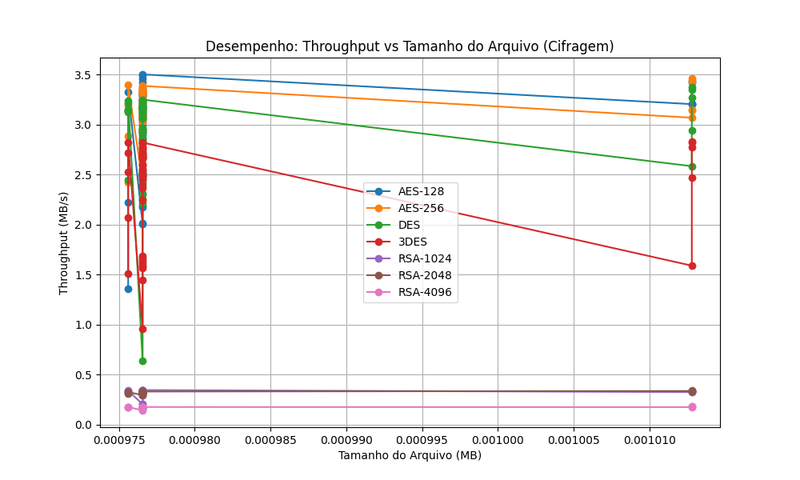

# Relatório de Testes de Criptografia

**Data da Execução:** 12/04/2026 12:32:09

## 1. Tabela de Desempenho

| Arquivo | Alg | Modo | Tam (MB) | T. Cifrar (s) | T. Decifrar (s) | Throughput Cif. (MB/s) | Throughput Dec. (MB/s) | Entropia | Padrões |
|---------|-----|------|----------|---------------|-----------------|------------------------|------------------------|----------|---------|
| csv_categorico_1KB.csv | AES-128 | ECB | 0.0010 | 0.0005 | 0.0010 | 2.0045 | 0.9618 | 7.8078 | ✅ Não |
| csv_categorico_1KB.csv | AES-128 | CBC | 0.0010 | 0.0005 | 0.0011 | 2.0096 | 0.9083 | 7.8314 | ✅ Não |
| csv_categorico_1KB.csv | AES-128 | CFB | 0.0010 | 0.0004 | 0.0019 | 2.1851 | 0.5183 | 7.8165 | ✅ Não |
| csv_categorico_1KB.csv | AES-128 | OFB | 0.0010 | 0.0004 | 0.0010 | 2.1741 | 0.9920 | 7.8088 | ✅ Não |
| csv_categorico_1KB.csv | AES-128 | CTR | 0.0010 | 0.0004 | 0.0009 | 2.3063 | 1.0326 | 7.8134 | ✅ Não |
| csv_categorico_1KB.csv | AES-256 | ECB | 0.0010 | 0.0003 | 0.0009 | 3.3263 | 1.0983 | 7.8000 | ✅ Não |
| csv_categorico_1KB.csv | AES-256 | CBC | 0.0010 | 0.0003 | 0.0009 | 3.2131 | 1.0853 | 7.8399 | ✅ Não |
| csv_categorico_1KB.csv | AES-256 | CFB | 0.0010 | 0.0003 | 0.0009 | 2.8086 | 1.1300 | 7.7838 | ✅ Não |
| csv_categorico_1KB.csv | AES-256 | OFB | 0.0010 | 0.0003 | 0.0009 | 2.9553 | 1.0926 | 7.8197 | ✅ Não |
| csv_categorico_1KB.csv | AES-256 | CTR | 0.0010 | 0.0003 | 0.0009 | 3.2995 | 1.0987 | 7.7992 | ✅ Não |
| csv_categorico_1KB.csv | DES | ECB | 0.0010 | 0.0003 | 0.0009 | 3.0932 | 1.1411 | 7.7886 | ✅ Não |
| csv_categorico_1KB.csv | DES | CBC | 0.0010 | 0.0004 | 0.0009 | 2.6747 | 1.1349 | 7.8066 | ✅ Não |
| csv_categorico_1KB.csv | DES | CFB | 0.0010 | 0.0004 | 0.0010 | 2.3023 | 1.0073 | 7.8167 | ✅ Não |
| csv_categorico_1KB.csv | DES | OFB | 0.0010 | 0.0003 | 0.0009 | 3.1349 | 1.0953 | 7.8212 | ✅ Não |
| csv_categorico_1KB.csv | DES | CTR | 0.0010 | 0.0003 | 0.0009 | 3.1705 | 1.1226 | 7.8073 | ✅ Não |
| csv_categorico_1KB.csv | 3DES | ECB | 0.0010 | 0.0004 | 0.0009 | 2.6639 | 1.1166 | 7.7662 | ✅ Não |
| csv_categorico_1KB.csv | 3DES | CBC | 0.0010 | 0.0004 | 0.0009 | 2.4599 | 1.0358 | 7.8086 | ✅ Não |
| csv_categorico_1KB.csv | 3DES | CFB | 0.0010 | 0.0006 | 0.0012 | 1.5687 | 0.7914 | 7.8277 | ✅ Não |
| csv_categorico_1KB.csv | 3DES | OFB | 0.0010 | 0.0004 | 0.0010 | 2.4871 | 0.9957 | 7.7960 | ✅ Não |
| csv_categorico_1KB.csv | 3DES | CTR | 0.0010 | 0.0004 | 0.0010 | 2.6635 | 0.9880 | 7.7845 | ✅ Não |
| csv_categorico_1KB.csv | RSA-1024 | ECB | 0.0010 | 0.0029 | 0.0113 | 0.3348 | 0.0866 | 7.8758 | ✅ Não |
| csv_categorico_1KB.csv | RSA-1024 | CBC | 0.0010 | 0.0029 | 0.0113 | 0.3391 | 0.0867 | 7.8917 | ✅ Não |
| csv_categorico_1KB.csv | RSA-1024 | CTR | 0.0010 | 0.0029 | 0.0038 | 0.3359 | 0.2593 | 7.7872 | ✅ Não |
| csv_categorico_1KB.csv | RSA-2048 | ECB | 0.0010 | 0.0033 | 0.0171 | 0.2944 | 0.0570 | 7.8459 | ✅ Não |
| csv_categorico_1KB.csv | RSA-2048 | CBC | 0.0010 | 0.0030 | 0.0168 | 0.3217 | 0.0581 | 7.8780 | ✅ Não |
| csv_categorico_1KB.csv | RSA-2048 | CTR | 0.0010 | 0.0030 | 0.0038 | 0.3216 | 0.2540 | 7.7809 | ✅ Não |
| csv_categorico_1KB.csv | RSA-4096 | ECB | 0.0010 | 0.0057 | 0.0511 | 0.1722 | 0.0191 | 7.8868 | ✅ Não |
| csv_categorico_1KB.csv | RSA-4096 | CBC | 0.0010 | 0.0058 | 0.0510 | 0.1686 | 0.0191 | 7.9083 | ✅ Não |
| csv_categorico_1KB.csv | RSA-4096 | CTR | 0.0010 | 0.0057 | 0.0064 | 0.1711 | 0.1536 | 7.8255 | ✅ Não |
| csv_incremental_1KB.csv | AES-128 | ECB | 0.0010 | 0.0003 | 0.0009 | 3.4562 | 1.0862 | 7.6338 | ✅ Não |
| csv_incremental_1KB.csv | AES-128 | CBC | 0.0010 | 0.0003 | 0.0009 | 3.3612 | 1.0426 | 7.8018 | ✅ Não |
| csv_incremental_1KB.csv | AES-128 | CFB | 0.0010 | 0.0003 | 0.0009 | 3.0200 | 1.1389 | 7.7964 | ✅ Não |
| csv_incremental_1KB.csv | AES-128 | OFB | 0.0010 | 0.0003 | 0.0009 | 2.9215 | 1.1018 | 7.8423 | ✅ Não |
| csv_incremental_1KB.csv | AES-128 | CTR | 0.0010 | 0.0003 | 0.0008 | 3.1843 | 1.2213 | 7.8438 | ✅ Não |
| csv_incremental_1KB.csv | AES-256 | ECB | 0.0010 | 0.0003 | 0.0009 | 3.2344 | 1.1144 | 7.6700 | ✅ Não |
| csv_incremental_1KB.csv | AES-256 | CBC | 0.0010 | 0.0003 | 0.0009 | 3.0785 | 1.0829 | 7.8332 | ✅ Não |
| csv_incremental_1KB.csv | AES-256 | CFB | 0.0010 | 0.0003 | 0.0009 | 3.1649 | 1.0728 | 7.7852 | ✅ Não |
| csv_incremental_1KB.csv | AES-256 | OFB | 0.0010 | 0.0003 | 0.0009 | 3.3290 | 1.1295 | 7.8175 | ✅ Não |
| csv_incremental_1KB.csv | AES-256 | CTR | 0.0010 | 0.0003 | 0.0008 | 3.0739 | 1.1684 | 7.8366 | ✅ Não |
| csv_incremental_1KB.csv | DES | ECB | 0.0010 | 0.0003 | 0.0009 | 3.2469 | 1.1277 | 7.1693 | ✅ Não |
| csv_incremental_1KB.csv | DES | CBC | 0.0010 | 0.0003 | 0.0009 | 3.0965 | 1.0510 | 7.8514 | ✅ Não |
| csv_incremental_1KB.csv | DES | CFB | 0.0010 | 0.0004 | 0.0010 | 2.5049 | 0.9302 | 7.8221 | ✅ Não |
| csv_incremental_1KB.csv | DES | OFB | 0.0010 | 0.0003 | 0.0010 | 3.1624 | 1.0104 | 7.8116 | ✅ Não |
| csv_incremental_1KB.csv | DES | CTR | 0.0010 | 0.0003 | 0.0009 | 2.9343 | 1.1211 | 7.8250 | ✅ Não |
| csv_incremental_1KB.csv | 3DES | ECB | 0.0010 | 0.0004 | 0.0009 | 2.3650 | 1.0388 | 7.1525 | ✅ Não |
| csv_incremental_1KB.csv | 3DES | CBC | 0.0010 | 0.0004 | 0.0010 | 2.7694 | 1.0114 | 7.8276 | ✅ Não |
| csv_incremental_1KB.csv | 3DES | CFB | 0.0010 | 0.0006 | 0.0013 | 1.6832 | 0.7781 | 7.8056 | ✅ Não |
| csv_incremental_1KB.csv | 3DES | OFB | 0.0010 | 0.0004 | 0.0010 | 2.7158 | 1.0202 | 7.8281 | ✅ Não |
| csv_incremental_1KB.csv | 3DES | CTR | 0.0010 | 0.0004 | 0.0008 | 2.6843 | 1.1517 | 7.8138 | ✅ Não |
| csv_incremental_1KB.csv | RSA-1024 | ECB | 0.0010 | 0.0028 | 0.0112 | 0.3447 | 0.0875 | 7.8699 | ✅ Não |
| csv_incremental_1KB.csv | RSA-1024 | CBC | 0.0010 | 0.0029 | 0.0111 | 0.3413 | 0.0877 | 7.8820 | ✅ Não |
| csv_incremental_1KB.csv | RSA-1024 | CTR | 0.0010 | 0.0048 | 0.0037 | 0.2025 | 0.2639 | 7.7793 | ✅ Não |
| csv_incremental_1KB.csv | RSA-2048 | ECB | 0.0010 | 0.0030 | 0.0167 | 0.3303 | 0.0584 | 7.8483 | ✅ Não |
| csv_incremental_1KB.csv | RSA-2048 | CBC | 0.0010 | 0.0030 | 0.0170 | 0.3226 | 0.0575 | 7.8605 | ✅ Não |
| csv_incremental_1KB.csv | RSA-2048 | CTR | 0.0010 | 0.0030 | 0.0042 | 0.3232 | 0.2348 | 7.8042 | ✅ Não |
| csv_incremental_1KB.csv | RSA-4096 | ECB | 0.0010 | 0.0057 | 0.0510 | 0.1727 | 0.0191 | 7.8776 | ✅ Não |
| csv_incremental_1KB.csv | RSA-4096 | CBC | 0.0010 | 0.0058 | 0.0512 | 0.1694 | 0.0191 | 7.9059 | ✅ Não |
| csv_incremental_1KB.csv | RSA-4096 | CTR | 0.0010 | 0.0057 | 0.0064 | 0.1715 | 0.1530 | 7.8421 | ✅ Não |
| csv_realista_1KB.csv | AES-128 | ECB | 0.0010 | 0.0003 | 0.0009 | 3.1686 | 1.1078 | 7.8049 | ✅ Não |
| csv_realista_1KB.csv | AES-128 | CBC | 0.0010 | 0.0004 | 0.0010 | 2.7027 | 1.0043 | 7.7924 | ✅ Não |
| csv_realista_1KB.csv | AES-128 | CFB | 0.0010 | 0.0003 | 0.0009 | 3.1585 | 1.0865 | 7.8165 | ✅ Não |
| csv_realista_1KB.csv | AES-128 | OFB | 0.0010 | 0.0003 | 0.0009 | 3.3104 | 1.0602 | 7.8136 | ✅ Não |
| csv_realista_1KB.csv | AES-128 | CTR | 0.0010 | 0.0003 | 0.0008 | 3.1248 | 1.1875 | 7.8117 | ✅ Não |
| csv_realista_1KB.csv | AES-256 | ECB | 0.0010 | 0.0003 | 0.0009 | 3.3787 | 1.0984 | 7.8042 | ✅ Não |
| csv_realista_1KB.csv | AES-256 | CBC | 0.0010 | 0.0003 | 0.0008 | 3.3320 | 1.1500 | 7.8003 | ✅ Não |
| csv_realista_1KB.csv | AES-256 | CFB | 0.0010 | 0.0003 | 0.0011 | 3.0986 | 0.9221 | 7.8189 | ✅ Não |
| csv_realista_1KB.csv | AES-256 | OFB | 0.0010 | 0.0004 | 0.0008 | 2.4761 | 1.1550 | 7.7918 | ✅ Não |
| csv_realista_1KB.csv | AES-256 | CTR | 0.0010 | 0.0003 | 0.0029 | 3.0622 | 0.3406 | 7.8245 | ✅ Não |
| csv_realista_1KB.csv | DES | ECB | 0.0010 | 0.0003 | 0.0010 | 3.2480 | 0.9950 | 7.7809 | ✅ Não |
| csv_realista_1KB.csv | DES | CBC | 0.0010 | 0.0003 | 0.0009 | 3.2131 | 1.1178 | 7.8164 | ✅ Não |
| csv_realista_1KB.csv | DES | CFB | 0.0010 | 0.0004 | 0.0010 | 2.5147 | 1.0273 | 7.8074 | ✅ Não |
| csv_realista_1KB.csv | DES | OFB | 0.0010 | 0.0003 | 0.0008 | 3.1578 | 1.1561 | 7.8068 | ✅ Não |
| csv_realista_1KB.csv | DES | CTR | 0.0010 | 0.0003 | 0.0009 | 3.1547 | 1.1307 | 7.8008 | ✅ Não |
| csv_realista_1KB.csv | 3DES | ECB | 0.0010 | 0.0003 | 0.0009 | 2.7946 | 1.0624 | 7.8110 | ✅ Não |
| csv_realista_1KB.csv | 3DES | CBC | 0.0010 | 0.0010 | 0.0010 | 0.9531 | 1.0127 | 7.8133 | ✅ Não |
| csv_realista_1KB.csv | 3DES | CFB | 0.0010 | 0.0006 | 0.0012 | 1.6724 | 0.7834 | 7.8019 | ✅ Não |
| csv_realista_1KB.csv | 3DES | OFB | 0.0010 | 0.0003 | 0.0010 | 2.8188 | 0.9706 | 7.7787 | ✅ Não |
| csv_realista_1KB.csv | 3DES | CTR | 0.0010 | 0.0004 | 0.0010 | 2.6603 | 1.0045 | 7.8165 | ✅ Não |
| csv_realista_1KB.csv | RSA-1024 | ECB | 0.0010 | 0.0030 | 0.0112 | 0.3259 | 0.0871 | 7.9040 | ✅ Não |
| csv_realista_1KB.csv | RSA-1024 | CBC | 0.0010 | 0.0029 | 0.0112 | 0.3420 | 0.0872 | 7.8769 | ✅ Não |
| csv_realista_1KB.csv | RSA-1024 | CTR | 0.0010 | 0.0028 | 0.0036 | 0.3427 | 0.2739 | 7.7813 | ✅ Não |
| csv_realista_1KB.csv | RSA-2048 | ECB | 0.0010 | 0.0030 | 0.0168 | 0.3266 | 0.0582 | 7.8465 | ✅ Não |
| csv_realista_1KB.csv | RSA-2048 | CBC | 0.0010 | 0.0031 | 0.0169 | 0.3190 | 0.0579 | 7.8760 | ✅ Não |
| csv_realista_1KB.csv | RSA-2048 | CTR | 0.0010 | 0.0031 | 0.0038 | 0.3199 | 0.2562 | 7.7995 | ✅ Não |
| csv_realista_1KB.csv | RSA-4096 | ECB | 0.0010 | 0.0057 | 0.0518 | 0.1714 | 0.0189 | 7.8746 | ✅ Não |
| csv_realista_1KB.csv | RSA-4096 | CBC | 0.0010 | 0.0058 | 0.0512 | 0.1693 | 0.0191 | 7.9012 | ✅ Não |
| csv_realista_1KB.csv | RSA-4096 | CTR | 0.0010 | 0.0058 | 0.0065 | 0.1696 | 0.1501 | 7.8194 | ✅ Não |
| csv_repetitivo_1KB.csv | AES-128 | ECB | 0.0010 | 0.0003 | 0.0008 | 3.0456 | 1.1687 | 6.9249 | ⚠️ Sim |
| csv_repetitivo_1KB.csv | AES-128 | CBC | 0.0010 | 0.0003 | 0.0010 | 3.1683 | 1.0136 | 7.8376 | ✅ Não |
| csv_repetitivo_1KB.csv | AES-128 | CFB | 0.0010 | 0.0003 | 0.0009 | 3.0572 | 1.1467 | 7.8092 | ✅ Não |
| csv_repetitivo_1KB.csv | AES-128 | OFB | 0.0010 | 0.0003 | 0.0009 | 3.4182 | 1.0610 | 7.8031 | ✅ Não |
| csv_repetitivo_1KB.csv | AES-128 | CTR | 0.0010 | 0.0003 | 0.0010 | 3.1493 | 0.9422 | 7.8121 | ✅ Não |
| csv_repetitivo_1KB.csv | AES-256 | ECB | 0.0010 | 0.0003 | 0.0009 | 3.3505 | 1.1356 | 6.8767 | ⚠️ Sim |
| csv_repetitivo_1KB.csv | AES-256 | CBC | 0.0010 | 0.0003 | 0.0009 | 3.0788 | 1.1317 | 7.7968 | ✅ Não |
| csv_repetitivo_1KB.csv | AES-256 | CFB | 0.0010 | 0.0003 | 0.0009 | 3.0633 | 1.0638 | 7.8011 | ✅ Não |
| csv_repetitivo_1KB.csv | AES-256 | OFB | 0.0010 | 0.0003 | 0.0009 | 3.2464 | 1.0663 | 7.7890 | ✅ Não |
| csv_repetitivo_1KB.csv | AES-256 | CTR | 0.0010 | 0.0003 | 0.0009 | 3.1925 | 1.0753 | 7.8195 | ✅ Não |
| csv_repetitivo_1KB.csv | DES | ECB | 0.0010 | 0.0004 | 0.0009 | 2.6684 | 1.1158 | 6.1972 | ⚠️ Sim |
| csv_repetitivo_1KB.csv | DES | CBC | 0.0010 | 0.0015 | 0.0010 | 0.6345 | 1.0026 | 7.8003 | ✅ Não |
| csv_repetitivo_1KB.csv | DES | CFB | 0.0010 | 0.0004 | 0.0010 | 2.4448 | 0.9912 | 7.8346 | ✅ Não |
| csv_repetitivo_1KB.csv | DES | OFB | 0.0010 | 0.0003 | 0.0017 | 3.1564 | 0.5668 | 7.8085 | ✅ Não |
| csv_repetitivo_1KB.csv | DES | CTR | 0.0010 | 0.0003 | 0.0009 | 2.9396 | 1.0525 | 7.8110 | ✅ Não |
| csv_repetitivo_1KB.csv | 3DES | ECB | 0.0010 | 0.0004 | 0.0010 | 2.6894 | 0.9930 | 6.3589 | ⚠️ Sim |
| csv_repetitivo_1KB.csv | 3DES | CBC | 0.0010 | 0.0004 | 0.0009 | 2.5387 | 1.0664 | 7.8107 | ✅ Não |
| csv_repetitivo_1KB.csv | 3DES | CFB | 0.0010 | 0.0007 | 0.0018 | 1.4429 | 0.5535 | 7.8149 | ✅ Não |
| csv_repetitivo_1KB.csv | 3DES | OFB | 0.0010 | 0.0004 | 0.0010 | 2.5937 | 0.9767 | 7.8215 | ✅ Não |
| csv_repetitivo_1KB.csv | 3DES | CTR | 0.0010 | 0.0004 | 0.0011 | 2.4495 | 0.8632 | 7.8356 | ✅ Não |
| csv_repetitivo_1KB.csv | RSA-1024 | ECB | 0.0010 | 0.0030 | 0.0115 | 0.3276 | 0.0852 | 7.8912 | ✅ Não |
| csv_repetitivo_1KB.csv | RSA-1024 | CBC | 0.0010 | 0.0029 | 0.0114 | 0.3399 | 0.0860 | 7.8997 | ✅ Não |
| csv_repetitivo_1KB.csv | RSA-1024 | CTR | 0.0010 | 0.0033 | 0.0038 | 0.2973 | 0.2581 | 7.8020 | ✅ Não |
| csv_repetitivo_1KB.csv | RSA-2048 | ECB | 0.0010 | 0.0030 | 0.0167 | 0.3262 | 0.0583 | 7.8489 | ✅ Não |
| csv_repetitivo_1KB.csv | RSA-2048 | CBC | 0.0010 | 0.0030 | 0.0167 | 0.3212 | 0.0584 | 7.8881 | ✅ Não |
| csv_repetitivo_1KB.csv | RSA-2048 | CTR | 0.0010 | 0.0030 | 0.0038 | 0.3229 | 0.2594 | 7.7819 | ✅ Não |
| csv_repetitivo_1KB.csv | RSA-4096 | ECB | 0.0010 | 0.0058 | 0.0515 | 0.1679 | 0.0190 | 7.8794 | ✅ Não |
| csv_repetitivo_1KB.csv | RSA-4096 | CBC | 0.0010 | 0.0059 | 0.0514 | 0.1665 | 0.0190 | 7.9118 | ✅ Não |
| csv_repetitivo_1KB.csv | RSA-4096 | CTR | 0.0010 | 0.0058 | 0.0066 | 0.1670 | 0.1476 | 7.8168 | ✅ Não |
| dados_aninhados_1KB.json | AES-128 | ECB | 0.0010 | 0.0003 | 0.0009 | 3.1383 | 1.0393 | 7.8394 | ✅ Não |
| dados_aninhados_1KB.json | AES-128 | CBC | 0.0010 | 0.0004 | 0.0009 | 2.2227 | 1.0855 | 7.8201 | ✅ Não |
| dados_aninhados_1KB.json | AES-128 | CFB | 0.0010 | 0.0003 | 0.0009 | 3.1385 | 1.0357 | 7.8218 | ✅ Não |
| dados_aninhados_1KB.json | AES-128 | OFB | 0.0010 | 0.0003 | 0.0009 | 3.3222 | 1.1404 | 7.8338 | ✅ Não |
| dados_aninhados_1KB.json | AES-128 | CTR | 0.0010 | 0.0007 | 0.0009 | 1.3559 | 1.0985 | 7.8283 | ✅ Não |
| dados_aninhados_1KB.json | AES-256 | ECB | 0.0010 | 0.0003 | 0.0008 | 3.1332 | 1.1874 | 7.8203 | ✅ Não |
| dados_aninhados_1KB.json | AES-256 | CBC | 0.0010 | 0.0003 | 0.0009 | 3.1916 | 1.1253 | 7.8144 | ✅ Não |
| dados_aninhados_1KB.json | AES-256 | CFB | 0.0010 | 0.0003 | 0.0011 | 2.8831 | 0.9246 | 7.7969 | ✅ Não |
| dados_aninhados_1KB.json | AES-256 | OFB | 0.0010 | 0.0003 | 0.0008 | 3.3922 | 1.2261 | 7.8334 | ✅ Não |
| dados_aninhados_1KB.json | AES-256 | CTR | 0.0010 | 0.0004 | 0.0009 | 2.4196 | 1.1416 | 7.7733 | ✅ Não |
| dados_aninhados_1KB.json | DES | ECB | 0.0010 | 0.0003 | 0.0008 | 3.2145 | 1.1724 | 7.8165 | ✅ Não |
| dados_aninhados_1KB.json | DES | CBC | 0.0010 | 0.0003 | 0.0009 | 3.1504 | 1.1273 | 7.7791 | ✅ Não |
| dados_aninhados_1KB.json | DES | CFB | 0.0010 | 0.0004 | 0.0020 | 2.4405 | 0.4940 | 7.8156 | ✅ Não |
| dados_aninhados_1KB.json | DES | OFB | 0.0010 | 0.0003 | 0.0009 | 3.1208 | 1.1065 | 7.8108 | ✅ Não |
| dados_aninhados_1KB.json | DES | CTR | 0.0010 | 0.0003 | 0.0009 | 3.2327 | 1.0619 | 7.8221 | ✅ Não |
| dados_aninhados_1KB.json | 3DES | ECB | 0.0010 | 0.0004 | 0.0009 | 2.5241 | 1.0726 | 7.8232 | ✅ Não |
| dados_aninhados_1KB.json | 3DES | CBC | 0.0010 | 0.0005 | 0.0009 | 2.0678 | 1.0294 | 7.8394 | ✅ Não |
| dados_aninhados_1KB.json | 3DES | CFB | 0.0010 | 0.0006 | 0.0012 | 1.5081 | 0.8067 | 7.8102 | ✅ Não |
| dados_aninhados_1KB.json | 3DES | OFB | 0.0010 | 0.0003 | 0.0010 | 2.8172 | 0.9763 | 7.8490 | ✅ Não |
| dados_aninhados_1KB.json | 3DES | CTR | 0.0010 | 0.0004 | 0.0010 | 2.7198 | 0.9757 | 7.8129 | ✅ Não |
| dados_aninhados_1KB.json | RSA-1024 | ECB | 0.0010 | 0.0029 | 0.0113 | 0.3391 | 0.0862 | 7.8746 | ✅ Não |
| dados_aninhados_1KB.json | RSA-1024 | CBC | 0.0010 | 0.0029 | 0.0114 | 0.3369 | 0.0859 | 7.8841 | ✅ Não |
| dados_aninhados_1KB.json | RSA-1024 | CTR | 0.0010 | 0.0029 | 0.0037 | 0.3370 | 0.2651 | 7.8101 | ✅ Não |
| dados_aninhados_1KB.json | RSA-2048 | ECB | 0.0010 | 0.0030 | 0.0199 | 0.3240 | 0.0491 | 7.8425 | ✅ Não |
| dados_aninhados_1KB.json | RSA-2048 | CBC | 0.0010 | 0.0031 | 0.0169 | 0.3180 | 0.0576 | 7.8643 | ✅ Não |
| dados_aninhados_1KB.json | RSA-2048 | CTR | 0.0010 | 0.0031 | 0.0040 | 0.3125 | 0.2438 | 7.8381 | ✅ Não |
| dados_aninhados_1KB.json | RSA-4096 | ECB | 0.0010 | 0.0056 | 0.0508 | 0.1751 | 0.0192 | 7.8843 | ✅ Não |
| dados_aninhados_1KB.json | RSA-4096 | CBC | 0.0010 | 0.0057 | 0.0529 | 0.1705 | 0.0184 | 7.9055 | ✅ Não |
| dados_aninhados_1KB.json | RSA-4096 | CTR | 0.0010 | 0.0056 | 0.0063 | 0.1734 | 0.1547 | 7.8105 | ✅ Não |
| dados_aninhados_1KB.xml | AES-128 | ECB | 0.0010 | 0.0003 | 0.0009 | 3.2372 | 1.0731 | 7.8215 | ✅ Não |
| dados_aninhados_1KB.xml | AES-128 | CBC | 0.0010 | 0.0003 | 0.0008 | 2.9557 | 1.1536 | 7.8160 | ✅ Não |
| dados_aninhados_1KB.xml | AES-128 | CFB | 0.0010 | 0.0003 | 0.0009 | 2.9902 | 1.1163 | 7.8078 | ✅ Não |
| dados_aninhados_1KB.xml | AES-128 | OFB | 0.0010 | 0.0003 | 0.0008 | 3.2828 | 1.2082 | 7.7974 | ✅ Não |
| dados_aninhados_1KB.xml | AES-128 | CTR | 0.0010 | 0.0003 | 0.0008 | 3.3214 | 1.1761 | 7.8500 | ✅ Não |
| dados_aninhados_1KB.xml | AES-256 | ECB | 0.0010 | 0.0003 | 0.0009 | 3.1605 | 1.0990 | 7.8180 | ✅ Não |
| dados_aninhados_1KB.xml | AES-256 | CBC | 0.0010 | 0.0003 | 0.0008 | 3.3851 | 1.1714 | 7.8331 | ✅ Não |
| dados_aninhados_1KB.xml | AES-256 | CFB | 0.0010 | 0.0004 | 0.0009 | 2.6901 | 1.1275 | 7.8249 | ✅ Não |
| dados_aninhados_1KB.xml | AES-256 | OFB | 0.0010 | 0.0003 | 0.0010 | 3.1772 | 0.9928 | 7.8041 | ✅ Não |
| dados_aninhados_1KB.xml | AES-256 | CTR | 0.0010 | 0.0003 | 0.0009 | 3.3177 | 1.0841 | 7.8172 | ✅ Não |
| dados_aninhados_1KB.xml | DES | ECB | 0.0010 | 0.0003 | 0.0008 | 3.2020 | 1.1812 | 7.7452 | ✅ Não |
| dados_aninhados_1KB.xml | DES | CBC | 0.0010 | 0.0003 | 0.0009 | 2.8356 | 1.1395 | 7.8250 | ✅ Não |
| dados_aninhados_1KB.xml | DES | CFB | 0.0010 | 0.0004 | 0.0010 | 2.2145 | 0.9987 | 7.8239 | ✅ Não |
| dados_aninhados_1KB.xml | DES | OFB | 0.0010 | 0.0003 | 0.0010 | 2.9190 | 0.9330 | 7.7987 | ✅ Não |
| dados_aninhados_1KB.xml | DES | CTR | 0.0010 | 0.0003 | 0.0010 | 2.8460 | 0.9973 | 7.8151 | ✅ Não |
| dados_aninhados_1KB.xml | 3DES | ECB | 0.0010 | 0.0004 | 0.0009 | 2.2435 | 1.0865 | 7.7321 | ✅ Não |
| dados_aninhados_1KB.xml | 3DES | CBC | 0.0010 | 0.0004 | 0.0009 | 2.5172 | 1.0547 | 7.8388 | ✅ Não |
| dados_aninhados_1KB.xml | 3DES | CFB | 0.0010 | 0.0006 | 0.0012 | 1.6206 | 0.8320 | 7.8480 | ✅ Não |
| dados_aninhados_1KB.xml | 3DES | OFB | 0.0010 | 0.0004 | 0.0009 | 2.5544 | 1.0952 | 7.8082 | ✅ Não |
| dados_aninhados_1KB.xml | 3DES | CTR | 0.0010 | 0.0003 | 0.0009 | 2.8186 | 1.0592 | 7.8279 | ✅ Não |
| dados_aninhados_1KB.xml | RSA-1024 | ECB | 0.0010 | 0.0047 | 0.0114 | 0.2092 | 0.0859 | 7.8725 | ✅ Não |
| dados_aninhados_1KB.xml | RSA-1024 | CBC | 0.0010 | 0.0029 | 0.0113 | 0.3418 | 0.0864 | 7.8760 | ✅ Não |
| dados_aninhados_1KB.xml | RSA-1024 | CTR | 0.0010 | 0.0029 | 0.0038 | 0.3406 | 0.2563 | 7.7975 | ✅ Não |
| dados_aninhados_1KB.xml | RSA-2048 | ECB | 0.0010 | 0.0030 | 0.0168 | 0.3267 | 0.0581 | 7.8504 | ✅ Não |
| dados_aninhados_1KB.xml | RSA-2048 | CBC | 0.0010 | 0.0033 | 0.0170 | 0.2996 | 0.0575 | 7.8731 | ✅ Não |
| dados_aninhados_1KB.xml | RSA-2048 | CTR | 0.0010 | 0.0031 | 0.0039 | 0.3187 | 0.2535 | 7.7983 | ✅ Não |
| dados_aninhados_1KB.xml | RSA-4096 | ECB | 0.0010 | 0.0056 | 0.0508 | 0.1754 | 0.0192 | 7.8841 | ✅ Não |
| dados_aninhados_1KB.xml | RSA-4096 | CBC | 0.0010 | 0.0061 | 0.0510 | 0.1603 | 0.0191 | 7.9166 | ✅ Não |
| dados_aninhados_1KB.xml | RSA-4096 | CTR | 0.0010 | 0.0057 | 0.0063 | 0.1728 | 0.1553 | 7.8185 | ✅ Não |
| imagem_padrao_1KB.bmp | AES-128 | ECB | 0.0010 | 0.0003 | 0.0008 | 3.4394 | 1.2431 | 6.4436 | ⚠️ Sim |
| imagem_padrao_1KB.bmp | AES-128 | CBC | 0.0010 | 0.0003 | 0.0009 | 3.2075 | 1.1104 | 7.8163 | ✅ Não |
| imagem_padrao_1KB.bmp | AES-128 | CFB | 0.0010 | 0.0003 | 0.0009 | 3.2077 | 1.1670 | 7.8393 | ✅ Não |
| imagem_padrao_1KB.bmp | AES-128 | OFB | 0.0010 | 0.0003 | 0.0009 | 3.2029 | 1.1487 | 7.8107 | ✅ Não |
| imagem_padrao_1KB.bmp | AES-128 | CTR | 0.0010 | 0.0003 | 0.0010 | 3.4219 | 1.0507 | 7.8389 | ✅ Não |
| imagem_padrao_1KB.bmp | AES-256 | ECB | 0.0010 | 0.0003 | 0.0009 | 3.4613 | 1.1418 | 6.5575 | ⚠️ Sim |
| imagem_padrao_1KB.bmp | AES-256 | CBC | 0.0010 | 0.0003 | 0.0008 | 3.4319 | 1.2131 | 7.8279 | ✅ Não |
| imagem_padrao_1KB.bmp | AES-256 | CFB | 0.0010 | 0.0003 | 0.0009 | 3.1516 | 1.1475 | 7.8209 | ✅ Não |
| imagem_padrao_1KB.bmp | AES-256 | OFB | 0.0010 | 0.0003 | 0.0009 | 3.1429 | 1.0705 | 7.8100 | ✅ Não |
| imagem_padrao_1KB.bmp | AES-256 | CTR | 0.0010 | 0.0003 | 0.0009 | 3.0669 | 1.0783 | 7.8276 | ✅ Não |
| imagem_padrao_1KB.bmp | DES | ECB | 0.0010 | 0.0003 | 0.0009 | 3.2707 | 1.1861 | 5.2054 | ⚠️ Sim |
| imagem_padrao_1KB.bmp | DES | CBC | 0.0010 | 0.0003 | 0.0008 | 2.9424 | 1.1976 | 7.8214 | ✅ Não |
| imagem_padrao_1KB.bmp | DES | CFB | 0.0010 | 0.0004 | 0.0010 | 2.5824 | 1.0153 | 7.8182 | ✅ Não |
| imagem_padrao_1KB.bmp | DES | OFB | 0.0010 | 0.0003 | 0.0011 | 3.3462 | 0.9068 | 7.8359 | ✅ Não |
| imagem_padrao_1KB.bmp | DES | CTR | 0.0010 | 0.0003 | 0.0013 | 3.3741 | 0.7986 | 7.8026 | ✅ Não |
| imagem_padrao_1KB.bmp | 3DES | ECB | 0.0010 | 0.0004 | 0.0009 | 2.8263 | 1.1138 | 5.3661 | ⚠️ Sim |
| imagem_padrao_1KB.bmp | 3DES | CBC | 0.0010 | 0.0004 | 0.0010 | 2.7719 | 1.0241 | 7.8288 | ✅ Não |
| imagem_padrao_1KB.bmp | 3DES | CFB | 0.0010 | 0.0006 | 0.0012 | 1.5883 | 0.8573 | 7.8121 | ✅ Não |
| imagem_padrao_1KB.bmp | 3DES | OFB | 0.0010 | 0.0004 | 0.0009 | 2.8166 | 1.1431 | 7.8075 | ✅ Não |
| imagem_padrao_1KB.bmp | 3DES | CTR | 0.0010 | 0.0004 | 0.0009 | 2.4724 | 1.1222 | 7.8291 | ✅ Não |
| imagem_padrao_1KB.bmp | RSA-1024 | ECB | 0.0010 | 0.0030 | 0.0122 | 0.3347 | 0.0832 | 7.9102 | ✅ Não |
| imagem_padrao_1KB.bmp | RSA-1024 | CBC | 0.0010 | 0.0031 | 0.0123 | 0.3251 | 0.0826 | 7.8749 | ✅ Não |
| imagem_padrao_1KB.bmp | RSA-1024 | CTR | 0.0010 | 0.0031 | 0.0040 | 0.3242 | 0.2554 | 7.8447 | ✅ Não |
| imagem_padrao_1KB.bmp | RSA-2048 | ECB | 0.0010 | 0.0030 | 0.0169 | 0.3431 | 0.0600 | 7.8414 | ✅ Não |
| imagem_padrao_1KB.bmp | RSA-2048 | CBC | 0.0010 | 0.0030 | 0.0167 | 0.3356 | 0.0606 | 7.8625 | ✅ Não |
| imagem_padrao_1KB.bmp | RSA-2048 | CTR | 0.0010 | 0.0030 | 0.0039 | 0.3354 | 0.2611 | 7.8137 | ✅ Não |
| imagem_padrao_1KB.bmp | RSA-4096 | ECB | 0.0010 | 0.0056 | 0.0509 | 0.1807 | 0.0199 | 7.8822 | ✅ Não |
| imagem_padrao_1KB.bmp | RSA-4096 | CBC | 0.0010 | 0.0057 | 0.0511 | 0.1777 | 0.0198 | 7.8978 | ✅ Não |
| imagem_padrao_1KB.bmp | RSA-4096 | CTR | 0.0010 | 0.0058 | 0.0064 | 0.1742 | 0.1584 | 7.7867 | ✅ Não |
| texto_aleatorio_1KB.txt | AES-128 | ECB | 0.0010 | 0.0003 | 0.0008 | 2.9485 | 1.1611 | 7.8395 | ✅ Não |
| texto_aleatorio_1KB.txt | AES-128 | CBC | 0.0010 | 0.0004 | 0.0009 | 2.7065 | 1.0286 | 7.7934 | ✅ Não |
| texto_aleatorio_1KB.txt | AES-128 | CFB | 0.0010 | 0.0003 | 0.0009 | 2.9134 | 1.0847 | 7.8123 | ✅ Não |
| texto_aleatorio_1KB.txt | AES-128 | OFB | 0.0010 | 0.0003 | 0.0009 | 3.3038 | 1.1395 | 7.7951 | ✅ Não |
| texto_aleatorio_1KB.txt | AES-128 | CTR | 0.0010 | 0.0003 | 0.0014 | 3.2093 | 0.6969 | 7.7905 | ✅ Não |
| texto_aleatorio_1KB.txt | AES-256 | ECB | 0.0010 | 0.0003 | 0.0009 | 3.3206 | 1.0747 | 7.8314 | ✅ Não |
| texto_aleatorio_1KB.txt | AES-256 | CBC | 0.0010 | 0.0003 | 0.0009 | 2.8159 | 1.1219 | 7.8200 | ✅ Não |
| texto_aleatorio_1KB.txt | AES-256 | CFB | 0.0010 | 0.0003 | 0.0009 | 3.0433 | 1.0569 | 7.8195 | ✅ Não |
| texto_aleatorio_1KB.txt | AES-256 | OFB | 0.0010 | 0.0003 | 0.0009 | 3.3363 | 1.0553 | 7.8292 | ✅ Não |
| texto_aleatorio_1KB.txt | AES-256 | CTR | 0.0010 | 0.0003 | 0.0008 | 3.2413 | 1.1853 | 7.8301 | ✅ Não |
| texto_aleatorio_1KB.txt | DES | ECB | 0.0010 | 0.0003 | 0.0009 | 3.2222 | 1.0897 | 7.7887 | ✅ Não |
| texto_aleatorio_1KB.txt | DES | CBC | 0.0010 | 0.0003 | 0.0010 | 3.1418 | 1.0029 | 7.8150 | ✅ Não |
| texto_aleatorio_1KB.txt | DES | CFB | 0.0010 | 0.0004 | 0.0009 | 2.4982 | 1.0753 | 7.7960 | ✅ Não |
| texto_aleatorio_1KB.txt | DES | OFB | 0.0010 | 0.0003 | 0.0008 | 2.9634 | 1.1784 | 7.8069 | ✅ Não |
| texto_aleatorio_1KB.txt | DES | CTR | 0.0010 | 0.0004 | 0.0010 | 2.6750 | 0.9740 | 7.7976 | ✅ Não |
| texto_aleatorio_1KB.txt | 3DES | ECB | 0.0010 | 0.0004 | 0.0009 | 2.7527 | 1.0475 | 7.7926 | ✅ Não |
| texto_aleatorio_1KB.txt | 3DES | CBC | 0.0010 | 0.0004 | 0.0010 | 2.7310 | 0.9342 | 7.8321 | ✅ Não |
| texto_aleatorio_1KB.txt | 3DES | CFB | 0.0010 | 0.0006 | 0.0013 | 1.6409 | 0.7550 | 7.8324 | ✅ Não |
| texto_aleatorio_1KB.txt | 3DES | OFB | 0.0010 | 0.0004 | 0.0009 | 2.7133 | 1.0716 | 7.8085 | ✅ Não |
| texto_aleatorio_1KB.txt | 3DES | CTR | 0.0010 | 0.0004 | 0.0009 | 2.7715 | 1.0487 | 7.7670 | ✅ Não |
| texto_aleatorio_1KB.txt | RSA-1024 | ECB | 0.0010 | 0.0030 | 0.0112 | 0.3303 | 0.0870 | 7.8518 | ✅ Não |
| texto_aleatorio_1KB.txt | RSA-1024 | CBC | 0.0010 | 0.0029 | 0.0113 | 0.3412 | 0.0865 | 7.8761 | ✅ Não |
| texto_aleatorio_1KB.txt | RSA-1024 | CTR | 0.0010 | 0.0029 | 0.0037 | 0.3424 | 0.2618 | 7.8091 | ✅ Não |
| texto_aleatorio_1KB.txt | RSA-2048 | ECB | 0.0010 | 0.0030 | 0.0168 | 0.3260 | 0.0580 | 7.8345 | ✅ Não |
| texto_aleatorio_1KB.txt | RSA-2048 | CBC | 0.0010 | 0.0031 | 0.0170 | 0.3182 | 0.0575 | 7.8794 | ✅ Não |
| texto_aleatorio_1KB.txt | RSA-2048 | CTR | 0.0010 | 0.0031 | 0.0039 | 0.3194 | 0.2524 | 7.8048 | ✅ Não |
| texto_aleatorio_1KB.txt | RSA-4096 | ECB | 0.0010 | 0.0057 | 0.0513 | 0.1714 | 0.0191 | 7.8771 | ✅ Não |
| texto_aleatorio_1KB.txt | RSA-4096 | CBC | 0.0010 | 0.0069 | 0.0517 | 0.1414 | 0.0189 | 7.9084 | ✅ Não |
| texto_aleatorio_1KB.txt | RSA-4096 | CTR | 0.0010 | 0.0058 | 0.0066 | 0.1695 | 0.1482 | 7.8440 | ✅ Não |
| texto_natural_1KB.txt | AES-128 | ECB | 0.0010 | 0.0003 | 0.0008 | 3.4910 | 1.1998 | 7.8224 | ✅ Não |
| texto_natural_1KB.txt | AES-128 | CBC | 0.0010 | 0.0003 | 0.0010 | 3.2490 | 1.0074 | 7.8058 | ✅ Não |
| texto_natural_1KB.txt | AES-128 | CFB | 0.0010 | 0.0003 | 0.0009 | 2.8621 | 1.1320 | 7.8006 | ✅ Não |
| texto_natural_1KB.txt | AES-128 | OFB | 0.0010 | 0.0003 | 0.0009 | 3.0902 | 1.1465 | 7.8291 | ✅ Não |
| texto_natural_1KB.txt | AES-128 | CTR | 0.0010 | 0.0003 | 0.0009 | 3.2397 | 1.0704 | 7.8149 | ✅ Não |
| texto_natural_1KB.txt | AES-256 | ECB | 0.0010 | 0.0003 | 0.0009 | 3.3497 | 1.1240 | 7.8035 | ✅ Não |
| texto_natural_1KB.txt | AES-256 | CBC | 0.0010 | 0.0003 | 0.0008 | 3.3179 | 1.1945 | 7.7845 | ✅ Não |
| texto_natural_1KB.txt | AES-256 | CFB | 0.0010 | 0.0004 | 0.0009 | 2.4207 | 1.1104 | 7.8320 | ✅ Não |
| texto_natural_1KB.txt | AES-256 | OFB | 0.0010 | 0.0003 | 0.0009 | 3.1551 | 1.0763 | 7.7973 | ✅ Não |
| texto_natural_1KB.txt | AES-256 | CTR | 0.0010 | 0.0003 | 0.0008 | 3.3577 | 1.1536 | 7.8117 | ✅ Não |
| texto_natural_1KB.txt | DES | ECB | 0.0010 | 0.0003 | 0.0008 | 3.1903 | 1.1997 | 7.7691 | ✅ Não |
| texto_natural_1KB.txt | DES | CBC | 0.0010 | 0.0003 | 0.0009 | 3.1777 | 1.1225 | 7.7949 | ✅ Não |
| texto_natural_1KB.txt | DES | CFB | 0.0010 | 0.0004 | 0.0011 | 2.4983 | 0.8768 | 7.8043 | ✅ Não |
| texto_natural_1KB.txt | DES | OFB | 0.0010 | 0.0004 | 0.0009 | 2.2563 | 1.0866 | 7.8256 | ✅ Não |
| texto_natural_1KB.txt | DES | CTR | 0.0010 | 0.0003 | 0.0008 | 3.1695 | 1.1852 | 7.7941 | ✅ Não |
| texto_natural_1KB.txt | 3DES | ECB | 0.0010 | 0.0004 | 0.0009 | 2.7499 | 1.1192 | 7.7768 | ✅ Não |
| texto_natural_1KB.txt | 3DES | CBC | 0.0010 | 0.0004 | 0.0010 | 2.4927 | 0.9932 | 7.8416 | ✅ Não |
| texto_natural_1KB.txt | 3DES | CFB | 0.0010 | 0.0006 | 0.0012 | 1.5782 | 0.8255 | 7.8328 | ✅ Não |
| texto_natural_1KB.txt | 3DES | OFB | 0.0010 | 0.0004 | 0.0010 | 2.5903 | 1.0114 | 7.8395 | ✅ Não |
| texto_natural_1KB.txt | 3DES | CTR | 0.0010 | 0.0004 | 0.0010 | 2.6785 | 0.9669 | 7.7997 | ✅ Não |
| texto_natural_1KB.txt | RSA-1024 | ECB | 0.0010 | 0.0029 | 0.0113 | 0.3401 | 0.0865 | 7.8954 | ✅ Não |
| texto_natural_1KB.txt | RSA-1024 | CBC | 0.0010 | 0.0029 | 0.0116 | 0.3409 | 0.0839 | 7.8736 | ✅ Não |
| texto_natural_1KB.txt | RSA-1024 | CTR | 0.0010 | 0.0029 | 0.0036 | 0.3420 | 0.2702 | 7.8066 | ✅ Não |
| texto_natural_1KB.txt | RSA-2048 | ECB | 0.0010 | 0.0030 | 0.0170 | 0.3213 | 0.0576 | 7.8826 | ✅ Não |
| texto_natural_1KB.txt | RSA-2048 | CBC | 0.0010 | 0.0031 | 0.0170 | 0.3132 | 0.0576 | 7.8827 | ✅ Não |
| texto_natural_1KB.txt | RSA-2048 | CTR | 0.0010 | 0.0031 | 0.0039 | 0.3173 | 0.2472 | 7.7855 | ✅ Não |
| texto_natural_1KB.txt | RSA-4096 | ECB | 0.0010 | 0.0056 | 0.0513 | 0.1741 | 0.0191 | 7.8922 | ✅ Não |
| texto_natural_1KB.txt | RSA-4096 | CBC | 0.0010 | 0.0057 | 0.0513 | 0.1708 | 0.0190 | 7.9081 | ✅ Não |
| texto_natural_1KB.txt | RSA-4096 | CTR | 0.0010 | 0.0057 | 0.0063 | 0.1716 | 0.1542 | 7.8191 | ✅ Não |
| texto_repetitivo_1KB.txt | AES-128 | ECB | 0.0010 | 0.0003 | 0.0010 | 3.5000 | 0.9745 | 5.9997 | ⚠️ Sim |
| texto_repetitivo_1KB.txt | AES-128 | CBC | 0.0010 | 0.0003 | 0.0008 | 3.2805 | 1.1693 | 7.8229 | ✅ Não |
| texto_repetitivo_1KB.txt | AES-128 | CFB | 0.0010 | 0.0003 | 0.0009 | 2.8916 | 1.0310 | 7.7868 | ✅ Não |
| texto_repetitivo_1KB.txt | AES-128 | OFB | 0.0010 | 0.0003 | 0.0009 | 3.1141 | 1.1003 | 7.7511 | ✅ Não |
| texto_repetitivo_1KB.txt | AES-128 | CTR | 0.0010 | 0.0003 | 0.0009 | 3.2937 | 1.1368 | 7.8060 | ✅ Não |
| texto_repetitivo_1KB.txt | AES-256 | ECB | 0.0010 | 0.0003 | 0.0008 | 3.0862 | 1.2083 | 5.9939 | ⚠️ Sim |
| texto_repetitivo_1KB.txt | AES-256 | CBC | 0.0010 | 0.0003 | 0.0010 | 3.3393 | 0.9940 | 7.8191 | ✅ Não |
| texto_repetitivo_1KB.txt | AES-256 | CFB | 0.0010 | 0.0003 | 0.0009 | 3.1217 | 1.1021 | 7.8199 | ✅ Não |
| texto_repetitivo_1KB.txt | AES-256 | OFB | 0.0010 | 0.0003 | 0.0009 | 3.2606 | 1.0958 | 7.8096 | ✅ Não |
| texto_repetitivo_1KB.txt | AES-256 | CTR | 0.0010 | 0.0003 | 0.0010 | 3.0321 | 0.9396 | 7.8212 | ✅ Não |
| texto_repetitivo_1KB.txt | DES | ECB | 0.0010 | 0.0003 | 0.0010 | 3.0604 | 1.0269 | 5.2703 | ⚠️ Sim |
| texto_repetitivo_1KB.txt | DES | CBC | 0.0010 | 0.0003 | 0.0012 | 3.0579 | 0.8139 | 7.8008 | ✅ Não |
| texto_repetitivo_1KB.txt | DES | CFB | 0.0010 | 0.0004 | 0.0010 | 2.4159 | 0.9435 | 7.7829 | ✅ Não |
| texto_repetitivo_1KB.txt | DES | OFB | 0.0010 | 0.0003 | 0.0010 | 2.8625 | 0.9520 | 7.8339 | ✅ Não |
| texto_repetitivo_1KB.txt | DES | CTR | 0.0010 | 0.0003 | 0.0008 | 3.1265 | 1.1757 | 7.7842 | ✅ Não |
| texto_repetitivo_1KB.txt | 3DES | ECB | 0.0010 | 0.0004 | 0.0010 | 2.4883 | 1.0205 | 5.2080 | ⚠️ Sim |
| texto_repetitivo_1KB.txt | 3DES | CBC | 0.0010 | 0.0004 | 0.0009 | 2.3888 | 1.0472 | 7.8140 | ✅ Não |
| texto_repetitivo_1KB.txt | 3DES | CFB | 0.0010 | 0.0006 | 0.0021 | 1.5948 | 0.4679 | 7.8139 | ✅ Não |
| texto_repetitivo_1KB.txt | 3DES | OFB | 0.0010 | 0.0004 | 0.0009 | 2.6076 | 1.0418 | 7.8487 | ✅ Não |
| texto_repetitivo_1KB.txt | 3DES | CTR | 0.0010 | 0.0004 | 0.0015 | 2.5395 | 0.6610 | 7.8430 | ✅ Não |
| texto_repetitivo_1KB.txt | RSA-1024 | ECB | 0.0010 | 0.0029 | 0.0111 | 0.3393 | 0.0878 | 7.8778 | ✅ Não |
| texto_repetitivo_1KB.txt | RSA-1024 | CBC | 0.0010 | 0.0029 | 0.0114 | 0.3391 | 0.0859 | 7.8687 | ✅ Não |
| texto_repetitivo_1KB.txt | RSA-1024 | CTR | 0.0010 | 0.0029 | 0.0037 | 0.3322 | 0.2621 | 7.8070 | ✅ Não |
| texto_repetitivo_1KB.txt | RSA-2048 | ECB | 0.0010 | 0.0030 | 0.0168 | 0.3274 | 0.0580 | 7.8375 | ✅ Não |
| texto_repetitivo_1KB.txt | RSA-2048 | CBC | 0.0010 | 0.0031 | 0.0170 | 0.3192 | 0.0576 | 7.8514 | ✅ Não |
| texto_repetitivo_1KB.txt | RSA-2048 | CTR | 0.0010 | 0.0030 | 0.0039 | 0.3208 | 0.2494 | 7.8002 | ✅ Não |
| texto_repetitivo_1KB.txt | RSA-4096 | ECB | 0.0010 | 0.0056 | 0.0508 | 0.1746 | 0.0192 | 7.8880 | ✅ Não |
| texto_repetitivo_1KB.txt | RSA-4096 | CBC | 0.0010 | 0.0057 | 0.0511 | 0.1715 | 0.0191 | 7.9024 | ✅ Não |
| texto_repetitivo_1KB.txt | RSA-4096 | CTR | 0.0010 | 0.0057 | 0.0064 | 0.1721 | 0.1527 | 7.7757 | ✅ Não |

## 2. Gráficos de Análise

