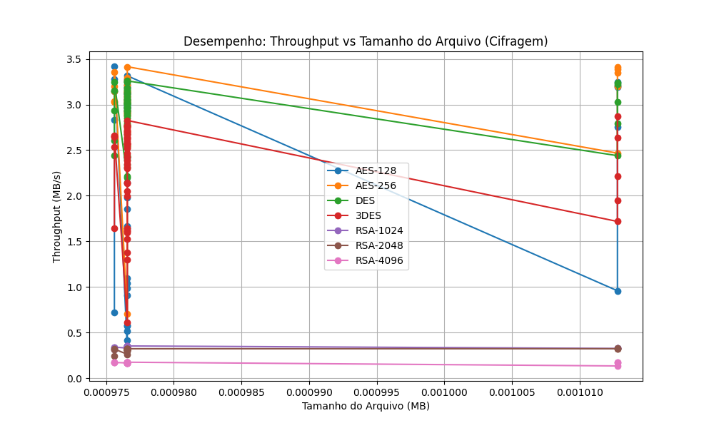

# Relatório de Testes de Criptografia

**Data da Execução:** 12/04/2026 14:48:24

## 1. Tabela de Desempenho

| Arquivo | Alg | Modo | Tam (MB) | T. Cifrar (s) | T. Decifrar (s) | Throughput Cif. (MB/s) | Throughput Dec. (MB/s) | Entropia | Padrões |
|---------|-----|------|----------|---------------|-----------------|------------------------|------------------------|----------|---------|
| csv_categorico_1KB.csv | AES-128 | ECB | 0.0010 | 0.0023 | 0.0008 | 0.4158 | 1.1631 | 7.7900 | ✅ Não |
| csv_categorico_1KB.csv | AES-128 | CBC | 0.0010 | 0.0006 | 0.0010 | 1.6439 | 0.9593 | 7.8452 | ✅ Não |
| csv_categorico_1KB.csv | AES-128 | CFB | 0.0010 | 0.0006 | 0.0009 | 1.6678 | 1.0790 | 7.8371 | ✅ Não |
| csv_categorico_1KB.csv | AES-128 | OFB | 0.0010 | 0.0005 | 0.0009 | 1.8569 | 1.0871 | 7.8084 | ✅ Não |
| csv_categorico_1KB.csv | AES-128 | CTR | 0.0010 | 0.0019 | 0.0010 | 0.5193 | 0.9915 | 7.8103 | ✅ Não |
| csv_categorico_1KB.csv | AES-256 | ECB | 0.0010 | 0.0014 | 0.0009 | 0.7081 | 1.0936 | 7.8086 | ✅ Não |
| csv_categorico_1KB.csv | AES-256 | CBC | 0.0010 | 0.0003 | 0.0009 | 2.9083 | 1.0624 | 7.7937 | ✅ Não |
| csv_categorico_1KB.csv | AES-256 | CFB | 0.0010 | 0.0003 | 0.0009 | 3.0144 | 1.0873 | 7.8342 | ✅ Não |
| csv_categorico_1KB.csv | AES-256 | OFB | 0.0010 | 0.0003 | 0.0009 | 3.0494 | 1.0860 | 7.7994 | ✅ Não |
| csv_categorico_1KB.csv | AES-256 | CTR | 0.0010 | 0.0004 | 0.0010 | 2.5488 | 1.0096 | 7.8177 | ✅ Não |
| csv_categorico_1KB.csv | DES | ECB | 0.0010 | 0.0004 | 0.0009 | 2.2112 | 1.0663 | 7.7587 | ✅ Não |
| csv_categorico_1KB.csv | DES | CBC | 0.0010 | 0.0003 | 0.0010 | 3.1260 | 0.9650 | 7.8000 | ✅ Não |
| csv_categorico_1KB.csv | DES | CFB | 0.0010 | 0.0004 | 0.0010 | 2.5468 | 1.0018 | 7.7906 | ✅ Não |
| csv_categorico_1KB.csv | DES | OFB | 0.0010 | 0.0003 | 0.0009 | 3.0654 | 1.0920 | 7.8230 | ✅ Não |
| csv_categorico_1KB.csv | DES | CTR | 0.0010 | 0.0003 | 0.0009 | 3.0336 | 1.1377 | 7.8133 | ✅ Não |
| csv_categorico_1KB.csv | 3DES | ECB | 0.0010 | 0.0005 | 0.0009 | 1.9991 | 1.0316 | 7.7921 | ✅ Não |
| csv_categorico_1KB.csv | 3DES | CBC | 0.0010 | 0.0004 | 0.0010 | 2.6833 | 1.0000 | 7.8323 | ✅ Não |
| csv_categorico_1KB.csv | 3DES | CFB | 0.0010 | 0.0016 | 0.0018 | 0.6141 | 0.5506 | 7.8010 | ✅ Não |
| csv_categorico_1KB.csv | 3DES | OFB | 0.0010 | 0.0004 | 0.0010 | 2.7540 | 0.9637 | 7.8217 | ✅ Não |
| csv_categorico_1KB.csv | 3DES | CTR | 0.0010 | 0.0004 | 0.0009 | 2.7446 | 1.0414 | 7.8106 | ✅ Não |
| csv_categorico_1KB.csv | RSA-1024 | ECB | 0.0010 | 0.0029 | 0.0113 | 0.3418 | 0.0866 | 7.8809 | ✅ Não |
| csv_categorico_1KB.csv | RSA-1024 | CBC | 0.0010 | 0.0029 | 0.0130 | 0.3394 | 0.0753 | 7.8976 | ✅ Não |
| csv_categorico_1KB.csv | RSA-1024 | CTR | 0.0010 | 0.0029 | 0.0038 | 0.3341 | 0.2562 | 7.7879 | ✅ Não |
| csv_categorico_1KB.csv | RSA-2048 | ECB | 0.0010 | 0.0037 | 0.0172 | 0.2611 | 0.0567 | 7.8818 | ✅ Não |
| csv_categorico_1KB.csv | RSA-2048 | CBC | 0.0010 | 0.0031 | 0.0169 | 0.3149 | 0.0577 | 7.8680 | ✅ Não |
| csv_categorico_1KB.csv | RSA-2048 | CTR | 0.0010 | 0.0031 | 0.0040 | 0.3140 | 0.2449 | 7.8352 | ✅ Não |
| csv_categorico_1KB.csv | RSA-4096 | ECB | 0.0010 | 0.0057 | 0.0521 | 0.1726 | 0.0187 | 7.8638 | ✅ Não |
| csv_categorico_1KB.csv | RSA-4096 | CBC | 0.0010 | 0.0059 | 0.0512 | 0.1668 | 0.0191 | 7.9059 | ✅ Não |
| csv_categorico_1KB.csv | RSA-4096 | CTR | 0.0010 | 0.0057 | 0.0076 | 0.1710 | 0.1282 | 7.7914 | ✅ Não |
| csv_incremental_1KB.csv | AES-128 | ECB | 0.0010 | 0.0017 | 0.0010 | 0.5734 | 0.9418 | 7.6272 | ✅ Não |
| csv_incremental_1KB.csv | AES-128 | CBC | 0.0010 | 0.0005 | 0.0013 | 1.9771 | 0.7528 | 7.8195 | ✅ Não |
| csv_incremental_1KB.csv | AES-128 | CFB | 0.0010 | 0.0005 | 0.0012 | 2.1477 | 0.7967 | 7.7613 | ✅ Não |
| csv_incremental_1KB.csv | AES-128 | OFB | 0.0010 | 0.0004 | 0.0009 | 2.4167 | 1.0280 | 7.7951 | ✅ Não |
| csv_incremental_1KB.csv | AES-128 | CTR | 0.0010 | 0.0003 | 0.0014 | 3.0816 | 0.7158 | 7.8270 | ✅ Não |
| csv_incremental_1KB.csv | AES-256 | ECB | 0.0010 | 0.0004 | 0.0009 | 2.6785 | 1.0651 | 7.6181 | ✅ Não |
| csv_incremental_1KB.csv | AES-256 | CBC | 0.0010 | 0.0003 | 0.0009 | 3.0874 | 1.0559 | 7.8237 | ✅ Não |
| csv_incremental_1KB.csv | AES-256 | CFB | 0.0010 | 0.0003 | 0.0011 | 2.8992 | 0.8878 | 7.7807 | ✅ Não |
| csv_incremental_1KB.csv | AES-256 | OFB | 0.0010 | 0.0003 | 0.0011 | 3.1486 | 0.8594 | 7.8186 | ✅ Não |
| csv_incremental_1KB.csv | AES-256 | CTR | 0.0010 | 0.0003 | 0.0009 | 3.1270 | 1.0556 | 7.8248 | ✅ Não |
| csv_incremental_1KB.csv | DES | ECB | 0.0010 | 0.0003 | 0.0009 | 3.1873 | 1.0368 | 7.1525 | ✅ Não |
| csv_incremental_1KB.csv | DES | CBC | 0.0010 | 0.0003 | 0.0009 | 2.9272 | 1.0917 | 7.7989 | ✅ Não |
| csv_incremental_1KB.csv | DES | CFB | 0.0010 | 0.0004 | 0.0009 | 2.3110 | 1.0445 | 7.8290 | ✅ Não |
| csv_incremental_1KB.csv | DES | OFB | 0.0010 | 0.0003 | 0.0009 | 2.9472 | 1.1229 | 7.7900 | ✅ Não |
| csv_incremental_1KB.csv | DES | CTR | 0.0010 | 0.0003 | 0.0010 | 3.1122 | 0.9964 | 7.8343 | ✅ Não |
| csv_incremental_1KB.csv | 3DES | ECB | 0.0010 | 0.0003 | 0.0009 | 2.8256 | 1.0460 | 7.2034 | ✅ Não |
| csv_incremental_1KB.csv | 3DES | CBC | 0.0010 | 0.0004 | 0.0011 | 2.6241 | 0.9177 | 7.8111 | ✅ Não |
| csv_incremental_1KB.csv | 3DES | CFB | 0.0010 | 0.0008 | 0.0013 | 1.3015 | 0.7483 | 7.8343 | ✅ Não |
| csv_incremental_1KB.csv | 3DES | OFB | 0.0010 | 0.0005 | 0.0011 | 2.1469 | 0.8814 | 7.8002 | ✅ Não |
| csv_incremental_1KB.csv | 3DES | CTR | 0.0010 | 0.0004 | 0.0010 | 2.5738 | 0.9344 | 7.8110 | ✅ Não |
| csv_incremental_1KB.csv | RSA-1024 | ECB | 0.0010 | 0.0028 | 0.0113 | 0.3504 | 0.0865 | 7.8748 | ✅ Não |
| csv_incremental_1KB.csv | RSA-1024 | CBC | 0.0010 | 0.0029 | 0.0113 | 0.3411 | 0.0861 | 7.8983 | ✅ Não |
| csv_incremental_1KB.csv | RSA-1024 | CTR | 0.0010 | 0.0029 | 0.0038 | 0.3377 | 0.2590 | 7.7867 | ✅ Não |
| csv_incremental_1KB.csv | RSA-2048 | ECB | 0.0010 | 0.0031 | 0.0170 | 0.3196 | 0.0576 | 7.8531 | ✅ Não |
| csv_incremental_1KB.csv | RSA-2048 | CBC | 0.0010 | 0.0031 | 0.0180 | 0.3118 | 0.0542 | 7.8947 | ✅ Não |
| csv_incremental_1KB.csv | RSA-2048 | CTR | 0.0010 | 0.0031 | 0.0038 | 0.3118 | 0.2566 | 7.7808 | ✅ Não |
| csv_incremental_1KB.csv | RSA-4096 | ECB | 0.0010 | 0.0057 | 0.0518 | 0.1708 | 0.0188 | 7.8624 | ✅ Não |
| csv_incremental_1KB.csv | RSA-4096 | CBC | 0.0010 | 0.0058 | 0.0517 | 0.1682 | 0.0189 | 7.9160 | ✅ Não |
| csv_incremental_1KB.csv | RSA-4096 | CTR | 0.0010 | 0.0058 | 0.0064 | 0.1681 | 0.1516 | 7.8345 | ✅ Não |
| csv_realista_1KB.csv | AES-128 | ECB | 0.0010 | 0.0010 | 0.0008 | 0.9898 | 1.1492 | 7.8130 | ✅ Não |
| csv_realista_1KB.csv | AES-128 | CBC | 0.0010 | 0.0003 | 0.0009 | 3.1231 | 1.0728 | 7.8096 | ✅ Não |
| csv_realista_1KB.csv | AES-128 | CFB | 0.0010 | 0.0004 | 0.0011 | 2.6769 | 0.8954 | 7.7948 | ✅ Não |
| csv_realista_1KB.csv | AES-128 | OFB | 0.0010 | 0.0003 | 0.0010 | 3.2536 | 0.9447 | 7.8035 | ✅ Não |
| csv_realista_1KB.csv | AES-128 | CTR | 0.0010 | 0.0003 | 0.0009 | 3.1141 | 1.0479 | 7.8162 | ✅ Não |
| csv_realista_1KB.csv | AES-256 | ECB | 0.0010 | 0.0003 | 0.0008 | 3.2449 | 1.1745 | 7.8130 | ✅ Não |
| csv_realista_1KB.csv | AES-256 | CBC | 0.0010 | 0.0003 | 0.0008 | 2.9320 | 1.1626 | 7.8041 | ✅ Não |
| csv_realista_1KB.csv | AES-256 | CFB | 0.0010 | 0.0003 | 0.0009 | 3.0846 | 1.0512 | 7.8042 | ✅ Não |
| csv_realista_1KB.csv | AES-256 | OFB | 0.0010 | 0.0003 | 0.0010 | 3.1811 | 1.0182 | 7.8001 | ✅ Não |
| csv_realista_1KB.csv | AES-256 | CTR | 0.0010 | 0.0003 | 0.0008 | 3.2913 | 1.2108 | 7.7881 | ✅ Não |
| csv_realista_1KB.csv | DES | ECB | 0.0010 | 0.0003 | 0.0009 | 3.2598 | 1.0940 | 7.8293 | ✅ Não |
| csv_realista_1KB.csv | DES | CBC | 0.0010 | 0.0003 | 0.0009 | 3.1720 | 1.0613 | 7.8064 | ✅ Não |
| csv_realista_1KB.csv | DES | CFB | 0.0010 | 0.0004 | 0.0012 | 2.4258 | 0.8243 | 7.8386 | ✅ Não |
| csv_realista_1KB.csv | DES | OFB | 0.0010 | 0.0003 | 0.0008 | 3.0071 | 1.1647 | 7.8229 | ✅ Não |
| csv_realista_1KB.csv | DES | CTR | 0.0010 | 0.0003 | 0.0008 | 2.8766 | 1.1501 | 7.8027 | ✅ Não |
| csv_realista_1KB.csv | 3DES | ECB | 0.0010 | 0.0004 | 0.0010 | 2.3181 | 0.9550 | 7.7893 | ✅ Não |
| csv_realista_1KB.csv | 3DES | CBC | 0.0010 | 0.0004 | 0.0011 | 2.4639 | 0.8705 | 7.8463 | ✅ Não |
| csv_realista_1KB.csv | 3DES | CFB | 0.0010 | 0.0006 | 0.0012 | 1.5270 | 0.8489 | 7.8010 | ✅ Não |
| csv_realista_1KB.csv | 3DES | OFB | 0.0010 | 0.0004 | 0.0010 | 2.5733 | 1.0170 | 7.7741 | ✅ Não |
| csv_realista_1KB.csv | 3DES | CTR | 0.0010 | 0.0004 | 0.0010 | 2.6295 | 0.9332 | 7.7899 | ✅ Não |
| csv_realista_1KB.csv | RSA-1024 | ECB | 0.0010 | 0.0028 | 0.0111 | 0.3527 | 0.0881 | 7.8638 | ✅ Não |
| csv_realista_1KB.csv | RSA-1024 | CBC | 0.0010 | 0.0028 | 0.0112 | 0.3444 | 0.0874 | 7.8777 | ✅ Não |
| csv_realista_1KB.csv | RSA-1024 | CTR | 0.0010 | 0.0028 | 0.0037 | 0.3428 | 0.2659 | 7.8109 | ✅ Não |
| csv_realista_1KB.csv | RSA-2048 | ECB | 0.0010 | 0.0030 | 0.0170 | 0.3220 | 0.0576 | 7.8451 | ✅ Não |
| csv_realista_1KB.csv | RSA-2048 | CBC | 0.0010 | 0.0031 | 0.0169 | 0.3152 | 0.0577 | 7.8795 | ✅ Não |
| csv_realista_1KB.csv | RSA-2048 | CTR | 0.0010 | 0.0031 | 0.0038 | 0.3166 | 0.2544 | 7.8268 | ✅ Não |
| csv_realista_1KB.csv | RSA-4096 | ECB | 0.0010 | 0.0057 | 0.0511 | 0.1723 | 0.0191 | 7.8725 | ✅ Não |
| csv_realista_1KB.csv | RSA-4096 | CBC | 0.0010 | 0.0057 | 0.0512 | 0.1707 | 0.0191 | 7.9127 | ✅ Não |
| csv_realista_1KB.csv | RSA-4096 | CTR | 0.0010 | 0.0057 | 0.0065 | 0.1699 | 0.1506 | 7.8147 | ✅ Não |
| csv_repetitivo_1KB.csv | AES-128 | ECB | 0.0010 | 0.0017 | 0.0008 | 0.5823 | 1.1600 | 6.8821 | ⚠️ Sim |
| csv_repetitivo_1KB.csv | AES-128 | CBC | 0.0010 | 0.0003 | 0.0010 | 3.1816 | 1.0255 | 7.8311 | ✅ Não |
| csv_repetitivo_1KB.csv | AES-128 | CFB | 0.0010 | 0.0003 | 0.0010 | 3.0590 | 0.9984 | 7.8290 | ✅ Não |
| csv_repetitivo_1KB.csv | AES-128 | OFB | 0.0010 | 0.0003 | 0.0008 | 3.0506 | 1.1559 | 7.8263 | ✅ Não |
| csv_repetitivo_1KB.csv | AES-128 | CTR | 0.0010 | 0.0003 | 0.0011 | 2.9205 | 0.8531 | 7.8013 | ✅ Não |
| csv_repetitivo_1KB.csv | AES-256 | ECB | 0.0010 | 0.0003 | 0.0009 | 2.9677 | 1.1214 | 7.1147 | ✅ Não |
| csv_repetitivo_1KB.csv | AES-256 | CBC | 0.0010 | 0.0003 | 0.0010 | 3.2088 | 0.9986 | 7.8126 | ✅ Não |
| csv_repetitivo_1KB.csv | AES-256 | CFB | 0.0010 | 0.0003 | 0.0009 | 2.8770 | 1.1017 | 7.8334 | ✅ Não |
| csv_repetitivo_1KB.csv | AES-256 | OFB | 0.0010 | 0.0003 | 0.0010 | 3.2695 | 0.9594 | 7.7917 | ✅ Não |
| csv_repetitivo_1KB.csv | AES-256 | CTR | 0.0010 | 0.0003 | 0.0009 | 3.1351 | 1.1107 | 7.8136 | ✅ Não |
| csv_repetitivo_1KB.csv | DES | ECB | 0.0010 | 0.0003 | 0.0009 | 2.8931 | 1.1343 | 6.1808 | ⚠️ Sim |
| csv_repetitivo_1KB.csv | DES | CBC | 0.0010 | 0.0003 | 0.0009 | 3.1452 | 1.1228 | 7.8225 | ✅ Não |
| csv_repetitivo_1KB.csv | DES | CFB | 0.0010 | 0.0004 | 0.0009 | 2.1964 | 1.0671 | 7.8093 | ✅ Não |
| csv_repetitivo_1KB.csv | DES | OFB | 0.0010 | 0.0003 | 0.0008 | 3.2467 | 1.1621 | 7.7948 | ✅ Não |
| csv_repetitivo_1KB.csv | DES | CTR | 0.0010 | 0.0003 | 0.0030 | 3.1629 | 0.3268 | 7.7869 | ✅ Não |
| csv_repetitivo_1KB.csv | 3DES | ECB | 0.0010 | 0.0004 | 0.0011 | 2.5282 | 0.8824 | 6.0810 | ⚠️ Sim |
| csv_repetitivo_1KB.csv | 3DES | CBC | 0.0010 | 0.0004 | 0.0011 | 2.7011 | 0.8629 | 7.8028 | ✅ Não |
| csv_repetitivo_1KB.csv | 3DES | CFB | 0.0010 | 0.0006 | 0.0012 | 1.5939 | 0.8347 | 7.8333 | ✅ Não |
| csv_repetitivo_1KB.csv | 3DES | OFB | 0.0010 | 0.0004 | 0.0010 | 2.3856 | 0.9501 | 7.8063 | ✅ Não |
| csv_repetitivo_1KB.csv | 3DES | CTR | 0.0010 | 0.0004 | 0.0013 | 2.3461 | 0.7628 | 7.7903 | ✅ Não |
| csv_repetitivo_1KB.csv | RSA-1024 | ECB | 0.0010 | 0.0028 | 0.0114 | 0.3427 | 0.0859 | 7.8878 | ✅ Não |
| csv_repetitivo_1KB.csv | RSA-1024 | CBC | 0.0010 | 0.0029 | 0.0114 | 0.3341 | 0.0855 | 7.9081 | ✅ Não |
| csv_repetitivo_1KB.csv | RSA-1024 | CTR | 0.0010 | 0.0030 | 0.0036 | 0.3294 | 0.2717 | 7.8132 | ✅ Não |
| csv_repetitivo_1KB.csv | RSA-2048 | ECB | 0.0010 | 0.0033 | 0.0172 | 0.2971 | 0.0568 | 7.8522 | ✅ Não |
| csv_repetitivo_1KB.csv | RSA-2048 | CBC | 0.0010 | 0.0031 | 0.0194 | 0.3131 | 0.0504 | 7.8748 | ✅ Não |
| csv_repetitivo_1KB.csv | RSA-2048 | CTR | 0.0010 | 0.0031 | 0.0039 | 0.3101 | 0.2492 | 7.8286 | ✅ Não |
| csv_repetitivo_1KB.csv | RSA-4096 | ECB | 0.0010 | 0.0056 | 0.0511 | 0.1743 | 0.0191 | 7.8743 | ✅ Não |
| csv_repetitivo_1KB.csv | RSA-4096 | CBC | 0.0010 | 0.0057 | 0.0511 | 0.1715 | 0.0191 | 7.9039 | ✅ Não |
| csv_repetitivo_1KB.csv | RSA-4096 | CTR | 0.0010 | 0.0057 | 0.0064 | 0.1727 | 0.1527 | 7.8065 | ✅ Não |
| dados_aninhados_1KB.json | AES-128 | ECB | 0.0010 | 0.0014 | 0.0009 | 0.7225 | 1.1199 | 7.8161 | ✅ Não |
| dados_aninhados_1KB.json | AES-128 | CBC | 0.0010 | 0.0003 | 0.0009 | 3.4191 | 1.1348 | 7.8102 | ✅ Não |
| dados_aninhados_1KB.json | AES-128 | CFB | 0.0010 | 0.0003 | 0.0009 | 3.1489 | 1.0941 | 7.8323 | ✅ Não |
| dados_aninhados_1KB.json | AES-128 | OFB | 0.0010 | 0.0003 | 0.0009 | 2.8322 | 1.0822 | 7.7903 | ✅ Não |
| dados_aninhados_1KB.json | AES-128 | CTR | 0.0010 | 0.0003 | 0.0010 | 3.2765 | 1.0251 | 7.8357 | ✅ Não |
| dados_aninhados_1KB.json | AES-256 | ECB | 0.0010 | 0.0003 | 0.0008 | 3.1969 | 1.1952 | 7.8078 | ✅ Não |
| dados_aninhados_1KB.json | AES-256 | CBC | 0.0010 | 0.0003 | 0.0008 | 3.0370 | 1.1588 | 7.7932 | ✅ Não |
| dados_aninhados_1KB.json | AES-256 | CFB | 0.0010 | 0.0003 | 0.0010 | 3.0271 | 1.0027 | 7.8215 | ✅ Não |
| dados_aninhados_1KB.json | AES-256 | OFB | 0.0010 | 0.0003 | 0.0009 | 3.3571 | 1.0847 | 7.8466 | ✅ Não |
| dados_aninhados_1KB.json | AES-256 | CTR | 0.0010 | 0.0003 | 0.0010 | 3.1467 | 0.9843 | 7.8040 | ✅ Não |
| dados_aninhados_1KB.json | DES | ECB | 0.0010 | 0.0003 | 0.0008 | 3.2440 | 1.2047 | 7.8242 | ✅ Não |
| dados_aninhados_1KB.json | DES | CBC | 0.0010 | 0.0004 | 0.0009 | 2.6094 | 1.0880 | 7.8112 | ✅ Não |
| dados_aninhados_1KB.json | DES | CFB | 0.0010 | 0.0004 | 0.0009 | 2.4388 | 1.0365 | 7.8062 | ✅ Não |
| dados_aninhados_1KB.json | DES | OFB | 0.0010 | 0.0003 | 0.0009 | 3.1494 | 1.1301 | 7.7947 | ✅ Não |
| dados_aninhados_1KB.json | DES | CTR | 0.0010 | 0.0003 | 0.0008 | 2.9356 | 1.1891 | 7.8164 | ✅ Não |
| dados_aninhados_1KB.json | 3DES | ECB | 0.0010 | 0.0004 | 0.0009 | 2.6419 | 1.0724 | 7.8314 | ✅ Não |
| dados_aninhados_1KB.json | 3DES | CBC | 0.0010 | 0.0004 | 0.0010 | 2.6606 | 1.0111 | 7.7919 | ✅ Não |
| dados_aninhados_1KB.json | 3DES | CFB | 0.0010 | 0.0006 | 0.0012 | 1.6445 | 0.8026 | 7.7859 | ✅ Não |
| dados_aninhados_1KB.json | 3DES | OFB | 0.0010 | 0.0004 | 0.0010 | 2.6530 | 0.9962 | 7.7879 | ✅ Não |
| dados_aninhados_1KB.json | 3DES | CTR | 0.0010 | 0.0004 | 0.0011 | 2.5363 | 0.9224 | 7.8231 | ✅ Não |
| dados_aninhados_1KB.json | RSA-1024 | ECB | 0.0010 | 0.0032 | 0.0114 | 0.3096 | 0.0858 | 7.8452 | ✅ Não |
| dados_aninhados_1KB.json | RSA-1024 | CBC | 0.0010 | 0.0029 | 0.0113 | 0.3400 | 0.0866 | 7.8842 | ✅ Não |
| dados_aninhados_1KB.json | RSA-1024 | CTR | 0.0010 | 0.0029 | 0.0036 | 0.3402 | 0.2730 | 7.7908 | ✅ Não |
| dados_aninhados_1KB.json | RSA-2048 | ECB | 0.0010 | 0.0031 | 0.0172 | 0.3186 | 0.0567 | 7.8493 | ✅ Não |
| dados_aninhados_1KB.json | RSA-2048 | CBC | 0.0010 | 0.0040 | 0.0177 | 0.2464 | 0.0552 | 7.8627 | ✅ Não |
| dados_aninhados_1KB.json | RSA-2048 | CTR | 0.0010 | 0.0031 | 0.0038 | 0.3101 | 0.2571 | 7.8066 | ✅ Não |
| dados_aninhados_1KB.json | RSA-4096 | ECB | 0.0010 | 0.0057 | 0.0514 | 0.1722 | 0.0190 | 7.8547 | ✅ Não |
| dados_aninhados_1KB.json | RSA-4096 | CBC | 0.0010 | 0.0057 | 0.0512 | 0.1706 | 0.0191 | 7.9099 | ✅ Não |
| dados_aninhados_1KB.json | RSA-4096 | CTR | 0.0010 | 0.0057 | 0.0064 | 0.1709 | 0.1533 | 7.7702 | ✅ Não |
| dados_aninhados_1KB.xml | AES-128 | ECB | 0.0010 | 0.0009 | 0.0021 | 1.0428 | 0.4616 | 7.8010 | ✅ Não |
| dados_aninhados_1KB.xml | AES-128 | CBC | 0.0010 | 0.0003 | 0.0010 | 3.1241 | 0.9987 | 7.7758 | ✅ Não |
| dados_aninhados_1KB.xml | AES-128 | CFB | 0.0010 | 0.0003 | 0.0009 | 2.9724 | 1.0592 | 7.8075 | ✅ Não |
| dados_aninhados_1KB.xml | AES-128 | OFB | 0.0010 | 0.0003 | 0.0009 | 3.1925 | 1.1274 | 7.8268 | ✅ Não |
| dados_aninhados_1KB.xml | AES-128 | CTR | 0.0010 | 0.0003 | 0.0008 | 3.2141 | 1.1561 | 7.8185 | ✅ Não |
| dados_aninhados_1KB.xml | AES-256 | ECB | 0.0010 | 0.0004 | 0.0010 | 2.6986 | 1.0267 | 7.7911 | ✅ Não |
| dados_aninhados_1KB.xml | AES-256 | CBC | 0.0010 | 0.0003 | 0.0009 | 3.1539 | 1.0458 | 7.8325 | ✅ Não |
| dados_aninhados_1KB.xml | AES-256 | CFB | 0.0010 | 0.0003 | 0.0010 | 2.9335 | 1.0113 | 7.8271 | ✅ Não |
| dados_aninhados_1KB.xml | AES-256 | OFB | 0.0010 | 0.0004 | 0.0010 | 2.7592 | 1.0262 | 7.8386 | ✅ Não |
| dados_aninhados_1KB.xml | AES-256 | CTR | 0.0010 | 0.0003 | 0.0008 | 2.8788 | 1.1802 | 7.8209 | ✅ Não |
| dados_aninhados_1KB.xml | DES | ECB | 0.0010 | 0.0003 | 0.0010 | 3.0874 | 0.9814 | 7.7593 | ✅ Não |
| dados_aninhados_1KB.xml | DES | CBC | 0.0010 | 0.0003 | 0.0009 | 3.0233 | 1.0978 | 7.8081 | ✅ Não |
| dados_aninhados_1KB.xml | DES | CFB | 0.0010 | 0.0004 | 0.0010 | 2.4446 | 1.0146 | 7.7990 | ✅ Não |
| dados_aninhados_1KB.xml | DES | OFB | 0.0010 | 0.0003 | 0.0009 | 2.9737 | 1.1040 | 7.8096 | ✅ Não |
| dados_aninhados_1KB.xml | DES | CTR | 0.0010 | 0.0004 | 0.0009 | 2.7708 | 1.0330 | 7.8216 | ✅ Não |
| dados_aninhados_1KB.xml | 3DES | ECB | 0.0010 | 0.0004 | 0.0010 | 2.5709 | 0.9537 | 7.7859 | ✅ Não |
| dados_aninhados_1KB.xml | 3DES | CBC | 0.0010 | 0.0004 | 0.0010 | 2.5167 | 0.9794 | 7.8217 | ✅ Não |
| dados_aninhados_1KB.xml | 3DES | CFB | 0.0010 | 0.0006 | 0.0012 | 1.6450 | 0.8429 | 7.8163 | ✅ Não |
| dados_aninhados_1KB.xml | 3DES | OFB | 0.0010 | 0.0004 | 0.0009 | 2.6390 | 1.0726 | 7.8068 | ✅ Não |
| dados_aninhados_1KB.xml | 3DES | CTR | 0.0010 | 0.0004 | 0.0010 | 2.4287 | 1.0191 | 7.8203 | ✅ Não |
| dados_aninhados_1KB.xml | RSA-1024 | ECB | 0.0010 | 0.0028 | 0.0112 | 0.3495 | 0.0874 | 7.8604 | ✅ Não |
| dados_aninhados_1KB.xml | RSA-1024 | CBC | 0.0010 | 0.0029 | 0.0114 | 0.3416 | 0.0859 | 7.8692 | ✅ Não |
| dados_aninhados_1KB.xml | RSA-1024 | CTR | 0.0010 | 0.0029 | 0.0037 | 0.3393 | 0.2631 | 7.8149 | ✅ Não |
| dados_aninhados_1KB.xml | RSA-2048 | ECB | 0.0010 | 0.0030 | 0.0168 | 0.3213 | 0.0582 | 7.8705 | ✅ Não |
| dados_aninhados_1KB.xml | RSA-2048 | CBC | 0.0010 | 0.0031 | 0.0172 | 0.3160 | 0.0569 | 7.8888 | ✅ Não |
| dados_aninhados_1KB.xml | RSA-2048 | CTR | 0.0010 | 0.0031 | 0.0067 | 0.3140 | 0.1455 | 7.8016 | ✅ Não |
| dados_aninhados_1KB.xml | RSA-4096 | ECB | 0.0010 | 0.0058 | 0.0528 | 0.1677 | 0.0185 | 7.8916 | ✅ Não |
| dados_aninhados_1KB.xml | RSA-4096 | CBC | 0.0010 | 0.0059 | 0.0517 | 0.1662 | 0.0189 | 7.9077 | ✅ Não |
| dados_aninhados_1KB.xml | RSA-4096 | CTR | 0.0010 | 0.0059 | 0.0065 | 0.1664 | 0.1492 | 7.8116 | ✅ Não |
| imagem_padrao_1KB.bmp | AES-128 | ECB | 0.0010 | 0.0011 | 0.0009 | 0.9579 | 1.1817 | 6.4685 | ⚠️ Sim |
| imagem_padrao_1KB.bmp | AES-128 | CBC | 0.0010 | 0.0003 | 0.0009 | 3.2068 | 1.1181 | 7.8178 | ✅ Não |
| imagem_padrao_1KB.bmp | AES-128 | CFB | 0.0010 | 0.0004 | 0.0009 | 2.7558 | 1.1446 | 7.8282 | ✅ Não |
| imagem_padrao_1KB.bmp | AES-128 | OFB | 0.0010 | 0.0003 | 0.0028 | 3.2504 | 0.3625 | 7.7979 | ✅ Não |
| imagem_padrao_1KB.bmp | AES-128 | CTR | 0.0010 | 0.0003 | 0.0009 | 3.1918 | 1.1266 | 7.8303 | ✅ Não |
| imagem_padrao_1KB.bmp | AES-256 | ECB | 0.0010 | 0.0003 | 0.0009 | 3.3502 | 1.1122 | 6.5577 | ⚠️ Sim |
| imagem_padrao_1KB.bmp | AES-256 | CBC | 0.0010 | 0.0003 | 0.0008 | 3.2002 | 1.2004 | 7.8363 | ✅ Não |
| imagem_padrao_1KB.bmp | AES-256 | CFB | 0.0010 | 0.0004 | 0.0009 | 2.4672 | 1.1076 | 7.8316 | ✅ Não |
| imagem_padrao_1KB.bmp | AES-256 | OFB | 0.0010 | 0.0003 | 0.0009 | 3.3862 | 1.1251 | 7.8068 | ✅ Não |
| imagem_padrao_1KB.bmp | AES-256 | CTR | 0.0010 | 0.0003 | 0.0008 | 3.4140 | 1.3096 | 7.8082 | ✅ Não |
| imagem_padrao_1KB.bmp | DES | ECB | 0.0010 | 0.0004 | 0.0010 | 2.7935 | 0.9822 | 5.3296 | ⚠️ Sim |
| imagem_padrao_1KB.bmp | DES | CBC | 0.0010 | 0.0003 | 0.0010 | 3.0254 | 1.0629 | 7.8130 | ✅ Não |
| imagem_padrao_1KB.bmp | DES | CFB | 0.0010 | 0.0004 | 0.0010 | 2.4397 | 0.9884 | 7.8261 | ✅ Não |
| imagem_padrao_1KB.bmp | DES | OFB | 0.0010 | 0.0003 | 0.0012 | 3.2356 | 0.8630 | 7.8195 | ✅ Não |
| imagem_padrao_1KB.bmp | DES | CTR | 0.0010 | 0.0003 | 0.0009 | 3.2226 | 1.1095 | 7.8184 | ✅ Não |
| imagem_padrao_1KB.bmp | 3DES | ECB | 0.0010 | 0.0004 | 0.0010 | 2.8699 | 1.0509 | 4.9718 | ⚠️ Sim |
| imagem_padrao_1KB.bmp | 3DES | CBC | 0.0010 | 0.0004 | 0.0009 | 2.6393 | 1.1231 | 7.8078 | ✅ Não |
| imagem_padrao_1KB.bmp | 3DES | CFB | 0.0010 | 0.0006 | 0.0012 | 1.7181 | 0.8365 | 7.8366 | ✅ Não |
| imagem_padrao_1KB.bmp | 3DES | OFB | 0.0010 | 0.0005 | 0.0011 | 2.2142 | 0.9223 | 7.8129 | ✅ Não |
| imagem_padrao_1KB.bmp | 3DES | CTR | 0.0010 | 0.0005 | 0.0010 | 1.9490 | 0.9660 | 7.8045 | ✅ Não |
| imagem_padrao_1KB.bmp | RSA-1024 | ECB | 0.0010 | 0.0031 | 0.0127 | 0.3252 | 0.0799 | 7.8904 | ✅ Não |
| imagem_padrao_1KB.bmp | RSA-1024 | CBC | 0.0010 | 0.0031 | 0.0122 | 0.3281 | 0.0827 | 7.9023 | ✅ Não |
| imagem_padrao_1KB.bmp | RSA-1024 | CTR | 0.0010 | 0.0031 | 0.0037 | 0.3259 | 0.2708 | 7.8114 | ✅ Não |
| imagem_padrao_1KB.bmp | RSA-2048 | ECB | 0.0010 | 0.0031 | 0.0172 | 0.3300 | 0.0589 | 7.8493 | ✅ Não |
| imagem_padrao_1KB.bmp | RSA-2048 | CBC | 0.0010 | 0.0031 | 0.0170 | 0.3225 | 0.0596 | 7.8677 | ✅ Não |
| imagem_padrao_1KB.bmp | RSA-2048 | CTR | 0.0010 | 0.0031 | 0.0040 | 0.3226 | 0.2549 | 7.8217 | ✅ Não |
| imagem_padrao_1KB.bmp | RSA-4096 | ECB | 0.0010 | 0.0058 | 0.0516 | 0.1736 | 0.0196 | 7.8692 | ✅ Não |
| imagem_padrao_1KB.bmp | RSA-4096 | CBC | 0.0010 | 0.0076 | 0.0523 | 0.1335 | 0.0194 | 7.9033 | ✅ Não |
| imagem_padrao_1KB.bmp | RSA-4096 | CTR | 0.0010 | 0.0059 | 0.0066 | 0.1709 | 0.1541 | 7.8175 | ✅ Não |
| texto_aleatorio_1KB.txt | AES-128 | ECB | 0.0010 | 0.0009 | 0.0009 | 1.0926 | 1.0917 | 7.8074 | ✅ Não |
| texto_aleatorio_1KB.txt | AES-128 | CBC | 0.0010 | 0.0003 | 0.0009 | 2.9658 | 1.0980 | 7.8172 | ✅ Não |
| texto_aleatorio_1KB.txt | AES-128 | CFB | 0.0010 | 0.0003 | 0.0009 | 3.0038 | 1.0860 | 7.7813 | ✅ Não |
| texto_aleatorio_1KB.txt | AES-128 | OFB | 0.0010 | 0.0003 | 0.0009 | 3.3153 | 1.1151 | 7.7919 | ✅ Não |
| texto_aleatorio_1KB.txt | AES-128 | CTR | 0.0010 | 0.0003 | 0.0010 | 2.9913 | 0.9875 | 7.7930 | ✅ Não |
| texto_aleatorio_1KB.txt | AES-256 | ECB | 0.0010 | 0.0003 | 0.0008 | 2.8508 | 1.1517 | 7.7720 | ✅ Não |
| texto_aleatorio_1KB.txt | AES-256 | CBC | 0.0010 | 0.0003 | 0.0009 | 3.0981 | 1.1264 | 7.8120 | ✅ Não |
| texto_aleatorio_1KB.txt | AES-256 | CFB | 0.0010 | 0.0003 | 0.0009 | 2.9201 | 1.0885 | 7.8129 | ✅ Não |
| texto_aleatorio_1KB.txt | AES-256 | OFB | 0.0010 | 0.0004 | 0.0009 | 2.7642 | 1.0852 | 7.8519 | ✅ Não |
| texto_aleatorio_1KB.txt | AES-256 | CTR | 0.0010 | 0.0004 | 0.0009 | 2.5417 | 1.0783 | 7.8022 | ✅ Não |
| texto_aleatorio_1KB.txt | DES | ECB | 0.0010 | 0.0003 | 0.0009 | 2.9761 | 1.1191 | 7.7897 | ✅ Não |
| texto_aleatorio_1KB.txt | DES | CBC | 0.0010 | 0.0003 | 0.0012 | 2.9312 | 0.8059 | 7.8051 | ✅ Não |
| texto_aleatorio_1KB.txt | DES | CFB | 0.0010 | 0.0004 | 0.0009 | 2.4268 | 1.0299 | 7.8058 | ✅ Não |
| texto_aleatorio_1KB.txt | DES | OFB | 0.0010 | 0.0003 | 0.0009 | 2.9957 | 1.0968 | 7.8438 | ✅ Não |
| texto_aleatorio_1KB.txt | DES | CTR | 0.0010 | 0.0003 | 0.0009 | 3.0478 | 1.1457 | 7.7841 | ✅ Não |
| texto_aleatorio_1KB.txt | 3DES | ECB | 0.0010 | 0.0004 | 0.0010 | 2.5590 | 1.0120 | 7.8122 | ✅ Não |
| texto_aleatorio_1KB.txt | 3DES | CBC | 0.0010 | 0.0004 | 0.0010 | 2.7709 | 0.9973 | 7.8138 | ✅ Não |
| texto_aleatorio_1KB.txt | 3DES | CFB | 0.0010 | 0.0006 | 0.0013 | 1.6128 | 0.7536 | 7.8169 | ✅ Não |
| texto_aleatorio_1KB.txt | 3DES | OFB | 0.0010 | 0.0004 | 0.0012 | 2.6705 | 0.8262 | 7.8373 | ✅ Não |
| texto_aleatorio_1KB.txt | 3DES | CTR | 0.0010 | 0.0005 | 0.0012 | 2.1390 | 0.8100 | 7.8390 | ✅ Não |
| texto_aleatorio_1KB.txt | RSA-1024 | ECB | 0.0010 | 0.0028 | 0.0113 | 0.3525 | 0.0866 | 7.8824 | ✅ Não |
| texto_aleatorio_1KB.txt | RSA-1024 | CBC | 0.0010 | 0.0028 | 0.0113 | 0.3438 | 0.0862 | 7.8829 | ✅ Não |
| texto_aleatorio_1KB.txt | RSA-1024 | CTR | 0.0010 | 0.0029 | 0.0036 | 0.3412 | 0.2699 | 7.7886 | ✅ Não |
| texto_aleatorio_1KB.txt | RSA-2048 | ECB | 0.0010 | 0.0030 | 0.0171 | 0.3204 | 0.0571 | 7.8605 | ✅ Não |
| texto_aleatorio_1KB.txt | RSA-2048 | CBC | 0.0010 | 0.0031 | 0.0172 | 0.3150 | 0.0567 | 7.8655 | ✅ Não |
| texto_aleatorio_1KB.txt | RSA-2048 | CTR | 0.0010 | 0.0033 | 0.0040 | 0.2996 | 0.2471 | 7.8129 | ✅ Não |
| texto_aleatorio_1KB.txt | RSA-4096 | ECB | 0.0010 | 0.0056 | 0.0510 | 0.1732 | 0.0192 | 7.8814 | ✅ Não |
| texto_aleatorio_1KB.txt | RSA-4096 | CBC | 0.0010 | 0.0057 | 0.0511 | 0.1709 | 0.0191 | 7.9061 | ✅ Não |
| texto_aleatorio_1KB.txt | RSA-4096 | CTR | 0.0010 | 0.0057 | 0.0064 | 0.1720 | 0.1537 | 7.8285 | ✅ Não |
| texto_natural_1KB.txt | AES-128 | ECB | 0.0010 | 0.0011 | 0.0010 | 0.9058 | 0.9534 | 7.8182 | ✅ Não |
| texto_natural_1KB.txt | AES-128 | CBC | 0.0010 | 0.0003 | 0.0009 | 2.9683 | 1.1356 | 7.8022 | ✅ Não |
| texto_natural_1KB.txt | AES-128 | CFB | 0.0010 | 0.0003 | 0.0012 | 2.9642 | 0.8024 | 7.8378 | ✅ Não |
| texto_natural_1KB.txt | AES-128 | OFB | 0.0010 | 0.0003 | 0.0009 | 3.0118 | 1.1222 | 7.8131 | ✅ Não |
| texto_natural_1KB.txt | AES-128 | CTR | 0.0010 | 0.0003 | 0.0010 | 3.2773 | 0.9379 | 7.8082 | ✅ Não |
| texto_natural_1KB.txt | AES-256 | ECB | 0.0010 | 0.0003 | 0.0008 | 3.4150 | 1.1860 | 7.8017 | ✅ Não |
| texto_natural_1KB.txt | AES-256 | CBC | 0.0010 | 0.0003 | 0.0009 | 3.1193 | 1.0501 | 7.8474 | ✅ Não |
| texto_natural_1KB.txt | AES-256 | CFB | 0.0010 | 0.0003 | 0.0009 | 2.9015 | 1.0284 | 7.8133 | ✅ Não |
| texto_natural_1KB.txt | AES-256 | OFB | 0.0010 | 0.0003 | 0.0009 | 3.0314 | 1.0592 | 7.7740 | ✅ Não |
| texto_natural_1KB.txt | AES-256 | CTR | 0.0010 | 0.0003 | 0.0010 | 3.0599 | 0.9662 | 7.8439 | ✅ Não |
| texto_natural_1KB.txt | DES | ECB | 0.0010 | 0.0003 | 0.0009 | 3.0519 | 1.0828 | 7.7382 | ✅ Não |
| texto_natural_1KB.txt | DES | CBC | 0.0010 | 0.0003 | 0.0008 | 2.8134 | 1.1510 | 7.8107 | ✅ Não |
| texto_natural_1KB.txt | DES | CFB | 0.0010 | 0.0004 | 0.0010 | 2.3964 | 0.9892 | 7.7985 | ✅ Não |
| texto_natural_1KB.txt | DES | OFB | 0.0010 | 0.0003 | 0.0008 | 3.0195 | 1.1851 | 7.8015 | ✅ Não |
| texto_natural_1KB.txt | DES | CTR | 0.0010 | 0.0003 | 0.0009 | 3.2444 | 1.1312 | 7.7766 | ✅ Não |
| texto_natural_1KB.txt | 3DES | ECB | 0.0010 | 0.0004 | 0.0009 | 2.7659 | 1.0361 | 7.7790 | ✅ Não |
| texto_natural_1KB.txt | 3DES | CBC | 0.0010 | 0.0004 | 0.0011 | 2.6424 | 0.9075 | 7.8459 | ✅ Não |
| texto_natural_1KB.txt | 3DES | CFB | 0.0010 | 0.0006 | 0.0013 | 1.6193 | 0.7727 | 7.8257 | ✅ Não |
| texto_natural_1KB.txt | 3DES | OFB | 0.0010 | 0.0004 | 0.0009 | 2.5637 | 1.0650 | 7.8019 | ✅ Não |
| texto_natural_1KB.txt | 3DES | CTR | 0.0010 | 0.0004 | 0.0009 | 2.6006 | 1.0460 | 7.8072 | ✅ Não |
| texto_natural_1KB.txt | RSA-1024 | ECB | 0.0010 | 0.0028 | 0.0113 | 0.3442 | 0.0865 | 7.8826 | ✅ Não |
| texto_natural_1KB.txt | RSA-1024 | CBC | 0.0010 | 0.0029 | 0.0122 | 0.3335 | 0.0798 | 7.8678 | ✅ Não |
| texto_natural_1KB.txt | RSA-1024 | CTR | 0.0010 | 0.0029 | 0.0036 | 0.3375 | 0.2692 | 7.8183 | ✅ Não |
| texto_natural_1KB.txt | RSA-2048 | ECB | 0.0010 | 0.0030 | 0.0174 | 0.3219 | 0.0562 | 7.8558 | ✅ Não |
| texto_natural_1KB.txt | RSA-2048 | CBC | 0.0010 | 0.0031 | 0.0174 | 0.3178 | 0.0561 | 7.8687 | ✅ Não |
| texto_natural_1KB.txt | RSA-2048 | CTR | 0.0010 | 0.0031 | 0.0076 | 0.3173 | 0.1280 | 7.7770 | ✅ Não |
| texto_natural_1KB.txt | RSA-4096 | ECB | 0.0010 | 0.0057 | 0.0513 | 0.1702 | 0.0190 | 7.8778 | ✅ Não |
| texto_natural_1KB.txt | RSA-4096 | CBC | 0.0010 | 0.0058 | 0.0525 | 0.1682 | 0.0186 | 7.9068 | ✅ Não |
| texto_natural_1KB.txt | RSA-4096 | CTR | 0.0010 | 0.0058 | 0.0065 | 0.1678 | 0.1510 | 7.8087 | ✅ Não |
| texto_repetitivo_1KB.txt | AES-128 | ECB | 0.0010 | 0.0030 | 0.0009 | 0.3207 | 1.1395 | 6.0589 | ⚠️ Sim |
| texto_repetitivo_1KB.txt | AES-128 | CBC | 0.0010 | 0.0003 | 0.0008 | 3.0332 | 1.1735 | 7.8093 | ✅ Não |
| texto_repetitivo_1KB.txt | AES-128 | CFB | 0.0010 | 0.0003 | 0.0014 | 2.9320 | 0.6969 | 7.8331 | ✅ Não |
| texto_repetitivo_1KB.txt | AES-128 | OFB | 0.0010 | 0.0003 | 0.0008 | 3.1320 | 1.1678 | 7.7966 | ✅ Não |
| texto_repetitivo_1KB.txt | AES-128 | CTR | 0.0010 | 0.0003 | 0.0008 | 2.9610 | 1.1610 | 7.8136 | ✅ Não |
| texto_repetitivo_1KB.txt | AES-256 | ECB | 0.0010 | 0.0003 | 0.0009 | 2.7942 | 1.0608 | 6.2174 | ⚠️ Sim |
| texto_repetitivo_1KB.txt | AES-256 | CBC | 0.0010 | 0.0003 | 0.0009 | 3.0372 | 1.1265 | 7.7947 | ✅ Não |
| texto_repetitivo_1KB.txt | AES-256 | CFB | 0.0010 | 0.0003 | 0.0011 | 3.0166 | 0.9115 | 7.8148 | ✅ Não |
| texto_repetitivo_1KB.txt | AES-256 | OFB | 0.0010 | 0.0003 | 0.0010 | 3.2173 | 0.9482 | 7.8151 | ✅ Não |
| texto_repetitivo_1KB.txt | AES-256 | CTR | 0.0010 | 0.0004 | 0.0008 | 2.7149 | 1.1769 | 7.8124 | ✅ Não |
| texto_repetitivo_1KB.txt | DES | ECB | 0.0010 | 0.0004 | 0.0009 | 2.7889 | 1.0732 | 5.1858 | ⚠️ Sim |
| texto_repetitivo_1KB.txt | DES | CBC | 0.0010 | 0.0003 | 0.0008 | 3.0151 | 1.1841 | 7.8172 | ✅ Não |
| texto_repetitivo_1KB.txt | DES | CFB | 0.0010 | 0.0004 | 0.0010 | 2.3391 | 0.9803 | 7.8242 | ✅ Não |
| texto_repetitivo_1KB.txt | DES | OFB | 0.0010 | 0.0003 | 0.0009 | 3.0135 | 1.0467 | 7.8086 | ✅ Não |
| texto_repetitivo_1KB.txt | DES | CTR | 0.0010 | 0.0003 | 0.0009 | 2.8565 | 1.1105 | 7.8095 | ✅ Não |
| texto_repetitivo_1KB.txt | 3DES | ECB | 0.0010 | 0.0004 | 0.0009 | 2.7191 | 1.0536 | 5.1004 | ⚠️ Sim |
| texto_repetitivo_1KB.txt | 3DES | CBC | 0.0010 | 0.0004 | 0.0009 | 2.7090 | 1.0421 | 7.8165 | ✅ Não |
| texto_repetitivo_1KB.txt | 3DES | CFB | 0.0010 | 0.0007 | 0.0015 | 1.3767 | 0.6461 | 7.8265 | ✅ Não |
| texto_repetitivo_1KB.txt | 3DES | OFB | 0.0010 | 0.0004 | 0.0015 | 2.3018 | 0.6690 | 7.7924 | ✅ Não |
| texto_repetitivo_1KB.txt | 3DES | CTR | 0.0010 | 0.0005 | 0.0011 | 2.0464 | 0.8638 | 7.8309 | ✅ Não |
| texto_repetitivo_1KB.txt | RSA-1024 | ECB | 0.0010 | 0.0028 | 0.0112 | 0.3491 | 0.0872 | 7.8908 | ✅ Não |
| texto_repetitivo_1KB.txt | RSA-1024 | CBC | 0.0010 | 0.0029 | 0.0114 | 0.3397 | 0.0860 | 7.8974 | ✅ Não |
| texto_repetitivo_1KB.txt | RSA-1024 | CTR | 0.0010 | 0.0030 | 0.0130 | 0.3306 | 0.0752 | 7.7966 | ✅ Não |
| texto_repetitivo_1KB.txt | RSA-2048 | ECB | 0.0010 | 0.0030 | 0.0172 | 0.3204 | 0.0569 | 7.8543 | ✅ Não |
| texto_repetitivo_1KB.txt | RSA-2048 | CBC | 0.0010 | 0.0031 | 0.0170 | 0.3146 | 0.0574 | 7.8564 | ✅ Não |
| texto_repetitivo_1KB.txt | RSA-2048 | CTR | 0.0010 | 0.0031 | 0.0039 | 0.3151 | 0.2525 | 7.7936 | ✅ Não |
| texto_repetitivo_1KB.txt | RSA-4096 | ECB | 0.0010 | 0.0056 | 0.0509 | 0.1739 | 0.0192 | 7.8960 | ✅ Não |
| texto_repetitivo_1KB.txt | RSA-4096 | CBC | 0.0010 | 0.0057 | 0.0513 | 0.1727 | 0.0190 | 7.8985 | ✅ Não |
| texto_repetitivo_1KB.txt | RSA-4096 | CTR | 0.0010 | 0.0056 | 0.0064 | 0.1731 | 0.1537 | 7.8104 | ✅ Não |

## 2. Gráficos de Análise

### Throughput vs Tamanho

