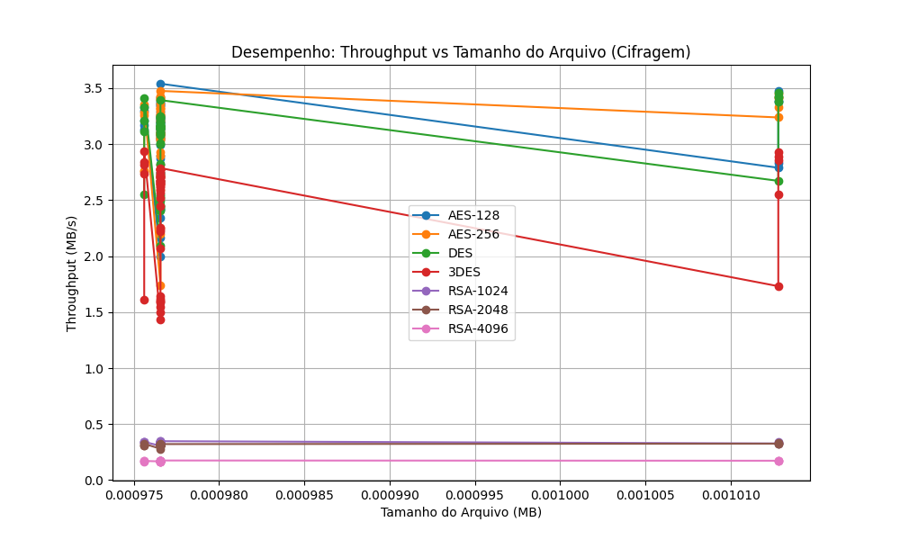
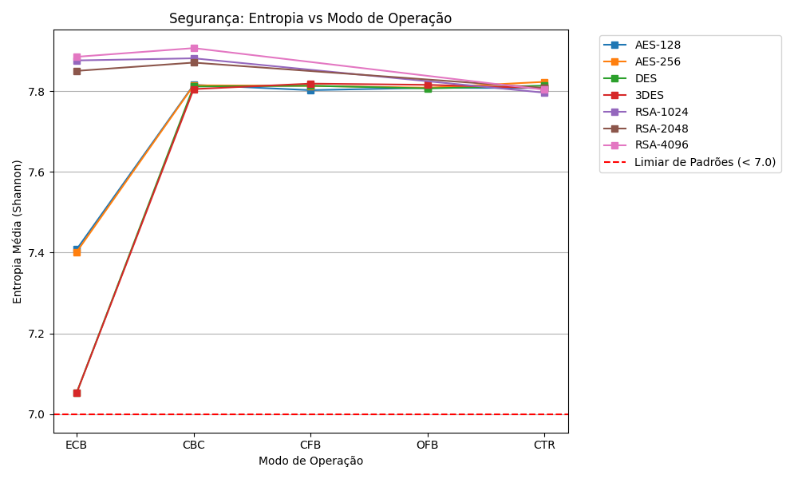

# Relatório de Testes de Criptografia

**Data da Execução:** 12/04/2026 14:53:41

## 1. Tabela de Desempenho

| Arquivo | Alg | Modo | Tam (MB) | T. Cifrar (s) | T. Decifrar (s) | Throughput Cif. (MB/s) | Throughput Dec. (MB/s) | Entropia | Padrões |
|---------|-----|------|----------|---------------|-----------------|------------------------|------------------------|----------|---------|
| csv_categorico_1KB.csv | AES-128 | ECB | 0.0010 | 0.0005 | 0.0010 | 1.9955 | 0.9881 | 7.8070 | ✅ Não |
| csv_categorico_1KB.csv | AES-128 | CBC | 0.0010 | 0.0005 | 0.0009 | 2.1618 | 1.1217 | 7.8104 | ✅ Não |
| csv_categorico_1KB.csv | AES-128 | CFB | 0.0010 | 0.0004 | 0.0010 | 2.3442 | 0.9838 | 7.8261 | ✅ Não |
| csv_categorico_1KB.csv | AES-128 | OFB | 0.0010 | 0.0004 | 0.0010 | 2.4232 | 0.9974 | 7.7826 | ✅ Não |
| csv_categorico_1KB.csv | AES-128 | CTR | 0.0010 | 0.0004 | 0.0008 | 2.4148 | 1.1717 | 7.8088 | ✅ Não |
| csv_categorico_1KB.csv | AES-256 | ECB | 0.0010 | 0.0003 | 0.0009 | 3.4119 | 1.0732 | 7.8202 | ✅ Não |
| csv_categorico_1KB.csv | AES-256 | CBC | 0.0010 | 0.0004 | 0.0009 | 2.5908 | 1.0721 | 7.8109 | ✅ Não |
| csv_categorico_1KB.csv | AES-256 | CFB | 0.0010 | 0.0003 | 0.0010 | 3.0393 | 1.0085 | 7.8219 | ✅ Não |
| csv_categorico_1KB.csv | AES-256 | OFB | 0.0010 | 0.0003 | 0.0009 | 3.3301 | 1.1002 | 7.7901 | ✅ Não |
| csv_categorico_1KB.csv | AES-256 | CTR | 0.0010 | 0.0003 | 0.0009 | 3.0867 | 1.0925 | 7.8062 | ✅ Não |
| csv_categorico_1KB.csv | DES | ECB | 0.0010 | 0.0003 | 0.0009 | 3.1332 | 1.0578 | 7.7826 | ✅ Não |
| csv_categorico_1KB.csv | DES | CBC | 0.0010 | 0.0003 | 0.0010 | 3.1705 | 1.0220 | 7.8032 | ✅ Não |
| csv_categorico_1KB.csv | DES | CFB | 0.0010 | 0.0004 | 0.0010 | 2.5325 | 1.0094 | 7.8147 | ✅ Não |
| csv_categorico_1KB.csv | DES | OFB | 0.0010 | 0.0003 | 0.0009 | 3.1651 | 1.0882 | 7.8181 | ✅ Não |
| csv_categorico_1KB.csv | DES | CTR | 0.0010 | 0.0004 | 0.0009 | 2.6719 | 1.0311 | 7.8469 | ✅ Não |
| csv_categorico_1KB.csv | 3DES | ECB | 0.0010 | 0.0004 | 0.0009 | 2.2171 | 1.0544 | 7.7607 | ✅ Não |
| csv_categorico_1KB.csv | 3DES | CBC | 0.0010 | 0.0004 | 0.0010 | 2.5903 | 1.0002 | 7.8134 | ✅ Não |
| csv_categorico_1KB.csv | 3DES | CFB | 0.0010 | 0.0006 | 0.0013 | 1.5939 | 0.7647 | 7.7810 | ✅ Não |
| csv_categorico_1KB.csv | 3DES | OFB | 0.0010 | 0.0004 | 0.0010 | 2.7726 | 0.9344 | 7.8345 | ✅ Não |
| csv_categorico_1KB.csv | 3DES | CTR | 0.0010 | 0.0004 | 0.0011 | 2.6434 | 0.8753 | 7.7799 | ✅ Não |
| csv_categorico_1KB.csv | RSA-1024 | ECB | 0.0010 | 0.0029 | 0.0112 | 0.3333 | 0.0871 | 7.8582 | ✅ Não |
| csv_categorico_1KB.csv | RSA-1024 | CBC | 0.0010 | 0.0029 | 0.0113 | 0.3379 | 0.0866 | 7.8868 | ✅ Não |
| csv_categorico_1KB.csv | RSA-1024 | CTR | 0.0010 | 0.0029 | 0.0037 | 0.3392 | 0.2650 | 7.8000 | ✅ Não |
| csv_categorico_1KB.csv | RSA-2048 | ECB | 0.0010 | 0.0032 | 0.0170 | 0.3045 | 0.0576 | 7.8452 | ✅ Não |
| csv_categorico_1KB.csv | RSA-2048 | CBC | 0.0010 | 0.0031 | 0.0172 | 0.3152 | 0.0568 | 7.8710 | ✅ Não |
| csv_categorico_1KB.csv | RSA-2048 | CTR | 0.0010 | 0.0031 | 0.0040 | 0.3158 | 0.2442 | 7.8249 | ✅ Não |
| csv_categorico_1KB.csv | RSA-4096 | ECB | 0.0010 | 0.0057 | 0.0510 | 0.1722 | 0.0191 | 7.8779 | ✅ Não |
| csv_categorico_1KB.csv | RSA-4096 | CBC | 0.0010 | 0.0058 | 0.0511 | 0.1691 | 0.0191 | 7.9247 | ✅ Não |
| csv_categorico_1KB.csv | RSA-4096 | CTR | 0.0010 | 0.0057 | 0.0064 | 0.1712 | 0.1527 | 7.8070 | ✅ Não |
| csv_incremental_1KB.csv | AES-128 | ECB | 0.0010 | 0.0003 | 0.0008 | 2.9931 | 1.1548 | 7.6185 | ✅ Não |
| csv_incremental_1KB.csv | AES-128 | CBC | 0.0010 | 0.0003 | 0.0008 | 3.2449 | 1.2099 | 7.8200 | ✅ Não |
| csv_incremental_1KB.csv | AES-128 | CFB | 0.0010 | 0.0003 | 0.0009 | 3.1146 | 1.1171 | 7.8142 | ✅ Não |
| csv_incremental_1KB.csv | AES-128 | OFB | 0.0010 | 0.0003 | 0.0010 | 3.2227 | 0.9719 | 7.7956 | ✅ Não |
| csv_incremental_1KB.csv | AES-128 | CTR | 0.0010 | 0.0003 | 0.0009 | 3.2234 | 1.0623 | 7.8277 | ✅ Não |
| csv_incremental_1KB.csv | AES-256 | ECB | 0.0010 | 0.0003 | 0.0008 | 3.2043 | 1.1725 | 7.6303 | ✅ Não |
| csv_incremental_1KB.csv | AES-256 | CBC | 0.0010 | 0.0003 | 0.0011 | 2.8955 | 0.9113 | 7.8554 | ✅ Não |
| csv_incremental_1KB.csv | AES-256 | CFB | 0.0010 | 0.0003 | 0.0010 | 3.1239 | 1.0018 | 7.8195 | ✅ Não |
| csv_incremental_1KB.csv | AES-256 | OFB | 0.0010 | 0.0003 | 0.0009 | 3.4009 | 1.1168 | 7.7861 | ✅ Não |
| csv_incremental_1KB.csv | AES-256 | CTR | 0.0010 | 0.0003 | 0.0009 | 3.2469 | 1.1413 | 7.8313 | ✅ Não |
| csv_incremental_1KB.csv | DES | ECB | 0.0010 | 0.0004 | 0.0010 | 2.7420 | 0.9396 | 7.1241 | ✅ Não |
| csv_incremental_1KB.csv | DES | CBC | 0.0010 | 0.0003 | 0.0009 | 2.8231 | 1.0967 | 7.8208 | ✅ Não |
| csv_incremental_1KB.csv | DES | CFB | 0.0010 | 0.0004 | 0.0010 | 2.4244 | 0.9866 | 7.8167 | ✅ Não |
| csv_incremental_1KB.csv | DES | OFB | 0.0010 | 0.0003 | 0.0010 | 3.1715 | 0.9673 | 7.7897 | ✅ Não |
| csv_incremental_1KB.csv | DES | CTR | 0.0010 | 0.0003 | 0.0008 | 3.1329 | 1.1588 | 7.8029 | ✅ Não |
| csv_incremental_1KB.csv | 3DES | ECB | 0.0010 | 0.0004 | 0.0009 | 2.7229 | 1.0630 | 7.1315 | ✅ Não |
| csv_incremental_1KB.csv | 3DES | CBC | 0.0010 | 0.0004 | 0.0010 | 2.6532 | 1.0174 | 7.7958 | ✅ Não |
| csv_incremental_1KB.csv | 3DES | CFB | 0.0010 | 0.0006 | 0.0013 | 1.6162 | 0.7559 | 7.8092 | ✅ Não |
| csv_incremental_1KB.csv | 3DES | OFB | 0.0010 | 0.0004 | 0.0010 | 2.7051 | 1.0265 | 7.8048 | ✅ Não |
| csv_incremental_1KB.csv | 3DES | CTR | 0.0010 | 0.0004 | 0.0009 | 2.7122 | 1.0487 | 7.8056 | ✅ Não |
| csv_incremental_1KB.csv | RSA-1024 | ECB | 0.0010 | 0.0030 | 0.0114 | 0.3210 | 0.0858 | 7.8798 | ✅ Não |
| csv_incremental_1KB.csv | RSA-1024 | CBC | 0.0010 | 0.0029 | 0.0113 | 0.3376 | 0.0861 | 7.8863 | ✅ Não |
| csv_incremental_1KB.csv | RSA-1024 | CTR | 0.0010 | 0.0029 | 0.0037 | 0.3355 | 0.2639 | 7.7605 | ✅ Não |
| csv_incremental_1KB.csv | RSA-2048 | ECB | 0.0010 | 0.0030 | 0.0171 | 0.3211 | 0.0572 | 7.8747 | ✅ Não |
| csv_incremental_1KB.csv | RSA-2048 | CBC | 0.0010 | 0.0035 | 0.0172 | 0.2800 | 0.0569 | 7.8675 | ✅ Não |
| csv_incremental_1KB.csv | RSA-2048 | CTR | 0.0010 | 0.0031 | 0.0039 | 0.3123 | 0.2523 | 7.7948 | ✅ Não |
| csv_incremental_1KB.csv | RSA-4096 | ECB | 0.0010 | 0.0056 | 0.0509 | 0.1754 | 0.0192 | 7.8867 | ✅ Não |
| csv_incremental_1KB.csv | RSA-4096 | CBC | 0.0010 | 0.0056 | 0.0509 | 0.1739 | 0.0192 | 7.8998 | ✅ Não |
| csv_incremental_1KB.csv | RSA-4096 | CTR | 0.0010 | 0.0056 | 0.0063 | 0.1736 | 0.1559 | 7.7931 | ✅ Não |
| csv_realista_1KB.csv | AES-128 | ECB | 0.0010 | 0.0003 | 0.0008 | 3.1920 | 1.2498 | 7.8131 | ✅ Não |
| csv_realista_1KB.csv | AES-128 | CBC | 0.0010 | 0.0003 | 0.0009 | 3.1938 | 1.1481 | 7.8364 | ✅ Não |
| csv_realista_1KB.csv | AES-128 | CFB | 0.0010 | 0.0003 | 0.0009 | 3.1358 | 1.0547 | 7.8385 | ✅ Não |
| csv_realista_1KB.csv | AES-128 | OFB | 0.0010 | 0.0003 | 0.0008 | 3.3693 | 1.2079 | 7.7751 | ✅ Não |
| csv_realista_1KB.csv | AES-128 | CTR | 0.0010 | 0.0003 | 0.0008 | 3.3615 | 1.1707 | 7.8141 | ✅ Não |
| csv_realista_1KB.csv | AES-256 | ECB | 0.0010 | 0.0003 | 0.0008 | 3.0892 | 1.1543 | 7.8149 | ✅ Não |
| csv_realista_1KB.csv | AES-256 | CBC | 0.0010 | 0.0003 | 0.0008 | 3.3228 | 1.1534 | 7.8182 | ✅ Não |
| csv_realista_1KB.csv | AES-256 | CFB | 0.0010 | 0.0003 | 0.0009 | 3.0825 | 1.0900 | 7.8189 | ✅ Não |
| csv_realista_1KB.csv | AES-256 | OFB | 0.0010 | 0.0003 | 0.0009 | 3.4162 | 1.0521 | 7.8298 | ✅ Não |
| csv_realista_1KB.csv | AES-256 | CTR | 0.0010 | 0.0003 | 0.0009 | 3.2679 | 1.0880 | 7.7788 | ✅ Não |
| csv_realista_1KB.csv | DES | ECB | 0.0010 | 0.0003 | 0.0009 | 3.3919 | 1.1040 | 7.7676 | ✅ Não |
| csv_realista_1KB.csv | DES | CBC | 0.0010 | 0.0003 | 0.0009 | 3.0906 | 1.1018 | 7.7915 | ✅ Não |
| csv_realista_1KB.csv | DES | CFB | 0.0010 | 0.0004 | 0.0009 | 2.5157 | 1.0699 | 7.7924 | ✅ Não |
| csv_realista_1KB.csv | DES | OFB | 0.0010 | 0.0003 | 0.0009 | 3.1918 | 1.1102 | 7.8167 | ✅ Não |
| csv_realista_1KB.csv | DES | CTR | 0.0010 | 0.0003 | 0.0009 | 3.1517 | 1.0800 | 7.8019 | ✅ Não |
| csv_realista_1KB.csv | 3DES | ECB | 0.0010 | 0.0004 | 0.0009 | 2.7775 | 1.0350 | 7.7941 | ✅ Não |
| csv_realista_1KB.csv | 3DES | CBC | 0.0010 | 0.0004 | 0.0009 | 2.6756 | 1.0506 | 7.8019 | ✅ Não |
| csv_realista_1KB.csv | 3DES | CFB | 0.0010 | 0.0006 | 0.0011 | 1.5451 | 0.8503 | 7.8308 | ✅ Não |
| csv_realista_1KB.csv | 3DES | OFB | 0.0010 | 0.0004 | 0.0009 | 2.5664 | 1.0678 | 7.7937 | ✅ Não |
| csv_realista_1KB.csv | 3DES | CTR | 0.0010 | 0.0004 | 0.0009 | 2.6990 | 1.0559 | 7.8419 | ✅ Não |
| csv_realista_1KB.csv | RSA-1024 | ECB | 0.0010 | 0.0032 | 0.0114 | 0.3058 | 0.0853 | 7.8753 | ✅ Não |
| csv_realista_1KB.csv | RSA-1024 | CBC | 0.0010 | 0.0029 | 0.0113 | 0.3394 | 0.0868 | 7.9013 | ✅ Não |
| csv_realista_1KB.csv | RSA-1024 | CTR | 0.0010 | 0.0029 | 0.0038 | 0.3393 | 0.2557 | 7.7725 | ✅ Não |
| csv_realista_1KB.csv | RSA-2048 | ECB | 0.0010 | 0.0031 | 0.0171 | 0.3179 | 0.0573 | 7.8528 | ✅ Não |
| csv_realista_1KB.csv | RSA-2048 | CBC | 0.0010 | 0.0031 | 0.0172 | 0.3111 | 0.0568 | 7.8826 | ✅ Não |
| csv_realista_1KB.csv | RSA-2048 | CTR | 0.0010 | 0.0031 | 0.0039 | 0.3104 | 0.2487 | 7.7928 | ✅ Não |
| csv_realista_1KB.csv | RSA-4096 | ECB | 0.0010 | 0.0056 | 0.0511 | 0.1732 | 0.0191 | 7.8940 | ✅ Não |
| csv_realista_1KB.csv | RSA-4096 | CBC | 0.0010 | 0.0057 | 0.0529 | 0.1701 | 0.0185 | 7.8932 | ✅ Não |
| csv_realista_1KB.csv | RSA-4096 | CTR | 0.0010 | 0.0057 | 0.0067 | 0.1699 | 0.1455 | 7.7872 | ✅ Não |
| csv_repetitivo_1KB.csv | AES-128 | ECB | 0.0010 | 0.0003 | 0.0008 | 3.0785 | 1.1667 | 6.9666 | ⚠️ Sim |
| csv_repetitivo_1KB.csv | AES-128 | CBC | 0.0010 | 0.0003 | 0.0009 | 3.1624 | 1.1103 | 7.8037 | ✅ Não |
| csv_repetitivo_1KB.csv | AES-128 | CFB | 0.0010 | 0.0003 | 0.0009 | 3.0797 | 1.0977 | 7.7878 | ✅ Não |
| csv_repetitivo_1KB.csv | AES-128 | OFB | 0.0010 | 0.0003 | 0.0009 | 3.3461 | 1.1436 | 7.8112 | ✅ Não |
| csv_repetitivo_1KB.csv | AES-128 | CTR | 0.0010 | 0.0003 | 0.0009 | 3.1009 | 1.1374 | 7.7771 | ✅ Não |
| csv_repetitivo_1KB.csv | AES-256 | ECB | 0.0010 | 0.0003 | 0.0009 | 3.3935 | 1.0937 | 6.9520 | ⚠️ Sim |
| csv_repetitivo_1KB.csv | AES-256 | CBC | 0.0010 | 0.0003 | 0.0009 | 3.3123 | 1.0855 | 7.7930 | ✅ Não |
| csv_repetitivo_1KB.csv | AES-256 | CFB | 0.0010 | 0.0003 | 0.0010 | 3.1561 | 0.9680 | 7.8097 | ✅ Não |
| csv_repetitivo_1KB.csv | AES-256 | OFB | 0.0010 | 0.0003 | 0.0009 | 3.2931 | 1.1305 | 7.8272 | ✅ Não |
| csv_repetitivo_1KB.csv | AES-256 | CTR | 0.0010 | 0.0003 | 0.0011 | 3.0481 | 0.9165 | 7.8300 | ✅ Não |
| csv_repetitivo_1KB.csv | DES | ECB | 0.0010 | 0.0003 | 0.0009 | 3.1568 | 1.0579 | 6.2335 | ⚠️ Sim |
| csv_repetitivo_1KB.csv | DES | CBC | 0.0010 | 0.0003 | 0.0009 | 3.1532 | 1.1328 | 7.8217 | ✅ Não |
| csv_repetitivo_1KB.csv | DES | CFB | 0.0010 | 0.0004 | 0.0010 | 2.4083 | 0.9479 | 7.8262 | ✅ Não |
| csv_repetitivo_1KB.csv | DES | OFB | 0.0010 | 0.0003 | 0.0009 | 3.2211 | 1.0911 | 7.8368 | ✅ Não |
| csv_repetitivo_1KB.csv | DES | CTR | 0.0010 | 0.0003 | 0.0009 | 3.1382 | 1.0409 | 7.7875 | ✅ Não |
| csv_repetitivo_1KB.csv | 3DES | ECB | 0.0010 | 0.0004 | 0.0009 | 2.7723 | 1.0547 | 6.2855 | ⚠️ Sim |
| csv_repetitivo_1KB.csv | 3DES | CBC | 0.0010 | 0.0004 | 0.0009 | 2.6731 | 1.0693 | 7.7843 | ✅ Não |
| csv_repetitivo_1KB.csv | 3DES | CFB | 0.0010 | 0.0006 | 0.0012 | 1.5859 | 0.8111 | 7.8415 | ✅ Não |
| csv_repetitivo_1KB.csv | 3DES | OFB | 0.0010 | 0.0004 | 0.0009 | 2.6351 | 1.0887 | 7.8252 | ✅ Não |
| csv_repetitivo_1KB.csv | 3DES | CTR | 0.0010 | 0.0005 | 0.0009 | 2.0669 | 1.0522 | 7.7843 | ✅ Não |
| csv_repetitivo_1KB.csv | RSA-1024 | ECB | 0.0010 | 0.0028 | 0.0112 | 0.3432 | 0.0874 | 7.8731 | ✅ Não |
| csv_repetitivo_1KB.csv | RSA-1024 | CBC | 0.0010 | 0.0029 | 0.0112 | 0.3398 | 0.0868 | 7.8835 | ✅ Não |
| csv_repetitivo_1KB.csv | RSA-1024 | CTR | 0.0010 | 0.0029 | 0.0038 | 0.3389 | 0.2554 | 7.7819 | ✅ Não |
| csv_repetitivo_1KB.csv | RSA-2048 | ECB | 0.0010 | 0.0031 | 0.0170 | 0.3185 | 0.0573 | 7.8216 | ✅ Não |
| csv_repetitivo_1KB.csv | RSA-2048 | CBC | 0.0010 | 0.0031 | 0.0171 | 0.3105 | 0.0571 | 7.8753 | ✅ Não |
| csv_repetitivo_1KB.csv | RSA-2048 | CTR | 0.0010 | 0.0031 | 0.0038 | 0.3108 | 0.2574 | 7.8132 | ✅ Não |
| csv_repetitivo_1KB.csv | RSA-4096 | ECB | 0.0010 | 0.0057 | 0.0511 | 0.1723 | 0.0191 | 7.8757 | ✅ Não |
| csv_repetitivo_1KB.csv | RSA-4096 | CBC | 0.0010 | 0.0057 | 0.0513 | 0.1699 | 0.0191 | 7.9123 | ✅ Não |
| csv_repetitivo_1KB.csv | RSA-4096 | CTR | 0.0010 | 0.0058 | 0.0066 | 0.1698 | 0.1480 | 7.8016 | ✅ Não |
| dados_aninhados_1KB.json | AES-128 | ECB | 0.0010 | 0.0003 | 0.0008 | 3.1709 | 1.1932 | 7.8337 | ✅ Não |
| dados_aninhados_1KB.json | AES-128 | CBC | 0.0010 | 0.0003 | 0.0010 | 3.2119 | 0.9785 | 7.8250 | ✅ Não |
| dados_aninhados_1KB.json | AES-128 | CFB | 0.0010 | 0.0003 | 0.0008 | 3.1263 | 1.1722 | 7.7786 | ✅ Não |
| dados_aninhados_1KB.json | AES-128 | OFB | 0.0010 | 0.0003 | 0.0008 | 3.3322 | 1.1869 | 7.8105 | ✅ Não |
| dados_aninhados_1KB.json | AES-128 | CTR | 0.0010 | 0.0003 | 0.0009 | 3.2957 | 1.0973 | 7.8134 | ✅ Não |
| dados_aninhados_1KB.json | AES-256 | ECB | 0.0010 | 0.0003 | 0.0010 | 3.3549 | 1.0147 | 7.7927 | ✅ Não |
| dados_aninhados_1KB.json | AES-256 | CBC | 0.0010 | 0.0004 | 0.0039 | 2.7626 | 0.2475 | 7.8135 | ✅ Não |
| dados_aninhados_1KB.json | AES-256 | CFB | 0.0010 | 0.0004 | 0.0021 | 2.7591 | 0.4715 | 7.8182 | ✅ Não |
| dados_aninhados_1KB.json | AES-256 | OFB | 0.0010 | 0.0003 | 0.0009 | 3.2541 | 1.1262 | 7.8121 | ✅ Não |
| dados_aninhados_1KB.json | AES-256 | CTR | 0.0010 | 0.0003 | 0.0008 | 3.2778 | 1.1624 | 7.8138 | ✅ Não |
| dados_aninhados_1KB.json | DES | ECB | 0.0010 | 0.0003 | 0.0009 | 3.4074 | 1.0644 | 7.8231 | ✅ Não |
| dados_aninhados_1KB.json | DES | CBC | 0.0010 | 0.0003 | 0.0009 | 3.3266 | 1.0831 | 7.8259 | ✅ Não |
| dados_aninhados_1KB.json | DES | CFB | 0.0010 | 0.0004 | 0.0010 | 2.5475 | 0.9514 | 7.8366 | ✅ Não |
| dados_aninhados_1KB.json | DES | OFB | 0.0010 | 0.0003 | 0.0013 | 3.1132 | 0.7228 | 7.8021 | ✅ Não |
| dados_aninhados_1KB.json | DES | CTR | 0.0010 | 0.0003 | 0.0008 | 3.2112 | 1.1731 | 7.8331 | ✅ Não |
| dados_aninhados_1KB.json | 3DES | ECB | 0.0010 | 0.0003 | 0.0009 | 2.9386 | 1.1249 | 7.8285 | ✅ Não |
| dados_aninhados_1KB.json | 3DES | CBC | 0.0010 | 0.0003 | 0.0009 | 2.8176 | 1.0884 | 7.8346 | ✅ Não |
| dados_aninhados_1KB.json | 3DES | CFB | 0.0010 | 0.0006 | 0.0011 | 1.6117 | 0.8514 | 7.8114 | ✅ Não |
| dados_aninhados_1KB.json | 3DES | OFB | 0.0010 | 0.0003 | 0.0009 | 2.8399 | 1.0318 | 7.8150 | ✅ Não |
| dados_aninhados_1KB.json | 3DES | CTR | 0.0010 | 0.0004 | 0.0009 | 2.7333 | 1.1096 | 7.7752 | ✅ Não |
| dados_aninhados_1KB.json | RSA-1024 | ECB | 0.0010 | 0.0029 | 0.0112 | 0.3419 | 0.0870 | 7.8709 | ✅ Não |
| dados_aninhados_1KB.json | RSA-1024 | CBC | 0.0010 | 0.0029 | 0.0112 | 0.3402 | 0.0871 | 7.8772 | ✅ Não |
| dados_aninhados_1KB.json | RSA-1024 | CTR | 0.0010 | 0.0029 | 0.0038 | 0.3407 | 0.2544 | 7.7867 | ✅ Não |
| dados_aninhados_1KB.json | RSA-2048 | ECB | 0.0010 | 0.0030 | 0.0168 | 0.3244 | 0.0581 | 7.8526 | ✅ Não |
| dados_aninhados_1KB.json | RSA-2048 | CBC | 0.0010 | 0.0031 | 0.0171 | 0.3119 | 0.0569 | 7.8772 | ✅ Não |
| dados_aninhados_1KB.json | RSA-2048 | CTR | 0.0010 | 0.0032 | 0.0038 | 0.3073 | 0.2535 | 7.8033 | ✅ Não |
| dados_aninhados_1KB.json | RSA-4096 | ECB | 0.0010 | 0.0057 | 0.0518 | 0.1714 | 0.0188 | 7.8718 | ✅ Não |
| dados_aninhados_1KB.json | RSA-4096 | CBC | 0.0010 | 0.0057 | 0.0517 | 0.1703 | 0.0189 | 7.8918 | ✅ Não |
| dados_aninhados_1KB.json | RSA-4096 | CTR | 0.0010 | 0.0059 | 0.0065 | 0.1646 | 0.1497 | 7.7786 | ✅ Não |
| dados_aninhados_1KB.xml | AES-128 | ECB | 0.0010 | 0.0003 | 0.0008 | 3.0370 | 1.2020 | 7.8293 | ✅ Não |
| dados_aninhados_1KB.xml | AES-128 | CBC | 0.0010 | 0.0003 | 0.0009 | 3.2103 | 1.1028 | 7.8068 | ✅ Não |
| dados_aninhados_1KB.xml | AES-128 | CFB | 0.0010 | 0.0004 | 0.0009 | 2.7451 | 1.0986 | 7.7642 | ✅ Não |
| dados_aninhados_1KB.xml | AES-128 | OFB | 0.0010 | 0.0003 | 0.0008 | 3.2557 | 1.1581 | 7.8158 | ✅ Não |
| dados_aninhados_1KB.xml | AES-128 | CTR | 0.0010 | 0.0003 | 0.0008 | 3.2547 | 1.1718 | 7.8053 | ✅ Não |
| dados_aninhados_1KB.xml | AES-256 | ECB | 0.0010 | 0.0003 | 0.0008 | 3.2156 | 1.1519 | 7.7742 | ✅ Não |
| dados_aninhados_1KB.xml | AES-256 | CBC | 0.0010 | 0.0003 | 0.0009 | 3.2684 | 1.0578 | 7.7829 | ✅ Não |
| dados_aninhados_1KB.xml | AES-256 | CFB | 0.0010 | 0.0003 | 0.0009 | 3.0350 | 1.1232 | 7.8052 | ✅ Não |
| dados_aninhados_1KB.xml | AES-256 | OFB | 0.0010 | 0.0003 | 0.0008 | 3.3643 | 1.1721 | 7.7824 | ✅ Não |
| dados_aninhados_1KB.xml | AES-256 | CTR | 0.0010 | 0.0004 | 0.0009 | 2.7052 | 1.0338 | 7.8346 | ✅ Não |
| dados_aninhados_1KB.xml | DES | ECB | 0.0010 | 0.0003 | 0.0009 | 3.1913 | 1.1295 | 7.7541 | ✅ Não |
| dados_aninhados_1KB.xml | DES | CBC | 0.0010 | 0.0003 | 0.0009 | 3.1026 | 1.0847 | 7.8367 | ✅ Não |
| dados_aninhados_1KB.xml | DES | CFB | 0.0010 | 0.0004 | 0.0009 | 2.4411 | 1.0328 | 7.7609 | ✅ Não |
| dados_aninhados_1KB.xml | DES | OFB | 0.0010 | 0.0004 | 0.0008 | 2.5496 | 1.1546 | 7.8099 | ✅ Não |
| dados_aninhados_1KB.xml | DES | CTR | 0.0010 | 0.0003 | 0.0010 | 3.1457 | 0.9971 | 7.8135 | ✅ Não |
| dados_aninhados_1KB.xml | 3DES | ECB | 0.0010 | 0.0004 | 0.0010 | 2.7252 | 1.0026 | 7.7339 | ✅ Não |
| dados_aninhados_1KB.xml | 3DES | CBC | 0.0010 | 0.0004 | 0.0009 | 2.6527 | 1.0671 | 7.7978 | ✅ Não |
| dados_aninhados_1KB.xml | 3DES | CFB | 0.0010 | 0.0006 | 0.0013 | 1.6017 | 0.7569 | 7.8279 | ✅ Não |
| dados_aninhados_1KB.xml | 3DES | OFB | 0.0010 | 0.0004 | 0.0010 | 2.7853 | 0.9572 | 7.8172 | ✅ Não |
| dados_aninhados_1KB.xml | 3DES | CTR | 0.0010 | 0.0004 | 0.0012 | 2.6682 | 0.7920 | 7.8137 | ✅ Não |
| dados_aninhados_1KB.xml | RSA-1024 | ECB | 0.0010 | 0.0029 | 0.0115 | 0.3381 | 0.0852 | 7.8816 | ✅ Não |
| dados_aninhados_1KB.xml | RSA-1024 | CBC | 0.0010 | 0.0029 | 0.0114 | 0.3342 | 0.0858 | 7.8688 | ✅ Não |
| dados_aninhados_1KB.xml | RSA-1024 | CTR | 0.0010 | 0.0029 | 0.0037 | 0.3376 | 0.2663 | 7.8337 | ✅ Não |
| dados_aninhados_1KB.xml | RSA-2048 | ECB | 0.0010 | 0.0030 | 0.0168 | 0.3204 | 0.0580 | 7.8346 | ✅ Não |
| dados_aninhados_1KB.xml | RSA-2048 | CBC | 0.0010 | 0.0031 | 0.0169 | 0.3161 | 0.0577 | 7.8536 | ✅ Não |
| dados_aninhados_1KB.xml | RSA-2048 | CTR | 0.0010 | 0.0031 | 0.0038 | 0.3167 | 0.2554 | 7.8135 | ✅ Não |
| dados_aninhados_1KB.xml | RSA-4096 | ECB | 0.0010 | 0.0058 | 0.0516 | 0.1688 | 0.0189 | 7.8836 | ✅ Não |
| dados_aninhados_1KB.xml | RSA-4096 | CBC | 0.0010 | 0.0058 | 0.0514 | 0.1686 | 0.0190 | 7.9043 | ✅ Não |
| dados_aninhados_1KB.xml | RSA-4096 | CTR | 0.0010 | 0.0058 | 0.0064 | 0.1684 | 0.1522 | 7.8189 | ✅ Não |
| imagem_padrao_1KB.bmp | AES-128 | ECB | 0.0010 | 0.0003 | 0.0010 | 3.4737 | 0.9984 | 6.4311 | ⚠️ Sim |
| imagem_padrao_1KB.bmp | AES-128 | CBC | 0.0010 | 0.0004 | 0.0009 | 2.7883 | 1.1219 | 7.8259 | ✅ Não |
| imagem_padrao_1KB.bmp | AES-128 | CFB | 0.0010 | 0.0004 | 0.0009 | 2.8324 | 1.1872 | 7.8026 | ✅ Não |
| imagem_padrao_1KB.bmp | AES-128 | OFB | 0.0010 | 0.0003 | 0.0010 | 3.3873 | 1.0335 | 7.8379 | ✅ Não |
| imagem_padrao_1KB.bmp | AES-128 | CTR | 0.0010 | 0.0003 | 0.0009 | 3.3816 | 1.1769 | 7.8178 | ✅ Não |
| imagem_padrao_1KB.bmp | AES-256 | ECB | 0.0010 | 0.0003 | 0.0009 | 3.4514 | 1.1477 | 6.4773 | ⚠️ Sim |
| imagem_padrao_1KB.bmp | AES-256 | CBC | 0.0010 | 0.0003 | 0.0010 | 3.4077 | 1.0340 | 7.8123 | ✅ Não |
| imagem_padrao_1KB.bmp | AES-256 | CFB | 0.0010 | 0.0003 | 0.0009 | 3.3263 | 1.1201 | 7.8541 | ✅ Não |
| imagem_padrao_1KB.bmp | AES-256 | OFB | 0.0010 | 0.0003 | 0.0009 | 3.4208 | 1.1867 | 7.8015 | ✅ Não |
| imagem_padrao_1KB.bmp | AES-256 | CTR | 0.0010 | 0.0003 | 0.0009 | 3.2373 | 1.1280 | 7.8357 | ✅ Não |
| imagem_padrao_1KB.bmp | DES | ECB | 0.0010 | 0.0003 | 0.0008 | 3.4228 | 1.2131 | 5.3075 | ⚠️ Sim |
| imagem_padrao_1KB.bmp | DES | CBC | 0.0010 | 0.0003 | 0.0010 | 3.3752 | 1.0319 | 7.8130 | ✅ Não |
| imagem_padrao_1KB.bmp | DES | CFB | 0.0010 | 0.0004 | 0.0009 | 2.6712 | 1.1381 | 7.8171 | ✅ Não |
| imagem_padrao_1KB.bmp | DES | OFB | 0.0010 | 0.0003 | 0.0008 | 3.4579 | 1.1931 | 7.8189 | ✅ Não |
| imagem_padrao_1KB.bmp | DES | CTR | 0.0010 | 0.0003 | 0.0009 | 3.4170 | 1.1877 | 7.8036 | ✅ Não |
| imagem_padrao_1KB.bmp | 3DES | ECB | 0.0010 | 0.0003 | 0.0010 | 2.9305 | 1.0647 | 5.2840 | ⚠️ Sim |
| imagem_padrao_1KB.bmp | 3DES | CBC | 0.0010 | 0.0004 | 0.0009 | 2.8529 | 1.1454 | 7.7948 | ✅ Não |
| imagem_padrao_1KB.bmp | 3DES | CFB | 0.0010 | 0.0006 | 0.0012 | 1.7311 | 0.8760 | 7.8318 | ✅ Não |
| imagem_padrao_1KB.bmp | 3DES | OFB | 0.0010 | 0.0004 | 0.0009 | 2.8859 | 1.1189 | 7.8117 | ✅ Não |
| imagem_padrao_1KB.bmp | 3DES | CTR | 0.0010 | 0.0004 | 0.0009 | 2.5484 | 1.0880 | 7.8051 | ✅ Não |
| imagem_padrao_1KB.bmp | RSA-1024 | ECB | 0.0010 | 0.0030 | 0.0121 | 0.3406 | 0.0837 | 7.8806 | ✅ Não |
| imagem_padrao_1KB.bmp | RSA-1024 | CBC | 0.0010 | 0.0031 | 0.0120 | 0.3320 | 0.0844 | 7.8728 | ✅ Não |
| imagem_padrao_1KB.bmp | RSA-1024 | CTR | 0.0010 | 0.0031 | 0.0040 | 0.3270 | 0.2544 | 7.7960 | ✅ Não |
| imagem_padrao_1KB.bmp | RSA-2048 | ECB | 0.0010 | 0.0031 | 0.0169 | 0.3306 | 0.0598 | 7.8320 | ✅ Não |
| imagem_padrao_1KB.bmp | RSA-2048 | CBC | 0.0010 | 0.0031 | 0.0170 | 0.3262 | 0.0594 | 7.8628 | ✅ Não |
| imagem_padrao_1KB.bmp | RSA-2048 | CTR | 0.0010 | 0.0031 | 0.0040 | 0.3259 | 0.2513 | 7.8211 | ✅ Não |
| imagem_padrao_1KB.bmp | RSA-4096 | ECB | 0.0010 | 0.0057 | 0.0512 | 0.1762 | 0.0198 | 7.8943 | ✅ Não |
| imagem_padrao_1KB.bmp | RSA-4096 | CBC | 0.0010 | 0.0058 | 0.0514 | 0.1751 | 0.0197 | 7.9067 | ✅ Não |
| imagem_padrao_1KB.bmp | RSA-4096 | CTR | 0.0010 | 0.0058 | 0.0065 | 0.1733 | 0.1567 | 7.8080 | ✅ Não |
| texto_aleatorio_1KB.txt | AES-128 | ECB | 0.0010 | 0.0003 | 0.0008 | 3.0549 | 1.1564 | 7.7976 | ✅ Não |
| texto_aleatorio_1KB.txt | AES-128 | CBC | 0.0010 | 0.0003 | 0.0008 | 3.2900 | 1.1929 | 7.8140 | ✅ Não |
| texto_aleatorio_1KB.txt | AES-128 | CFB | 0.0010 | 0.0003 | 0.0013 | 3.0601 | 0.7315 | 7.8154 | ✅ Não |
| texto_aleatorio_1KB.txt | AES-128 | OFB | 0.0010 | 0.0003 | 0.0009 | 3.3453 | 1.1245 | 7.7958 | ✅ Não |
| texto_aleatorio_1KB.txt | AES-128 | CTR | 0.0010 | 0.0003 | 0.0008 | 3.2326 | 1.1533 | 7.8206 | ✅ Não |
| texto_aleatorio_1KB.txt | AES-256 | ECB | 0.0010 | 0.0003 | 0.0009 | 3.3163 | 1.1055 | 7.8020 | ✅ Não |
| texto_aleatorio_1KB.txt | AES-256 | CBC | 0.0010 | 0.0003 | 0.0009 | 3.0647 | 1.1147 | 7.8117 | ✅ Não |
| texto_aleatorio_1KB.txt | AES-256 | CFB | 0.0010 | 0.0003 | 0.0009 | 3.1075 | 1.1059 | 7.7592 | ✅ Não |
| texto_aleatorio_1KB.txt | AES-256 | OFB | 0.0010 | 0.0006 | 0.0013 | 1.7391 | 0.7688 | 7.7962 | ✅ Não |
| texto_aleatorio_1KB.txt | AES-256 | CTR | 0.0010 | 0.0004 | 0.0013 | 2.1984 | 0.7785 | 7.8117 | ✅ Não |
| texto_aleatorio_1KB.txt | DES | ECB | 0.0010 | 0.0004 | 0.0012 | 2.4553 | 0.8132 | 7.7856 | ✅ Não |
| texto_aleatorio_1KB.txt | DES | CBC | 0.0010 | 0.0003 | 0.0015 | 2.9988 | 0.6638 | 7.8153 | ✅ Não |
| texto_aleatorio_1KB.txt | DES | CFB | 0.0010 | 0.0004 | 0.0010 | 2.4457 | 0.9317 | 7.8146 | ✅ Não |
| texto_aleatorio_1KB.txt | DES | OFB | 0.0010 | 0.0003 | 0.0009 | 3.1042 | 1.0503 | 7.7760 | ✅ Não |
| texto_aleatorio_1KB.txt | DES | CTR | 0.0010 | 0.0003 | 0.0008 | 3.1399 | 1.1869 | 7.8189 | ✅ Não |
| texto_aleatorio_1KB.txt | 3DES | ECB | 0.0010 | 0.0004 | 0.0009 | 2.7429 | 1.0497 | 7.8006 | ✅ Não |
| texto_aleatorio_1KB.txt | 3DES | CBC | 0.0010 | 0.0004 | 0.0009 | 2.6708 | 1.0777 | 7.8396 | ✅ Não |
| texto_aleatorio_1KB.txt | 3DES | CFB | 0.0010 | 0.0006 | 0.0012 | 1.6444 | 0.7932 | 7.7973 | ✅ Não |
| texto_aleatorio_1KB.txt | 3DES | OFB | 0.0010 | 0.0004 | 0.0009 | 2.7777 | 1.0325 | 7.8049 | ✅ Não |
| texto_aleatorio_1KB.txt | 3DES | CTR | 0.0010 | 0.0004 | 0.0011 | 2.6243 | 0.8570 | 7.8440 | ✅ Não |
| texto_aleatorio_1KB.txt | RSA-1024 | ECB | 0.0010 | 0.0028 | 0.0113 | 0.3452 | 0.0863 | 7.8920 | ✅ Não |
| texto_aleatorio_1KB.txt | RSA-1024 | CBC | 0.0010 | 0.0029 | 0.0114 | 0.3326 | 0.0854 | 7.8813 | ✅ Não |
| texto_aleatorio_1KB.txt | RSA-1024 | CTR | 0.0010 | 0.0029 | 0.0037 | 0.3356 | 0.2606 | 7.8242 | ✅ Não |
| texto_aleatorio_1KB.txt | RSA-2048 | ECB | 0.0010 | 0.0031 | 0.0170 | 0.3176 | 0.0574 | 7.8644 | ✅ Não |
| texto_aleatorio_1KB.txt | RSA-2048 | CBC | 0.0010 | 0.0031 | 0.0189 | 0.3115 | 0.0516 | 7.8673 | ✅ Não |
| texto_aleatorio_1KB.txt | RSA-2048 | CTR | 0.0010 | 0.0031 | 0.0042 | 0.3147 | 0.2324 | 7.7977 | ✅ Não |
| texto_aleatorio_1KB.txt | RSA-4096 | ECB | 0.0010 | 0.0057 | 0.0529 | 0.1722 | 0.0185 | 7.8856 | ✅ Não |
| texto_aleatorio_1KB.txt | RSA-4096 | CBC | 0.0010 | 0.0057 | 0.0511 | 0.1702 | 0.0191 | 7.9051 | ✅ Não |
| texto_aleatorio_1KB.txt | RSA-4096 | CTR | 0.0010 | 0.0057 | 0.0064 | 0.1702 | 0.1517 | 7.8124 | ✅ Não |
| texto_natural_1KB.txt | AES-128 | ECB | 0.0010 | 0.0003 | 0.0009 | 3.4170 | 1.0900 | 7.7994 | ✅ Não |
| texto_natural_1KB.txt | AES-128 | CBC | 0.0010 | 0.0003 | 0.0010 | 3.3860 | 0.9555 | 7.8129 | ✅ Não |
| texto_natural_1KB.txt | AES-128 | CFB | 0.0010 | 0.0003 | 0.0010 | 2.8124 | 0.9656 | 7.8032 | ✅ Não |
| texto_natural_1KB.txt | AES-128 | OFB | 0.0010 | 0.0003 | 0.0009 | 3.1646 | 1.0674 | 7.8201 | ✅ Não |
| texto_natural_1KB.txt | AES-128 | CTR | 0.0010 | 0.0003 | 0.0009 | 2.8681 | 1.0326 | 7.7842 | ✅ Não |
| texto_natural_1KB.txt | AES-256 | ECB | 0.0010 | 0.0004 | 0.0017 | 2.2571 | 0.5896 | 7.8304 | ✅ Não |
| texto_natural_1KB.txt | AES-256 | CBC | 0.0010 | 0.0003 | 0.0008 | 2.8153 | 1.1811 | 7.8294 | ✅ Não |
| texto_natural_1KB.txt | AES-256 | CFB | 0.0010 | 0.0003 | 0.0010 | 3.1002 | 0.9973 | 7.8087 | ✅ Não |
| texto_natural_1KB.txt | AES-256 | OFB | 0.0010 | 0.0003 | 0.0010 | 2.9255 | 0.9479 | 7.8292 | ✅ Não |
| texto_natural_1KB.txt | AES-256 | CTR | 0.0010 | 0.0003 | 0.0010 | 3.0544 | 0.9747 | 7.8422 | ✅ Não |
| texto_natural_1KB.txt | DES | ECB | 0.0010 | 0.0003 | 0.0009 | 3.0841 | 1.1298 | 7.7346 | ✅ Não |
| texto_natural_1KB.txt | DES | CBC | 0.0010 | 0.0004 | 0.0009 | 2.7162 | 1.1281 | 7.7724 | ✅ Não |
| texto_natural_1KB.txt | DES | CFB | 0.0010 | 0.0005 | 0.0010 | 2.0946 | 0.9785 | 7.8237 | ✅ Não |
| texto_natural_1KB.txt | DES | OFB | 0.0010 | 0.0003 | 0.0009 | 3.2310 | 1.0633 | 7.8205 | ✅ Não |
| texto_natural_1KB.txt | DES | CTR | 0.0010 | 0.0003 | 0.0009 | 3.2459 | 1.1225 | 7.8056 | ✅ Não |
| texto_natural_1KB.txt | 3DES | ECB | 0.0010 | 0.0004 | 0.0009 | 2.7008 | 1.0517 | 7.7637 | ✅ Não |
| texto_natural_1KB.txt | 3DES | CBC | 0.0010 | 0.0004 | 0.0009 | 2.6156 | 1.0779 | 7.7898 | ✅ Não |
| texto_natural_1KB.txt | 3DES | CFB | 0.0010 | 0.0007 | 0.0013 | 1.5000 | 0.7416 | 7.8385 | ✅ Não |
| texto_natural_1KB.txt | 3DES | OFB | 0.0010 | 0.0004 | 0.0010 | 2.2518 | 0.9687 | 7.8335 | ✅ Não |
| texto_natural_1KB.txt | 3DES | CTR | 0.0010 | 0.0004 | 0.0012 | 2.2381 | 0.8324 | 7.7977 | ✅ Não |
| texto_natural_1KB.txt | RSA-1024 | ECB | 0.0010 | 0.0028 | 0.0125 | 0.3456 | 0.0784 | 7.8677 | ✅ Não |
| texto_natural_1KB.txt | RSA-1024 | CBC | 0.0010 | 0.0029 | 0.0113 | 0.3401 | 0.0866 | 7.8757 | ✅ Não |
| texto_natural_1KB.txt | RSA-1024 | CTR | 0.0010 | 0.0029 | 0.0037 | 0.3376 | 0.2635 | 7.8224 | ✅ Não |
| texto_natural_1KB.txt | RSA-2048 | ECB | 0.0010 | 0.0030 | 0.0171 | 0.3218 | 0.0573 | 7.8566 | ✅ Não |
| texto_natural_1KB.txt | RSA-2048 | CBC | 0.0010 | 0.0031 | 0.0171 | 0.3122 | 0.0572 | 7.8658 | ✅ Não |
| texto_natural_1KB.txt | RSA-2048 | CTR | 0.0010 | 0.0031 | 0.0039 | 0.3130 | 0.2528 | 7.8105 | ✅ Não |
| texto_natural_1KB.txt | RSA-4096 | ECB | 0.0010 | 0.0058 | 0.0517 | 0.1692 | 0.0189 | 7.8995 | ✅ Não |
| texto_natural_1KB.txt | RSA-4096 | CBC | 0.0010 | 0.0058 | 0.0513 | 0.1685 | 0.0190 | 7.9222 | ✅ Não |
| texto_natural_1KB.txt | RSA-4096 | CTR | 0.0010 | 0.0058 | 0.0070 | 0.1691 | 0.1399 | 7.7992 | ✅ Não |
| texto_repetitivo_1KB.txt | AES-128 | ECB | 0.0010 | 0.0003 | 0.0010 | 3.5384 | 1.0056 | 6.1872 | ⚠️ Sim |
| texto_repetitivo_1KB.txt | AES-128 | CBC | 0.0010 | 0.0003 | 0.0009 | 3.2028 | 1.1042 | 7.8009 | ✅ Não |
| texto_repetitivo_1KB.txt | AES-128 | CFB | 0.0010 | 0.0003 | 0.0009 | 3.1291 | 1.1205 | 7.7934 | ✅ Não |
| texto_repetitivo_1KB.txt | AES-128 | OFB | 0.0010 | 0.0003 | 0.0009 | 3.1737 | 1.1414 | 7.8376 | ✅ Não |
| texto_repetitivo_1KB.txt | AES-128 | CTR | 0.0010 | 0.0003 | 0.0009 | 2.8965 | 1.1397 | 7.8079 | ✅ Não |
| texto_repetitivo_1KB.txt | AES-256 | ECB | 0.0010 | 0.0003 | 0.0013 | 3.4741 | 0.7450 | 6.1248 | ⚠️ Sim |
| texto_repetitivo_1KB.txt | AES-256 | CBC | 0.0010 | 0.0003 | 0.0008 | 3.4299 | 1.1687 | 7.8171 | ✅ Não |
| texto_repetitivo_1KB.txt | AES-256 | CFB | 0.0010 | 0.0003 | 0.0008 | 3.1646 | 1.1772 | 7.8148 | ✅ Não |
| texto_repetitivo_1KB.txt | AES-256 | OFB | 0.0010 | 0.0004 | 0.0010 | 2.6399 | 0.9884 | 7.8300 | ✅ Não |
| texto_repetitivo_1KB.txt | AES-256 | CTR | 0.0010 | 0.0004 | 0.0009 | 2.7278 | 1.0886 | 7.8456 | ✅ Não |
| texto_repetitivo_1KB.txt | DES | ECB | 0.0010 | 0.0003 | 0.0009 | 3.2374 | 1.1390 | 5.2200 | ⚠️ Sim |
| texto_repetitivo_1KB.txt | DES | CBC | 0.0010 | 0.0003 | 0.0008 | 3.1620 | 1.1640 | 7.8144 | ✅ Não |
| texto_repetitivo_1KB.txt | DES | CFB | 0.0010 | 0.0004 | 0.0010 | 2.4906 | 1.0261 | 7.8307 | ✅ Não |
| texto_repetitivo_1KB.txt | DES | OFB | 0.0010 | 0.0003 | 0.0009 | 3.0122 | 1.1226 | 7.7793 | ✅ Não |
| texto_repetitivo_1KB.txt | DES | CTR | 0.0010 | 0.0003 | 0.0009 | 3.2392 | 1.1399 | 7.8213 | ✅ Não |
| texto_repetitivo_1KB.txt | 3DES | ECB | 0.0010 | 0.0004 | 0.0009 | 2.7586 | 1.0378 | 5.1476 | ⚠️ Sim |
| texto_repetitivo_1KB.txt | 3DES | CBC | 0.0010 | 0.0004 | 0.0010 | 2.6436 | 0.9593 | 7.7987 | ✅ Não |
| texto_repetitivo_1KB.txt | 3DES | CFB | 0.0010 | 0.0007 | 0.0011 | 1.4355 | 0.8587 | 7.8171 | ✅ Não |
| texto_repetitivo_1KB.txt | 3DES | OFB | 0.0010 | 0.0004 | 0.0009 | 2.5147 | 1.0655 | 7.8153 | ✅ Não |
| texto_repetitivo_1KB.txt | 3DES | CTR | 0.0010 | 0.0004 | 0.0009 | 2.4496 | 1.0748 | 7.8283 | ✅ Não |
| texto_repetitivo_1KB.txt | RSA-1024 | ECB | 0.0010 | 0.0028 | 0.0126 | 0.3477 | 0.0778 | 7.8811 | ✅ Não |
| texto_repetitivo_1KB.txt | RSA-1024 | CBC | 0.0010 | 0.0028 | 0.0111 | 0.3430 | 0.0881 | 7.8795 | ✅ Não |
| texto_repetitivo_1KB.txt | RSA-1024 | CTR | 0.0010 | 0.0029 | 0.0036 | 0.3354 | 0.2716 | 7.7835 | ✅ Não |
| texto_repetitivo_1KB.txt | RSA-2048 | ECB | 0.0010 | 0.0030 | 0.0169 | 0.3210 | 0.0577 | 7.8670 | ✅ Não |
| texto_repetitivo_1KB.txt | RSA-2048 | CBC | 0.0010 | 0.0031 | 0.0171 | 0.3120 | 0.0572 | 7.8836 | ✅ Não |
| texto_repetitivo_1KB.txt | RSA-2048 | CTR | 0.0010 | 0.0031 | 0.0040 | 0.3112 | 0.2449 | 7.8069 | ✅ Não |
| texto_repetitivo_1KB.txt | RSA-4096 | ECB | 0.0010 | 0.0057 | 0.0513 | 0.1702 | 0.0190 | 7.8814 | ✅ Não |
| texto_repetitivo_1KB.txt | RSA-4096 | CBC | 0.0010 | 0.0058 | 0.0515 | 0.1672 | 0.0190 | 7.9055 | ✅ Não |
| texto_repetitivo_1KB.txt | RSA-4096 | CTR | 0.0010 | 0.0058 | 0.0064 | 0.1681 | 0.1520 | 7.8289 | ✅ Não |

## 2. Gráficos de Análise

### Throughput vs Tamanho

### Entropia vs Modo de Operação

