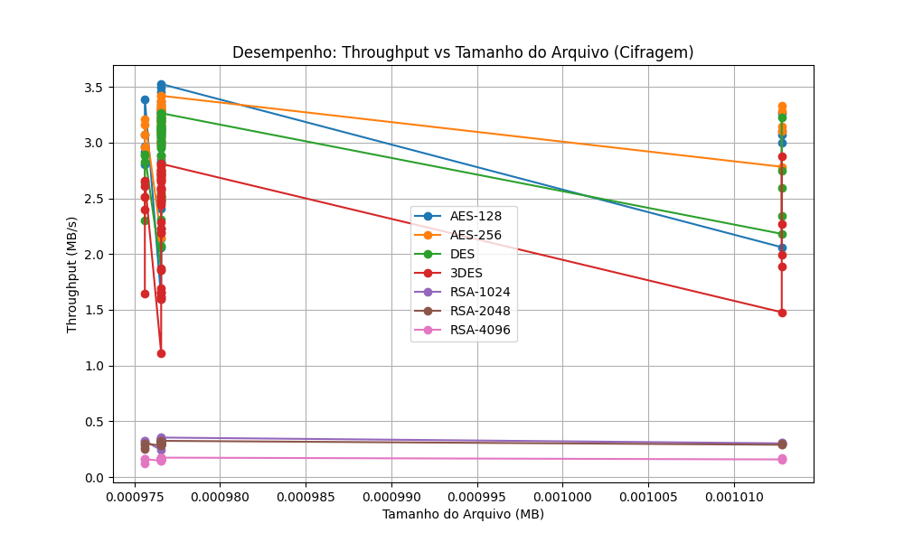
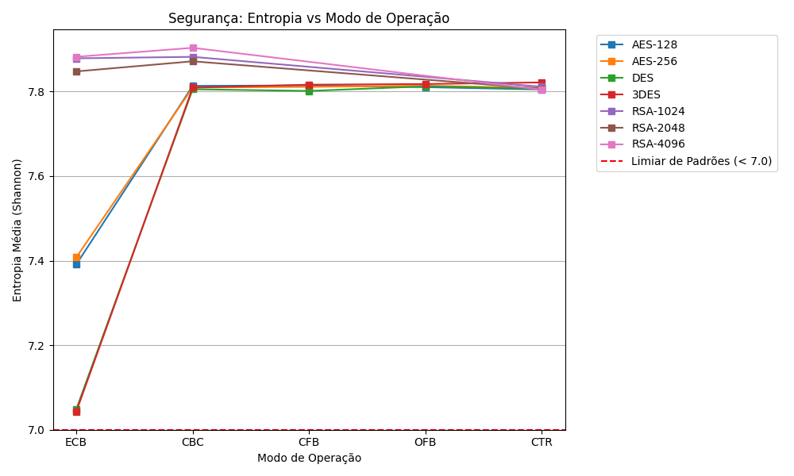

# Relatório de Testes de Criptografia

**Data da Execução:** 12/04/2026 15:34:22

## 1. Tabela de Desempenho

| Arquivo | Alg | Modo | Tam (MB) | T. Cifrar (s) | T. Decifrar (s) | Throughput Cif. (MB/s) | Throughput Dec. (MB/s) | Entropia | Padrões |
|---------|-----|------|----------|---------------|-----------------|------------------------|------------------------|----------|---------|
| csv_categorico_1KB.csv | AES-128 | ECB | 0.0010 | 0.0006 | 0.0010 | 1.5977 | 1.0082 | 7.8179 | ✅ Não |
| csv_categorico_1KB.csv | AES-128 | CBC | 0.0010 | 0.0005 | 0.0010 | 2.0583 | 0.9785 | 7.8260 | ✅ Não |
| csv_categorico_1KB.csv | AES-128 | CFB | 0.0010 | 0.0005 | 0.0010 | 2.1418 | 0.9919 | 7.8163 | ✅ Não |
| csv_categorico_1KB.csv | AES-128 | OFB | 0.0010 | 0.0004 | 0.0009 | 2.4918 | 1.0853 | 7.7841 | ✅ Não |
| csv_categorico_1KB.csv | AES-128 | CTR | 0.0010 | 0.0004 | 0.0008 | 2.4067 | 1.1525 | 7.8076 | ✅ Não |
| csv_categorico_1KB.csv | AES-256 | ECB | 0.0010 | 0.0003 | 0.0009 | 3.2436 | 1.1083 | 7.7933 | ✅ Não |
| csv_categorico_1KB.csv | AES-256 | CBC | 0.0010 | 0.0003 | 0.0009 | 3.3404 | 1.1174 | 7.7982 | ✅ Não |
| csv_categorico_1KB.csv | AES-256 | CFB | 0.0010 | 0.0003 | 0.0010 | 2.9977 | 0.9805 | 7.8145 | ✅ Não |
| csv_categorico_1KB.csv | AES-256 | OFB | 0.0010 | 0.0003 | 0.0026 | 3.4165 | 0.3800 | 7.8199 | ✅ Não |
| csv_categorico_1KB.csv | AES-256 | CTR | 0.0010 | 0.0004 | 0.0008 | 2.7792 | 1.1752 | 7.8278 | ✅ Não |
| csv_categorico_1KB.csv | DES | ECB | 0.0010 | 0.0003 | 0.0009 | 2.8192 | 1.0850 | 7.7596 | ✅ Não |
| csv_categorico_1KB.csv | DES | CBC | 0.0010 | 0.0003 | 0.0010 | 3.0871 | 0.9736 | 7.8333 | ✅ Não |
| csv_categorico_1KB.csv | DES | CFB | 0.0010 | 0.0004 | 0.0010 | 2.4528 | 0.9802 | 7.7929 | ✅ Não |
| csv_categorico_1KB.csv | DES | OFB | 0.0010 | 0.0003 | 0.0008 | 3.1082 | 1.1959 | 7.7932 | ✅ Não |
| csv_categorico_1KB.csv | DES | CTR | 0.0010 | 0.0003 | 0.0008 | 3.2593 | 1.1556 | 7.8117 | ✅ Não |
| csv_categorico_1KB.csv | 3DES | ECB | 0.0010 | 0.0004 | 0.0009 | 2.4833 | 1.0346 | 7.7586 | ✅ Não |
| csv_categorico_1KB.csv | 3DES | CBC | 0.0010 | 0.0004 | 0.0011 | 2.6951 | 0.9213 | 7.8222 | ✅ Não |
| csv_categorico_1KB.csv | 3DES | CFB | 0.0010 | 0.0006 | 0.0012 | 1.6506 | 0.8194 | 7.7855 | ✅ Não |
| csv_categorico_1KB.csv | 3DES | OFB | 0.0010 | 0.0004 | 0.0011 | 2.7549 | 0.9080 | 7.7934 | ✅ Não |
| csv_categorico_1KB.csv | 3DES | CTR | 0.0010 | 0.0004 | 0.0009 | 2.6515 | 1.0782 | 7.8354 | ✅ Não |
| csv_categorico_1KB.csv | RSA-1024 | ECB | 0.0010 | 0.0028 | 0.0111 | 0.3546 | 0.0876 | 7.8528 | ✅ Não |
| csv_categorico_1KB.csv | RSA-1024 | CBC | 0.0010 | 0.0028 | 0.0111 | 0.3454 | 0.0879 | 7.8852 | ✅ Não |
| csv_categorico_1KB.csv | RSA-1024 | CTR | 0.0010 | 0.0028 | 0.0035 | 0.3455 | 0.2820 | 7.8209 | ✅ Não |
| csv_categorico_1KB.csv | RSA-2048 | ECB | 0.0010 | 0.0030 | 0.0168 | 0.3252 | 0.0583 | 7.8483 | ✅ Não |
| csv_categorico_1KB.csv | RSA-2048 | CBC | 0.0010 | 0.0031 | 0.0168 | 0.3189 | 0.0582 | 7.8530 | ✅ Não |
| csv_categorico_1KB.csv | RSA-2048 | CTR | 0.0010 | 0.0031 | 0.0037 | 0.3182 | 0.2643 | 7.7972 | ✅ Não |
| csv_categorico_1KB.csv | RSA-4096 | ECB | 0.0010 | 0.0056 | 0.0508 | 0.1740 | 0.0192 | 7.9050 | ✅ Não |
| csv_categorico_1KB.csv | RSA-4096 | CBC | 0.0010 | 0.0057 | 0.0509 | 0.1718 | 0.0192 | 7.8949 | ✅ Não |
| csv_categorico_1KB.csv | RSA-4096 | CTR | 0.0010 | 0.0057 | 0.0063 | 0.1726 | 0.1559 | 7.8135 | ✅ Não |
| csv_incremental_1KB.csv | AES-128 | ECB | 0.0010 | 0.0003 | 0.0008 | 3.5250 | 1.1680 | 7.6233 | ✅ Não |
| csv_incremental_1KB.csv | AES-128 | CBC | 0.0010 | 0.0003 | 0.0009 | 3.1749 | 1.1216 | 7.8202 | ✅ Não |
| csv_incremental_1KB.csv | AES-128 | CFB | 0.0010 | 0.0003 | 0.0009 | 3.0721 | 1.1180 | 7.8369 | ✅ Não |
| csv_incremental_1KB.csv | AES-128 | OFB | 0.0010 | 0.0003 | 0.0008 | 2.8171 | 1.1951 | 7.8086 | ✅ Não |
| csv_incremental_1KB.csv | AES-128 | CTR | 0.0010 | 0.0003 | 0.0010 | 3.2852 | 1.0243 | 7.7685 | ✅ Não |
| csv_incremental_1KB.csv | AES-256 | ECB | 0.0010 | 0.0003 | 0.0009 | 3.3742 | 1.1336 | 7.6133 | ✅ Não |
| csv_incremental_1KB.csv | AES-256 | CBC | 0.0010 | 0.0003 | 0.0010 | 3.1406 | 0.9791 | 7.8029 | ✅ Não |
| csv_incremental_1KB.csv | AES-256 | CFB | 0.0010 | 0.0003 | 0.0009 | 2.8764 | 1.1164 | 7.8276 | ✅ Não |
| csv_incremental_1KB.csv | AES-256 | OFB | 0.0010 | 0.0003 | 0.0009 | 3.2963 | 1.1361 | 7.8175 | ✅ Não |
| csv_incremental_1KB.csv | AES-256 | CTR | 0.0010 | 0.0003 | 0.0009 | 3.0836 | 1.0837 | 7.7903 | ✅ Não |
| csv_incremental_1KB.csv | DES | ECB | 0.0010 | 0.0003 | 0.0009 | 3.1423 | 1.1077 | 7.1663 | ✅ Não |
| csv_incremental_1KB.csv | DES | CBC | 0.0010 | 0.0003 | 0.0009 | 3.2298 | 1.1191 | 7.7888 | ✅ Não |
| csv_incremental_1KB.csv | DES | CFB | 0.0010 | 0.0004 | 0.0011 | 2.4850 | 0.9088 | 7.7932 | ✅ Não |
| csv_incremental_1KB.csv | DES | OFB | 0.0010 | 0.0003 | 0.0009 | 3.1955 | 1.0935 | 7.8238 | ✅ Não |
| csv_incremental_1KB.csv | DES | CTR | 0.0010 | 0.0003 | 0.0008 | 3.1227 | 1.1678 | 7.8148 | ✅ Não |
| csv_incremental_1KB.csv | 3DES | ECB | 0.0010 | 0.0004 | 0.0011 | 2.7214 | 0.8766 | 7.1024 | ✅ Não |
| csv_incremental_1KB.csv | 3DES | CBC | 0.0010 | 0.0004 | 0.0010 | 2.7010 | 0.9830 | 7.8237 | ✅ Não |
| csv_incremental_1KB.csv | 3DES | CFB | 0.0010 | 0.0006 | 0.0012 | 1.6917 | 0.8314 | 7.7821 | ✅ Não |
| csv_incremental_1KB.csv | 3DES | OFB | 0.0010 | 0.0003 | 0.0009 | 2.8097 | 1.0440 | 7.8023 | ✅ Não |
| csv_incremental_1KB.csv | 3DES | CTR | 0.0010 | 0.0004 | 0.0010 | 2.6492 | 1.0132 | 7.8123 | ✅ Não |
| csv_incremental_1KB.csv | RSA-1024 | ECB | 0.0010 | 0.0029 | 0.0111 | 0.3411 | 0.0883 | 7.8740 | ✅ Não |
| csv_incremental_1KB.csv | RSA-1024 | CBC | 0.0010 | 0.0028 | 0.0111 | 0.3454 | 0.0876 | 7.8781 | ✅ Não |
| csv_incremental_1KB.csv | RSA-1024 | CTR | 0.0010 | 0.0028 | 0.0036 | 0.3465 | 0.2693 | 7.8084 | ✅ Não |
| csv_incremental_1KB.csv | RSA-2048 | ECB | 0.0010 | 0.0031 | 0.0169 | 0.3195 | 0.0579 | 7.8543 | ✅ Não |
| csv_incremental_1KB.csv | RSA-2048 | CBC | 0.0010 | 0.0031 | 0.0170 | 0.3155 | 0.0575 | 7.8767 | ✅ Não |
| csv_incremental_1KB.csv | RSA-2048 | CTR | 0.0010 | 0.0031 | 0.0039 | 0.3147 | 0.2499 | 7.7813 | ✅ Não |
| csv_incremental_1KB.csv | RSA-4096 | ECB | 0.0010 | 0.0056 | 0.0507 | 0.1746 | 0.0193 | 7.8822 | ✅ Não |
| csv_incremental_1KB.csv | RSA-4096 | CBC | 0.0010 | 0.0056 | 0.0509 | 0.1735 | 0.0192 | 7.9129 | ✅ Não |
| csv_incremental_1KB.csv | RSA-4096 | CTR | 0.0010 | 0.0056 | 0.0063 | 0.1729 | 0.1547 | 7.7969 | ✅ Não |
| csv_realista_1KB.csv | AES-128 | ECB | 0.0010 | 0.0003 | 0.0008 | 3.4925 | 1.2013 | 7.8288 | ✅ Não |
| csv_realista_1KB.csv | AES-128 | CBC | 0.0010 | 0.0003 | 0.0009 | 3.3155 | 1.0467 | 7.7871 | ✅ Não |
| csv_realista_1KB.csv | AES-128 | CFB | 0.0010 | 0.0003 | 0.0008 | 3.1186 | 1.1636 | 7.7938 | ✅ Não |
| csv_realista_1KB.csv | AES-128 | OFB | 0.0010 | 0.0003 | 0.0009 | 3.1365 | 1.1410 | 7.8185 | ✅ Não |
| csv_realista_1KB.csv | AES-128 | CTR | 0.0010 | 0.0003 | 0.0009 | 3.4484 | 1.0963 | 7.8499 | ✅ Não |
| csv_realista_1KB.csv | AES-256 | ECB | 0.0010 | 0.0003 | 0.0008 | 3.3684 | 1.2175 | 7.8028 | ✅ Não |
| csv_realista_1KB.csv | AES-256 | CBC | 0.0010 | 0.0003 | 0.0008 | 3.0979 | 1.2164 | 7.8460 | ✅ Não |
| csv_realista_1KB.csv | AES-256 | CFB | 0.0010 | 0.0003 | 0.0009 | 3.1836 | 1.1343 | 7.8161 | ✅ Não |
| csv_realista_1KB.csv | AES-256 | OFB | 0.0010 | 0.0003 | 0.0009 | 3.1863 | 1.1365 | 7.8200 | ✅ Não |
| csv_realista_1KB.csv | AES-256 | CTR | 0.0010 | 0.0003 | 0.0008 | 3.2529 | 1.1814 | 7.8126 | ✅ Não |
| csv_realista_1KB.csv | DES | ECB | 0.0010 | 0.0003 | 0.0009 | 3.1433 | 1.1134 | 7.7267 | ✅ Não |
| csv_realista_1KB.csv | DES | CBC | 0.0010 | 0.0003 | 0.0009 | 3.0476 | 1.0997 | 7.8189 | ✅ Não |
| csv_realista_1KB.csv | DES | CFB | 0.0010 | 0.0004 | 0.0009 | 2.5118 | 1.0470 | 7.7990 | ✅ Não |
| csv_realista_1KB.csv | DES | OFB | 0.0010 | 0.0003 | 0.0009 | 3.1998 | 1.0394 | 7.8025 | ✅ Não |
| csv_realista_1KB.csv | DES | CTR | 0.0010 | 0.0003 | 0.0009 | 3.1544 | 1.1338 | 7.8168 | ✅ Não |
| csv_realista_1KB.csv | 3DES | ECB | 0.0010 | 0.0004 | 0.0009 | 2.5913 | 1.0524 | 7.7732 | ✅ Não |
| csv_realista_1KB.csv | 3DES | CBC | 0.0010 | 0.0004 | 0.0009 | 2.5970 | 1.0400 | 7.7986 | ✅ Não |
| csv_realista_1KB.csv | 3DES | CFB | 0.0010 | 0.0006 | 0.0011 | 1.6499 | 0.8536 | 7.8163 | ✅ Não |
| csv_realista_1KB.csv | 3DES | OFB | 0.0010 | 0.0004 | 0.0010 | 2.6808 | 0.9399 | 7.8339 | ✅ Não |
| csv_realista_1KB.csv | 3DES | CTR | 0.0010 | 0.0004 | 0.0009 | 2.6721 | 1.1014 | 7.8059 | ✅ Não |
| csv_realista_1KB.csv | RSA-1024 | ECB | 0.0010 | 0.0031 | 0.0111 | 0.3142 | 0.0876 | 7.8938 | ✅ Não |
| csv_realista_1KB.csv | RSA-1024 | CBC | 0.0010 | 0.0029 | 0.0111 | 0.3417 | 0.0878 | 7.8818 | ✅ Não |
| csv_realista_1KB.csv | RSA-1024 | CTR | 0.0010 | 0.0028 | 0.0037 | 0.3454 | 0.2637 | 7.8392 | ✅ Não |
| csv_realista_1KB.csv | RSA-2048 | ECB | 0.0010 | 0.0030 | 0.0170 | 0.3232 | 0.0574 | 7.8650 | ✅ Não |
| csv_realista_1KB.csv | RSA-2048 | CBC | 0.0010 | 0.0031 | 0.0169 | 0.3153 | 0.0578 | 7.8866 | ✅ Não |
| csv_realista_1KB.csv | RSA-2048 | CTR | 0.0010 | 0.0031 | 0.0038 | 0.3156 | 0.2544 | 7.7904 | ✅ Não |
| csv_realista_1KB.csv | RSA-4096 | ECB | 0.0010 | 0.0057 | 0.0511 | 0.1726 | 0.0191 | 7.8861 | ✅ Não |
| csv_realista_1KB.csv | RSA-4096 | CBC | 0.0010 | 0.0057 | 0.0510 | 0.1705 | 0.0191 | 7.9022 | ✅ Não |
| csv_realista_1KB.csv | RSA-4096 | CTR | 0.0010 | 0.0057 | 0.0066 | 0.1707 | 0.1475 | 7.7883 | ✅ Não |
| csv_repetitivo_1KB.csv | AES-128 | ECB | 0.0010 | 0.0003 | 0.0008 | 3.0056 | 1.1946 | 6.9873 | ⚠️ Sim |
| csv_repetitivo_1KB.csv | AES-128 | CBC | 0.0010 | 0.0003 | 0.0009 | 3.2565 | 1.0789 | 7.8022 | ✅ Não |
| csv_repetitivo_1KB.csv | AES-128 | CFB | 0.0010 | 0.0003 | 0.0009 | 3.0544 | 1.0465 | 7.8300 | ✅ Não |
| csv_repetitivo_1KB.csv | AES-128 | OFB | 0.0010 | 0.0003 | 0.0008 | 3.3472 | 1.1717 | 7.8190 | ✅ Não |
| csv_repetitivo_1KB.csv | AES-128 | CTR | 0.0010 | 0.0003 | 0.0009 | 3.2640 | 1.0548 | 7.7916 | ✅ Não |
| csv_repetitivo_1KB.csv | AES-256 | ECB | 0.0010 | 0.0003 | 0.0008 | 3.2794 | 1.1993 | 6.9773 | ⚠️ Sim |
| csv_repetitivo_1KB.csv | AES-256 | CBC | 0.0010 | 0.0003 | 0.0009 | 3.1092 | 1.1483 | 7.8071 | ✅ Não |
| csv_repetitivo_1KB.csv | AES-256 | CFB | 0.0010 | 0.0003 | 0.0009 | 3.2249 | 1.1000 | 7.8007 | ✅ Não |
| csv_repetitivo_1KB.csv | AES-256 | OFB | 0.0010 | 0.0003 | 0.0009 | 3.2982 | 1.1287 | 7.8280 | ✅ Não |
| csv_repetitivo_1KB.csv | AES-256 | CTR | 0.0010 | 0.0003 | 0.0008 | 3.4196 | 1.1935 | 7.7945 | ✅ Não |
| csv_repetitivo_1KB.csv | DES | ECB | 0.0010 | 0.0003 | 0.0011 | 3.0788 | 0.9160 | 6.3178 | ⚠️ Sim |
| csv_repetitivo_1KB.csv | DES | CBC | 0.0010 | 0.0004 | 0.0009 | 2.5422 | 1.1275 | 7.7935 | ✅ Não |
| csv_repetitivo_1KB.csv | DES | CFB | 0.0010 | 0.0004 | 0.0010 | 2.5152 | 1.0110 | 7.8187 | ✅ Não |
| csv_repetitivo_1KB.csv | DES | OFB | 0.0010 | 0.0003 | 0.0009 | 3.2290 | 1.0657 | 7.7943 | ✅ Não |
| csv_repetitivo_1KB.csv | DES | CTR | 0.0010 | 0.0003 | 0.0008 | 3.1401 | 1.1771 | 7.8013 | ✅ Não |
| csv_repetitivo_1KB.csv | 3DES | ECB | 0.0010 | 0.0004 | 0.0009 | 2.7310 | 1.0650 | 6.2966 | ⚠️ Sim |
| csv_repetitivo_1KB.csv | 3DES | CBC | 0.0010 | 0.0003 | 0.0010 | 2.7970 | 0.9947 | 7.8145 | ✅ Não |
| csv_repetitivo_1KB.csv | 3DES | CFB | 0.0010 | 0.0006 | 0.0013 | 1.6603 | 0.7499 | 7.8360 | ✅ Não |
| csv_repetitivo_1KB.csv | 3DES | OFB | 0.0010 | 0.0004 | 0.0010 | 2.6682 | 0.9771 | 7.8341 | ✅ Não |
| csv_repetitivo_1KB.csv | 3DES | CTR | 0.0010 | 0.0004 | 0.0010 | 2.5870 | 1.0145 | 7.8077 | ✅ Não |
| csv_repetitivo_1KB.csv | RSA-1024 | ECB | 0.0010 | 0.0030 | 0.0110 | 0.3286 | 0.0885 | 7.8863 | ✅ Não |
| csv_repetitivo_1KB.csv | RSA-1024 | CBC | 0.0010 | 0.0028 | 0.0111 | 0.3448 | 0.0882 | 7.8902 | ✅ Não |
| csv_repetitivo_1KB.csv | RSA-1024 | CTR | 0.0010 | 0.0028 | 0.0037 | 0.3475 | 0.2606 | 7.8074 | ✅ Não |
| csv_repetitivo_1KB.csv | RSA-2048 | ECB | 0.0010 | 0.0031 | 0.0172 | 0.3148 | 0.0567 | 7.8384 | ✅ Não |
| csv_repetitivo_1KB.csv | RSA-2048 | CBC | 0.0010 | 0.0032 | 0.0173 | 0.3067 | 0.0566 | 7.8753 | ✅ Não |
| csv_repetitivo_1KB.csv | RSA-2048 | CTR | 0.0010 | 0.0032 | 0.0040 | 0.3089 | 0.2452 | 7.8218 | ✅ Não |
| csv_repetitivo_1KB.csv | RSA-4096 | ECB | 0.0010 | 0.0056 | 0.0517 | 0.1732 | 0.0189 | 7.8789 | ✅ Não |
| csv_repetitivo_1KB.csv | RSA-4096 | CBC | 0.0010 | 0.0057 | 0.0515 | 0.1727 | 0.0190 | 7.9134 | ✅ Não |
| csv_repetitivo_1KB.csv | RSA-4096 | CTR | 0.0010 | 0.0057 | 0.0064 | 0.1718 | 0.1522 | 7.8005 | ✅ Não |
| dados_aninhados_1KB.json | AES-128 | ECB | 0.0010 | 0.0003 | 0.0010 | 3.3908 | 1.0011 | 7.8098 | ✅ Não |
| dados_aninhados_1KB.json | AES-128 | CBC | 0.0010 | 0.0003 | 0.0009 | 2.9170 | 1.0584 | 7.8066 | ✅ Não |
| dados_aninhados_1KB.json | AES-128 | CFB | 0.0010 | 0.0003 | 0.0009 | 2.8045 | 1.0807 | 7.8140 | ✅ Não |
| dados_aninhados_1KB.json | AES-128 | OFB | 0.0010 | 0.0003 | 0.0009 | 2.9639 | 1.1028 | 7.7965 | ✅ Não |
| dados_aninhados_1KB.json | AES-128 | CTR | 0.0010 | 0.0003 | 0.0010 | 3.0718 | 1.0049 | 7.8195 | ✅ Não |
| dados_aninhados_1KB.json | AES-256 | ECB | 0.0010 | 0.0003 | 0.0009 | 3.2061 | 1.0809 | 7.8189 | ✅ Não |
| dados_aninhados_1KB.json | AES-256 | CBC | 0.0010 | 0.0003 | 0.0009 | 2.9590 | 1.0566 | 7.7939 | ✅ Não |
| dados_aninhados_1KB.json | AES-256 | CFB | 0.0010 | 0.0004 | 0.0010 | 2.5138 | 0.9670 | 7.8150 | ✅ Não |
| dados_aninhados_1KB.json | AES-256 | OFB | 0.0010 | 0.0003 | 0.0010 | 3.1591 | 0.9712 | 7.7994 | ✅ Não |
| dados_aninhados_1KB.json | AES-256 | CTR | 0.0010 | 0.0003 | 0.0010 | 3.0698 | 0.9311 | 7.8169 | ✅ Não |
| dados_aninhados_1KB.json | DES | ECB | 0.0010 | 0.0003 | 0.0009 | 2.8884 | 1.1141 | 7.8082 | ✅ Não |
| dados_aninhados_1KB.json | DES | CBC | 0.0010 | 0.0003 | 0.0014 | 2.8281 | 0.6787 | 7.7766 | ✅ Não |
| dados_aninhados_1KB.json | DES | CFB | 0.0010 | 0.0004 | 0.0012 | 2.3000 | 0.8212 | 7.8248 | ✅ Não |
| dados_aninhados_1KB.json | DES | OFB | 0.0010 | 0.0004 | 0.0009 | 2.6426 | 1.0534 | 7.8156 | ✅ Não |
| dados_aninhados_1KB.json | DES | CTR | 0.0010 | 0.0003 | 0.0010 | 2.8906 | 0.9781 | 7.8024 | ✅ Não |
| dados_aninhados_1KB.json | 3DES | ECB | 0.0010 | 0.0004 | 0.0010 | 2.3956 | 1.0054 | 7.7840 | ✅ Não |
| dados_aninhados_1KB.json | 3DES | CBC | 0.0010 | 0.0004 | 0.0024 | 2.6129 | 0.4123 | 7.7933 | ✅ Não |
| dados_aninhados_1KB.json | 3DES | CFB | 0.0010 | 0.0006 | 0.0012 | 1.6483 | 0.7961 | 7.8247 | ✅ Não |
| dados_aninhados_1KB.json | 3DES | OFB | 0.0010 | 0.0004 | 0.0009 | 2.6577 | 1.0396 | 7.7964 | ✅ Não |
| dados_aninhados_1KB.json | 3DES | CTR | 0.0010 | 0.0004 | 0.0010 | 2.5147 | 1.0017 | 7.8221 | ✅ Não |
| dados_aninhados_1KB.json | RSA-1024 | ECB | 0.0010 | 0.0037 | 0.0122 | 0.2658 | 0.0800 | 7.8634 | ✅ Não |
| dados_aninhados_1KB.json | RSA-1024 | CBC | 0.0010 | 0.0030 | 0.0115 | 0.3258 | 0.0849 | 7.8851 | ✅ Não |
| dados_aninhados_1KB.json | RSA-1024 | CTR | 0.0010 | 0.0030 | 0.0037 | 0.3227 | 0.2631 | 7.8103 | ✅ Não |
| dados_aninhados_1KB.json | RSA-2048 | ECB | 0.0010 | 0.0032 | 0.0196 | 0.3012 | 0.0498 | 7.8553 | ✅ Não |
| dados_aninhados_1KB.json | RSA-2048 | CBC | 0.0010 | 0.0039 | 0.0183 | 0.2494 | 0.0534 | 7.8634 | ✅ Não |
| dados_aninhados_1KB.json | RSA-2048 | CTR | 0.0010 | 0.0034 | 0.0043 | 0.2906 | 0.2287 | 7.8394 | ✅ Não |
| dados_aninhados_1KB.json | RSA-4096 | ECB | 0.0010 | 0.0060 | 0.0525 | 0.1619 | 0.0186 | 7.8809 | ✅ Não |
| dados_aninhados_1KB.json | RSA-4096 | CBC | 0.0010 | 0.0079 | 0.0537 | 0.1228 | 0.0182 | 7.9043 | ✅ Não |
| dados_aninhados_1KB.json | RSA-4096 | CTR | 0.0010 | 0.0061 | 0.0073 | 0.1604 | 0.1332 | 7.8209 | ✅ Não |
| dados_aninhados_1KB.xml | AES-128 | ECB | 0.0010 | 0.0003 | 0.0009 | 3.1945 | 1.0808 | 7.8192 | ✅ Não |
| dados_aninhados_1KB.xml | AES-128 | CBC | 0.0010 | 0.0003 | 0.0009 | 3.3751 | 1.0719 | 7.8387 | ✅ Não |
| dados_aninhados_1KB.xml | AES-128 | CFB | 0.0010 | 0.0003 | 0.0009 | 3.0343 | 1.1081 | 7.8021 | ✅ Não |
| dados_aninhados_1KB.xml | AES-128 | OFB | 0.0010 | 0.0004 | 0.0009 | 2.4607 | 1.1073 | 7.8154 | ✅ Não |
| dados_aninhados_1KB.xml | AES-128 | CTR | 0.0010 | 0.0003 | 0.0011 | 3.2216 | 0.9111 | 7.8176 | ✅ Não |
| dados_aninhados_1KB.xml | AES-256 | ECB | 0.0010 | 0.0003 | 0.0009 | 3.3285 | 1.0513 | 7.8275 | ✅ Não |
| dados_aninhados_1KB.xml | AES-256 | CBC | 0.0010 | 0.0003 | 0.0010 | 2.9770 | 0.9411 | 7.7928 | ✅ Não |
| dados_aninhados_1KB.xml | AES-256 | CFB | 0.0010 | 0.0003 | 0.0009 | 3.0923 | 1.1155 | 7.7998 | ✅ Não |
| dados_aninhados_1KB.xml | AES-256 | OFB | 0.0010 | 0.0003 | 0.0010 | 3.0433 | 0.9909 | 7.8083 | ✅ Não |
| dados_aninhados_1KB.xml | AES-256 | CTR | 0.0010 | 0.0003 | 0.0011 | 3.0076 | 0.8817 | 7.7983 | ✅ Não |
| dados_aninhados_1KB.xml | DES | ECB | 0.0010 | 0.0003 | 0.0010 | 3.1191 | 0.9327 | 7.7294 | ✅ Não |
| dados_aninhados_1KB.xml | DES | CBC | 0.0010 | 0.0003 | 0.0011 | 2.9598 | 0.9283 | 7.8145 | ✅ Não |
| dados_aninhados_1KB.xml | DES | CFB | 0.0010 | 0.0004 | 0.0011 | 2.5205 | 0.8674 | 7.7804 | ✅ Não |
| dados_aninhados_1KB.xml | DES | OFB | 0.0010 | 0.0003 | 0.0011 | 2.9744 | 0.8837 | 7.8278 | ✅ Não |
| dados_aninhados_1KB.xml | DES | CTR | 0.0010 | 0.0005 | 0.0010 | 2.0693 | 1.0023 | 7.7912 | ✅ Não |
| dados_aninhados_1KB.xml | 3DES | ECB | 0.0010 | 0.0004 | 0.0009 | 2.4385 | 1.0478 | 7.7152 | ✅ Não |
| dados_aninhados_1KB.xml | 3DES | CBC | 0.0010 | 0.0004 | 0.0013 | 2.2256 | 0.7601 | 7.8006 | ✅ Não |
| dados_aninhados_1KB.xml | 3DES | CFB | 0.0010 | 0.0009 | 0.0015 | 1.1114 | 0.6308 | 7.8117 | ✅ Não |
| dados_aninhados_1KB.xml | 3DES | OFB | 0.0010 | 0.0004 | 0.0012 | 2.1957 | 0.8144 | 7.8089 | ✅ Não |
| dados_aninhados_1KB.xml | 3DES | CTR | 0.0010 | 0.0004 | 0.0011 | 2.5090 | 0.8588 | 7.8335 | ✅ Não |
| dados_aninhados_1KB.xml | RSA-1024 | ECB | 0.0010 | 0.0030 | 0.0117 | 0.3304 | 0.0832 | 7.8927 | ✅ Não |
| dados_aninhados_1KB.xml | RSA-1024 | CBC | 0.0010 | 0.0029 | 0.0122 | 0.3316 | 0.0801 | 7.8759 | ✅ Não |
| dados_aninhados_1KB.xml | RSA-1024 | CTR | 0.0010 | 0.0031 | 0.0039 | 0.3193 | 0.2500 | 7.7776 | ✅ Não |
| dados_aninhados_1KB.xml | RSA-2048 | ECB | 0.0010 | 0.0033 | 0.0175 | 0.2918 | 0.0557 | 7.8532 | ✅ Não |
| dados_aninhados_1KB.xml | RSA-2048 | CBC | 0.0010 | 0.0034 | 0.0178 | 0.2914 | 0.0549 | 7.8981 | ✅ Não |
| dados_aninhados_1KB.xml | RSA-2048 | CTR | 0.0010 | 0.0033 | 0.0041 | 0.2956 | 0.2359 | 7.8067 | ✅ Não |
| dados_aninhados_1KB.xml | RSA-4096 | ECB | 0.0010 | 0.0059 | 0.0550 | 0.1657 | 0.0177 | 7.8707 | ✅ Não |
| dados_aninhados_1KB.xml | RSA-4096 | CBC | 0.0010 | 0.0067 | 0.0563 | 0.1465 | 0.0173 | 7.9095 | ✅ Não |
| dados_aninhados_1KB.xml | RSA-4096 | CTR | 0.0010 | 0.0066 | 0.0070 | 0.1487 | 0.1390 | 7.8287 | ✅ Não |
| imagem_padrao_1KB.bmp | AES-128 | ECB | 0.0010 | 0.0003 | 0.0010 | 3.0694 | 1.0454 | 6.4263 | ⚠️ Sim |
| imagem_padrao_1KB.bmp | AES-128 | CBC | 0.0010 | 0.0003 | 0.0010 | 3.2664 | 0.9817 | 7.8393 | ✅ Não |
| imagem_padrao_1KB.bmp | AES-128 | CFB | 0.0010 | 0.0003 | 0.0010 | 3.0008 | 1.0175 | 7.8384 | ✅ Não |
| imagem_padrao_1KB.bmp | AES-128 | OFB | 0.0010 | 0.0005 | 0.0010 | 2.0613 | 1.0322 | 7.8117 | ✅ Não |
| imagem_padrao_1KB.bmp | AES-128 | CTR | 0.0010 | 0.0003 | 0.0011 | 3.1062 | 0.9505 | 7.8146 | ✅ Não |
| imagem_padrao_1KB.bmp | AES-256 | ECB | 0.0010 | 0.0003 | 0.0013 | 3.1005 | 0.7874 | 6.3902 | ⚠️ Sim |
| imagem_padrao_1KB.bmp | AES-256 | CBC | 0.0010 | 0.0003 | 0.0010 | 3.3344 | 1.0101 | 7.8186 | ✅ Não |
| imagem_padrao_1KB.bmp | AES-256 | CFB | 0.0010 | 0.0003 | 0.0010 | 3.1450 | 1.0482 | 7.8132 | ✅ Não |
| imagem_padrao_1KB.bmp | AES-256 | OFB | 0.0010 | 0.0004 | 0.0013 | 2.7830 | 0.7714 | 7.8474 | ✅ Não |
| imagem_padrao_1KB.bmp | AES-256 | CTR | 0.0010 | 0.0003 | 0.0016 | 3.2823 | 0.6240 | 7.8082 | ✅ Não |
| imagem_padrao_1KB.bmp | DES | ECB | 0.0010 | 0.0004 | 0.0012 | 2.3419 | 0.8469 | 5.2014 | ⚠️ Sim |
| imagem_padrao_1KB.bmp | DES | CBC | 0.0010 | 0.0003 | 0.0011 | 3.2243 | 0.9075 | 7.8201 | ✅ Não |
| imagem_padrao_1KB.bmp | DES | CFB | 0.0010 | 0.0005 | 0.0034 | 2.1815 | 0.3021 | 7.8327 | ✅ Não |
| imagem_padrao_1KB.bmp | DES | OFB | 0.0010 | 0.0004 | 0.0019 | 2.5913 | 0.5204 | 7.8335 | ✅ Não |
| imagem_padrao_1KB.bmp | DES | CTR | 0.0010 | 0.0004 | 0.0010 | 2.7504 | 0.9705 | 7.8153 | ✅ Não |
| imagem_padrao_1KB.bmp | 3DES | ECB | 0.0010 | 0.0004 | 0.0010 | 2.2684 | 1.0332 | 5.2500 | ⚠️ Sim |
| imagem_padrao_1KB.bmp | 3DES | CBC | 0.0010 | 0.0005 | 0.0012 | 1.8871 | 0.8171 | 7.8188 | ✅ Não |
| imagem_padrao_1KB.bmp | 3DES | CFB | 0.0010 | 0.0007 | 0.0013 | 1.4783 | 0.7596 | 7.8383 | ✅ Não |
| imagem_padrao_1KB.bmp | 3DES | OFB | 0.0010 | 0.0005 | 0.0011 | 1.9942 | 0.9066 | 7.8374 | ✅ Não |
| imagem_padrao_1KB.bmp | 3DES | CTR | 0.0010 | 0.0004 | 0.0010 | 2.8767 | 0.9691 | 7.8083 | ✅ Não |
| imagem_padrao_1KB.bmp | RSA-1024 | ECB | 0.0010 | 0.0033 | 0.0131 | 0.3058 | 0.0775 | 7.8922 | ✅ Não |
| imagem_padrao_1KB.bmp | RSA-1024 | CBC | 0.0010 | 0.0033 | 0.0145 | 0.3053 | 0.0697 | 7.8924 | ✅ Não |
| imagem_padrao_1KB.bmp | RSA-1024 | CTR | 0.0010 | 0.0033 | 0.0041 | 0.3028 | 0.2466 | 7.8406 | ✅ Não |
| imagem_padrao_1KB.bmp | RSA-2048 | ECB | 0.0010 | 0.0034 | 0.0183 | 0.2969 | 0.0555 | 7.8406 | ✅ Não |
| imagem_padrao_1KB.bmp | RSA-2048 | CBC | 0.0010 | 0.0033 | 0.0184 | 0.3049 | 0.0549 | 7.8734 | ✅ Não |
| imagem_padrao_1KB.bmp | RSA-2048 | CTR | 0.0010 | 0.0035 | 0.0043 | 0.2900 | 0.2370 | 7.8303 | ✅ Não |
| imagem_padrao_1KB.bmp | RSA-4096 | ECB | 0.0010 | 0.0060 | 0.0527 | 0.1688 | 0.0192 | 7.8779 | ✅ Não |
| imagem_padrao_1KB.bmp | RSA-4096 | CBC | 0.0010 | 0.0063 | 0.0548 | 0.1613 | 0.0185 | 7.8932 | ✅ Não |
| imagem_padrao_1KB.bmp | RSA-4096 | CTR | 0.0010 | 0.0064 | 0.0070 | 0.1585 | 0.1455 | 7.8243 | ✅ Não |
| texto_aleatorio_1KB.txt | AES-128 | ECB | 0.0010 | 0.0003 | 0.0009 | 2.8563 | 1.0541 | 7.7979 | ✅ Não |
| texto_aleatorio_1KB.txt | AES-128 | CBC | 0.0010 | 0.0003 | 0.0009 | 3.2015 | 1.0534 | 7.8420 | ✅ Não |
| texto_aleatorio_1KB.txt | AES-128 | CFB | 0.0010 | 0.0003 | 0.0009 | 3.0631 | 1.0687 | 7.8086 | ✅ Não |
| texto_aleatorio_1KB.txt | AES-128 | OFB | 0.0010 | 0.0003 | 0.0010 | 3.1189 | 0.9776 | 7.7884 | ✅ Não |
| texto_aleatorio_1KB.txt | AES-128 | CTR | 0.0010 | 0.0003 | 0.0008 | 3.0169 | 1.1546 | 7.8037 | ✅ Não |
| texto_aleatorio_1KB.txt | AES-256 | ECB | 0.0010 | 0.0003 | 0.0035 | 3.3249 | 0.2828 | 7.8225 | ✅ Não |
| texto_aleatorio_1KB.txt | AES-256 | CBC | 0.0010 | 0.0003 | 0.0008 | 3.1493 | 1.1591 | 7.8041 | ✅ Não |
| texto_aleatorio_1KB.txt | AES-256 | CFB | 0.0010 | 0.0003 | 0.0014 | 3.1740 | 0.6926 | 7.7955 | ✅ Não |
| texto_aleatorio_1KB.txt | AES-256 | OFB | 0.0010 | 0.0003 | 0.0012 | 3.1953 | 0.8341 | 7.8104 | ✅ Não |
| texto_aleatorio_1KB.txt | AES-256 | CTR | 0.0010 | 0.0003 | 0.0010 | 3.2992 | 0.9795 | 7.7902 | ✅ Não |
| texto_aleatorio_1KB.txt | DES | ECB | 0.0010 | 0.0004 | 0.0009 | 2.5758 | 1.0560 | 7.8001 | ✅ Não |
| texto_aleatorio_1KB.txt | DES | CBC | 0.0010 | 0.0003 | 0.0009 | 3.2181 | 1.1154 | 7.8123 | ✅ Não |
| texto_aleatorio_1KB.txt | DES | CFB | 0.0010 | 0.0004 | 0.0010 | 2.3137 | 0.9517 | 7.7859 | ✅ Não |
| texto_aleatorio_1KB.txt | DES | OFB | 0.0010 | 0.0004 | 0.0010 | 2.7462 | 1.0241 | 7.8363 | ✅ Não |
| texto_aleatorio_1KB.txt | DES | CTR | 0.0010 | 0.0004 | 0.0012 | 2.7128 | 0.8418 | 7.7938 | ✅ Não |
| texto_aleatorio_1KB.txt | 3DES | ECB | 0.0010 | 0.0004 | 0.0014 | 2.5301 | 0.7132 | 7.8047 | ✅ Não |
| texto_aleatorio_1KB.txt | 3DES | CBC | 0.0010 | 0.0004 | 0.0011 | 2.2283 | 0.9128 | 7.8263 | ✅ Não |
| texto_aleatorio_1KB.txt | 3DES | CFB | 0.0010 | 0.0006 | 0.0013 | 1.6101 | 0.7396 | 7.8023 | ✅ Não |
| texto_aleatorio_1KB.txt | 3DES | OFB | 0.0010 | 0.0005 | 0.0011 | 1.8724 | 0.9098 | 7.8212 | ✅ Não |
| texto_aleatorio_1KB.txt | 3DES | CTR | 0.0010 | 0.0004 | 0.0010 | 2.7449 | 0.9833 | 7.8175 | ✅ Não |
| texto_aleatorio_1KB.txt | RSA-1024 | ECB | 0.0010 | 0.0030 | 0.0148 | 0.3253 | 0.0659 | 7.8866 | ✅ Não |
| texto_aleatorio_1KB.txt | RSA-1024 | CBC | 0.0010 | 0.0032 | 0.0118 | 0.3093 | 0.0830 | 7.8815 | ✅ Não |
| texto_aleatorio_1KB.txt | RSA-1024 | CTR | 0.0010 | 0.0033 | 0.0046 | 0.2966 | 0.2114 | 7.7965 | ✅ Não |
| texto_aleatorio_1KB.txt | RSA-2048 | ECB | 0.0010 | 0.0034 | 0.0181 | 0.2915 | 0.0540 | 7.8508 | ✅ Não |
| texto_aleatorio_1KB.txt | RSA-2048 | CBC | 0.0010 | 0.0034 | 0.0181 | 0.2860 | 0.0538 | 7.8675 | ✅ Não |
| texto_aleatorio_1KB.txt | RSA-2048 | CTR | 0.0010 | 0.0035 | 0.0042 | 0.2828 | 0.2325 | 7.7948 | ✅ Não |
| texto_aleatorio_1KB.txt | RSA-4096 | ECB | 0.0010 | 0.0063 | 0.0572 | 0.1548 | 0.0171 | 7.8799 | ✅ Não |
| texto_aleatorio_1KB.txt | RSA-4096 | CBC | 0.0010 | 0.0063 | 0.0551 | 0.1562 | 0.0177 | 7.8991 | ✅ Não |
| texto_aleatorio_1KB.txt | RSA-4096 | CTR | 0.0010 | 0.0063 | 0.0069 | 0.1543 | 0.1419 | 7.8070 | ✅ Não |
| texto_natural_1KB.txt | AES-128 | ECB | 0.0010 | 0.0003 | 0.0009 | 3.2915 | 1.1074 | 7.7791 | ✅ Não |
| texto_natural_1KB.txt | AES-128 | CBC | 0.0010 | 0.0003 | 0.0010 | 2.8319 | 1.0105 | 7.7726 | ✅ Não |
| texto_natural_1KB.txt | AES-128 | CFB | 0.0010 | 0.0003 | 0.0009 | 2.9942 | 1.0869 | 7.7992 | ✅ Não |
| texto_natural_1KB.txt | AES-128 | OFB | 0.0010 | 0.0004 | 0.0010 | 2.7245 | 0.9395 | 7.8440 | ✅ Não |
| texto_natural_1KB.txt | AES-128 | CTR | 0.0010 | 0.0003 | 0.0103 | 3.2710 | 0.0950 | 7.7928 | ✅ Não |
| texto_natural_1KB.txt | AES-256 | ECB | 0.0010 | 0.0003 | 0.0009 | 3.3046 | 1.1234 | 7.7789 | ✅ Não |
| texto_natural_1KB.txt | AES-256 | CBC | 0.0010 | 0.0004 | 0.0010 | 2.7455 | 0.9538 | 7.8235 | ✅ Não |
| texto_natural_1KB.txt | AES-256 | CFB | 0.0010 | 0.0003 | 0.0009 | 3.0162 | 1.1260 | 7.8096 | ✅ Não |
| texto_natural_1KB.txt | AES-256 | OFB | 0.0010 | 0.0005 | 0.0009 | 2.1470 | 1.0645 | 7.7718 | ✅ Não |
| texto_natural_1KB.txt | AES-256 | CTR | 0.0010 | 0.0003 | 0.0010 | 3.0948 | 1.0270 | 7.8369 | ✅ Não |
| texto_natural_1KB.txt | DES | ECB | 0.0010 | 0.0003 | 0.0010 | 3.1134 | 0.9512 | 7.7654 | ✅ Não |
| texto_natural_1KB.txt | DES | CBC | 0.0010 | 0.0003 | 0.0010 | 3.1585 | 1.0107 | 7.8116 | ✅ Não |
| texto_natural_1KB.txt | DES | CFB | 0.0010 | 0.0005 | 0.0010 | 2.0717 | 0.9559 | 7.8122 | ✅ Não |
| texto_natural_1KB.txt | DES | OFB | 0.0010 | 0.0003 | 0.0008 | 3.0972 | 1.1630 | 7.8034 | ✅ Não |
| texto_natural_1KB.txt | DES | CTR | 0.0010 | 0.0003 | 0.0010 | 3.0062 | 1.0249 | 7.8066 | ✅ Não |
| texto_natural_1KB.txt | 3DES | ECB | 0.0010 | 0.0004 | 0.0010 | 2.7553 | 0.9846 | 7.7343 | ✅ Não |
| texto_natural_1KB.txt | 3DES | CBC | 0.0010 | 0.0004 | 0.0010 | 2.6634 | 0.9811 | 7.8013 | ✅ Não |
| texto_natural_1KB.txt | 3DES | CFB | 0.0010 | 0.0006 | 0.0014 | 1.5982 | 0.7223 | 7.8332 | ✅ Não |
| texto_natural_1KB.txt | 3DES | OFB | 0.0010 | 0.0004 | 0.0010 | 2.5722 | 0.9818 | 7.8272 | ✅ Não |
| texto_natural_1KB.txt | 3DES | CTR | 0.0010 | 0.0004 | 0.0011 | 2.7183 | 0.8946 | 7.8528 | ✅ Não |
| texto_natural_1KB.txt | RSA-1024 | ECB | 0.0010 | 0.0041 | 0.0156 | 0.2410 | 0.0626 | 7.8746 | ✅ Não |
| texto_natural_1KB.txt | RSA-1024 | CBC | 0.0010 | 0.0031 | 0.0119 | 0.3149 | 0.0822 | 7.8815 | ✅ Não |
| texto_natural_1KB.txt | RSA-1024 | CTR | 0.0010 | 0.0030 | 0.0037 | 0.3223 | 0.2626 | 7.7829 | ✅ Não |
| texto_natural_1KB.txt | RSA-2048 | ECB | 0.0010 | 0.0034 | 0.0176 | 0.2903 | 0.0554 | 7.8344 | ✅ Não |
| texto_natural_1KB.txt | RSA-2048 | CBC | 0.0010 | 0.0033 | 0.0179 | 0.2984 | 0.0546 | 7.8686 | ✅ Não |
| texto_natural_1KB.txt | RSA-2048 | CTR | 0.0010 | 0.0034 | 0.0040 | 0.2898 | 0.2442 | 7.8155 | ✅ Não |
| texto_natural_1KB.txt | RSA-4096 | ECB | 0.0010 | 0.0064 | 0.0561 | 0.1525 | 0.0174 | 7.8855 | ✅ Não |
| texto_natural_1KB.txt | RSA-4096 | CBC | 0.0010 | 0.0062 | 0.0544 | 0.1564 | 0.0180 | 7.9036 | ✅ Não |
| texto_natural_1KB.txt | RSA-4096 | CTR | 0.0010 | 0.0060 | 0.0068 | 0.1614 | 0.1430 | 7.7975 | ✅ Não |
| texto_repetitivo_1KB.txt | AES-128 | ECB | 0.0010 | 0.0003 | 0.0009 | 3.0098 | 1.1198 | 6.0216 | ⚠️ Sim |
| texto_repetitivo_1KB.txt | AES-128 | CBC | 0.0010 | 0.0003 | 0.0056 | 3.0792 | 0.1733 | 7.8000 | ✅ Não |
| texto_repetitivo_1KB.txt | AES-128 | CFB | 0.0010 | 0.0003 | 0.0008 | 2.8876 | 1.1788 | 7.8056 | ✅ Não |
| texto_repetitivo_1KB.txt | AES-128 | OFB | 0.0010 | 0.0003 | 0.0011 | 2.9828 | 0.8831 | 7.8185 | ✅ Não |
| texto_repetitivo_1KB.txt | AES-128 | CTR | 0.0010 | 0.0004 | 0.0009 | 2.7162 | 1.1458 | 7.7831 | ✅ Não |
| texto_repetitivo_1KB.txt | AES-256 | ECB | 0.0010 | 0.0003 | 0.0008 | 3.2265 | 1.1568 | 6.2544 | ⚠️ Sim |
| texto_repetitivo_1KB.txt | AES-256 | CBC | 0.0010 | 0.0003 | 0.0009 | 3.2090 | 1.0637 | 7.8089 | ✅ Não |
| texto_repetitivo_1KB.txt | AES-256 | CFB | 0.0010 | 0.0003 | 0.0010 | 2.7974 | 0.9747 | 7.8198 | ✅ Não |
| texto_repetitivo_1KB.txt | AES-256 | OFB | 0.0010 | 0.0003 | 0.0009 | 2.7953 | 1.1235 | 7.8155 | ✅ Não |
| texto_repetitivo_1KB.txt | AES-256 | CTR | 0.0010 | 0.0003 | 0.0010 | 3.2224 | 0.9707 | 7.8092 | ✅ Não |
| texto_repetitivo_1KB.txt | DES | ECB | 0.0010 | 0.0003 | 0.0008 | 2.9527 | 1.1544 | 5.2121 | ⚠️ Sim |
| texto_repetitivo_1KB.txt | DES | CBC | 0.0010 | 0.0003 | 0.0009 | 3.2635 | 1.0683 | 7.7850 | ✅ Não |
| texto_repetitivo_1KB.txt | DES | CFB | 0.0010 | 0.0004 | 0.0010 | 2.2294 | 0.9553 | 7.7751 | ✅ Não |
| texto_repetitivo_1KB.txt | DES | OFB | 0.0010 | 0.0003 | 0.0013 | 2.8849 | 0.7495 | 7.7933 | ✅ Não |
| texto_repetitivo_1KB.txt | DES | CTR | 0.0010 | 0.0005 | 0.0013 | 1.8598 | 0.7539 | 7.8106 | ✅ Não |
| texto_repetitivo_1KB.txt | 3DES | ECB | 0.0010 | 0.0005 | 0.0013 | 1.8531 | 0.7246 | 5.2111 | ⚠️ Sim |
| texto_repetitivo_1KB.txt | 3DES | CBC | 0.0010 | 0.0004 | 0.0013 | 2.1918 | 0.7679 | 7.7939 | ✅ Não |
| texto_repetitivo_1KB.txt | 3DES | CFB | 0.0010 | 0.0006 | 0.0014 | 1.6188 | 0.6863 | 7.8323 | ✅ Não |
| texto_repetitivo_1KB.txt | 3DES | OFB | 0.0010 | 0.0004 | 0.0011 | 2.4766 | 0.9073 | 7.8237 | ✅ Não |
| texto_repetitivo_1KB.txt | 3DES | CTR | 0.0010 | 0.0004 | 0.0011 | 2.2884 | 0.8834 | 7.8206 | ✅ Não |
| texto_repetitivo_1KB.txt | RSA-1024 | ECB | 0.0010 | 0.0029 | 0.0123 | 0.3373 | 0.0793 | 7.8695 | ✅ Não |
| texto_repetitivo_1KB.txt | RSA-1024 | CBC | 0.0010 | 0.0030 | 0.0118 | 0.3259 | 0.0828 | 7.8693 | ✅ Não |
| texto_repetitivo_1KB.txt | RSA-1024 | CTR | 0.0010 | 0.0031 | 0.0039 | 0.3147 | 0.2512 | 7.8287 | ✅ Não |
| texto_repetitivo_1KB.txt | RSA-2048 | ECB | 0.0010 | 0.0032 | 0.0176 | 0.3037 | 0.0556 | 7.8359 | ✅ Não |
| texto_repetitivo_1KB.txt | RSA-2048 | CBC | 0.0010 | 0.0032 | 0.0175 | 0.3018 | 0.0557 | 7.8534 | ✅ Não |
| texto_repetitivo_1KB.txt | RSA-2048 | CTR | 0.0010 | 0.0032 | 0.0039 | 0.3016 | 0.2486 | 7.7884 | ✅ Não |
| texto_repetitivo_1KB.txt | RSA-4096 | ECB | 0.0010 | 0.0057 | 0.0516 | 0.1711 | 0.0189 | 7.8753 | ✅ Não |
| texto_repetitivo_1KB.txt | RSA-4096 | CBC | 0.0010 | 0.0058 | 0.0520 | 0.1697 | 0.0188 | 7.9018 | ✅ Não |
| texto_repetitivo_1KB.txt | RSA-4096 | CTR | 0.0010 | 0.0058 | 0.0065 | 0.1690 | 0.1508 | 7.7653 | ✅ Não |

## 2. Gráficos de Análise

### Throughput vs Tamanho

### Entropia vs Modo de Operação

