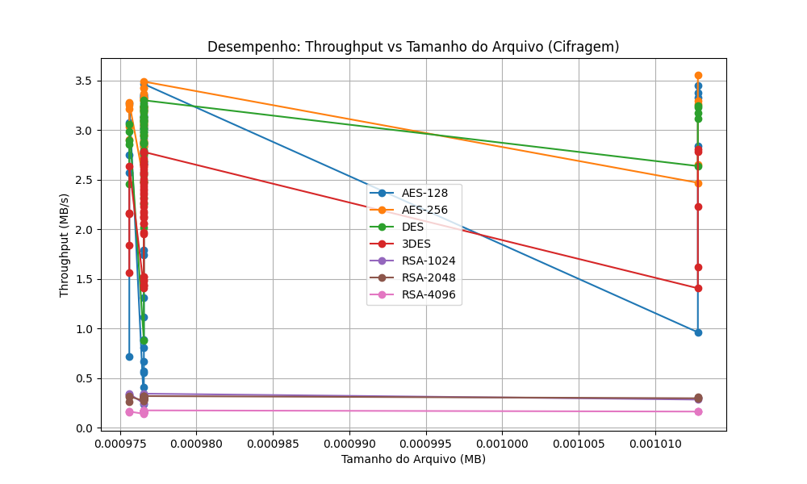
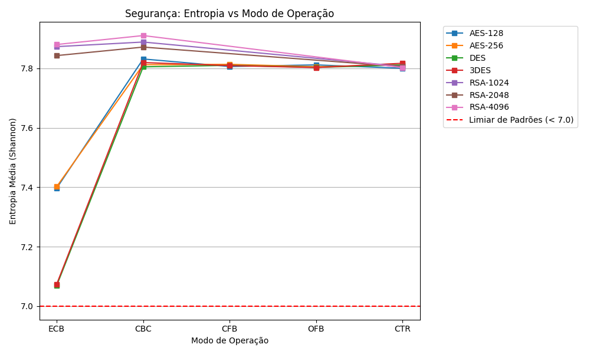

# Relatório Consolidado de Testes de Criptografia

**Data da Execução:** 12/04/2026 16:28:33

## 1. Tabela Comparativa de Tempos (Arquivos CSV)

| Arquivo | Algoritmo | Modo | Tam (MB) | T. Cifrar (s) | T. Decifrar (s) |
|---------|-----------|------|----------|---------------|-----------------|
| csv_categorico_1KB.csv | AES-128 | ECB | 0.0010 | 0.0041 | 0.0009 |
| csv_categorico_1KB.csv | AES-128 | CBC | 0.0010 | 0.0005 | 0.0010 |
| csv_categorico_1KB.csv | AES-128 | CFB | 0.0010 | 0.0006 | 0.0009 |
| csv_categorico_1KB.csv | AES-128 | OFB | 0.0010 | 0.0024 | 0.0018 |
| csv_categorico_1KB.csv | AES-128 | CTR | 0.0010 | 0.0028 | 0.0009 |
| csv_categorico_1KB.csv | AES-256 | ECB | 0.0010 | 0.0003 | 0.0008 |
| csv_categorico_1KB.csv | AES-256 | CBC | 0.0010 | 0.0003 | 0.0018 |
| csv_categorico_1KB.csv | AES-256 | CFB | 0.0010 | 0.0003 | 0.0009 |
| csv_categorico_1KB.csv | AES-256 | OFB | 0.0010 | 0.0003 | 0.0016 |
| csv_categorico_1KB.csv | AES-256 | CTR | 0.0010 | 0.0003 | 0.0009 |
| csv_categorico_1KB.csv | DES | ECB | 0.0010 | 0.0011 | 0.0009 |
| csv_categorico_1KB.csv | DES | CBC | 0.0010 | 0.0003 | 0.0009 |
| csv_categorico_1KB.csv | DES | CFB | 0.0010 | 0.0004 | 0.0010 |
| csv_categorico_1KB.csv | DES | OFB | 0.0010 | 0.0003 | 0.0024 |
| csv_categorico_1KB.csv | DES | CTR | 0.0010 | 0.0003 | 0.0009 |
| csv_categorico_1KB.csv | 3DES | ECB | 0.0010 | 0.0005 | 0.0010 |
| csv_categorico_1KB.csv | 3DES | CBC | 0.0010 | 0.0004 | 0.0010 |
| csv_categorico_1KB.csv | 3DES | CFB | 0.0010 | 0.0006 | 0.0013 |
| csv_categorico_1KB.csv | 3DES | OFB | 0.0010 | 0.0004 | 0.0011 |
| csv_categorico_1KB.csv | 3DES | CTR | 0.0010 | 0.0004 | 0.0009 |
| csv_categorico_1KB.csv | RSA-1024 | ECB | 0.0010 | 0.0029 | 0.0115 |
| csv_categorico_1KB.csv | RSA-1024 | CBC | 0.0010 | 0.0029 | 0.0118 |
| csv_categorico_1KB.csv | RSA-1024 | CTR | 0.0010 | 0.0029 | 0.0039 |
| csv_categorico_1KB.csv | RSA-2048 | ECB | 0.0010 | 0.0036 | 0.0176 |
| csv_categorico_1KB.csv | RSA-2048 | CBC | 0.0010 | 0.0032 | 0.0180 |
| csv_categorico_1KB.csv | RSA-2048 | CTR | 0.0010 | 0.0033 | 0.0041 |
| csv_categorico_1KB.csv | RSA-4096 | ECB | 0.0010 | 0.0056 | 0.0529 |
| csv_categorico_1KB.csv | RSA-4096 | CBC | 0.0010 | 0.0063 | 0.0526 |
| csv_categorico_1KB.csv | RSA-4096 | CTR | 0.0010 | 0.0058 | 0.0069 |
| csv_incremental_1KB.csv | AES-128 | ECB | 0.0010 | 0.0011 | 0.0008 |
| csv_incremental_1KB.csv | AES-128 | CBC | 0.0010 | 0.0003 | 0.0009 |
| csv_incremental_1KB.csv | AES-128 | CFB | 0.0010 | 0.0004 | 0.0010 |
| csv_incremental_1KB.csv | AES-128 | OFB | 0.0010 | 0.0003 | 0.0009 |
| csv_incremental_1KB.csv | AES-128 | CTR | 0.0010 | 0.0003 | 0.0009 |
| csv_incremental_1KB.csv | AES-256 | ECB | 0.0010 | 0.0003 | 0.0023 |
| csv_incremental_1KB.csv | AES-256 | CBC | 0.0010 | 0.0003 | 0.0011 |
| csv_incremental_1KB.csv | AES-256 | CFB | 0.0010 | 0.0003 | 0.0009 |
| csv_incremental_1KB.csv | AES-256 | OFB | 0.0010 | 0.0003 | 0.0016 |
| csv_incremental_1KB.csv | AES-256 | CTR | 0.0010 | 0.0003 | 0.0011 |
| csv_incremental_1KB.csv | DES | ECB | 0.0010 | 0.0003 | 0.0015 |
| csv_incremental_1KB.csv | DES | CBC | 0.0010 | 0.0003 | 0.0010 |
| csv_incremental_1KB.csv | DES | CFB | 0.0010 | 0.0004 | 0.0029 |
| csv_incremental_1KB.csv | DES | OFB | 0.0010 | 0.0003 | 0.0009 |
| csv_incremental_1KB.csv | DES | CTR | 0.0010 | 0.0003 | 0.0010 |
| csv_incremental_1KB.csv | 3DES | ECB | 0.0010 | 0.0004 | 0.0014 |
| csv_incremental_1KB.csv | 3DES | CBC | 0.0010 | 0.0005 | 0.0012 |
| csv_incremental_1KB.csv | 3DES | CFB | 0.0010 | 0.0007 | 0.0014 |
| csv_incremental_1KB.csv | 3DES | OFB | 0.0010 | 0.0004 | 0.0012 |
| csv_incremental_1KB.csv | 3DES | CTR | 0.0010 | 0.0005 | 0.0012 |
| csv_incremental_1KB.csv | RSA-1024 | ECB | 0.0010 | 0.0029 | 0.0116 |
| csv_incremental_1KB.csv | RSA-1024 | CBC | 0.0010 | 0.0033 | 0.0117 |
| csv_incremental_1KB.csv | RSA-1024 | CTR | 0.0010 | 0.0040 | 0.0045 |
| csv_incremental_1KB.csv | RSA-2048 | ECB | 0.0010 | 0.0031 | 0.0179 |
| csv_incremental_1KB.csv | RSA-2048 | CBC | 0.0010 | 0.0032 | 0.0172 |
| csv_incremental_1KB.csv | RSA-2048 | CTR | 0.0010 | 0.0031 | 0.0039 |
| csv_incremental_1KB.csv | RSA-4096 | ECB | 0.0010 | 0.0058 | 0.0516 |
| csv_incremental_1KB.csv | RSA-4096 | CBC | 0.0010 | 0.0066 | 0.0572 |
| csv_incremental_1KB.csv | RSA-4096 | CTR | 0.0010 | 0.0059 | 0.0065 |
| csv_realista_1KB.csv | AES-128 | ECB | 0.0010 | 0.0015 | 0.0009 |
| csv_realista_1KB.csv | AES-128 | CBC | 0.0010 | 0.0003 | 0.0009 |
| csv_realista_1KB.csv | AES-128 | CFB | 0.0010 | 0.0003 | 0.0009 |
| csv_realista_1KB.csv | AES-128 | OFB | 0.0010 | 0.0003 | 0.0008 |
| csv_realista_1KB.csv | AES-128 | CTR | 0.0010 | 0.0003 | 0.0009 |
| csv_realista_1KB.csv | AES-256 | ECB | 0.0010 | 0.0003 | 0.0009 |
| csv_realista_1KB.csv | AES-256 | CBC | 0.0010 | 0.0003 | 0.0018 |
| csv_realista_1KB.csv | AES-256 | CFB | 0.0010 | 0.0003 | 0.0009 |
| csv_realista_1KB.csv | AES-256 | OFB | 0.0010 | 0.0003 | 0.0009 |
| csv_realista_1KB.csv | AES-256 | CTR | 0.0010 | 0.0003 | 0.0009 |
| csv_realista_1KB.csv | DES | ECB | 0.0010 | 0.0003 | 0.0009 |
| csv_realista_1KB.csv | DES | CBC | 0.0010 | 0.0003 | 0.0010 |
| csv_realista_1KB.csv | DES | CFB | 0.0010 | 0.0004 | 0.0016 |
| csv_realista_1KB.csv | DES | OFB | 0.0010 | 0.0003 | 0.0009 |
| csv_realista_1KB.csv | DES | CTR | 0.0010 | 0.0003 | 0.0010 |
| csv_realista_1KB.csv | 3DES | ECB | 0.0010 | 0.0004 | 0.0010 |
| csv_realista_1KB.csv | 3DES | CBC | 0.0010 | 0.0004 | 0.0009 |
| csv_realista_1KB.csv | 3DES | CFB | 0.0010 | 0.0007 | 0.0012 |
| csv_realista_1KB.csv | 3DES | OFB | 0.0010 | 0.0004 | 0.0009 |
| csv_realista_1KB.csv | 3DES | CTR | 0.0010 | 0.0004 | 0.0010 |
| csv_realista_1KB.csv | RSA-1024 | ECB | 0.0010 | 0.0028 | 0.0115 |
| csv_realista_1KB.csv | RSA-1024 | CBC | 0.0010 | 0.0029 | 0.0115 |
| csv_realista_1KB.csv | RSA-1024 | CTR | 0.0010 | 0.0029 | 0.0037 |
| csv_realista_1KB.csv | RSA-2048 | ECB | 0.0010 | 0.0031 | 0.0170 |
| csv_realista_1KB.csv | RSA-2048 | CBC | 0.0010 | 0.0032 | 0.0197 |
| csv_realista_1KB.csv | RSA-2048 | CTR | 0.0010 | 0.0031 | 0.0040 |
| csv_realista_1KB.csv | RSA-4096 | ECB | 0.0010 | 0.0056 | 0.0512 |
| csv_realista_1KB.csv | RSA-4096 | CBC | 0.0010 | 0.0057 | 0.0512 |
| csv_realista_1KB.csv | RSA-4096 | CTR | 0.0010 | 0.0057 | 0.0064 |
| csv_repetitivo_1KB.csv | AES-128 | ECB | 0.0010 | 0.0007 | 0.0011 |
| csv_repetitivo_1KB.csv | AES-128 | CBC | 0.0010 | 0.0003 | 0.0009 |
| csv_repetitivo_1KB.csv | AES-128 | CFB | 0.0010 | 0.0003 | 0.0009 |
| csv_repetitivo_1KB.csv | AES-128 | OFB | 0.0010 | 0.0003 | 0.0009 |
| csv_repetitivo_1KB.csv | AES-128 | CTR | 0.0010 | 0.0003 | 0.0010 |
| csv_repetitivo_1KB.csv | AES-256 | ECB | 0.0010 | 0.0003 | 0.0008 |
| csv_repetitivo_1KB.csv | AES-256 | CBC | 0.0010 | 0.0004 | 0.0013 |
| csv_repetitivo_1KB.csv | AES-256 | CFB | 0.0010 | 0.0003 | 0.0009 |
| csv_repetitivo_1KB.csv | AES-256 | OFB | 0.0010 | 0.0003 | 0.0009 |
| csv_repetitivo_1KB.csv | AES-256 | CTR | 0.0010 | 0.0003 | 0.0009 |
| csv_repetitivo_1KB.csv | DES | ECB | 0.0010 | 0.0003 | 0.0011 |
| csv_repetitivo_1KB.csv | DES | CBC | 0.0010 | 0.0003 | 0.0009 |
| csv_repetitivo_1KB.csv | DES | CFB | 0.0010 | 0.0004 | 0.0010 |
| csv_repetitivo_1KB.csv | DES | OFB | 0.0010 | 0.0003 | 0.0013 |
| csv_repetitivo_1KB.csv | DES | CTR | 0.0010 | 0.0003 | 0.0009 |
| csv_repetitivo_1KB.csv | 3DES | ECB | 0.0010 | 0.0004 | 0.0009 |
| csv_repetitivo_1KB.csv | 3DES | CBC | 0.0010 | 0.0004 | 0.0009 |
| csv_repetitivo_1KB.csv | 3DES | CFB | 0.0010 | 0.0007 | 0.0013 |
| csv_repetitivo_1KB.csv | 3DES | OFB | 0.0010 | 0.0004 | 0.0009 |
| csv_repetitivo_1KB.csv | 3DES | CTR | 0.0010 | 0.0004 | 0.0024 |
| csv_repetitivo_1KB.csv | RSA-1024 | ECB | 0.0010 | 0.0032 | 0.0115 |
| csv_repetitivo_1KB.csv | RSA-1024 | CBC | 0.0010 | 0.0029 | 0.0114 |
| csv_repetitivo_1KB.csv | RSA-1024 | CTR | 0.0010 | 0.0030 | 0.0037 |
| csv_repetitivo_1KB.csv | RSA-2048 | ECB | 0.0010 | 0.0031 | 0.0172 |
| csv_repetitivo_1KB.csv | RSA-2048 | CBC | 0.0010 | 0.0031 | 0.0172 |
| csv_repetitivo_1KB.csv | RSA-2048 | CTR | 0.0010 | 0.0031 | 0.0055 |
| csv_repetitivo_1KB.csv | RSA-4096 | ECB | 0.0010 | 0.0057 | 0.0541 |
| csv_repetitivo_1KB.csv | RSA-4096 | CBC | 0.0010 | 0.0058 | 0.0517 |
| csv_repetitivo_1KB.csv | RSA-4096 | CTR | 0.0010 | 0.0058 | 0.0065 |

## 2. Resumo de Throughput e Entropia por Abordagem

| Algoritmo | Modo | Throughput Médio (MB/s) | Entropia Média | Segurança |
|-----------|------|-------------------------|----------------|-----------|
| 3DES | CBC | 2.2466 | 7.8196 | ✅ Alta |
| 3DES | CFB | 1.4918 | 7.8094 | ✅ Alta |
| 3DES | CTR | 2.3147 | 7.8172 | ✅ Alta |
| 3DES | ECB | 2.4375 | 7.0738 | 🆗 Média |
| 3DES | OFB | 2.4960 | 7.8028 | ✅ Alta |
| AES-128 | CBC | 2.9259 | 7.8316 | ✅ Alta |
| AES-128 | CFB | 2.7441 | 7.8063 | ✅ Alta |
| AES-128 | CTR | 2.8117 | 7.8004 | ✅ Alta |
| AES-128 | ECB | 0.7832 | 7.3969 | 🆗 Média |
| AES-128 | OFB | 2.9424 | 7.8117 | ✅ Alta |
| AES-256 | CBC | 3.1066 | 7.8124 | ✅ Alta |
| AES-256 | CFB | 2.8818 | 7.8136 | ✅ Alta |
| AES-256 | CTR | 3.0576 | 7.8120 | ✅ Alta |
| AES-256 | ECB | 3.2311 | 7.4021 | 🆗 Média |
| AES-256 | OFB | 3.0972 | 7.8056 | ✅ Alta |
| DES | CBC | 3.0426 | 7.8052 | ✅ Alta |
| DES | CFB | 2.4026 | 7.8103 | ✅ Alta |
| DES | CTR | 3.0266 | 7.8116 | ✅ Alta |
| DES | ECB | 2.9108 | 7.0692 | 🆗 Média |
| DES | OFB | 3.0132 | 7.8033 | ✅ Alta |
| RSA-1024 | CBC | 0.3157 | 7.8887 | ✅ Alta |
| RSA-1024 | CTR | 0.3093 | 7.8065 | ✅ Alta |
| RSA-1024 | ECB | 0.3255 | 7.8732 | ✅ Alta |
| RSA-2048 | CBC | 0.2996 | 7.8717 | ✅ Alta |
| RSA-2048 | CTR | 0.2971 | 7.8056 | ✅ Alta |
| RSA-2048 | ECB | 0.3046 | 7.8431 | ✅ Alta |
| RSA-4096 | CBC | 0.1608 | 7.9105 | ✅ Alta |
| RSA-4096 | CTR | 0.1635 | 7.8027 | ✅ Alta |
| RSA-4096 | ECB | 0.1671 | 7.8804 | ✅ Alta |

## 3. Gráficos de Análise

### Throughput vs Tamanho

### Entropia vs Modo

## 4. Log Completo de Execuções

Clique para ver todos os dados

| Arquivo | Alg | Modo | Entropia | Padrões |
|---|---|---|---|---|
| csv_categorico_1KB.csv | AES-128 | ECB | 7.8103 | Não |
| csv_categorico_1KB.csv | AES-128 | CBC | 7.8286 | Não |
| csv_categorico_1KB.csv | AES-128 | CFB | 7.8063 | Não |
| csv_categorico_1KB.csv | AES-128 | OFB | 7.7976 | Não |
| csv_categorico_1KB.csv | AES-128 | CTR | 7.8025 | Não |
| csv_categorico_1KB.csv | AES-256 | ECB | 7.81 | Não |
| csv_categorico_1KB.csv | AES-256 | CBC | 7.8306 | Não |
| csv_categorico_1KB.csv | AES-256 | CFB | 7.8203 | Não |
| csv_categorico_1KB.csv | AES-256 | OFB | 7.8131 | Não |
| csv_categorico_1KB.csv | AES-256 | CTR | 7.8003 | Não |
| csv_categorico_1KB.csv | DES | ECB | 7.7934 | Não |
| csv_categorico_1KB.csv | DES | CBC | 7.8018 | Não |
| csv_categorico_1KB.csv | DES | CFB | 7.8339 | Não |
| csv_categorico_1KB.csv | DES | OFB | 7.7783 | Não |
| csv_categorico_1KB.csv | DES | CTR | 7.8067 | Não |
| csv_categorico_1KB.csv | 3DES | ECB | 7.7516 | Não |
| csv_categorico_1KB.csv | 3DES | CBC | 7.8303 | Não |
| csv_categorico_1KB.csv | 3DES | CFB | 7.8151 | Não |
| csv_categorico_1KB.csv | 3DES | OFB | 7.8057 | Não |
| csv_categorico_1KB.csv | 3DES | CTR | 7.8054 | Não |
| csv_categorico_1KB.csv | RSA-1024 | ECB | 7.869 | Não |
| csv_categorico_1KB.csv | RSA-1024 | CBC | 7.9086 | Não |
| csv_categorico_1KB.csv | RSA-1024 | CTR | 7.8227 | Não |
| csv_categorico_1KB.csv | RSA-2048 | ECB | 7.8553 | Não |
| csv_categorico_1KB.csv | RSA-2048 | CBC | 7.8761 | Não |
| csv_categorico_1KB.csv | RSA-2048 | CTR | 7.8004 | Não |
| csv_categorico_1KB.csv | RSA-4096 | ECB | 7.888 | Não |
| csv_categorico_1KB.csv | RSA-4096 | CBC | 7.9071 | Não |
| csv_categorico_1KB.csv | RSA-4096 | CTR | 7.7849 | Não |
| csv_incremental_1KB.csv | AES-128 | ECB | 7.6119 | Não |
| csv_incremental_1KB.csv | AES-128 | CBC | 7.8206 | Não |
| csv_incremental_1KB.csv | AES-128 | CFB | 7.7867 | Não |
| csv_incremental_1KB.csv | AES-128 | OFB | 7.8197 | Não |
| csv_incremental_1KB.csv | AES-128 | CTR | 7.8168 | Não |
| csv_incremental_1KB.csv | AES-256 | ECB | 7.6416 | Não |
| csv_incremental_1KB.csv | AES-256 | CBC | 7.8036 | Não |
| csv_incremental_1KB.csv | AES-256 | CFB | 7.8383 | Não |
| csv_incremental_1KB.csv | AES-256 | OFB | 7.7723 | Não |
| csv_incremental_1KB.csv | AES-256 | CTR | 7.8202 | Não |
| csv_incremental_1KB.csv | DES | ECB | 7.0995 | Não |
| csv_incremental_1KB.csv | DES | CBC | 7.8099 | Não |
| csv_incremental_1KB.csv | DES | CFB | 7.7715 | Não |
| csv_incremental_1KB.csv | DES | OFB | 7.8087 | Não |
| csv_incremental_1KB.csv | DES | CTR | 7.8119 | Não |
| csv_incremental_1KB.csv | 3DES | ECB | 7.0819 | Não |
| csv_incremental_1KB.csv | 3DES | CBC | 7.8043 | Não |
| csv_incremental_1KB.csv | 3DES | CFB | 7.8339 | Não |
| csv_incremental_1KB.csv | 3DES | OFB | 7.815 | Não |
| csv_incremental_1KB.csv | 3DES | CTR | 7.8058 | Não |
| csv_incremental_1KB.csv | RSA-1024 | ECB | 7.8729 | Não |
| csv_incremental_1KB.csv | RSA-1024 | CBC | 7.8744 | Não |
| csv_incremental_1KB.csv | RSA-1024 | CTR | 7.8436 | Não |
| csv_incremental_1KB.csv | RSA-2048 | ECB | 7.8243 | Não |
| csv_incremental_1KB.csv | RSA-2048 | CBC | 7.8522 | Não |
| csv_incremental_1KB.csv | RSA-2048 | CTR | 7.8313 | Não |
| csv_incremental_1KB.csv | RSA-4096 | ECB | 7.8582 | Não |
| csv_incremental_1KB.csv | RSA-4096 | CBC | 7.9082 | Não |
| csv_incremental_1KB.csv | RSA-4096 | CTR | 7.7995 | Não |
| csv_realista_1KB.csv | AES-128 | ECB | 7.8353 | Não |
| csv_realista_1KB.csv | AES-128 | CBC | 7.8432 | Não |
| csv_realista_1KB.csv | AES-128 | CFB | 7.8273 | Não |
| csv_realista_1KB.csv | AES-128 | OFB | 7.8074 | Não |
| csv_realista_1KB.csv | AES-128 | CTR | 7.7956 | Não |
| csv_realista_1KB.csv | AES-256 | ECB | 7.8299 | Não |
| csv_realista_1KB.csv | AES-256 | CBC | 7.8275 | Não |
| csv_realista_1KB.csv | AES-256 | CFB | 7.8482 | Não |
| csv_realista_1KB.csv | AES-256 | OFB | 7.8069 | Não |
| csv_realista_1KB.csv | AES-256 | CTR | 7.8427 | Não |
| csv_realista_1KB.csv | DES | ECB | 7.7942 | Não |
| csv_realista_1KB.csv | DES | CBC | 7.7892 | Não |
| csv_realista_1KB.csv | DES | CFB | 7.7988 | Não |
| csv_realista_1KB.csv | DES | OFB | 7.7932 | Não |
| csv_realista_1KB.csv | DES | CTR | 7.8328 | Não |
| csv_realista_1KB.csv | 3DES | ECB | 7.7785 | Não |
| csv_realista_1KB.csv | 3DES | CBC | 7.8306 | Não |
| csv_realista_1KB.csv | 3DES | CFB | 7.7967 | Não |
| csv_realista_1KB.csv | 3DES | OFB | 7.8114 | Não |
| csv_realista_1KB.csv | 3DES | CTR | 7.8111 | Não |
| csv_realista_1KB.csv | RSA-1024 | ECB | 7.8617 | Não |
| csv_realista_1KB.csv | RSA-1024 | CBC | 7.889 | Não |
| csv_realista_1KB.csv | RSA-1024 | CTR | 7.7995 | Não |
| csv_realista_1KB.csv | RSA-2048 | ECB | 7.8471 | Não |
| csv_realista_1KB.csv | RSA-2048 | CBC | 7.875 | Não |
| csv_realista_1KB.csv | RSA-2048 | CTR | 7.8011 | Não |
| csv_realista_1KB.csv | RSA-4096 | ECB | 7.8932 | Não |
| csv_realista_1KB.csv | RSA-4096 | CBC | 7.9061 | Não |
| csv_realista_1KB.csv | RSA-4096 | CTR | 7.8041 | Não |
| csv_repetitivo_1KB.csv | AES-128 | ECB | 6.9782 | Sim |
| csv_repetitivo_1KB.csv | AES-128 | CBC | 7.8565 | Não |
| csv_repetitivo_1KB.csv | AES-128 | CFB | 7.7945 | Não |
| csv_repetitivo_1KB.csv | AES-128 | OFB | 7.8251 | Não |
| csv_repetitivo_1KB.csv | AES-128 | CTR | 7.7664 | Não |
| csv_repetitivo_1KB.csv | AES-256 | ECB | 6.9246 | Sim |
| csv_repetitivo_1KB.csv | AES-256 | CBC | 7.8299 | Não |
| csv_repetitivo_1KB.csv | AES-256 | CFB | 7.8072 | Não |
| csv_repetitivo_1KB.csv | AES-256 | OFB | 7.7852 | Não |
| csv_repetitivo_1KB.csv | AES-256 | CTR | 7.8365 | Não |
| csv_repetitivo_1KB.csv | DES | ECB | 6.2516 | Sim |
| csv_repetitivo_1KB.csv | DES | CBC | 7.7835 | Não |
| csv_repetitivo_1KB.csv | DES | CFB | 7.801 | Não |
| csv_repetitivo_1KB.csv | DES | OFB | 7.803 | Não |
| csv_repetitivo_1KB.csv | DES | CTR | 7.7924 | Não |
| csv_repetitivo_1KB.csv | 3DES | ECB | 6.3256 | Sim |
| csv_repetitivo_1KB.csv | 3DES | CBC | 7.8087 | Não |
| csv_repetitivo_1KB.csv | 3DES | CFB | 7.798 | Não |
| csv_repetitivo_1KB.csv | 3DES | OFB | 7.7896 | Não |
| csv_repetitivo_1KB.csv | 3DES | CTR | 7.8189 | Não |
| csv_repetitivo_1KB.csv | RSA-1024 | ECB | 7.891 | Não |
| csv_repetitivo_1KB.csv | RSA-1024 | CBC | 7.8834 | Não |
| csv_repetitivo_1KB.csv | RSA-1024 | CTR | 7.8329 | Não |
| csv_repetitivo_1KB.csv | RSA-2048 | ECB | 7.8364 | Não |
| csv_repetitivo_1KB.csv | RSA-2048 | CBC | 7.8609 | Não |
| csv_repetitivo_1KB.csv | RSA-2048 | CTR | 7.8281 | Não |
| csv_repetitivo_1KB.csv | RSA-4096 | ECB | 7.8705 | Não |
| csv_repetitivo_1KB.csv | RSA-4096 | CBC | 7.9098 | Não |
| csv_repetitivo_1KB.csv | RSA-4096 | CTR | 7.7988 | Não |
| dados_aninhados_1KB.json | AES-128 | ECB | 7.7854 | Não |
| dados_aninhados_1KB.json | AES-128 | CBC | 7.8404 | Não |
| dados_aninhados_1KB.json | AES-128 | CFB | 7.8061 | Não |
| dados_aninhados_1KB.json | AES-128 | OFB | 7.8251 | Não |
| dados_aninhados_1KB.json | AES-128 | CTR | 7.8237 | Não |
| dados_aninhados_1KB.json | AES-256 | ECB | 7.7966 | Não |
| dados_aninhados_1KB.json | AES-256 | CBC | 7.8087 | Não |
| dados_aninhados_1KB.json | AES-256 | CFB | 7.7752 | Não |
| dados_aninhados_1KB.json | AES-256 | OFB | 7.8029 | Não |
| dados_aninhados_1KB.json | AES-256 | CTR | 7.8049 | Não |
| dados_aninhados_1KB.json | DES | ECB | 7.8419 | Não |
| dados_aninhados_1KB.json | DES | CBC | 7.8076 | Não |
| dados_aninhados_1KB.json | DES | CFB | 7.8072 | Não |
| dados_aninhados_1KB.json | DES | OFB | 7.8196 | Não |
| dados_aninhados_1KB.json | DES | CTR | 7.8228 | Não |
| dados_aninhados_1KB.json | 3DES | ECB | 7.8222 | Não |
| dados_aninhados_1KB.json | 3DES | CBC | 7.8155 | Não |
| dados_aninhados_1KB.json | 3DES | CFB | 7.8016 | Não |
| dados_aninhados_1KB.json | 3DES | OFB | 7.7996 | Não |
| dados_aninhados_1KB.json | 3DES | CTR | 7.7966 | Não |
| dados_aninhados_1KB.json | RSA-1024 | ECB | 7.8796 | Não |
| dados_aninhados_1KB.json | RSA-1024 | CBC | 7.9104 | Não |
| dados_aninhados_1KB.json | RSA-1024 | CTR | 7.7959 | Não |
| dados_aninhados_1KB.json | RSA-2048 | ECB | 7.8612 | Não |
| dados_aninhados_1KB.json | RSA-2048 | CBC | 7.8776 | Não |
| dados_aninhados_1KB.json | RSA-2048 | CTR | 7.7771 | Não |
| dados_aninhados_1KB.json | RSA-4096 | ECB | 7.8888 | Não |
| dados_aninhados_1KB.json | RSA-4096 | CBC | 7.9137 | Não |
| dados_aninhados_1KB.json | RSA-4096 | CTR | 7.8041 | Não |
| dados_aninhados_1KB.xml | AES-128 | ECB | 7.7847 | Não |
| dados_aninhados_1KB.xml | AES-128 | CBC | 7.8 | Não |
| dados_aninhados_1KB.xml | AES-128 | CFB | 7.8074 | Não |
| dados_aninhados_1KB.xml | AES-128 | OFB | 7.8238 | Não |
| dados_aninhados_1KB.xml | AES-128 | CTR | 7.81 | Não |
| dados_aninhados_1KB.xml | AES-256 | ECB | 7.7791 | Não |
| dados_aninhados_1KB.xml | AES-256 | CBC | 7.8143 | Não |
| dados_aninhados_1KB.xml | AES-256 | CFB | 7.813 | Não |
| dados_aninhados_1KB.xml | AES-256 | OFB | 7.8171 | Não |
| dados_aninhados_1KB.xml | AES-256 | CTR | 7.7853 | Não |
| dados_aninhados_1KB.xml | DES | ECB | 7.7573 | Não |
| dados_aninhados_1KB.xml | DES | CBC | 7.7966 | Não |
| dados_aninhados_1KB.xml | DES | CFB | 7.8281 | Não |
| dados_aninhados_1KB.xml | DES | OFB | 7.8068 | Não |
| dados_aninhados_1KB.xml | DES | CTR | 7.8102 | Não |
| dados_aninhados_1KB.xml | 3DES | ECB | 7.7082 | Não |
| dados_aninhados_1KB.xml | 3DES | CBC | 7.8203 | Não |
| dados_aninhados_1KB.xml | 3DES | CFB | 7.8099 | Não |
| dados_aninhados_1KB.xml | 3DES | OFB | 7.8061 | Não |
| dados_aninhados_1KB.xml | 3DES | CTR | 7.8308 | Não |
| dados_aninhados_1KB.xml | RSA-1024 | ECB | 7.8713 | Não |
| dados_aninhados_1KB.xml | RSA-1024 | CBC | 7.8668 | Não |
| dados_aninhados_1KB.xml | RSA-1024 | CTR | 7.8169 | Não |
| dados_aninhados_1KB.xml | RSA-2048 | ECB | 7.851 | Não |
| dados_aninhados_1KB.xml | RSA-2048 | CBC | 7.8652 | Não |
| dados_aninhados_1KB.xml | RSA-2048 | CTR | 7.7946 | Não |
| dados_aninhados_1KB.xml | RSA-4096 | ECB | 7.8875 | Não |
| dados_aninhados_1KB.xml | RSA-4096 | CBC | 7.9193 | Não |
| dados_aninhados_1KB.xml | RSA-4096 | CTR | 7.8074 | Não |
| imagem_padrao_1KB.bmp | AES-128 | ECB | 6.4204 | Sim |
| imagem_padrao_1KB.bmp | AES-128 | CBC | 7.8274 | Não |
| imagem_padrao_1KB.bmp | AES-128 | CFB | 7.829 | Não |
| imagem_padrao_1KB.bmp | AES-128 | OFB | 7.812 | Não |
| imagem_padrao_1KB.bmp | AES-128 | CTR | 7.8196 | Não |
| imagem_padrao_1KB.bmp | AES-256 | ECB | 6.5276 | Sim |
| imagem_padrao_1KB.bmp | AES-256 | CBC | 7.7971 | Não |
| imagem_padrao_1KB.bmp | AES-256 | CFB | 7.8311 | Não |
| imagem_padrao_1KB.bmp | AES-256 | OFB | 7.8154 | Não |
| imagem_padrao_1KB.bmp | AES-256 | CTR | 7.8185 | Não |
| imagem_padrao_1KB.bmp | DES | ECB | 5.3515 | Sim |
| imagem_padrao_1KB.bmp | DES | CBC | 7.8066 | Não |
| imagem_padrao_1KB.bmp | DES | CFB | 7.8173 | Não |
| imagem_padrao_1KB.bmp | DES | OFB | 7.7893 | Não |
| imagem_padrao_1KB.bmp | DES | CTR | 7.7993 | Não |
| imagem_padrao_1KB.bmp | 3DES | ECB | 5.3921 | Sim |
| imagem_padrao_1KB.bmp | 3DES | CBC | 7.8186 | Não |
| imagem_padrao_1KB.bmp | 3DES | CFB | 7.7968 | Não |
| imagem_padrao_1KB.bmp | 3DES | OFB | 7.7895 | Não |
| imagem_padrao_1KB.bmp | 3DES | CTR | 7.8345 | Não |
| imagem_padrao_1KB.bmp | RSA-1024 | ECB | 7.8695 | Não |
| imagem_padrao_1KB.bmp | RSA-1024 | CBC | 7.8962 | Não |
| imagem_padrao_1KB.bmp | RSA-1024 | CTR | 7.8198 | Não |
| imagem_padrao_1KB.bmp | RSA-2048 | ECB | 7.8168 | Não |
| imagem_padrao_1KB.bmp | RSA-2048 | CBC | 7.8659 | Não |
| imagem_padrao_1KB.bmp | RSA-2048 | CTR | 7.8132 | Não |
| imagem_padrao_1KB.bmp | RSA-4096 | ECB | 7.8844 | Não |
| imagem_padrao_1KB.bmp | RSA-4096 | CBC | 7.9126 | Não |
| imagem_padrao_1KB.bmp | RSA-4096 | CTR | 7.8024 | Não |
| texto_aleatorio_1KB.txt | AES-128 | ECB | 7.7907 | Não |
| texto_aleatorio_1KB.txt | AES-128 | CBC | 7.8191 | Não |
| texto_aleatorio_1KB.txt | AES-128 | CFB | 7.8048 | Não |
| texto_aleatorio_1KB.txt | AES-128 | OFB | 7.7796 | Não |
| texto_aleatorio_1KB.txt | AES-128 | CTR | 7.8053 | Não |
| texto_aleatorio_1KB.txt | AES-256 | ECB | 7.8153 | Não |
| texto_aleatorio_1KB.txt | AES-256 | CBC | 7.7935 | Não |
| texto_aleatorio_1KB.txt | AES-256 | CFB | 7.7879 | Não |
| texto_aleatorio_1KB.txt | AES-256 | OFB | 7.7796 | Não |
| texto_aleatorio_1KB.txt | AES-256 | CTR | 7.8029 | Não |
| texto_aleatorio_1KB.txt | DES | ECB | 7.817 | Não |
| texto_aleatorio_1KB.txt | DES | CBC | 7.8213 | Não |
| texto_aleatorio_1KB.txt | DES | CFB | 7.8222 | Não |
| texto_aleatorio_1KB.txt | DES | OFB | 7.8167 | Não |
| texto_aleatorio_1KB.txt | DES | CTR | 7.7963 | Não |
| texto_aleatorio_1KB.txt | 3DES | ECB | 7.8315 | Não |
| texto_aleatorio_1KB.txt | 3DES | CBC | 7.8288 | Não |
| texto_aleatorio_1KB.txt | 3DES | CFB | 7.8028 | Não |
| texto_aleatorio_1KB.txt | 3DES | OFB | 7.822 | Não |
| texto_aleatorio_1KB.txt | 3DES | CTR | 7.8108 | Não |
| texto_aleatorio_1KB.txt | RSA-1024 | ECB | 7.8581 | Não |
| texto_aleatorio_1KB.txt | RSA-1024 | CBC | 7.8805 | Não |
| texto_aleatorio_1KB.txt | RSA-1024 | CTR | 7.7917 | Não |
| texto_aleatorio_1KB.txt | RSA-2048 | ECB | 7.847 | Não |
| texto_aleatorio_1KB.txt | RSA-2048 | CBC | 7.8771 | Não |
| texto_aleatorio_1KB.txt | RSA-2048 | CTR | 7.802 | Não |
| texto_aleatorio_1KB.txt | RSA-4096 | ECB | 7.8701 | Não |
| texto_aleatorio_1KB.txt | RSA-4096 | CBC | 7.9218 | Não |
| texto_aleatorio_1KB.txt | RSA-4096 | CTR | 7.773 | Não |
| texto_natural_1KB.txt | AES-128 | ECB | 7.8303 | Não |
| texto_natural_1KB.txt | AES-128 | CBC | 7.8352 | Não |
| texto_natural_1KB.txt | AES-128 | CFB | 7.8123 | Não |
| texto_natural_1KB.txt | AES-128 | OFB | 7.8006 | Não |
| texto_natural_1KB.txt | AES-128 | CTR | 7.8097 | Não |
| texto_natural_1KB.txt | AES-256 | ECB | 7.7823 | Não |
| texto_natural_1KB.txt | AES-256 | CBC | 7.8129 | Não |
| texto_natural_1KB.txt | AES-256 | CFB | 7.8139 | Não |
| texto_natural_1KB.txt | AES-256 | OFB | 7.8466 | Não |
| texto_natural_1KB.txt | AES-256 | CTR | 7.7948 | Não |
| texto_natural_1KB.txt | DES | ECB | 7.783 | Não |
| texto_natural_1KB.txt | DES | CBC | 7.8235 | Não |
| texto_natural_1KB.txt | DES | CFB | 7.812 | Não |
| texto_natural_1KB.txt | DES | OFB | 7.8068 | Não |
| texto_natural_1KB.txt | DES | CTR | 7.8301 | Não |
| texto_natural_1KB.txt | 3DES | ECB | 7.7455 | Não |
| texto_natural_1KB.txt | 3DES | CBC | 7.8044 | Não |
| texto_natural_1KB.txt | 3DES | CFB | 7.8325 | Não |
| texto_natural_1KB.txt | 3DES | OFB | 7.7895 | Não |
| texto_natural_1KB.txt | 3DES | CTR | 7.8229 | Não |
| texto_natural_1KB.txt | RSA-1024 | ECB | 7.8883 | Não |
| texto_natural_1KB.txt | RSA-1024 | CBC | 7.8918 | Não |
| texto_natural_1KB.txt | RSA-1024 | CTR | 7.7869 | Não |
| texto_natural_1KB.txt | RSA-2048 | ECB | 7.8406 | Não |
| texto_natural_1KB.txt | RSA-2048 | CBC | 7.8753 | Não |
| texto_natural_1KB.txt | RSA-2048 | CTR | 7.8055 | Não |
| texto_natural_1KB.txt | RSA-4096 | ECB | 7.8748 | Não |
| texto_natural_1KB.txt | RSA-4096 | CBC | 7.9004 | Não |
| texto_natural_1KB.txt | RSA-4096 | CTR | 7.8224 | Não |
| texto_repetitivo_1KB.txt | AES-128 | ECB | 6.1221 | Sim |
| texto_repetitivo_1KB.txt | AES-128 | CBC | 7.8452 | Não |
| texto_repetitivo_1KB.txt | AES-128 | CFB | 7.7887 | Não |
| texto_repetitivo_1KB.txt | AES-128 | OFB | 7.8264 | Não |
| texto_repetitivo_1KB.txt | AES-128 | CTR | 7.7541 | Não |
| texto_repetitivo_1KB.txt | AES-256 | ECB | 6.1142 | Sim |
| texto_repetitivo_1KB.txt | AES-256 | CBC | 7.8059 | Não |
| texto_repetitivo_1KB.txt | AES-256 | CFB | 7.8006 | Não |
| texto_repetitivo_1KB.txt | AES-256 | OFB | 7.8171 | Não |
| texto_repetitivo_1KB.txt | AES-256 | CTR | 7.8137 | Não |
| texto_repetitivo_1KB.txt | DES | ECB | 5.2022 | Sim |
| texto_repetitivo_1KB.txt | DES | CBC | 7.812 | Não |
| texto_repetitivo_1KB.txt | DES | CFB | 7.8109 | Não |
| texto_repetitivo_1KB.txt | DES | OFB | 7.8107 | Não |
| texto_repetitivo_1KB.txt | DES | CTR | 7.8135 | Não |
| texto_repetitivo_1KB.txt | 3DES | ECB | 5.301 | Sim |
| texto_repetitivo_1KB.txt | 3DES | CBC | 7.8349 | Não |
| texto_repetitivo_1KB.txt | 3DES | CFB | 7.8064 | Não |
| texto_repetitivo_1KB.txt | 3DES | OFB | 7.7993 | Não |
| texto_repetitivo_1KB.txt | 3DES | CTR | 7.8355 | Não |
| texto_repetitivo_1KB.txt | RSA-1024 | ECB | 7.8709 | Não |
| texto_repetitivo_1KB.txt | RSA-1024 | CBC | 7.8856 | Não |
| texto_repetitivo_1KB.txt | RSA-1024 | CTR | 7.755 | Não |
| texto_repetitivo_1KB.txt | RSA-2048 | ECB | 7.851 | Não |
| texto_repetitivo_1KB.txt | RSA-2048 | CBC | 7.8919 | Não |
| texto_repetitivo_1KB.txt | RSA-2048 | CTR | 7.8031 | Não |
| texto_repetitivo_1KB.txt | RSA-4096 | ECB | 7.8882 | Não |
| texto_repetitivo_1KB.txt | RSA-4096 | CBC | 7.9059 | Não |
| texto_repetitivo_1KB.txt | RSA-4096 | CTR | 7.8307 | Não |

