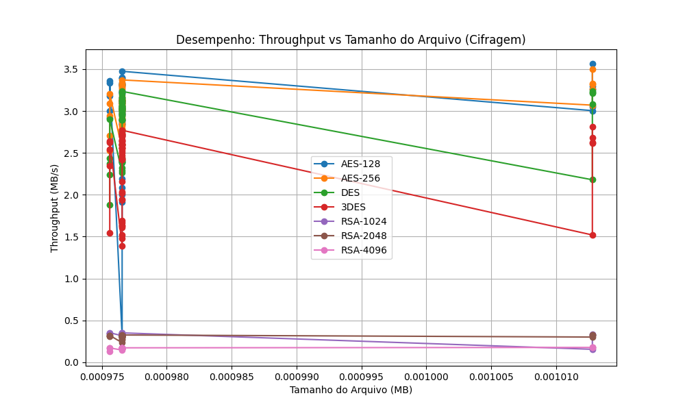
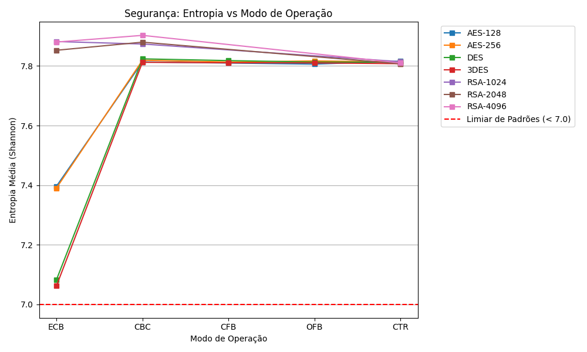

# Relatório de Testes de Criptografia

**Data da Execução:** 12/04/2026 16:33:39

## 1. Tabela de Desempenho Geral

| Arquivo | Alg | Modo | Tam (MB) | T. Cifrar (s) | T. Decifrar (s) | Throughput Cif. (MB/s) | Throughput Dec. (MB/s) | Entropia | Padrões |
|---------|-----|------|----------|---------------|-----------------|------------------------|------------------------|----------|---------|
| csv_categorico_1KB.csv | AES-128 | ECB | 0.0010 | 0.0005 | 0.0011 | 1.9135 | 0.8907 | 7.8033 | ✅ Não |
| csv_categorico_1KB.csv | AES-128 | CBC | 0.0010 | 0.0005 | 0.0009 | 2.0880 | 1.0638 | 7.8054 | ✅ Não |
| csv_categorico_1KB.csv | AES-128 | CFB | 0.0010 | 0.0004 | 0.0009 | 2.1872 | 1.0487 | 7.8143 | ✅ Não |
| csv_categorico_1KB.csv | AES-128 | OFB | 0.0010 | 0.0005 | 0.0010 | 2.0051 | 0.9914 | 7.8057 | ✅ Não |
| csv_categorico_1KB.csv | AES-128 | CTR | 0.0010 | 0.0004 | 0.0009 | 2.3895 | 1.0525 | 7.8286 | ✅ Não |
| csv_categorico_1KB.csv | AES-256 | ECB | 0.0010 | 0.0003 | 0.0017 | 3.2834 | 0.5769 | 7.7955 | ✅ Não |
| csv_categorico_1KB.csv | AES-256 | CBC | 0.0010 | 0.0003 | 0.0010 | 3.0213 | 0.9600 | 7.8202 | ✅ Não |
| csv_categorico_1KB.csv | AES-256 | CFB | 0.0010 | 0.0003 | 0.0010 | 2.9453 | 0.9501 | 7.8043 | ✅ Não |
| csv_categorico_1KB.csv | AES-256 | OFB | 0.0010 | 0.0003 | 0.0009 | 3.2598 | 1.1302 | 7.8245 | ✅ Não |
| csv_categorico_1KB.csv | AES-256 | CTR | 0.0010 | 0.0003 | 0.0008 | 3.0670 | 1.1955 | 7.8353 | ✅ Não |
| csv_categorico_1KB.csv | DES | ECB | 0.0010 | 0.0003 | 0.0012 | 3.1985 | 0.8462 | 7.7405 | ✅ Não |
| csv_categorico_1KB.csv | DES | CBC | 0.0010 | 0.0003 | 0.0012 | 2.9413 | 0.8234 | 7.8299 | ✅ Não |
| csv_categorico_1KB.csv | DES | CFB | 0.0010 | 0.0004 | 0.0011 | 2.3200 | 0.8859 | 7.8326 | ✅ Não |
| csv_categorico_1KB.csv | DES | OFB | 0.0010 | 0.0003 | 0.0011 | 2.8976 | 0.8775 | 7.8103 | ✅ Não |
| csv_categorico_1KB.csv | DES | CTR | 0.0010 | 0.0003 | 0.0009 | 2.9679 | 1.0494 | 7.8056 | ✅ Não |
| csv_categorico_1KB.csv | 3DES | ECB | 0.0010 | 0.0005 | 0.0012 | 2.0220 | 0.8385 | 7.7981 | ✅ Não |
| csv_categorico_1KB.csv | 3DES | CBC | 0.0010 | 0.0004 | 0.0013 | 2.4228 | 0.7704 | 7.8023 | ✅ Não |
| csv_categorico_1KB.csv | 3DES | CFB | 0.0010 | 0.0006 | 0.0014 | 1.6279 | 0.6956 | 7.7937 | ✅ Não |
| csv_categorico_1KB.csv | 3DES | OFB | 0.0010 | 0.0004 | 0.0010 | 2.5021 | 0.9866 | 7.8009 | ✅ Não |
| csv_categorico_1KB.csv | 3DES | CTR | 0.0010 | 0.0004 | 0.0010 | 2.5595 | 1.0180 | 7.8248 | ✅ Não |
| csv_categorico_1KB.csv | RSA-1024 | ECB | 0.0010 | 0.0028 | 0.0113 | 0.3452 | 0.0868 | 7.8737 | ✅ Não |
| csv_categorico_1KB.csv | RSA-1024 | CBC | 0.0010 | 0.0030 | 0.0113 | 0.3241 | 0.0861 | 7.8819 | ✅ Não |
| csv_categorico_1KB.csv | RSA-1024 | CTR | 0.0010 | 0.0029 | 0.0037 | 0.3311 | 0.2638 | 7.7958 | ✅ Não |
| csv_categorico_1KB.csv | RSA-2048 | ECB | 0.0010 | 0.0033 | 0.0170 | 0.2951 | 0.0576 | 7.8485 | ✅ Não |
| csv_categorico_1KB.csv | RSA-2048 | CBC | 0.0010 | 0.0031 | 0.0172 | 0.3139 | 0.0568 | 7.8690 | ✅ Não |
| csv_categorico_1KB.csv | RSA-2048 | CTR | 0.0010 | 0.0031 | 0.0039 | 0.3141 | 0.2514 | 7.8339 | ✅ Não |
| csv_categorico_1KB.csv | RSA-4096 | ECB | 0.0010 | 0.0057 | 0.0512 | 0.1725 | 0.0191 | 7.8814 | ✅ Não |
| csv_categorico_1KB.csv | RSA-4096 | CBC | 0.0010 | 0.0057 | 0.0513 | 0.1709 | 0.0190 | 7.9049 | ✅ Não |
| csv_categorico_1KB.csv | RSA-4096 | CTR | 0.0010 | 0.0057 | 0.0064 | 0.1706 | 0.1533 | 7.8193 | ✅ Não |
| csv_incremental_1KB.csv | AES-128 | ECB | 0.0010 | 0.0003 | 0.0008 | 2.9713 | 1.2245 | 7.6030 | ✅ Não |
| csv_incremental_1KB.csv | AES-128 | CBC | 0.0010 | 0.0003 | 0.0010 | 3.3374 | 1.0276 | 7.8046 | ✅ Não |
| csv_incremental_1KB.csv | AES-128 | CFB | 0.0010 | 0.0003 | 0.0009 | 3.0510 | 1.1270 | 7.7819 | ✅ Não |
| csv_incremental_1KB.csv | AES-128 | OFB | 0.0010 | 0.0032 | 0.0009 | 0.3091 | 1.1218 | 7.7586 | ✅ Não |
| csv_incremental_1KB.csv | AES-128 | CTR | 0.0010 | 0.0003 | 0.0008 | 3.1317 | 1.1975 | 7.7920 | ✅ Não |
| csv_incremental_1KB.csv | AES-256 | ECB | 0.0010 | 0.0003 | 0.0008 | 3.3715 | 1.1672 | 7.6422 | ✅ Não |
| csv_incremental_1KB.csv | AES-256 | CBC | 0.0010 | 0.0004 | 0.0009 | 2.6006 | 1.0879 | 7.8445 | ✅ Não |
| csv_incremental_1KB.csv | AES-256 | CFB | 0.0010 | 0.0004 | 0.0027 | 2.5469 | 0.3626 | 7.8191 | ✅ Não |
| csv_incremental_1KB.csv | AES-256 | OFB | 0.0010 | 0.0003 | 0.0008 | 3.1433 | 1.1977 | 7.8015 | ✅ Não |
| csv_incremental_1KB.csv | AES-256 | CTR | 0.0010 | 0.0003 | 0.0008 | 2.9778 | 1.1901 | 7.8297 | ✅ Não |
| csv_incremental_1KB.csv | DES | ECB | 0.0010 | 0.0003 | 0.0011 | 2.8914 | 0.8915 | 7.2138 | ✅ Não |
| csv_incremental_1KB.csv | DES | CBC | 0.0010 | 0.0004 | 0.0009 | 2.6021 | 1.0427 | 7.8209 | ✅ Não |
| csv_incremental_1KB.csv | DES | CFB | 0.0010 | 0.0004 | 0.0012 | 2.3876 | 0.8355 | 7.7639 | ✅ Não |
| csv_incremental_1KB.csv | DES | OFB | 0.0010 | 0.0003 | 0.0009 | 3.0538 | 1.0458 | 7.8197 | ✅ Não |
| csv_incremental_1KB.csv | DES | CTR | 0.0010 | 0.0003 | 0.0008 | 3.0087 | 1.1659 | 7.8219 | ✅ Não |
| csv_incremental_1KB.csv | 3DES | ECB | 0.0010 | 0.0004 | 0.0009 | 2.4175 | 1.0372 | 7.0813 | ✅ Não |
| csv_incremental_1KB.csv | 3DES | CBC | 0.0010 | 0.0004 | 0.0009 | 2.6467 | 1.0339 | 7.7899 | ✅ Não |
| csv_incremental_1KB.csv | 3DES | CFB | 0.0010 | 0.0006 | 0.0014 | 1.5201 | 0.7201 | 7.7934 | ✅ Não |
| csv_incremental_1KB.csv | 3DES | OFB | 0.0010 | 0.0004 | 0.0012 | 2.5630 | 0.7847 | 7.8182 | ✅ Não |
| csv_incremental_1KB.csv | 3DES | CTR | 0.0010 | 0.0005 | 0.0012 | 1.9391 | 0.8287 | 7.8159 | ✅ Não |
| csv_incremental_1KB.csv | RSA-1024 | ECB | 0.0010 | 0.0028 | 0.0113 | 0.3450 | 0.0864 | 7.8837 | ✅ Não |
| csv_incremental_1KB.csv | RSA-1024 | CBC | 0.0010 | 0.0029 | 0.0112 | 0.3425 | 0.0871 | 7.8938 | ✅ Não |
| csv_incremental_1KB.csv | RSA-1024 | CTR | 0.0010 | 0.0028 | 0.0038 | 0.3428 | 0.2599 | 7.8330 | ✅ Não |
| csv_incremental_1KB.csv | RSA-2048 | ECB | 0.0010 | 0.0031 | 0.0171 | 0.3162 | 0.0570 | 7.8542 | ✅ Não |
| csv_incremental_1KB.csv | RSA-2048 | CBC | 0.0010 | 0.0032 | 0.0172 | 0.3052 | 0.0567 | 7.8660 | ✅ Não |
| csv_incremental_1KB.csv | RSA-2048 | CTR | 0.0010 | 0.0032 | 0.0041 | 0.3083 | 0.2364 | 7.8054 | ✅ Não |
| csv_incremental_1KB.csv | RSA-4096 | ECB | 0.0010 | 0.0058 | 0.0514 | 0.1675 | 0.0190 | 7.8744 | ✅ Não |
| csv_incremental_1KB.csv | RSA-4096 | CBC | 0.0010 | 0.0058 | 0.0514 | 0.1697 | 0.0190 | 7.8933 | ✅ Não |
| csv_incremental_1KB.csv | RSA-4096 | CTR | 0.0010 | 0.0058 | 0.0065 | 0.1692 | 0.1506 | 7.8057 | ✅ Não |
| csv_realista_1KB.csv | AES-128 | ECB | 0.0010 | 0.0003 | 0.0008 | 3.0321 | 1.2058 | 7.7851 | ✅ Não |
| csv_realista_1KB.csv | AES-128 | CBC | 0.0010 | 0.0003 | 0.0009 | 3.3222 | 1.0286 | 7.8203 | ✅ Não |
| csv_realista_1KB.csv | AES-128 | CFB | 0.0010 | 0.0003 | 0.0009 | 3.1000 | 1.1381 | 7.8048 | ✅ Não |
| csv_realista_1KB.csv | AES-128 | OFB | 0.0010 | 0.0003 | 0.0009 | 3.0202 | 1.1323 | 7.8133 | ✅ Não |
| csv_realista_1KB.csv | AES-128 | CTR | 0.0010 | 0.0003 | 0.0009 | 3.3011 | 1.0900 | 7.8166 | ✅ Não |
| csv_realista_1KB.csv | AES-256 | ECB | 0.0010 | 0.0003 | 0.0009 | 3.0129 | 1.0433 | 7.7856 | ✅ Não |
| csv_realista_1KB.csv | AES-256 | CBC | 0.0010 | 0.0003 | 0.0008 | 3.2768 | 1.1662 | 7.8250 | ✅ Não |
| csv_realista_1KB.csv | AES-256 | CFB | 0.0010 | 0.0003 | 0.0009 | 2.8490 | 1.0591 | 7.8287 | ✅ Não |
| csv_realista_1KB.csv | AES-256 | OFB | 0.0010 | 0.0004 | 0.0010 | 2.7891 | 1.0137 | 7.8236 | ✅ Não |
| csv_realista_1KB.csv | AES-256 | CTR | 0.0010 | 0.0003 | 0.0010 | 3.1421 | 0.9871 | 7.8086 | ✅ Não |
| csv_realista_1KB.csv | DES | ECB | 0.0010 | 0.0003 | 0.0008 | 3.1191 | 1.1694 | 7.7810 | ✅ Não |
| csv_realista_1KB.csv | DES | CBC | 0.0010 | 0.0003 | 0.0020 | 3.1315 | 0.4861 | 7.8192 | ✅ Não |
| csv_realista_1KB.csv | DES | CFB | 0.0010 | 0.0004 | 0.0010 | 2.3900 | 0.9531 | 7.7721 | ✅ Não |
| csv_realista_1KB.csv | DES | OFB | 0.0010 | 0.0003 | 0.0009 | 3.2249 | 1.0662 | 7.8282 | ✅ Não |
| csv_realista_1KB.csv | DES | CTR | 0.0010 | 0.0003 | 0.0008 | 3.0045 | 1.1848 | 7.7862 | ✅ Não |
| csv_realista_1KB.csv | 3DES | ECB | 0.0010 | 0.0004 | 0.0010 | 2.7704 | 1.0111 | 7.7963 | ✅ Não |
| csv_realista_1KB.csv | 3DES | CBC | 0.0010 | 0.0004 | 0.0009 | 2.7189 | 1.0328 | 7.8038 | ✅ Não |
| csv_realista_1KB.csv | 3DES | CFB | 0.0010 | 0.0006 | 0.0034 | 1.6104 | 0.2883 | 7.7940 | ✅ Não |
| csv_realista_1KB.csv | 3DES | OFB | 0.0010 | 0.0004 | 0.0010 | 2.6015 | 0.9630 | 7.8431 | ✅ Não |
| csv_realista_1KB.csv | 3DES | CTR | 0.0010 | 0.0004 | 0.0013 | 2.6422 | 0.7620 | 7.8014 | ✅ Não |
| csv_realista_1KB.csv | RSA-1024 | ECB | 0.0010 | 0.0028 | 0.0112 | 0.3510 | 0.0874 | 7.8734 | ✅ Não |
| csv_realista_1KB.csv | RSA-1024 | CBC | 0.0010 | 0.0029 | 0.0113 | 0.3413 | 0.0866 | 7.8706 | ✅ Não |
| csv_realista_1KB.csv | RSA-1024 | CTR | 0.0010 | 0.0031 | 0.0039 | 0.3161 | 0.2476 | 7.8217 | ✅ Não |
| csv_realista_1KB.csv | RSA-2048 | ECB | 0.0010 | 0.0030 | 0.0169 | 0.3255 | 0.0578 | 7.8702 | ✅ Não |
| csv_realista_1KB.csv | RSA-2048 | CBC | 0.0010 | 0.0031 | 0.0173 | 0.3158 | 0.0563 | 7.8856 | ✅ Não |
| csv_realista_1KB.csv | RSA-2048 | CTR | 0.0010 | 0.0031 | 0.0041 | 0.3159 | 0.2409 | 7.7873 | ✅ Não |
| csv_realista_1KB.csv | RSA-4096 | ECB | 0.0010 | 0.0057 | 0.0511 | 0.1713 | 0.0191 | 7.8784 | ✅ Não |
| csv_realista_1KB.csv | RSA-4096 | CBC | 0.0010 | 0.0058 | 0.0513 | 0.1691 | 0.0190 | 7.9094 | ✅ Não |
| csv_realista_1KB.csv | RSA-4096 | CTR | 0.0010 | 0.0058 | 0.0064 | 0.1694 | 0.1516 | 7.8221 | ✅ Não |
| csv_repetitivo_1KB.csv | AES-128 | ECB | 0.0010 | 0.0003 | 0.0009 | 3.4744 | 1.1427 | 6.9760 | ⚠️ Sim |
| csv_repetitivo_1KB.csv | AES-128 | CBC | 0.0010 | 0.0003 | 0.0010 | 3.3163 | 0.9687 | 7.8079 | ✅ Não |
| csv_repetitivo_1KB.csv | AES-128 | CFB | 0.0010 | 0.0003 | 0.0009 | 3.0627 | 1.0771 | 7.8095 | ✅ Não |
| csv_repetitivo_1KB.csv | AES-128 | OFB | 0.0010 | 0.0003 | 0.0008 | 3.1203 | 1.1670 | 7.8051 | ✅ Não |
| csv_repetitivo_1KB.csv | AES-128 | CTR | 0.0010 | 0.0003 | 0.0009 | 3.3222 | 1.0458 | 7.8249 | ✅ Não |
| csv_repetitivo_1KB.csv | AES-256 | ECB | 0.0010 | 0.0003 | 0.0009 | 3.3094 | 1.0577 | 6.9090 | ⚠️ Sim |
| csv_repetitivo_1KB.csv | AES-256 | CBC | 0.0010 | 0.0003 | 0.0009 | 3.1189 | 1.1204 | 7.8207 | ✅ Não |
| csv_repetitivo_1KB.csv | AES-256 | CFB | 0.0010 | 0.0004 | 0.0009 | 2.7668 | 1.0728 | 7.8168 | ✅ Não |
| csv_repetitivo_1KB.csv | AES-256 | OFB | 0.0010 | 0.0003 | 0.0009 | 2.9996 | 1.0733 | 7.8240 | ✅ Não |
| csv_repetitivo_1KB.csv | AES-256 | CTR | 0.0010 | 0.0003 | 0.0010 | 3.1033 | 0.9915 | 7.8048 | ✅ Não |
| csv_repetitivo_1KB.csv | DES | ECB | 0.0010 | 0.0003 | 0.0009 | 3.0508 | 1.1301 | 6.3909 | ⚠️ Sim |
| csv_repetitivo_1KB.csv | DES | CBC | 0.0010 | 0.0003 | 0.0009 | 3.1234 | 1.0863 | 7.8004 | ✅ Não |
| csv_repetitivo_1KB.csv | DES | CFB | 0.0010 | 0.0004 | 0.0010 | 2.2895 | 0.9613 | 7.8332 | ✅ Não |
| csv_repetitivo_1KB.csv | DES | OFB | 0.0010 | 0.0003 | 0.0010 | 2.8927 | 1.0141 | 7.7684 | ✅ Não |
| csv_repetitivo_1KB.csv | DES | CTR | 0.0010 | 0.0003 | 0.0010 | 3.0325 | 0.9394 | 7.8191 | ✅ Não |
| csv_repetitivo_1KB.csv | 3DES | ECB | 0.0010 | 0.0004 | 0.0009 | 2.6960 | 1.0757 | 6.3578 | ⚠️ Sim |
| csv_repetitivo_1KB.csv | 3DES | CBC | 0.0010 | 0.0004 | 0.0011 | 2.5264 | 0.9153 | 7.8112 | ✅ Não |
| csv_repetitivo_1KB.csv | 3DES | CFB | 0.0010 | 0.0006 | 0.0013 | 1.6366 | 0.7363 | 7.7969 | ✅ Não |
| csv_repetitivo_1KB.csv | 3DES | OFB | 0.0010 | 0.0004 | 0.0009 | 2.7131 | 1.0590 | 7.8031 | ✅ Não |
| csv_repetitivo_1KB.csv | 3DES | CTR | 0.0010 | 0.0004 | 0.0015 | 2.6986 | 0.6705 | 7.7989 | ✅ Não |
| csv_repetitivo_1KB.csv | RSA-1024 | ECB | 0.0010 | 0.0028 | 0.0112 | 0.3474 | 0.0871 | 7.8745 | ✅ Não |
| csv_repetitivo_1KB.csv | RSA-1024 | CBC | 0.0010 | 0.0029 | 0.0114 | 0.3383 | 0.0856 | 7.8442 | ✅ Não |
| csv_repetitivo_1KB.csv | RSA-1024 | CTR | 0.0010 | 0.0029 | 0.0039 | 0.3407 | 0.2535 | 7.8116 | ✅ Não |
| csv_repetitivo_1KB.csv | RSA-2048 | ECB | 0.0010 | 0.0036 | 0.0189 | 0.2709 | 0.0518 | 7.8407 | ✅ Não |
| csv_repetitivo_1KB.csv | RSA-2048 | CBC | 0.0010 | 0.0035 | 0.0173 | 0.2806 | 0.0565 | 7.8961 | ✅ Não |
| csv_repetitivo_1KB.csv | RSA-2048 | CTR | 0.0010 | 0.0032 | 0.0041 | 0.3073 | 0.2391 | 7.8114 | ✅ Não |
| csv_repetitivo_1KB.csv | RSA-4096 | ECB | 0.0010 | 0.0057 | 0.0513 | 0.1722 | 0.0190 | 7.8599 | ✅ Não |
| csv_repetitivo_1KB.csv | RSA-4096 | CBC | 0.0010 | 0.0058 | 0.0513 | 0.1692 | 0.0190 | 7.9117 | ✅ Não |
| csv_repetitivo_1KB.csv | RSA-4096 | CTR | 0.0010 | 0.0057 | 0.0065 | 0.1722 | 0.1513 | 7.7905 | ✅ Não |
| dados_aninhados_1KB.json | AES-128 | ECB | 0.0010 | 0.0003 | 0.0009 | 2.9197 | 1.1300 | 7.8297 | ✅ Não |
| dados_aninhados_1KB.json | AES-128 | CBC | 0.0010 | 0.0003 | 0.0010 | 3.1775 | 0.9354 | 7.8202 | ✅ Não |
| dados_aninhados_1KB.json | AES-128 | CFB | 0.0010 | 0.0003 | 0.0009 | 3.0018 | 1.0697 | 7.8345 | ✅ Não |
| dados_aninhados_1KB.json | AES-128 | OFB | 0.0010 | 0.0003 | 0.0009 | 3.3374 | 1.1334 | 7.8049 | ✅ Não |
| dados_aninhados_1KB.json | AES-128 | CTR | 0.0010 | 0.0003 | 0.0009 | 3.3574 | 1.0612 | 7.8221 | ✅ Não |
| dados_aninhados_1KB.json | AES-256 | ECB | 0.0010 | 0.0003 | 0.0010 | 3.2082 | 0.9809 | 7.8099 | ✅ Não |
| dados_aninhados_1KB.json | AES-256 | CBC | 0.0010 | 0.0004 | 0.0012 | 2.7026 | 0.8406 | 7.8118 | ✅ Não |
| dados_aninhados_1KB.json | AES-256 | CFB | 0.0010 | 0.0003 | 0.0013 | 2.9403 | 0.7526 | 7.8111 | ✅ Não |
| dados_aninhados_1KB.json | AES-256 | OFB | 0.0010 | 0.0004 | 0.0011 | 2.5269 | 0.9070 | 7.8294 | ✅ Não |
| dados_aninhados_1KB.json | AES-256 | CTR | 0.0010 | 0.0003 | 0.0010 | 3.0944 | 0.9622 | 7.8122 | ✅ Não |
| dados_aninhados_1KB.json | DES | ECB | 0.0010 | 0.0004 | 0.0011 | 2.3701 | 0.9031 | 7.8159 | ✅ Não |
| dados_aninhados_1KB.json | DES | CBC | 0.0010 | 0.0004 | 0.0010 | 2.2364 | 0.9576 | 7.8279 | ✅ Não |
| dados_aninhados_1KB.json | DES | CFB | 0.0010 | 0.0005 | 0.0011 | 1.8773 | 0.8759 | 7.8207 | ✅ Não |
| dados_aninhados_1KB.json | DES | OFB | 0.0010 | 0.0004 | 0.0009 | 2.4370 | 1.1301 | 7.8058 | ✅ Não |
| dados_aninhados_1KB.json | DES | CTR | 0.0010 | 0.0003 | 0.0010 | 2.9013 | 0.9793 | 7.8034 | ✅ Não |
| dados_aninhados_1KB.json | 3DES | ECB | 0.0010 | 0.0004 | 0.0010 | 2.6254 | 1.0177 | 7.8513 | ✅ Não |
| dados_aninhados_1KB.json | 3DES | CBC | 0.0010 | 0.0004 | 0.0010 | 2.5394 | 1.0154 | 7.8093 | ✅ Não |
| dados_aninhados_1KB.json | 3DES | CFB | 0.0010 | 0.0006 | 0.0012 | 1.5478 | 0.8112 | 7.8434 | ✅ Não |
| dados_aninhados_1KB.json | 3DES | OFB | 0.0010 | 0.0004 | 0.0009 | 2.6386 | 1.0892 | 7.7686 | ✅ Não |
| dados_aninhados_1KB.json | 3DES | CTR | 0.0010 | 0.0004 | 0.0009 | 2.3432 | 1.0557 | 7.8306 | ✅ Não |
| dados_aninhados_1KB.json | RSA-1024 | ECB | 0.0010 | 0.0028 | 0.0113 | 0.3532 | 0.0867 | 7.8738 | ✅ Não |
| dados_aninhados_1KB.json | RSA-1024 | CBC | 0.0010 | 0.0029 | 0.0112 | 0.3390 | 0.0871 | 7.8743 | ✅ Não |
| dados_aninhados_1KB.json | RSA-1024 | CTR | 0.0010 | 0.0029 | 0.0036 | 0.3414 | 0.2677 | 7.8252 | ✅ Não |
| dados_aninhados_1KB.json | RSA-2048 | ECB | 0.0010 | 0.0030 | 0.0169 | 0.3206 | 0.0577 | 7.8398 | ✅ Não |
| dados_aninhados_1KB.json | RSA-2048 | CBC | 0.0010 | 0.0031 | 0.0170 | 0.3137 | 0.0575 | 7.9003 | ✅ Não |
| dados_aninhados_1KB.json | RSA-2048 | CTR | 0.0010 | 0.0031 | 0.0039 | 0.3121 | 0.2514 | 7.8024 | ✅ Não |
| dados_aninhados_1KB.json | RSA-4096 | ECB | 0.0010 | 0.0057 | 0.0521 | 0.1711 | 0.0187 | 7.8858 | ✅ Não |
| dados_aninhados_1KB.json | RSA-4096 | CBC | 0.0010 | 0.0058 | 0.0513 | 0.1695 | 0.0190 | 7.8981 | ✅ Não |
| dados_aninhados_1KB.json | RSA-4096 | CTR | 0.0010 | 0.0075 | 0.0071 | 0.1296 | 0.1371 | 7.8248 | ✅ Não |
| dados_aninhados_1KB.xml | AES-128 | ECB | 0.0010 | 0.0003 | 0.0008 | 3.3955 | 1.1900 | 7.7996 | ✅ Não |
| dados_aninhados_1KB.xml | AES-128 | CBC | 0.0010 | 0.0003 | 0.0009 | 2.8571 | 1.1393 | 7.8338 | ✅ Não |
| dados_aninhados_1KB.xml | AES-128 | CFB | 0.0010 | 0.0003 | 0.0009 | 2.8744 | 1.0496 | 7.8270 | ✅ Não |
| dados_aninhados_1KB.xml | AES-128 | OFB | 0.0010 | 0.0003 | 0.0009 | 3.2995 | 1.1148 | 7.8141 | ✅ Não |
| dados_aninhados_1KB.xml | AES-128 | CTR | 0.0010 | 0.0003 | 0.0009 | 3.1642 | 1.0469 | 7.8154 | ✅ Não |
| dados_aninhados_1KB.xml | AES-256 | ECB | 0.0010 | 0.0003 | 0.0008 | 3.1310 | 1.1804 | 7.8404 | ✅ Não |
| dados_aninhados_1KB.xml | AES-256 | CBC | 0.0010 | 0.0003 | 0.0009 | 3.3131 | 1.0606 | 7.8122 | ✅ Não |
| dados_aninhados_1KB.xml | AES-256 | CFB | 0.0010 | 0.0003 | 0.0009 | 3.0078 | 1.0381 | 7.8195 | ✅ Não |
| dados_aninhados_1KB.xml | AES-256 | OFB | 0.0010 | 0.0003 | 0.0008 | 3.3358 | 1.1562 | 7.7983 | ✅ Não |
| dados_aninhados_1KB.xml | AES-256 | CTR | 0.0010 | 0.0003 | 0.0010 | 2.8240 | 0.9656 | 7.8082 | ✅ Não |
| dados_aninhados_1KB.xml | DES | ECB | 0.0010 | 0.0003 | 0.0009 | 2.8984 | 1.0314 | 7.7230 | ✅ Não |
| dados_aninhados_1KB.xml | DES | CBC | 0.0010 | 0.0004 | 0.0010 | 2.7523 | 0.9953 | 7.8234 | ✅ Não |
| dados_aninhados_1KB.xml | DES | CFB | 0.0010 | 0.0004 | 0.0030 | 2.3995 | 0.3224 | 7.8253 | ✅ Não |
| dados_aninhados_1KB.xml | DES | OFB | 0.0010 | 0.0003 | 0.0009 | 3.0280 | 1.0446 | 7.8332 | ✅ Não |
| dados_aninhados_1KB.xml | DES | CTR | 0.0010 | 0.0003 | 0.0010 | 2.9636 | 0.9672 | 7.8143 | ✅ Não |
| dados_aninhados_1KB.xml | 3DES | ECB | 0.0010 | 0.0004 | 0.0011 | 2.4393 | 0.8870 | 7.7174 | ✅ Não |
| dados_aninhados_1KB.xml | 3DES | CBC | 0.0010 | 0.0004 | 0.0010 | 2.4245 | 1.0122 | 7.8193 | ✅ Não |
| dados_aninhados_1KB.xml | 3DES | CFB | 0.0010 | 0.0007 | 0.0013 | 1.4804 | 0.7579 | 7.7895 | ✅ Não |
| dados_aninhados_1KB.xml | 3DES | OFB | 0.0010 | 0.0005 | 0.0012 | 2.0359 | 0.7859 | 7.8130 | ✅ Não |
| dados_aninhados_1KB.xml | 3DES | CTR | 0.0010 | 0.0005 | 0.0010 | 1.9488 | 0.9365 | 7.7907 | ✅ Não |
| dados_aninhados_1KB.xml | RSA-1024 | ECB | 0.0010 | 0.0028 | 0.0113 | 0.3428 | 0.0865 | 7.8778 | ✅ Não |
| dados_aninhados_1KB.xml | RSA-1024 | CBC | 0.0010 | 0.0029 | 0.0126 | 0.3352 | 0.0778 | 7.8749 | ✅ Não |
| dados_aninhados_1KB.xml | RSA-1024 | CTR | 0.0010 | 0.0029 | 0.0177 | 0.3338 | 0.0552 | 7.7998 | ✅ Não |
| dados_aninhados_1KB.xml | RSA-2048 | ECB | 0.0010 | 0.0031 | 0.0210 | 0.3162 | 0.0464 | 7.8570 | ✅ Não |
| dados_aninhados_1KB.xml | RSA-2048 | CBC | 0.0010 | 0.0031 | 0.0171 | 0.3116 | 0.0571 | 7.8612 | ✅ Não |
| dados_aninhados_1KB.xml | RSA-2048 | CTR | 0.0010 | 0.0031 | 0.0040 | 0.3133 | 0.2421 | 7.8225 | ✅ Não |
| dados_aninhados_1KB.xml | RSA-4096 | ECB | 0.0010 | 0.0057 | 0.0515 | 0.1708 | 0.0190 | 7.8789 | ✅ Não |
| dados_aninhados_1KB.xml | RSA-4096 | CBC | 0.0010 | 0.0058 | 0.0528 | 0.1688 | 0.0185 | 7.9037 | ✅ Não |
| dados_aninhados_1KB.xml | RSA-4096 | CTR | 0.0010 | 0.0057 | 0.0065 | 0.1708 | 0.1512 | 7.8023 | ✅ Não |
| imagem_padrao_1KB.bmp | AES-128 | ECB | 0.0010 | 0.0003 | 0.0009 | 3.5650 | 1.1524 | 6.4174 | ⚠️ Sim |
| imagem_padrao_1KB.bmp | AES-128 | CBC | 0.0010 | 0.0003 | 0.0009 | 3.0045 | 1.1254 | 7.8128 | ✅ Não |
| imagem_padrao_1KB.bmp | AES-128 | CFB | 0.0010 | 0.0003 | 0.0008 | 3.0519 | 1.2377 | 7.7836 | ✅ Não |
| imagem_padrao_1KB.bmp | AES-128 | OFB | 0.0010 | 0.0003 | 0.0009 | 3.2943 | 1.1319 | 7.8497 | ✅ Não |
| imagem_padrao_1KB.bmp | AES-128 | CTR | 0.0010 | 0.0003 | 0.0009 | 3.2612 | 1.1012 | 7.8130 | ✅ Não |
| imagem_padrao_1KB.bmp | AES-256 | ECB | 0.0010 | 0.0003 | 0.0009 | 3.3247 | 1.0995 | 6.4667 | ⚠️ Sim |
| imagem_padrao_1KB.bmp | AES-256 | CBC | 0.0010 | 0.0003 | 0.0025 | 3.2592 | 0.4117 | 7.8153 | ✅ Não |
| imagem_padrao_1KB.bmp | AES-256 | CFB | 0.0010 | 0.0003 | 0.0009 | 3.0700 | 1.1857 | 7.7931 | ✅ Não |
| imagem_padrao_1KB.bmp | AES-256 | OFB | 0.0010 | 0.0003 | 0.0010 | 3.4995 | 1.0342 | 7.8077 | ✅ Não |
| imagem_padrao_1KB.bmp | AES-256 | CTR | 0.0010 | 0.0003 | 0.0010 | 3.3208 | 1.0553 | 7.8294 | ✅ Não |
| imagem_padrao_1KB.bmp | DES | ECB | 0.0010 | 0.0003 | 0.0009 | 3.0845 | 1.1200 | 5.4001 | ⚠️ Sim |
| imagem_padrao_1KB.bmp | DES | CBC | 0.0010 | 0.0003 | 0.0009 | 3.2356 | 1.1471 | 7.8205 | ✅ Não |
| imagem_padrao_1KB.bmp | DES | CFB | 0.0010 | 0.0005 | 0.0010 | 2.1792 | 1.0194 | 7.8397 | ✅ Não |
| imagem_padrao_1KB.bmp | DES | OFB | 0.0010 | 0.0003 | 0.0009 | 3.2109 | 1.0681 | 7.8117 | ✅ Não |
| imagem_padrao_1KB.bmp | DES | CTR | 0.0010 | 0.0003 | 0.0009 | 3.2209 | 1.1131 | 7.8407 | ✅ Não |
| imagem_padrao_1KB.bmp | 3DES | ECB | 0.0010 | 0.0004 | 0.0009 | 2.6805 | 1.0817 | 5.2855 | ⚠️ Sim |
| imagem_padrao_1KB.bmp | 3DES | CBC | 0.0010 | 0.0004 | 0.0009 | 2.6130 | 1.1347 | 7.8192 | ✅ Não |
| imagem_padrao_1KB.bmp | 3DES | CFB | 0.0010 | 0.0007 | 0.0012 | 1.5198 | 0.8728 | 7.8371 | ✅ Não |
| imagem_padrao_1KB.bmp | 3DES | OFB | 0.0010 | 0.0004 | 0.0009 | 2.6243 | 1.1133 | 7.8156 | ✅ Não |
| imagem_padrao_1KB.bmp | 3DES | CTR | 0.0010 | 0.0004 | 0.0010 | 2.8101 | 1.0576 | 7.7952 | ✅ Não |
| imagem_padrao_1KB.bmp | RSA-1024 | ECB | 0.0010 | 0.0030 | 0.0120 | 0.3374 | 0.0845 | 7.9007 | ✅ Não |
| imagem_padrao_1KB.bmp | RSA-1024 | CBC | 0.0010 | 0.0065 | 0.0122 | 0.1548 | 0.0831 | 7.8824 | ✅ Não |
| imagem_padrao_1KB.bmp | RSA-1024 | CTR | 0.0010 | 0.0031 | 0.0040 | 0.3296 | 0.2528 | 7.8242 | ✅ Não |
| imagem_padrao_1KB.bmp | RSA-2048 | ECB | 0.0010 | 0.0034 | 0.0170 | 0.3011 | 0.0596 | 7.8508 | ✅ Não |
| imagem_padrao_1KB.bmp | RSA-2048 | CBC | 0.0010 | 0.0031 | 0.0170 | 0.3265 | 0.0597 | 7.8706 | ✅ Não |
| imagem_padrao_1KB.bmp | RSA-2048 | CTR | 0.0010 | 0.0031 | 0.0038 | 0.3281 | 0.2634 | 7.8106 | ✅ Não |
| imagem_padrao_1KB.bmp | RSA-4096 | ECB | 0.0010 | 0.0057 | 0.0514 | 0.1776 | 0.0197 | 7.8751 | ✅ Não |
| imagem_padrao_1KB.bmp | RSA-4096 | CBC | 0.0010 | 0.0057 | 0.0514 | 0.1772 | 0.0197 | 7.9037 | ✅ Não |
| imagem_padrao_1KB.bmp | RSA-4096 | CTR | 0.0010 | 0.0057 | 0.0064 | 0.1778 | 0.1579 | 7.7923 | ✅ Não |
| texto_aleatorio_1KB.txt | AES-128 | ECB | 0.0010 | 0.0003 | 0.0008 | 3.3961 | 1.1734 | 7.7980 | ✅ Não |
| texto_aleatorio_1KB.txt | AES-128 | CBC | 0.0010 | 0.0003 | 0.0010 | 3.2113 | 0.9904 | 7.8052 | ✅ Não |
| texto_aleatorio_1KB.txt | AES-128 | CFB | 0.0010 | 0.0003 | 0.0021 | 2.9843 | 0.4556 | 7.8234 | ✅ Não |
| texto_aleatorio_1KB.txt | AES-128 | OFB | 0.0010 | 0.0003 | 0.0009 | 2.9666 | 1.1322 | 7.8125 | ✅ Não |
| texto_aleatorio_1KB.txt | AES-128 | CTR | 0.0010 | 0.0003 | 0.0009 | 3.1153 | 1.0712 | 7.7857 | ✅ Não |
| texto_aleatorio_1KB.txt | AES-256 | ECB | 0.0010 | 0.0003 | 0.0008 | 3.3187 | 1.1756 | 7.8052 | ✅ Não |
| texto_aleatorio_1KB.txt | AES-256 | CBC | 0.0010 | 0.0003 | 0.0013 | 2.9184 | 0.7660 | 7.8289 | ✅ Não |
| texto_aleatorio_1KB.txt | AES-256 | CFB | 0.0010 | 0.0004 | 0.0010 | 2.7822 | 0.9820 | 7.8098 | ✅ Não |
| texto_aleatorio_1KB.txt | AES-256 | OFB | 0.0010 | 0.0003 | 0.0009 | 3.1700 | 1.1031 | 7.8012 | ✅ Não |
| texto_aleatorio_1KB.txt | AES-256 | CTR | 0.0010 | 0.0003 | 0.0009 | 3.0827 | 1.1258 | 7.7959 | ✅ Não |
| texto_aleatorio_1KB.txt | DES | ECB | 0.0010 | 0.0003 | 0.0018 | 3.1588 | 0.5546 | 7.8155 | ✅ Não |
| texto_aleatorio_1KB.txt | DES | CBC | 0.0010 | 0.0003 | 0.0009 | 2.9909 | 1.0537 | 7.8320 | ✅ Não |
| texto_aleatorio_1KB.txt | DES | CFB | 0.0010 | 0.0004 | 0.0010 | 2.4455 | 0.9729 | 7.8162 | ✅ Não |
| texto_aleatorio_1KB.txt | DES | OFB | 0.0010 | 0.0003 | 0.0008 | 3.2346 | 1.1535 | 7.8254 | ✅ Não |
| texto_aleatorio_1KB.txt | DES | CTR | 0.0010 | 0.0003 | 0.0009 | 3.0374 | 1.0696 | 7.7971 | ✅ Não |
| texto_aleatorio_1KB.txt | 3DES | ECB | 0.0010 | 0.0004 | 0.0009 | 2.5985 | 1.0384 | 7.8331 | ✅ Não |
| texto_aleatorio_1KB.txt | 3DES | CBC | 0.0010 | 0.0004 | 0.0010 | 2.6139 | 1.0268 | 7.8557 | ✅ Não |
| texto_aleatorio_1KB.txt | 3DES | CFB | 0.0010 | 0.0006 | 0.0012 | 1.6637 | 0.7885 | 7.8207 | ✅ Não |
| texto_aleatorio_1KB.txt | 3DES | OFB | 0.0010 | 0.0004 | 0.0010 | 2.7153 | 0.9981 | 7.8068 | ✅ Não |
| texto_aleatorio_1KB.txt | 3DES | CTR | 0.0010 | 0.0005 | 0.0010 | 2.1586 | 0.9562 | 7.7956 | ✅ Não |
| texto_aleatorio_1KB.txt | RSA-1024 | ECB | 0.0010 | 0.0028 | 0.0133 | 0.3495 | 0.0733 | 7.8889 | ✅ Não |
| texto_aleatorio_1KB.txt | RSA-1024 | CBC | 0.0010 | 0.0029 | 0.0114 | 0.3418 | 0.0860 | 7.8888 | ✅ Não |
| texto_aleatorio_1KB.txt | RSA-1024 | CTR | 0.0010 | 0.0029 | 0.0039 | 0.3400 | 0.2523 | 7.8286 | ✅ Não |
| texto_aleatorio_1KB.txt | RSA-2048 | ECB | 0.0010 | 0.0031 | 0.0170 | 0.3160 | 0.0575 | 7.8527 | ✅ Não |
| texto_aleatorio_1KB.txt | RSA-2048 | CBC | 0.0010 | 0.0031 | 0.0170 | 0.3114 | 0.0573 | 7.8686 | ✅ Não |
| texto_aleatorio_1KB.txt | RSA-2048 | CTR | 0.0010 | 0.0031 | 0.0040 | 0.3157 | 0.2458 | 7.7748 | ✅ Não |
| texto_aleatorio_1KB.txt | RSA-4096 | ECB | 0.0010 | 0.0057 | 0.0515 | 0.1706 | 0.0190 | 7.8782 | ✅ Não |
| texto_aleatorio_1KB.txt | RSA-4096 | CBC | 0.0010 | 0.0057 | 0.0527 | 0.1708 | 0.0185 | 7.9072 | ✅ Não |
| texto_aleatorio_1KB.txt | RSA-4096 | CTR | 0.0010 | 0.0067 | 0.0078 | 0.1455 | 0.1252 | 7.8234 | ✅ Não |
| texto_natural_1KB.txt | AES-128 | ECB | 0.0010 | 0.0003 | 0.0010 | 2.9527 | 0.9849 | 7.8158 | ✅ Não |
| texto_natural_1KB.txt | AES-128 | CBC | 0.0010 | 0.0004 | 0.0011 | 2.7063 | 0.9258 | 7.8147 | ✅ Não |
| texto_natural_1KB.txt | AES-128 | CFB | 0.0010 | 0.0003 | 0.0009 | 2.8338 | 1.0652 | 7.8140 | ✅ Não |
| texto_natural_1KB.txt | AES-128 | OFB | 0.0010 | 0.0003 | 0.0009 | 3.2293 | 1.0637 | 7.8185 | ✅ Não |
| texto_natural_1KB.txt | AES-128 | CTR | 0.0010 | 0.0003 | 0.0008 | 2.8931 | 1.1606 | 7.8288 | ✅ Não |
| texto_natural_1KB.txt | AES-256 | ECB | 0.0010 | 0.0003 | 0.0009 | 3.0937 | 1.0694 | 7.8024 | ✅ Não |
| texto_natural_1KB.txt | AES-256 | CBC | 0.0010 | 0.0003 | 0.0009 | 3.1310 | 1.1267 | 7.8130 | ✅ Não |
| texto_natural_1KB.txt | AES-256 | CFB | 0.0010 | 0.0003 | 0.0009 | 3.0325 | 1.0584 | 7.7987 | ✅ Não |
| texto_natural_1KB.txt | AES-256 | OFB | 0.0010 | 0.0003 | 0.0008 | 2.8681 | 1.1604 | 7.8416 | ✅ Não |
| texto_natural_1KB.txt | AES-256 | CTR | 0.0010 | 0.0003 | 0.0009 | 3.0501 | 1.0984 | 7.7983 | ✅ Não |
| texto_natural_1KB.txt | DES | ECB | 0.0010 | 0.0003 | 0.0009 | 3.0885 | 1.0464 | 7.7254 | ✅ Não |
| texto_natural_1KB.txt | DES | CBC | 0.0010 | 0.0003 | 0.0009 | 3.0503 | 1.1286 | 7.8419 | ✅ Não |
| texto_natural_1KB.txt | DES | CFB | 0.0010 | 0.0004 | 0.0009 | 2.2652 | 1.0298 | 7.8507 | ✅ Não |
| texto_natural_1KB.txt | DES | OFB | 0.0010 | 0.0003 | 0.0009 | 3.1578 | 1.1224 | 7.8114 | ✅ Não |
| texto_natural_1KB.txt | DES | CTR | 0.0010 | 0.0003 | 0.0009 | 3.0679 | 1.0444 | 7.8176 | ✅ Não |
| texto_natural_1KB.txt | 3DES | ECB | 0.0010 | 0.0004 | 0.0009 | 2.6594 | 1.0686 | 7.7348 | ✅ Não |
| texto_natural_1KB.txt | 3DES | CBC | 0.0010 | 0.0004 | 0.0010 | 2.5806 | 1.0006 | 7.8159 | ✅ Não |
| texto_natural_1KB.txt | 3DES | CFB | 0.0010 | 0.0007 | 0.0012 | 1.3916 | 0.8430 | 7.8324 | ✅ Não |
| texto_natural_1KB.txt | 3DES | OFB | 0.0010 | 0.0004 | 0.0010 | 2.6003 | 0.9953 | 7.8127 | ✅ Não |
| texto_natural_1KB.txt | 3DES | CTR | 0.0010 | 0.0004 | 0.0011 | 2.4678 | 0.8679 | 7.7841 | ✅ Não |
| texto_natural_1KB.txt | RSA-1024 | ECB | 0.0010 | 0.0030 | 0.0132 | 0.3275 | 0.0743 | 7.8896 | ✅ Não |
| texto_natural_1KB.txt | RSA-1024 | CBC | 0.0010 | 0.0029 | 0.0114 | 0.3345 | 0.0858 | 7.8803 | ✅ Não |
| texto_natural_1KB.txt | RSA-1024 | CTR | 0.0010 | 0.0029 | 0.0040 | 0.3358 | 0.2462 | 7.7939 | ✅ Não |
| texto_natural_1KB.txt | RSA-2048 | ECB | 0.0010 | 0.0031 | 0.0171 | 0.3154 | 0.0569 | 7.8455 | ✅ Não |
| texto_natural_1KB.txt | RSA-2048 | CBC | 0.0010 | 0.0042 | 0.0181 | 0.2336 | 0.0540 | 7.8873 | ✅ Não |
| texto_natural_1KB.txt | RSA-2048 | CTR | 0.0010 | 0.0031 | 0.0051 | 0.3148 | 0.1926 | 7.8005 | ✅ Não |
| texto_natural_1KB.txt | RSA-4096 | ECB | 0.0010 | 0.0059 | 0.0521 | 0.1660 | 0.0188 | 7.8854 | ✅ Não |
| texto_natural_1KB.txt | RSA-4096 | CBC | 0.0010 | 0.0059 | 0.0519 | 0.1668 | 0.0188 | 7.8892 | ✅ Não |
| texto_natural_1KB.txt | RSA-4096 | CTR | 0.0010 | 0.0059 | 0.0065 | 0.1665 | 0.1502 | 7.8048 | ✅ Não |
| texto_repetitivo_1KB.txt | AES-128 | ECB | 0.0010 | 0.0003 | 0.0008 | 3.3995 | 1.1736 | 6.1345 | ⚠️ Sim |
| texto_repetitivo_1KB.txt | AES-128 | CBC | 0.0010 | 0.0003 | 0.0010 | 3.2449 | 0.9959 | 7.8111 | ✅ Não |
| texto_repetitivo_1KB.txt | AES-128 | CFB | 0.0010 | 0.0003 | 0.0009 | 2.8446 | 1.0309 | 7.8044 | ✅ Não |
| texto_repetitivo_1KB.txt | AES-128 | OFB | 0.0010 | 0.0003 | 0.0009 | 3.2204 | 1.1272 | 7.7801 | ✅ Não |
| texto_repetitivo_1KB.txt | AES-128 | CTR | 0.0010 | 0.0003 | 0.0009 | 3.0341 | 1.1077 | 7.8341 | ✅ Não |
| texto_repetitivo_1KB.txt | AES-256 | ECB | 0.0010 | 0.0003 | 0.0009 | 3.0289 | 1.0851 | 6.0444 | ⚠️ Sim |
| texto_repetitivo_1KB.txt | AES-256 | CBC | 0.0010 | 0.0003 | 0.0008 | 3.1253 | 1.1560 | 7.8001 | ✅ Não |
| texto_repetitivo_1KB.txt | AES-256 | CFB | 0.0010 | 0.0003 | 0.0009 | 2.9103 | 1.1441 | 7.8313 | ✅ Não |
| texto_repetitivo_1KB.txt | AES-256 | OFB | 0.0010 | 0.0003 | 0.0011 | 3.0955 | 0.8565 | 7.8171 | ✅ Não |
| texto_repetitivo_1KB.txt | AES-256 | CTR | 0.0010 | 0.0004 | 0.0009 | 2.7762 | 1.0776 | 7.8149 | ✅ Não |
| texto_repetitivo_1KB.txt | DES | ECB | 0.0010 | 0.0003 | 0.0009 | 3.0953 | 1.0532 | 5.2149 | ⚠️ Sim |
| texto_repetitivo_1KB.txt | DES | CBC | 0.0010 | 0.0003 | 0.0009 | 3.0262 | 1.0678 | 7.8227 | ✅ Não |
| texto_repetitivo_1KB.txt | DES | CFB | 0.0010 | 0.0004 | 0.0010 | 2.4047 | 0.9671 | 7.8256 | ✅ Não |
| texto_repetitivo_1KB.txt | DES | OFB | 0.0010 | 0.0004 | 0.0009 | 2.7623 | 1.1305 | 7.8155 | ✅ Não |
| texto_repetitivo_1KB.txt | DES | CTR | 0.0010 | 0.0003 | 0.0011 | 3.0129 | 0.9144 | 7.8228 | ✅ Não |
| texto_repetitivo_1KB.txt | 3DES | ECB | 0.0010 | 0.0004 | 0.0010 | 2.7267 | 0.9911 | 5.1627 | ⚠️ Sim |
| texto_repetitivo_1KB.txt | 3DES | CBC | 0.0010 | 0.0004 | 0.0010 | 2.5605 | 0.9612 | 7.7960 | ✅ Não |
| texto_repetitivo_1KB.txt | 3DES | CFB | 0.0010 | 0.0006 | 0.0012 | 1.6891 | 0.7903 | 7.8059 | ✅ Não |
| texto_repetitivo_1KB.txt | 3DES | OFB | 0.0010 | 0.0004 | 0.0011 | 2.6436 | 0.9167 | 7.8214 | ✅ Não |
| texto_repetitivo_1KB.txt | 3DES | CTR | 0.0010 | 0.0004 | 0.0011 | 2.7329 | 0.8549 | 7.8388 | ✅ Não |
| texto_repetitivo_1KB.txt | RSA-1024 | ECB | 0.0010 | 0.0029 | 0.0112 | 0.3414 | 0.0871 | 7.8832 | ✅ Não |
| texto_repetitivo_1KB.txt | RSA-1024 | CBC | 0.0010 | 0.0029 | 0.0113 | 0.3368 | 0.0861 | 7.8452 | ✅ Não |
| texto_repetitivo_1KB.txt | RSA-1024 | CTR | 0.0010 | 0.0029 | 0.0037 | 0.3389 | 0.2674 | 7.8097 | ✅ Não |
| texto_repetitivo_1KB.txt | RSA-2048 | ECB | 0.0010 | 0.0030 | 0.0171 | 0.3207 | 0.0571 | 7.8671 | ✅ Não |
| texto_repetitivo_1KB.txt | RSA-2048 | CBC | 0.0010 | 0.0031 | 0.0174 | 0.3113 | 0.0562 | 7.8940 | ✅ Não |
| texto_repetitivo_1KB.txt | RSA-2048 | CTR | 0.0010 | 0.0031 | 0.0039 | 0.3122 | 0.2528 | 7.8216 | ✅ Não |
| texto_repetitivo_1KB.txt | RSA-4096 | ECB | 0.0010 | 0.0058 | 0.0519 | 0.1678 | 0.0188 | 7.9043 | ✅ Não |
| texto_repetitivo_1KB.txt | RSA-4096 | CBC | 0.0010 | 0.0059 | 0.0518 | 0.1658 | 0.0189 | 7.9058 | ✅ Não |
| texto_repetitivo_1KB.txt | RSA-4096 | CTR | 0.0010 | 0.0059 | 0.0066 | 0.1651 | 0.1471 | 7.8155 | ✅ Não |

## 2. Tabelas Resumo (Conforme Exigência do Professor)

### 2.1. Comparativo de Tempos para Arquivos CSV

| Arquivo CSV | Algoritmo | Modo | Tamanho (MB) | T. Cifrar (s) | T. Decifrar (s) |
|-------------|-----------|------|--------------|---------------|-----------------|
| csv_categorico_1KB.csv | AES-128 | ECB | 0.0010 | 0.0005 | 0.0011 |
| csv_categorico_1KB.csv | AES-128 | CBC | 0.0010 | 0.0005 | 0.0009 |
| csv_categorico_1KB.csv | AES-128 | CFB | 0.0010 | 0.0004 | 0.0009 |
| csv_categorico_1KB.csv | AES-128 | OFB | 0.0010 | 0.0005 | 0.0010 |
| csv_categorico_1KB.csv | AES-128 | CTR | 0.0010 | 0.0004 | 0.0009 |
| csv_categorico_1KB.csv | AES-256 | ECB | 0.0010 | 0.0003 | 0.0017 |
| csv_categorico_1KB.csv | AES-256 | CBC | 0.0010 | 0.0003 | 0.0010 |
| csv_categorico_1KB.csv | AES-256 | CFB | 0.0010 | 0.0003 | 0.0010 |
| csv_categorico_1KB.csv | AES-256 | OFB | 0.0010 | 0.0003 | 0.0009 |
| csv_categorico_1KB.csv | AES-256 | CTR | 0.0010 | 0.0003 | 0.0008 |
| csv_categorico_1KB.csv | DES | ECB | 0.0010 | 0.0003 | 0.0012 |
| csv_categorico_1KB.csv | DES | CBC | 0.0010 | 0.0003 | 0.0012 |
| csv_categorico_1KB.csv | DES | CFB | 0.0010 | 0.0004 | 0.0011 |
| csv_categorico_1KB.csv | DES | OFB | 0.0010 | 0.0003 | 0.0011 |
| csv_categorico_1KB.csv | DES | CTR | 0.0010 | 0.0003 | 0.0009 |
| csv_categorico_1KB.csv | 3DES | ECB | 0.0010 | 0.0005 | 0.0012 |
| csv_categorico_1KB.csv | 3DES | CBC | 0.0010 | 0.0004 | 0.0013 |
| csv_categorico_1KB.csv | 3DES | CFB | 0.0010 | 0.0006 | 0.0014 |
| csv_categorico_1KB.csv | 3DES | OFB | 0.0010 | 0.0004 | 0.0010 |
| csv_categorico_1KB.csv | 3DES | CTR | 0.0010 | 0.0004 | 0.0010 |
| csv_categorico_1KB.csv | RSA-1024 | ECB | 0.0010 | 0.0028 | 0.0113 |
| csv_categorico_1KB.csv | RSA-1024 | CBC | 0.0010 | 0.0030 | 0.0113 |
| csv_categorico_1KB.csv | RSA-1024 | CTR | 0.0010 | 0.0029 | 0.0037 |
| csv_categorico_1KB.csv | RSA-2048 | ECB | 0.0010 | 0.0033 | 0.0170 |
| csv_categorico_1KB.csv | RSA-2048 | CBC | 0.0010 | 0.0031 | 0.0172 |
| csv_categorico_1KB.csv | RSA-2048 | CTR | 0.0010 | 0.0031 | 0.0039 |
| csv_categorico_1KB.csv | RSA-4096 | ECB | 0.0010 | 0.0057 | 0.0512 |
| csv_categorico_1KB.csv | RSA-4096 | CBC | 0.0010 | 0.0057 | 0.0513 |
| csv_categorico_1KB.csv | RSA-4096 | CTR | 0.0010 | 0.0057 | 0.0064 |
| csv_incremental_1KB.csv | AES-128 | ECB | 0.0010 | 0.0003 | 0.0008 |
| csv_incremental_1KB.csv | AES-128 | CBC | 0.0010 | 0.0003 | 0.0010 |
| csv_incremental_1KB.csv | AES-128 | CFB | 0.0010 | 0.0003 | 0.0009 |
| csv_incremental_1KB.csv | AES-128 | OFB | 0.0010 | 0.0032 | 0.0009 |
| csv_incremental_1KB.csv | AES-128 | CTR | 0.0010 | 0.0003 | 0.0008 |
| csv_incremental_1KB.csv | AES-256 | ECB | 0.0010 | 0.0003 | 0.0008 |
| csv_incremental_1KB.csv | AES-256 | CBC | 0.0010 | 0.0004 | 0.0009 |
| csv_incremental_1KB.csv | AES-256 | CFB | 0.0010 | 0.0004 | 0.0027 |
| csv_incremental_1KB.csv | AES-256 | OFB | 0.0010 | 0.0003 | 0.0008 |
| csv_incremental_1KB.csv | AES-256 | CTR | 0.0010 | 0.0003 | 0.0008 |
| csv_incremental_1KB.csv | DES | ECB | 0.0010 | 0.0003 | 0.0011 |
| csv_incremental_1KB.csv | DES | CBC | 0.0010 | 0.0004 | 0.0009 |
| csv_incremental_1KB.csv | DES | CFB | 0.0010 | 0.0004 | 0.0012 |
| csv_incremental_1KB.csv | DES | OFB | 0.0010 | 0.0003 | 0.0009 |
| csv_incremental_1KB.csv | DES | CTR | 0.0010 | 0.0003 | 0.0008 |
| csv_incremental_1KB.csv | 3DES | ECB | 0.0010 | 0.0004 | 0.0009 |
| csv_incremental_1KB.csv | 3DES | CBC | 0.0010 | 0.0004 | 0.0009 |
| csv_incremental_1KB.csv | 3DES | CFB | 0.0010 | 0.0006 | 0.0014 |
| csv_incremental_1KB.csv | 3DES | OFB | 0.0010 | 0.0004 | 0.0012 |
| csv_incremental_1KB.csv | 3DES | CTR | 0.0010 | 0.0005 | 0.0012 |
| csv_incremental_1KB.csv | RSA-1024 | ECB | 0.0010 | 0.0028 | 0.0113 |
| csv_incremental_1KB.csv | RSA-1024 | CBC | 0.0010 | 0.0029 | 0.0112 |
| csv_incremental_1KB.csv | RSA-1024 | CTR | 0.0010 | 0.0028 | 0.0038 |
| csv_incremental_1KB.csv | RSA-2048 | ECB | 0.0010 | 0.0031 | 0.0171 |
| csv_incremental_1KB.csv | RSA-2048 | CBC | 0.0010 | 0.0032 | 0.0172 |
| csv_incremental_1KB.csv | RSA-2048 | CTR | 0.0010 | 0.0032 | 0.0041 |
| csv_incremental_1KB.csv | RSA-4096 | ECB | 0.0010 | 0.0058 | 0.0514 |
| csv_incremental_1KB.csv | RSA-4096 | CBC | 0.0010 | 0.0058 | 0.0514 |
| csv_incremental_1KB.csv | RSA-4096 | CTR | 0.0010 | 0.0058 | 0.0065 |
| csv_realista_1KB.csv | AES-128 | ECB | 0.0010 | 0.0003 | 0.0008 |
| csv_realista_1KB.csv | AES-128 | CBC | 0.0010 | 0.0003 | 0.0009 |
| csv_realista_1KB.csv | AES-128 | CFB | 0.0010 | 0.0003 | 0.0009 |
| csv_realista_1KB.csv | AES-128 | OFB | 0.0010 | 0.0003 | 0.0009 |
| csv_realista_1KB.csv | AES-128 | CTR | 0.0010 | 0.0003 | 0.0009 |
| csv_realista_1KB.csv | AES-256 | ECB | 0.0010 | 0.0003 | 0.0009 |
| csv_realista_1KB.csv | AES-256 | CBC | 0.0010 | 0.0003 | 0.0008 |
| csv_realista_1KB.csv | AES-256 | CFB | 0.0010 | 0.0003 | 0.0009 |
| csv_realista_1KB.csv | AES-256 | OFB | 0.0010 | 0.0004 | 0.0010 |
| csv_realista_1KB.csv | AES-256 | CTR | 0.0010 | 0.0003 | 0.0010 |
| csv_realista_1KB.csv | DES | ECB | 0.0010 | 0.0003 | 0.0008 |
| csv_realista_1KB.csv | DES | CBC | 0.0010 | 0.0003 | 0.0020 |
| csv_realista_1KB.csv | DES | CFB | 0.0010 | 0.0004 | 0.0010 |
| csv_realista_1KB.csv | DES | OFB | 0.0010 | 0.0003 | 0.0009 |
| csv_realista_1KB.csv | DES | CTR | 0.0010 | 0.0003 | 0.0008 |
| csv_realista_1KB.csv | 3DES | ECB | 0.0010 | 0.0004 | 0.0010 |
| csv_realista_1KB.csv | 3DES | CBC | 0.0010 | 0.0004 | 0.0009 |
| csv_realista_1KB.csv | 3DES | CFB | 0.0010 | 0.0006 | 0.0034 |
| csv_realista_1KB.csv | 3DES | OFB | 0.0010 | 0.0004 | 0.0010 |
| csv_realista_1KB.csv | 3DES | CTR | 0.0010 | 0.0004 | 0.0013 |
| csv_realista_1KB.csv | RSA-1024 | ECB | 0.0010 | 0.0028 | 0.0112 |
| csv_realista_1KB.csv | RSA-1024 | CBC | 0.0010 | 0.0029 | 0.0113 |
| csv_realista_1KB.csv | RSA-1024 | CTR | 0.0010 | 0.0031 | 0.0039 |
| csv_realista_1KB.csv | RSA-2048 | ECB | 0.0010 | 0.0030 | 0.0169 |
| csv_realista_1KB.csv | RSA-2048 | CBC | 0.0010 | 0.0031 | 0.0173 |
| csv_realista_1KB.csv | RSA-2048 | CTR | 0.0010 | 0.0031 | 0.0041 |
| csv_realista_1KB.csv | RSA-4096 | ECB | 0.0010 | 0.0057 | 0.0511 |
| csv_realista_1KB.csv | RSA-4096 | CBC | 0.0010 | 0.0058 | 0.0513 |
| csv_realista_1KB.csv | RSA-4096 | CTR | 0.0010 | 0.0058 | 0.0064 |
| csv_repetitivo_1KB.csv | AES-128 | ECB | 0.0010 | 0.0003 | 0.0009 |
| csv_repetitivo_1KB.csv | AES-128 | CBC | 0.0010 | 0.0003 | 0.0010 |
| csv_repetitivo_1KB.csv | AES-128 | CFB | 0.0010 | 0.0003 | 0.0009 |
| csv_repetitivo_1KB.csv | AES-128 | OFB | 0.0010 | 0.0003 | 0.0008 |
| csv_repetitivo_1KB.csv | AES-128 | CTR | 0.0010 | 0.0003 | 0.0009 |
| csv_repetitivo_1KB.csv | AES-256 | ECB | 0.0010 | 0.0003 | 0.0009 |
| csv_repetitivo_1KB.csv | AES-256 | CBC | 0.0010 | 0.0003 | 0.0009 |
| csv_repetitivo_1KB.csv | AES-256 | CFB | 0.0010 | 0.0004 | 0.0009 |
| csv_repetitivo_1KB.csv | AES-256 | OFB | 0.0010 | 0.0003 | 0.0009 |
| csv_repetitivo_1KB.csv | AES-256 | CTR | 0.0010 | 0.0003 | 0.0010 |
| csv_repetitivo_1KB.csv | DES | ECB | 0.0010 | 0.0003 | 0.0009 |
| csv_repetitivo_1KB.csv | DES | CBC | 0.0010 | 0.0003 | 0.0009 |
| csv_repetitivo_1KB.csv | DES | CFB | 0.0010 | 0.0004 | 0.0010 |
| csv_repetitivo_1KB.csv | DES | OFB | 0.0010 | 0.0003 | 0.0010 |
| csv_repetitivo_1KB.csv | DES | CTR | 0.0010 | 0.0003 | 0.0010 |
| csv_repetitivo_1KB.csv | 3DES | ECB | 0.0010 | 0.0004 | 0.0009 |
| csv_repetitivo_1KB.csv | 3DES | CBC | 0.0010 | 0.0004 | 0.0011 |
| csv_repetitivo_1KB.csv | 3DES | CFB | 0.0010 | 0.0006 | 0.0013 |
| csv_repetitivo_1KB.csv | 3DES | OFB | 0.0010 | 0.0004 | 0.0009 |
| csv_repetitivo_1KB.csv | 3DES | CTR | 0.0010 | 0.0004 | 0.0015 |
| csv_repetitivo_1KB.csv | RSA-1024 | ECB | 0.0010 | 0.0028 | 0.0112 |
| csv_repetitivo_1KB.csv | RSA-1024 | CBC | 0.0010 | 0.0029 | 0.0114 |
| csv_repetitivo_1KB.csv | RSA-1024 | CTR | 0.0010 | 0.0029 | 0.0039 |
| csv_repetitivo_1KB.csv | RSA-2048 | ECB | 0.0010 | 0.0036 | 0.0189 |
| csv_repetitivo_1KB.csv | RSA-2048 | CBC | 0.0010 | 0.0035 | 0.0173 |
| csv_repetitivo_1KB.csv | RSA-2048 | CTR | 0.0010 | 0.0032 | 0.0041 |
| csv_repetitivo_1KB.csv | RSA-4096 | ECB | 0.0010 | 0.0057 | 0.0513 |
| csv_repetitivo_1KB.csv | RSA-4096 | CBC | 0.0010 | 0.0058 | 0.0513 |
| csv_repetitivo_1KB.csv | RSA-4096 | CTR | 0.0010 | 0.0057 | 0.0065 |

### 2.2. Throughput Médio por Algoritmo/Modo

| Algoritmo | Modo | Throughput Médio Cifrar (MB/s) | Throughput Médio Decifrar (MB/s) |
|-----------|------|--------------------------------|----------------------------------|
| 3DES | CBC | 2.5647 | 0.9903 |
| 3DES | CFB | 1.5687 | 0.7304 |
| 3DES | CTR | 2.4301 | 0.9008 |
| 3DES | ECB | 2.5636 | 1.0047 |
| 3DES | OFB | 2.5638 | 0.9692 |
| AES-128 | CBC | 3.0265 | 1.0201 |
| AES-128 | CFB | 2.8992 | 1.0300 |
| AES-128 | CTR | 3.0970 | 1.0935 |
| AES-128 | ECB | 3.1020 | 1.1268 |
| AES-128 | OFB | 2.7802 | 1.1116 |
| AES-256 | CBC | 3.0467 | 0.9696 |
| AES-256 | CFB | 2.8851 | 0.9605 |
| AES-256 | CTR | 3.0438 | 1.0649 |
| AES-256 | ECB | 3.2082 | 1.0436 |
| AES-256 | OFB | 3.0688 | 1.0632 |
| DES | CBC | 2.9090 | 0.9789 |
| DES | CFB | 2.2959 | 0.8823 |
| DES | CTR | 3.0218 | 1.0428 |
| DES | ECB | 2.9955 | 0.9746 |
| DES | OFB | 2.9900 | 1.0653 |
| RSA-1024 | CBC | 0.3188 | 0.0851 |
| RSA-1024 | CTR | 0.3350 | 0.2366 |
| RSA-1024 | ECB | 0.3440 | 0.0840 |
| RSA-2048 | CBC | 0.3024 | 0.0568 |
| RSA-2048 | CTR | 0.3142 | 0.2416 |
| RSA-2048 | ECB | 0.3098 | 0.0559 |
| RSA-4096 | CBC | 0.1698 | 0.0189 |
| RSA-4096 | CTR | 0.1637 | 0.1476 |
| RSA-4096 | ECB | 0.1707 | 0.0190 |

### 2.3. Entropia Média por Abordagem

| Algoritmo | Modo | Entropia Média | Situação de Segurança |
|-----------|------|----------------|-----------------------|
| 3DES | CBC | 7.8123 | ✅ Alta |
| 3DES | CFB | 7.8107 | ✅ Alta |
| 3DES | CTR | 7.8076 | ✅ Alta |
| 3DES | ECB | 7.0618 | 🆗 Média |
| 3DES | OFB | 7.8103 | ✅ Alta |
| AES-128 | CBC | 7.8136 | ✅ Alta |
| AES-128 | CFB | 7.8097 | ✅ Alta |
| AES-128 | CTR | 7.8161 | ✅ Alta |
| AES-128 | ECB | 7.3962 | 🆗 Média |
| AES-128 | OFB | 7.8063 | ✅ Alta |
| AES-256 | CBC | 7.8192 | ✅ Alta |
| AES-256 | CFB | 7.8132 | ✅ Alta |
| AES-256 | CTR | 7.8137 | ✅ Alta |
| AES-256 | ECB | 7.3901 | 🆗 Média |
| AES-256 | OFB | 7.8169 | ✅ Alta |
| DES | CBC | 7.8239 | ✅ Alta |
| DES | CFB | 7.8180 | ✅ Alta |
| DES | CTR | 7.8129 | ✅ Alta |
| DES | ECB | 7.0821 | 🆗 Média |
| DES | OFB | 7.8130 | ✅ Alta |
| RSA-1024 | CBC | 7.8736 | ✅ Alta |
| RSA-1024 | CTR | 7.8144 | ✅ Alta |
| RSA-1024 | ECB | 7.8819 | ✅ Alta |
| RSA-2048 | CBC | 7.8799 | ✅ Alta |
| RSA-2048 | CTR | 7.8070 | ✅ Alta |
| RSA-2048 | ECB | 7.8526 | ✅ Alta |
| RSA-4096 | CBC | 7.9027 | ✅ Alta |
| RSA-4096 | CTR | 7.8101 | ✅ Alta |
| RSA-4096 | ECB | 7.8802 | ✅ Alta |

## 3. Gráficos de Análise

### Throughput vs Tamanho

### Entropia vs Modo de Operação

